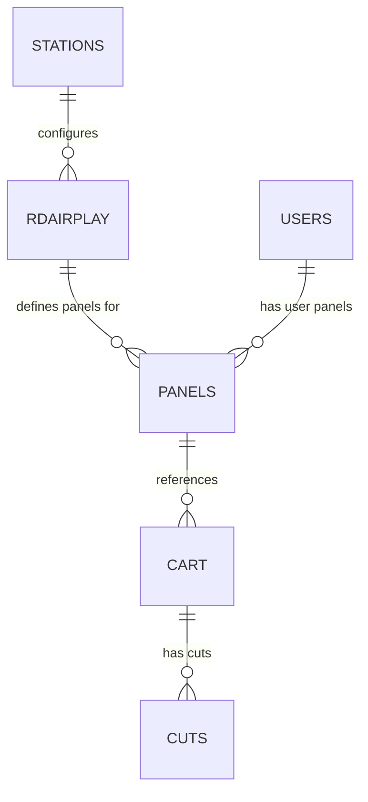
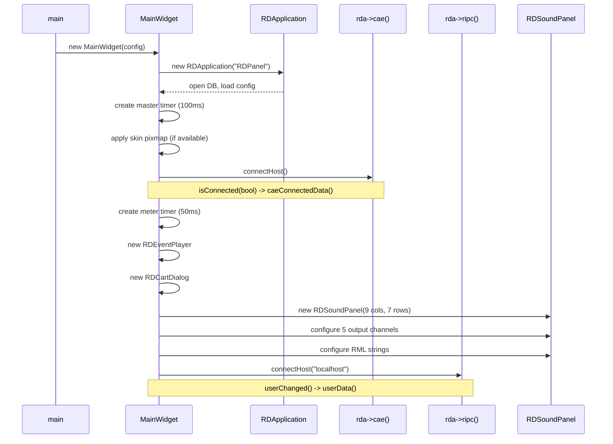
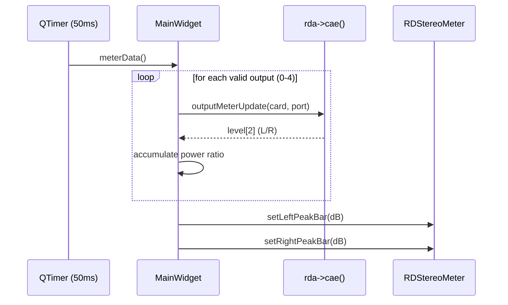
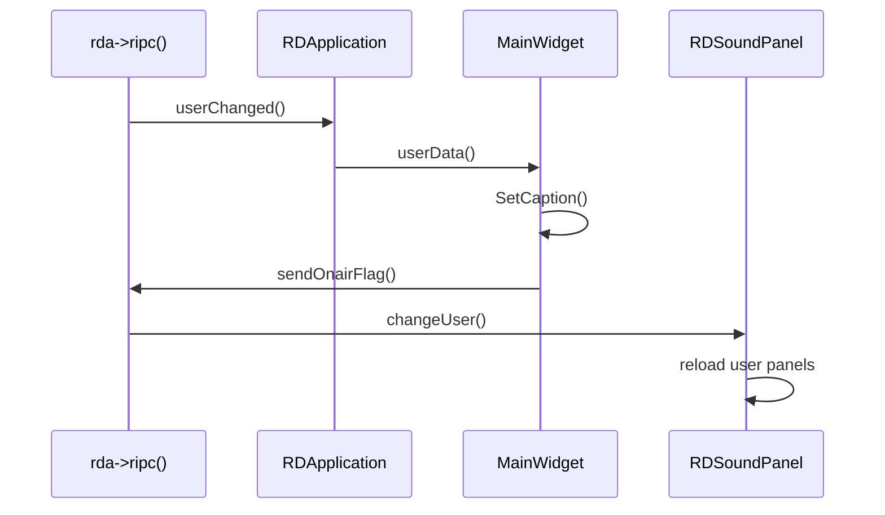

# Semantic Context: PNL (rdpanel)

## Files & Symbols

### Source Files
| File | Type | Symbols | LOC (est) |
|------|------|---------|-----------|
| rdpanel/rdpanel.h | header | MainWidget (class), constants (5 #defines) | ~50 |
| rdpanel/rdpanel.cpp | source | MainWidget (constructor, 10 methods), main() | ~360 |
| rdpanel/globals.h | header | rdaudioport_conf, panel_cart_dialog (extern globals) | ~15 |

### Symbol Index
| Symbol | Kind | File | Qt Class? |
|--------|------|------|-----------|
| MainWidget | Class | rdpanel/rdpanel.h | Yes (Q_OBJECT) |
| main | Function | rdpanel/rdpanel.cpp | No |
| rdaudioport_conf | Global Variable | rdpanel/globals.h | No (extern RDAudioPort*) |
| panel_cart_dialog | Global Variable | rdpanel/globals.h | No (extern RDCartDialog*) |

### Constants
| Constant | Value | File |
|----------|-------|------|
| MASTER_TIMER_INTERVAL | 100 | rdpanel/rdpanel.h |
| METER_INTERVAL | 50 | rdpanel/rdpanel.h |
| RDPANEL_PANEL_BUTTON_ROWS | 7 | rdpanel/rdpanel.h |
| RDPANEL_PANEL_BUTTON_COLUMNS | 9 | rdpanel/rdpanel.h |
| RDPANEL_USAGE | "\n" | rdpanel/rdpanel.h |

## Class API Surface

### MainWidget [Application Main Window]
- **File:** rdpanel/rdpanel.h
- **Inherits:** RDWidget
- **Qt Object:** Yes (Q_OBJECT)
- **Category:** Application main window -- standalone sound panel player

#### Constructor
| Constructor | Parameters | Description |
|-------------|-----------|-------------|
| MainWidget | (RDConfig *c, QWidget *parent=0) | Initializes app: opens DB via RDApplication, sets up CAE/RIPC connections, creates RDSoundPanel with up to 5 audio output channels, configures meter display, creates cart picker dialog |

#### Signals
None defined.

#### Slots
| Slot | Visibility | Parameters | Description |
|------|-----------|-----------|-------------|
| caeConnectedData | private | (bool state) | Called when CAE connects; enables metering on 5 sound panel audio cards |
| userData | private | () | Called on user change; updates window caption and sends on-air flag |
| masterTimerData | private | () | Master clock tick (100ms interval); empty body -- delegates to panel_panel->tickClock() via signal |
| meterData | private | () | Reads audio output levels from CAE for all valid ports; aggregates power ratios and updates stereo meter widget |
| rmlReceivedData | private | (RDMacro *rml) | Receives RML macros from RIPC; delegates to RunLocalMacros() |

#### Public Methods
| Method | Return | Parameters | Brief |
|--------|--------|-----------|-------|
| sizeHint() | QSize | () const | Returns fixed size 935x738 |
| sizePolicy() | QSizePolicy | () const | Returns Fixed/Fixed policy |

#### Protected Methods
| Method | Return | Parameters | Brief |
|--------|--------|-----------|-------|
| wheelEvent | void | (QWheelEvent *e) | Mouse wheel scrolls sound panels up/down via panel_panel->panelUp()/panelDown() |
| closeEvent | void | (QCloseEvent *e) | Removes DB connection and exits |

#### Private Methods
| Method | Return | Parameters | Brief |
|--------|--------|-----------|-------|
| RunLocalMacros | void | (RDMacro *rml) | Placeholder for local RML macro handling (empty body) |
| SetCaption | void | () | Sets window title: "RDPanel vX.Y.Z - Station: {name}, User: {user}" |

#### Fields
| Field | Type | Description |
|-------|------|-------------|
| panel_db | QSqlDatabase* | Database connection |
| panel_master_timer | QTimer* | Master clock timer (100ms) |
| panel_stereo_meter | RDStereoMeter* | Audio level meter widget |
| panel_panel | RDSoundPanel* | Main sound panel widget (button grid) |
| panel_player | RDEventPlayer* | Macro/event player |
| meter_data_valid | bool[PANEL_MAX_OUTPUTS] | Tracks which output ports should be metered (no duplicates) |
| lib_rivendell_map | QPixmap* | Application icon (22x22) |
| panel_filter | QString | Cart picker filter state |
| panel_group | QString | Cart picker group state |
| panel_schedcode | QString | Cart picker scheduler code state |
| panel_empty_cart | RDEmptyCart* | Empty cart drag-drop widget |

#### Enums
None defined in this class.

## Data Model

rdpanel contains NO direct SQL queries. All database access is delegated to LIB classes:

### Tables Used (via LIB dependency)
| Table | Access Via | Operations | Purpose |
|-------|-----------|------------|---------|
| PANELS | RDSoundPanel (LIB) | SELECT, UPDATE | Station and user sound panel button assignments |
| CART | RDSoundPanel (LIB) | SELECT | Cart metadata for panel buttons |
| CUTS | RDSoundPanel (LIB) | SELECT | Audio cut data for playback |
| STATIONS | RDApplication/RDConfig (LIB) | SELECT | Station configuration (drag-drop enable, skin path) |
| RDAIRPLAY | RDAirPlayConf (LIB) | SELECT | Audio channel card/port assignments, panel count, flash settings |
| USERS | RIPC (LIB) | SELECT | User authentication and panel permissions |
| SERVICES | RDSoundPanel (LIB) | SELECT | Default service name for panel |

### ERD (relevant subset)


- **Primary DB connection:** Opened by RDApplication in constructor, removed in closeEvent()
- **No CRUD in artifact scope:** All persistence handled by RDSoundPanel and other LIB classes

## Reactive Architecture

### Signal/Slot Connections
| # | Sender | Signal | Receiver | Slot | File:Line |
|---|--------|--------|----------|------|-----------|
| 1 | panel_master_timer (QTimer) | timeout() | this (MainWidget) | masterTimerData() | rdpanel.cpp:98 |
| 2 | rda->cae() (RDCAEChannel) | isConnected(bool) | this (MainWidget) | caeConnectedData(bool) | rdpanel.cpp:115 |
| 3 | rda (RDApplication) | userChanged() | this (MainWidget) | userData() | rdpanel.cpp:122 |
| 4 | rda->ripc() (RDRipc) | rmlReceived(RDMacro*) | this (MainWidget) | rmlReceivedData(RDMacro*) | rdpanel.cpp:123 |
| 5 | timer (QTimer) | timeout() | this (MainWidget) | meterData() | rdpanel.cpp:130 |
| 6 | rda->ripc() (RDRipc) | userChanged() | panel_panel (RDSoundPanel) | changeUser() | rdpanel.cpp:249 |
| 7 | panel_master_timer (QTimer) | timeout() | panel_panel (RDSoundPanel) | tickClock() | rdpanel.cpp:250 |

### Emit Statements
None in rdpanel. All signals originate from LIB classes (RDApplication, RDRipc, RDCAEChannel, QTimer).

### Key Sequence Diagrams

#### Application Startup


#### Audio Metering Loop (50ms)


#### User Change


### Cross-Artifact Dependencies
| External Class | From Artifact | Used In Files | Purpose |
|---------------|---------------|---------------|---------|
| RDWidget | LIB | rdpanel.h | Base class for MainWidget |
| RDApplication | LIB | rdpanel.cpp | Application framework: DB, config, user, CAE, RIPC |
| RDSoundPanel | LIB | rdpanel.cpp | Main UI: button grid for playing carts from panels |
| RDStereoMeter | LIB | rdpanel.cpp | Audio level meter display |
| RDEventPlayer | LIB | rdpanel.cpp | Macro/event playback |
| RDCartDialog | LIB | rdpanel.cpp, globals.h | Cart picker dialog |
| RDEmptyCart | LIB | rdpanel.cpp | Drag-drop empty cart widget |
| RDConfig | LIB | rdpanel.cpp | Configuration file reader |
| RDAirPlayConf | LIB | rdpanel.cpp | Airplay/panel channel configuration |
| RDRipc | LIB | rdpanel.cpp | RIPC inter-process communication |
| RDMacro | LIB | rdpanel.h | RML macro data structure |
| RDCmdSwitch | LIB | rdpanel.cpp | Command-line argument parsing |

## Business Rules

### Rule: Application Open Failure
- **Source:** rdpanel.cpp:77-79
- **Trigger:** Application startup
- **Condition:** `!rda->open(&err_msg)` -- RDApplication fails to initialize (DB connection, config)
- **Action:** Show critical error dialog and exit(1)
- **Gherkin:**
  ```gherkin
  Scenario: Application fails to open
    Given RDPanel is starting up
    When RDApplication cannot open (DB unavailable, config missing)
    Then a critical error dialog is shown with the error message
    And the application exits with code 1
  ```

### Rule: Unknown Command Option
- **Source:** rdpanel.cpp:86-91
- **Trigger:** Application startup, command-line parsing
- **Condition:** `!rda->cmdSwitch()->processed(i)` -- unrecognized command-line argument
- **Action:** Show critical error dialog with the unknown option and exit(2)
- **Gherkin:**
  ```gherkin
  Scenario: Unknown command-line option provided
    Given RDPanel is starting with command-line arguments
    When an unrecognized option is encountered
    Then a critical error dialog shows "Unknown command option: {option}"
    And the application exits with code 2
  ```

### Rule: Skin Pixmap Application
- **Source:** rdpanel.cpp:105-109
- **Trigger:** Application startup
- **Condition:** Skin pixmap is not null AND width >= 1024 AND height >= 738
- **Action:** Apply skin pixmap as background brush
- **Gherkin:**
  ```gherkin
  Scenario: Custom skin is applied
    Given a skin path is configured in panel configuration
    When the skin pixmap loads successfully
    And the pixmap is at least 1024x738 pixels
    Then the pixmap is set as the window background
  ```

### Rule: Panel Creation Guard
- **Source:** rdpanel.cpp:147-148
- **Trigger:** Application startup
- **Condition:** Station panels > 0 OR user panels > 0 (at least one panel type configured)
- **Action:** Create RDSoundPanel with configured dimensions and audio channels
- **Gherkin:**
  ```gherkin
  Scenario: Sound panels are created
    Given the panel configuration is loaded
    When station panels or user panels are configured (count > 0)
    Then an RDSoundPanel is created with 9 columns and 7 rows
    And up to 5 audio output channels are configured
  ```

### Rule: Audio Channel Fallback
- **Source:** rdpanel.cpp:164-195
- **Trigger:** Sound panel channel configuration
- **Condition:** SoundPanel channel 2-5 card is < 0 (not configured)
- **Action:** Fall back to other channels:
  - Channel 2 falls back to MainLog1Channel
  - Channel 3 falls back to MainLog2Channel
  - Channel 4 falls back to SoundPanel1Channel
  - Channel 5 falls back to CueChannel
- **Gherkin:**
  ```gherkin
  Scenario: Audio channel fallback for unconfigured panel channels
    Given sound panel channel N is not explicitly configured (card < 0)
    When configuring audio outputs for the sound panel
    Then channel 2 uses MainLog1 card/port
    And channel 3 uses MainLog2 card/port
    And channel 4 uses SoundPanel1 card/port
    And channel 5 uses Cue card/port
  ```

### Rule: Duplicate Port Meter Suppression
- **Source:** rdpanel.cpp:200-207
- **Trigger:** Sound panel initialization
- **Condition:** Two output channels share the same card AND port
- **Action:** Mark duplicate as invalid for metering (meter_data_valid[i]=false) to avoid double-counting audio levels
- **Gherkin:**
  ```gherkin
  Scenario: Duplicate audio ports are not metered twice
    Given multiple sound panel outputs share the same card and port
    When calculating meter validity
    Then only the first occurrence is marked valid for metering
    And subsequent duplicates are suppressed
  ```

### Rule: Fader Display Numbering (Unique Outputs)
- **Source:** rdpanel.cpp:213-227
- **Trigger:** Sound panel initialization
- **Condition:** Outputs sharing same card/port get same display number
- **Action:** Unique outputs get incrementing display numbers; duplicates share the number of their first occurrence
- **Gherkin:**
  ```gherkin
  Scenario: Fader display numbers for shared outputs
    Given 5 audio outputs may share card/port combinations
    When assigning fader display numbers
    Then unique card/port combinations get sequential numbers starting from 1
    And duplicate card/port combinations share the number of the first occurrence
  ```

### Rule: Drag-Drop Empty Cart Visibility
- **Source:** rdpanel.cpp:271-273
- **Trigger:** Application startup
- **Condition:** `!rda->station()->enableDragdrop()` -- station has drag-drop disabled
- **Action:** Hide the empty cart drag-drop widget
- **Gherkin:**
  ```gherkin
  Scenario: Empty cart widget hidden when drag-drop disabled
    Given the station configuration has drag-drop disabled
    When the main window is created
    Then the empty cart widget is hidden
  ```

### Rule: Mouse Wheel Panel Navigation
- **Source:** rdpanel.cpp:343-354
- **Trigger:** Mouse wheel event on main window
- **Condition:** Vertical scroll orientation
- **Action:** Wheel up -> panelDown(), Wheel down -> panelUp() (inverted -- scroll through panel pages)
- **Gherkin:**
  ```gherkin
  Scenario: Mouse wheel scrolls through panels
    Given the user scrolls the mouse wheel on the main window
    When the scroll is vertical
    Then scrolling up moves to the previous panel page
    And scrolling down moves to the next panel page
  ```

### Rule: Close Event Cleanup
- **Source:** rdpanel.cpp:357-361
- **Trigger:** Window close event
- **Condition:** Always
- **Action:** Remove database connection and exit(0)
- **Gherkin:**
  ```gherkin
  Scenario: Application closes cleanly
    Given the user closes the RDPanel window
    When the close event fires
    Then the database connection is removed
    And the application exits with code 0
  ```

### State Machines
No explicit state machines in rdpanel. The RDSoundPanel (LIB) manages button states (Idle/Playing/Paused) internally.

### Configuration Keys
rdpanel reads all configuration through LIB classes (no direct QSettings access):

| Config Source | Key/Method | Type | Description |
|---------------|-----------|------|-------------|
| RDAirPlayConf (panelConf) | panels(StationPanel) | int | Number of station panels |
| RDAirPlayConf (panelConf) | panels(UserPanel) | int | Number of user panels |
| RDAirPlayConf (panelConf) | flashPanel() | bool | Whether panel buttons flash |
| RDAirPlayConf (panelConf) | panelPauseEnabled() | bool | Whether pause is enabled on panels |
| RDAirPlayConf (panelConf) | buttonLabelTemplate() | QString | Template for button label text |
| RDAirPlayConf (panelConf) | skinPath() | QString | Path to skin pixmap |
| RDAirPlayConf (panelConf) | card(channel) | int | Audio card number per channel |
| RDAirPlayConf (panelConf) | port(channel) | int | Audio port number per channel |
| RDAirPlayConf (panelConf) | startRml(channel) | QString | RML macro on play start |
| RDAirPlayConf (panelConf) | stopRml(channel) | QString | RML macro on play stop |
| RDAirPlayConf (panelConf) | defaultSvc() | QString | Default service name |
| RDStation | enableDragdrop() | bool | Whether drag-drop is enabled |
| RDConfig | stationName() | QString | Station name for title bar |
| RDConfig | mysqlDbname() | QString | Database name for cleanup |
| RDConfig | password() | QString | RIPC connection password |

### Error Patterns
| Error | Severity | Condition | Message |
|-------|----------|-----------|---------|
| App Open Failed | critical | RDApplication::open() fails | Dynamic error message from open() |
| Unknown Option | critical | Unprocessed command-line switch | "Unknown command option: {key}" |

## UI Contracts

### Window: MainWidget
- **Type:** RDWidget (extends QWidget)
- **Title:** "RDPanel v{VERSION} - Station: {name}, User: {user}"
- **Size:** 935x738 (fixed, non-resizable unless RESIZABLE defined)
- **Layout:** Absolute positioning (no layout manager)
- **Icon:** rdpanel-22x22.xpm
- **Background:** Optional skin pixmap from panelConf->skinPath() (if >= 1024x738)

#### Widgets
| Widget | Type | Position/Geometry | Binding | Description |
|--------|------|-------------------|---------|-------------|
| panel_panel | RDSoundPanel | (10, 10, auto-sized) | Main interaction widget | Sound panel button grid: 9 columns x 7 rows, with station and user panels, 5 output channels |
| panel_stereo_meter | RDStereoMeter | (20, bottom-7, auto-sized) | meterData() updates | Audio level meter at bottom of window, Peak mode |
| panel_empty_cart | RDEmptyCart | (373, bottom-52, 32x32) | Drag-drop target | Empty cart widget for drag-drop; hidden if station drag-drop disabled |

#### Menu Structure
None. No menus, toolbars, or QActions.

#### Actions
None defined. All interaction is through the RDSoundPanel button grid (managed by LIB).

#### Data Flow
- **Source:** Database via RDSoundPanel (loads panel button assignments, cart metadata)
- **Display:** RDSoundPanel renders a grid of buttons (9x7) with cart labels; RDStereoMeter shows audio levels
- **Edit:** Users click panel buttons to play/stop/pause carts; mouse wheel navigates between panel pages; drag-drop cart assignment (if enabled)
- **Save:** Panel button assignments saved by RDSoundPanel to DB; no direct save in MainWidget
- **Audio:** 5 configurable output channels (SoundPanel1-5) with fallback logic; meter data polled at 50ms intervals
- **RML:** Remote Macro Language commands received via RIPC and delegated to RunLocalMacros() (currently empty stub)

#### Window Layout Diagram
```
+---------------------------------------------------+ (935x738)
|  RDPanel v3.6.7 - Station: X, User: Y     [x]    |
+---------------------------------------------------+
|                                                     |
|  +-----------------------------------------------+ |
|  |                                                 | |
|  |           RDSoundPanel (9x7 grid)              | |
|  |                                                 | |
|  |  [Btn] [Btn] [Btn] [Btn] [Btn] [Btn] [Btn] .. | |
|  |  [Btn] [Btn] [Btn] [Btn] [Btn] [Btn] [Btn] .. | |
|  |  [Btn] [Btn] [Btn] [Btn] [Btn] [Btn] [Btn] .. | |
|  |  ...                                           | |
|  |  (with panel page navigation, output selectors)| |
|  |                                                 | |
|  +-----------------------------------------------+ |
|                                                     |
|  [====== Stereo Meter (L/R) ======]    [EmptyCart]  |
+-----------------------------------------------------+
```

