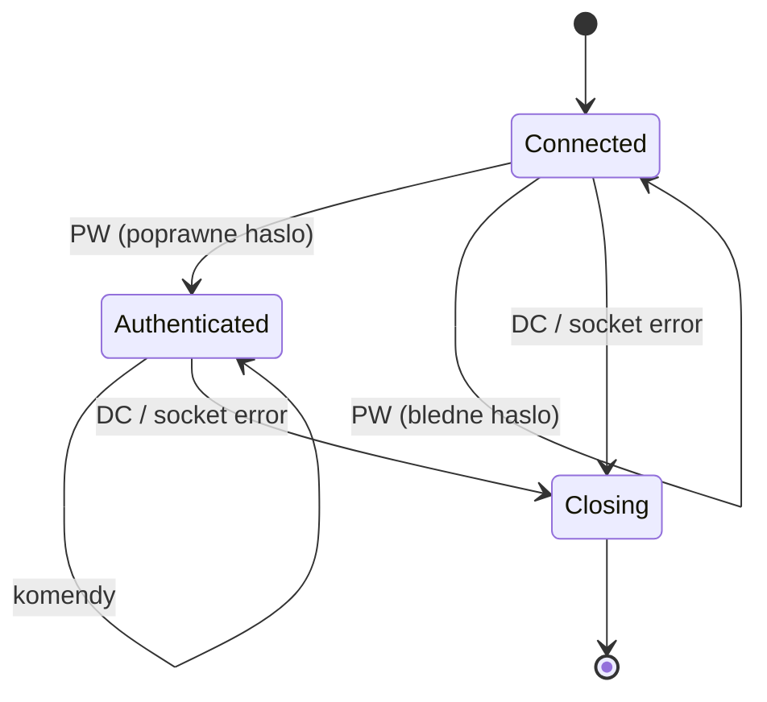
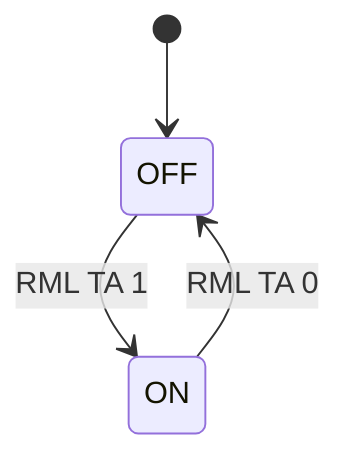
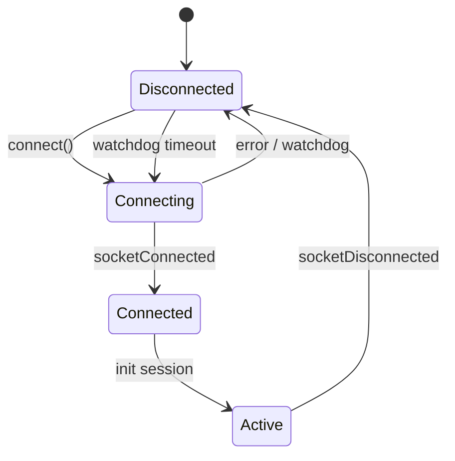

# SPEC: ripcd (RPC/IPC Daemon)
## Behavioral Specification -- WHAT without HOW

> Dokument ten opisuje CO system robi i JAKIE MA ZACHOWANIE.
> Jest **nawigacyjnym PRD** -- podsumowuje i linkuje do szczegolow w fazach 2-5.
> Agenci kodujacy czytaja FEAT pliki (Phase 7) ktore zawieraja kompletne dane.

### Zrodla szczegolow

| Dokument | Zawiera | Czytaj gdy |
|----------|---------|-----------|
| `inventory.md` | Pelne API klas, sygnaly, sloty, 47 klas | Potrzebujesz sygnatury metody |
| `ui-contracts.md` | N/A (headless daemon) | - |
| `data-model.md` | 7 tabel DB z ERD Mermaid | Potrzebujesz schematu DB |
| `call-graph.md` | ~120 connect(), sequence diagrams, protokol | Potrzebujesz grafu zdarzen |
| `facts.md` | 58 faktow, 14 use cases, reguly Gherkin | Potrzebujesz regul z dowodami |

---

## Sekcja 1 -- Project Overview

**Czym jest ripcd:**
ripcd to centralny demon IPC (Interprocess Communication) systemu Rivendell Radio Automation. Pelni dwie role: (1) jest brokerem komunikacji miedzy aplikacjami Rivendell a sprzetem audio/GPIO (switchers, routery, karty GPIO) oraz (2) jest serwerem protokolu RIPC i wykonawca komend RML (Rivendell Macro Language). Kazda stacja robocza Rivendell uruchamia jedna instancje ripcd.

**Glowni aktorzy:**

| Aktor | Rola |
|-------|------|
| Aplikacje Rivendell (rdairplay, rdlibrary, etc.) | Klienci RIPC -- wysylaja komendy, odbieraja notyfikacje GPIO i stanu |
| Operator | Posrednio via aplikacje -- steruje GPIO, routingiem audio, makrami |
| Administrator | Konfiguruje macierze, GPIO, TTY w bazie danych |
| Sprzet audio/GPIO | Switchers, routery, karty GPIO -- komunikuja sie z ripcd via drivery |

**Kluczowe wartosci biznesowe:**
- Centralizacja kontroli nad sprzetem audio na stacji roboczej
- Unifikacja 42 roznych protokolow sprzetowych w jeden interfejs (Switcher)
- Automatyzacja poprzez mapowanie GPIO -> makro cart
- Wspoldzielony stan GPIO widoczny przez wszystkie aplikacje jednoczesnie

---

## Sekcja 2 -- Domain Model

### Encje biznesowe

| Encja | Opis | Kluczowe pola | Pelne API |
|-------|------|--------------|-----------|
| MainObject | Singleton demona -- broker IPC, RML, GPIO | switcher[], gpi_state[][], macro[] | `inventory.md#MainObject` |
| Switcher | Abstrakcyjna baza driverow sprzetu | matrix_number, station_name | `inventory.md#Switcher` |
| RipcdConnection | Polaczenie klienta RIPC | id, socket, authenticated, accum | `inventory.md#RipcdConnection` |
| StarGuideFeed | DTO feedu StarGuide | provider_id, service_id, mode | `inventory.md#StarGuideFeed` |
| UnityFeed | DTO feedu Unity | feed, mode | `inventory.md#UnityFeed` |
| 42 Switcher drivers | Konkretne implementacje dla sprzetu | (rozne per producent) | `inventory.md` sekcja "Drivery" |

### Relacje

```
MainObject 1──────────8 Switcher[MAX_MATRICES]  (macierze switcher/GPIO)
MainObject 1──────────N RipcdConnection          (klienci RIPC)
MainObject 1──────────8 RDTTYDevice[MAX_TTYS]    (porty szeregowe)
Switcher   <|─────────  42 driver subclasses     (polimorfizm)
```

### Enums (kluczowe z librd)

| Enum | Wartosci | Znaczenie |
|------|----------|-----------|
| RDMatrix::Type | Acu1p, Am16, Bt10x1, ... (42 typy) | Typ drivera switcher/GPIO |
| RDMatrix::GpioType | GpioInput, GpioOutput | Kierunek pinu GPIO |
| RDMacro::Command | BO, GI, GE, JC, JD, JZ, LO, MB, MT, RN, SI, SC, SO, SY, SZ, TA, UO, CL, FS, GO, ST, SA, SD, SG, SR, SL, SX | Komenda RML |
| RDTty::Termination | CrTerm, LfTerm, CrLfTerm, NoTerm | Terminator linii serial |

---

## Sekcja 3 -- Data Model (schemat DB)

> Pelny ERD i szczegoly kolumn: `data-model.md`

ripcd **czyta** konfiguracje z 7 tabel DB (nie tworzy schematu):

| Tabela | Opis | Operacje | Encja domenowa |
|--------|------|----------|----------------|
| MATRICES | Konfiguracja macierzy audio/switcher | R | RDMatrix (librd) |
| GPIS | Mapowanie GPI pin -> makro cart | R, U | MainObject GPIO state |
| GPOS | Mapowanie GPO pin -> makro cart | R, U | MainObject GPIO state |
| TTYS | Konfiguracja portow szeregowych | R | RDTTYDevice (librd) |
| INPUTS | Wejscia switcher/router | R, D, C | Driver-specific |
| OUTPUTS | Wyjscia switcher/router | R, D, C | Driver-specific |
| VGUEST_RESOURCES | Zasoby Logitek vGuest | R | VGuest driver |
| GPIO_EVENTS | Audit log zdarzen GPIO | C | Switcher base |

### Kluczowe relacje FK

```
MATRICES.STATION_NAME -> STATIONS.NAME
GPIS.MATRIX           -> MATRICES.MATRIX
GPOS.MATRIX           -> MATRICES.MATRIX
INPUTS.MATRIX         -> MATRICES.MATRIX
OUTPUTS.MATRIX        -> MATRICES.MATRIX
```

---

## Sekcja 4 -- Functional Capabilities (Use Cases)

| ID | Aktor | Akcja | Efekt biznesowy | Priorytet |
|----|-------|-------|----------------|-----------|
| UC-001 | Aplikacja | Polacz sie z ripcd via TCP | Sesja RIPC ustanowiona | MUST |
| UC-002 | Aplikacja | Uwierzytelnij sesje (PW) | Dostep do komend uprzywilejowanych | MUST |
| UC-003 | Aplikacja | Wyslij komende RML (MS) | Komenda wykonana lokalnie lub forwarded | MUST |
| UC-004 | Operator | Steruj GPIO (GO via RML) | Pin GPIO zmienia stan na sprzecie | MUST |
| UC-005 | Operator | Zmien crosspoint (ST via RML) | Wejscie przelaczone na wyjscie w switcher | MUST |
| UC-006 | Operator | Zmien on-air flag (TA) | Wszystkie aplikacje wiedza o stanie transmisji | MUST |
| UC-007 | System | Reaguj na zmiane GPIO z drivera | Broadcast + makro cart + log | MUST |
| UC-008 | Operator | Ustaw mapowanie GPIO -> cart (GI) | Pin GPIO automatycznie uruchamia makro | SHOULD |
| UC-009 | Operator | Maskuj pin GPIO (GE) | Pin GPIO ignorowany/aktywny | SHOULD |
| UC-010 | Operator | Polacz porty JACK audio (JC) | Routing audio via JACK | SHOULD |
| UC-011 | Operator | Wyslij dane na serial (SO/BO) | Komunikacja z urzadzeniami serial | SHOULD |
| UC-012 | Operator | Wyswietl popup (MB) | Powiadomienie na wskazanym ekranie | COULD |
| UC-013 | Admin | Hot-reload drivera (SZ) | Driver przeladowany z nowa konfiguracja | SHOULD |
| UC-014 | Admin | Restart portu serial (SY) | Port TTY przeladowany z konfiguracja DB | COULD |

-> Pelne reguly: `facts.md`

---

## Sekcja 5 -- Business Rules (Gherkin)

> Kluczowe reguly definiujace zachowanie systemu.
> Kompletna lista z source references: `facts.md`

```gherkin
Rule: Autentykacja RIPC
  Scenario: Klient musi sie uwierzytelnic przed uzyciem komend
    Given klient polaczony z ripcd via TCP
    When  klient wysyla komende uprzywilejowana bez PW
    Then  ripcd odrzuca komende (odpowiedz z "-!")

Rule: GPIO broadcast
  Scenario: Kazda zmiana GPIO broadcastowana do wszystkich klientow
    Given driver wykryl zmiane stanu pinu GPIO
    When  emituje gpiChanged/gpoChanged
    Then  MainObject broadcastuje stan do WSZYSTKICH uwierzytelnionych klientow
    And   uruchamia makro cart jesli maska aktywna i cart przypisany

Rule: GPIO maskowanie
  Scenario: Zamaskowany pin nie triggeruje makra
    Given pin GPI zamaskowany (mask = false)
    When  stan pinu sie zmienia
    Then  broadcast jest wysylany (ze stanem maski)
    But   makro cart NIE jest uruchamiany

Rule: RML local loopback
  Scenario: RML do localhost wykonywany lokalnie
    Given komenda RML z adresem = adres lokalnej stacji
    When  adres docelowy == localhost i port == echo/noecho
    Then  komenda wykonywana przez RunLocalMacros (nie UDP)

Rule: Driver factory
  Scenario: Macierz ladowana dynamicznie na podstawie typu z DB
    Given numer macierzy i konfiguracja w tabeli MATRICES
    When  LoadSwitchDriver() wywolane
    Then  tworzy odpowiedni Switcher subclass
    And   laczy 5 sygnalow (rmlEcho, gpiChanged, gpoChanged, gpiState, gpoState)
```

---

## Sekcja 6 -- State Machines

### RipcdConnection



### On-Air Flag



### TCP Driver (typowy)



---

## Sekcja 7 -- Reactive Architecture

### Kluczowe przeplywy zdarzen

**Przeplyw 1: Klient RIPC -> komenda RML -> sprzet**
```
[Aplikacja] --TCP--> [ripcd: DispatchCommand]
    -> [RunLocalMacros] --switch(cmd)--> [Switcher::processCommand]
    -> [driver] --serial/TCP--> [Sprzet]
```

**Przeplyw 2: Sprzet -> GPIO change -> broadcast**
```
[Sprzet] --serial/TCP--> [driver] --emit gpiChanged-->
    [MainObject::gpiChangedData]
    -> aktualizuj state
    -> BroadcastCommand -> [WSZYSTKIE klienty RIPC]
    -> ExecCart (jesli maska aktywna + cart przypisany)
```

**Przeplyw 3: RML forwarding (multi-host)**
```
[Aplikacja] --RIPC MS--> [ripcd A]
    -> jesli adres == localhost: RunLocalMacros
    -> jesli adres != localhost: --UDP--> [ripcd B na zdalnym hoscie]
```

### Cross-artifact komunikacja

| Zrodlo | Zdarzenie | Cel | Efekt |
|--------|-----------|-----|-------|
| Aplikacje Rivendell | Komendy RIPC (TCP:5006) | ripcd | Sterowanie sprzetem, zmiana uzytkownika |
| Aplikacje Rivendell | Komendy RML (UDP:5858/5859) | ripcd | Wykonanie makr, sterowanie GPIO |
| ripcd | RML forwarding (UDP) | inne stacje ripcd | Zdalne sterowanie |
| ripcd | Multicast notifications | Aplikacje Rivendell | Powiadomienia systemowe |
| ripcd | via RDCae | caed | Polaczenie z audio engine |

-> Pelny graf: `call-graph.md`

---

## Sekcja 8 -- UI/UX Contracts

### Status: N/A (headless daemon)

ripcd jest headless daemon bez interfejsu graficznego. Jedynymi interfejsami sa protokoly sieciowe (RIPC TCP, RML UDP, multicast) i komunikacja serial z urzadzeniami.

-> `ui-contracts.md` -- zawiera potwierdzenie braku UI

---

## Sekcja 9 -- API & Protocol Contracts

### RIPC Protocol (TCP:5006 -> ripcd)

**Unprivileged commands (bez autentykacji):**

| Komenda | Parametry | Odpowiedz | Znaczenie |
|---------|-----------|-----------|-----------|
| DC | - | (zamyka polaczenie) | Drop Connection |
| PW | passwd | PW +! / PW -! | Autentykacja |

**Privileged commands (wymagaja PW):**

| Komenda | Parametry | Odpowiedz | Znaczenie |
|---------|-----------|-----------|-----------|
| RU | - | RU username! | Request current user |
| SU | username | (broadcast RU username!) | Set user / login |
| MS | ip_addr echo rml | - | Send RML to host |

**Broadcast messages (ripcd -> klienci):**

| Komenda | Parametry | Znaczenie |
|---------|-----------|-----------|
| GI | matrix line state mask | Zmiana stanu GPI |
| GO | matrix line state mask | Zmiana stanu GPO |
| GC | matrix line off_cart on_cart | Zmiana GPI cart mapping |
| GD | matrix line off_cart on_cart | Zmiana GPO cart mapping |
| GM | matrix line mask | Zmiana GPI mask |
| GN | matrix line mask | Zmiana GPO mask |
| TA | state | Zmiana on-air flag |
| RU | username | Zmiana uzytkownika |

### RML Protocol (UDP:5858/5859 -> ripcd)

**Komendy obslugiwane lokalnie przez ripcd:**

| Komenda | Parametry | Znaczenie |
|---------|-----------|-----------|
| BO | tty_port hex_bytes... | Binary Output na serial |
| GI | matrix I/O gpi state cart | Set GPIO macro cart |
| GE | matrix I/O gpi mask | Enable/disable GPIO mask |
| JC | port_in port_out | JACK Connect |
| JD | port_in port_out | JACK Disconnect |
| JZ | - | JACK Disconnect All |
| LO | [user pass] | Login user |
| MB | display severity message | Message Box (popup) |
| MT | timer_id interval cart | Macro Timer |
| RN | command_args | Run external process |
| SI | tty_port cart_id pattern | Serial Input trap |
| SC | tty_port [cart_id [pattern]] | Serial Clear trap |
| SO | tty_port data | Serial Output |
| SY | tty_port | Sync TTY (restart) |
| SZ | matrix | Sync Switcher (reload driver) |
| TA | 0/1 | On-Air flag |
| UO | ip_addr port data | UDP Output |

**Komendy delegowane do Switcher::processCommand:**

| Komenda | Parametry | Znaczenie |
|---------|-----------|-----------|
| CL | matrix ... | Crosspoint Load |
| FS | matrix salvo | Fire Salvo |
| GO | matrix I/O line state duration | GPIO Output |
| ST | matrix input output | Crosspoint Take |
| SA | matrix ... | Source Address |
| SD | matrix ... | Source Disconnect |
| SG | matrix ... | Source Gain |
| SR | matrix ... | Source Route |
| SL | matrix ... | Silence Level |
| SX | matrix ... | Special (driver-specific) |

---

## Sekcja 10 -- Data Flow

```
[MySQL DB] --SELECT--> [MainObject: LoadGpiTable/LoadLocalMacros]
    -> [ripcd_gpi_macro[][], ripcd_switcher[], ripcd_tty_dev[]]
    
[Klient RIPC] --TCP:5006--> [DispatchCommand]
    -> [RunLocalMacros] -> [Switcher::processCommand]
    -> [Driver] --serial/TCP--> [Sprzet]

[Sprzet] -> [Driver] --emit--> [MainObject]
    -> [BroadcastCommand] --TCP:5006--> [WSZYSTKIE klienty RIPC]
    -> [ExecCart] --UDP:5858--> [self/RunLocalMacros]
```

| Transformacja | Od | Do | Co sie zmienia |
|--------------|----|----|----------------|
| DB config -> runtime state | Tabele MATRICES/GPIS/GPOS/TTYS | Tablice C++ w pamieci | Dane SQL -> struktury w RAM |
| RIPC text cmd -> RDMacro | String "MS addr port cmd!" | Obiekt RDMacro | Parsowanie protokolu tekstowego |
| RDMacro -> device protocol | Obiekt RDMacro | Bajty serial/TCP | Kodowanie do protokolu urzadzenia |
| Device response -> GPIO signal | Bajty serial/TCP | emit gpiChanged() | Dekodowanie odpowiedzi urzadzenia |
| GPIO signal -> RIPC broadcast | emit gpiChanged() | "GI matrix line state mask!" | Konwersja na broadcast tekstowy |

---

## Sekcja 11 -- Error Taxonomy

| Typ | Kategoria | Co wywoluje | Zachowanie | Komunikat |
|-----|-----------|-------------|-----------|-----------|
| PW -! | Auth failure | Bledne haslo | Odmowa dostepu | "PW -!" do klienta |
| CMD -! | Command failure | Komenda z zla liczba argumentow | Odmowa jesli echo | "{cmd} -!" do klienta |
| NULL switcher | Missing driver | Komenda do niezaladowanej macierzy | Odmowa jesli echo | acknowledge(false) |
| Socket error | Connection lost | Zerwane polaczenie TCP z klientem/driverem | Garbage collection / reconnect | syslog warning |
| TTY open fail | Device error | Port serial niedostepny | Pomija port, loguje | syslog error |
| JACK error | Audio error | jack_connect/disconnect failed | Loguje warning, acknowledge(false) | syslog warning |
| Unable to bind | Startup fatal | Port TCP 5006 zajety | exit(1) | stderr + syslog |

---

## Sekcja 12 -- Integration Contracts

### Cross-artifact

| Artifact | Mechanizm | Kierunek | Kontrakt |
|----------|-----------|---------|---------|
| LIB (librd) | Linked library | IN | RDApplication, RDMatrix, RDMacro, RDStation, RDConfig, RDSqlQuery, RDUser, RDTTYDevice, RDCodeTrap, RDMulticaster |
| HPI (librdhpi) | Linked library (opcjonalne) | IN | LocalAudio driver -- AudioScience HPI GPIO |
| CAE (caed) | TCP via RDCae | OUT | Polaczenie z audio engine |
| Aplikacje (rdairplay etc.) | TCP RIPC + UDP RML | IN | Protokoly RIPC/RML |

### Zewnetrzne systemy

| System | Rola | Protokol | Dane |
|--------|------|----------|------|
| MySQL/MariaDB | Konfiguracja | SQL via QtSql | Tabele MATRICES, GPIS, GPOS, TTYS, INPUTS, OUTPUTS |
| JACK Audio Server | Audio routing | C API (jack_connect etc.) | Nazwy portow, polaczenia |
| 42 typy urzadzen audio | Switcher/GPIO | Serial RS-232/485, TCP/IP, HTTP, Multicast, Modbus, Kernel GPIO | Crosspoint, GPIO state |

---

## Sekcja 13 -- Platform Independence Map

| Funkcja | Oryginal | Klon (propozycja) | Priorytet |
|---------|----------|------|-----------|
| Audio hardware GPIO | AudioScience HPI (ifdef HPI) | Generic audio card API | HIGH |
| JACK audio routing | libjack C API (ifdef JACK) | Platform audio routing abstraction | HIGH |
| Serial communication | /dev/ttyS* via RDTTYDevice | Cross-platform serial (e.g. libserialport) | HIGH |
| Kernel GPIO | /dev/gpio via ioctl | Platform GPIO abstraction | HIGH |
| Process spawning | fork()+exec(), seteuid/setegid | Platform process management | MEDIUM |
| Signal handling | POSIX signal() SIGCHLD/SIGTERM/SIGINT | Platform signal/event | MEDIUM |
| System logging | syslog via rda->syslog() | Platform logging framework | LOW |
| MySQL database | MySQL/MariaDB via QtSql | Portable database layer | CRITICAL |

---

## Sekcja 14 -- Non-Functional Requirements

```gherkin
Scenario: ripcd musi obslugiwac wielu klientow RIPC jednoczesnie
  Given N klientow polaczonych via TCP
  When  kazdy wysyla komendy
  Then  ripcd obsluguje je sekwencyjnie (single-threaded Qt event loop)

Scenario: Zmiana GPIO musi byc broadcastowana natychmiast
  Given driver wykryl zmiane stanu
  When  emituje gpiChanged
  Then  broadcast do klientow w ramach tej samej iteracji event loop

Scenario: Reconnect drivera TCP po zerwaniu polaczenia
  Given driver TCP (Harlond, VGuest, etc.) utracil polaczenie
  When  watchdog timeout wygasa
  Then  driver probuje reconnect (cyklicznie)

Scenario: ripcd musi dzialac jako daemon (background)
  Given ripcd uruchomiony bez parametru -d
  When  inicjalizacja zakonczona
  Then  ripcd dziala w tle (no GUI, QApplication false)
```

---

## Sekcja 15 -- Configuration

ripcd nie uzywa QSettings. Konfiguracja pochodzi z:

| Zrodlo | Klucz/Tabela | Typ | Domyslna | Opis |
|--------|-------------|-----|---------|------|
| Linia polecen | -d | flag | false | Debug mode (foreground + stdout) |
| rd.conf | Password | string | - | Haslo autentykacji RIPC |
| rd.conf | uid/gid | int | - | UID/GID dla fork() procesow |
| DB: MATRICES | TYPE, IP_ADDRESS, IP_PORT | mixed | - | Konfiguracja drivera macierzy |
| DB: GPIS | MACRO_CART, OFF_MACRO_CART | int | 0 | Mapowanie GPIO -> cart |
| DB: GPOS | MACRO_CART, OFF_MACRO_CART | int | 0 | Mapowanie GPIO -> cart |
| DB: TTYS | PORT, BAUD_RATE, DATA_BITS, PARITY, TERMINATION, ACTIVE | mixed | - | Konfiguracja portow serial |
| Hardcoded | RIPCD_TCP_PORT | int | 5006 | Port TCP serwera RIPC |
| Hardcoded | RD_RML_ECHO_PORT | int | 5858 | Port UDP RML echo |
| Hardcoded | RD_RML_NOECHO_PORT | int | 5859 | Port UDP RML noecho |
| Hardcoded | RD_RML_REPLY_PORT | int | 5860 | Port UDP RML reply |
| Hardcoded | MAX_MATRICES | int | 8 | Max macierzy |
| Hardcoded | MAX_GPIO_PINS | int | 32768 | Max pinow GPIO per macierz |
| Hardcoded | MAX_TTYS | int | 8 | Max portow serial |
| Hardcoded | RD_MAX_MACRO_TIMERS | int | 16 | Max timerow makr |

---

## Sekcja 16 -- E2E Acceptance Scenarios

```gherkin
Feature: Polaczenie klienta i sterowanie GPIO

  Scenario: Happy path -- klient laczy sie, steruje GPIO, odbiera notyfikacje
    Given ripcd uruchomiony z zaladowanym driverem macierzy 0 (np. BtSs82)
    And   driver polaczony ze sprzetem via serial
    When  klient laczy sie z ripcd na TCP:5006
    And   wysyla "PW correct_password!"
    Then  ripcd odpowiada "PW +!"
    When  klient wysyla "MS 127.0.0.1 5858 GO 0 O 1 1 0!"
    Then  ripcd uruchamia RunLocalMacros z GO
    And   deleguje do driver.processCommand(GO 0 O 1 1 0)
    And   driver wysyla komende na serial do sprzetu
    When  sprzet potwierdza zmiane stanu GPO
    Then  driver emituje gpoChanged(0, 0, true)
    And   ripcd broadcastuje "GO 0 0 1 1!" do wszystkich klientow
    And   ripcd loguje zdarzenie GPIO do tabeli GPIO_EVENTS

Feature: RML forwarding miedzy stacjami

  Scenario: Komenda RML forwarded do zdalnej stacji
    Given ripcd A na 192.168.1.10, ripcd B na 192.168.1.20
    And   klient polaczony z ripcd A
    When  klient wysyla "MS 192.168.1.20 5858 TA 1!"
    Then  ripcd A wysyla UDP datagram do 192.168.1.20:5858
    And   ripcd B odbiera RML TA 1
    And   ripcd B ustawia on-air flag i broadcastuje "TA 1!" do swoich klientow

Feature: Hot-reload drivera macierzy

  Scenario: Administrator przeladowuje driver bez restartu ripcd
    Given macierz 0 zaladowana jako BtSs82
    And   administrator zmienil typ macierzy w DB na Harlond
    When  operator wysyla RML "SZ 0!"
    Then  ripcd zamyka stary driver (BtSs82)
    And   zwalnia powiazane porty TTY
    And   laduje nowy driver (Harlond) z konfiguracja z DB
    And   laczy 5 sygnalow nowego drivera z MainObject
```

---

## Assumptions & Open Questions

| # | Zalozenie | Alternatywa | Wplyw |
|---|-----------|-------------|-------|
| 1 | Jedno ripcd per stacja robocza | Multi-instance | Kolizja portow TCP/UDP |
| 2 | Single-threaded (Qt event loop) | Multi-threaded | Nie potrzebne -- sprzet jest I/O bound |
| 3 | Autentykacja RIPC: jedno haslo dla wszystkich | Per-user auth | Proste ale bez granulacji |
| 4 | GPIO state in-memory (nie persisted) | Persistent GPIO state | Restart ripcd resetuje stan |
| 5 | MAX_MATRICES=8 hardcoded | Dynamic | Zmiana wymaga rekompilacji |

---

*SPEC wygenerowany przez Qt Reverse Engineering Multi-Agent System v1.3.0*
*Zrodla: inventory.md + ui-contracts.md + call-graph.md + facts.md + kod zrodlowy*
