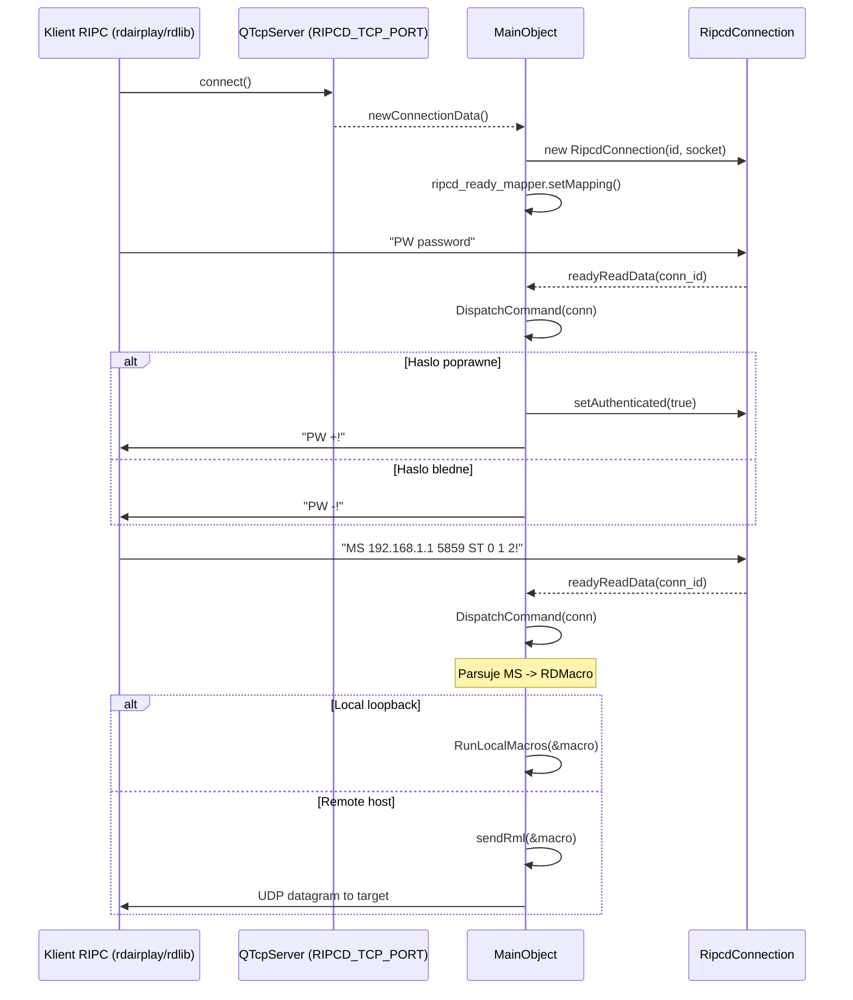
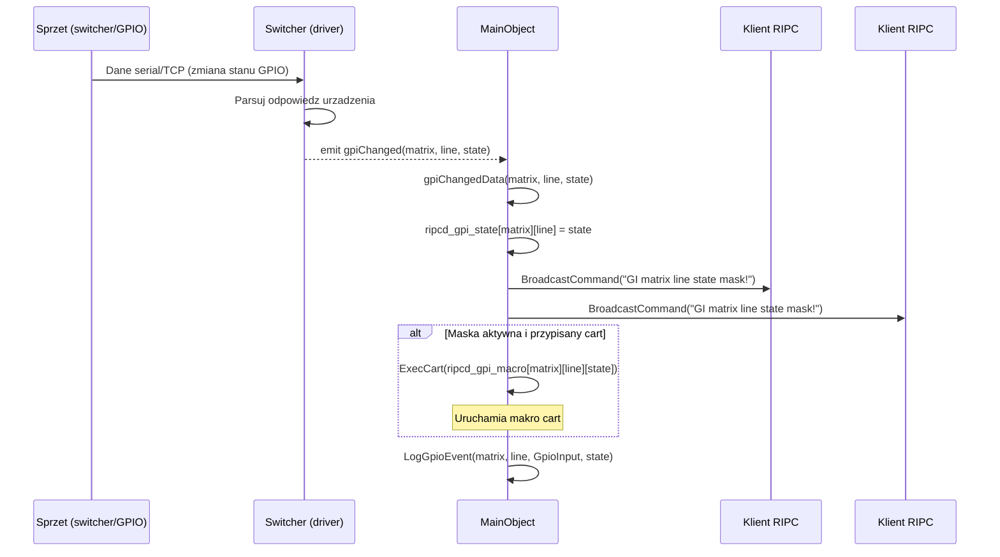
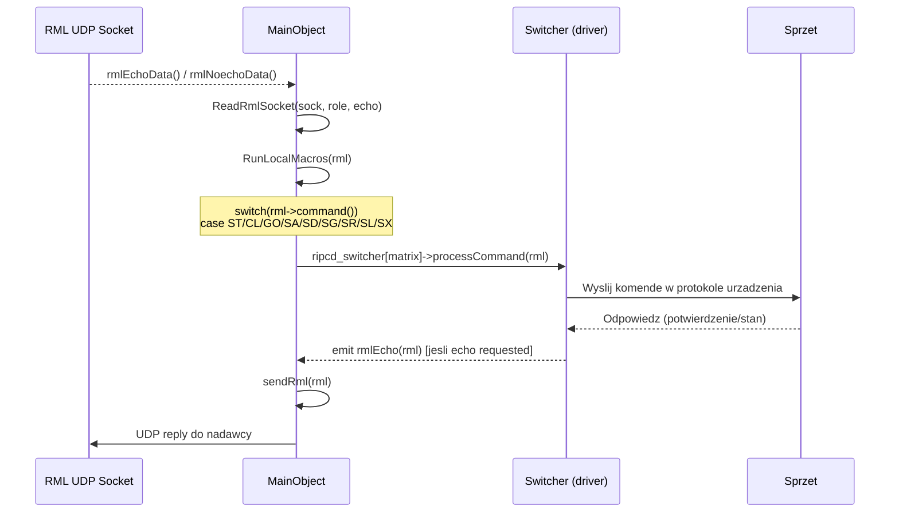
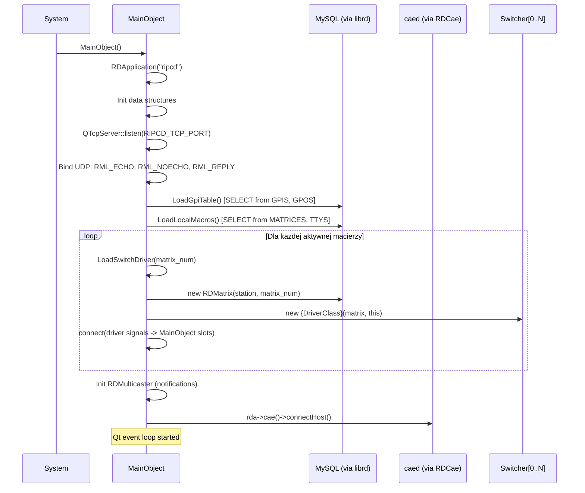

# Call Graph: ripcd (RPC/IPC Daemon)

## Statystyki

| Metryka | Wartosc |
|---------|---------|
| Laczna liczba connect() | ~120 |
| Laczna liczba emit() | ~300+ (wiekszosc w driverach) |
| Klasy emitujace sygnaly | 43 (Switcher base + 42 drivery) |
| Cross-artifact polaczenia | 4 (RIPC TCP, RML UDP x3) |
| Circular dependencies | 0 |

---

## Diagramy

### Sequence: Klient RIPC laczy sie i wysyla komende RML

### Sequence: Zmiana stanu GPIO (driver -> broadcast)

### Sequence: Komenda crosspoint do drivera (RML -> Switcher)

### Sequence: Inicjalizacja demona (startup)

### Graf zaleznosci

```mermaid
graph TD
    subgraph "ripcd daemon"
        MO[MainObject]
        SW[Switcher<br/>abstract base]
        RC[RipcdConnection]
        
        subgraph "Serial Drivers"
            BT[BroadcastTools<br/>15 driverow]
            SAS[SAS<br/>5 driverow]
            AM[Am16]
            Q1[Quartz1]
            GVC[Gvc7000]
            ROSS[RossNkScp]
            SG[StarGuide3]
            UN[Unity4000]
            ML[ModemLines]
            ACU[Acu1p]
        end
        
        subgraph "TCP/IP Drivers"
            HAR[Harlond]
            VG[VGuest]
            LW[LiveWire<br/>3 drivery]
            WHEATNET[WheatNet<br/>2 drivery]
            SAP[SoftwareAuthority]
            SASU[SasUsi]
            MOD[Modbus]
            BTWEB[BT Web<br/>2 drivery]
        end
        
        subgraph "Local Drivers"
            LA[LocalAudio]
            LG[LocalGpio]
            KG[KernelGpio]
        end
    end
    
    subgraph "Cross-artifact"
        RIPC_CLIENTS[Klienci RIPC<br/>rdairplay, rdlib, etc.]
        RML_SENDERS[RML Senders<br/>via UDP]
        MCAST[Multicast<br/>Notifications]
        CAED[caed<br/>via RDCae]
    end
    
    MO --> SW
    MO --> RC
    SW --> BT
    SW --> SAS
    SW --> AM
    SW --> Q1
    SW --> GVC
    SW --> ROSS
    SW --> SG
    SW --> UN
    SW --> ML
    SW --> ACU
    SW --> HAR
    SW --> VG
    SW --> LW
    SW --> WHEATNET
    SW --> SAP
    SW --> SASU
    SW --> MOD
    SW --> BTWEB
    SW --> LA
    SW --> LG
    SW --> KG
    
    RIPC_CLIENTS -.->|TCP RIPCD_TCP_PORT| MO
    RML_SENDERS -.->|UDP RML ports| MO
    MCAST -.->|Multicast| MO
    MO -.->|via RDCae| CAED
    
    style RIPC_CLIENTS fill:#f96
    style RML_SENDERS fill:#f96
    style MCAST fill:#f96
    style CAED fill:#f96
```

---

## Polaczenia connect() -- MainObject (core)

### Infrastruktura sieciowa (ripcd.cpp)

| Nadawca | Sygnal | Odbiorca | Slot | Plik |
|---------|--------|----------|------|------|
| ripcd_ready_mapper | mapped(int) | this | readyReadData(int) | ripcd.cpp:105 |
| ripcd_kill_mapper | mapped(int) | this | killData(int) | ripcd.cpp:108 |
| server (QTcpServer) | newConnection() | this | newConnectionData() | ripcd.cpp:114 |
| mapper (QSignalMapper) | mapped(int) | this | macroTimerData(int) | ripcd.cpp:120 |
| ripc_macro_timer[i] | timeout() | mapper | map() | ripcd.cpp:125 |
| ripcd_tty_ready_read_mapper | mapped(int) | this | ttyReadyReadData(int) | ripcd.cpp:132 |
| ripcd_rml_echo | readyRead() | this | rmlEchoData() | ripcd.cpp:156 |
| ripcd_rml_noecho | readyRead() | this | rmlNoechoData() | ripcd.cpp:160 |
| ripcd_rml_reply | readyRead() | this | rmlReplyData() | ripcd.cpp:164 |
| ripcd_notification_mcaster | received(msg, addr) | this | notificationReceivedData(msg, addr) | ripcd.cpp:178 |
| timer (exit) | timeout() | this | exitTimerData() | ripcd.cpp:189 |
| ripcd_garbage_timer | timeout() | this | garbageData() | ripcd.cpp:196 |
| ripcd_start_jack_timer | timeout() | this | startJackData() | ripcd.cpp:204 (ifdef JACK) |

### Polaczenia klientow TCP (ripcd.cpp, per connection)

| Nadawca | Sygnal | Odbiorca | Slot | Plik |
|---------|--------|----------|------|------|
| conn->socket() | readyRead() | ripcd_ready_mapper | map() | ripcd.cpp:235 |
| conn->socket() | connectionClosed() | ripcd_kill_mapper | map() | ripcd.cpp:238 |

### Polaczenia driver -> MainObject (loaddrivers.cpp, per matrix)

| Nadawca | Sygnal | Odbiorca | Slot | Plik |
|---------|--------|----------|------|------|
| ripcd_switcher[n] | rmlEcho(RDMacro*) | this | sendRml(RDMacro*) | loaddrivers.cpp:266 |
| ripcd_switcher[n] | gpiChanged(int,int,bool) | this | gpiChangedData(int,int,bool) | loaddrivers.cpp:268 |
| ripcd_switcher[n] | gpoChanged(int,int,bool) | this | gpoChangedData(int,int,bool) | loaddrivers.cpp:271 |
| ripcd_switcher[n] | gpiState(int,unsigned,bool) | this | gpiStateData(int,unsigned,bool) | loaddrivers.cpp:274 |
| ripcd_switcher[n] | gpoState(int,unsigned,bool) | this | gpoStateData(int,unsigned,bool) | loaddrivers.cpp:277 |

---

## Sygnaly emitowane -- Switcher (base class)

| Sygnal | Emitowany w | Warunek | Znaczenie |
|--------|-------------|---------|-----------|
| rmlEcho(RDMacro*) | switcher.cpp:74 | executeMacroCart() | Driver chce wykonac makro cart |
| gpiChanged(int,int,bool) | subclass-specific | Zmiana stanu GPI pinu | GPI pin zmienil wartosc |
| gpoChanged(int,int,bool) | subclass-specific | Zmiana stanu GPO pinu | GPO pin zmienil wartosc |
| gpiState(int,unsigned,bool) | subclass-specific | sendGpi() wywolane | Raport biezacego stanu GPI |
| gpoState(int,unsigned,bool) | subclass-specific | sendGpo() wywolane | Raport biezacego stanu GPO |

## Wzorzec emit() w driverach (typowy)

Kazdy driver emituje te same 4 sygnaly (gpiChanged, gpoChanged, gpiState, gpoState) w odpowiedzi na dane z urzadzenia. Wzorzec jest identyczny:

1. **Slot readyRead/socketReadyRead/pollTimer**: czyta dane z serial/TCP/GPIO
2. **Parsuj odpowiedz**: dekoduj protokol urzadzenia
3. **Porownaj z poprzednim stanem**: jesli zmiana -> emit gpiChanged/gpoChanged
4. **sendGpi()/sendGpo()**: emit gpiState/gpoState dla kazdego pinu

Przyklad (BtSs82, typowy serial driver):
- emit gpiChanged w liniach: 131, 138, 146, 152 (4 piny GPI z roznymi stanami)
- emit gpoChanged w liniach: 166, 174, 180 (3 piny GPO)
- emit gpiState/gpoState: 189, 197, 205, 212, 219, 226, 233 (pelny raport)

---

## Cross-artifact polaczenia

| Mechanizm | Kierunek | Port/Adres | Protokol | Znaczenie |
|-----------|----------|-----------|----------|-----------|
| TCP | IN | RIPCD_TCP_PORT | RIPC tekstowy | Klienci (rdairplay, rdlib etc.) lacza sie i wysylaja komendy |
| UDP | IN | RD_RML_ECHO_PORT | RML | Komendy RML z echo (odpowiedz wymagana) |
| UDP | IN | RD_RML_NOECHO_PORT | RML | Komendy RML bez echo |
| UDP | IN/OUT | RD_RML_REPLY_PORT | RML | Odpowiedzi na komendy RML |
| UDP | OUT | dowolny IP:port | RML | Forwarding RML do zdalnych hostow |
| Multicast | IN | RDMulticaster | Notyfikacje | Odbior notyfikacji systemowych |
| TCP | OUT | CAE host | via RDCae | Polaczenie z caed (core audio engine) |

### Protokol RIPC (TCP) -- komendy

| Komenda | Kierunek | Autentykacja | Opis |
|---------|----------|-------------|------|
| DC | IN | nie | Drop Connection |
| PW password | IN | nie | Autentykacja |
| RU | IN | tak | Request current User |
| SU username | IN | tak | Set User |
| MS addr port rml | IN | tak | Message Send (wyslij RML) |
| GI matrix line state mask | OUT | - | Broadcast: zmiana GPI |
| GO matrix line state mask | OUT | - | Broadcast: zmiana GPO |
| GC matrix line on_cart off_cart | OUT | - | Broadcast: zmiana GPI cart mapping |
| GD matrix line on_cart off_cart | OUT | - | Broadcast: zmiana GPO cart mapping |
| GM matrix line mask | OUT | - | Broadcast: zmiana GPI mask |
| GN matrix line mask | OUT | - | Broadcast: zmiana GPO mask |
| TA state | OUT | - | Broadcast: on-air flag |
| RU username | OUT | - | Broadcast: zmiana uzytkownika |

---

## Polaczenia wewnetrzne driverow (typowe wzorce)

### Wzorzec: Serial driver (np. BtSs82)

| Nadawca | Sygnal | Odbiorca | Slot |
|---------|--------|----------|------|
| tty_device | readyRead() | mapper | map() |
| mapper | mapped(int) | this | readyReadData() |
| oneshot_timer | timeout() | this | gpoOneshotData() |

### Wzorzec: TCP driver (np. Harlond)

| Nadawca | Sygnal | Odbiorca | Slot |
|---------|--------|----------|------|
| bt_socket | connected() | this | socketConnectedData() |
| bt_socket | disconnected() | this | socketDisconnectedData() |
| bt_socket | readyRead() | this | socketReadyReadData() |
| bt_socket | error(int) | this | socketErrorData() |
| bt_watchdog_timer | timeout() | this | watchdogTimeoutData() |

### Wzorzec: Local/Kernel driver (np. KernelGpio)

| Nadawca | Sygnal | Odbiorca | Slot |
|---------|--------|----------|------|
| poll_timer | timeout() | this | pollTimerData() |
| gpi_read_notifier | activated(int) | this | gpiActivatedData() |

---

## Circular Dependencies

Brak. Graf jest acykliczny:
- Drivers emituja sygnaly DO MainObject (nigdy odwrotnie przez sygnaly)
- MainObject wywoluje Switcher::processCommand() synchronicznie (nie przez signal/slot)
- Klienci RIPC komunikuja sie jednokierunkowo (request-response)

---

## Spot-check (3 klasy)

### 1. Switcher (base class) -- 5 sygnalow -- PASS
- Header deklaruje: rmlEcho, gpiChanged, gpoChanged, gpiState, gpoState
- Wszystkie 5 zmapowanych w call-graph.md
- emit rmlEcho w switcher.cpp:74 (executeMacroCart) -- potwierdzone

### 2. Harlond (TCP driver) -- emit w 14 miejscach -- PASS
- gpiChanged: emitowany w socketReadyReadData po parsowaniu odpowiedzi
- gpoChanged: emitowany analogicznie
- gpiState/gpoState: emitowane w sendGpi/sendGpo
- Polaczenia TCP: connected/disconnected/readyRead/error + watchdog -- potwierdzone

### 3. MainObject -- 0 wlasnych sygnalow, 18 slotow -- PASS
- Brak emit w MainObject -- potwierdzone (MainObject jest czysto reaktywny)
- 15 connect() w ripcd.cpp + 5 per driver w loaddrivers.cpp -- potwierdzone
- Cross-artifact: TCP server + 3 UDP sokety + multicast -- potwierdzone
