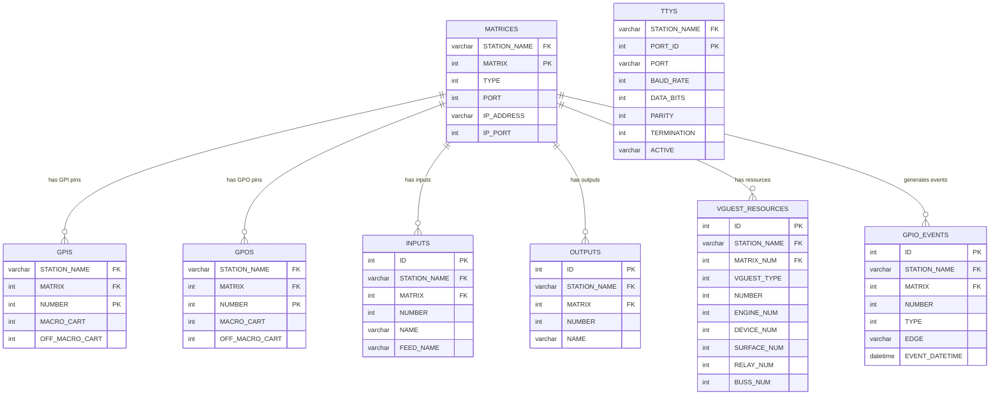

# Data Model: ripcd (RPC/IPC Daemon)

## ERD -- Entity Relationship Diagram

## Tabele

### MATRICES

Konfiguracja macierzy audio/switcher per stacja.

| Kolumna | Typ | Opis |
|---------|-----|------|
| STATION_NAME | varchar | FK do stacji |
| MATRIX | int | Numer macierzy (0..MAX_MATRICES-1) |
| TYPE | int | RDMatrix::Type -- typ drivera |
| PORT | int | Port TTY lub TCP |
| IP_ADDRESS | varchar | Adres IP dla driverow sieciowych |
| IP_PORT | int | Port TCP dla driverow sieciowych |

**Klasy CRUD:** MainObject (R -- LoadSwitchDriver)
**Operacje:** READ (select type, config na starcie i reload)

### GPIS

Mapowanie GPI pin -> makro cart (on/off).

| Kolumna | Typ | Opis |
|---------|-----|------|
| STATION_NAME | varchar | FK do stacji |
| MATRIX | int | FK do MATRICES |
| NUMBER | int | Numer pinu GPI (1-based) |
| MACRO_CART | int | Cart uruchamiany przy ON |
| OFF_MACRO_CART | int | Cart uruchamiany przy OFF |

**Klasy CRUD:** MainObject (R -- LoadGpiTable), WheatnetLio (R/U), WheatnetSlio (R/U)
**Operacje:** READ (load macros), UPDATE (insert new GPI entries)

### GPOS

Mapowanie GPO pin -> makro cart (on/off).

| Kolumna | Typ | Opis |
|---------|-----|------|
| STATION_NAME | varchar | FK do stacji |
| MATRIX | int | FK do MATRICES |
| NUMBER | int | Numer pinu GPO (1-based) |
| MACRO_CART | int | Cart uruchamiany przy ON |
| OFF_MACRO_CART | int | Cart uruchamiany przy OFF |

**Klasy CRUD:** MainObject (R -- LoadGpiTable), WheatnetLio (R/U), WheatnetSlio (R/U)
**Operacje:** READ (load macros), UPDATE (insert new GPO entries)

### TTYS

Konfiguracja portow szeregowych (serial TTY).

| Kolumna | Typ | Opis |
|---------|-----|------|
| STATION_NAME | varchar | FK do stacji |
| PORT_ID | int | ID portu (indeks) |
| PORT | varchar | Sciezka urzadzenia (np. /dev/ttyS0) |
| BAUD_RATE | int | Predkosc transmisji |
| DATA_BITS | int | Bity danych |
| PARITY | int | Parzystosc |
| TERMINATION | int | Typ zakonczenia linii (CR/LF/CRLF/None) |
| ACTIVE | varchar | "Y" / "N" |

**Klasy CRUD:** MainObject (R -- LoadLocalMacros, SY command)
**Operacje:** READ (load TTY config, restart TTY)

### INPUTS

Konfiguracja wejsc switcher/router.

| Kolumna | Typ | Opis |
|---------|-----|------|
| ID | int | PK auto |
| STATION_NAME | varchar | FK do stacji |
| MATRIX | int | FK do MATRICES |
| NUMBER | int | Numer wejscia |
| NAME | varchar | Nazwa wejscia |
| FEED_NAME | varchar | Nazwa feedu (StarGuide/Unity) |

**Klasy CRUD:** LiveWireLwrpAudio (CRUD), SasUsi (R), Unity4000 (R), StarGuide3 (R), VGuest (R), SoftwareAuthority (R)
**Operacje:** READ (load routing config), DELETE+INSERT (LiveWire resync)

### OUTPUTS

Konfiguracja wyjsc switcher/router.

| Kolumna | Typ | Opis |
|---------|-----|------|
| ID | int | PK auto |
| STATION_NAME | varchar | FK do stacji |
| MATRIX | int | FK do MATRICES |
| NUMBER | int | Numer wyjscia |
| NAME | varchar | Nazwa wyjscia |

**Klasy CRUD:** LiveWireLwrpAudio (CRUD), SasUsi (R), VGuest (R), SoftwareAuthority (R)
**Operacje:** READ (load routing config), DELETE+INSERT (LiveWire resync)

### VGUEST_RESOURCES

Mapowanie zasobow Logitek vGuest (engine/device/surface/relay/buss).

| Kolumna | Typ | Opis |
|---------|-----|------|
| STATION_NAME | varchar | FK do stacji |
| MATRIX_NUM | int | FK do MATRICES |
| VGUEST_TYPE | int | Typ zasobu |
| NUMBER | int | Numer zasobu |
| ENGINE_NUM | int | Numer silnika |
| DEVICE_NUM | int | Numer urzadzenia |
| SURFACE_NUM | int | Numer powierzchni |
| RELAY_NUM | int | Numer przekaznika |
| BUSS_NUM | int | Numer magistrali |

**Klasy CRUD:** VGuest (R), SasUsi (R)
**Operacje:** READ (load vGuest resource mapping)

### GPIO_EVENTS

Log zdarzen GPIO (generowany przez Switcher::insertGpioEntry).

**Klasy CRUD:** Switcher (C -- insertGpioEntry)
**Operacje:** CREATE (insert event log on GPIO change)

## Mapowanie Tabela <-> Klasa C++

| Tabela DB | Klasa C++ | Wzorzec | Operacje |
|-----------|-----------|---------|----------|
| MATRICES | MainObject | Read config | R |
| GPIS | MainObject, WheatnetLio, WheatnetSlio | Read + Update config | R, U |
| GPOS | MainObject, WheatnetLio, WheatnetSlio | Read + Update config | R, U |
| TTYS | MainObject | Read config | R |
| INPUTS | LiveWireLwrpAudio, SasUsi, Unity4000, StarGuide3, VGuest, SoftwareAuthority | Read + Resync | R, D, C |
| OUTPUTS | LiveWireLwrpAudio, SasUsi, VGuest, SoftwareAuthority | Read + Resync | R, D, C |
| VGUEST_RESOURCES | VGuest, SasUsi | Read mapping | R |
| GPIO_EVENTS | Switcher (base) | Audit log | C |
