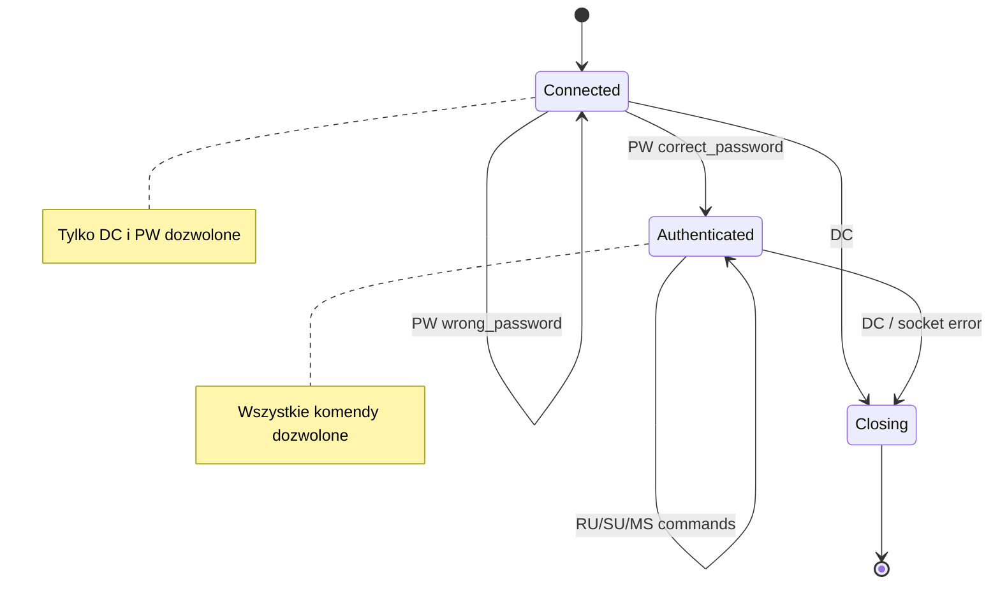
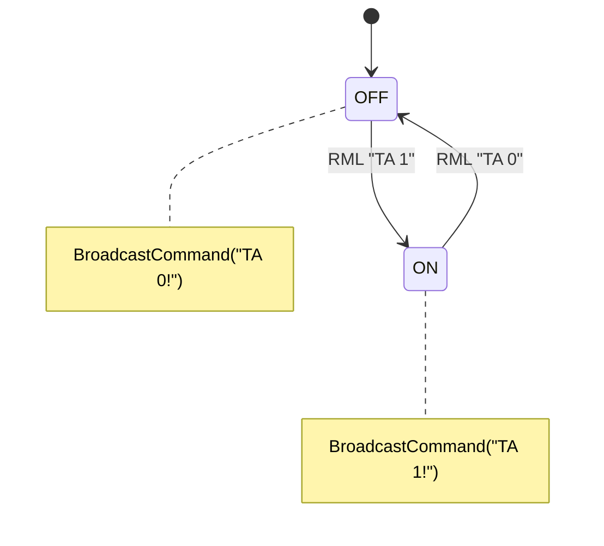

# Facts: ripcd (RPC/IPC Daemon)

## Zrodla analizy

| Zrodlo | Uzyte | Jakosc |
|--------|-------|--------|
| Kod zrodlowy | tak | wysoka (~18800 LOC, pelny skan) |
| Testy QTest | czesciowo | 2 pliki testowe (log_unlink_test, notification_test) -- testuja polaczenie RIPC, nie logike ripcd |
| Dokumentacja (docs/apis/ripc.xml) | tak | pelna specyfikacja protokolu RIPC |
| Dokumentacja (docs/opsguide/rml.xml) | tak | referencja komend RML |

---

## Use Cases (aktor -> akcja -> efekt)

| ID | Aktor | Akcja | Efekt | Zrodlo |
|----|-------|-------|-------|--------|
| UC-001 | Aplikacja Rivendell | Laczy sie z ripcd via TCP | Ustanawia sesje RIPC | ripcd.cpp:114 |
| UC-002 | Aplikacja Rivendell | Wysyla PW password | Autentykacja sesji | ripcd.cpp:497 |
| UC-003 | Aplikacja Rivendell | Wysyla MS addr port rml | Forwarding komendy RML do hosta | ripcd.cpp:527 |
| UC-004 | Aplikacja Rivendell | Wysyla RU | Otrzymuje biezacego uzytkownika | ripcd.cpp:518 |
| UC-005 | Aplikacja Rivendell | Wysyla SU username | Zmiana zalogowanego uzytkownika | ripcd.cpp:523 |
| UC-006 | Operator | Wysyla RML GO matrix I/O line state dur | Sterowanie GPIO (set/reset pin) | local_macros.cpp:814-840 |
| UC-007 | Operator | Wysyla RML ST matrix input output | Crosspoint take (przelacz wejscie na wyjscie) | delegacja do Switcher::processCommand |
| UC-008 | Operator | Wysyla RML TA 0/1 | Zmiana flagi on-air (transmisja) | local_macros.cpp:934-956 |
| UC-009 | Operator | Wysyla RML LO [user pass] | Login uzytkownika (lub default) | local_macros.cpp:549-585 |
| UC-010 | Operator | Wysyla RML MB display sev msg | Wyswietlenie popup na wskazanym DISPLAY | local_macros.cpp:587-635 |
| UC-011 | Operator | Wysyla RML JC port1 port2 | Polaczenie portow JACK audio | local_macros.cpp:408-452 |
| UC-012 | Operator | Wysyla RML SO port data | Wyslanie danych na port serial | local_macros.cpp:773-812 |
| UC-013 | System | Zmiana stanu GPIO na sprzecie | ripcd broadcastuje do wszystkich klientow + uruchamia makro cart | local_macros.cpp:39-73 |
| UC-014 | Admin | Wysyla RML SZ matrix | Hot-reload drivera macierzy | local_macros.cpp:903-932 |

---

## Reguly biznesowe (Gherkin)

```gherkin
# --- REGULY AUTENTYKACJI RIPC ---

Rule: Autentykacja sesji RIPC

  Scenario: Poprawne haslo
    Given klient polaczony z ripcd via TCP
    When  klient wysyla "PW correct_password"
    Then  ripcd odpowiada "PW +!"
    And   sesja jest oznaczona jako uwierzytelniona

  Scenario: Bledne haslo
    Given klient polaczony z ripcd via TCP
    When  klient wysyla "PW wrong_password"
    Then  ripcd odpowiada "PW -!"
    And   sesja NIE jest uwierzytelniona

  Scenario: Komenda uprzywilejowana bez autentykacji
    Given klient polaczony ale NIE uwierzytelniony
    When  klient wysyla komende uprzywilejowana (RU, SU, MS, etc.)
    Then  ripcd odpowiada "{cmd} -!" (odmowa)

  # Zrodlo: ripcd.cpp:497-517
  # Pewnosc: potwierdzone

# --- REGULY PROTOKOLU RIPC ---

Rule: Format komend RIPC

  Scenario: Poprawny format komendy
    Given polaczenie TCP z ripcd
    When  klient wysyla "CMD arg1 arg2!"
    Then  ripcd parsuje komende po spacjach
    And   "!" (ASCII 33) konczy sekwencje

  Scenario: Komenda DC nie wymaga autentykacji
    Given klient polaczony (uwierzytelniony lub nie)
    When  klient wysyla "DC"
    Then  polaczenie jest zamykane natychmiast

  # Zrodlo: ripcd.cpp:486-495, docs/apis/ripc.xml:sect.unprivileged_commands
  # Pewnosc: potwierdzone

# --- REGULY ZARZADZANIA GPIO ---

Rule: Zmiana stanu GPIO broadcastowana do wszystkich klientow

  Scenario: GPI zmienil stan
    Given driver wykryl zmiane stanu GPI pinu
    When  driver emituje gpiChanged(matrix, line, state)
    Then  MainObject aktualizuje ripcd_gpi_state[matrix][line]
    And   broadcastuje "GI matrix line state mask!" do WSZYSTKICH klientow
    And   jesli maska aktywna I przypisany cart -> ExecCart(cart_number)
    And   loguje GPIO event do tabeli GPIO_EVENTS

  Scenario: GPI zamaskowany
    Given GPI pin jest zamaskowany (ripcd_gpi_mask[m][l] == false)
    When  driver emituje gpiChanged
    Then  broadcast JEST wysylany (ze stanem maski)
    But   makro cart NIE jest uruchamiany

  # Zrodlo: local_macros.cpp:39-57
  # Pewnosc: potwierdzone

Rule: GPIO -> Macro Cart mapping

  Scenario: Przypisanie cart do GPI transition
    Given macierz matrix, pin gpi, stan on/off
    When  operator wysyla RML "GI matrix I gpi state cart_number"
    Then  ripcd_gpi_macro[matrix][gpi][state] = cart_number
    And   broadcast "GC matrix gpi off_cart on_cart!" do klientow

  Scenario: Automatyczne uruchomienie cart przy zmianie GPIO
    Given ripcd_gpi_macro[matrix][line][1] = 12345
    When  GPI line przechodzi w stan ON
    Then  ExecCart(12345) uruchamia makro cart 12345

  # Zrodlo: local_macros.cpp:285-342
  # Pewnosc: potwierdzone

Rule: GPIO maskowanie

  Scenario: Wlaczenie maski GPI
    Given macierz matrix, pin gpi
    When  operator wysyla RML "GE matrix I gpi 1"
    Then  ripcd_gpi_mask[matrix][gpi] = true
    And   broadcast "GM matrix gpi 1!"
    And   pin bedzie triggerowal makro cart przy zmianie

  Scenario: Wylaczenie maski GPI
    Given macierz matrix, pin gpi
    When  operator wysyla RML "GE matrix I gpi 0"
    Then  ripcd_gpi_mask[matrix][gpi] = false
    And   broadcast "GM matrix gpi 0!"
    And   pin NIE bedzie triggerowal makro cart

  # Zrodlo: local_macros.cpp:344-406
  # Pewnosc: potwierdzone

# --- REGULY ZARZADZANIA RML ---

Rule: RML routing (local vs remote)

  Scenario: RML do localhost
    Given komenda RML z adresem = local station address
    And   port = RD_RML_ECHO_PORT lub RD_RML_NOECHO_PORT
    When  DispatchCommand przetwarza MS
    Then  RunLocalMacros() uruchamia komende lokalnie

  Scenario: RML do zdalnego hosta
    Given komenda RML z adresem != local station address
    When  DispatchCommand przetwarza MS
    Then  sendRml() wysyla UDP datagram do docelowego hosta

  # Zrodlo: ripcd.cpp:544-557
  # Pewnosc: potwierdzone

Rule: RML echo/noecho

  Scenario: Komenda z echo
    Given komenda RML z echoRequested = true
    When  komenda przetworzona (sukces lub blad)
    Then  rml->acknowledge(true/false)
    And   sendRml() wysyla odpowiedz do nadawcy via RD_RML_REPLY_PORT

  Scenario: Komenda bez echo
    Given komenda RML z echoRequested = false
    When  komenda przetworzona
    Then  brak odpowiedzi do nadawcy

  # Zrodlo: local_macros.cpp (wzorzec powrotny w kazdej komendzie)
  # Pewnosc: potwierdzone

# --- REGULY DRIVEROW SWITCHER ---

Rule: Factory pattern dla driverow

  Scenario: Ladowanie drivera macierzy
    Given numer macierzy matrix_num
    When  LoadSwitchDriver(matrix_num) wywolane
    Then  czyta RDMatrix z DB (typ, konfiguracja)
    And   tworzy odpowiedni Switcher subclass na podstawie RDMatrix::Type
    And   laczy 5 sygnalow drivera z MainObject

  Scenario: Nieznany typ drivera
    Given RDMatrix::Type nie pasuje do zadnego case w switch
    When  LoadSwitchDriver() wywolane
    Then  zwraca false
    And   loguje warning do syslog

  # Zrodlo: loaddrivers.cpp:72-279
  # Pewnosc: potwierdzone

Rule: Delegacja komend do drivera

  Scenario: Komenda switcher (CL/FS/GO/ST/SA/SD/SG/SR/SL/SX)
    Given macierz matrix z zaladowanym driverem
    When  RunLocalMacros odbiera komende CL/FS/GO/ST/SA/SD/SG/SR/SL/SX
    Then  deleguje do ripcd_switcher[matrix]->processCommand(rml)

  Scenario: Komenda switcher ale brak drivera
    Given matrix bez zaladowanego drivera (ripcd_switcher[m] == NULL)
    When  RunLocalMacros odbiera komende switcher
    Then  jesli echo requested: acknowledge(false) + sendRml

  # Zrodlo: local_macros.cpp:814-840
  # Pewnosc: potwierdzone

# --- REGULY JACK AUDIO ---

Rule: JACK port management

  Scenario: Polaczenie portow JACK
    Given JACK client aktywny (ripcd_jack_client != NULL)
    When  RML "JC port_in port_out" odebrane
    Then  jack_connect(client, port_out, port_in)
    And   log do syslog

  Scenario: Rozlaczenie wszystkich portow JACK
    Given JACK client aktywny
    When  RML "JZ" odebrane
    Then  iteruje wszystkie output porty
    And   rozlacza wszystkie polaczenia kazdego portu

  Scenario: JACK nie skompilowany
    Given ifdef JACK nie zdefiniowany
    When  RML JC/JD/JZ odebrane
    Then  acknowledge(false)

  # Zrodlo: local_macros.cpp:408-547
  # Pewnosc: potwierdzone

# --- REGULY TTY (SERIAL) ---

Rule: Zarzadzanie portami serial

  Scenario: Restart portu TTY (RML SY)
    Given port tty_port
    When  RML "SY tty_port" odebrane
    Then  zamknij stary port (jesli otwarty)
    And   czytaj konfiguracje z tabeli TTYS
    And   otwierz nowy port z parametrami z DB
    And   ustaw code trap

  Scenario: Wyslanie danych na serial (RML SO)
    Given port tty_port otwarty
    When  RML "SO tty_port data" odebrane
    Then  dodaj terminator (CR/LF/CRLF) wedlug konfiguracji
    And   wyslij dane na port

  # Zrodlo: local_macros.cpp:842-901, 773-812
  # Pewnosc: potwierdzone

# --- REGULY TIMERA MAKR ---

Rule: Macro Timer (opoznione uruchomienie cart)

  Scenario: Start timera
    Given numer timera 1..RD_MAX_MACRO_TIMERS
    When  RML "MT timer_id interval_ms cart_number" odebrane
    Then  ustaw ripc_macro_cart[timer_id] = cart_number
    And   uruchom timer na interval_ms (one-shot)
    And   po wygasnieciu: ExecCart(cart_number)

  Scenario: Stop timera
    Given numer timera z aktywnymi ustawieniami
    When  RML "MT timer_id 0 0" odebrane (interval=0 lub cart=0)
    Then  stop timer
    And   ripc_macro_cart[timer_id] = 0

  # Zrodlo: local_macros.cpp:637-672
  # Pewnosc: potwierdzone
```

---

## Stany encji

### RipcdConnection -- stany



| Przejscie | Trigger | Warunek | Efekt uboczny | Zrodlo |
|-----------|---------|---------|--------------|--------|
| Connected -> Authenticated | PW cmd | haslo poprawne | EchoCommand "PW +!" | ripcd.cpp:497-501 |
| Connected -> Connected | PW cmd | haslo bledne | EchoCommand "PW -!" | ripcd.cpp:503-507 |
| * -> Closing | DC cmd lub socket error | - | killData() | ripcd.cpp:492-494 |

### Switcher Driver -- stany (typowy TCP driver)

```mermaid
stateDiagram-v2
    [*] --> Disconnected
    Disconnected --> Connecting : QTcpSocket::connectToHost()
    Connecting --> Connected : socketConnectedData()
    Connecting --> Disconnected : socketErrorData() + watchdog
    Connected --> Active : inicjalizacja sesji
    Active --> Active : processCommand / GPIO changes
    Active --> Disconnected : socketDisconnectedData()
    Disconnected --> Connecting : watchdogTimeoutData()
    
    note right of Active
        Emituje gpiChanged/gpoChanged
    end note
```

### On-Air Flag -- stany



| Przejscie | Trigger | Warunek | Efekt uboczny | Zrodlo |
|-----------|---------|---------|--------------|--------|
| OFF -> ON | RML TA 1 | ripc_onair_flag == false | BroadcastCommand + syslog | local_macros.cpp:947-949 |
| ON -> OFF | RML TA 0 | ripc_onair_flag == true | BroadcastCommand + syslog | local_macros.cpp:943-945 |

---

## Ograniczenia i limity

| Ograniczenie | Wartosc | Dotyczy | Zrodlo |
|-------------|---------|---------|--------|
| Max matrices | 8 (MAX_MATRICES) | Tablica driverow switcher | lib/rd.h:159 |
| Max GPIO pins per matrix | 32768 (MAX_GPIO_PINS) | Tablica stanow GPI/GPO | lib/rd.h:124 |
| Max TTY ports | 8 (MAX_TTYS) | Porty szeregowe | lib/rd.h:144 |
| Max macro timers | 16 (RD_MAX_MACRO_TIMERS) | Timery opoznionego uruchamiania cart | lib/rd.h:164 |
| RIPC TCP port | 5006 (RIPCD_TCP_PORT) | Port nasluchiwania TCP | lib/rd.h:99 |
| RML Echo port | 5858 (RD_RML_ECHO_PORT) | UDP port dla RML z echo | lib/rd.h:282 |
| RML No-echo port | 5859 (RD_RML_NOECHO_PORT) | UDP port dla RML bez echo | lib/rd.h:283 |
| RML Reply port | 5860 (RD_RML_REPLY_PORT) | UDP port dla odpowiedzi RML | lib/rd.h:284 |
| Max RIPCD message length | 256 (RIPCD_MAX_LENGTH) | Bufor komendy RIPC | ripcd.h:56 |
| RML read interval | 100ms (RIPCD_RML_READ_INTERVAL) | Interval czytania soketow RML | ripcd.h:57 |
| MB severity range | 1-3 | Parametr severity dla RML MB (popup) | local_macros.cpp:596 |
| MT timer id range | 1-RD_MAX_MACRO_TIMERS | Numer timera makra | local_macros.cpp:645-647 |
| MT cart number range | 0-999999 | Numer cart dla timera | local_macros.cpp:647 |
| GI/GE arg count | 5 / 4 | Wymagana liczba argumentow RML | local_macros.cpp:286, 345 |
| GPIO line range | 0 to MAX_GPIO_PINS-1 | Numer pinu GPIO (0-based internal) | local_macros.cpp:311-314 |
| UO port range | 0-0xFFFF | Port UDP dla RML UO | local_macros.cpp:973 |
| Garbage collection interval | okresowy (QTimer) | Sprzatanie zamknietych polaczen | ripcd.cpp:196 |
| JACK startup delay | 5000ms | Opoznienie inicjalizacji JACK | ripcd.cpp:205 |
| Exit poll interval | 200ms | Sprawdzanie sygnalow SIGTERM | ripcd.cpp:190 |

---

## Konfiguracja

ripcd nie uzywa QSettings. Konfiguracja pochodzi z:
1. **Baza danych MySQL** -- tabele MATRICES, GPIS, GPOS, TTYS (via librd RDMatrix, RDStation, RDConfig)
2. **Linia polecen** -- jedyny parametr: `-d` (debug mode, ripcd pozostaje na foreground)
3. **rd.conf** -- plik konfiguracyjny systemu Rivendell (via RDApplication/RDConfig)

---

## Linux-specific komponenty

| Komponent | Gdzie uzywany (klasa/metoda) | Funkcja | Priorytet zastapienia |
|-----------|---------------------------|---------|----------------------|
| JACK Audio | MainObject (ifdef JACK) | jack_connect, jack_disconnect, jack_get_ports | HIGH |
| fork()+exec() | MainObject::RunLocalMacros (MB, RN) | Uruchamianie rdpopup i zewnetrznych procesow | MEDIUM |
| seteuid/setegid | MainObject::RunLocalMacros (MB) | Zmiana uzytkownika przed fork | MEDIUM |
| signal() | ripcd.cpp:145-147 | SIGCHLD, SIGTERM, SIGINT handling | MEDIUM |
| /dev/gpio | KernelGpio driver | ioctl na urzadzeniu GPIO kernel | HIGH |
| /dev/ttyS* | Serial drivers (via RDTTYDevice) | Komunikacja z urzadzeniami serial | HIGH |
| AudioScience HPI | LocalAudio (ifdef HPI) | Lokalna karta audio z GPIO | HIGH |
| MySQL | MainObject, drivery (via RDSqlQuery) | Odczyt konfiguracji, zapis zdarzen | CRITICAL |
| syslog | MainObject, drivery (via rda->syslog) | Logowanie systemowe | MEDIUM |

---

## Konflikty miedzy zrodlami

### TYP 1 -- W dokumentacji, brak w kodzie

| Fakt z docs/ | Plik XML | Status |
|--------------|----------|--------|
| Komenda ME (RML Echo via RIPC) | docs/apis/ripc.xml:sect.privileged_commands.rml_echo | hidden -- prawdopodobnie obslugiwana poza ripcd (w kliencie) |

### TYP 2 -- W kodzie, brak w dokumentacji

| Fakt z kodu | Plik | Status |
|-------------|------|--------|
| ForwardConvert -- konwersja starszych formatow RML | local_macros.cpp:1000+ | needs_doc -- backward compat logic |
| Notyfikacje multicast (RDMulticaster) | ripcd.cpp:176-181 | needs_doc -- brak w ripc.xml |

### TYP 3 -- Sprzecznosc kod <-> dokumentacja

Brak sprzecznosci. Kod i dokumentacja sa zgodne w zakresie protokolu RIPC.

### TYP 4 -- Edge cases (z kodu)

| Lokalizacja | Constraint | Zrodlo |
|-------------|-----------|--------|
| Local loopback detection | Jesli adres RML == local station i port == echo/noecho -> RunLocalMacros zamiast UDP send | ripcd.cpp:544-547 |
| GPI macro 0 = brak cart | ripcd_gpi_macro[m][l][s] == 0 oznacza brak przypisanego cart | local_macros.cpp:53 |
| Oneshot timer dla GPIO | Niektore drivery (LocalGpio) uzywaja RDOneShot do tymczasowego wymuszenia stanu GPIO | local_gpio.cpp:124-126 |
| JACK EEXIST ignorowany | jack_connect zwraca EEXIST jesli polaczenie juz istnieje -- ignorowane (nie blad) | local_macros.cpp:426 |

---

## Spot-check (3 reguly)

### 1. Regula: Autentykacja sesji (PW) -- PASS
- Zrodlo: ripcd.cpp:497-507
- Zweryfikowane: cmds[1]==rda->config()->password() -> setAuthenticated(true), EchoCommand "PW +!"
- Kod zgodny z regula Gherkin

### 2. Regula: GPIO broadcast + macro cart -- PASS
- Zrodlo: local_macros.cpp:47-56
- Zweryfikowane: BroadcastCommand("GI..."), sprawdzenie maski, ExecCart jesli macro > 0
- Kod zgodny z regula Gherkin

### 3. Regula: Local loopback RML -- PASS
- Zrodlo: ripcd.cpp:544-547
- Zweryfikowane: if(macro.address()==rda->station()->address() && port==echo/noecho) -> RunLocalMacros
- Kod zgodny z regula Gherkin
