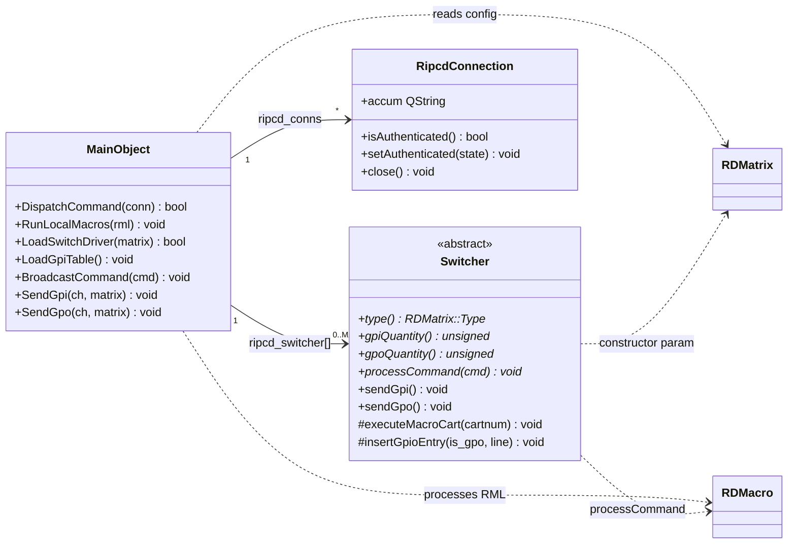

# Inventory: ripcd (RPC/IPC Daemon)

## Statystyki

| Typ | Liczba |
|-----|--------|
| Klasy lacznie | 47 |
| QMainWindow subclassy | 0 |
| QDialog subclassy | 0 |
| QWidget subclassy | 0 |
| QObject subclassy (serwisy) | 2 (MainObject, Switcher) |
| Switcher subclassy (drivery) | 42 |
| Plain C++ klasy | 3 (RipcdConnection, StarGuideFeed, UnityFeed) |
| Active Record (CRUD) klasy | 0 (ripcd czyta DB przez librd, nie ma wlasnych Active Records) |

---

## Diagram klas -- dziedziczenie

```mermaid
classDiagram
    direction TB
    
    class QObject
    
    QObject <|-- MainObject
    QObject <|-- Switcher
    
    Switcher <|-- Acu1p
    Switcher <|-- Am16
    Switcher <|-- Bt10x1
    Switcher <|-- Bt16x1
    Switcher <|-- Bt16x2
    Switcher <|-- Bt8x2
    Switcher <|-- BtAcs82
    Switcher <|-- BtAdms4422
    Switcher <|-- BtGpi16
    Switcher <|-- BtSentinel4Web
    Switcher <|-- BtSrc16
    Switcher <|-- BtSrc8Iii
    Switcher <|-- BtSs124
    Switcher <|-- BtSs164
    Switcher <|-- BtSs21
    Switcher <|-- BtSs41Mlr
    Switcher <|-- BtSs42
    Switcher <|-- BtSs44
    Switcher <|-- BtSs82
    Switcher <|-- BtU41MlrWeb
    Switcher <|-- Gvc7000
    Switcher <|-- Harlond
    Switcher <|-- KernelGpio
    Switcher <|-- LiveWireLwrpAudio
    Switcher <|-- LiveWireLwrpGpio
    Switcher <|-- LiveWireMcastGpio
    Switcher <|-- LocalAudio
    Switcher <|-- LocalGpio
    Switcher <|-- Modbus
    Switcher <|-- ModemLines
    Switcher <|-- Quartz1
    Switcher <|-- RossNkScp
    Switcher <|-- Sas16000
    Switcher <|-- Sas32000
    Switcher <|-- Sas64000
    Switcher <|-- Sas64000Gpi
    Switcher <|-- SasUsi
    Switcher <|-- SoftwareAuthority
    Switcher <|-- StarGuide3
    Switcher <|-- Unity4000
    Switcher <|-- VGuest
    Switcher <|-- WheatnetLio
    Switcher <|-- WheatnetSlio
```



## Diagram klas -- zaleznosci domenowe



---

## Klasy -- szczegolowy inwentarz

### MainObject

**Typ Qt:** QObject (daemon singleton)
**Plik:** `ripcd.h` + `ripcd.cpp`, `local_macros.cpp`, `local_notifications.cpp`, `local_gpio.cpp`, `loaddrivers.cpp`, `local_audio.cpp`
**Odpowiedzialnosc:** Glowny obiekt demona ripcd. Zarzadza cyklem zycia: nasluchuje na RIPCD_TCP_PORT (protokol RIPC), odbiera komendy RML via UDP (echo/noecho/reply), laduje drivery switcher/GPIO na podstawie konfiguracji DB, zarzadza stanem GPIO (GPI/GPO state, maski, mapowanie na makra cart), obsluguje timery makr, forwarding RML do zdalnych hostow, notyfikacje via multicast.
**Tabela DB:** MATRICES (R), GPIS (R), GPOS (R), TTYS (R)

**Sygnaly:**
Brak wlasnych sygnalow (MainObject nie emituje -- tylko odbiera).

**Sloty:**

| Slot | Parametry | Widocznosc | Efekt |
|------|-----------|------------|-------|
| newConnectionData | - | private | Akceptuje nowe polaczenie TCP klienta RIPC |
| notificationReceivedData | msg, addr | private | Odbiera notyfikacje multicast i broadcastuje do klientow |
| sendRml | RDMacro* | private | Wysyla komende RML via UDP do docelowego hosta |
| rmlEchoData | - | private | Czyta RML z soketu echo (port RD_RML_ECHO_PORT) |
| rmlNoechoData | - | private | Czyta RML z soketu noecho (port RD_RML_NOECHO_PORT) |
| rmlReplyData | - | private | Czyta RML reply |
| gpiChangedData | matrix, line, state | private | Reaguje na zmiane GPI z drivera -- broadcastuje do klientow, uruchamia makro cart |
| gpoChangedData | matrix, line, state | private | Reaguje na zmiane GPO z drivera -- broadcastuje do klientow, uruchamia makro cart |
| gpiStateData | matrix, line, state | private | Pelny raport stanu GPI z drivera |
| gpoStateData | matrix, line, state | private | Pelny raport stanu GPO z drivera |
| ttyTrapData | cartnum | private | TTY code trap wyzwolony -- uruchamia makro cart |
| ttyReadyReadData | num | private | Dane gotowe na porcie TTY |
| macroTimerData | num | private | Timer makra wygasl -- uruchamia cart |
| readyReadData | conn_id | private | Dane gotowe od klienta TCP RIPC |
| killData | conn_id | private | Zamyka polaczenie klienta RIPC |
| exitTimerData | - | private | Timer wyjscia (graceful shutdown) |
| garbageData | - | private | Garbage collection dla zamknietych polaczen |
| startJackData | - | private | Inicjalizacja klienta JACK (ifdef JACK) |

**Publiczne API:**
Tylko konstruktor i destruktor -- MainObject jest singletonem bez publicznych metod biznesowych.

**Kluczowe metody prywatne:**

| Metoda | Efekt | Warunki |
|--------|-------|---------|
| DispatchCommand(conn) | Parsuje komende RIPC od klienta TCP, dispatchuje: DC, PW, RU, SU, MS | Wymaga autentykacji (PW) dla komend uprzywilejowanych |
| RunLocalMacros(rml) | Wykonuje komendy RML lokalnie: BO, GI, GE, JC, JD, JZ, LO, MB, MT, RN, SI, SC, SO, SY, SZ, TA, UO + delegacja do Switcher (CL, FS, GO, ST, SA, SD, SG, SR, SL, SX) | Komenda musi byc rozpoznana |
| LoadSwitchDriver(matrix) | Factory method -- tworzy Switcher subclass na podstawie RDMatrix::Type z DB | Numer macierzy 0..MAX_MATRICES-1 |
| LoadGpiTable() | Laduje mapowanie GPI/GPO pin -> makro cart z tabel GPIS/GPOS | - |
| BroadcastCommand(cmd) | Wysyla komende do WSZYSTKICH podlaczonych, uwierzytelnionych klientow RIPC | - |
| EchoCommand(conn_id, cmd) | Wysyla odpowiedz do jednego klienta RIPC | - |
| SendGpi/SendGpo(ch, matrix) | Wysyla aktualny stan GPIO do jednego klienta | - |
| ForwardConvert(rml) | Konwersja starszych formatow RML do aktualnych | - |

**Komendy RML obslugiwane lokalnie:**

| Komenda | Opis |
|---------|------|
| BO | Binary Output -- wyslij bajty hex na port TTY |
| GI | GPIO Input/Output -- ustaw mapowanie pin -> makro cart |
| GE | GPIO Enable/Disable -- ustaw maske GPI/GPO |
| JC | JACK Connect -- polacz porty JACK |
| JD | JACK Disconnect -- rozlacz porty JACK |
| JZ | JACK Disconnect All -- rozlacz wszystkie porty JACK |
| LO | Login -- uwierzytelnienie uzytkownika (RDUser) |
| MB | Message Box -- wyswietl popup (rdpopup) na wskazanym DISPLAY |
| MT | Macro Timer -- ustaw timer uruchamiajacy cart po opoznieniu |
| RN | Run -- uruchom zewnetrzny proces (z konfigurowalnymi uid/gid) |
| SI | Serial Input -- dodaj trap na porcie TTY |
| SC | Serial Clear -- usun trap(y) z portu TTY |
| SO | Serial Output -- wyslij string na port TTY z terminatorem |
| SY | Sync TTY -- restart portu TTY (zamknij + reopen z DB config) |
| SZ | Sync Switcher -- restart drivera macierzy (unload + reload) |
| TA | Transmitter Activate -- on-air flag on/off |
| UO | UDP Output -- wyslij dane UDP na wskazany IP:port |

**Komendy delegowane do Switcher::processCommand:**
CL (Crosspoint Load), FS (Fire Salvo), GO (GPIO Output), ST (Crosspoint Take), SA (Source Address), SD (Source Disconnect), SG (Source Gain), SR (Source Route), SL (Silence Level), SX (Special)

**Protokol RIPC (TCP):**

| Komenda | Opis |
|---------|------|
| DC | Drop Connection |
| PW password | Password Authenticate |
| RU | Request User (current logged-in user) |
| SU username | Set User |
| MS addr port rml | Send RML (message send) |

**Reguly biznesowe:**
- Uwierzytelnienie: klient musi wyslac PW z poprawnym haslem zanim moze uzywac komend uprzywilejowanych
- GPIO state: tablice MAX_MATRICES x MAX_GPIO_PINS przechowuja biezacy stan GPI/GPO
- GPIO maski: kazdy pin GPI/GPO moze byc zamaskowany (ignorowany)
- GPIO -> macro: zmiana stanu GPIO automatycznie uruchamia makro cart (on-cart lub off-cart)
- Broadcast: kazda zmiana stanu GPIO jest broadcastowana do wszystkich klientow RIPC
- RML forwarding: jesli adres RML != localhost, komenda jest forwardowana via UDP
- JACK: opcjonalny (ifdef JACK) -- zarzadzanie polaczeniami audio JACK

**Linux-specific:**

| Komponent | Uzycie | Priorytet zastapienia |
|-----------|--------|----------------------|
| JACK | jack_connect/disconnect/get_ports | HIGH |
| fork()+exec() | MB (rdpopup), RN (external cmd) | MEDIUM |
| seteuid/setegid | Zmiana uzytkownika dla fork() | MEDIUM |
| signal() | SIGCHLD, SIGTERM, SIGINT handling | MEDIUM |

**Zaleznosci od shared libraries:**
- librd: RDApplication, RDStation, RDConfig, RDUser, RDMatrix, RDMacro, RDSqlQuery, RDTTYDevice, RDCodeTrap, RDMulticaster, RDNotification, RDMbLookup
- librdhpi: (opcjonalnie via ifdef HPI)

---

### Switcher (abstract base class)

**Typ Qt:** QObject (abstract)
**Plik:** `switcher.h` + `switcher.cpp`
**Odpowiedzialnosc:** Abstrakcyjna klasa bazowa definiujaca interfejs dla wszystkich driverow switcher/GPIO. Kazdy driver dziedziczy z Switcher i implementuje komunikacje z konkretnym sprzetem (serial, TCP, HTTP, GPIO kernel, multicast). Klasa bazowa zapewnia: wspolna infrastrukture sygnalow GPIO, logowanie GPIO events do DB, uruchamianie makro cartow.
**Tabela DB:** GPIO_EVENTS (C -- insertGpioEntry)

**Sygnaly:**

| Sygnal | Parametry | Znaczenie biznesowe |
|--------|-----------|---------------------|
| rmlEcho | RDMacro* | Driver chce odpowiedziec na komende RML |
| gpiChanged | int matrix, int line, bool state | Stan GPI zmienil sie |
| gpoChanged | int matrix, int line, bool state | Stan GPO zmienil sie |
| gpiState | int matrix, unsigned line, bool state | Pelny raport stanu GPI pinu |
| gpoState | int matrix, unsigned line, bool state | Pelny raport stanu GPO pinu |

**Sloty:** Brak (abstract -- sloty sa w subclassach)

**Publiczne API (virtual):**

| Metoda | Parametry | Efekt | Warunki |
|--------|-----------|-------|---------|
| type() | - | Zwraca RDMatrix::Type tego drivera | pure virtual |
| gpiQuantity() | - | Liczba pinow GPI tego urzadzenia | pure virtual |
| gpoQuantity() | - | Liczba pinow GPO tego urzadzenia | pure virtual |
| primaryTtyActive() | - | Czy glowny port TTY jest aktywny | pure virtual |
| secondaryTtyActive() | - | Czy dodatkowy port TTY jest aktywny | pure virtual |
| processCommand(cmd) | RDMacro* | Przetworz komende RML (crosspoint, salvo, GPIO, etc.) | pure virtual |
| sendGpi() | - | Wyslij biezacy stan wszystkich GPI do MainObject | virtual (default no-op) |
| sendGpo() | - | Wyslij biezacy stan wszystkich GPO do MainObject | virtual (default no-op) |

**Metody chronione:**

| Metoda | Efekt |
|--------|-------|
| executeMacroCart(cartnum) | Uruchom makro cart (delegacja do MainObject via RDMacro) |
| logBytes(data, len) | Loguj surowe bajty do syslog (debug) |
| insertGpioEntry(is_gpo, line) | Wstaw rekord GPIO_EVENTS do DB |

**Reguly biznesowe:**
- Kazdy driver MUSI implementowac 6 pure virtual methods
- Sygnaly gpiChanged/gpoChanged sa JEDYNYM sposobem komunikacji driver -> MainObject
- insertGpioEntry tworzy audit trail w tabeli GPIO_EVENTS

---

### RipcdConnection

**Typ Qt:** Plain C++ (nie QObject)
**Plik:** `ripcd_connection.h` + `ripcd_connection.cpp`
**Odpowiedzialnosc:** Reprezentuje jedno polaczenie TCP klienta RIPC. Przechowuje soket, stan uwierzytelnienia, bufor akumulacyjny komend.
**Tabela DB:** brak

**Publiczne API:**

| Metoda | Parametry | Efekt | Warunki |
|--------|-----------|-------|---------|
| id() | - | Zwraca ID polaczenia | - |
| socket() | - | Zwraca QTcpSocket* | - |
| isAuthenticated() | - | Czy klient wyslal poprawne PW | - |
| setAuthenticated(state) | bool | Ustaw stan uwierzytelnienia | - |
| isClosing() | - | Czy polaczenie jest zamykane | - |
| close() | - | Zamknij polaczenie (graceful) | - |

**Pola publiczne:**
- accum (QString) -- bufor akumulacyjny przychodzacych danych, parsowany na komendy

**Reguly biznesowe:**
- Polaczenie MUSI byc uwierzytelnione zanim moze uzywac komend uprzywilejowanych
- Zamkniecie jest graceful (closing flag zapobiega double-close)

---

### StarGuideFeed

**Typ Qt:** Plain C++ (Data Transfer Object)
**Plik:** `starguide_feed.h` + `starguide_feed.cpp`
**Odpowiedzialnosc:** Struktura danych reprezentujaca feed StarGuide (satellite receiver) z provider_id, service_id, mode.
**Tabela DB:** brak

**Publiczne API:**

| Metoda | Parametry | Efekt |
|--------|-----------|-------|
| providerId() / setProviderId() | unsigned | Provider ID |
| serviceId() / setServiceId() | unsigned | Service ID |
| mode() / setMode() | Switcher::ConnectionMode | Tryb polaczenia |
| clear() | - | Reset do domyslnych |

---

### UnityFeed

**Typ Qt:** Plain C++ (Data Transfer Object)
**Plik:** `unity_feed.h` + `unity_feed.cpp`
**Odpowiedzialnosc:** Struktura danych reprezentujaca feed Unity (Sierra Automated Systems Unity 4000 router).
**Tabela DB:** brak

**Publiczne API:**

| Metoda | Parametry | Efekt |
|--------|-----------|-------|
| feed() / setFeed() | int | Numer feedu |
| mode() / setMode() | Switcher::ConnectionMode | Tryb polaczenia |
| clear() | - | Reset do domyslnych |

---

## Drivery Switcher/GPIO (42 klasy)

Wszystkie drivery dziedzicza z `Switcher : public QObject` i implementuja ten sam interfejs (6 pure virtual methods). Roznica miedzy nimi to **protokol komunikacji** z konkretnym sprzetem.

### Kategoryzacja driverow

#### Serial (RS-232/485) -- komunikacja przez port szeregowy (TTY)

| Klasa | Producent | Model | GPI | GPO | Opis |
|-------|-----------|-------|-----|-----|------|
| Acu1p | Prophet Systems | ACU-1 | tak | tak | Audio switcher |
| Am16 | 360 Systems | AM-16 | nie | nie | Audio matrix switcher (16x16) |
| Bt10x1 | BroadcastTools | SS 10.1 | nie | nie | Audio switcher 10-in/1-out |
| Bt16x1 | BroadcastTools | SS 16.1 | nie | nie | Audio switcher 16-in/1-out |
| Bt16x2 | BroadcastTools | SS 16.2 | tak | tak | Audio switcher 16-in/2-out |
| Bt8x2 | BroadcastTools | SS 8.2 | tak | tak | Audio switcher 8-in/2-out |
| BtAcs82 | BroadcastTools | ACS 8.2 | tak | tak | Audio switcher |
| BtAdms4422 | BroadcastTools | ADMS 44.22 | tak | tak | Audio switcher |
| BtGpi16 | BroadcastTools | GPI-16 | tak | nie | GPIO-only device (16 inputs) |
| BtSrc16 | BroadcastTools | SRC-16 | tak | tak | Silence sensor + switcher |
| BtSrc8Iii | BroadcastTools | SRC-8 III | tak | tak | Silence sensor + switcher |
| BtSs124 | BroadcastTools | SS 12.4 | tak | tak | Audio switcher 12-in/4-out |
| BtSs164 | BroadcastTools | SS 16.4 | tak | tak | Audio switcher 16-in/4-out |
| BtSs21 | BroadcastTools | SS 2.1 | tak | tak | Audio switcher 2-in/1-out |
| BtSs41Mlr | BroadcastTools | SS 4.1 MLR | tak | tak | Audio switcher multi-layer |
| BtSs42 | BroadcastTools | SS 4.2 | tak | tak | Audio switcher 4-in/2-out |
| BtSs44 | BroadcastTools | SS 4.4 | tak | tak | Audio switcher 4-in/4-out |
| BtSs82 | BroadcastTools | SS 8.2 | tak | tak | Audio switcher 8-in/2-out |
| Gvc7000 | Grass Valley | 7000 | nie | nie | Video/audio router |
| ModemLines | Generic | RS-232 Control Lines | tak | tak | GPIO via modem lines (DTR/RTS/CTS/DSR) |
| Quartz1 | Quartz Electronics | Type 1 | nie | nie | Audio router |
| RossNkScp | Ross Video | NK (SCP protocol) | nie | nie | Video/audio router |
| Sas16000 | SAS | 16000 | nie | nie | Audio switcher |
| Sas32000 | SAS | 32000 | tak | tak | Audio router |
| Sas64000 | SAS | 64000 | nie | nie | Audio router |
| Sas64000Gpi | SAS | 64000 GPI | tak | tak | GPIO companion for SAS 64000 |
| StarGuide3 | StarGuide | III | nie | nie | Satellite receiver |
| Unity4000 | SAS | Unity 4000 | nie | nie | Audio router |

#### TCP/IP -- komunikacja przez siec IP

| Klasa | Producent | Model | GPI | GPO | Opis |
|-------|-----------|-------|-----|-----|------|
| BtSentinel4Web | BroadcastTools | Sentinel 4 Web | tak | tak | Switcher via HTTP/web |
| BtU41MlrWeb | BroadcastTools | U4.1 MLR Web | tak | tak | Switcher via HTTP/web |
| Harlond | Logitek | Harlond | tak | tak | Audio engine/router via TCP |
| LiveWireLwrpAudio | Axia | LiveWire LWRP | nie | nie | Audio routing via LWRP protocol |
| LiveWireLwrpGpio | Axia | LiveWire LWRP | tak | tak | GPIO via LWRP protocol |
| LiveWireMcastGpio | Axia | LiveWire Multicast | tak | tak | GPIO via multicast UDP |
| Modbus | Generic | Modbus TCP | tak | tak | Industrial GPIO via Modbus |
| SasUsi | SAS | USI | tak | tak | SAS Universal Serial Interface via TCP |
| SoftwareAuthority | Generic | Software Authority Protocol | tak | tak | Generic TCP switcher protocol |
| VGuest | Logitek | vGuest | tak | tak | Audio engine/router via TCP |
| WheatnetLio | Wheatstone | WheatNet LIO | tak | tak | Audio/GPIO via IP |
| WheatnetSlio | Wheatstone | WheatNet SLIO | tak | tak | Audio/GPIO via IP |

#### Local (kernel/hardware bezposrednio)

| Klasa | Producent | Model | GPI | GPO | Opis |
|-------|-----------|-------|-----|-----|------|
| KernelGpio | Linux | Kernel GPIO | tak | tak | GPIO via /dev/gpio ioctl |
| LocalAudio | Local | HPI/JACK card | tak | tak | Lokalna karta audio (AudioScience HPI) z GPIO |
| LocalGpio | Local | GPIO adapter | tak | tak | Lokalny adapter GPIO |

### Wspolny interfejs driverow

Kazdy driver implementuje:

```
type()              -> RDMatrix::Type enum identyfikujacy driver
gpiQuantity()       -> ilosc pinow GPI (0 jesli brak)
gpoQuantity()       -> ilosc pinow GPO (0 jesli brak)
primaryTtyActive()  -> czy port TTY jest aktywny (false dla TCP/local drivers)
secondaryTtyActive()-> czy drugi port TTY aktywny
processCommand(rml) -> obsluga komend: CL, FS, GO, ST, SA, SD, SG, SR, SL, SX
sendGpi()           -> wyslij biezacy stan GPI (emit gpiState signals)
sendGpo()           -> wyslij biezacy stan GPO (emit gpoState signals)
```

### Typowy wzorzec drivera serial (np. BtSs82):
1. Konstruktor: otwiera RDTTYDevice, ustawia parametry serial
2. processCommand: koduje komende do protokolu urzadzenia, wyslij na serial
3. Slot readyRead: czyta odpowiedz, parsuje stan GPIO, emituje gpiChanged/gpoChanged

### Typowy wzorzec drivera TCP (np. Harlond):
1. Konstruktor: tworzy QTcpSocket, laczy do IP:port
2. socketConnectedData: inicjalizacja sesji (logowanie, query stanu)
3. socketReadyReadData: parsuje odpowiedzi, emituje sygnaly GPIO
4. processCommand: koduje komende do protokolu TCP urzadzenia
5. watchdogTimeoutData: reconnect jesli polaczenie zerwane

### Typowy wzorzec drivera local (np. LocalAudio):
1. Konstruktor: inicjalizuje HPI card (ifdef HPI)
2. processCommand: kontroluje GPIO lokalnj karty audio
3. Poll timer: odpytuje stan GPIO karty, emituje zmiany

---

## Missing Coverage

| Klasa | Plik | Powod braku |
|-------|------|-------------|
| - | - | Wszystkie klasy zinwentaryzowane |

---

## Conflicts

| ID | Klasa | Opis konfliktu | Status |
|----|-------|----------------|--------|
| - | - | Brak konfliktow | - |

---

## Spot-check (3 klasy)

### 1. MainObject (QObject) -- PASS
- Sloty: 18 slotow zweryfikowane z kodem zrodlowym ripcd.h
- Sygnaly: brak wlasnych -- potwierdzone (MainObject nie emituje)
- DB: GPIS, GPOS, MATRICES, TTYS -- potwierdzone w LoadGpiTable, LoadLocalMacros

### 2. Switcher (QObject abstract) -- PASS
- Sygnaly: 5 sygnalow (rmlEcho, gpiChanged, gpoChanged, gpiState, gpoState) -- potwierdzone
- Pure virtual: 6 metod -- potwierdzone
- DB: GPIO_EVENTS via insertGpioEntry -- potwierdzone w switcher.cpp

### 3. RipcdConnection (plain C++) -- PASS
- Brak sygnalow/slotow -- potwierdzone (nie QObject)
- API: id, socket, isAuthenticated, setAuthenticated, isClosing, close -- potwierdzone
- Pole publiczne accum -- potwierdzone jako bufor komend
