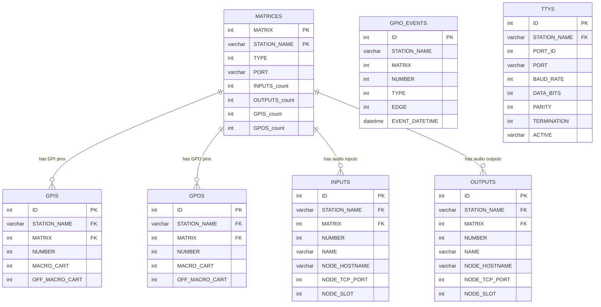
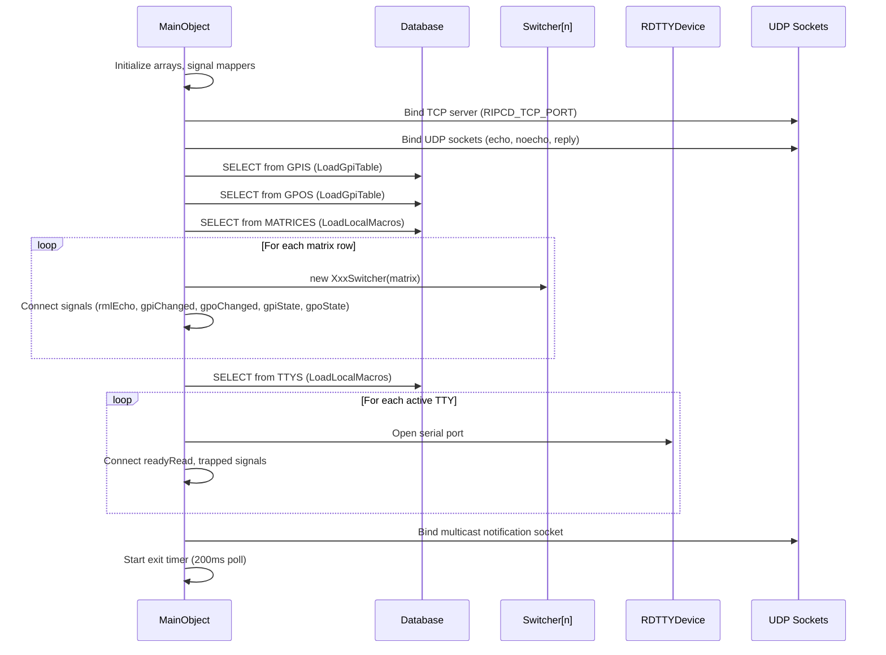
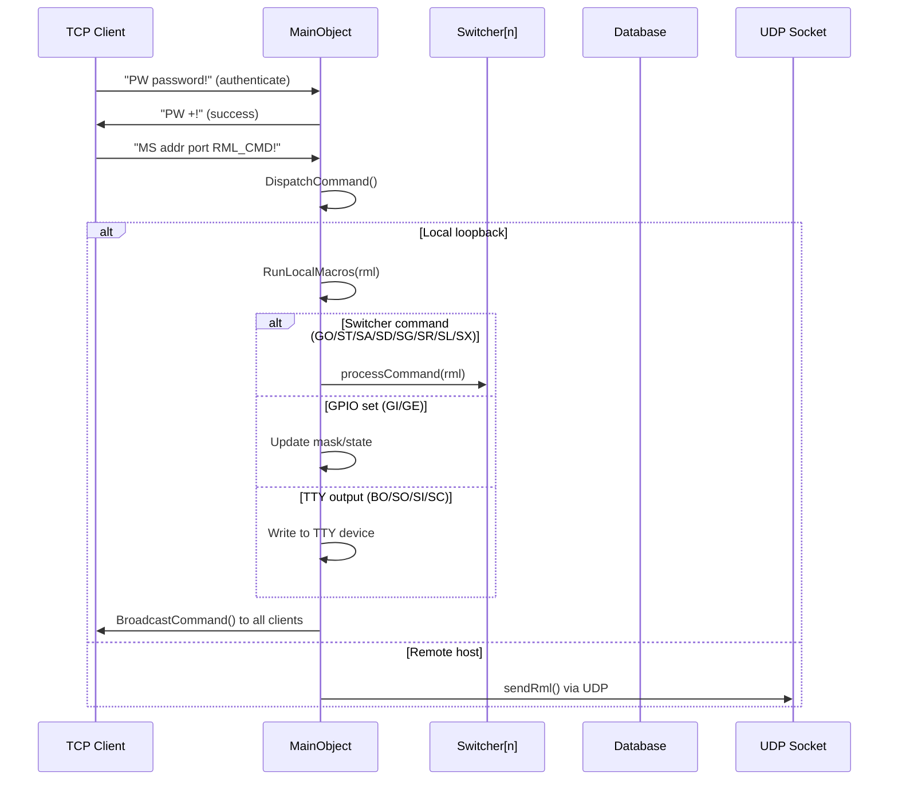
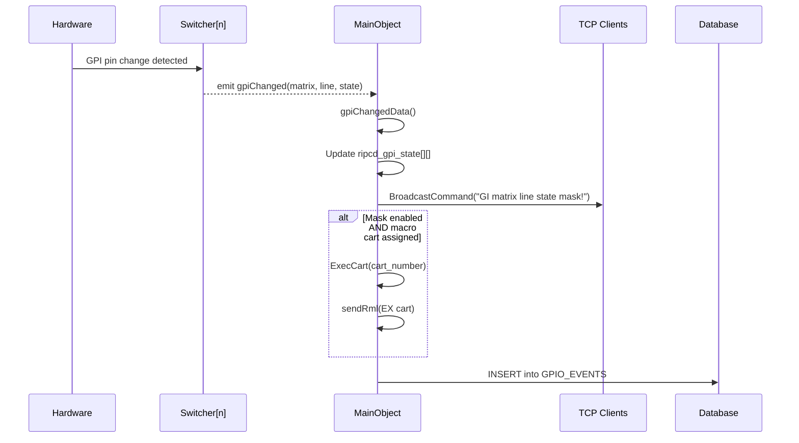
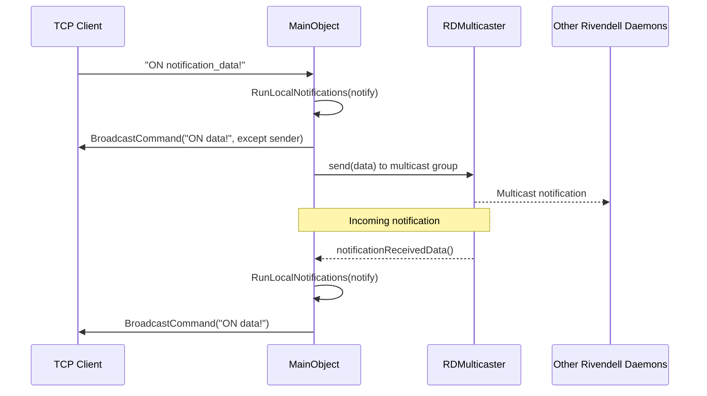
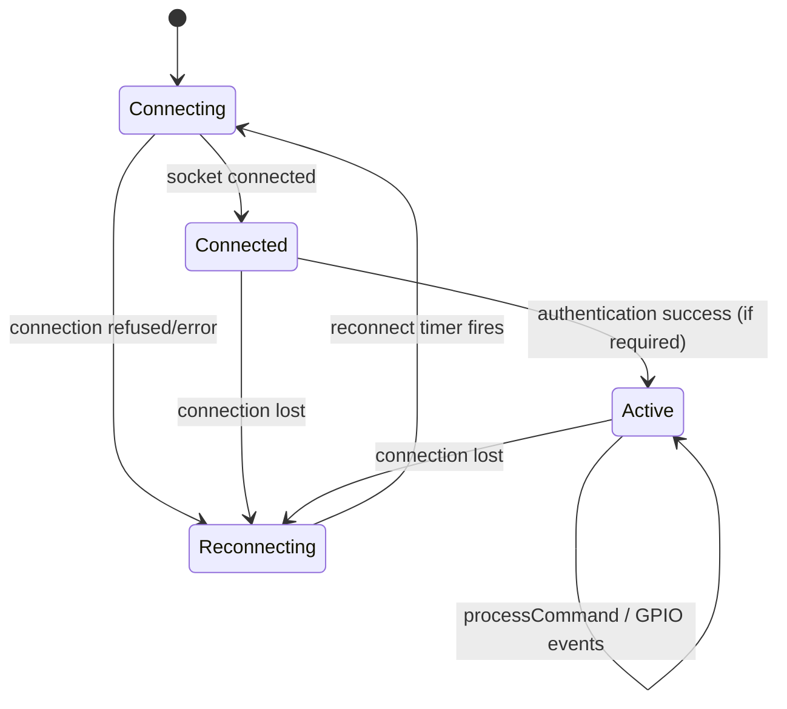
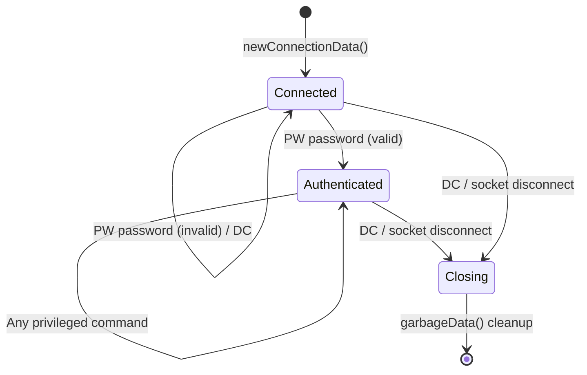

# Semantic Context: RPC (ripcd)

## Overview

ripcd is the Rivendell IPC (Inter-Process Communication) daemon. It manages hardware switcher/GPIO matrices,
RML (Rivendell Macro Language) command processing, serial TTY devices, and notification multicasting.
It serves as the central hardware abstraction layer for GPIO (General Purpose Input/Output) and audio
routing switcher control in the Rivendell radio automation system.

## Files & Symbols

### Source Files

| File | Type | Symbols | LOC (est) |
|------|------|---------|-----------|
| ripcd.h | header | MainObject | ~90 |
| ripcd.cpp | impl | MainObject (constructor, startup) | ~300 |
| ripcd_connection.h | header | RipcdConnection | ~25 |
| ripcd_connection.cpp | impl | RipcdConnection | ~60 |
| switcher.h | header | Switcher (base class) | ~35 |
| switcher.cpp | impl | Switcher | ~80 |
| globals.h | header | ripcd_active_locks (global) | ~10 |
| loaddrivers.cpp | impl | LoadSwitchDriver() | ~200 |
| local_macros.cpp | impl | LoadLocalMacros(), RunLocalMacros() | ~300 |
| local_notifications.cpp | impl | RunLocalNotifications() | ~100 |
| local_gpio.h | header | LocalGpio | ~30 |
| local_gpio.cpp | impl | LocalGpio | ~100 |
| local_audio.h | header | LocalAudio | ~40 |
| local_audio.cpp | impl | LocalAudio (HPI-based GPIO) | ~200 |
| modbus.h | header | Modbus | ~50 |
| modbus.cpp | impl | Modbus (Modbus TCP protocol) | ~300 |
| modemlines.h | header | ModemLines | ~40 |
| modemlines.cpp | impl | ModemLines (serial modem GPIO) | ~200 |
| kernelgpio.h | header | KernelGpio | ~35 |
| kernelgpio.cpp | impl | KernelGpio (Linux kernel GPIO) | ~150 |
| bt16x1.h | header | Bt16x1 | ~25 |
| bt16x1.cpp | impl | Bt16x1 (BroadcastTools 16x1) | ~80 |
| bt10x1.h | header | Bt10x1 | ~25 |
| bt10x1.cpp | impl | Bt10x1 (BroadcastTools 10x1) | ~80 |
| bt16x2.h | header | Bt16x2 | ~40 |
| bt16x2.cpp | impl | Bt16x2 (BroadcastTools 16x2) | ~200 |
| bt8x2.h | header | Bt8x2 | ~25 |
| bt8x2.cpp | impl | Bt8x2 (BroadcastTools 8x2) | ~80 |
| btss21.h | header | BtSs21 | ~25 |
| btss21.cpp | impl | BtSs21 (BroadcastTools SS2.1) | ~80 |
| btss42.h | header | BtSs42 | ~40 |
| btss42.cpp | impl | BtSs42 (BroadcastTools SS4.2) | ~200 |
| btss44.h | header | BtSs44 | ~40 |
| btss44.cpp | impl | BtSs44 (BroadcastTools SS4.4) | ~200 |
| btss82.h | header | BtSs82 | ~40 |
| btss82.cpp | impl | BtSs82 (BroadcastTools SS8.2) | ~200 |
| btss124.h | header | BtSs124 | ~25 |
| btss124.cpp | impl | BtSs124 (BroadcastTools SS12.4) | ~80 |
| btss164.h | header | BtSs164 | ~40 |
| btss164.cpp | impl | BtSs164 (BroadcastTools SS16.4) | ~200 |
| btss41mlr.h | header | BtSs41Mlr | ~40 |
| btss41mlr.cpp | impl | BtSs41Mlr (BroadcastTools SS4.1 MLR) | ~200 |
| btu41mlrweb.h | header | BtU41MlrWeb | ~40 |
| btu41mlrweb.cpp | impl | BtU41MlrWeb (BroadcastTools U4.1 MLR Web) | ~200 |
| btacs82.h | header | BtAcs82 | ~40 |
| btacs82.cpp | impl | BtAcs82 (BroadcastTools ACS8.2) | ~200 |
| btadms4422.h | header | BtAdms4422 | ~40 |
| btadms4422.cpp | impl | BtAdms4422 (BroadcastTools ADMS44.22) | ~200 |
| btsrc16.h | header | BtSrc16 | ~35 |
| btsrc16.cpp | impl | BtSrc16 (BroadcastTools SRC-16) | ~150 |
| btsrc8iii.h | header | BtSrc8Iii | ~35 |
| btsrc8iii.cpp | impl | BtSrc8Iii (BroadcastTools SRC-8 III) | ~150 |
| btsentinel4web.h | header | BtSentinel4Web | ~35 |
| btsentinel4web.cpp | impl | BtSentinel4Web (BroadcastTools Sentinel 4 Web) | ~200 |
| btgpi16.h | header | BtGpi16 | ~35 |
| btgpi16.cpp | impl | BtGpi16 (BroadcastTools GPI-16) | ~100 |
| sas64000.h | header | Sas64000 | ~25 |
| sas64000.cpp | impl | Sas64000 (SAS 64000) | ~100 |
| sas64000gpi.h | header | Sas64000Gpi | ~30 |
| sas64000gpi.cpp | impl | Sas64000Gpi (SAS 64000 GPI) | ~100 |
| sas32000.h | header | Sas32000 | ~30 |
| sas32000.cpp | impl | Sas32000 (SAS 32000) | ~100 |
| sas16000.h | header | Sas16000 | ~30 |
| sas16000.cpp | impl | Sas16000 (SAS 16000) | ~100 |
| sasusi.h | header | SasUsi | ~50 |
| sasusi.cpp | impl | SasUsi (SAS USI protocol) | ~300 |
| vguest.h | header | VGuest | ~60 |
| vguest.cpp | impl | VGuest (Logitek vGuest protocol) | ~400 |
| gvc7000.h | header | Gvc7000 | ~35 |
| gvc7000.cpp | impl | Gvc7000 (GVC-7000) | ~200 |
| quartz1.h | header | Quartz1 | ~40 |
| quartz1.cpp | impl | Quartz1 (Quartz Type 1) | ~200 |
| harlond.h | header | Harlond | ~50 |
| harlond.cpp | impl | Harlond (Logitek Harlond) | ~300 |
| am16.h | header | Am16 | ~35 |
| am16.cpp | impl | Am16 (360 Systems AM-16) | ~200 |
| acu1p.h | header | Acu1p | ~40 |
| acu1p.cpp | impl | Acu1p (ACU-1 Protocol) | ~200 |
| unity4000.h | header | Unity4000 | ~30 |
| unity4000.cpp | impl | Unity4000 (Unity 4000) | ~100 |
| unity_feed.h | header | UnityFeed | ~20 |
| unity_feed.cpp | impl | UnityFeed (feed data object) | ~30 |
| starguide3.h | header | StarGuide3 | ~30 |
| starguide3.cpp | impl | StarGuide3 (StarGuide III) | ~100 |
| starguide_feed.h | header | StarGuideFeed | ~20 |
| starguide_feed.cpp | impl | StarGuideFeed (feed data object) | ~30 |
| swauthority.h | header | SoftwareAuthority | ~55 |
| swauthority.cpp | impl | SoftwareAuthority (Software Authority Protocol) | ~350 |
| rossnkscp.h | header | RossNkScp | ~25 |
| rossnkscp.cpp | impl | RossNkScp (Ross/NK SCP protocol) | ~100 |
| livewire_lwrpgpio.h | header | LiveWireLwrpGpio | ~30 |
| livewire_lwrpgpio.cpp | impl | LiveWireLwrpGpio (Livewire LWRP GPIO) | ~150 |
| livewire_lwrpaudio.h | header | LiveWireLwrpAudio | ~30 |
| livewire_lwrpaudio.cpp | impl | LiveWireLwrpAudio (Livewire LWRP Audio) | ~150 |
| livewire_mcastgpio.h | header | LiveWireMcastGpio | ~60 |
| livewire_mcastgpio.cpp | impl | LiveWireMcastGpio (Livewire Multicast GPIO) | ~300 |
| wheatnet_slio.h | header | WheatnetSlio | ~45 |
| wheatnet_slio.cpp | impl | WheatnetSlio (Wheatnet SLIO) | ~250 |
| wheatnet_lio.h | header | WheatnetLio | ~45 |
| wheatnet_lio.cpp | impl | WheatnetLio (Wheatnet LIO) | ~250 |
| Makefile.am | build | Build configuration | ~50 |

### Symbol Index

| Symbol | Kind | File | Qt Class? | Category |
|--------|------|------|-----------|----------|
| MainObject | Class | ripcd.h | Yes (Q_OBJECT) | Daemon Core |
| RipcdConnection | Class | ripcd_connection.h | No | DTO / Connection |
| Switcher | Class | switcher.h | Yes (Q_OBJECT) | Abstract Base |
| Bt16x1 | Class | bt16x1.h | Yes (Q_OBJECT) | Switcher Driver |
| Bt10x1 | Class | bt10x1.h | Yes (Q_OBJECT) | Switcher Driver |
| Bt16x2 | Class | bt16x2.h | Yes (Q_OBJECT) | Switcher Driver |
| Bt8x2 | Class | bt8x2.h | Yes (Q_OBJECT) | Switcher Driver |
| BtSs21 | Class | btss21.h | Yes (Q_OBJECT) | Switcher Driver |
| BtSs42 | Class | btss42.h | Yes (Q_OBJECT) | Switcher Driver |
| BtSs44 | Class | btss44.h | Yes (Q_OBJECT) | Switcher Driver |
| BtSs82 | Class | btss82.h | Yes (Q_OBJECT) | Switcher Driver |
| BtSs124 | Class | btss124.h | Yes (Q_OBJECT) | Switcher Driver |
| BtSs164 | Class | btss164.h | Yes (Q_OBJECT) | Switcher Driver |
| BtSs41Mlr | Class | btss41mlr.h | Yes (Q_OBJECT) | Switcher Driver |
| BtU41MlrWeb | Class | btu41mlrweb.h | Yes (Q_OBJECT) | Switcher Driver |
| BtAcs82 | Class | btacs82.h | Yes (Q_OBJECT) | Switcher Driver |
| BtAdms4422 | Class | btadms4422.h | Yes (Q_OBJECT) | Switcher Driver |
| BtSrc16 | Class | btsrc16.h | Yes (Q_OBJECT) | Switcher Driver |
| BtSrc8Iii | Class | btsrc8iii.h | Yes (Q_OBJECT) | Switcher Driver |
| BtSentinel4Web | Class | btsentinel4web.h | Yes (Q_OBJECT) | Switcher Driver |
| BtGpi16 | Class | btgpi16.h | Yes (Q_OBJECT) | Switcher Driver |
| Sas64000 | Class | sas64000.h | Yes (Q_OBJECT) | Switcher Driver |
| Sas64000Gpi | Class | sas64000gpi.h | Yes (Q_OBJECT) | Switcher Driver |
| Sas32000 | Class | sas32000.h | Yes (Q_OBJECT) | Switcher Driver |
| Sas16000 | Class | sas16000.h | Yes (Q_OBJECT) | Switcher Driver |
| SasUsi | Class | sasusi.h | Yes (Q_OBJECT) | Switcher Driver |
| VGuest | Class | vguest.h | Yes (Q_OBJECT) | Switcher Driver |
| Gvc7000 | Class | gvc7000.h | Yes (Q_OBJECT) | Switcher Driver |
| Quartz1 | Class | quartz1.h | Yes (Q_OBJECT) | Switcher Driver |
| Harlond | Class | harlond.h | Yes (Q_OBJECT) | Switcher Driver |
| Am16 | Class | am16.h | Yes (Q_OBJECT) | Switcher Driver |
| Acu1p | Class | acu1p.h | Yes (Q_OBJECT) | Switcher Driver |
| Unity4000 | Class | unity4000.h | Yes (Q_OBJECT) | Switcher Driver |
| StarGuide3 | Class | starguide3.h | Yes (Q_OBJECT) | Switcher Driver |
| SoftwareAuthority | Class | swauthority.h | Yes (Q_OBJECT) | Switcher Driver |
| RossNkScp | Class | rossnkscp.h | Yes (Q_OBJECT) | Switcher Driver |
| LiveWireLwrpGpio | Class | livewire_lwrpgpio.h | Yes (Q_OBJECT) | Switcher Driver |
| LiveWireLwrpAudio | Class | livewire_lwrpaudio.h | Yes (Q_OBJECT) | Switcher Driver |
| LiveWireMcastGpio | Class | livewire_mcastgpio.h | Yes (Q_OBJECT) | Switcher Driver |
| Modbus | Class | modbus.h | Yes (Q_OBJECT) | Switcher Driver |
| ModemLines | Class | modemlines.h | Yes (Q_OBJECT) | Switcher Driver |
| KernelGpio | Class | kernelgpio.h | Yes (Q_OBJECT) | Switcher Driver |
| LocalGpio | Class | local_gpio.h | Yes (Q_OBJECT) | Switcher Driver |
| LocalAudio | Class | local_audio.h | Yes (Q_OBJECT) | Switcher Driver |
| WheatnetSlio | Class | wheatnet_slio.h | Yes (Q_OBJECT) | Switcher Driver |
| WheatnetLio | Class | wheatnet_lio.h | Yes (Q_OBJECT) | Switcher Driver |
| UnityFeed | Class | unity_feed.h | No | Value Object |
| StarGuideFeed | Class | starguide_feed.h | No | Value Object |

## Class API Surface

### MainObject [Daemon Core]
- **File:** ripcd.h / ripcd.cpp, local_macros.cpp, local_notifications.cpp, local_gpio.cpp, loaddrivers.cpp
- **Inherits:** QObject
- **Qt Object:** Yes (Q_OBJECT)
- **Role:** Central daemon object -- manages TCP client connections, RML socket listeners, switcher driver lifecycle, GPIO state tables, macro timers, TTY devices, notification multicasting, and JACK audio connectivity.

#### Signals
None (MainObject does not emit signals; it receives them from Switcher drivers).

#### Slots (all private)
| Slot | Parameters | Description |
|------|-----------|-------------|
| newConnectionData | () | Accept new TCP client connection |
| notificationReceivedData | (const QString &msg, const QHostAddress &addr) | Handle received multicast notification |
| sendRml | (RDMacro *rml) | Route outgoing RML to appropriate UDP socket |
| rmlEchoData | () | Read from RML echo UDP socket (port RD_RML_ECHO_PORT) |
| rmlNoechoData | () | Read from RML no-echo UDP socket (port RD_RML_NOECHO_PORT) |
| rmlReplyData | () | Read from RML reply UDP socket (port RD_RML_REPLY_PORT) |
| gpiChangedData | (int matrix, int line, bool state) | GPI state change from switcher driver; logs, broadcasts, fires macro cart |
| gpoChangedData | (int matrix, int line, bool state) | GPO state change from switcher driver; logs, broadcasts, fires macro cart |
| gpiStateData | (int matrix, unsigned line, bool state) | GPI initial state report from switcher driver |
| gpoStateData | (int matrix, unsigned line, bool state) | GPO initial state report from switcher driver |
| ttyTrapData | (int cartnum) | TTY code trap fired -- execute associated cart |
| ttyReadyReadData | (int num) | Data available on TTY port |
| macroTimerData | (int num) | Macro timer expired -- execute associated cart |
| readyReadData | (int conn_id) | Data available on client TCP connection |
| killData | (int conn_id) | Client TCP connection closed |
| exitTimerData | () | Polls global_exiting flag (200ms); initiates clean shutdown |
| garbageData | () | Garbage-collect closed connections |
| startJackData | () | (JACK only) Connect to JACK server after 5s delay |

#### Private Methods
| Method | Return | Parameters | Brief |
|--------|--------|-----------|-------|
| SetUser | void | (QString username) | Set current user on station |
| ExecCart | void | (int cartnum) | Create RML EX command and send via sendRml |
| LogGpioEvent | void | (int matrix, int line, RDMatrix::GpioType type, bool state) | Insert GPIO event into GPIO_EVENTS table |
| DispatchCommand | bool | (RipcdConnection *conn) | Parse and dispatch TCP client command (DC, PW, RU, SU, MS, ME, RG, GI, GO, GM, GN, GC, GD, ON, TA) |
| EchoCommand | void | (int, const QString &cmd) | Send command response to single client |
| BroadcastCommand | void | (const QString &cmd, int except_ch=-1) | Broadcast command to all authenticated clients |
| ReadRmlSocket | void | (QUdpSocket *sock, RDMacro::Role role, bool echo) | Read and parse RML from UDP socket |
| StripPoint | QString | (QString) | Utility string processing |
| LoadLocalMacros | void | () | Query MATRICES table, load switcher drivers; query TTYS table, open serial ports |
| RunLocalNotifications | void | (RDNotification *notify) | Handle dropbox notifications by signaling rdservice |
| RunLocalMacros | void | (RDMacro *rml) | Main RML command dispatcher (BO, GI, GE, JC, JD, JZ, LO, MB, MT, RN, SI, SC, SO, CL/FS/GO/ST/SA/SD/SG/SR/SL/SX, SY, SZ, TA, UO) |
| LoadGpiTable | void | () | Load GPI/GPO macro cart assignments from GPIS/GPOS tables |
| SendGpi | void | (int ch, int matrix) | Send GPI state to client |
| SendGpo | void | (int ch, int matrix) | Send GPO state to client |
| SendGpiMask | void | (int ch, int matrix) | Send GPI mask state to client |
| SendGpoMask | void | (int ch, int matrix) | Send GPO mask state to client |
| SendGpiCart | void | (int ch, int matrix) | Send GPI cart assignments to client |
| SendGpoCart | void | (int ch, int matrix) | Send GPO cart assignments to client |
| ForwardConvert | RDMacro | (const RDMacro &rml) const | Convert legacy RML format to current format |
| LoadSwitchDriver | bool | (int matrix_num) | Factory method: instantiate Switcher subclass based on RDMatrix::Type |
| RunCommand | void | (uid_t uid, gid_t gid, const QString &cmd) const | Execute system command with given uid/gid |

#### Key Fields
| Field | Type | Description |
|-------|------|-------------|
| ripcd_db | QSqlDatabase* | Database connection |
| ripcd_host | QString | Hostname |
| debug | bool | Debug mode flag |
| server | QTcpServer* | TCP server for client connections (RIPCD_TCP_PORT) |
| ripcd_conns | vector<RipcdConnection*> | Active client connections |
| ripcd_rml_send | QUdpSocket* | Outbound RML socket |
| ripcd_rml_echo | QUdpSocket* | Inbound RML echo socket (RD_RML_ECHO_PORT) |
| ripcd_rml_noecho | QUdpSocket* | Inbound RML no-echo socket (RD_RML_NOECHO_PORT) |
| ripcd_rml_reply | QUdpSocket* | Inbound RML reply socket (RD_RML_REPLY_PORT) |
| ripcd_switcher | Switcher*[MAX_MATRICES] | Array of loaded switcher drivers |
| ripcd_gpi_state | bool[MAX_MATRICES][MAX_GPIO_PINS] | Current GPI pin states |
| ripcd_gpo_state | bool[MAX_MATRICES][MAX_GPIO_PINS] | Current GPO pin states |
| ripcd_gpi_macro | int[MAX_MATRICES][MAX_GPIO_PINS][2] | Cart numbers for GPI on/off events |
| ripcd_gpo_macro | int[MAX_MATRICES][MAX_GPIO_PINS][2] | Cart numbers for GPO on/off events |
| ripcd_gpi_mask | bool[MAX_MATRICES][MAX_GPIO_PINS] | GPI masking (enabled/disabled) |
| ripcd_gpo_mask | bool[MAX_MATRICES][MAX_GPIO_PINS] | GPO masking (enabled/disabled) |
| ripcd_tty_inuse | bool[MAX_TTYS] | TTY port in-use flags |
| ripcd_tty_dev | RDTTYDevice*[MAX_TTYS] | TTY device objects |
| ripcd_tty_trap | RDCodeTrap*[MAX_TTYS] | TTY code trap objects |
| ripc_onair_flag | bool | Station on-air flag |
| ripc_macro_timer | QTimer*[RD_MAX_MACRO_TIMERS] | Macro delay timers |
| ripc_macro_cart | unsigned[RD_MAX_MACRO_TIMERS] | Cart numbers for delayed macro execution |
| ripcd_notification_mcaster | RDMulticaster* | Multicast notification sender/receiver |
| ripcd_garbage_timer | QTimer* | Connection garbage collection timer |
| ripcd_jack_client | jack_client_t* | (JACK only) JACK client handle |

---

### RipcdConnection [DTO / Connection]
- **File:** ripcd_connection.h
- **Inherits:** (none -- plain class)
- **Qt Object:** No

#### Public Methods
| Method | Return | Parameters | Brief |
|--------|--------|-----------|-------|
| RipcdConnection | | (int id, QTcpSocket *sock) | Constructor |
| ~RipcdConnection | | () | Destructor |
| id | int | () const | Connection ID |
| socket | QTcpSocket* | () | Underlying TCP socket |
| isAuthenticated | bool | () const | Authentication state |
| setAuthenticated | void | (bool state) | Set authentication state |
| isClosing | bool | () const | Whether connection is closing |
| close | void | () | Mark connection as closing |

#### Public Fields
| Field | Type | Description |
|-------|------|-------------|
| accum | QString | Accumulator for incoming command data |

---

### Switcher [Abstract Base Class]
- **File:** switcher.h / switcher.cpp
- **Inherits:** QObject
- **Qt Object:** Yes (Q_OBJECT)
- **Role:** Abstract base class for all hardware switcher/GPIO drivers. Defines the polymorphic interface that all 43 concrete drivers must implement.

#### Signals
| Signal | Parameters | Description |
|--------|-----------|-------------|
| rmlEcho | (RDMacro *cmd) | Echo RML command back to sender |
| gpiChanged | (int matrix, int line, bool state) | GPI line state changed |
| gpoChanged | (int matrix, int line, bool state) | GPO line state changed |
| gpiState | (int matrix, unsigned line, bool state) | Report GPI initial state |
| gpoState | (int matrix, unsigned line, bool state) | Report GPO initial state |

#### Public Methods (Pure Virtual)
| Method | Return | Parameters | Brief |
|--------|--------|-----------|-------|
| type | RDMatrix::Type | () | Return matrix type enum |
| gpiQuantity | unsigned | () | Number of GPI lines |
| gpoQuantity | unsigned | () | Number of GPO lines |
| primaryTtyActive | bool | () | Whether primary TTY port is in use |
| secondaryTtyActive | bool | () | Whether secondary TTY port is in use |
| processCommand | void | (RDMacro *cmd) | Process RML command for this matrix |

#### Public Methods (Virtual with default)
| Method | Return | Parameters | Brief |
|--------|--------|-----------|-------|
| sendGpi | void | () | Send current GPI states (default: no-op) |
| sendGpo | void | () | Send current GPO states (default: no-op) |

#### Non-Virtual Methods
| Method | Return | Parameters | Brief |
|--------|--------|-----------|-------|
| stationName | QString | () const | Station name for this matrix |
| matrixNumber | int | () const | Matrix number for this matrix |

#### Protected Methods
| Method | Return | Parameters | Brief |
|--------|--------|-----------|-------|
| executeMacroCart | void | (unsigned cartnum) | Execute macro cart via RML |
| logBytes | void | (uint8_t *data, int len) | Debug log raw bytes |
| insertGpioEntry | void | (bool is_gpo, int line) | Insert GPIO entry into GPIS/GPOS table if not exists |

---

### Switcher Driver Classes (43 concrete implementations)

All inherit from `Switcher` and implement the same pure virtual interface.
They are grouped by manufacturer/protocol family:

#### BroadcastTools Serial Switchers (simple serial protocol)
| Class | RDMatrix::Type | Description | Communication | Has GPIO? |
|-------|---------------|-------------|---------------|-----------|
| Bt16x1 | Bt16x1 | 16x1 audio switcher | Serial/TTY | No |
| Bt10x1 | Bt10x1 | 10x1 audio switcher | Serial/TTY | No |
| Bt16x2 | Bt16x2 | 16x2 audio switcher | Serial/TTY | Yes (GPI/GPO polling) |
| Bt8x2 | Bt8x2 | 8x2 audio switcher | Serial/TTY | No |
| BtSs21 | BtSs21 | SS 2.1 stereo switcher | Serial/TTY | No |
| BtSs42 | BtSs42 | SS 4.2 stereo switcher | Serial/TTY | Yes (GPI/GPO polling) |
| BtSs44 | BtSs44 | SS 4.4 stereo switcher | Serial/TTY | Yes (GPI/GPO polling) |
| BtSs82 | BtSs82 | SS 8.2 stereo switcher | Serial/TTY | Yes (GPI/GPO polling) |
| BtSs124 | BtSs124 | SS 12.4 stereo switcher | Serial/TTY | No |
| BtSs164 | BtSs164 | SS 16.4 stereo switcher | Serial/TTY | Yes (GPI/GPO polling) |
| BtSs41Mlr | BtSs41Mlr | SS 4.1 MLR multi-layer | Serial/TTY | Yes (GPI/GPO + status parsing) |
| BtAcs82 | BtAcs82 | ACS 8.2 switcher | Serial/TTY | Yes (GPI/GPO polling) |
| BtAdms4422 | BtAdms4422 | ADMS 44.22 switcher | Serial/TTY | Yes (GPI/GPO polling) |
| BtSrc16 | BtSrc16 | SRC-16 source controller | Serial/TTY | Yes (GPI/GPO polling) |
| BtSrc8Iii | BtSrc8Iii | SRC-8 III source controller | Serial/TTY | Yes (GPI/GPO polling) |
| BtGpi16 | BtGpi16 | GPI-16 input panel | Serial/TTY | Yes (GPI only) |

#### BroadcastTools Network Switchers
| Class | RDMatrix::Type | Description | Communication | Has GPIO? |
|-------|---------------|-------------|---------------|-----------|
| BtU41MlrWeb | BtU41MlrWeb | U4.1 MLR Web switcher | TCP/IP | Yes (GPI via web) |
| BtSentinel4Web | BtSentinel4Web | Sentinel 4 Web | TCP/IP | No |

#### SAS (Sierra Automated Systems)
| Class | RDMatrix::Type | Description | Communication | Has GPIO? |
|-------|---------------|-------------|---------------|-----------|
| Sas64000 | Sas64000 | SAS 64000 routing switcher | Serial/TTY | No |
| Sas64000Gpi | Sas64000Gpi | SAS 64000 GPI subsystem | Serial/TTY | Yes (GPI/GPO) |
| Sas32000 | Sas32000 | SAS 32000 routing switcher | Serial/TTY | No |
| Sas16000 | Sas16000 | SAS 16000 routing switcher | Serial/TTY | Yes (GPI/GPO) |
| SasUsi | SasUsi | SAS USI protocol | TCP/IP | Yes (GPI/GPO + input/output labels) |

#### Logitek
| Class | RDMatrix::Type | Description | Communication | Has GPIO? |
|-------|---------------|-------------|---------------|-----------|
| VGuest | LogitekVguest | Logitek vGuest protocol | TCP/IP | Yes (relay-based GPIO) |
| Harlond | Harlond | Logitek Harlond protocol | TCP/IP | No (crosspoint only) |

#### Axia/Livewire
| Class | RDMatrix::Type | Description | Communication | Has GPIO? |
|-------|---------------|-------------|---------------|-----------|
| LiveWireLwrpGpio | LiveWireLwrpGpio | Livewire LWRP GPIO control | TCP/IP (LWRP) | Yes |
| LiveWireLwrpAudio | LiveWireLwrpAudio | Livewire LWRP audio routing | TCP/IP (LWRP) | No (audio crosspoints) |
| LiveWireMcastGpio | LiveWireMcastGpio | Livewire multicast GPIO | UDP multicast | Yes |

#### Wheatstone/Wheatnet
| Class | RDMatrix::Type | Description | Communication | Has GPIO? |
|-------|---------------|-------------|---------------|-----------|
| WheatnetSlio | WheatnetSlio | Wheatnet SLIO blade | TCP/IP | Yes |
| WheatnetLio | WheatnetLio | Wheatnet LIO blade | TCP/IP | Yes |

#### Other Protocols
| Class | RDMatrix::Type | Description | Communication | Has GPIO? |
|-------|---------------|-------------|---------------|-----------|
| Quartz1 | Quartz1 | Quartz Type 1 router | TCP/IP | No |
| Gvc7000 | Gvc7000 | GrassValley Series 7000 | TCP/IP | No |
| Am16 | Am16 | 360 Systems AM-16 | Serial/MIDI SysEx | No |
| Acu1p | Acu1p | ACU-1 protocol | Serial/TTY | Yes (GPI/GPO) |
| Unity4000 | Unity4000 | Unity 4000 satellite receiver | Serial/TTY | No |
| StarGuide3 | StarGuideIII | StarGuide III satellite receiver | Serial/TTY | No |
| SoftwareAuthority | SoftwareAuthority | Pathfinder/Software Authority | TCP/IP | Yes (GPI/GPO + input/output labels) |
| RossNkScp | RossNkScp | Ross/NK SCP protocol | Serial/TTY | No |
| Modbus | Modbus | Modbus TCP protocol | TCP/IP | Yes (coils as GPIO) |
| ModemLines | ModemLines | Serial modem control lines | Serial/TTY modem lines | Yes (CTS/DSR/RTS/DTR) |

#### Local/System Drivers
| Class | RDMatrix::Type | Description | Communication | Has GPIO? |
|-------|---------------|-------------|---------------|-----------|
| LocalGpio | LocalGpio | Linux GPIO subsystem | Kernel GPIO | Yes |
| LocalAudio | LocalAudioAdapter | HPI audio adapter GPIO | HPI library | Yes |
| KernelGpio | KernelGpio | Kernel GPIO device | Kernel GPIO | Yes |

---

### UnityFeed [Value Object]
- **File:** unity_feed.h
- **Inherits:** (none)
- **Qt Object:** No
- **Methods:** feed(), setFeed(), mode(), setMode(), clear()

### StarGuideFeed [Value Object]
- **File:** starguide_feed.h
- **Inherits:** (none)
- **Qt Object:** No
- **Methods:** providerId(), setProviderId(), serviceId(), setServiceId(), mode(), setMode(), clear()

## Data Model

ripcd does NOT define its own tables (they are defined in the LIB artifact's database schema).
ripcd accesses the following tables from the shared Rivendell database:

### Table: MATRICES
- **Used by:** MainObject::LoadLocalMacros() (SELECT), SoftwareAuthority (UPDATE), LiveWireLwrpGpio (UPDATE), WheatnetSlio (UPDATE), WheatnetLio (UPDATE)
- **Key columns accessed:** MATRIX, TYPE, PORT, INPUTS, OUTPUTS, GPIS, GPOS, STATION_NAME
- **Operations:** SELECT to enumerate configured matrices at startup; UPDATE to sync discovered GPIO/input/output counts for auto-configuring protocols (Livewire, Wheatnet, SoftwareAuthority)

### Table: GPIS
- **Used by:** MainObject::LoadGpiTable() (SELECT), Switcher::insertGpioEntry() (SELECT + INSERT), WheatnetSlio (SELECT + INSERT), WheatnetLio (SELECT + INSERT)
- **Key columns accessed:** MATRIX, NUMBER, OFF_MACRO_CART, MACRO_CART, STATION_NAME, ID
- **Operations:** SELECT to load GPI-to-macro-cart mapping at startup; INSERT to auto-populate GPI entries for auto-configuring protocols

### Table: GPOS
- **Used by:** MainObject::LoadGpiTable() (SELECT), Switcher::insertGpioEntry() (SELECT + INSERT), WheatnetSlio (SELECT + INSERT), WheatnetLio (SELECT + INSERT)
- **Key columns accessed:** MATRIX, NUMBER, OFF_MACRO_CART, MACRO_CART, STATION_NAME, ID
- **Operations:** SELECT to load GPO-to-macro-cart mapping at startup; INSERT to auto-populate GPO entries

### Table: INPUTS
- **Used by:** SasUsi (SELECT + INSERT + UPDATE), SoftwareAuthority (SELECT + INSERT + UPDATE), LiveWireLwrpAudio (DELETE + INSERT), VGuest (SELECT), Unity4000 (SELECT), StarGuide3 (SELECT)
- **Key columns accessed:** NUMBER, NAME, STATION_NAME, MATRIX, NODE_HOSTNAME, NODE_TCP_PORT, NODE_SLOT, ENGINE_NUM, DEVICE_NUM
- **Operations:** CRUD for audio input port mapping; auto-discovery of input labels

### Table: OUTPUTS
- **Used by:** SasUsi (SELECT + INSERT + UPDATE), SoftwareAuthority (SELECT + INSERT + UPDATE), LiveWireLwrpAudio (DELETE + INSERT), VGuest (SELECT)
- **Key columns accessed:** NUMBER, NAME, STATION_NAME, MATRIX, NODE_HOSTNAME, NODE_TCP_PORT, NODE_SLOT, ENGINE_NUM, DEVICE_NUM
- **Operations:** CRUD for audio output port mapping; auto-discovery of output labels

### Table: GPIO_EVENTS
- **Used by:** MainObject::LogGpioEvent() (INSERT)
- **Key columns accessed:** STATION_NAME, MATRIX, NUMBER, TYPE, EDGE, EVENT_DATETIME
- **Operations:** INSERT to log every GPI/GPO state change event with timestamp

### Table: TTYS
- **Used by:** MainObject::LoadLocalMacros() (SELECT)
- **Key columns accessed:** PORT_ID, PORT, BAUD_RATE, DATA_BITS, PARITY, TERMINATION, STATION_NAME, ACTIVE
- **Operations:** SELECT to enumerate and open configured serial TTY ports at startup

### ERD (tables accessed by ripcd)



## Reactive Architecture

### Signal/Slot Connections

#### Core Daemon (ripcd.cpp constructor)
| # | Sender | Signal | Receiver | Slot | Location |
|---|--------|--------|----------|------|----------|
| 1 | ripcd_ready_mapper | mapped(int) | this | readyReadData(int) | ripcd.cpp:105 |
| 2 | ripcd_kill_mapper | mapped(int) | this | killData(int) | ripcd.cpp:108 |
| 3 | server (QTcpServer) | newConnection() | this | newConnectionData() | ripcd.cpp:114 |
| 4 | mapper (macro timers) | mapped(int) | this | macroTimerData(int) | ripcd.cpp:120 |
| 5 | ripc_macro_timer[i] | timeout() | mapper | map() | ripcd.cpp:125 |
| 6 | ripcd_tty_ready_read_mapper | mapped(int) | this | ttyReadyReadData(int) | ripcd.cpp:132 |
| 7 | ripcd_rml_echo | readyRead() | this | rmlEchoData() | ripcd.cpp:156 |
| 8 | ripcd_rml_noecho | readyRead() | this | rmlNoechoData() | ripcd.cpp:160 |
| 9 | ripcd_rml_reply | readyRead() | this | rmlReplyData() | ripcd.cpp:164 |
| 10 | ripcd_notification_mcaster | received(QString,QHostAddress) | this | notificationReceivedData(QString,QHostAddress) | ripcd.cpp:178 |
| 11 | timer (exit) | timeout() | this | exitTimerData() | ripcd.cpp:189 |
| 12 | ripcd_garbage_timer | timeout() | this | garbageData() | ripcd.cpp:196 |
| 13 | ripcd_start_jack_timer | timeout() | this | startJackData() | ripcd.cpp:204 (JACK only) |

#### Client Connections (dynamic, in newConnectionData)
| # | Sender | Signal | Receiver | Slot | Location |
|---|--------|--------|----------|------|----------|
| 14 | conn->socket() | readyRead() | ripcd_ready_mapper | map() | ripcd.cpp:235 |
| 15 | conn->socket() | connectionClosed() | ripcd_kill_mapper | map() | ripcd.cpp:238 |

#### Switcher Driver Connections (loaddrivers.cpp, per matrix)
| # | Sender | Signal | Receiver | Slot | Location |
|---|--------|--------|----------|------|----------|
| 16 | ripcd_switcher[n] | rmlEcho(RDMacro*) | this | sendRml(RDMacro*) | loaddrivers.cpp:266 |
| 17 | ripcd_switcher[n] | gpiChanged(int,int,bool) | this | gpiChangedData(int,int,bool) | loaddrivers.cpp:268 |
| 18 | ripcd_switcher[n] | gpoChanged(int,int,bool) | this | gpoChangedData(int,int,bool) | loaddrivers.cpp:271 |
| 19 | ripcd_switcher[n] | gpiState(int,unsigned,bool) | this | gpiStateData(int,unsigned,bool) | loaddrivers.cpp:274 |
| 20 | ripcd_switcher[n] | gpoState(int,unsigned,bool) | this | gpoStateData(int,unsigned,bool) | loaddrivers.cpp:277 |

#### TTY Device Connections (local_macros.cpp, LoadLocalMacros)
| # | Sender | Signal | Receiver | Slot | Location |
|---|--------|--------|----------|------|----------|
| 21 | ripcd_tty_dev[port] | readyRead() | ripcd_tty_ready_read_mapper | map() | local_macros.cpp:214 |
| 22 | ripcd_tty_trap[port] | trapped(int) | this | ttyTrapData(int) | local_macros.cpp:221 |

### Key Sequence Diagrams

#### Startup Sequence


#### RML Command Flow (client-initiated)


#### GPIO Event Flow (hardware-initiated)


#### Notification Flow


### TCP Protocol (ripcd client commands)

| Command | Auth Required | Parameters | Description |
|---------|--------------|------------|-------------|
| DC | No | (none) | Drop connection |
| PW | No | password | Authenticate with password |
| RU | Yes | (none) | Request current user name |
| SU | Yes | username | Set current user |
| MS | Yes | addr port rml_command | Send RML macro command |
| ME | Yes | addr port rml_reply | Send RML reply |
| RG | Yes | (none) | Reload GPI/GPO table from database |
| GI | Yes | matrix | Request complete GPI status for matrix |
| GO | Yes | matrix | Request complete GPO status for matrix |
| GM | Yes | matrix | Request complete GPI mask states |
| GN | Yes | matrix | Request complete GPO mask states |
| GC | Yes | matrix | Request GPI cart assignments |
| GD | Yes | matrix | Request GPO cart assignments |
| ON | Yes | notification_data | Send/broadcast notification |
| TA | Yes | (none) | Request on-air flag state |

### RML Commands Processed Locally (RunLocalMacros)

| RML Code | Description | Target |
|----------|-------------|--------|
| BO | Binary TTY output | TTY port |
| GI | Set GPI state / mask | GPIO subsystem |
| GE | Set GPIO enable/disable | GPIO subsystem |
| JC | JACK connect ports | JACK (conditional compile) |
| JD | JACK disconnect ports | JACK (conditional compile) |
| JZ | JACK disconnect all | JACK (conditional compile) |
| LO | Login/Logout user | Station user management |
| MB | Message box (log entry) | Logging subsystem |
| MT | Macro timer (delayed exec) | Timer subsystem |
| RN | Run system command | OS shell |
| SI | Serial TTY input config | TTY port |
| SC | Serial code trap set | TTY port |
| SO | Serial TTY output | TTY port |
| CL | Crosspoint latch | Forwarded to Switcher::processCommand |
| FS | Fire salvo | Forwarded to Switcher::processCommand |
| GO | GPIO output set | Forwarded to Switcher::processCommand |
| ST | Set crosspoint (take) | Forwarded to Switcher::processCommand |
| SA | Set audio crosspoint | Forwarded to Switcher::processCommand |
| SD | Set display text | Forwarded to Switcher::processCommand |
| SG | Set GPIO | Forwarded to Switcher::processCommand |
| SR | Set relay | Forwarded to Switcher::processCommand |
| SL | Set input level | Forwarded to Switcher::processCommand |
| SX | Set crosspoint extended | Forwarded to Switcher::processCommand |
| SY | Set system GPIO on-state | GPIO subsystem |
| SZ | Set system GPIO off-state | GPIO subsystem |
| TA | Set on-air flag | Station state |
| UO | UDP output | Network |

### Cross-Artifact Dependencies
| External Class | From Artifact | Used In | Purpose |
|---------------|---------------|---------|---------|
| RDApplication | LIB | ripcd.cpp | Application framework, config, station, logging |
| RDMatrix | LIB | loaddrivers.cpp, switcher.h | Matrix configuration data access |
| RDMacro | LIB | ripcd.h, local_macros.cpp, switcher.h | RML command parsing and representation |
| RDSqlQuery | LIB | ripcd.cpp, local_macros.cpp, switcher.cpp, multiple drivers | Database query execution |
| RDTTYDevice | LIB | ripcd.h, local_macros.cpp | Serial port device abstraction |
| RDCodeTrap | LIB | ripcd.h, local_macros.cpp | Serial data pattern matching |
| RDTty | LIB | ripcd.h | TTY configuration (termination enum) |
| RDMulticaster | LIB | ripcd.h, ripcd.cpp | Multicast notification transport |
| RDNotification | LIB | ripcd.cpp, local_notifications.cpp | Notification message parsing |
| RDUser | LIB | local_macros.cpp | User authentication |
| RDConfig | LIB | ripcd.cpp | Configuration (stationName, password) |
| RDStation | LIB | ripcd.cpp | Station settings (address, userName, jackServerName) |
| RDSystem | LIB | ripcd.cpp | System settings (notificationAddress) |
| RDLiveWire* | LIB | livewire_*.cpp | Livewire protocol handling |
| RDGpio | LIB | local_gpio.cpp, kernelgpio.cpp | Linux GPIO subsystem access |
| RDHPIPlayStream/RDHPISoundCard | HPI | local_audio.cpp | HPI audio adapter GPIO access |

## Business Rules

### Rule: Password Authentication Required
- **Source:** ripcd.cpp:514
- **Trigger:** Any TCP command except DC and PW
- **Condition:** `!conn->isAuthenticated()`
- **Action:** Command rejected with "-" suffix; not processed
- **Gherkin:**
  ```gherkin
  Scenario: Unauthenticated command rejection
    Given a client is connected to ripcd TCP port
    And the client has not sent a valid PW command
    When the client sends any privileged command (RU, SU, MS, etc.)
    Then the command is rejected with a "-" suffix response
    And the command is not executed
  ```

### Rule: GPI Mask Check Before Macro Execution
- **Source:** local_macros.cpp:50-54
- **Trigger:** GPI state change from hardware
- **Condition:** `ripcd_gpi_mask[matrix][line]` is false (masked)
- **Action:** GPI state is broadcast to clients but macro cart is NOT executed
- **Gherkin:**
  ```gherkin
  Scenario: Masked GPI does not fire macro
    Given a GPI line is configured with a macro cart
    And the GPI mask for that line is disabled (false)
    When the hardware GPI state changes
    Then the state change is broadcast to all clients ("GI matrix line state mask!")
    But the associated macro cart is not executed
    And the GPIO event is not logged to the database
  ```

### Rule: GPO Mask Check Before Macro Execution
- **Source:** local_macros.cpp:71-75
- **Trigger:** GPO state change from hardware
- **Condition:** `ripcd_gpo_mask[matrix][line]` is false (masked)
- **Action:** GPO state is broadcast but macro cart is NOT executed
- **Gherkin:**
  ```gherkin
  Scenario: Masked GPO does not fire macro
    Given a GPO line is configured with a macro cart
    And the GPO mask for that line is disabled
    When the hardware GPO state changes
    Then the state change is broadcast to all clients
    But the associated macro cart is not executed
  ```

### Rule: Matrix Range Validation for Switcher Commands
- **Source:** local_macros.cpp:824
- **Trigger:** RML commands CL/FS/GO/ST/SA/SD/SG/SR/SL/SX
- **Condition:** `rml->arg(0).toInt() < 0 || >= MAX_MATRICES`
- **Action:** Command rejected with negative acknowledgement
- **Gherkin:**
  ```gherkin
  Scenario: Invalid matrix number in switcher command
    Given an RML switcher command is received
    When the matrix number is outside the valid range (0 to MAX_MATRICES-1)
    Then the command is negatively acknowledged
    And the command is not forwarded to any switcher driver
  ```

### Rule: Switcher Driver Null Guard
- **Source:** local_macros.cpp (multiple locations), ripcd.cpp:777
- **Trigger:** Any command targeting a matrix
- **Condition:** `ripcd_switcher[matrix_num] == NULL`
- **Action:** Command silently ignored (no driver loaded for that matrix)
- **Gherkin:**
  ```gherkin
  Scenario: Command for unconfigured matrix
    Given no switcher driver is loaded for matrix N
    When an RML command targets matrix N
    Then the command is silently ignored
  ```

### Rule: TTY Port Range Validation
- **Source:** local_macros.cpp:263 (BO), similar for SI, SC, SO
- **Trigger:** RML commands BO, SI, SC, SO
- **Condition:** `tty_port < 0 || tty_port > MAX_TTYS`
- **Action:** Command negatively acknowledged
- **Gherkin:**
  ```gherkin
  Scenario: Invalid TTY port number
    Given an RML serial output command is received
    When the TTY port number is outside valid range
    Then the command is negatively acknowledged
  ```

### Rule: RML Local Loopback Detection
- **Source:** ripcd.cpp:545-557
- **Trigger:** MS (Send RML) command
- **Condition:** `macro.address() == rda->station()->address()` AND port is echo or noecho port
- **Action:** Command processed locally via RunLocalMacros instead of being sent over network
- **Gherkin:**
  ```gherkin
  Scenario: Local RML command loopback
    Given a client sends an MS command
    And the target address matches this station's address
    And the target port is RD_RML_ECHO_PORT or RD_RML_NOECHO_PORT
    When the command is dispatched
    Then it is processed locally via RunLocalMacros
    And it is broadcast to connected clients
    But it is NOT sent over the network via UDP
  ```

### Rule: Dropbox Notification Handling
- **Source:** local_notifications.cpp:30-36
- **Trigger:** Received notification of type RDNotification::DropboxType
- **Condition:** `notify->id().toString() == rda->config()->stationName()`
- **Action:** Send SIGUSR1 to rdservice daemon (triggers dropbox scan)
- **Gherkin:**
  ```gherkin
  Scenario: Dropbox notification for this station
    Given a multicast notification is received
    And the notification type is DropboxType
    And the notification ID matches this station name
    When the notification is processed
    Then SIGUSR1 is sent to the rdservice process
  ```

### Rule: Macro Timer Delayed Execution
- **Source:** local_macros.cpp:637-670 (MT command), ripcd.cpp:343-347 (macroTimerData)
- **Trigger:** RML MT (Macro Timer) command
- **Condition:** Timer number valid (0 to RD_MAX_MACRO_TIMERS-1)
- **Action:** Cart number stored; timer started; on timeout, ExecCart fires the cart
- **Gherkin:**
  ```gherkin
  Scenario: Delayed macro cart execution
    Given an MT (Macro Timer) RML command is received
    And the timer number is valid
    When the specified delay elapses
    Then the associated macro cart is executed via ExecCart
    And the stored cart number is cleared
  ```

### Rule: Network Driver Auto-Reconnect
- **Source:** Multiple network drivers (VGuest, SasUsi, SoftwareAuthority, Harlond, Quartz1, Gvc7000, Modbus, Wheatnet*, BtU41MlrWeb, BtSentinel4Web)
- **Trigger:** Network connection lost (socket error, disconnect)
- **Condition:** Connection to external device fails or drops
- **Action:** Log warning, start reconnect timer, attempt reconnection periodically
- **Gherkin:**
  ```gherkin
  Scenario: Network switcher device reconnection
    Given a TCP/IP connection to a switcher device is active
    When the connection is lost (refused, closed, error)
    Then a LOG_WARNING is logged with device address
    And a reconnect timer is started
    And the driver periodically attempts to re-establish the connection
  ```

### Rule: Switcher Driver Factory Pattern
- **Source:** loaddrivers.cpp:72-280
- **Trigger:** MainObject::LoadSwitchDriver(matrix_num)
- **Condition:** `matrix->type()` matches a known RDMatrix::Type enum
- **Action:** Instantiate the corresponding Switcher subclass; connect its signals to MainObject slots
- **Gherkin:**
  ```gherkin
  Scenario: Load switcher driver from database
    Given a matrix is configured in the MATRICES table
    When the daemon starts and reads the matrix configuration
    Then the appropriate Switcher driver subclass is instantiated based on TYPE
    And the driver's signals (rmlEcho, gpiChanged, gpoChanged, gpiState, gpoState)
      are connected to MainObject's handler slots
  ```

### Rule: GPIO Auto-Population for Dynamic Protocols
- **Source:** Switcher::insertGpioEntry (switcher.cpp:104), WheatnetSlio (wheatnet_slio.cpp:250), WheatnetLio (wheatnet_lio.cpp:253)
- **Trigger:** Auto-configuring protocol discovers GPIO lines
- **Condition:** GPIO entry does not exist in GPIS/GPOS table for this matrix/line
- **Action:** INSERT new row into GPIS or GPOS table; UPDATE MATRICES table with discovered counts
- **Gherkin:**
  ```gherkin
  Scenario: Auto-populate GPIO entries
    Given a Wheatnet/Livewire device reports GPIO lines
    And no GPIS/GPOS entry exists for the discovered line
    When the driver processes the device response
    Then a new entry is inserted into GPIS/GPOS table
    And the MATRICES table is updated with the total GPIO count
  ```

### Rule: Connection Garbage Collection
- **Source:** ripcd.cpp:364-375 (garbageData)
- **Trigger:** Connection marked as closing (killData sets close flag)
- **Condition:** `ripcd_conns[i]->isClosing()` is true
- **Action:** Connection object deleted, slot set to NULL (garbage timer fires once after killData)
- **Gherkin:**
  ```gherkin
  Scenario: Deferred connection cleanup
    Given a client connection is closed (DC command or socket disconnect)
    When killData marks the connection as closing
    Then the garbage timer is started (single-shot)
    And on timer expiry, the connection object is deleted
    And the connection slot is set to NULL for reuse
  ```

### Rule: On-Air Flag State Management
- **Source:** local_macros.cpp:934-955 (TA command), ripcd.cpp:637-639 (TA query)
- **Trigger:** RML TA command with arg 0 or 1
- **Condition:** Valid argument (0=off, 1=on)
- **Action:** Sets `ripc_onair_flag`; broadcasts to all clients
- **Gherkin:**
  ```gherkin
  Scenario: Set on-air flag
    Given an RML TA command is received with argument 1
    When the command is processed
    Then ripc_onair_flag is set to true
    And the new state is broadcast to all connected clients
  ```

### Error Patterns
| Error | Severity | Condition | Message Template |
|-------|----------|-----------|-----------------|
| Port bind failure | LOG_ERR | Cannot bind RIPCD_TCP_PORT | "unable to bind ripc port" |
| Unknown driver | LOG_WARNING | Matrix type not in factory switch | "attempted to load unknown switcher driver for matrix %d" |
| Device connection lost | LOG_WARNING | TCP socket disconnect | "connection to {device} at {ip}:{port} closed, attempting reconnect" |
| Device connection refused | LOG_WARNING | TCP connect fails | "connection to {device} at {ip}:{port} refused, attempting reconnect" |
| Serial port open failure | LOG_WARNING | Cannot open TTY device | "unable to open serial device \"{port}\"" or "unable to open tty \"{port}\"" |
| JACK connection failure | LOG_WARNING | Various JACK status flags | Multiple JACK-specific messages |
| HPI error | LOG_WARNING | HPI function returns error | "HPI Error: {text}, {file} line {line}" |
| Auth failure (VGuest) | LOG_WARNING | Invalid username/password | "connection to vGuest device refused: {reason}" |
| Auth failure (SwAuth) | LOG_WARNING | Login failure | "error on connection: Login Failure" |
| Invalid notification | LOG_INFO | Cannot parse notification msg | "invalid notification received from {addr}" |
| MIDI device failure | LOG_WARNING | Cannot open MIDI device | "unable to open MIDI device at \"{path}\"" |
| Multicast subscribe failure | LOG_WARNING | Cannot join multicast group | "unable to subscribe to {addr} on {iface}" |

### State Machines

#### Network Driver Connection State


#### Client Connection State


### Configuration Keys
ripcd reads configuration from the database (not QSettings). Key configuration sources:
| Source | Table | Key Fields | Description |
|--------|-------|-----------|-------------|
| Station config | (via RDStation) | address, userName, jackServerName | Network address, user, JACK settings |
| System config | (via RDSystem) | notificationAddress | Multicast notification group |
| App config | (via RDConfig) | stationName, password, uid, gid | Station identity, auth password, process credentials |
| Matrix config | MATRICES | TYPE, PORT, INPUTS, OUTPUTS | Per-matrix hardware driver configuration |
| GPI mapping | GPIS | MACRO_CART, OFF_MACRO_CART | Cart numbers triggered by GPI on/off |
| GPO mapping | GPOS | MACRO_CART, OFF_MACRO_CART | Cart numbers triggered by GPO on/off |
| TTY config | TTYS | PORT, BAUD_RATE, DATA_BITS, PARITY, TERMINATION | Serial port settings |
| Network constants | (compiled) | RIPCD_TCP_PORT, RD_RML_ECHO_PORT, RD_RML_NOECHO_PORT, RD_RML_REPLY_PORT, RD_NOTIFICATION_PORT | Fixed port numbers |
| Array limits | (compiled) | MAX_MATRICES, MAX_GPIO_PINS, MAX_TTYS, RD_MAX_MACRO_TIMERS | Compiled-in array size limits |

## UI Contracts

Not applicable -- ripcd is a headless daemon with no UI (no .ui, .qml, or programmatic UI code).
