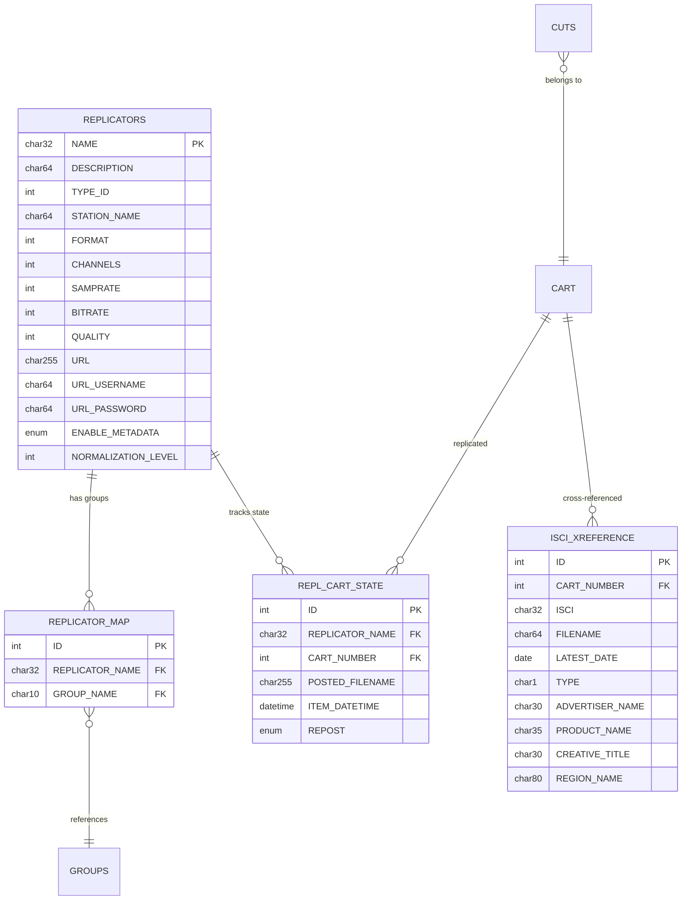
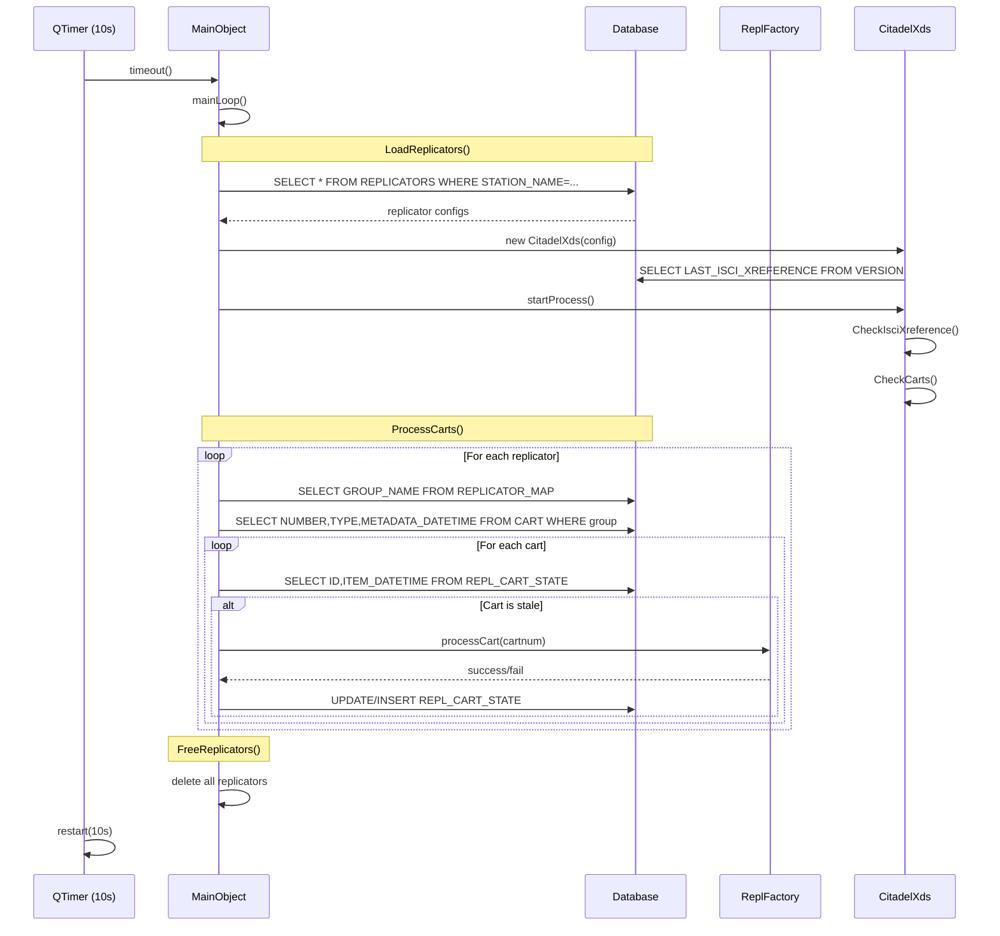
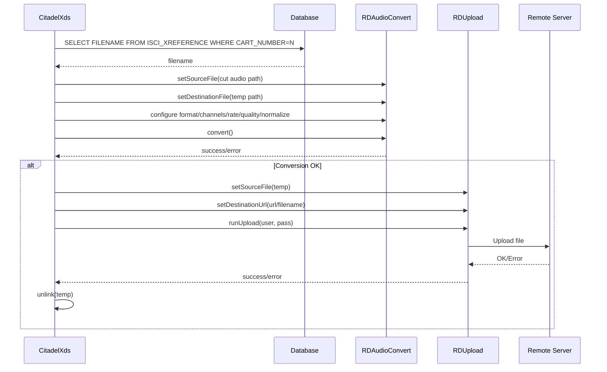
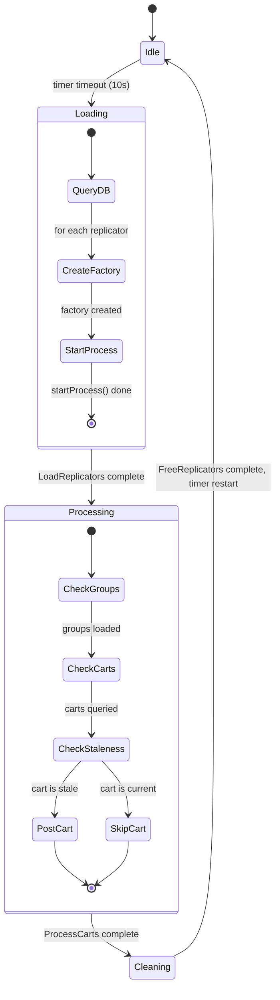

# Semantic Context: RPL (rdrepld)

## Section A: Files & Symbols

### Source Files
| File | Type | Symbols | LOC (est) |
|------|------|---------|-----------|
| rdrepld.h | header | MainObject (class), constants | ~55 |
| rdrepld.cpp | source | MainObject impl, SigHandler, main | ~210 |
| replconfig.h | header | ReplConfig (class) | ~80 |
| replconfig.cpp | source | ReplConfig impl | ~200 |
| replfactory.h | header | ReplFactory (class) | ~40 |
| replfactory.cpp | source | ReplFactory impl | ~50 |
| citadelxds.h | header | CitadelXds (class) | ~50 |
| citadelxds.cpp | source | CitadelXds impl | ~410 |
| Makefile.am | build | Build configuration | ~30 |

### Symbol Index
| Symbol | Kind | File | Qt Class? |
|--------|------|------|-----------|
| MainObject | Class | rdrepld.h | Yes (Q_OBJECT) |
| ReplConfig | Class | replconfig.h | No (plain C++) |
| ReplFactory | Class | replfactory.h | No (abstract base) |
| CitadelXds | Class | citadelxds.h | No (concrete factory) |
| SigHandler | Function | rdrepld.cpp | No |
| main | Function | rdrepld.cpp | No |

### Constants
| Constant | Value | File |
|----------|-------|------|
| RDREPLD_USAGE | "-d" usage help string | rdrepld.h |
| RD_RDREPLD_PID | "rdrepl.pid" | rdrepld.h |
| RD_RDREPL_SCAN_INTERVAL | 10000 (ms) | rdrepld.h |

## Section B: Class API Surface

### MainObject [Service/Daemon Controller]
- **File:** rdrepld.h
- **Inherits:** QObject
- **Qt Object:** Yes (Q_OBJECT)

#### Slots
| Slot | Visibility | Parameters | Description |
|------|-----------|-----------|-------------|
| mainLoop | private | () | Timer-driven main processing loop; loads replicators, processes carts, frees replicators |

#### Public Methods
| Method | Return | Parameters | Brief |
|--------|--------|-----------|-------|
| MainObject | (ctor) | (QObject *parent=0) | Initialize daemon: open DB, parse CLI, setup signal handlers, start timer loop |

#### Private Methods
| Method | Return | Parameters | Brief |
|--------|--------|-----------|-------|
| ProcessCarts | void | () | Iterate all replicators, check REPLICATOR_MAP groups, find stale carts via REPL_CART_STATE, invoke processCart on each |
| LoadReplicators | void | () | Query REPLICATORS table for this station, instantiate appropriate ReplFactory subclass per type |
| FreeReplicators | void | () | Delete all replicator instances and clear vector |

#### Fields
| Field | Type | Description |
|-------|------|-------------|
| repl_loop_timer | QTimer* | Fires every RD_RDREPL_SCAN_INTERVAL (10s) to trigger mainLoop |
| repl_temp_dir | QString | Temporary directory base path |
| repl_replicators | std::vector<ReplFactory*> | Active replicator instances |
| debug | bool | Debug mode flag (-d CLI option) |

#### Enums
None.

---

### ReplConfig [Value Object / DTO]
- **File:** replconfig.h
- **Inherits:** (none)
- **Qt Object:** No

#### Public Methods
| Method | Return | Parameters | Brief |
|--------|--------|-----------|-------|
| ReplConfig | (ctor) | () | Default constructor, calls clear() |
| type | RDReplicator::Type | () const | Get replicator type (e.g. CitadelXds) |
| setType | void | (RDReplicator::Type) | Set replicator type |
| name | QString | () const | Get replicator name |
| setName | void | (const QString&) | Set replicator name |
| stationName | QString | () const | Get station name |
| setStationName | void | (const QString&) | Set station name |
| description | QString | () const | Get description |
| setDescription | void | (const QString&) | Set description |
| format | RDSettings::Format | () const | Audio format (PCM, MPEG, etc.) |
| setFormat | void | (RDSettings::Format) | Set audio format |
| channels | unsigned | () const | Number of audio channels |
| setChannels | void | (unsigned) | Set channel count |
| sampleRate | unsigned | () const | Sample rate in Hz |
| setSampleRate | void | (unsigned) | Set sample rate |
| bitRate | unsigned | () const | Bit rate for encoding |
| setBitRate | void | (unsigned) | Set bit rate |
| quality | unsigned | () const | Encoding quality level |
| setQuality | void | (unsigned) | Set quality |
| url | QString | () const | Destination URL for uploads |
| setUrl | void | (const QString&) | Set URL |
| urlUsername | QString | () const | Authentication username |
| setUrlUsername | void | (const QString&) | Set username |
| urlPassword | QString | () const | Authentication password |
| setUrlPassword | void | (const QString&) | Set password |
| enableMetadata | bool | () const | Whether metadata is enabled |
| setEnableMetadata | void | (bool) | Set metadata flag |
| normalizeLevel | int | () const | Audio normalization level |
| setNormalizeLevel | void | (int) | Set normalization level |
| clear | void | () | Reset all fields to defaults |

#### Fields
| Field | Type | Description |
|-------|------|-------------|
| repl_name | QString | Replicator name |
| repl_type | RDReplicator::Type | Replicator type enum |
| repl_station_name | QString | Station name |
| repl_description | QString | Description text |
| repl_format | RDSettings::Format | Audio format |
| repl_channels | unsigned | Channel count |
| repl_sample_rate | unsigned | Sample rate |
| repl_bit_rate | unsigned | Bit rate |
| repl_quality | unsigned | Quality level |
| repl_url | QString | Upload URL |
| repl_url_username | QString | Auth username |
| repl_url_password | QString | Auth password |
| repl_enable_metadata | bool | Metadata enabled flag |
| repl_normalize_level | int | Normalization level |

---

### ReplFactory [Abstract Base / Strategy]
- **File:** replfactory.h
- **Inherits:** (none)
- **Qt Object:** No

#### Public Methods
| Method | Return | Parameters | Brief |
|--------|--------|-----------|-------|
| ReplFactory | (ctor) | (ReplConfig*) | Store config pointer |
| ~ReplFactory | (dtor) | () virtual | Virtual destructor |
| config | ReplConfig* | () const | Return stored config |
| startProcess | void | () = 0 pure virtual | Begin replication process (called once after load) |
| processCart | bool | (unsigned cartnum) = 0 pure virtual | Process a single cart; return true if successful |

#### Fields
| Field | Type | Description |
|-------|------|-------------|
| repl_config | ReplConfig* | Pointer to configuration DTO |

---

### CitadelXds [Concrete Strategy / Service]
- **File:** citadelxds.h
- **Inherits:** ReplFactory
- **Qt Object:** No

#### Public Methods
| Method | Return | Parameters | Brief |
|--------|--------|-----------|-------|
| CitadelXds | (ctor) | (ReplConfig*) | Load LAST_ISCI_XREFERENCE timestamp from VERSION table |
| startProcess | void | () | Check ISCI cross-reference file, then check carts for posting |
| processCart | bool | (unsigned cartnum) | Lookup cart in ISCI_XREFERENCE; if found with valid type (R or B) and not expired, post cut |

#### Private Methods
| Method | Return | Parameters | Brief |
|--------|--------|-----------|-------|
| CheckIsciXreference | void | () | Check if ISCI xref file changed; reload if newer, purge stale cuts |
| LoadIsciXreference | bool | (const QString& filename) | Parse CSV file (9 fields), clear ISCI_XREFERENCE table, insert new records; validates dates and filenames |
| ValidateFilename | bool | (const QString& filename) | Reject filenames containing illegal chars (space, %, *, +, /, :, ;, <, =, >, ?, @, [, \\, ], ^, {, |, }) |
| CheckCarts | void | () | For each ISCI_XREFERENCE entry (type R or B, not expired), check REPL_CART_STATE; post cut if stale or not posted |
| PostCut | bool | (const QString& cutname, const QString& filename) | Export audio (convert format, normalize, speed-adjust), upload via RDUpload to configured URL |
| PurgeCuts | void | () | For each REPL_CART_STATE record, if no matching ISCI_XREFERENCE exists, delete remote file and remove state record |

#### Fields
| Field | Type | Description |
|-------|------|-------------|
| xds_isci_datetime | QDateTime | Last known modification time of ISCI xref file |

### Standalone Functions

#### SigHandler
- **File:** rdrepld.cpp
- **Signature:** `void SigHandler(int signum)`
- **Purpose:** Unix signal handler for SIGINT, SIGTERM (clean PID file and exit), SIGCHLD (reap child processes)

#### main
- **File:** rdrepld.cpp
- **Signature:** `int main(int argc, char *argv[])`
- **Purpose:** Create QApplication (headless, false=no GUI), instantiate MainObject, run event loop

## Section C: Data Model

### Table: REPLICATORS
| Column | Type | Constraints |
|--------|------|------------|
| NAME | char(32) | PRIMARY KEY, NOT NULL |
| DESCRIPTION | char(64) | |
| TYPE_ID | int unsigned | NOT NULL |
| STATION_NAME | char(64) | |
| FORMAT | int unsigned | DEFAULT 0 |
| CHANNELS | int unsigned | DEFAULT 2 |
| SAMPRATE | int unsigned | DEFAULT (system default sample rate) |
| BITRATE | int unsigned | DEFAULT 0 |
| QUALITY | int unsigned | DEFAULT 0 |
| URL | char(255) | |
| URL_USERNAME | char(64) | |
| URL_PASSWORD | char(64) | |
| ENABLE_METADATA | enum('N','Y') | DEFAULT 'N' |
| NORMALIZATION_LEVEL | int | DEFAULT 0 |

- **Primary Key:** NAME
- **Indexes:** TYPE_ID_IDX (TYPE_ID)
- **CRUD Classes:** MainObject::LoadReplicators (SELECT), RDReplicator in lib/ (SELECT, UPDATE)
- **Note:** Queried by STATION_NAME to load replicators for this host

### Table: REPLICATOR_MAP
| Column | Type | Constraints |
|--------|------|------------|
| ID | int unsigned | PRIMARY KEY AUTO_INCREMENT, NOT NULL |
| REPLICATOR_NAME | char(32) | NOT NULL |
| GROUP_NAME | char(10) | NOT NULL |

- **Primary Key:** ID
- **Indexes:** REPLICATOR_NAME_IDX, GROUP_NAME_IDX
- **Foreign Keys:** REPLICATOR_NAME -> REPLICATORS.NAME, GROUP_NAME -> GROUPS.NAME (logical)
- **CRUD Classes:** MainObject::ProcessCarts (SELECT)
- **Purpose:** Maps replicators to cart groups; determines which carts a replicator manages

### Table: REPL_CART_STATE
| Column | Type | Constraints |
|--------|------|------------|
| ID | int unsigned | PRIMARY KEY AUTO_INCREMENT, NOT NULL |
| REPLICATOR_NAME | char(32) | NOT NULL |
| CART_NUMBER | int unsigned | NOT NULL |
| POSTED_FILENAME | char(255) | |
| ITEM_DATETIME | datetime | NOT NULL |
| REPOST | enum('N','Y') | DEFAULT 'N' |

- **Primary Key:** ID
- **Indexes:** UNIQUE (REPLICATOR_NAME, CART_NUMBER, POSTED_FILENAME)
- **Foreign Keys:** REPLICATOR_NAME -> REPLICATORS.NAME, CART_NUMBER -> CART.NUMBER (logical)
- **CRUD Classes:**
  - MainObject::ProcessCarts (SELECT, INSERT, UPDATE)
  - CitadelXds::CheckCarts (SELECT, INSERT, UPDATE)
  - CitadelXds::PurgeCuts (SELECT, DELETE)
- **Purpose:** Tracks replication state per cart; ITEM_DATETIME compared with METADATA_DATETIME to detect stale carts

### Table: ISCI_XREFERENCE
| Column | Type | Constraints |
|--------|------|------------|
| ID | int unsigned | PRIMARY KEY AUTO_INCREMENT, NOT NULL |
| CART_NUMBER | int unsigned | NOT NULL |
| ISCI | char(32) | NOT NULL |
| FILENAME | char(64) | NOT NULL |
| LATEST_DATE | date | NOT NULL |
| TYPE | char(1) | NOT NULL |
| ADVERTISER_NAME | char(30) | |
| PRODUCT_NAME | char(35) | |
| CREATIVE_TITLE | char(30) | |
| REGION_NAME | char(80) | |

- **Primary Key:** ID
- **Indexes:** CART_NUMBER_IDX, TYPE_IDX (TYPE, LATEST_DATE), LATEST_DATE_IDX
- **CRUD Classes:**
  - CitadelXds::LoadIsciXreference (DELETE all, INSERT)
  - CitadelXds::processCart (SELECT)
  - CitadelXds::CheckCarts (SELECT)
  - CitadelXds::PurgeCuts (SELECT)
- **Purpose:** Cross-reference between ISCI codes and cart numbers; loaded from external CSV file

### Table: VERSION (read-only in this artifact)
| Column | Type | Used |
|--------|------|------|
| LAST_ISCI_XREFERENCE | datetime | Read by CitadelXds constructor, updated by CheckIsciXreference |

- **CRUD Classes:** CitadelXds (SELECT, UPDATE on LAST_ISCI_XREFERENCE field only)

### Table: CART (read-only in this artifact)
| Column | Used |
|--------|------|
| NUMBER | WHERE clause in ProcessCarts |
| TYPE | Selected in ProcessCarts |
| METADATA_DATETIME | Compared with REPL_CART_STATE.ITEM_DATETIME for staleness |
| GROUP_NAME | Implicit via REPLICATOR_MAP join |

- **CRUD Classes:** MainObject::ProcessCarts (SELECT), CitadelXds::PostCut (via RDCart)

### Table: CUTS (read-only in this artifact)
| Column | Used |
|--------|------|
| CART_NUMBER | JOIN with REPL_CART_STATE |
| ORIGIN_DATETIME | Compared with REPL_CART_STATE.ITEM_DATETIME |

- **CRUD Classes:** CitadelXds::CheckCarts (SELECT via JOIN)

### ERD


## Section D: Reactive Architecture

### Signal/Slot Connections
| # | Sender | Signal | Receiver | Slot | File:Line |
|---|--------|--------|----------|------|-----------|
| 1 | repl_loop_timer (QTimer) | timeout() | this (MainObject) | mainLoop() | rdrepld.cpp:119 |

### Commented-Out Connections
| # | Sender | Signal | Receiver | Slot | File:Line | Note |
|---|--------|--------|----------|------|-----------|------|
| 1 | RDDbStatus() | logText(RDConfig::LogPriority,const QString&) | this | log(...) | rdrepld.cpp:99-101 | Commented out; log slot not implemented |

### Unix Signal Handlers
| Signal | Handler | Action |
|--------|---------|--------|
| SIGINT | SigHandler | Delete PID file, exit(0) |
| SIGTERM | SigHandler | Delete PID file, exit(0) |
| SIGCHLD | SigHandler | Reap child processes via waitpid(), re-register handler |

### Key Sequence Diagrams

#### Main Processing Loop


#### CitadelXds PostCut Flow


### Cross-Artifact Dependencies
| External Class | From Artifact | Used In Files | Purpose |
|---------------|---------------|---------------|---------|
| RDApplication | LIB | rdrepld.cpp | Application init, DB connection, config, syslog |
| RDReplicator | LIB | rdrepld.cpp (enum only) | RDReplicator::Type enum for factory dispatch |
| RDSettings | LIB | replconfig.h, citadelxds.cpp | RDSettings::Format audio format enum |
| RDSqlQuery | LIB | rdrepld.cpp, citadelxds.cpp | Database query execution |
| RDCart | LIB | citadelxds.cpp | Cart metadata access (enforceLength, forcedLength) |
| RDCut | LIB | citadelxds.cpp | Cut path name, start/end points, length |
| RDAudioConvert | LIB | citadelxds.cpp | Audio format conversion with speed ratio, normalization |
| RDUpload | LIB | citadelxds.cpp | File upload to remote URL (FTP/SFTP/etc.) |
| RDDelete | LIB | citadelxds.cpp | Remote file deletion |
| RDTempDirectory | LIB | rdrepld.cpp, citadelxds.cpp | Temporary file path generation |
| RDStringList | LIB | citadelxds.cpp | CSV field parsing with quoting support |
| RDWritePid / RDDeletePid | LIB | rdrepld.cpp | PID file management |
| RDEscapeString | LIB | rdrepld.cpp, citadelxds.cpp | SQL string escaping |
| RDBool | LIB | rdrepld.cpp | Convert Y/N string to bool |

### Managed By rdservice (SVC)
- rdrepld is started by rdservice daemon via `start()` call
- rdservice queries REPLICATORS table to decide whether to launch rdrepld
- Process ID: RDSERVICE_RDREPLD_ID

## Section E: Business Rules

### Rule: Timer-Driven Periodic Scan
- **Source:** rdrepld.cpp:119-131
- **Trigger:** QTimer fires every 10 seconds (RD_RDREPL_SCAN_INTERVAL)
- **Condition:** Always
- **Action:** Execute full replication cycle: load replicators, process carts, free replicators
- **Gherkin:**
  ```gherkin
  Scenario: Periodic replication scan
    Given rdrepld daemon is running
    When 10 seconds have elapsed since last scan
    Then the daemon loads all replicators for this station
    And processes all carts in mapped groups
    And frees replicator instances
  ```

### Rule: Replicator Factory Dispatch
- **Source:** rdrepld.cpp:238-244
- **Trigger:** Loading a replicator from REPLICATORS table
- **Condition:** switch on RDReplicator::Type
- **Action:** Instantiate CitadelXds for TypeCitadelXds (0); skip for TypeLast (1)
- **Gherkin:**
  ```gherkin
  Scenario: Instantiate correct replicator type
    Given a replicator record with TYPE_ID=0 (CitadelXds)
    When LoadReplicators reads it from the database
    Then a CitadelXds instance is created with the config
    And startProcess() is called on it
  ```

### Rule: Cart Staleness Detection
- **Source:** rdrepld.cpp:171-196
- **Trigger:** ProcessCarts iterating over carts in replicator groups
- **Condition:** CART.METADATA_DATETIME > REPL_CART_STATE.ITEM_DATETIME (or no state record exists)
- **Action:** Call processCart(); on success, update or insert REPL_CART_STATE with current timestamp
- **Gherkin:**
  ```gherkin
  Scenario: Detect and process stale cart
    Given a cart in a replicator's mapped groups
    And the cart's METADATA_DATETIME is newer than REPL_CART_STATE.ITEM_DATETIME
    When ProcessCarts runs
    Then processCart is called for that cart number
    And on success the REPL_CART_STATE is updated with now()

  Scenario: Skip up-to-date cart
    Given a cart whose METADATA_DATETIME <= REPL_CART_STATE.ITEM_DATETIME
    When ProcessCarts runs
    Then processCart is NOT called for that cart
  ```

### Rule: ISCI Cross-Reference File Reload
- **Source:** citadelxds.cpp:87-108
- **Trigger:** startProcess() called on CitadelXds
- **Condition:** ISCI xref file exists AND file modification time > stored xds_isci_datetime
- **Action:** Reload entire ISCI_XREFERENCE table from CSV file, update VERSION.LAST_ISCI_XREFERENCE, purge stale cuts
- **Gherkin:**
  ```gherkin
  Scenario: Reload ISCI cross-reference when file updated
    Given the ISCI cross-reference file exists
    And its modification time is newer than the last known time
    When CheckIsciXreference runs
    Then the ISCI_XREFERENCE table is cleared and repopulated from the CSV
    And VERSION.LAST_ISCI_XREFERENCE is set to now()
    And PurgeCuts removes stale remote files

  Scenario: Skip reload when file unchanged
    Given the ISCI cross-reference file has not been modified
    When CheckIsciXreference runs
    Then no reload occurs

  Scenario: Warn when ISCI file missing
    Given the ISCI cross-reference file does not exist
    When CheckIsciXreference runs
    Then a LOG_WARNING is emitted with the file path
  ```

### Rule: ISCI CSV Parsing (9-field format)
- **Source:** citadelxds.cpp:112-213
- **Trigger:** LoadIsciXreference called with file path
- **Condition:** Each line must have exactly 9 comma-separated fields (with quote support)
- **Action:** Parse fields: TYPE[0], ADVERTISER_NAME[1], PRODUCT_NAME[2], cart_ref[3], ISCI[4], CREATIVE_TITLE[5], date[6], REGION_NAME[7], FILENAME[8]
- **Validations:**
  - Cart number extracted from field[3] (skip first char), must be valid unsigned <= RD_MAX_CART_NUMBER
  - Date field[6] parsed as MM/DD/YY format, must produce valid QDate
  - Filename field[8] must pass ValidateFilename check
  - Line must have exactly 9 fields
- **Gherkin:**
  ```gherkin
  Scenario: Successfully parse ISCI CSV record
    Given a line with 9 comma-separated fields
    And valid cart number, date, and filename
    When LoadIsciXreference processes the line
    Then a record is inserted into ISCI_XREFERENCE

  Scenario: Reject line with invalid cart number
    Given a line where field[3] contains invalid or out-of-range number
    When LoadIsciXreference processes the line
    Then LOG_DEBUG is emitted and the line is skipped

  Scenario: Reject line with malformed date
    Given a line where field[6] is not valid MM/DD/YY format
    When LoadIsciXreference processes the line
    Then LOG_WARNING is emitted and the line is skipped

  Scenario: Reject line with illegal filename characters
    Given a line where field[8] contains illegal characters
    When LoadIsciXreference processes the line
    Then LOG_WARNING is emitted and the line is skipped

  Scenario: Reject malformed line
    Given a line with != 9 fields
    When LoadIsciXreference processes the line
    Then LOG_WARNING is emitted and the line is skipped
  ```

### Rule: Filename Validation (Citadel spec)
- **Source:** citadelxds.cpp:216-246
- **Trigger:** Processing ISCI CSV FILENAME field
- **Condition:** Filename must NOT contain: space, ", %, *, +, /, :, ;, <, =, >, ?, @, [, \, ], ^, {, |, }
- **Action:** Return false if any illegal character found
- **Reference:** "Illegal Characters4.doc" from Citadel

### Rule: Cart Processing with ISCI Lookup
- **Source:** citadelxds.cpp:69-84
- **Trigger:** processCart(cartnum) called
- **Condition:** ISCI_XREFERENCE record exists for cart with LATEST_DATE >= now() AND TYPE is 'R' or 'B'
- **Action:** Post cut 001 of the cart with the associated filename
- **Gherkin:**
  ```gherkin
  Scenario: Post cart with valid ISCI reference
    Given cart N has an ISCI_XREFERENCE record
    And the record type is 'R' or 'B'
    And LATEST_DATE >= today
    When processCart(N) is called
    Then PostCut is called with cut "N_001" and the ISCI filename
    And returns true on success

  Scenario: Skip cart without valid ISCI reference
    Given cart N has no matching ISCI_XREFERENCE record
    When processCart(N) is called
    Then no upload occurs and returns false
  ```

### Rule: Audio Export and Upload (PostCut)
- **Source:** citadelxds.cpp:312-395
- **Trigger:** PostCut(cutname, filename) called
- **Conditions:**
  - Cut must exist (RDCut::exists())
  - Cut must have non-zero length
  - Audio conversion must succeed
  - Upload must succeed
- **Action:** Convert audio to configured format (with speed ratio for forced-length carts), upload to URL/filename
- **Gherkin:**
  ```gherkin
  Scenario: Successfully export and upload cut
    Given cut exists with non-zero length
    And audio conversion succeeds
    And upload to remote URL succeeds
    When PostCut is called
    Then audio is converted with configured format/channels/rate/quality/normalization
    And if cart has enforceLength, speed ratio is applied
    And converted file is uploaded to config URL + filename
    And temp file is cleaned up
    And LOG_INFO is emitted

  Scenario: Skip non-existent cut
    Given the cut does not exist in the system
    When PostCut is called
    Then returns false immediately

  Scenario: Skip zero-length cut
    Given the cut exists but has zero length
    When PostCut is called
    Then returns true (no error, nothing to upload)

  Scenario: Handle audio conversion failure
    Given audio conversion fails
    When PostCut is called
    Then LOG_WARNING is emitted with error details
    And returns false

  Scenario: Handle upload failure
    Given audio conversion succeeds but upload fails
    When PostCut is called
    Then LOG_WARNING is emitted
    And temp file is cleaned up
    And returns false
  ```

### Rule: Stale Cut Purging
- **Source:** citadelxds.cpp:398-452
- **Trigger:** PurgeCuts() called after ISCI xref reload
- **Condition:** REPL_CART_STATE record has POSTED_FILENAME not found in current ISCI_XREFERENCE
- **Action:** Delete remote file via RDDelete, then remove REPL_CART_STATE record
- **Gherkin:**
  ```gherkin
  Scenario: Purge orphaned remote file
    Given a REPL_CART_STATE record exists
    And no matching FILENAME exists in ISCI_XREFERENCE
    When PurgeCuts runs
    Then the remote file at URL/POSTED_FILENAME is deleted
    And the REPL_CART_STATE record is removed
    And LOG_INFO is emitted

  Scenario: Keep active file
    Given a REPL_CART_STATE record exists
    And a matching FILENAME exists in ISCI_XREFERENCE
    When PurgeCuts runs
    Then no deletion occurs

  Scenario: Handle remote deletion failure
    Given remote file deletion fails
    When PurgeCuts runs
    Then LOG_WARNING is emitted with error details
    And the REPL_CART_STATE record is NOT removed
  ```

### Rule: CheckCarts - Repost Stale Entries
- **Source:** citadelxds.cpp:249-309
- **Trigger:** startProcess() -> CheckCarts()
- **Condition:** For each ISCI_XREFERENCE entry (type R/B, not expired), if no matching up-to-date REPL_CART_STATE exists (considering ORIGIN_DATETIME, 6-day window, REPOST flag)
- **Action:** Post cut and update/insert REPL_CART_STATE
- **Gherkin:**
  ```gherkin
  Scenario: Repost cart with outdated state
    Given an ISCI_XREFERENCE entry for cart N
    And REPL_CART_STATE is outdated or missing
    When CheckCarts runs
    Then PostCut is called for cut N_001
    And REPL_CART_STATE is updated or inserted
  ```

### Rule: Daemon Initialization
- **Source:** rdrepld.cpp:61-122
- **Trigger:** Process start
- **Conditions:**
  - RDApplication must open successfully (DB connection)
  - PID file must be writable
  - Only "-d" is a valid CLI option
- **Gherkin:**
  ```gherkin
  Scenario: Successful daemon start
    Given database is accessible
    And PID directory is writable
    When rdrepld starts
    Then PID file is written
    And signal handlers are registered
    And periodic timer starts at 10s interval
    And LOG_INFO "started" is emitted

  Scenario: Fail on database error
    Given database is not accessible
    When rdrepld starts
    Then error is printed to stderr
    And process exits with code 1

  Scenario: Fail on unknown CLI option
    Given an unknown command-line option is provided
    When rdrepld starts
    Then error is printed to stderr
    And process exits with code 2
  ```

### State Machine: Replication Cycle


### Configuration Keys
| Key | Source | Type | Description |
|-----|--------|------|-------------|
| ISCI xref path | rda->system()->isciXreferencePath() | QString | File system path to ISCI cross-reference CSV file |
| Station name | rda->config()->stationName() | QString | This station's name for filtering REPLICATORS |
| Log xload debug | rda->config()->logXloadDebugData() | bool | Whether to log upload debug data |

### Error Patterns
| Error | Severity | Condition | Message |
|-------|----------|-----------|---------|
| DB open fail | fatal | RDApplication::open fails | "rdrepld: {err_msg}" -> exit(1) |
| Unknown CLI option | fatal | Unrecognized switch | "rdrepld: unknown command option \"{key}\"" -> exit(2) |
| PID file write fail | fatal | Cannot write PID | "rdrepld: aborting - can't write pid file" -> exit(1) |
| ISCI file missing | warning | File not found at configured path | "unable to load ISCI cross reference file \"{path}\"" |
| ISCI file load fail | warning | fopen() fails | "unable to load ISCI cross reference file \"{path}\" [{strerror}]" |
| CSV line malformed | warning | Line has != 9 fields | "line {N} malformed in \"{path}\"" |
| Invalid date | warning | Date field not valid MM/DD/YY | "invalid date in line {N} of \"{path}\"" |
| Invalid filename | warning | Filename has illegal chars | "invalid FILENAME field \"{name}\" in line {N} of \"{path}\"" |
| Invalid cart number | debug | Cart number missing or > max | "missing/invalid cart number in line {N} of \"{path}\"" |
| Audio conversion fail | warning | RDAudioConvert error | "CitadelXds: audio conversion failed: {err}, cutname: {cut}" |
| Upload fail | warning | RDUpload error | "CitadelXds: audio upload failed: {err}" |
| Remote delete fail | warning | RDDelete error | "unable to delete \"{url}\" for replicator \"{name}\" [{err}]" |
| Upload success | info | PostCut succeeds | "CitadelXds: uploaded cut {cut} to {url}/{filename}" |
| Purge success | info | PurgeCuts succeeds | "purged \"{url}\" for replicator \"{name}\"" |
| ISCI load success | info | LoadIsciXreference completes | "loaded ISCI cross reference file \"{path}\"" |
| Daemon started | info | Init complete | "started" |

## Section F: UI Contracts

*Not applicable. rdrepld is a headless daemon with no UI components.*
- No .ui files found
- No QML files found
- No QWidget/QDialog/QMainWindow subclasses
- Application created with `QApplication(argc,argv,false)` (false = no GUI)
