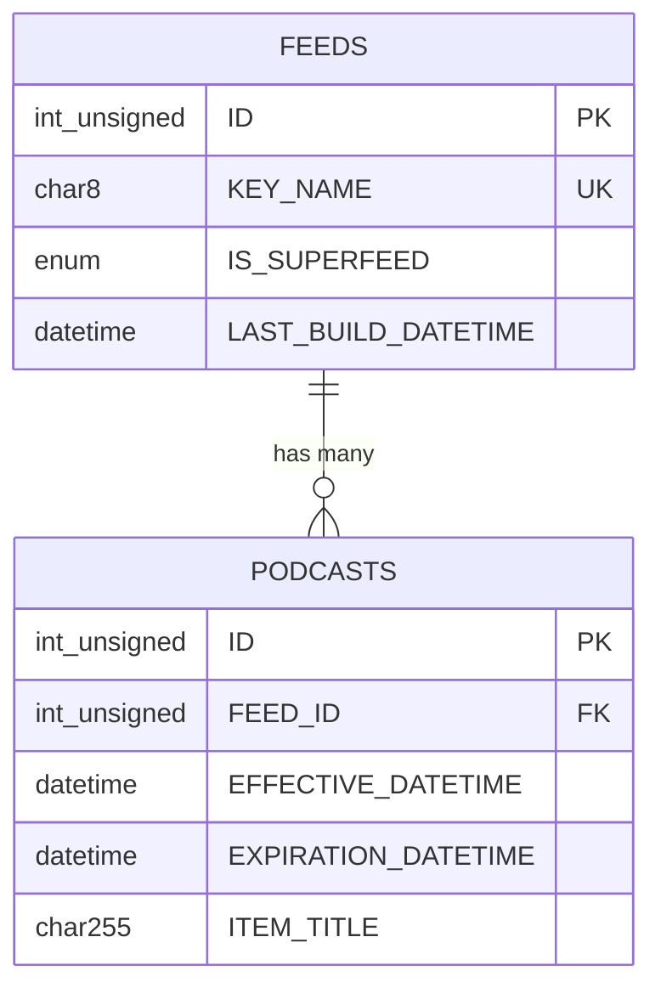
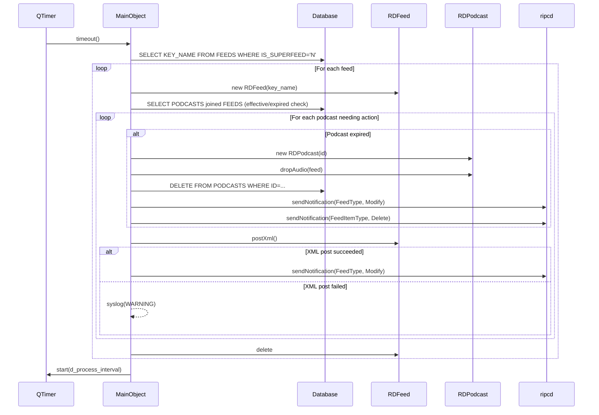
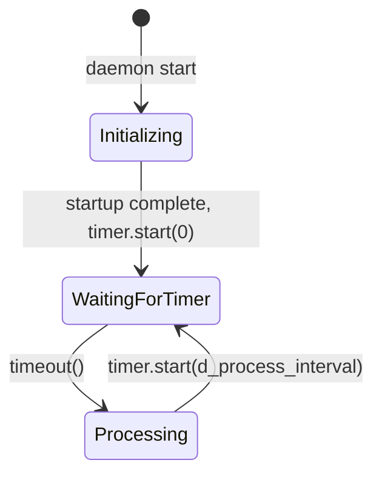

# Semantic Context: RSS (rdrssd)

## Files & Symbols

### Source Files
| File | Type | Symbols | LOC (est) |
|------|------|---------|-----------|
| rdrssd/rdrssd.h | header | MainObject (class), RDRSSD_DEFAULT_PROCESS_INTERVAL, RDRSSD_USAGE | ~26 |
| rdrssd/rdrssd.cpp | source | MainObject::MainObject, MainObject::timeoutData, MainObject::ProcessFeed, main() | ~180 |

### Symbol Index
| Symbol | Kind | File | Qt Class? |
|--------|------|------|-----------|
| MainObject | Class | rdrssd/rdrssd.h | Yes (Q_OBJECT) |
| RDRSSD_DEFAULT_PROCESS_INTERVAL | Macro (30000 ms = 30s) | rdrssd/rdrssd.h | No |
| RDRSSD_USAGE | Macro | rdrssd/rdrssd.h | No |
| main | Function | rdrssd/rdrssd.cpp | No |

### Includes
**rdrssd.h:**
- `<QObject>`
- `<QTimer>`

**rdrssd.cpp:**
- `<errno.h>`
- `<stdio.h>`
- `<QCoreApplication>`
- `<rdapplication.h>` (from LIB)
- `<rdescape_string.h>` (from LIB)
- `<rdfeed.h>` (from LIB)
- `<rdpodcast.h>` (from LIB)
- `"rdrssd.h"`

## Class API Surface

### MainObject [Daemon Controller]
- **File:** rdrssd/rdrssd.h
- **Inherits:** QObject
- **Qt Object:** Yes (Q_OBJECT)
- **Category:** Daemon Controller -- single-class daemon that manages RSS/Podcast feed processing on a timer

#### Signals
_None defined._

#### Slots
| Slot | Visibility | Parameters | Description |
|------|-----------|-----------|-------------|
| timeoutData | private | () | Timer callback; iterates all non-superfeed FEEDS and calls ProcessFeed for each |

#### Properties (Q_PROPERTY)
_None defined._

#### Public Methods
| Method | Return | Parameters | Brief |
|--------|--------|-----------|-------|
| MainObject | (constructor) | (QObject *parent=0) | Initializes RDApplication, drops root privileges, parses CLI args, connects to ripcd, starts scan timer |

#### Private Methods
| Method | Return | Parameters | Brief |
|--------|--------|-----------|-------|
| ProcessFeed | void | (const QString &key_name) | For a single feed: checks for newly effective or expired podcasts, deletes expired casts (audio + DB), re-posts RSS XML, sends RDNotification events |

#### Fields
| Field | Type | Description |
|-------|------|-------------|
| d_process_interval | int | Polling interval in milliseconds (default 30000ms = 30s, configurable via --process-interval) |
| d_timer | QTimer* | Single-shot timer that triggers timeoutData() repeatedly |

#### Enums
_None defined._

### main() [Entry Point]
- **File:** rdrssd/rdrssd.cpp
- **Description:** Creates QCoreApplication, instantiates MainObject, enters event loop. Standard Qt daemon pattern.

## Data Model

Tables are defined in `utils/rddbmgr/create.cpp` (shared DB schema). rdrssd accesses two tables directly.

### Table: FEEDS
| Column | Type | Constraints |
|--------|------|------------|
| ID | int unsigned | PRIMARY KEY AUTO_INCREMENT |
| KEY_NAME | char(8) | UNIQUE NOT NULL |
| IS_SUPERFEED | enum('N','Y') | DEFAULT 'N' (added schema v318) |
| AUDIENCE_METRICS | enum('N','Y') | DEFAULT 'N' (added schema v319) |
| CHANNEL_TITLE | char(255) | |
| CHANNEL_DESCRIPTION | text | |
| CHANNEL_CATEGORY | char(64) | |
| CHANNEL_LINK | char(255) | |
| CHANNEL_COPYRIGHT | char(64) | |
| CHANNEL_WEBMASTER | char(64) | |
| CHANNEL_LANGUAGE | char(5) | DEFAULT 'en-us' |
| BASE_URL | char(255) | |
| BASE_PREAMBLE | char(255) | |
| PURGE_URL | char(255) | |
| PURGE_USERNAME | char(64) | |
| PURGE_PASSWORD | char(64) | |
| HEADER_XML | text | |
| CHANNEL_XML | text | |
| ITEM_XML | text | |
| CAST_ORDER | enum('N','Y') | DEFAULT 'N' |
| MAX_SHELF_LIFE | int | |
| LAST_BUILD_DATETIME | datetime | |
| ORIGIN_DATETIME | datetime | |
| ENABLE_AUTOPOST | enum('N','Y') | DEFAULT 'N' |
| KEEP_METADATA | enum('N','Y') | DEFAULT 'Y' |
| UPLOAD_FORMAT | int | DEFAULT 2 |
| UPLOAD_CHANNELS | int | DEFAULT 2 |
| UPLOAD_SAMPRATE | int | DEFAULT 44100 |
| UPLOAD_BITRATE | int | DEFAULT 32000 |
| UPLOAD_QUALITY | int | DEFAULT 0 |
| UPLOAD_EXTENSION | char(16) | DEFAULT 'mp3' |
| NORMALIZE_LEVEL | int | DEFAULT -100 |
| REDIRECT_PATH | char(255) | |
| MEDIA_LINK_MODE | int | DEFAULT 0 |

- **Primary Key:** ID
- **Unique Key:** KEY_NAME
- **Index:** KEY_NAME_IDX(KEY_NAME), IS_SUPERFEED_IDX(IS_SUPERFEED)
- **CRUD from rdrssd:** SELECT (timeoutData: `select KEY_NAME from FEEDS where IS_SUPERFEED='N'`)

### Table: PODCASTS
| Column | Type | Constraints |
|--------|------|------------|
| ID | int unsigned | PRIMARY KEY AUTO_INCREMENT |
| FEED_ID | int unsigned | NOT NULL |
| STATUS | int unsigned | DEFAULT 1 |
| ITEM_TITLE | char(255) | |
| ITEM_DESCRIPTION | text | |
| ITEM_CATEGORY | char(64) | |
| ITEM_LINK | char(255) | |
| ITEM_COMMENTS | char(255) | |
| ITEM_AUTHOR | char(255) | |
| ITEM_SOURCE_TEXT | char(64) | |
| ITEM_SOURCE_URL | char(255) | |
| AUDIO_FILENAME | char(255) | |
| AUDIO_LENGTH | int unsigned | |
| AUDIO_TIME | int unsigned | |
| SHELF_LIFE | int | |
| ORIGIN_DATETIME | datetime | |
| EFFECTIVE_DATETIME | datetime | |
| EXPIRATION_DATETIME | datetime | (added schema update) |

- **Primary Key:** ID
- **Foreign Keys:** FEED_ID -> FEEDS.ID
- **Index:** FEED_ID_IDX(FEED_ID, ORIGIN_DATETIME)
- **CRUD from rdrssd:**
  - SELECT (ProcessFeed: join PODCASTS with FEEDS to find casts needing repost or expiry)
  - DELETE (ProcessFeed: `delete from PODCASTS where ID={id}` for expired casts)

### ERD


### Library Classes Used for DB Access
| Class | From | Purpose |
|-------|------|---------|
| RDFeed | LIB (rdfeed.h) | Represents a feed; provides postXml() to regenerate RSS XML, keyName() accessor |
| RDPodcast | LIB (rdpodcast.h) | Represents a podcast episode; provides dropAudio() to remove audio files, itemTitle() accessor |
| RDSqlQuery | LIB | Direct SQL query execution |
| RDEscapeString | LIB (rdescape_string.h) | SQL string escaping utility |

## Reactive Architecture

### Signal/Slot Connections
| # | Sender | Signal | Receiver | Slot | File:Line |
|---|--------|--------|----------|------|-----------|
| 1 | d_timer (QTimer) | timeout() | this (MainObject) | timeoutData() | rdrssd.cpp:98 |

### Emit Statements
_None. This daemon does not emit any custom signals._

### IPC via RDRipc (ripcd connection)
The daemon connects to `ripcd(8)` at startup (line 90-91) and uses `rda->ripc()->sendNotification()` to broadcast change events:

| Notification Type | Action | Trigger | File:Line |
|-------------------|--------|---------|-----------|
| RDNotification::FeedType | ModifyAction | After expired cast deleted | rdrssd.cpp:168-169 |
| RDNotification::FeedItemType | DeleteAction | After expired cast deleted | rdrssd.cpp:170-172 |
| RDNotification::FeedType | ModifyAction | After successful XML repost (non-deleted) | rdrssd.cpp:180-182 |
| RDNotification::FeedType | ModifyAction | After successful XML repost (non-deleted, duplicate call) | rdrssd.cpp:183-185 |

### Key Sequence Diagram


### Cross-Artifact Dependencies
| External Class | From Artifact | Used In Files | Purpose |
|---------------|---------------|---------------|---------|
| RDApplication | LIB | rdrssd.cpp | Application framework: DB connection, config, syslog, CLI parsing |
| RDFeed | LIB | rdrssd.cpp | Feed data model + XML posting |
| RDPodcast | LIB | rdrssd.cpp | Podcast episode data model + audio deletion |
| RDSqlQuery | LIB | rdrssd.cpp | Direct SQL queries |
| RDEscapeString | LIB | rdrssd.cpp | SQL escaping |
| RDNotification | LIB | rdrssd.cpp | IPC notification types/actions |
| RDRipc (via rda->ripc()) | LIB | rdrssd.cpp | Connection to ripcd for broadcasting notifications |

### Managed By
| Manager | Artifact | Mechanism |
|---------|----------|-----------|
| rdservice | SVC | Process lifecycle management; TargetRdrssd enum value (startup.cpp:201) |

## Business Rules

### Rule: Superfeed Exclusion
- **Source:** rdrssd.cpp:110-113
- **Trigger:** Each timer cycle (timeoutData)
- **Condition:** `IS_SUPERFEED='N'` filter on FEEDS query
- **Action:** Only non-superfeed feeds are processed; superfeeds are skipped entirely
- **Gherkin:**
  ```gherkin
  Scenario: Superfeed exclusion from RSS processing
    Given a feed exists with IS_SUPERFEED='Y'
    When the RSS processing timer fires
    Then the superfeed is not included in the processing cycle
  ```

### Rule: Podcast Expiration and Purge
- **Source:** rdrssd.cpp:148-174
- **Trigger:** ProcessFeed called for a specific feed
- **Condition:** `EXPIRATION_DATETIME IS NOT NULL AND EXPIRATION_DATETIME < NOW()`
- **Action:** 
  1. Drop audio via RDPodcast::dropAudio() (removes file from storage/CDN)
  2. Delete PODCASTS row from database
  3. Send FeedType/Modify notification via ripcd
  4. Send FeedItemType/Delete notification via ripcd
  5. Log purge at INFO level
- **Gherkin:**
  ```gherkin
  Scenario: Expired podcast is purged
    Given a podcast exists with an expiration datetime in the past
    When the RSS processing timer fires for that feed
    Then the podcast audio is removed from storage
    And the podcast record is deleted from the database
    And a feed modification notification is broadcast
    And a feed item deletion notification is broadcast
    And the purge is logged at INFO level
  ```

### Rule: RSS XML Repost on Change
- **Source:** rdrssd.cpp:136-192
- **Trigger:** ProcessFeed finds podcasts whose EFFECTIVE_DATETIME or EXPIRATION_DATETIME crossed since LAST_BUILD_DATETIME
- **Condition:** `(FEEDS.LAST_BUILD_DATETIME < PODCASTS.EFFECTIVE_DATETIME AND PODCASTS.EFFECTIVE_DATETIME < NOW) OR (FEEDS.LAST_BUILD_DATETIME < PODCASTS.EXPIRATION_DATETIME AND PODCASTS.EXPIRATION_DATETIME < NOW)`
- **Action:** Calls feed->postXml() to regenerate and upload the RSS XML file; sends FeedType/Modify notification on success; logs warning on failure
- **Gherkin:**
  ```gherkin
  Scenario: RSS XML is reposted when a podcast becomes effective
    Given a podcast has an effective datetime that has now passed
    And the feed's last build datetime is before the podcast's effective datetime
    When the RSS processing timer fires for that feed
    Then the feed's RSS XML is regenerated and uploaded
    And a feed modification notification is broadcast

  Scenario: RSS XML repost failure is logged
    Given a podcast triggers an XML repost
    When the postXml() call fails
    Then a warning is logged with the feed key name and cast ID
  ```

### Rule: Audio Purge Failure Is Non-Fatal
- **Source:** rdrssd.cpp:152-159
- **Trigger:** Attempting to drop audio for an expired podcast
- **Condition:** `cast->dropAudio()` returns false
- **Action:** Logs a warning but continues processing (the podcast DB row is still deleted)
- **Gherkin:**
  ```gherkin
  Scenario: Audio purge failure does not prevent database cleanup
    Given an expired podcast whose audio file cannot be removed
    When the purge is attempted
    Then a warning is logged about the failed audio purge
    And the podcast record is still deleted from the database
  ```

### Rule: Privilege Dropping
- **Source:** rdrssd.cpp:54-65
- **Trigger:** Daemon startup when running as root (uid==0)
- **Condition:** `getuid()==0`
- **Action:** Sets GID to pypadGid and UID to pypadUid from config; exits with code 1 on failure
- **Gherkin:**
  ```gherkin
  Scenario: Daemon drops root privileges on startup
    Given rdrssd is started as root
    When initialization begins
    Then the process GID is set to the configured pypadGid
    And the process UID is set to the configured pypadUid
    And if either operation fails the daemon exits with code 1
  ```

### Rule: Process Interval Validation
- **Source:** rdrssd.cpp:71-77
- **Trigger:** CLI argument parsing at startup
- **Condition:** `--process-interval` value is not a valid positive integer
- **Action:** Prints error to stderr and exits with code 1
- **Gherkin:**
  ```gherkin
  Scenario: Invalid process interval causes startup failure
    Given rdrssd is started with --process-interval=abc
    When command-line arguments are parsed
    Then an error message is printed to stderr
    And the daemon exits with code 1
  ```

### Rule: Unknown Command Option Rejection
- **Source:** rdrssd.cpp:80-84
- **Trigger:** CLI argument parsing at startup
- **Condition:** Command-line key not recognized after processing all known options
- **Action:** Logs error via syslog and exits with code 2
- **Gherkin:**
  ```gherkin
  Scenario: Unknown command-line option causes startup failure
    Given rdrssd is started with an unrecognized option
    When command-line arguments are parsed
    Then the unknown option is logged as an error
    And the daemon exits with code 2
  ```

### Configuration Keys
| Key | Source | Default | Type | Description |
|-----|--------|---------|------|-------------|
| --process-interval | CLI argument | 30 (seconds) | int | Interval between feed processing cycles; stored as milliseconds internally (value * 1000) |
| pypadGid | rd.conf (via rda->config()) | -- | int | Group ID to drop privileges to |
| pypadUid | rd.conf (via rda->config()) | -- | int | User ID to drop privileges to |
| password | rd.conf (via rda->config()) | -- | string | Password for ripcd connection |

### Error Patterns
| Error | Severity | Condition | Message/Action |
|-------|----------|-----------|----------------|
| DB open failure | critical (stderr) | RDApplication::open() fails | "rdrssd: {err_msg}" + exit(1) |
| GID set failure | LOG_ERR | setgid() returns non-zero | "unable to set GID to {gid} [{strerror}], exiting" + exit(1) |
| UID set failure | LOG_ERR | setuid() returns non-zero | "unable to set UID to {uid} [{strerror}], exiting" + exit(1) |
| Invalid interval | critical (stderr) | --process-interval invalid | "invalid value specified for --process-interval" + exit(1) |
| Unknown option | LOG_ERR | Unprocessed CLI key | "unknown command option \"{key}\"" + exit(2) |
| Audio purge fail | LOG_WARNING | dropAudio() returns false | "audio purge failed for cast {id} [{title}] on feed \"{key}\" [{err}]" |
| XML repost fail | LOG_WARNING | postXml() returns false | "repost of XML for feed \"{key}\" triggered by cast id {id} failed" |

### State Machine
This daemon has no explicit state machine. It follows a simple single-shot timer loop pattern:


## UI Contracts

_Not applicable. rdrssd is a headless daemon (QCoreApplication) with no UI components, no .ui files, no QML, and no programmatic widget creation._
