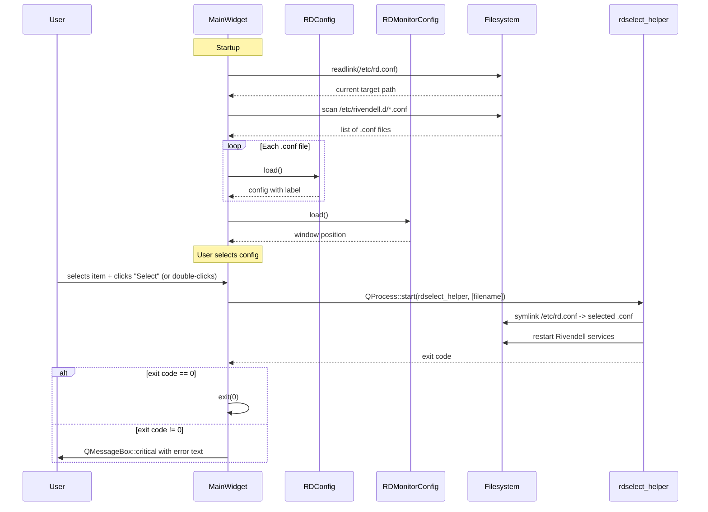

# Semantic Context: SEL (rdselect)

## Files & Symbols

### Source Files
| File | Type | Symbols | LOC (est) |
|------|------|---------|-----------|
| rdselect/rdselect.h | header | MainWidget (class) | ~40 |
| rdselect/rdselect.cpp | source | MainWidget (ctor, 7 methods), main() | ~280 |

### Non-Code Files
| File | Purpose |
|------|---------|
| rdselect/rdselect.pro | qmake project file |
| rdselect/Makefile.am | autotools build |
| rdselect/rdselect_*.ts | Translation files (cs, de, es, fr, nb, nn, pt_BR) |
| rdselect/rd.audiostore.autofs | autofs map file for audio store |

### Symbol Index
| Symbol | Kind | File | Qt Class? |
|--------|------|------|-----------|
| MainWidget | Class | rdselect.h | Yes (Q_OBJECT) |
| main | Function | rdselect.cpp | No |

## Class API Surface

### MainWidget [Application Main Window]
- **File:** rdselect/rdselect.h
- **Inherits:** RDWidget (which inherits QWidget)
- **Qt Object:** Yes (Q_OBJECT macro)
- **Category:** UI Controller -- single-window application for selecting Rivendell system configuration

#### Signals
_None defined._

#### Slots
| Slot | Visibility | Parameters | Description |
|------|-----------|-----------|-------------|
| doubleClickedData | private | (Q3ListBoxItem *item) | Delegates to okData() when list item is double-clicked |
| okData | private | () | Executes rdselect_helper to switch system configuration |
| cancelData | private | () | Exits application with code 0 |

#### Public Methods
| Method | Return | Parameters | Brief |
|--------|--------|-----------|-------|
| MainWidget (ctor) | -- | (RDConfig *c, QWidget *parent=0) | Initializes UI, loads configs from /etc/rivendell.d/*.conf |
| sizeHint | QSize | () const | Returns fixed size 400x300 |
| sizePolicy | QSizePolicy | () const | Returns Fixed/Fixed policy |

#### Protected Methods
| Method | Return | Parameters | Brief |
|--------|--------|-----------|-------|
| resizeEvent | void | (QResizeEvent *e) | Manual geometry layout of all widgets |

#### Private Methods
| Method | Return | Parameters | Brief |
|--------|--------|-----------|-------|
| SetSystem | void | (int id) | Updates current system label; -1 means "None" |
| SetCurrentItem | void | (int id) | Validates DB + audio store; shows green checkmark or red X icon |

#### Fields
| Field | Type | Purpose |
|-------|------|---------|
| select_configs | std::vector<RDConfig *> | Loaded configuration objects from /etc/rivendell.d/ |
| select_filenames | QStringList | Full paths to .conf files |
| select_current_id | int | Index of currently active configuration (-1 = none) |
| select_current_label | QLabel * | Shows "Current System: {name}" |
| select_label | QLabel * | "Available Systems" label |
| select_box | Q3ListBox * | List of available system configurations |
| login_rivendell_map | QPixmap * | Rivendell 22x22 icon |
| ok_button | QPushButton * | "Select" button |
| cancel_button | QPushButton * | "Cancel" button |
| greencheckmark_map | QPixmap * | Green checkmark icon for valid config |
| redx_map | QPixmap * | Red X icon for invalid config |
| monitor_config | RDMonitorConfig * | Monitor position configuration |

### main() [Entry Point]
- **File:** rdselect/rdselect.cpp
- **Purpose:** Application entry point
- **Behavior:**
  1. Sets GUI style (RD_GUI_STYLE)
  2. Loads Qt, librd, librdhpi, and rdselect translations
  3. Creates RDConfig, loads it
  4. Creates MainWidget, shows it, enters event loop

## Data Model

This artifact has **no direct SQL queries** and does not define or manipulate database tables.

### Indirect Data Access
| Function | Source (LIB) | Purpose |
|----------|-------------|---------|
| RDDbValid() | lib/rdstatus.h | Validates that the MySQL database is reachable and returns the schema version |
| RDAudioStoreValid() | lib/rdstatus.h | Validates that the audio store mount point is accessible |
| RDConfig::load() | lib/rdconfig.h | Reads /etc/rivendell.d/*.conf files (INI-style config, not DB) |
| RDMonitorConfig::load() | lib/rdmonitor_config.h | Reads monitor position settings from ~/.rdmonitor |

### Configuration Files (filesystem, not DB)
| Path | Format | Purpose |
|------|--------|---------|
| /etc/rd.conf | Symlink | Points to the currently active .conf file |
| /etc/rivendell.d/*.conf | INI (RDConfig) | Individual Rivendell system configurations |
| ~/.rdmonitor | INI | Monitor widget position preferences |

## Reactive Architecture

### Signal/Slot Connections
| # | Sender | Signal | Receiver | Slot | File:Line |
|---|--------|--------|----------|------|-----------|
| 1 | select_box (Q3ListBox) | doubleClicked(Q3ListBoxItem *) | this (MainWidget) | doubleClickedData(Q3ListBoxItem *) | rdselect.cpp:138 |
| 2 | ok_button (QPushButton) | clicked() | this (MainWidget) | okData() | rdselect.cpp:146 |
| 3 | cancel_button (QPushButton) | clicked() | this (MainWidget) | cancelData() | rdselect.cpp:152 |

### Key Sequence Diagram


### Cross-Artifact Dependencies
| External Class | From Artifact | Used In Files | Purpose |
|---------------|---------------|---------------|---------|
| RDWidget | LIB | rdselect.h | Base class for MainWidget |
| RDConfig | LIB | rdselect.cpp | Load and parse Rivendell configuration files |
| RDMonitorConfig | LIB | rdselect.cpp | Load monitor position preferences |
| RDCmdSwitch | LIB | rdselect.cpp | Command-line argument parsing |
| RDDbValid() | LIB | rdselect.cpp | Validate database connectivity |
| RDAudioStoreValid() | LIB | rdselect.cpp | Validate audio store accessibility |
| RD_VERSION_DATABASE | LIB (dbversion.h) | rdselect.cpp | Expected database schema version constant |

## Business Rules

### Rule: Configuration Discovery
- **Source:** rdselect.cpp:115-128 (constructor)
- **Trigger:** Application startup
- **Condition:** Directory /etc/rivendell.d/ is scanned for *.conf files
- **Action:** Each .conf file is loaded as an RDConfig object and added to the list. The currently active configuration is identified by comparing the symlink target of /etc/rd.conf against each file path.
- **Gherkin:**
  ```gherkin
  Scenario: Discover available system configurations
    Given the directory /etc/rivendell.d/ exists
    And it contains one or more .conf files
    When RDSelect starts
    Then each .conf file is loaded and displayed in the list
    And the currently active configuration (symlinked from /etc/rd.conf) is highlighted
  ```

### Rule: Configuration Validation (Green Checkmark / Red X)
- **Source:** rdselect.cpp:258-276 (SetCurrentItem)
- **Trigger:** SetCurrentItem() called during startup for the active config
- **Condition:** RDDbValid() returns true AND schema == RD_VERSION_DATABASE AND RDAudioStoreValid() returns true
- **Action:** If all three checks pass, the active config gets a green checkmark icon; otherwise it gets a red X icon. Non-active configs show no icon.
- **Gherkin:**
  ```gherkin
  Scenario: Valid configuration shows green checkmark
    Given a configuration is the currently active system
    And its database is reachable with correct schema version
    And its audio store is accessible
    When the configuration list is displayed
    Then the active configuration shows a green checkmark icon

  Scenario: Invalid configuration shows red X
    Given a configuration is the currently active system
    And either the database is unreachable, schema is wrong, or audio store is inaccessible
    When the configuration list is displayed
    Then the active configuration shows a red X icon
  ```

### Rule: Configuration Switch via Helper Process
- **Source:** rdselect.cpp:201-228 (okData)
- **Trigger:** User clicks "Select" button or double-clicks a list item
- **Condition:** A configuration must be selected in the list
- **Action:** Launches `rdselect_helper` as a separate process with the .conf filename as argument. The helper performs the actual symlink switch and service restart (requires root privileges). On success (exit code 0), the application exits. On failure, an error dialog is shown with the decoded exit code text.
- **Gherkin:**
  ```gherkin
  Scenario: Successfully switch system configuration
    Given the user has selected a configuration from the list
    When the user clicks "Select"
    Then rdselect_helper is launched with the config filename
    And the helper exits with code 0
    And the application closes

  Scenario: Failed configuration switch
    Given the user has selected a configuration from the list
    When the user clicks "Select"
    And rdselect_helper exits with a non-zero code
    Then an error dialog is shown with the failure reason
    And the application remains open
  ```

### Rule: Helper Process Crash Detection
- **Source:** rdselect.cpp:213-217 (okData)
- **Trigger:** rdselect_helper process terminates abnormally
- **Condition:** proc->exitStatus() != QProcess::NormalExit
- **Action:** Shows critical error dialog "RDSelect helper process crashed!"
- **Gherkin:**
  ```gherkin
  Scenario: Helper process crashes
    Given the user clicks "Select"
    When rdselect_helper crashes (abnormal termination)
    Then a critical error dialog is shown saying "RDSelect helper process crashed!"
    And the application remains open
  ```

### Rule: Window Positioning Based on Monitor Config
- **Source:** rdselect.cpp:55-87 (constructor)
- **Trigger:** Application startup
- **Condition:** RDMonitorConfig::position() returns one of 7 positions
- **Action:** Window is placed at the corresponding screen position, offset by RDMONITOR_HEIGHT (30px) to avoid overlapping the RDMonitor widget
- **Positions:** UpperLeft, UpperCenter, UpperRight, LowerLeft, LowerCenter, LowerRight, LastPosition (no repositioning)

### State Machines
_No explicit state machines. The application is stateless beyond the list selection._

### Configuration Constants
| Constant | Value | Source | Description |
|----------|-------|--------|-------------|
| RD_CONF_FILE | /etc/rd.conf | lib/rd.h | Symlink to active Rivendell configuration |
| RD_DEFAULT_RDSELECT_DIR | /etc/rivendell.d | lib/rd.h | Directory containing available configurations |
| RDMONITOR_HEIGHT | 30 | lib/rd.h | Pixel height reserved for RDMonitor widget |
| RD_PREFIX | (build-time) | lib/rdpaths.h | Installation prefix for binaries |

### RDConfig::RDSelectExitCode Enum (from LIB)
| Code | Name | Meaning |
|------|------|---------|
| 0 | RDSelectOk | Success |
| 1 | RDSelectInvalidArguments | Invalid command-line arguments |
| 2 | RDSelectNoSuchConfiguration | Config file not found |
| 3 | RDSelectModulesActive | Rivendell modules still running |
| 4 | RDSelectNotRoot | Not running as root |
| 5 | RDSelectSystemctlCrashed | systemctl process crashed |
| 6 | RDSelectRivendellShutdownFailed | Failed to stop Rivendell services |
| 7 | RDSelectAudioUnmountFailed | Failed to unmount audio store |
| 8 | RDSelectAudioMountFailed | Failed to mount audio store |
| 9 | RDSelectRivendellStartupFailed | Failed to start Rivendell services |
| 10 | RDSelectNoCurrentConfig | No current configuration symlink |
| 11 | RDSelectSymlinkFailed | Failed to create symlink |

### Error Patterns
| Error | Severity | Condition | Message |
|-------|----------|-----------|---------|
| Helper Crash | critical | exitStatus != NormalExit | "RDSelect helper process crashed!" |
| Switch Failed | critical | exitCode != 0 | "Unable to select configuration:" + exit code text |
| Not Root (commented out) | information | getuid() != 0 | "Only root can run this utility!" |

## UI Contracts

### Window: MainWidget
- **Type:** RDWidget (extends QWidget) -- top-level window
- **Title:** "RDSelect - v{VERSION}"
- **Icon:** rivendell-22x22.xpm
- **Size:** 400x300 (fixed, QSizePolicy::Fixed)
- **Layout:** Manual geometry (resizeEvent), no layout managers
- **Positioning:** Offset by RDMONITOR_HEIGHT (30px) based on RDMonitorConfig::Position setting

#### Widgets
| Widget | Type | Label/Text | Object Name | Binding | Position |
|--------|------|-----------|-------------|---------|----------|
| select_current_label | QLabel | "Current System: {name}" | -- | SetSystem() updates text | top center, full width, y=10, h=21 |
| select_label | QLabel | "Available Systems" | -- | -- | x=10, y=35, h=20 |
| select_box | Q3ListBox | (list of config labels) | -- | doubleClicked->doubleClickedData | x=10, y=55, fills remaining space minus 125px |
| ok_button | QPushButton | "Select" | -- | clicked->okData() | bottom-right area, 80x50 |
| cancel_button | QPushButton | "&Cancel" | cancel_button | clicked->cancelData() | bottom-right corner, 80x50 |

#### Visual Indicators
| Indicator | Icon | Condition |
|-----------|------|-----------|
| Green checkmark | greencheckmark.xpm | Active config has valid DB (correct schema) + valid audio store |
| Red X | redx.xpm | Active config has invalid DB or wrong schema or invalid audio store |
| No icon | -- | Non-active configurations in the list |

#### Data Flow
- **Source:** Filesystem scan of /etc/rivendell.d/*.conf (loaded via RDConfig)
- **Display:** Q3ListBox showing config labels; active config highlighted with status icon
- **Edit:** User selects a different configuration from the list
- **Save:** rdselect_helper process updates /etc/rd.conf symlink and restarts services

#### Window Position Behavior
| RDMonitorConfig::Position | Window Geometry |
|--------------------------|-----------------|
| UpperLeft | (0, 30, 400, 300) |
| UpperCenter | (center_x, 30, 400, 300) |
| UpperRight | (right_edge, 30, 400, 300) |
| LowerLeft | (0, bottom-270, 400, 300) |
| LowerCenter | (center_x, bottom-270, 400, 300) |
| LowerRight | (right_edge, bottom-270, 400, 300) |
| LastPosition | (system default / last used) |

#### Internationalization
Translatable strings (via tr()):
- "Available Systems"
- "Select"
- "&Cancel"
- "Current System:"
- "None"
- "Error"
- "RDSelect helper process crashed!"
- "Unable to select configuration:"
- "RDSelect"
- "Only root can run this utility!" (commented out)

Translation files: cs, de, es, fr, nb, nn, pt_BR
