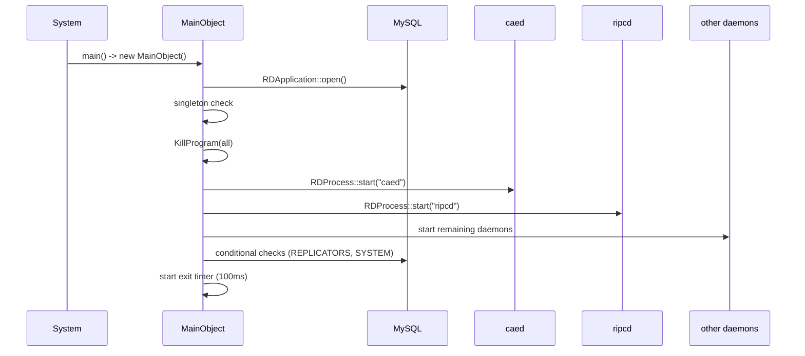

# SVC-001: Daemon Lifecycle Management

## Kontekst biznesowy

rdservice is the central supervisor for all Rivendell backend daemons. It must start them in a precise order at system boot, ensure no stale instances remain from a previous run, detect startup failures, handle partial startup for debugging, and perform orderly reverse-order shutdown on termination signals. Without this feature, the Rivendell radio automation system cannot operate.

## Aktorzy

| Aktor | Rola w tej feature |
|-------|-------------------|
| System operacyjny (systemd) | Uruchamia rdservice przy starcie, wysyla SIGTERM do zamkniecia |
| Administrator | Moze uzyc partial startup (--end-startup-after-X) do debugowania |

## Granica funkcjonalnosci

```
IN SCOPE:
  - Singleton enforcement (only one rdservice)
  - Database connection initialization
  - CLI argument parsing
  - Stale process cleanup (KillProgram)
  - Ordered startup of 8 core daemons (caed through rdrssd)
  - Conditional startup of rdrepld and rdrssd
  - Partial startup targets (--end-startup-after-X)
  - Exit signal handling (SIGTERM, SIGINT)
  - Ordered shutdown (reverse LIFO)
  - PID file management
  - Process crash detection and logging

OUT OF SCOPE:
  - Dropbox (rdimport) management → patrz SVC-002
  - Maintenance scheduling → patrz SVC-003
  - SIGUSR1 dropbox reload → patrz SVC-002
```

---

## Use Cases

| ID | Aktor | Akcja | Efekt biznesowy | Priorytet |
|----|-------|-------|----------------|-----------|
| UC-1 | System (boot) | Uruchamia rdservice | Wszystkie core daemons startuja w kolejnosci | MUST |
| UC-2 | Administrator | SIGTERM/SIGINT | Graceful shutdown calego stosu | MUST |
| UC-3 | Administrator | --end-startup-after-caed | Startup zatrzymuje sie po caed | SHOULD |
| UC-4 | System | Daemon crashes | Crash detected, logged to syslog | MUST |
| UC-5 | Administrator | Uruchamia 2. instancje | Exit code 1, brak kolizji | MUST |

---

## Reguly biznesowe (Gherkin)

```gherkin
Rule: Singleton enforcement

  Scenario: First instance starts normally
    Given no prior rdservice is running
    When  rdservice starts
    Then  initialization continues

  Scenario: Second instance is rejected
    Given rdservice is already running (RDGetPids > 1)
    When  new rdservice starts
    Then  it exits with code 1 (ExitPriorInstance)

  # Zrodlo: rdservice.cpp:79-82 | Pewnosc: potwierdzone


Rule: Database connection is mandatory

  Scenario: DB available
    Given MySQL is running
    When  rdservice starts
    Then  RDApplication::open() succeeds

  Scenario: DB unavailable
    Given MySQL is not running
    When  rdservice starts
    Then  rdservice exits with code 2 (ExitNoDb)

  # Zrodlo: rdservice.cpp:70-74 | Pewnosc: potwierdzone


Rule: Services start in strict order

  Scenario: Full startup (TargetAll)
    Given svc_startup_target = TargetAll
    When  Startup() is called
    Then  daemons start in order: caed(0) -> ripcd(1) -> rdcatchd(2) -> rdpadd(3) -> (1s delay) -> rdpadengined(4) -> rdvairplayd(5) -> rdrepld(6, conditional) -> rdrssd(7, conditional)
    And   if any daemon fails to start, Startup() returns false

  Scenario: Partial startup
    Given svc_startup_target = TargetRipcd
    When  Startup() is called
    Then  only caed and ripcd are started
    And   remaining daemons are NOT started

  # Zrodlo: startup.cpp:34-213 | Pewnosc: potwierdzone


Rule: Stale processes are killed before startup

  Scenario: Stale daemon exists
    Given zombie caed process from previous run
    When  Startup() begins
    Then  KillProgram("caed") sends SIGKILL to all instances
    And   waits 1s and re-checks (loop until clear)
    And   only then starts fresh caed

  # Zrodlo: startup.cpp:43-50, 346-358 | Pewnosc: potwierdzone


Rule: rdrepld conditional on REPLICATORS table

  Scenario: Station has replicators
    Given REPLICATORS has rows WHERE STATION_NAME = this station
    When  startup reaches rdrepld
    Then  rdrepld is started

  Scenario: Station has no replicators
    Given REPLICATORS has no rows for this station
    When  startup reaches rdrepld
    Then  rdrepld is skipped

  # Zrodlo: startup.cpp:164-178 | Pewnosc: potwierdzone


Rule: rdrssd conditional on RSS_PROCESSOR_STATION

  Scenario: Station is RSS processor
    Given SYSTEM.RSS_PROCESSOR_STATION (case-insensitive) = this station name
    When  startup reaches rdrssd
    Then  rdrssd is started

  Scenario: Station is not RSS processor
    Given SYSTEM.RSS_PROCESSOR_STATION != this station
    Then  rdrssd is skipped

  # Zrodlo: startup.cpp:187-206 | Pewnosc: potwierdzone


Rule: Shutdown in reverse order

  Scenario: SIGTERM received
    Given rdservice is running with all services
    When  SIGTERM is received
    Then  daemons shut down from LAST_ID-1 to 0 (reverse of startup)
    And   each daemon: SIGTERM first, wait for finish, SIGKILL if timeout
    And   PID file is deleted
    And   exit(0)

  # Zrodlo: shutdown.cpp:23-40, rdservice.cpp:189-194 | Pewnosc: potwierdzone


Rule: Unknown CLI options are rejected

  Scenario: Unknown option
    Given command line contains unrecognized option
    When  rdservice starts
    Then  exits with code 4 (ExitInvalidOption)

  # Zrodlo: rdservice.cpp:110-113 | Pewnosc: potwierdzone
```

---

## Data Model (tabele DB w scope)

### Tabela: REPLICATORS (read — existence check)

| Kolumna | Typ | Null | Opis |
|---------|-----|------|------|
| NAME | char(32) | NO | PK |
| STATION_NAME | char(64) | YES | Assigned station |

### Tabela: SYSTEM (read — single column)

| Kolumna | Typ | Null | Opis |
|---------|-----|------|------|
| RSS_PROCESSOR_STATION | varchar(64) | YES | Station designated for RSS processing |

Pelny schemat: `data-model.md`

---

## API klas w scope

### MainObject

**Odpowiedzialnosc:** Central service lifecycle manager — starts, monitors, and shuts down all Rivendell daemons.
**Pelny opis:** `inventory.md#MainObject`

**Publiczne API:**
| Metoda | Parametry | Efekt | Warunki wywolania |
|--------|-----------|-------|------------------|
| MainObject() | QObject *parent | Init DB, check singleton, parse CLI, start services, setup timers | Must be sole instance |

**Private API (relevant to this FEAT):**
| Metoda | Parametry | Efekt | Warunki |
|--------|-----------|-------|---------|
| Startup() | QString *err_msg | Starts all daemons in order. Returns false on failure. | Called once from constructor |
| Shutdown() | - | Stops all daemons in reverse order (SIGTERM then SIGKILL) | Called on SIGTERM or startup failure |
| KillProgram() | const QString &program | Kills all instances of named program via SIGKILL | Called before startup for each daemon |
| TargetCommandString() | StartupTarget target | Returns CLI option string for target | Pure function |

**Sloty:**
| Slot | Parametry | Efekt |
|------|-----------|-------|
| exitData() | - | Polls global_exiting flag every 100ms, triggers Shutdown+exit | 
| processFinishedData() | int id | Logs exit status of finished process, cleans up from map |

**Enums:**
| Enum | Wartosci | Znaczenie |
|------|----------|-----------|
| StartupTarget | TargetCaed(0)..TargetRdrssd(7), TargetAll(8) | Controls partial startup — daemon stops after specified target |

**Process ID constants:**
| Constant | Value | Daemon |
|----------|-------|--------|
| RDSERVICE_CAED_ID | 0 | caed |
| RDSERVICE_RIPCD_ID | 1 | ripcd |
| RDSERVICE_RDCATCHD_ID | 2 | rdcatchd |
| RDSERVICE_RDPADD_ID | 3 | rdpadd |
| RDSERVICE_RDPADENGINED_ID | 4 | rdpadengined |
| RDSERVICE_RDVAIRPLAYD_ID | 5 | rdvairplayd |
| RDSERVICE_RDREPLD_ID | 6 | rdrepld |
| RDSERVICE_RDRSSD_ID | 7 | rdrssd |
| RDSERVICE_LAST_ID | 10 | (boundary) |

---

## Protokoly komunikacji

### Unix Signals (external interface)

| Sygnal | Nadawca | Efekt | Latencja |
|--------|---------|-------|----------|
| SIGTERM | systemd / admin | Graceful shutdown | max 100ms |
| SIGINT | terminal | Same as SIGTERM | max 100ms |

### SQL Read Operations

| Query | Tabela | Purpose |
|-------|--------|---------|
| SELECT NAME FROM REPLICATORS WHERE STATION_NAME=? | REPLICATORS | Check if rdrepld needed |
| SELECT RSS_PROCESSOR_STATION FROM SYSTEM | SYSTEM | Check if rdrssd needed |

---

## UI Contracts

Brak — feature jest backend-only (headless daemon).

---

## Sygnaly integracji (z call-graph.md)

### Sequence diagram — Startup



**Emitowane:** Brak (MainObject has no signals)

**Odbierane:**
| Nadawca | Sygnal | Klasa (tu) | Slot | Kontekst |
|---------|--------|------------|------|----------|
| svc_exit_timer (QTimer) | timeout() | MainObject | exitData() | Every 100ms — checks for SIGTERM/SIGINT |

---

## Platform Independence

| Funkcja | Oryginal | Klon | Priorytet |
|---------|----------|------|-----------|
| Unix signals (SIGTERM, SIGINT) | signal.h | Platform event/IPC | HIGH |
| Process lifecycle (fork+exec) | QProcess | Platform process management | HIGH |
| Process kill (SIGKILL) | kill() syscall | Platform termination | HIGH |
| Process enumeration | /proc (RDGetPids) | Platform process listing | HIGH |
| PID file (/var/run) | File-based | Service registry / named mutex | MEDIUM |
| syslog | syslog.h | Structured logging | MEDIUM |
| sleep(1) band-aid | sleep() | Readiness signaling / socket activation | MEDIUM |

---

## Configuration (klucze w scope)

| Klucz | Typ | Domyslna | Wplyw na te feature |
|-------|-----|---------|---------------------|
| --end-startup-after-{daemon} | CLI flag | TargetAll | Controls how far startup proceeds |
| RD_PREFIX | compile-time | /usr/local | Installation path for daemon binaries |
| RD_PID_DIR | compile-time | /var/run | PID file directory |

---

## Acceptance Criteria (E2E)

```gherkin
Feature: Daemon Lifecycle Management

  Scenario: Full system boot
    Given MySQL is running
    And   no prior rdservice instance exists
    When  rdservice starts with no options
    Then  caed, ripcd, rdcatchd, rdpadd should be running
    And   rdpadengined, rdvairplayd should be running (after delay)
    And   rdrepld running IF station has replicators
    And   rdrssd running IF station is RSS processor
    And   PID file exists at /var/run/rdservice.pid
    And   exit timer is polling every 100ms

  Scenario: Graceful shutdown
    Given rdservice is running with all services
    When  SIGTERM is sent
    Then  all daemons terminated in reverse order
    And   PID file removed
    And   exit code is 0

  Scenario: Partial startup for debugging
    Given MySQL is running
    When  rdservice starts with --end-startup-after-ripcd
    Then  only caed and ripcd are running
    And   no other daemons are started

  Scenario: Singleton enforcement
    Given rdservice is already running
    When  second rdservice starts
    Then  second instance exits with code 1

  Scenario: Database unavailable
    Given MySQL is not running
    When  rdservice starts
    Then  exits with code 2
```

---

## Open Questions

- [ ] Should the 1-second sleep between rdpadd and rdpadengined be replaced with socket activation or readiness signaling?
- [ ] Should startup failure of a conditional daemon (rdrepld/rdrssd) be fatal or degraded?

---

## Working Packages (wstepny podzial)

| WP | Opis | Zaleznosci |
|----|------|-----------|
| WP-1 | Process management abstraction (equivalent of RDProcess) | - |
| WP-2 | Daemon registry (ordered list with IDs, conditions) | WP-1 |
| WP-3 | Startup sequence (ordered launch with error handling) | WP-1, WP-2 |
| WP-4 | Shutdown sequence (reverse order, SIGTERM then force) | WP-1, WP-2 |
| WP-5 | Signal handling (SIGTERM/SIGINT detection) | WP-4 |
| WP-6 | Tests (singleton, startup order, shutdown order, partial startup) | WP-1..WP-5 |
