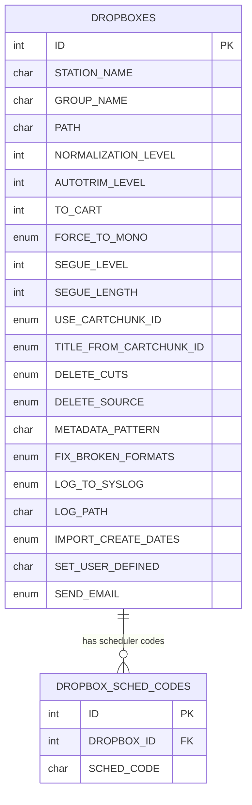
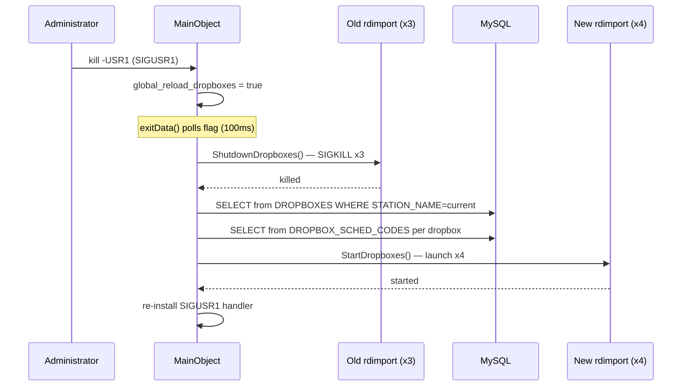

# SVC-002: Dropbox Process Management

## Kontekst biznesowy

Rivendell supports "dropboxes" — watched directories where audio files are automatically imported into the system. Each dropbox is configured in the database and translated into an rdimport process with specific CLI arguments. rdservice manages the lifecycle of these import processes: starting them at boot, hot-reloading them when configuration changes (via SIGUSR1), and killing them at shutdown. This enables automated audio ingest without manual intervention.

## Aktorzy

| Aktor | Rola w tej feature |
|-------|-------------------|
| Administrator | Konfiguruje dropboxy w bazie danych, wysyla SIGUSR1 do przeladowania |
| System (boot) | Uruchamia dropboxy przy starcie rdservice |

## Granica funkcjonalnosci

```
IN SCOPE:
  - Reading DROPBOXES and DROPBOX_SCHED_CODES tables from DB
  - Building rdimport CLI arguments from DB columns
  - Starting N rdimport processes (one per DROPBOXES row)
  - SIGUSR1 hot-reload (shutdown + restart dropboxes)
  - Dropbox shutdown (SIGKILL — no graceful)
  - Process ID allocation (from RDSERVICE_FIRST_DROPBOX_ID=100)

OUT OF SCOPE:
  - Core daemon lifecycle → patrz SVC-001
  - Maintenance scheduling → patrz SVC-003
  - rdimport behavior itself → patrz IMP artifact
  - Dropbox configuration UI (rdadmin) → patrz ADM artifact
```

---

## Use Cases

| ID | Aktor | Akcja | Efekt biznesowy | Priorytet |
|----|-------|-------|----------------|-----------|
| UC-1 | System (boot) | Startup uruchamia dropboxy | N procesow rdimport monitoruje katalogi | MUST |
| UC-2 | Administrator | SIGUSR1 | Dropboxy przeladowane z nowa konfiguracja DB | MUST |
| UC-3 | System (shutdown) | SIGTERM | Wszystkie dropboxy zabite natychmiast | MUST |

---

## Reguly biznesowe (Gherkin)

```gherkin
Rule: Dropboxes launched from DB configuration

  Scenario: Station has 3 dropbox configurations
    Given DROPBOXES has 3 rows WHERE STATION_NAME = this station
    When  StartDropboxes() is called
    Then  3 rdimport processes are launched
    And   each with CLI args built from the corresponding DROPBOXES row
    And   process IDs start from 100 (RDSERVICE_FIRST_DROPBOX_ID)

  Scenario: Station has no dropbox configurations
    Given DROPBOXES has 0 rows for this station
    When  StartDropboxes() is called
    Then  no rdimport processes are launched
    And   StartDropboxes() returns true

  # Zrodlo: startup.cpp:217-343 | Pewnosc: potwierdzone


Rule: DB columns map to rdimport CLI arguments

  Scenario: Full dropbox configuration
    Given DROPBOXES row with GROUP_NAME="TRAFFIC", PATH="/var/snd/dropbox", TO_CART=1000
    And   DROPBOX_SCHED_CODES has 2 codes for this DROPBOX_ID
    When  rdimport process is built
    Then  args include: --persistent-dropbox-id=N --drop-box
    And   args include: --to-cart=1000
    And   args include: --add-scheduler-code=X (twice, once per code)
    And   args include: GROUP_NAME and PATH as positional args (last)

  Scenario: Normalization/autotrim level conversion
    Given DROPBOXES.NORMALIZATION_LEVEL = -1200 (stored as int*100)
    When  CLI args are built
    Then  --normalization-level=-12 (divided by 100)

  Scenario: Segue level only when < 1
    Given DROPBOXES.SEGUE_LEVEL = -600
    When  CLI args are built
    Then  --segue-level=-6 and --segue-length=N are included

  Scenario: Segue level >= 1
    Given DROPBOXES.SEGUE_LEVEL = 1
    When  CLI args are built
    Then  no --segue-level or --segue-length args

  # Zrodlo: startup.cpp:256-340 | Pewnosc: potwierdzone


Rule: Dropboxes killed with SIGKILL (no graceful shutdown)

  Scenario: Shutdown dropboxes
    Given 3 dropbox processes are running (IDs 100, 101, 102)
    When  ShutdownDropboxes() is called
    Then  each process receives process()->kill() (SIGKILL)
    And   waitForFinished() is called
    And   processes are removed from svc_processes map

  # Zrodlo: shutdown.cpp:43-54 | Pewnosc: potwierdzone


Rule: SIGUSR1 triggers dropbox hot-reload

  Scenario: SIGUSR1 received
    Given rdservice is running with 2 dropbox processes
    And   administrator added 1 new DROPBOXES row in DB
    When  SIGUSR1 is sent to rdservice
    Then  existing 2 dropbox processes are killed (SIGKILL)
    And   DB is re-read for current station
    And   3 new dropbox processes are started
    And   SIGUSR1 handler is re-installed

  # Zrodlo: rdservice.cpp:196-201, rdservice.cpp:48-49 | Pewnosc: potwierdzone


Rule: SIGUSR1 handler re-installation

  Scenario: After processing SIGUSR1
    Given SIGUSR1 was just handled
    When  reload completes
    Then  signal(SIGUSR1, SigHandler) is called again
    And   subsequent SIGUSR1 will also trigger reload

  # Zrodlo: rdservice.cpp:199 | Pewnosc: potwierdzone
```

---

## Data Model (tabele DB w scope)

### ERD dla tej feature



### Tabela: DROPBOXES

| Kolumna | Typ | Null | Opis |
|---------|-----|------|------|
| ID | int auto_increment | NO | PK |
| STATION_NAME | char(64) | YES | Station filter |
| GROUP_NAME | char(10) | YES | Target audio group (positional arg) |
| PATH | char(255) | YES | Watch directory (positional arg) |
| NORMALIZATION_LEVEL | int | YES | Level * 100 -> --normalization-level |
| AUTOTRIM_LEVEL | int | YES | Level * 100 -> --autotrim-level |
| TO_CART | int unsigned | YES | Target cart (0=auto) -> --to-cart |
| FORCE_TO_MONO | enum(N,Y) | YES | -> --to-mono |
| SEGUE_LEVEL | int | YES | Level * 100 -> --segue-level (only if <1) |
| SEGUE_LENGTH | int | YES | -> --segue-length |
| USE_CARTCHUNK_ID | enum(N,Y) | YES | -> --use-cartchunk-cutid |
| TITLE_FROM_CARTCHUNK_ID | enum(N,Y) | YES | -> --title-from-cartchunk-cutid |
| DELETE_CUTS | enum(N,Y) | YES | -> --delete-cuts |
| DELETE_SOURCE | enum(N,Y) | YES | -> --delete-source |
| METADATA_PATTERN | char(64) | YES | -> --metadata-pattern= |
| FIX_BROKEN_FORMATS | enum(N,Y) | YES | -> --fix-broken-formats |
| LOG_TO_SYSLOG | enum(N,Y) | YES | -> --log-syslog |
| LOG_PATH | char(255) | YES | -> --log-filename= |
| IMPORT_CREATE_DATES | enum(N,Y) | YES | enables create date offsets |
| CREATE_STARTDATE_OFFSET | int | YES | -> --create-startdate-offset |
| CREATE_ENDDATE_OFFSET | int | YES | -> --create-enddate-offset |
| SET_USER_DEFINED | char(255) | YES | -> --set-user-defined= |
| STARTDATE_OFFSET | int | YES | -> --startdate-offset |
| ENDDATE_OFFSET | int | YES | -> --enddate-offset |
| SEND_EMAIL | enum(N,Y) | YES | -> --send-mail --mail-per-file |

### Tabela: DROPBOX_SCHED_CODES

| Kolumna | Typ | Null | Opis |
|---------|-----|------|------|
| ID | int auto_increment | NO | PK |
| DROPBOX_ID | int | NO | FK -> DROPBOXES.ID |
| SCHED_CODE | char(11) | NO | -> --add-scheduler-code= |

### Relacje FK

| Zrodlo | Kolumna | Cel | PK |
|--------|---------|-----|-----|
| DROPBOX_SCHED_CODES | DROPBOX_ID | DROPBOXES | ID |

---

## API klas w scope

### MainObject (dropbox-related methods)

**Odpowiedzialnosc:** Manages dropbox rdimport processes.
**Pelny opis:** `inventory.md#MainObject`

**Private API (relevant to this FEAT):**
| Metoda | Parametry | Efekt | Warunki |
|--------|-----------|-------|---------|
| StartDropboxes() | QString *err_msg | Reads DROPBOXES from DB, launches rdimport per row | Called at startup and SIGUSR1 |
| ShutdownDropboxes() | - | Kills all processes with id >= FIRST_DROPBOX_ID | Called at shutdown and SIGUSR1 |
| RunEphemeralProcess() | int id, QString program, QStringList args | Starts process, connects finished signal | Used for maint but same pattern |

**Sloty (relevant):**
| Slot | Parametry | Efekt |
|------|-----------|-------|
| exitData() | - | On SIGUSR1: calls ShutdownDropboxes() + StartDropboxes() |

**Constants:**
| Constant | Value | Meaning |
|----------|-------|---------|
| RDSERVICE_FIRST_DROPBOX_ID | 100 | First process ID for dropboxes |

---

## Protokoly komunikacji

### SIGUSR1 Protocol

| Sygnal | Nadawca | Efekt |
|--------|---------|-------|
| SIGUSR1 | admin (kill -USR1 PID) | ShutdownDropboxes + StartDropboxes (re-read DB) |

### CLI Protocol (rdimport arguments)

Complete mapping of DROPBOXES columns to rdimport CLI arguments is in the Rules section above.

Key arguments always present:
- `--persistent-dropbox-id=N` (from DROPBOXES.ID)
- `--drop-box` (always)
- GROUP_NAME (positional, second-to-last)
- PATH (positional, last)

---

## UI Contracts

Brak — feature jest backend-only.

---

## Sygnaly integracji (z call-graph.md)

### Sequence diagram — SIGUSR1 hot-reload



**Emitowane:** Brak

**Odbierane:**
| Nadawca | Sygnal | Klasa (tu) | Slot | Kontekst |
|---------|--------|------------|------|----------|
| OS | SIGUSR1 (via signal handler) | MainObject | exitData() (flag poll) | Triggers dropbox reload |

---

## Platform Independence

| Funkcja | Oryginal | Klon | Priorytet |
|---------|----------|------|-----------|
| SIGUSR1 signal | signal.h | Platform IPC / event | HIGH |
| SIGKILL for dropboxes | kill() | Platform forced termination | HIGH |
| Process spawning | QProcess/RDProcess | Platform process management | HIGH |

---

## Configuration (klucze w scope)

| Klucz | Typ | Domyslna | Wplyw na te feature |
|-------|-----|---------|---------------------|
| DROPBOXES (per station) | DB table | varies | Number and config of dropbox instances |
| DROPBOX_SCHED_CODES (per dropbox) | DB table | varies | Scheduler codes per dropbox |
| RD_PREFIX | compile-time | /usr/local | Path to rdimport binary |

---

## Acceptance Criteria (E2E)

```gherkin
Feature: Dropbox Process Management

  Scenario: Dropboxes started at boot
    Given station has 3 DROPBOXES configurations
    And   one dropbox has 2 DROPBOX_SCHED_CODES
    When  rdservice completes startup
    Then  3 rdimport processes should be running
    And   each with correct CLI arguments from DB
    And   dropbox with sched codes should have --add-scheduler-code args

  Scenario: Hot-reload on SIGUSR1
    Given rdservice is running with 2 dropbox processes
    And   administrator adds 1 new DROPBOXES row
    When  SIGUSR1 is sent to rdservice
    Then  old 2 dropbox processes are killed
    And   3 new dropbox processes are started from fresh DB config
    And   subsequent SIGUSR1 should also work

  Scenario: Clean shutdown of dropboxes
    Given 3 dropbox processes are running
    When  SIGTERM is sent to rdservice
    Then  all dropbox processes are killed immediately (SIGKILL)
    And   before core daemons are shut down
```

---

## Open Questions

- [ ] Should dropboxes have graceful shutdown (SIGTERM + wait) instead of immediate SIGKILL? Potential data loss if rdimport is mid-file.
- [ ] Should individual dropbox failures be reported (currently only logged if start fails)?

---

## Working Packages (wstepny podzial)

| WP | Opis | Zaleznosci |
|----|------|-----------|
| WP-1 | Dropbox configuration model (DB reader) | SVC-001 WP-1 |
| WP-2 | CLI argument builder (DB columns -> rdimport args) | WP-1 |
| WP-3 | Dropbox process launcher | WP-2, SVC-001 WP-1 |
| WP-4 | SIGUSR1 reload handler | WP-3 |
| WP-5 | Tests (arg building, reload, shutdown) | WP-1..WP-4 |
