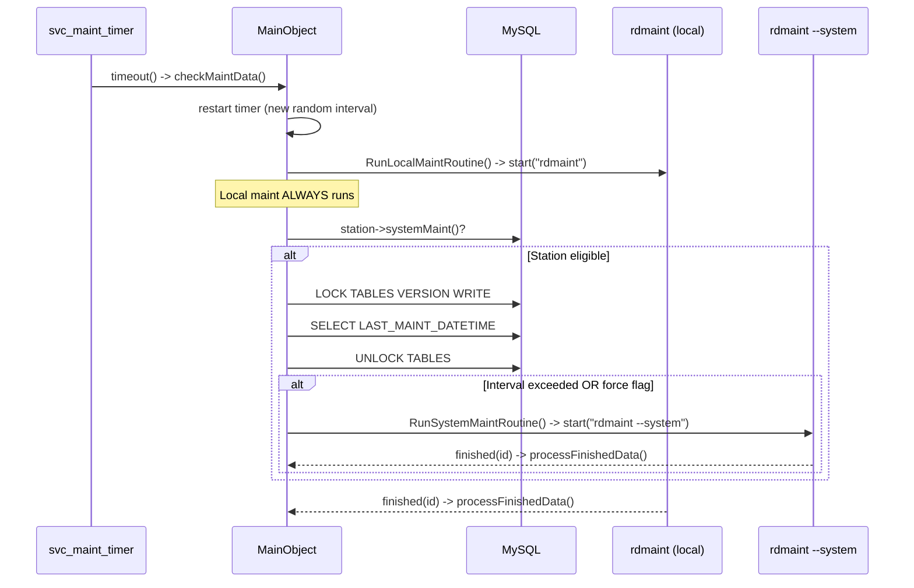

# SVC-003: Maintenance Scheduling

## Kontekst biznesowy

Rivendell requires periodic database maintenance tasks to run across the system. rdservice coordinates this by running local maintenance on every tick of a randomized timer, and system-wide maintenance only when the host is eligible and enough time has passed since the last run. The random jitter prevents all hosts in a multi-host deployment from attempting maintenance simultaneously. Table-level locking in MySQL ensures that only one host performs system maintenance at a time.

## Aktorzy

| Aktor | Rola w tej feature |
|-------|-------------------|
| System (timer) | Tick maintenance timera wyzwala sprawdzanie i uruchomienie |
| Administrator | Moze wymusic system maint (--force-system-maintenance), override interval (--initial-maintenance-interval), lub wylaczyc (disableMaintChecks) |
| Inne hosty Rivendell | Wspolzawodnicza o system maintenance poprzez table lock na VERSION |

## Granica funkcjonalnosci

```
IN SCOPE:
  - Maintenance timer setup (single-shot, random jitter)
  - Local maintenance (unconditional, per tick)
  - System maintenance (conditional: station flag + interval check + table lock)
  - Ephemeral process management (rdmaint)
  - Force system maintenance flag
  - Initial maintenance interval override
  - Disable maintenance checks
  - Process finish monitoring for ephemeral processes

OUT OF SCOPE:
  - What rdmaint actually does → external utility (not part of SVC artifact)
  - Core daemon lifecycle → patrz SVC-001
  - Dropbox management → patrz SVC-002
```

---

## Use Cases

| ID | Aktor | Akcja | Efekt biznesowy | Priorytet |
|----|-------|-------|----------------|-----------|
| UC-1 | System (timer) | Tick maintenance | Lokalne + warunkowe systemowe utrzymanie | MUST |
| UC-2 | Administrator | --force-system-maintenance | System maint na pierwszym tiku | SHOULD |
| UC-3 | Administrator | --initial-maintenance-interval=N | Ustawienie poczatkowego delay | COULD |
| UC-4 | Administrator | disableMaintChecks in config | Wylaczenie utrzymania na tym hoscie | SHOULD |
| UC-5 | System | rdmaint process finishes | Status zalogowany, proces wyczyszczony | MUST |

---

## Reguly biznesowe (Gherkin)

```gherkin
Rule: Maintenance interval uses random jitter

  Scenario: Calculate next interval
    Given RD_MAINT_MIN_INTERVAL = 900000ms (15min)
    And   RD_MAINT_MAX_INTERVAL = 3600000ms (60min)
    When  GetMaintInterval() is called
    Then  returns uniform random value in [900000, 3600000] ms
    And   each call returns a different value (randomized)

  # Zrodlo: maint_routines.cpp:108-113, lib/rd.h:443-444 | Pewnosc: potwierdzone


Rule: Maintenance timer is single-shot with rescheduling

  Scenario: Timer fires
    Given maintenance timer has expired
    When  checkMaintData() is called
    Then  timer is immediately rescheduled with new random interval
    And   then maintenance routines are executed

  # Zrodlo: maint_routines.cpp:44-45, rdservice.cpp:138 | Pewnosc: potwierdzone


Rule: Local maintenance always runs

  Scenario: Maintenance tick
    Given timer fires
    When  checkMaintData() processes
    Then  RunLocalMaintRoutine() is ALWAYS called
    And   spawns "rdmaint" (no flags)

  # Zrodlo: maint_routines.cpp:51, 99-105 | Pewnosc: potwierdzone


Rule: System maintenance requires station eligibility

  Scenario: Station eligible, interval exceeded
    Given station->systemMaint() = true
    And   time since VERSION.LAST_MAINT_DATETIME > RD_MAINT_MAX_INTERVAL (60min)
    When  checkMaintData() runs
    Then  LOCK TABLES VERSION WRITE
    And   reads LAST_MAINT_DATETIME
    And   UNLOCK TABLES
    And   RunSystemMaintRoutine() spawns "rdmaint --system"

  Scenario: Station eligible, interval NOT exceeded
    Given station->systemMaint() = true
    And   time since LAST_MAINT_DATETIME <= 60min
    When  checkMaintData() runs
    Then  system maintenance is NOT executed

  Scenario: Station not eligible
    Given station->systemMaint() = false
    When  checkMaintData() runs
    Then  system maintenance check is skipped entirely (early return)

  # Zrodlo: maint_routines.cpp:56-83 | Pewnosc: potwierdzone


Rule: Table lock ensures coordination between hosts

  Scenario: Two hosts check simultaneously
    Given Host A and Host B both have systemMaint() = true
    And   LAST_MAINT_DATETIME is older than 60 minutes
    When  both hosts' timers fire at similar times
    Then  only one host can hold LOCK TABLES VERSION WRITE at a time
    And   the other host sees updated timestamp after first host completes
    And   second host skips system maintenance

  # Zrodlo: maint_routines.cpp:63-75 | Pewnosc: potwierdzone
  # NOTE: The lock is READ before deciding, so there's a race window.
  # But rdmaint itself updates LAST_MAINT_DATETIME, so duplicate runs are
  # harmless if rare.


Rule: Force system maintenance flag

  Scenario: Flag set via CLI
    Given --force-system-maintenance passed
    When  first maintenance tick
    Then  system maintenance runs regardless of interval
    And   flag is reset to false after execution

  # Zrodlo: rdservice.cpp:96-98, maint_routines.cpp:80-82 | Pewnosc: potwierdzone


Rule: Maintenance can be completely disabled

  Scenario: disableMaintChecks in config
    Given config->disableMaintChecks() = true
    When  rdservice starts
    Then  maintenance timer is NOT started
    And   no maintenance ever runs on this host

  # Zrodlo: rdservice.cpp:141-153 | Pewnosc: potwierdzone


Rule: Initial maintenance interval overridable

  Scenario: CLI override
    Given --initial-maintenance-interval=5000
    When  rdservice starts
    Then  first maintenance tick after 5000ms (instead of random)
    And   subsequent ticks use random jitter normally

  Scenario: Invalid interval value
    Given --initial-maintenance-interval=abc
    When  rdservice starts
    Then  exits with code 4

  # Zrodlo: rdservice.cpp:100-107, 142-143 | Pewnosc: potwierdzone


Rule: Ephemeral process monitoring

  Scenario: rdmaint exits normally
    Given rdmaint process was started
    When  it exits with code 0
    Then  LOG_DEBUG "process exited normally"
    And   RDProcess removed from svc_processes map

  Scenario: rdmaint crashes
    Given rdmaint process was started
    When  it crashes (exitStatus != NormalExit)
    Then  LOG_WARNING "process crashed!"
    And   cleanup performed

  Scenario: rdmaint fails to start
    Given rdmaint binary not found
    When  RunEphemeralProcess() is called
    Then  LOG_WARNING with error message
    And   process entry removed from map

  # Zrodlo: rdservice.cpp:162-182, maint_routines.cpp:116-133 | Pewnosc: potwierdzone
```

---

## Data Model (tabele DB w scope)

### Tabela: VERSION (read with table lock)

| Kolumna | Typ | Null | Opis |
|---------|-----|------|------|
| DB | int | NO | PK (schema version) |
| LAST_MAINT_DATETIME | datetime | YES | Timestamp of last system-wide maintenance run |

No FK relationships for this feature.

---

## API klas w scope

### MainObject (maintenance-related methods)

**Odpowiedzialnosc:** Schedules and executes periodic maintenance via external rdmaint process.
**Pelny opis:** `inventory.md#MainObject`

**Private API:**
| Metoda | Parametry | Efekt | Warunki |
|--------|-----------|-------|---------|
| checkMaintData() | - | Reschedules timer, runs local maint, conditionally runs system maint | Slot connected to svc_maint_timer |
| RunSystemMaintRoutine() | - | Spawns "rdmaint --system" as ephemeral process | Called when system maint is due |
| RunLocalMaintRoutine() | - | Spawns "rdmaint" as ephemeral process | Called unconditionally per tick |
| GetMaintInterval() | - | Returns random int in [MIN, MAX] interval | Pure function (uses random()) |
| RunEphemeralProcess() | int id, QString program, QStringList args | Starts process, connects finished(int) signal to processFinishedData(int) | Reusable utility |

**Sloty:**
| Slot | Parametry | Efekt |
|------|-----------|-------|
| checkMaintData() | - | Main maintenance logic (timer handler) |
| processFinishedData() | int id | Logs exit status, cleans up ephemeral process |

**Fields:**
| Field | Type | Purpose |
|-------|------|---------|
| svc_maint_timer | QTimer* | Single-shot timer for maintenance scheduling |
| svc_force_system_maintenance | bool | CLI flag to force first system maint run |

**Constants:**
| Constant | Value | Meaning |
|----------|-------|---------|
| RD_MAINT_MIN_INTERVAL | 900000 (15min) | Minimum maintenance interval |
| RD_MAINT_MAX_INTERVAL | 3600000 (60min) | Maximum maintenance interval |
| RDSERVICE_LOCALMAINT_ID | 8 | Process ID for local maint |
| RDSERVICE_SYSTEMMAINT_ID | 9 | Process ID for system maint |

---

## Protokoly komunikacji

### SQL Operations

| Query | Tabela | Purpose |
|-------|--------|---------|
| LOCK TABLES VERSION WRITE | VERSION | Exclusive lock for coordination |
| SELECT LAST_MAINT_DATETIME FROM VERSION | VERSION | Check time since last system maint |
| UNLOCK TABLES | VERSION | Release lock |

### Child Process Protocol

| Process | Arguments | Purpose |
|---------|-----------|---------|
| rdmaint | (none) | Local maintenance |
| rdmaint | --system | System-wide maintenance |

---

## UI Contracts

Brak — feature jest backend-only.

---

## Sygnaly integracji (z call-graph.md)

### Sequence diagram — Maintenance tick



**Odbierane:**
| Nadawca | Sygnal | Klasa (tu) | Slot | Kontekst |
|---------|--------|------------|------|----------|
| svc_maint_timer (QTimer) | timeout() | MainObject | checkMaintData() | Random interval [15-60 min] |
| svc_processes[id] (RDProcess) | finished(int) | MainObject | processFinishedData(int) | After rdmaint completes |

**Emitowane:** Brak

---

## Platform Independence

| Funkcja | Oryginal | Klon | Priorytet |
|---------|----------|------|-----------|
| random() / srandom() | C stdlib | Platform PRNG | LOW |
| Process spawning (rdmaint) | QProcess | Platform process management | HIGH |
| MySQL table lock | LOCK TABLES WRITE | DB-level coordination (or distributed lock) | HIGH |

---

## Configuration (klucze w scope)

| Klucz | Typ | Domyslna | Wplyw na te feature |
|-------|-----|---------|---------------------|
| --force-system-maintenance | CLI flag | false | Forces system maint on first tick |
| --initial-maintenance-interval | CLI int (ms) | random [15-60min] | Overrides first tick delay |
| config->disableMaintChecks() | RDConfig bool | false | Disables all maintenance on this host |
| station->systemMaint() | DB (STATIONS table) | varies | Whether this host participates in system maintenance |
| RD_MAINT_MIN_INTERVAL | compile-time | 900000 (15min) | Minimum jitter bound |
| RD_MAINT_MAX_INTERVAL | compile-time | 3600000 (60min) | Maximum jitter bound / system maint interval |
| RD_PREFIX | compile-time | /usr/local | Path to rdmaint binary |

---

## Acceptance Criteria (E2E)

```gherkin
Feature: Maintenance Scheduling

  Scenario: Regular maintenance cycle
    Given rdservice is running
    And   maintenance checks are not disabled
    When  maintenance timer fires
    Then  local maintenance (rdmaint) should run
    And   timer should be rescheduled with random interval between 15-60 minutes

  Scenario: System maintenance on eligible host
    Given station has systemMaint() enabled
    And   VERSION.LAST_MAINT_DATETIME is older than 60 minutes
    When  maintenance timer fires
    Then  local maintenance should run
    And   system maintenance (rdmaint --system) should also run
    And   VERSION table was locked during check

  Scenario: System maintenance skipped on ineligible host
    Given station has systemMaint() disabled
    When  maintenance timer fires
    Then  only local maintenance runs
    And   no VERSION table queries are made

  Scenario: Forced system maintenance
    Given --force-system-maintenance was passed
    When  first maintenance timer fires
    Then  system maintenance runs regardless of LAST_MAINT_DATETIME
    And   force flag is reset (subsequent ticks use normal logic)

  Scenario: Maintenance disabled
    Given config->disableMaintChecks() is true
    When  rdservice starts
    Then  no maintenance timer is started
    And   no maintenance ever runs

  Scenario: Multi-host coordination
    Given Host A and Host B share the same MySQL database
    And   both have systemMaint() enabled
    And   LAST_MAINT_DATETIME is stale
    When  both hosts' maintenance timers fire near-simultaneously
    Then  only one host runs system maintenance (due to table lock)
```

---

## Open Questions

- [ ] Is the table lock coordination sufficient? There's a race window between reading LAST_MAINT_DATETIME and rdmaint updating it. Duplicate runs may occur rarely — are they idempotent?
- [ ] Should ephemeral process failures (rdmaint crashes) trigger a retry?

---

## Working Packages (wstepny podzial)

| WP | Opis | Zaleznosci |
|----|------|-----------|
| WP-1 | Maintenance timer with random jitter | SVC-001 |
| WP-2 | Local maintenance runner (spawn rdmaint) | WP-1, SVC-001 WP-1 |
| WP-3 | System maintenance eligibility check (DB query + lock) | WP-1 |
| WP-4 | Force maintenance and disable config | WP-1, WP-3 |
| WP-5 | Tests (jitter range, eligibility, coordination, force/disable) | WP-1..WP-4 |
