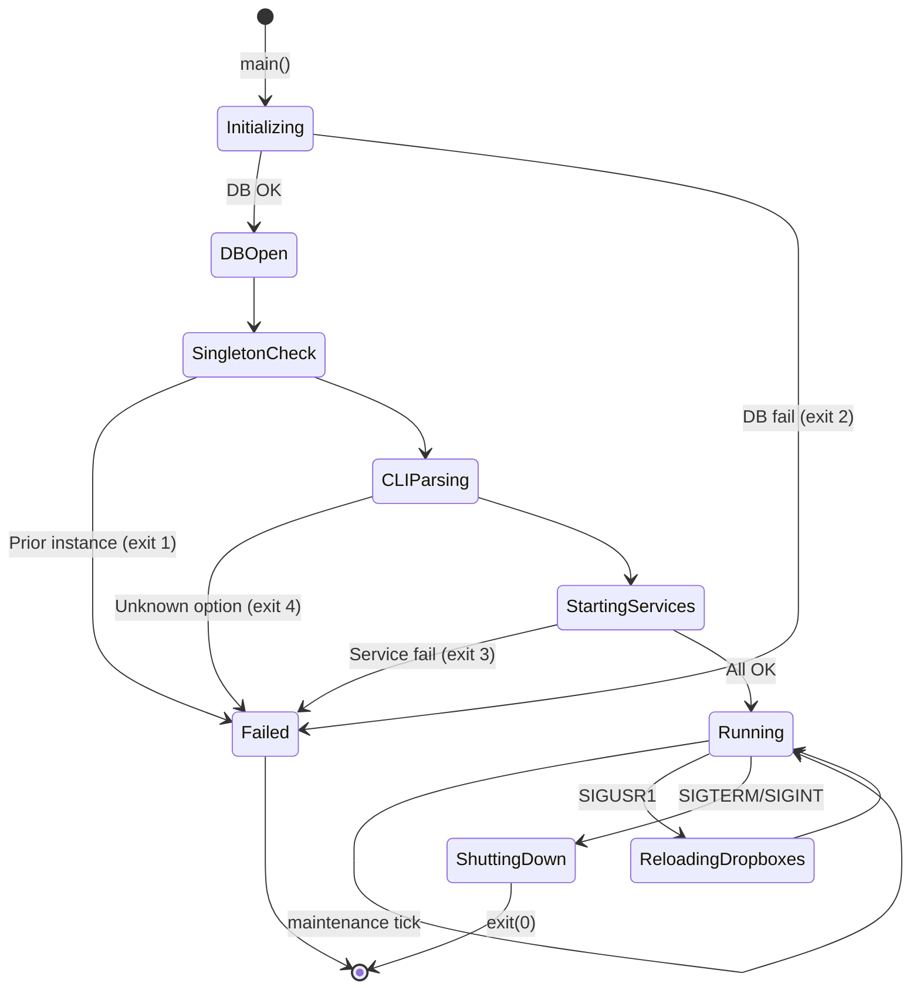

# SPEC: rdservice (Service Manager daemon)
## Behavioral Specification — WHAT without HOW

> Dokument ten opisuje CO system robi i JAKIE MA ZACHOWANIE.
> Jest **nawigacyjnym PRD** — podsumowuje i linkuje do szczegolow w fazach 2-5.
> Agenci kodujacy czytaja FEAT pliki (Phase 7) ktore zawieraja kompletne dane.

### Zrodla szczegolow

| Dokument | Zawiera | Czytaj gdy |
|----------|---------|-----------|
| `inventory.md` | Pelne API MainObject, sloty, enum StartupTarget | Potrzebujesz sygnatury metody |
| `ui-contracts.md` | N/A (headless daemon) | Nie dotyczy |
| `call-graph.md` | 3 connect(), 4 sequence diagrams, dependency graph | Potrzebujesz grafu zdarzen |
| `facts.md` | 34 fakty, 14 regul Gherkin, 2 state machines | Potrzebujesz regul z dowodami |
| `data-model.md` | 5 tabel DB (read-only), ERD | Potrzebujesz schematu DB |

---

## Sekcja 1 — Project Overview

**Czym jest rdservice:**
rdservice to menedzer uslug systemu Rivendell Radio Automation. Uruchamiany przy starcie systemu, odpowiada za zarzadzanie cyklem zycia wszystkich daemonow backendowych (audio engine, IPC, scheduler, PAD, replication, RSS), procesow importu dropbox oraz za okresowe utrzymanie bazy danych. Jest centralnym punktem kontroli — jesli rdservice sie zatrzyma, caly system Rivendell przestaje dzialac.

**Glowni aktorzy:**
| Aktor | Rola |
|-------|------|
| System operacyjny (systemd) | Uruchamia rdservice przy starcie i wysyla sygnaly (SIGTERM, SIGUSR1) |
| Administrator systemu | Konfiguruje opcje startowe, wymusza utrzymanie, zarzadza dropboxami |
| Baza danych MySQL | Zrodlo konfiguracji (stacje, replicatory, dropboxy, harmonogram utrzymania) |

**Kluczowe wartosci biznesowe:**
- Niezawodne uruchomienie calego stosu Rivendell w poprawnej kolejnosci
- Graceful shutdown z czyszczeniem zasobow
- Hot-reload dropboxow bez restartu calego systemu
- Automatyczne, koordynowane utrzymanie bazy danych miedzy wieloma hostami

---

## Sekcja 2 — Domain Model

### Encje biznesowe

| Encja | Opis | Kluczowe pola | Pelne API |
|-------|------|--------------|-----------|
| MainObject | Jedyna klasa — zarzadza cyklem zycia wszystkich uslug | svc_processes, svc_maint_timer, svc_exit_timer, svc_startup_target | `inventory.md#MainObject` |
| RDProcess (z librd) | Wrapper na QProcess — reprezentuje zarzadzany proces potomny | process(), start(), errorText(), prettyCommandString() | `../LIB/inventory.md#RDProcess` |

### Relacje

```
MainObject 1──────────N RDProcess   (jeden MainObject zarzadza wieloma procesami)
```

### Enums

| Enum | Wartosci | Znaczenie |
|------|----------|-----------|
| StartupTarget | TargetCaed(0)..TargetRdrssd(7), TargetAll(8) | Kontroluje do ktorego daemona startup powinien sie zatrzymac. TargetAll = pelny startup. |

---

## Sekcja 3 — Data Model (schemat DB)

> rdservice jest czysto read-only konsumentem bazy danych.
> Pelny schemat z ERD: `data-model.md`

### Tabela: VERSION (read with table lock)

| Kolumna | Typ | Null | Opis | Mapowanie |
|---------|-----|------|------|-----------|
| DB | int | NO | PK, wersja schematu | - |
| LAST_MAINT_DATETIME | datetime | YES | Czas ostatniego system maintenance | -> checkMaintData() |

### Tabela: SYSTEM (read)

| Kolumna | Typ | Null | Opis | Mapowanie |
|---------|-----|------|------|-----------|
| RSS_PROCESSOR_STATION | varchar(64) | YES | Stacja wyznaczona do procesowania RSS | -> Startup() (warunek rdrssd) |

### Tabela: REPLICATORS (existence check)

| Kolumna | Typ | Null | Opis | Mapowanie |
|---------|-----|------|------|-----------|
| NAME | char(32) | NO | PK | - |
| STATION_NAME | char(64) | YES | Przypisana stacja | -> Startup() (warunek rdrepld) |

### Tabela: DROPBOXES (full read per station)

25+ kolumn mapowanych na argumenty CLI rdimport. Pelna lista: `data-model.md#DROPBOXES`

### Tabela: DROPBOX_SCHED_CODES (joined read)

| Kolumna | Typ | Null | Opis | Mapowanie |
|---------|-----|------|------|-----------|
| DROPBOX_ID | int | NO | FK -> DROPBOXES.ID | -> StartDropboxes() |
| SCHED_CODE | char(11) | NO | Kod schedulera | -> --add-scheduler-code= |

### Relacje FK

```
DROPBOXES.ID → DROPBOX_SCHED_CODES.DROPBOX_ID (1:N)
```

---

## Sekcja 4 — Functional Capabilities (Use Cases)

| ID | Aktor | Akcja | Efekt biznesowy | Priorytet |
|----|-------|-------|----------------|-----------|
| UC-001 | System (boot) | Uruchamia rdservice | Wszystkie uslugi Rivendell startuja w kolejnosci z walidacja | MUST |
| UC-002 | Administrator | SIGTERM/SIGINT | Graceful shutdown calego stosu | MUST |
| UC-003 | Administrator | SIGUSR1 | Hot-reload konfiguracji dropboxow z DB | MUST |
| UC-004 | System (timer) | Tick maintenance | Lokalne + warunkowe systemowe utrzymanie | MUST |
| UC-005 | Administrator | --end-startup-after-X | Czesciowy startup (debugging) | SHOULD |
| UC-006 | Administrator | --force-system-maintenance | Wymuszenie system maint na starcie | SHOULD |
| UC-007 | Administrator | --initial-maintenance-interval=N | Override poczatkowego opoznienia maint | COULD |
| UC-008 | System | Ephemeral process exits | Log statusu + cleanup | MUST |

-> Pelne reguly: `facts.md`

---

## Sekcja 5 — Business Rules (Gherkin)

> Kluczowe reguly definiujace zachowanie systemu.
> Kompletna lista z source references: `facts.md`

```gherkin
Rule: Singleton enforcement
  Scenario: Proba uruchomienia drugiej instancji
    Given rdservice juz dziala
    When  nowa instancja startuje
    Then  nowa instancja konczy sie z exit code 1

Rule: Uslugi startuja w scisle okreslonej kolejnosci
  Scenario: Pelny startup
    Given svc_startup_target = TargetAll
    When  Startup() jest wywolany
    Then  kolejnosc: caed -> ripcd -> rdcatchd -> rdpadd -> (1s) -> rdpadengined -> rdvairplayd -> rdrepld? -> rdrssd? -> dropboxy

Rule: rdrepld uruchamiany warunkowo
  Scenario: Stacja ma replicatory w DB
    Given REPLICATORS zawiera wpisy dla tej stacji
    When  startup dochodzi do rdrepld
    Then  rdrepld jest uruchamiany
  Scenario: Brak replicatorow
    Given REPLICATORS nie ma wpisow dla stacji
    Then  rdrepld jest pomijany

Rule: Shutdown w odwrotnej kolejnosci
  Scenario: Graceful shutdown
    Given SIGTERM/SIGINT odebrany
    Then  dropboxy -> SIGKILL natychmiast
    And   daemony -> SIGTERM, czekaj, SIGKILL jesli timeout
    And   kolejnosc odwrotna do startu (LIFO)

Rule: Maintenance z losowym jitterem i koordynacja miedzy hostami
  Scenario: System maintenance eligible
    Given station.systemMaint() = true
    And   elapsed od LAST_MAINT_DATETIME > 60 min
    When  tick maintenance
    Then  LOCK TABLES VERSION WRITE
    And   uruchom rdmaint --system
    And   UNLOCK
```

---

## Sekcja 6 — State Machines

### rdservice Daemon State Machine



| Przejscie | Trigger | Warunek | Efekt |
|-----------|---------|---------|-------|
| Init->Failed | DB error | open() fails | syslog + exit(2) |
| Singleton->Failed | Prior instance | PIDs > 1 | syslog + exit(1) |
| Starting->Failed | Svc fail | waitForStarted() fails | Shutdown() first, then exit(3) |
| Running->Reloading | SIGUSR1 | flag set | ShutdownDropboxes + StartDropboxes |
| Running->ShuttingDown | SIGTERM/INT | flag set | Orderly shutdown |

-> Pelna tabela przejsc: `facts.md`

---

## Sekcja 7 — Reactive Architecture

### Kluczowe przeplowy zdarzen

**Przeplyw: Startup uslug**
```
[System boot] uruchomienie rdservice
    -> Otwarcie bazy danych
    -> Weryfikacja singleton
    -> Zabicie stalych procesow
    -> Sekwencyjne uruchomienie 8 daemonow (z warunkami)
    -> Uruchomienie N procesow dropbox (z konfiguracji DB)
    -> Aktywacja timerow (exit polling + maintenance)
    -> Stan: Running
```

**Przeplyw: Graceful shutdown**
```
[SIGTERM/SIGINT] odebrany
    -> Flag global_exiting (async, polled co 100ms)
    -> Zamkniecie dropboxow (SIGKILL)
    -> Zamkniecie daemonow (SIGTERM + wait + SIGKILL, LIFO)
    -> Usuniecie PID file
    -> exit(0)
```

**Przeplyw: Dropbox hot-reload**
```
[SIGUSR1] odebrany
    -> ShutdownDropboxes (SIGKILL)
    -> StartDropboxes (re-read DB config)
    -> Reinstalacja handlera SIGUSR1
```

**Przeplyw: Maintenance tick**
```
[Timer timeout] (co 15-60 min, losowo)
    -> Lokalne utrzymanie (bezwarunkowe) -> rdmaint
    -> Systemowe utrzymanie (warunkowe) -> rdmaint --system
    -> Reschedulowanie timera (nowy losowy interval)
```

### Cross-artifact komunikacja

| Zrodlo | Zdarzenie | Cel | Efekt |
|--------|-----------|-----|-------|
| SVC | Process start | CAE, RPC, CTD, PAD, PDD, VAD | Uruchomienie daemona |
| SVC | Process start (conditional) | RPL, RSS | Warunkowe uruchomienie |
| SVC | Process spawn (N) | IMP (rdimport) | Dropbox instances |
| SVC | Process spawn (ephemeral) | rdmaint | Maintenance tasks |
| SVC | SQL read (with lock) | MySQL (VERSION) | Koordynacja maintenance |
| SVC | SQL read | MySQL (REPLICATORS, SYSTEM, DROPBOXES) | Konfiguracja warunkowa |

-> Pelny graf: `call-graph.md`

---

## Sekcja 8 — UI/UX Contracts

N/A — rdservice jest headless daemonem (QCoreApplication).
Brak okien, dialogow, widgetow.

Interfejsy uzytkownika:
- **CLI:** argumenty wiersza polecen (10 opcji)
- **Sygnaly Unix:** SIGTERM, SIGINT (shutdown), SIGUSR1 (reload dropboxes)
- **Syslog:** logi systemowe (LOG_DEBUG, LOG_INFO, LOG_WARNING, LOG_ERR)

-> Pelna dokumentacja CLI: `facts.md` (sekcja Konfiguracja)

---

## Sekcja 9 — API & Protocol Contracts

rdservice nie eksponuje zadnego protokolu sieciowego (TCP/UDP/HTTP).
Komunikacja ograniczona do:

### Unix Signals (jedyny zewnetrzny interfejs)

| Sygnal | Nadawca | Efekt | Latencja |
|--------|---------|-------|----------|
| SIGTERM | systemd / admin | Graceful shutdown calego stosu | max 100ms (poll interval) |
| SIGINT | terminal (Ctrl+C) | Jak SIGTERM | max 100ms |
| SIGUSR1 | admin (kill -USR1) | Hot-reload dropboxow | max 100ms |

### SQL Operations (on MySQL)

| Operacja | Tabela | Tryb | Cel |
|----------|--------|------|-----|
| SELECT + LOCK/UNLOCK | VERSION | read (with write lock) | Koordynacja maintenance |
| SELECT | SYSTEM | read | Sprawdzenie RSS processor station |
| SELECT | REPLICATORS | read | Sprawdzenie czy rdrepld potrzebny |
| SELECT | DROPBOXES | read | Konfiguracja procesow dropbox |
| SELECT | DROPBOX_SCHED_CODES | read | Kody schedulera per dropbox |

### Child Process CLI Protocol (rdimport)

Kazdy dropbox generuje proces rdimport z argumentami CLI:
- `--persistent-dropbox-id=N` — ID z DB
- `--drop-box` — tryb dropbox
- `--normalization-level=N` — z DROPBOXES.NORMALIZATION_LEVEL/100
- `--autotrim-level=N` — z DROPBOXES.AUTOTRIM_LEVEL/100
- `--to-cart=N` — jesli TO_CART > 0
- `--add-scheduler-code=X` — per DROPBOX_SCHED_CODES row
- (i wiele wiecej — pelna lista w `data-model.md#DROPBOXES`)

---

## Sekcja 10 — Data Flow

```
[MySQL DB] --(SQL READ)--> [MainObject] --(QProcess fork+exec)--> [Child Daemons/Processes]
                                |
                                +--(QTimer)--> [Maintenance scheduling]
                                |
                                +--(Unix signals)<-- [OS/Administrator]
```

| Transformacja | Od | Do | Co sie zmienia |
|--------------|----|----|----------------|
| DB config -> CLI args | DROPBOXES rows | rdimport CLI arguments | 25+ kolumn -> argumenty wiersza polecen |
| DB check -> conditional start | REPLICATORS/SYSTEM tables | rdrepld/rdrssd lifecycle | Existance check -> start/skip decision |
| Timer interval -> random jitter | RD_MAINT_MIN/MAX_INTERVAL | svc_maint_timer interval | Deterministic bounds -> uniform random |
| VERSION timestamp -> run decision | LAST_MAINT_DATETIME | boolean "should run system maint" | Timestamp comparison with table lock |

---

## Sekcja 11 — Error Taxonomy

| Kod | Kategoria | Co wywoluje | Zachowanie | Komunikat |
|-----|-----------|-------------|-----------|-----------|
| exit(0) | Normal | SIGTERM/SIGINT | Clean shutdown | "shutting down normally" |
| exit(1) | Singleton | Prior instance running | Immediate exit | "prior instance found" |
| exit(2) | Database | MySQL unavailable | Immediate exit | "unable to open database" |
| exit(3) | Service | Daemon start failed | Shutdown() then exit | "unable to start service component" |
| exit(4) | CLI | Unknown/invalid option | Immediate exit | "unknown command-line option" / "invalid --initial-maintenance-interval value" |
| LOG_WARNING | Process | Child crashes | Log + cleanup | "process X crashed!" |
| LOG_WARNING | Process | Child non-zero exit | Log + cleanup | "process X exited with exit code N" |
| LOG_WARNING | PID | Unable to write PID file | Continue (non-fatal) | "unable to write pid file" |
| LOG_WARNING | Process | Ephemeral start fail | Log + cleanup | "unable to start ephemeral process" |
| LOG_WARNING | Stale | Stale daemon found | SIGKILL + retry | "killing unresponsive program" |

---

## Sekcja 12 — Integration Contracts

### Cross-artifact

| Artifact | Mechanizm | Kierunek | Kontrakt |
|----------|-----------|---------|---------|
| CAE (caed) | Child process (QProcess) | SVC -> CAE | Start at boot, SIGTERM at shutdown |
| RPC (ripcd) | Child process | SVC -> RPC | Start after caed, SIGTERM at shutdown |
| CTD (rdcatchd) | Child process | SVC -> CTD | Start after ripcd |
| PAD (rdpadd) | Child process | SVC -> PAD | Start after rdcatchd |
| PDD (rdpadengined) | Child process | SVC -> PDD | Start after 1s delay after rdpadd |
| VAD (rdvairplayd) | Child process | SVC -> VAD | Start after rdpadengined |
| RPL (rdrepld) | Child process (conditional) | SVC -> RPL | Only if REPLICATORS exist for station |
| RSS (rdrssd) | Child process (conditional) | SVC -> RSS | Only if RSS_PROCESSOR_STATION matches |
| IMP (rdimport) | Child processes (N) | SVC -> IMP | Per DROPBOXES row, SIGUSR1 for reload |
| LIB (librd) | Shared library | SVC uses LIB | RDApplication, RDProcess, RDSqlQuery, RDStation, RDConfig |

### Zewnetrzne systemy

| System | Rola | Protokol | Dane |
|--------|------|----------|------|
| MySQL/MariaDB | Configuration + coordination | SQL (via QtSql) | 5 tabel (read-only) |
| systemd | Process supervisor | Unix signals + PID file | Lifecycle management |
| syslog | Logging | syslog protocol | All operational messages |
| /proc filesystem | Process enumeration | procfs read | PID listing for stale detection |

---

## Sekcja 13 — Platform Independence Map

| Funkcja | Oryginal | Klon (proposed) | Priorytet |
|---------|----------|------|-----------|
| Unix signal handling | signal.h (SIGTERM, SIGINT, SIGUSR1) | Platform event system / IPC mechanism | HIGH |
| Process lifecycle | fork+exec (QProcess) | Platform process management / container orchestration | HIGH |
| Process kill | kill() + SIGKILL | Platform-specific termination API | HIGH |
| Process enumeration | /proc filesystem (RDGetPids) | Platform process listing API | HIGH |
| PID file | /var/run/rdservice.pid | Lock file / named mutex / service registry | MEDIUM |
| syslog | syslog.h | Structured logging framework | MEDIUM |
| sleep() blocking delay | sleep(1) between rdpadd/rdpadengined | Proper readiness signaling (socket activation) | MEDIUM |
| Random jitter | random() / srandom() | Platform PRNG | LOW |

---

## Sekcja 14 — Non-Functional Requirements

```gherkin
Scenario: Startup completes within reasonable time
  Given all managed daemons are functional
  When  rdservice starts with TargetAll
  Then  all services should be running within 30 seconds
  And   maintenance timer should be scheduled

Scenario: Shutdown respects daemon ordering
  Given rdservice is running with all services
  When  SIGTERM is received
  Then  all processes should be terminated within 60 seconds
  And   no orphan processes should remain

Scenario: Signal detection latency
  Given rdservice is running
  When  a Unix signal is delivered
  Then  the signal should be detected within 100ms (exit timer poll interval)

Scenario: Maintenance coordination prevents duplicate runs
  Given multiple rdservice instances on different hosts share the same DB
  When  system maintenance is due
  Then  only one host should run system maintenance (via VERSION table lock)
```

---

## Sekcja 15 — Configuration

| Klucz/Opcja | Typ | Domyslna | Opis |
|-------------|-----|---------|------|
| --end-startup-after-{daemon} | CLI flag | TargetAll | Partial startup for debugging |
| --force-system-maintenance | CLI flag | false | Force system maint on first tick |
| --initial-maintenance-interval | CLI int (ms) | random [15-60min] | Override initial maint delay |
| config->disableMaintChecks() | RDConfig bool | false | Disable all maintenance on this host |
| station->systemMaint() | DB (STATIONS table) | varies | Whether this host runs system maintenance |
| SYSTEM.RSS_PROCESSOR_STATION | DB varchar | varies | Which host runs rdrssd |
| REPLICATORS per station | DB rows | varies | Whether this host runs rdrepld |
| DROPBOXES per station | DB rows | varies | Number and config of dropbox instances |
| RD_MAINT_MIN_INTERVAL | compile-time | 900000 (15min) | Minimum maintenance interval |
| RD_MAINT_MAX_INTERVAL | compile-time | 3600000 (60min) | Maximum maintenance interval |
| RD_PID_DIR | compile-time | /var/run | PID file directory |
| RD_PREFIX | compile-time | /usr/local | Installation prefix for daemon binaries |

---

## Sekcja 16 — E2E Acceptance Scenarios

```gherkin
Feature: Service Manager Lifecycle

  Scenario: Full system boot
    Given MySQL database is running and configured
    And   no prior instance of rdservice is running
    And   station has REPLICATORS configured
    And   station is not RSS processor
    When  rdservice is started with no options
    Then  caed should be running
    And   ripcd should be running
    And   rdcatchd should be running
    And   rdpadd should be running
    And   rdpadengined should be running (after 1s delay)
    And   rdvairplayd should be running
    And   rdrepld should be running
    And   rdrssd should NOT be running
    And   N rdimport processes should be running (per DROPBOXES config)
    And   maintenance timer should be scheduled within 15-60 minutes
    And   PID file should exist at /var/run/rdservice.pid

  Scenario: Graceful shutdown on SIGTERM
    Given rdservice is running with all services
    When  SIGTERM is sent to rdservice
    Then  all dropbox processes are killed immediately
    And   daemons are terminated in reverse order (rdrssd first, caed last)
    And   PID file is removed
    And   rdservice exits with code 0
    And   no orphan processes remain

  Scenario: Dropbox hot-reload on SIGUSR1
    Given rdservice is running with 3 dropbox processes
    And   administrator adds 2 new DROPBOXES rows in DB
    When  SIGUSR1 is sent to rdservice
    Then  existing 3 dropbox processes are killed
    And   5 new dropbox processes are started (from refreshed DB config)
    And   all daemon processes remain unaffected
    And   subsequent SIGUSR1 should also trigger reload

  Scenario: Coordinated system maintenance
    Given rdservice is running on Host A and Host B
    And   Host A has station.systemMaint() = true
    And   Host B has station.systemMaint() = true
    And   LAST_MAINT_DATETIME is older than 60 minutes
    When  maintenance timer fires on Host A
    Then  Host A acquires LOCK on VERSION table
    And   Host A runs "rdmaint --system"
    And   if Host B timer fires simultaneously, it sees updated timestamp and skips
```

---

## Assumptions & Open Questions

| # | Zalozenie | Alternatywa | Wplyw |
|---|-----------|-------------|-------|
| 1 | 1s sleep between rdpadd/rdpadengined is a temporary workaround | Socket activation / readiness signaling | Should be replaced with proper mechanism in clone |
| 2 | Dropboxes have no graceful shutdown (SIGKILL only) | rdimport may need graceful handling in clone | Potential data loss if import is mid-operation |
| 3 | Signal handler uses classic signal() not sigaction() | May have portability issues on some platforms | Clone should use modern signal handling |
| 4 | Manpage has typo: --force-service-maintenance vs --force-system-maintenance | Code is authoritative | Fix docs in clone |
| 5 | Exit timer polls every 100ms for signals | Could use signalfd or Qt signal notifier | Reduces latency and CPU in clone |

---

*SPEC wygenerowany przez Qt Reverse Engineering Multi-Agent System v1.3.0*
*Zrodla: inventory.md + ui-contracts.md + call-graph.md + facts.md + data-model.md + kod zrodlowy*
