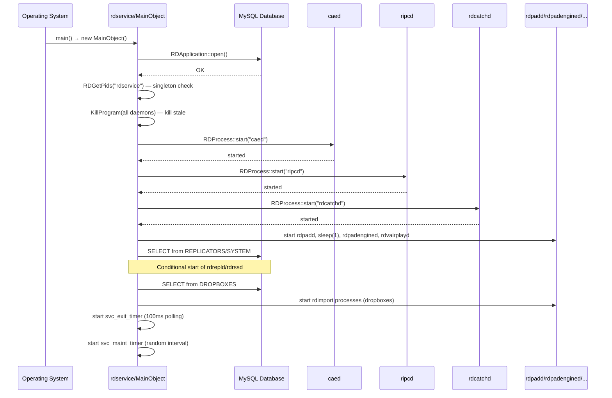
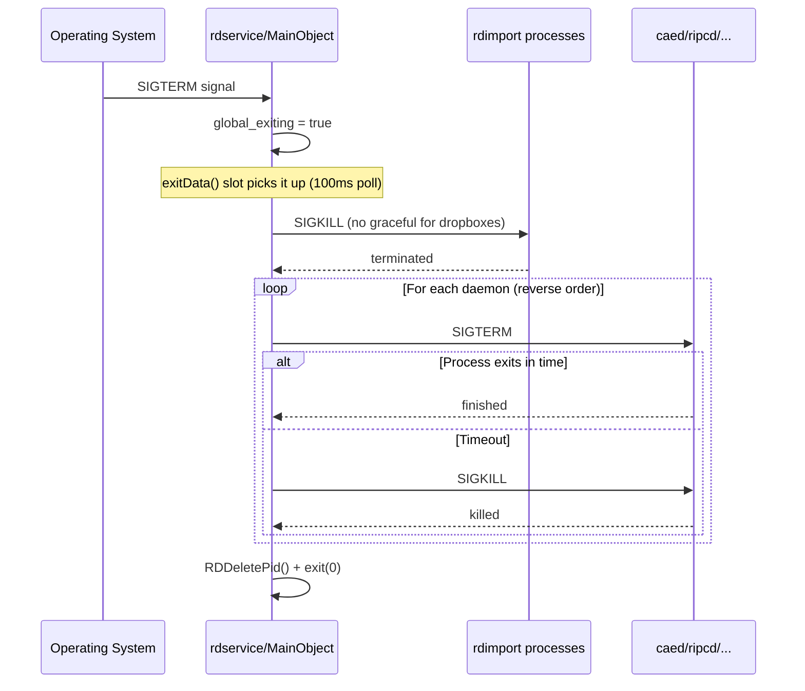
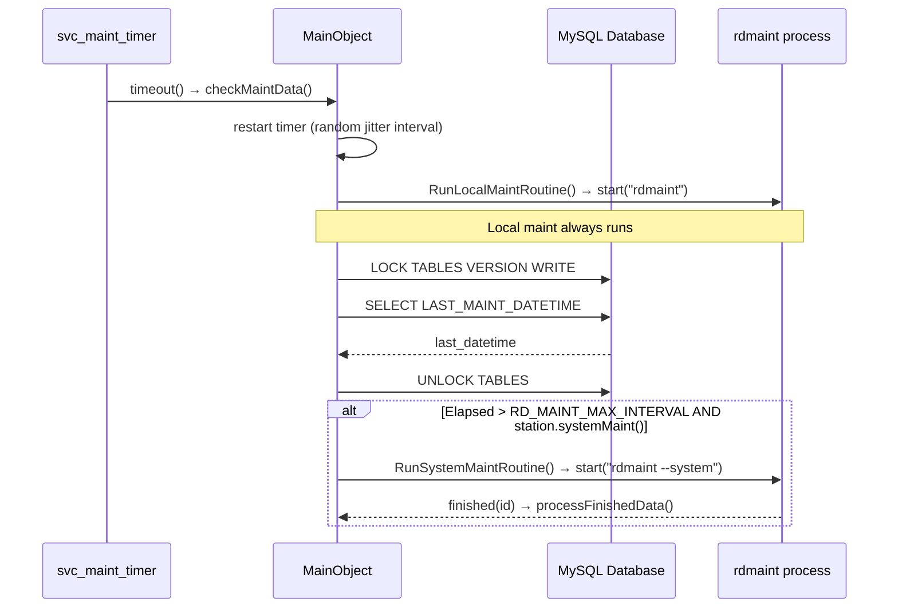
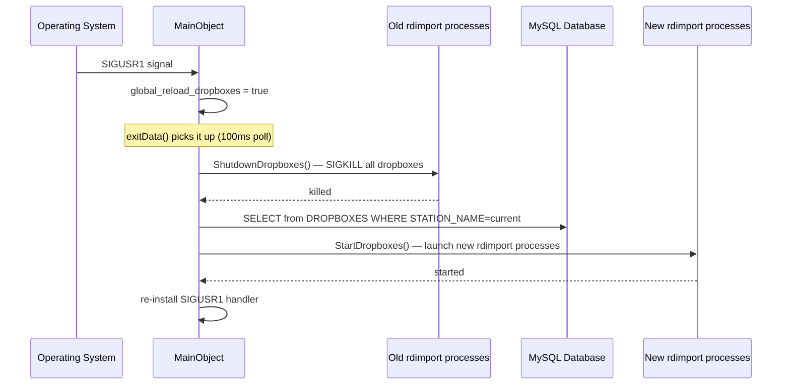

# Call Graph: rdservice (Service Manager daemon)

## Statystyki

| Metryka | Wartosc |
|---------|---------|
| Polaczenia connect() lacznie | 3 |
| Unikalne sygnaly | 3 (timeout x2, finished x1) |
| Klasy emitujace | 2 (QTimer, RDProcess) |
| Klasy odbierajace | 1 (MainObject) |
| Cross-artifact polaczenia | 8+ (via QProcess child management) |
| Circular dependencies | 0 |

---

## Diagramy

### Sequence: Startup uslug (happy path)



### Sequence: Graceful shutdown (SIGTERM)



### Sequence: Maintenance cycle



### Sequence: Dropbox reload (SIGUSR1)



### Graf zaleznosci

```mermaid
graph TD
    subgraph rdservice
        MainObject
    end
    
    subgraph "Managed Daemons (child processes)"
        caed["caed (CAE)"]
        ripcd["ripcd (RPC)"]
        rdcatchd["rdcatchd (CTD)"]
        rdpadd["rdpadd (PAD)"]
        rdpadengined["rdpadengined (PDD)"]
        rdvairplayd["rdvairplayd (VAD)"]
        rdrepld["rdrepld (RPL)"]
        rdrssd["rdrssd (RSS)"]
    end
    
    subgraph "Ephemeral Processes"
        rdmaint["rdmaint"]
        rdimport["rdimport (dropboxes)"]
    end
    
    subgraph "Shared Resources"
        MySQL[(MySQL DB)]
    end
    
    MainObject -->|"start/stop"| caed
    MainObject -->|"start/stop"| ripcd
    MainObject -->|"start/stop"| rdcatchd
    MainObject -->|"start/stop"| rdpadd
    MainObject -->|"start/stop"| rdpadengined
    MainObject -->|"start/stop"| rdvairplayd
    MainObject -.->|"conditional"| rdrepld
    MainObject -.->|"conditional"| rdrssd
    MainObject -->|"spawn N"| rdimport
    MainObject -->|"periodic"| rdmaint
    MainObject -->|"SQL read"| MySQL
    
    style caed fill:#f96
    style ripcd fill:#f96
    style rdcatchd fill:#69b
    style rdpadd fill:#69b
    style rdpadengined fill:#69b
    style rdvairplayd fill:#69b
    style rdrepld fill:#999
    style rdrssd fill:#999
    style rdmaint fill:#6b6
    style rdimport fill:#6b6
```



---

## Graf polaczen (connect registry)

| # | Nadawca (klasa) | Sygnal | Odbiorca (klasa) | Slot | Zdefiniowane w | Warunek |
|---|----------------|--------|-----------------|------|---------------|---------|
| 1 | svc_exit_timer (QTimer) | timeout() | MainObject | exitData() | rdservice.cpp:123 | Zawsze — polling co 100ms |
| 2 | svc_maint_timer (QTimer) | timeout() | MainObject | checkMaintData() | rdservice.cpp:139 | Jesli !disableMaintChecks() — single-shot z random interval |
| 3 | svc_processes[id] (RDProcess) | finished(int) | MainObject | processFinishedData(int) | maint_routines.cpp:122 | Per ephemeral process (rdmaint) |

---

## Kluczowe przeplowy zdarzen

### Przeplyw: Startup uslug Rivendell

```
[System boot / administrator]
    → main() → new MainObject()
    → RDApplication::open() (polaczenie DB)
    → singleton check (RDGetPids)
    → KillProgram() per kazdy daemon (cleanup stale)
    → Startup():
        → RDProcess::start(caed) → wait → OK
        → RDProcess::start(ripcd) → wait → OK
        → RDProcess::start(rdcatchd) → wait → OK
        → RDProcess::start(rdpadd) → wait → OK
        → sleep(1)  [band-aid]
        → RDProcess::start(rdpadengined) → wait → OK
        → RDProcess::start(rdvairplayd) → wait → OK
        → SQL: SELECT from REPLICATORS → if exists → start rdrepld
        → SQL: SELECT from SYSTEM → if RSS station → start rdrssd
        → StartDropboxes(): SQL: SELECT from DROPBOXES → per row start rdimport
    → svc_exit_timer->start(100)  [SIGTERM polling]
    → svc_maint_timer->start(random interval)  [maintenance scheduling]
```

**Efekt biznesowy:** Wszystkie uslugi Rivendell sa uruchomione w prawidlowej kolejnosci, gotowe do obslugi stacji radiowej.

### Przeplyw: Graceful shutdown (SIGTERM/SIGINT)

```
[Signal SIGTERM/SIGINT]
    → SigHandler() → global_exiting = true
    → exitData() (following 100ms poll):
        → Shutdown():
            → ShutdownDropboxes() (SIGKILL per dropbox)
            → for i = LAST_ID-1 downto 0:
                → SIGTERM → waitForFinished() || SIGKILL
        → RDDeletePid()
        → exit(0)
```

**Efekt biznesowy:** Czyste zamkniecie wszystkich uslug — odwrotna kolejnosc startu.

### Przeplyw: Dropbox hot-reload (SIGUSR1)

```
[Signal SIGUSR1]
    → SigHandler() → global_reload_dropboxes = true
    → exitData() (following 100ms poll):
        → ShutdownDropboxes()  [kill all existing]
        → StartDropboxes()     [re-read config from DB, spawn new]
        → re-install SIGUSR1 handler
```

**Efekt biznesowy:** Mozliwosc przeladowania konfiguracji dropboxow bez restartu calego systemu.

### Przeplyw: Maintenance tick

```
[svc_maint_timer timeout]
    → checkMaintData():
        → svc_maint_timer->start(random interval)  [schedule next]
        → RunLocalMaintRoutine()  [always — spawns rdmaint]
        → if station->systemMaint():
            → LOCK TABLES VERSION WRITE
            → SELECT LAST_MAINT_DATETIME
            → UNLOCK TABLES
            → if elapsed > RD_MAINT_MAX_INTERVAL OR svc_force_system_maintenance:
                → RunSystemMaintRoutine() [spawns rdmaint --system]
                → svc_force_system_maintenance = false
```

**Efekt biznesowy:** Automatyczne utrzymanie bazy danych — lokalne na kazdym hocie, systemowe koordynowane miedzy hostami (jitter + table lock).

---

## Cross-artifact polaczenia

| Zrodlo artifact | Mechanizm | Cel artifact | Sygnal/Metoda | Znaczenie |
|----------------|-----------|-------------|--------------|-----------|
| SVC | QProcess start/terminate/kill | CAE (caed) | lifecycle management | Uruchomienie i zamkniecie Core Audio Engine |
| SVC | QProcess start/terminate/kill | RPC (ripcd) | lifecycle management | Uruchomienie i zamkniecie IPC daemon |
| SVC | QProcess start/terminate/kill | CTD (rdcatchd) | lifecycle management | Uruchomienie i zamkniecie Catch daemon |
| SVC | QProcess start/terminate/kill | PAD (rdpadd) | lifecycle management | Uruchomienie i zamkniecie PAD daemon |
| SVC | QProcess start/terminate/kill | PDD (rdpadengined) | lifecycle management | Uruchomienie i zamkniecie PAD engine |
| SVC | QProcess start/terminate/kill | VAD (rdvairplayd) | lifecycle management | Uruchomienie i zamkniecie Virtual Airplay |
| SVC | QProcess conditional start | RPL (rdrepld) | lifecycle management | Warunkowe uruchomienie replication daemon |
| SVC | QProcess conditional start | RSS (rdrssd) | lifecycle management | Warunkowe uruchomienie RSS daemon |
| SVC | QProcess spawn N | IMP (rdimport) | dropbox instances | Uruchomienie procesow importu z konfiguracji DB |
| SVC | QProcess spawn | rdmaint | maintenance run | Delegowanie utrzymania do zewnetrznego procesu |
| SVC | SQL table lock | shared MySQL (all hosts) | LOCK VERSION | Koordynacja maintenance miedzy hostami |

---

## Q_PROPERTY Reactive Bindings

Brak — MainObject nie ma Q_PROPERTY.

---

## Circular Dependencies

Brak circular dependencies.

---

## Missing Coverage

| Klasa | Sygnal | Prawdopodobne wyjasnienie |
|-------|--------|--------------------------|

Brak — MainObject nie deklaruje wlasnych sygnalow, wiec nie ma sygnalu bez odbiorcy.

---

## Spot-check

MainObject jest jedyna klasa w SVC. Weryfikacja:
1. Header deklaruje 0 sygnalow i 3 sloty (processFinishedData, checkMaintData, exitData) — call-graph pokrywa wszystkie 3 sloty z ich connect().
2. Wszystkie 3 connect() wywolania sa udokumentowane w rejestrze.
3. Cross-artifact komunikacja (8 demonow + rdimport + rdmaint) jest kompletna.

Spot-check: PASS (3/3).
