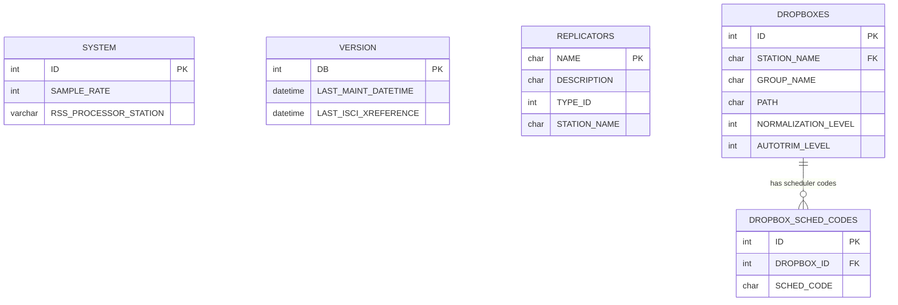
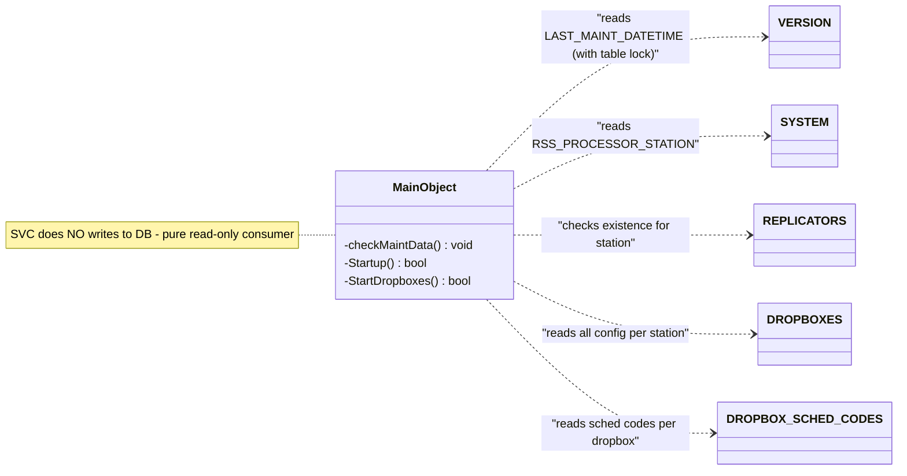

# Data Model: rdservice (Service Manager daemon)

## ERD — Entity Relationship Diagram

---

## Tabele

### VERSION

**Klasy CRUD:** MainObject (read-only)
**Operacje:** READ (SELECT LAST_MAINT_DATETIME, with LOCK TABLES WRITE for concurrency)

| Kolumna | Typ | Null | Default | Opis |
|---------|-----|------|---------|------|
| DB | int | NO | - | Primary key (schema version) |
| LAST_MAINT_DATETIME | datetime | YES | 1970-01-01 00:00:00 | Timestamp of last system-wide maintenance run |
| LAST_ISCI_XREFERENCE | datetime | YES | 1970-01-01 00:00:00 | Timestamp of last ISCI cross-reference |

**Uzywane kolumny przez SVC:** LAST_MAINT_DATETIME (porownywana z RD_MAINT_MAX_INTERVAL do okreslenia czy uruchomic system maintenance)

### SYSTEM

**Klasy CRUD:** MainObject (read-only)
**Operacje:** READ (SELECT RSS_PROCESSOR_STATION)

| Kolumna | Typ | Null | Default | Opis |
|---------|-----|------|---------|------|
| ID | int auto_increment | NO | - | Primary key |
| SAMPLE_RATE | int unsigned | YES | 44100 | System sample rate |
| DUP_CART_TITLES | enum(N,Y) | NO | Y | Allow duplicate cart titles |
| RSS_PROCESSOR_STATION | varchar(64) | YES | - | Station designated for RSS processing |
| ... | ... | ... | ... | (wiele innych kolumn nie uzywanych przez SVC) |

**Uzywane kolumny przez SVC:** RSS_PROCESSOR_STATION (porownywana z nazwa stacji — jesli match, rdrssd jest uruchamiany)

### REPLICATORS

**Klasy CRUD:** MainObject (read-only)
**Operacje:** READ (SELECT NAME WHERE STATION_NAME=current)

| Kolumna | Typ | Null | Default | Opis |
|---------|-----|------|---------|------|
| NAME | char(32) | NO | - | Primary key — replicator name |
| DESCRIPTION | char(64) | YES | - | Human-readable description |
| TYPE_ID | int unsigned | NO | - | Replicator type |
| STATION_NAME | char(64) | YES | - | Assigned station |
| FORMAT | int unsigned | YES | 0 | Audio format |
| CHANNELS | int unsigned | YES | 2 | Audio channels |
| SAMPRATE | int unsigned | YES | 44100 | Sample rate |
| BITRATE | int unsigned | YES | 0 | Bitrate |
| QUALITY | int unsigned | YES | 0 | Quality setting |
| URL | char(255) | YES | - | Replication target URL |
| URL_USERNAME | char(64) | YES | - | Auth username |
| URL_PASSWORD | char(64) | YES | - | Auth password |
| ENABLE_METADATA | enum(N,Y) | YES | N | Enable metadata replication |
| NORMALIZATION_LEVEL | int | YES | 0 | Audio normalization level |

**Uzywane kolumny przez SVC:** NAME (existence check), STATION_NAME (filter) — jesli istnieja replicatory dla tej stacji, uruchamiany jest rdrepld

### DROPBOXES

**Klasy CRUD:** MainObject (read-only)
**Operacje:** READ (SELECT with 25 columns WHERE STATION_NAME=current)

| Kolumna | Typ | Null | Default | Opis |
|---------|-----|------|---------|------|
| ID | int auto_increment | NO | - | Primary key |
| STATION_NAME | char(64) | YES | - | Assigned station |
| GROUP_NAME | char(10) | YES | - | Target audio group |
| PATH | char(255) | YES | - | Watch directory path |
| NORMALIZATION_LEVEL | int | YES | 1 | Normalization level (stored /100) |
| AUTOTRIM_LEVEL | int | YES | 1 | Auto-trim level (stored /100) |
| SINGLE_CART | enum(N,Y) | YES | N | Single cart mode |
| TO_CART | int unsigned | YES | 0 | Destination cart number (0=auto) |
| FORCE_TO_MONO | enum(N,Y) | YES | N | Force mono conversion |
| SEGUE_LEVEL | int | YES | 1 | Segue detection level (stored /100) |
| SEGUE_LENGTH | int | YES | 0 | Segue length |
| USE_CARTCHUNK_ID | enum(N,Y) | YES | N | Use CartChunk ID for naming |
| TITLE_FROM_CARTCHUNK_ID | enum(N,Y) | YES | N | Title from CartChunk ID |
| DELETE_CUTS | enum(N,Y) | YES | N | Delete existing cuts on import |
| DELETE_SOURCE | enum(N,Y) | YES | Y | Delete source file after import |
| METADATA_PATTERN | char(64) | YES | - | Regex for metadata extraction from filename |
| STARTDATE_OFFSET | int | YES | 0 | Start date offset (days) |
| ENDDATE_OFFSET | int | YES | 0 | End date offset (days) |
| FIX_BROKEN_FORMATS | enum(N,Y) | YES | N | Fix broken audio formats |
| LOG_PATH | char(255) | YES | - | Custom log file path |
| LOG_TO_SYSLOG | enum(N,Y) | YES | N | Log to syslog instead of file |
| IMPORT_CREATE_DATES | enum(N,Y) | YES | N | Import creation dates |
| CREATE_STARTDATE_OFFSET | int | YES | 0 | Create start date offset |
| CREATE_ENDDATE_OFFSET | int | YES | 0 | Create end date offset |
| SET_USER_DEFINED | char(255) | YES | - | User-defined field value |
| SEND_EMAIL | enum(N,Y) | YES | N | Send email notification |

**Uzywane kolumny przez SVC:** Wszystkie — kazdy wiersz generuje jeden proces rdimport z argumentami CLI zbudowanymi z wartosci kolumn

### DROPBOX_SCHED_CODES

**Klasy CRUD:** MainObject (read-only)
**Operacje:** READ (SELECT SCHED_CODE WHERE DROPBOX_ID=X)

| Kolumna | Typ | Null | Default | Opis |
|---------|-----|------|---------|------|
| ID | int auto_increment | NO | - | Primary key |
| DROPBOX_ID | int | NO | - | Foreign key to DROPBOXES.ID |
| SCHED_CODE | char(11) | NO | - | Scheduler code to add to import |

**Uzywane kolumny przez SVC:** SCHED_CODE (przekazywane jako --add-scheduler-code= do rdimport)

---

## Relacje FK

| Tabela zrodlowa | Kolumna FK | Tabela docelowa | Kolumna PK | Typ relacji |
|-----------------|-----------|-----------------|-----------|-------------|
| DROPBOX_SCHED_CODES | DROPBOX_ID | DROPBOXES | ID | N:1 |

---

## Mapowanie Tabela <-> Klasa C++

| Tabela DB | Klasa C++ | Wzorzec | Operacje | Plik |
|-----------|-----------|---------|----------|------|
| VERSION | MainObject | Read-only (via raw SQL) | R | maint_routines.cpp |
| SYSTEM | MainObject | Read-only (via raw SQL) | R | startup.cpp |
| REPLICATORS | MainObject | Read-only (existence check) | R | startup.cpp |
| DROPBOXES | MainObject | Read-only (config reader) | R | startup.cpp |
| DROPBOX_SCHED_CODES | MainObject | Read-only (joined with DROPBOXES) | R | startup.cpp |

---

## Diagram klas — warstwa persystencji

---

## Uwagi

- Schemat wyekstrahowany z: `utils/rddbmgr/create.cpp` + `updateschema.cpp`
- SVC jest czysto read-only konsumentem bazy danych — nie modyfikuje zadnych tabel
- Kolumny LOG_TO_SYSLOG i SEND_EMAIL w DROPBOXES dodane w pozniejszych wersjach schematu
- RSS_PROCESSOR_STATION w SYSTEM dodane w pozniejszej wersji schematu
- VERSION.LAST_MAINT_DATETIME jest czytana z LOCK TABLES WRITE (zapewnia atomowosc odczytu wzgledem innych hostow)
