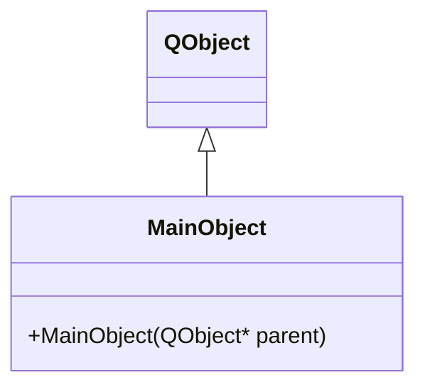
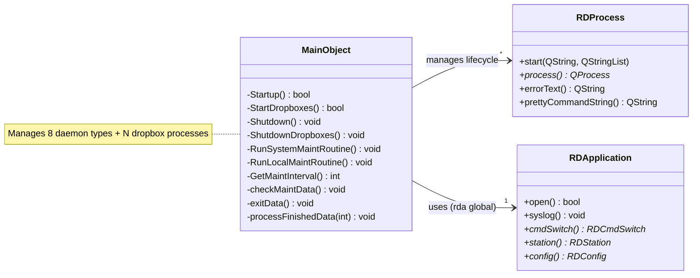

# Inventory: rdservice (Service Manager daemon)

## Statystyki

| Typ | Liczba |
|-----|--------|
| Klasy lacznie | 1 |
| QMainWindow subclassy | 0 |
| QDialog subclassy | 0 |
| QWidget subclassy | 0 |
| QObject subclassy (serwisy) | 1 |
| QAbstractItemModel subclassy | 0 |
| QThread subclassy | 0 |
| Plain C++ (non-Qt) klasy | 0 |
| Active Record (CRUD) klasy | 0 |

---

## Diagram klas — dziedziczenie

## Diagram klas — zaleznosci domenowe

---

## Klasy — szczegolowy inwentarz

### MainObject

**Typ Qt:** QObject (Service — headless daemon)
**Plik:** `rdservice/rdservice.h` + `rdservice/rdservice.cpp`, `startup.cpp`, `shutdown.cpp`, `maint_routines.cpp`
**Odpowiedzialnosc:** Manages the full lifecycle of all Rivendell backend daemons (caed, ripcd, rdcatchd, rdpadd, rdpadengined, rdvairplayd, rdrepld, rdrssd) and dropbox import processes. Handles ordered startup, graceful/forced shutdown, signal-based reload, crash logging, and periodic maintenance scheduling.
**Tabela DB:** Reads from VERSION, REPLICATORS, SYSTEM, DROPBOXES, DROPBOX_SCHED_CODES (no writes)

**Sygnaly:**
Brak wlasnych sygnalow.

**Sloty:**
| Slot | Parametry | Widocznosc | Efekt |
|------|-----------|------------|-------|
| processFinishedData | int id | private | Logs exit status of ephemeral maintenance process, cleans up RDProcess from map |
| checkMaintData | - | private | Schedules next maint run (random jitter), runs local maint unconditionally, runs system maint if station is eligible and interval exceeded |
| exitData | - | private | Polls every 100ms: on SIGTERM/SIGINT exits gracefully, on SIGUSR1 reloads dropboxes |

**Stan (Q_PROPERTY):**
Brak.

**Publiczne API:**
| Metoda | Parametry | Efekt | Warunki wywolania |
|--------|-----------|-------|------------------|
| MainObject() | QObject *parent | Initializes daemon: opens DB, checks singleton, parses CLI, starts all services, configures maintenance timer | Must be sole instance |

**Enums:**
| Enum | Wartosci | Znaczenie |
|------|----------|-----------|
| StartupTarget | TargetCaed=0, TargetRipcd=1, TargetRdcatchd=2, TargetRdpadd=3, TargetRdpadengined=4, TargetRdvairplayd=5, TargetRdrepld=6, TargetRdrssd=7, TargetAll=8 | Controls partial startup — daemon stops after launching the specified target. TargetAll = full startup of all services. |

**Managed Processes (constant IDs):**
| ID | Constant | Daemon | Warunki uruchomienia |
|----|----------|--------|---------------------|
| 0 | RDSERVICE_CAED_ID | caed (Core Audio Engine) | Always |
| 1 | RDSERVICE_RIPCD_ID | ripcd (RPC/IPC daemon) | Always |
| 2 | RDSERVICE_RDCATCHD_ID | rdcatchd (Catch daemon) | Always |
| 3 | RDSERVICE_RDPADD_ID | rdpadd (PAD daemon) | Always |
| 4 | RDSERVICE_RDPADENGINED_ID | rdpadengined (PAD engine) | Always (after 1s delay) |
| 5 | RDSERVICE_RDVAIRPLAYD_ID | rdvairplayd (Virtual Airplay) | Always |
| 6 | RDSERVICE_RDREPLD_ID | rdrepld (Replication daemon) | Only if REPLICATORS table has entries for this station |
| 7 | RDSERVICE_RDRSSD_ID | rdrssd (RSS daemon) | Only if this station is RSS_PROCESSOR_STATION in SYSTEM table |
| 8 | RDSERVICE_LOCALMAINT_ID | rdmaint (local) | Ephemeral — per maintenance tick |
| 9 | RDSERVICE_SYSTEMMAINT_ID | rdmaint --system | Ephemeral — when system maint is due |
| 100+ | RDSERVICE_FIRST_DROPBOX_ID+ | rdimport (dropbox instances) | Per DROPBOXES config for this station |

**Reguly biznesowe (z implementacji):**
- Before starting services, all stale instances of each daemon are killed (SIGKILL via KillProgram)
- Services started in strict order: caed → ripcd → rdcatchd → rdpadd → (1s delay) → rdpadengined → rdvairplayd → rdrepld (conditional) → rdrssd (conditional) → dropboxes
- rdrepld started ONLY if REPLICATORS table has entries for current station
- rdrssd started ONLY if current station matches RSS_PROCESSOR_STATION in SYSTEM table
- Dropboxes launched as rdimport processes with CLI args built from DROPBOXES table configuration
- Shutdown uses reverse order (LIFO): SIGTERM first, wait, then SIGKILL if unresponsive
- Dropboxes always killed with SIGKILL (no graceful shutdown)
- Maintenance interval uses random jitter: uniform random in [RD_MAINT_MIN_INTERVAL, RD_MAINT_MAX_INTERVAL]
- System maintenance runs only if station has systemMaint() enabled AND RD_MAINT_MAX_INTERVAL elapsed since LAST_MAINT_DATETIME (uses table lock)
- Local maintenance runs unconditionally at every maintenance tick
- Maintenance delegated to external rdmaint process (--system flag for system-wide)
- Singleton enforcement: exits with ExitPriorInstance if another rdservice is running
- SIGUSR1 triggers dropbox hot-reload (shutdown + restart dropboxes only)
- CLI flags: --end-startup-after-{daemon}, --force-system-maintenance, --initial-maintenance-interval

**Linux-specific:**
| Komponent | Uzycie | Priorytet zastapienia |
|-----------|--------|----------------------|
| Unix signals (SIGTERM, SIGINT, SIGUSR1, SIGKILL) | Process lifecycle control | HIGH |
| kill() syscall | Killing stale processes | HIGH |
| syslog | System logging | MEDIUM |
| PID file (/var/run) | Singleton and process management | MEDIUM |
| /proc (via RDGetPids) | Process enumeration | HIGH |
| sleep(1) | Band-aid delay between rdpadd and rdpadengined | MEDIUM |

**Zaleznosci od innych klas tego artifaktu:**
Brak — MainObject is the sole class.

**Zaleznosci od shared libraries (librd):**
- RDApplication — app init, DB access, syslog, CLI parsing
- RDProcess — QProcess wrapper for managed child processes
- RDSqlQuery — SQL query wrapper
- RDStation — station configuration (systemMaint(), name())
- RDConfig — global config (stationName(), disableMaintChecks())
- RDGetPids() — process enumeration from /proc
- RDWritePid() / RDDeletePid() — PID file management
- RDEscapeString() — SQL escaping
- RDGetTimeLength() — time formatting
- RDBool() — Y/N to bool conversion
- RDCmdSwitch — CLI argument parsing

---

## Missing Coverage

| Klasa | Plik | Powod braku |
|-------|------|-------------|

Brak — jedyna klasa (MainObject) jest w pelni pokryta.

---

## Conflicts

| ID | Klasa | Opis konfliktu | Status |
|----|-------|----------------|--------|
