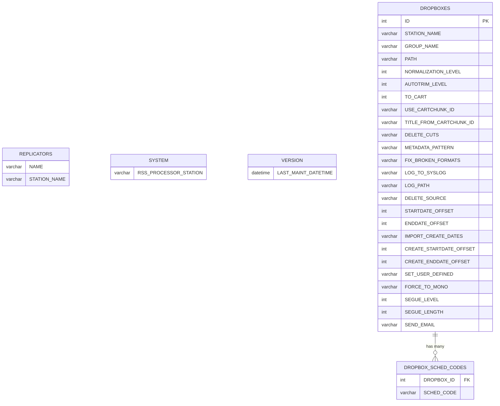
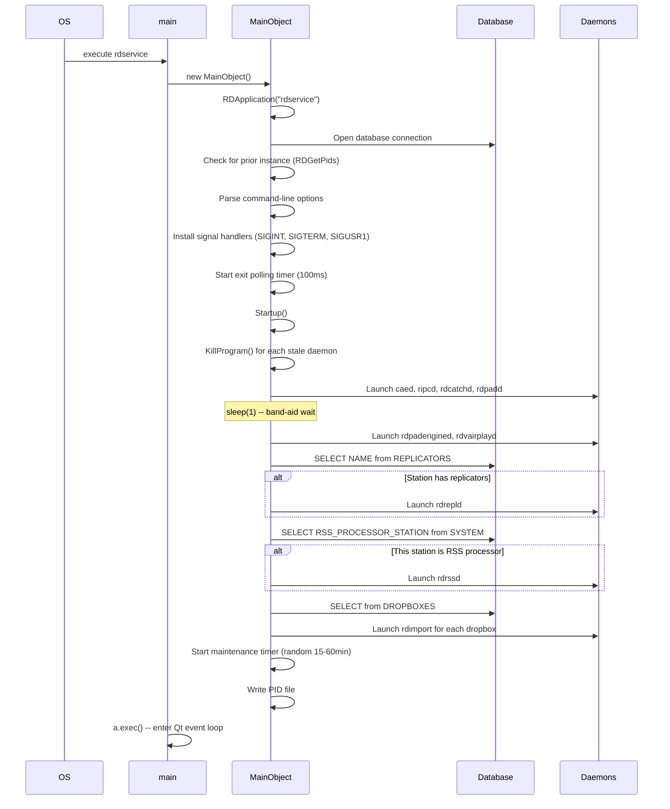
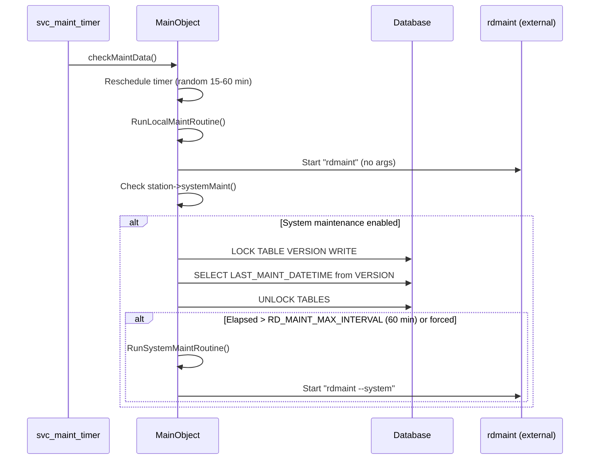
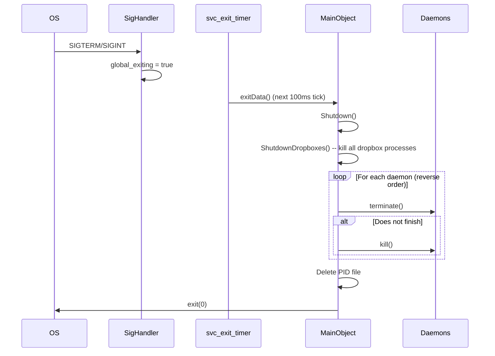
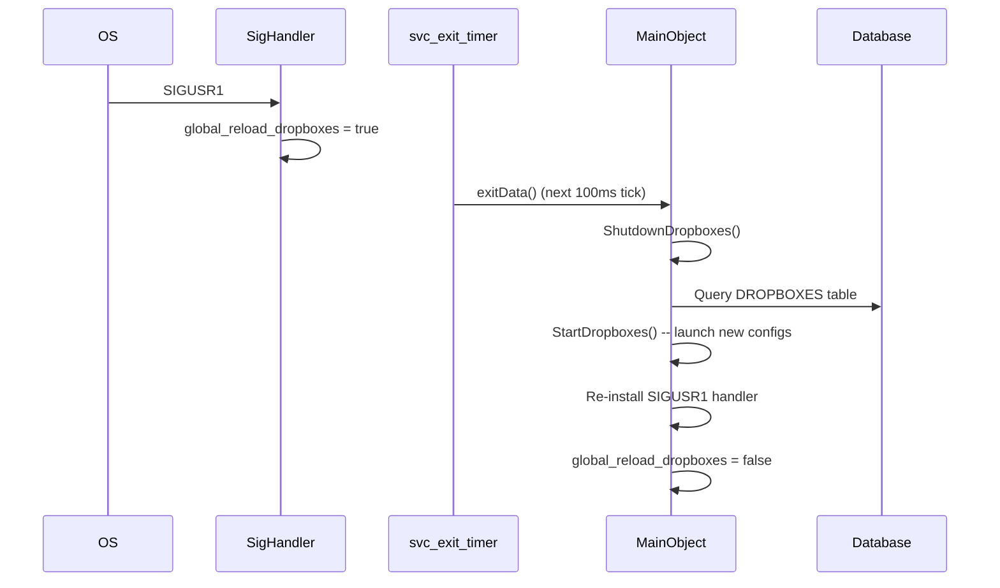
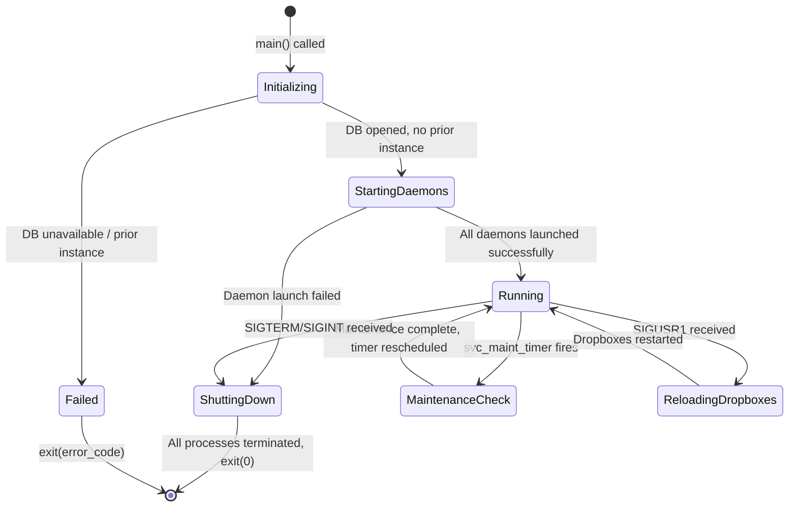

# Semantic Context: SVC (rdservice)

## Files & Symbols

### Source Files
| File | Type | Symbols | LOC (est) |
|------|------|---------|-----------|
| rdservice.h | header | MainObject (class), StartupTarget (enum), 12 #defines | ~57 |
| rdservice.cpp | source | MainObject::MainObject, processFinishedData, exitData, SigHandler, main, global_exiting, global_reload_dropboxes | ~155 |
| startup.cpp | source | MainObject::Startup, StartDropboxes, KillProgram, TargetCommandString | ~360 |
| shutdown.cpp | source | MainObject::Shutdown, ShutdownDropboxes | ~32 |
| maint_routines.cpp | source | MainObject::checkMaintData, RunSystemMaintRoutine, RunLocalMaintRoutine, GetMaintInterval, RunEphemeralProcess | ~103 |

### Symbol Index
| Symbol | Kind | File | Qt Class? |
|--------|------|------|-----------|
| MainObject | Class | rdservice.h | Yes (Q_OBJECT) |
| MainObject::StartupTarget | Enum | rdservice.h | -- |
| SigHandler | Function | rdservice.cpp | No |
| main | Function | rdservice.cpp | No |
| global_exiting | Variable | rdservice.cpp | No |
| global_reload_dropboxes | Variable | rdservice.cpp | No |

### Constants (#define)
| Constant | Value | Description |
|----------|-------|-------------|
| RDSERVICE_CAED_ID | 0 | Process ID slot for caed daemon |
| RDSERVICE_RIPCD_ID | 1 | Process ID slot for ripcd daemon |
| RDSERVICE_RDCATCHD_ID | 2 | Process ID slot for rdcatchd daemon |
| RDSERVICE_RDPADD_ID | 3 | Process ID slot for rdpadd daemon |
| RDSERVICE_RDPADENGINED_ID | 4 | Process ID slot for rdpadengined daemon |
| RDSERVICE_RDVAIRPLAYD_ID | 5 | Process ID slot for rdvairplayd daemon |
| RDSERVICE_RDREPLD_ID | 6 | Process ID slot for rdrepld daemon |
| RDSERVICE_RDRSSD_ID | 7 | Process ID slot for rdrssd daemon |
| RDSERVICE_LOCALMAINT_ID | 8 | Process ID slot for local maintenance |
| RDSERVICE_SYSTEMMAINT_ID | 9 | Process ID slot for system maintenance |
| RDSERVICE_LAST_ID | 10 | Sentinel: count of core process slots |
| RDSERVICE_FIRST_DROPBOX_ID | 100 | First ID for dropbox (rdimport) processes |

### External Constants (from LIB)
| Constant | Value | Source | Description |
|----------|-------|--------|-------------|
| RD_MAINT_MIN_INTERVAL | 900000 | lib/rd.h | Min maintenance interval (15 min in ms) |
| RD_MAINT_MAX_INTERVAL | 3600000 | lib/rd.h | Max maintenance interval (60 min in ms) |

## Class API Surface

### MainObject [Service Manager]
- **File:** rdservice.h
- **Inherits:** QObject
- **Qt Object:** Yes (Q_OBJECT)
- **Category:** Service -- process supervisor and maintenance scheduler daemon

#### Enum: StartupTarget
| Value | Int | Description |
|-------|-----|-------------|
| TargetCaed | 0 | Stop startup after launching caed |
| TargetRipcd | 1 | Stop startup after launching ripcd |
| TargetRdcatchd | 2 | Stop startup after launching rdcatchd |
| TargetRdpadd | 3 | Stop startup after launching rdpadd |
| TargetRdpadengined | 4 | Stop startup after launching rdpadengined |
| TargetRdvairplayd | 5 | Stop startup after launching rdvairplayd |
| TargetRdrepld | 6 | Stop startup after launching rdrepld |
| TargetRdrssd | 7 | Stop startup after launching rdrssd |
| TargetAll | 8 | Full startup (default) |

#### Signals
None defined.

#### Slots (private)
| Slot | Parameters | Description |
|------|-----------|-------------|
| processFinishedData | (int id) | Handles cleanup when an ephemeral process finishes; logs crash/exit status and removes from process map |
| checkMaintData | () | Timer-driven: reschedules next maintenance run, runs local maintenance, conditionally runs system maintenance |
| exitData | () | Polled at 100ms: checks global_exiting flag to shutdown, checks global_reload_dropboxes to reload dropbox configs |

#### Private Methods
| Method | Return | Parameters | Brief |
|--------|--------|-----------|-------|
| Startup | bool | (QString *err_msg) | Sequential launch of all Rivendell daemons (caed, ripcd, rdcatchd, rdpadd, rdpadengined, rdvairplayd, rdrepld, rdrssd) plus dropboxes |
| StartDropboxes | bool | (QString *err_msg) | Query DROPBOXES table, launch rdimport for each configured dropbox on this station |
| KillProgram | void | (const QString &program) | Kill stale instances of named program using SIGKILL, loop until all PIDs gone |
| Shutdown | void | () | Shutdown dropboxes first, then terminate all daemon processes in reverse order |
| ShutdownDropboxes | void | () | Kill and remove all processes with ID >= RDSERVICE_FIRST_DROPBOX_ID |
| RunSystemMaintRoutine | void | () | Run `rdmaint --system` as ephemeral process |
| RunLocalMaintRoutine | void | () | Run `rdmaint` (no args) as ephemeral process |
| GetMaintInterval | int (const) | () | Return random interval between RD_MAINT_MIN_INTERVAL (15min) and RD_MAINT_MAX_INTERVAL (60min) |
| RunEphemeralProcess | void | (int id, const QString &program, const QStringList &args) | Start a process, connect finished signal, handle startup failure |
| TargetCommandString | QString (const) | (StartupTarget target) | Map enum to CLI flag string (e.g., "--end-startup-after-caed") |

#### Fields
| Field | Type | Description |
|-------|------|-------------|
| svc_processes | QMap<int, RDProcess*> | Map of process ID slots to managed process objects |
| svc_maint_timer | QTimer* | Single-shot timer for scheduling maintenance checks |
| svc_exit_timer | QTimer* | Periodic (100ms) timer for polling exit/reload signals |
| svc_startup_target | StartupTarget | Which daemon to stop after (default: TargetAll) |
| svc_force_system_maintenance | bool | Force system maintenance on first run |

### Standalone Functions
| Function | Return | Parameters | File | Brief |
|----------|--------|-----------|------|-------|
| SigHandler | void | (int signo) | rdservice.cpp | Unix signal handler: SIGINT/SIGTERM set global_exiting, SIGUSR1 sets global_reload_dropboxes |
| main | int | (int argc, char *argv[]) | rdservice.cpp | Create QCoreApplication, instantiate MainObject, run event loop |

### Global Variables
| Variable | Type | Description |
|----------|------|-------------|
| global_exiting | bool | Flag set by SIGINT/SIGTERM to trigger graceful shutdown |
| global_reload_dropboxes | bool | Flag set by SIGUSR1 to trigger dropbox reload |

## Data Model

SVC does not define its own tables. All tables are defined in the LIB artifact (library).
SVC performs read-only queries against the following tables:

### Table Usage (all SELECT only)

| Table | Operation | File:Method | SQL | Purpose |
|-------|-----------|-------------|-----|---------|
| REPLICATORS | SELECT | startup.cpp:Startup | `select NAME from REPLICATORS where STATION_NAME="{station}"` | Check if this station has replicator configs; if yes, start rdrepld |
| SYSTEM | SELECT | startup.cpp:Startup | `select RSS_PROCESSOR_STATION from SYSTEM` | Check if this station is the RSS processor; if yes, start rdrssd |
| VERSION | SELECT | maint_routines.cpp:checkMaintData | `select LAST_MAINT_DATETIME from VERSION` | Get timestamp of last system maintenance run |
| VERSION | LOCK/UNLOCK | maint_routines.cpp:checkMaintData | `lock tables VERSION write` / `unlock tables` | Exclusive lock for maintenance timestamp check |
| DROPBOXES | SELECT | startup.cpp:StartDropboxes | `select ID, GROUP_NAME, PATH, ... from DROPBOXES where STATION_NAME="{station}"` | Get all dropbox configurations for this station |
| DROPBOX_SCHED_CODES | SELECT | startup.cpp:StartDropboxes | `select SCHED_CODE from DROPBOX_SCHED_CODES where DROPBOX_ID={id}` | Get scheduler codes for a specific dropbox |

### DROPBOXES Columns Used
| Column | Index | Usage |
|--------|-------|-------|
| ID | 00, 16 | Dropbox identifier, passed as --persistent-dropbox-id |
| GROUP_NAME | 01 | Passed as positional argument to rdimport |
| PATH | 02 | Passed as positional argument to rdimport (watch directory) |
| NORMALIZATION_LEVEL | 03 | --normalization-level (divided by 100) |
| AUTOTRIM_LEVEL | 04 | --autotrim-level (divided by 100) |
| TO_CART | 05 | --to-cart (if > 0) |
| USE_CARTCHUNK_ID | 06 | --use-cartchunk-cutid (if "Y") |
| TITLE_FROM_CARTCHUNK_ID | 07 | --title-from-cartchunk-cutid (if "Y") |
| DELETE_CUTS | 08 | --delete-cuts (if "Y") |
| METADATA_PATTERN | 09 | --metadata-pattern (if not empty) |
| FIX_BROKEN_FORMATS | 10 | --fix-broken-formats (if "Y") |
| LOG_TO_SYSLOG | 11 | --log-syslog (if true) |
| LOG_PATH | 12 | --log-filename (if not empty and not syslog) |
| DELETE_SOURCE | 13 | --delete-source (if "Y") |
| STARTDATE_OFFSET | 14 | --startdate-offset (always) |
| ENDDATE_OFFSET | 15 | --enddate-offset (always) |
| IMPORT_CREATE_DATES | 17 | Enables --create-startdate-offset and --create-enddate-offset |
| CREATE_STARTDATE_OFFSET | 18 | --create-startdate-offset (if IMPORT_CREATE_DATES="Y") |
| CREATE_ENDDATE_OFFSET | 19 | --create-enddate-offset (if IMPORT_CREATE_DATES="Y") |
| SET_USER_DEFINED | 20 | --set-user-defined (if not empty) |
| FORCE_TO_MONO | 21 | --to-mono (if "Y") |
| SEGUE_LEVEL | 22 | --segue-level (if < 1, divided by 100) |
| SEGUE_LENGTH | 23 | --segue-length (if SEGUE_LEVEL < 1) |
| SEND_EMAIL | 24 | --send-mail and --mail-per-file (if "Y") |

### ERD (tables accessed by SVC)


## Reactive Architecture

### Signal/Slot Connections
| # | Sender | Signal | Receiver | Slot | File:Line |
|---|--------|--------|----------|------|-----------|
| 1 | svc_exit_timer (QTimer) | timeout() | this (MainObject) | exitData() | rdservice.cpp:123 |
| 2 | svc_maint_timer (QTimer) | timeout() | this (MainObject) | checkMaintData() | rdservice.cpp:139 |
| 3 | svc_processes[id] (RDProcess) | finished(int) | this (MainObject) | processFinishedData(int) | maint_routines.cpp:122 |

### Unix Signal Handling (non-Qt)
| Signal | Handler | Effect |
|--------|---------|--------|
| SIGINT | SigHandler | Sets global_exiting = true |
| SIGTERM | SigHandler | Sets global_exiting = true |
| SIGUSR1 | SigHandler | Sets global_reload_dropboxes = true |

Note: Unix signals are bridged to the Qt event loop via the svc_exit_timer polling at 100ms.
The exitData() slot checks the global flags each tick and performs the appropriate action.

### Key Sequence Diagrams

#### Startup Sequence


#### Maintenance Cycle


#### Graceful Shutdown


#### Dropbox Reload (SIGUSR1)


### Cross-Artifact Dependencies
| External Class | From Artifact | Used In | Purpose |
|---------------|---------------|---------|---------|
| RDApplication | LIB | rdservice.cpp | Application framework, DB connection, config, syslog, cmdSwitch |
| RDProcess | LIB | rdservice.h, rdservice.cpp, startup.cpp, maint_routines.cpp | Wrapper around QProcess with ID tracking |
| RDSqlQuery | LIB | startup.cpp, maint_routines.cpp | Database query execution |
| RDConfig | LIB | rdservice.cpp (via rda->config()) | Station config, disableMaintChecks(), stationName() |
| RDStation | LIB | maint_routines.cpp (via rda->station()) | Station properties, systemMaint() flag |
| RDGetPids | LIB | rdservice.cpp, startup.cpp | Get PIDs of running processes by name |
| RDWritePid / RDDeletePid | LIB | rdservice.cpp | PID file management |
| RDGetTimeLength | LIB | rdservice.cpp, maint_routines.cpp | Format milliseconds as human-readable time |
| RDEscapeString | LIB | startup.cpp | SQL string escaping |
| RDBool | LIB | startup.cpp | Parse "Y"/"N" string to bool |

### External Programs Launched
| Program | Path | Launcher | Persistent? | Purpose |
|---------|------|----------|-------------|---------|
| caed | RD_PREFIX/sbin/caed | Startup() | Yes | Audio engine daemon |
| ripcd | RD_PREFIX/sbin/ripcd | Startup() | Yes | RPC/IPC daemon |
| rdcatchd | RD_PREFIX/sbin/rdcatchd | Startup() | Yes | Catch (recording scheduler) daemon |
| rdpadd | RD_PREFIX/sbin/rdpadd | Startup() | Yes | PAD data daemon |
| rdpadengined | RD_PREFIX/sbin/rdpadengined | Startup() | Yes | PAD engine daemon |
| rdvairplayd | RD_PREFIX/sbin/rdvairplayd | Startup() | Yes | Virtual airplay daemon |
| rdrepld | RD_PREFIX/sbin/rdrepld | Startup() | Yes (conditional) | Replication daemon (only if REPLICATORS exist) |
| rdrssd | RD_PREFIX/sbin/rdrssd | Startup() | Yes (conditional) | RSS daemon (only if this is RSS_PROCESSOR_STATION) |
| rdimport | RD_PREFIX/bin/rdimport | StartDropboxes() | Yes (per dropbox) | Import daemon in --drop-box mode |
| rdmaint | RD_PREFIX/bin/rdmaint | RunLocalMaintRoutine() | No (ephemeral) | Local maintenance routines |
| rdmaint --system | RD_PREFIX/bin/rdmaint | RunSystemMaintRoutine() | No (ephemeral) | System-wide maintenance routines |

## Business Rules

### Rule: Prior Instance Guard
- **Source:** rdservice.cpp:79
- **Trigger:** Application startup
- **Condition:** `RDGetPids("rdservice").size() > 1`
- **Action:** Log error "prior instance found", exit with ExitPriorInstance
- **Gherkin:**
  ```gherkin
  Scenario: Prevent duplicate rdservice instances
    Given rdservice is already running
    When a new rdservice instance is started
    Then it logs "prior instance found"
    And exits with ExitPriorInstance code
  ```

### Rule: Database Connection Required
- **Source:** rdservice.cpp:70-74
- **Trigger:** Application startup
- **Condition:** `!rda->open(&err_msg, &err_type, false)` returns false
- **Action:** Log "unable to open database", exit with ExitNoDb
- **Gherkin:**
  ```gherkin
  Scenario: Database unavailable at startup
    Given the database is not reachable
    When rdservice starts
    Then it logs "unable to open database"
    And exits with ExitNoDb code
  ```

### Rule: Sequential Daemon Startup with Target
- **Source:** startup.cpp:33-213
- **Trigger:** MainObject constructor calls Startup()
- **Condition:** svc_startup_target determines how far to go
- **Action:** Daemons are started in strict order: caed -> ripcd -> rdcatchd -> rdpadd -> (1s sleep) -> rdpadengined -> rdvairplayd -> rdrepld (conditional) -> rdrssd (conditional) -> dropboxes. If svc_startup_target matches current daemon, stop early.
- **Gherkin:**
  ```gherkin
  Scenario: Full startup sequence
    Given no startup target override is specified
    When rdservice starts
    Then it kills all stale daemon processes
    And launches caed, ripcd, rdcatchd, rdpadd in order
    And waits 1 second (band-aid for socket readiness)
    And launches rdpadengined, rdvairplayd
    And conditionally launches rdrepld and rdrssd
    And starts all configured dropboxes

  Scenario: Partial startup (target specified)
    Given --end-startup-after-ripcd is specified
    When rdservice starts
    Then it launches caed and ripcd
    And stops without launching remaining daemons
  ```

### Rule: Conditional rdrepld Launch
- **Source:** startup.cpp:163-178
- **Trigger:** During Startup(), after rdvairplayd is launched
- **Condition:** `SELECT NAME from REPLICATORS where STATION_NAME="{station}"` returns at least one row
- **Action:** Launch rdrepld
- **Gherkin:**
  ```gherkin
  Scenario: Station has replicator configuration
    Given the REPLICATORS table has entries for this station
    When startup reaches the rdrepld phase
    Then rdrepld is launched

  Scenario: Station has no replicator configuration
    Given the REPLICATORS table has no entries for this station
    When startup reaches the rdrepld phase
    Then rdrepld is not launched
  ```

### Rule: Conditional rdrssd Launch
- **Source:** startup.cpp:186-207
- **Trigger:** During Startup(), after rdrepld phase
- **Condition:** `SELECT RSS_PROCESSOR_STATION from SYSTEM` matches this station name (case-insensitive)
- **Action:** Launch rdrssd
- **Gherkin:**
  ```gherkin
  Scenario: This station is the RSS processor
    Given SYSTEM.RSS_PROCESSOR_STATION matches this station name
    When startup reaches the rdrssd phase
    Then rdrssd is launched

  Scenario: This station is not the RSS processor
    Given SYSTEM.RSS_PROCESSOR_STATION does not match this station
    When startup reaches the rdrssd phase
    Then rdrssd is not launched
  ```

### Rule: Maintenance Scheduling (Random Interval)
- **Source:** maint_routines.cpp:107-112, rdservice.cpp:133-155
- **Trigger:** Constructor and each maintenance completion
- **Condition:** `!rda->config()->disableMaintChecks()`
- **Action:** Schedule next maintenance run at random interval between 15 and 60 minutes. Uses `RD_MAINT_MIN_INTERVAL + random_fraction * (RD_MAINT_MAX_INTERVAL - RD_MAINT_MIN_INTERVAL)`.
- **Gherkin:**
  ```gherkin
  Scenario: Maintenance checks enabled
    Given maintenance checks are not disabled in config
    When rdservice starts or maintenance completes
    Then next maintenance is scheduled at random 15-60 minute interval

  Scenario: Maintenance checks disabled
    Given maintenance checks are disabled via config
    When rdservice starts
    Then no maintenance timer is started
    And "maintenance checks disabled on this host" is logged
  ```

### Rule: System Maintenance Threshold
- **Source:** maint_routines.cpp:56-82
- **Trigger:** checkMaintData() timer fires
- **Condition:** Station has systemMaint() enabled AND (time since LAST_MAINT_DATETIME > RD_MAINT_MAX_INTERVAL OR svc_force_system_maintenance)
- **Action:** Run system-wide maintenance via `rdmaint --system`. Uses table locking on VERSION for concurrency control.
- **Gherkin:**
  ```gherkin
  Scenario: System maintenance overdue
    Given systemMaint is enabled for this station
    And more than 60 minutes have passed since last system maintenance
    When maintenance check runs
    Then "rdmaint --system" is executed

  Scenario: System maintenance forced via CLI
    Given --force-system-maintenance was specified at startup
    When the first maintenance check runs
    Then "rdmaint --system" is executed regardless of time threshold
    And the force flag is cleared for subsequent runs
  ```

### Rule: Graceful Shutdown Order
- **Source:** shutdown.cpp:22-53
- **Trigger:** SIGTERM/SIGINT received, exitData() detects global_exiting
- **Condition:** Always on shutdown
- **Action:** First shutdown dropboxes (SIGKILL), then terminate daemons in reverse order (SIGTERM, then SIGKILL if unresponsive)
- **Gherkin:**
  ```gherkin
  Scenario: Graceful shutdown
    Given rdservice receives SIGTERM or SIGINT
    When the exit timer fires (within 100ms)
    Then all dropbox processes are killed immediately
    And daemon processes are terminated in reverse startup order
    And unresponsive daemons are force-killed
    And PID file is deleted
    And rdservice exits with ExitOk
  ```

### Rule: Dropbox Reload via SIGUSR1
- **Source:** rdservice.cpp:192-199
- **Trigger:** SIGUSR1 signal received
- **Condition:** global_reload_dropboxes flag set
- **Action:** Shutdown existing dropboxes, re-query DROPBOXES table, start new dropbox configs, re-install SIGUSR1 handler
- **Gherkin:**
  ```gherkin
  Scenario: Dropbox configuration changed
    Given rdservice is running with active dropboxes
    When SIGUSR1 is sent to rdservice
    Then all existing dropbox processes are stopped
    And the DROPBOXES table is re-queried
    And new dropbox processes are launched per current config
  ```

### Rule: Ephemeral Process Error Handling
- **Source:** maint_routines.cpp:115-132, rdservice.cpp:161-181
- **Trigger:** Ephemeral process fails to start or finishes
- **Condition on start failure:** `!waitForStarted()` returns true
- **Action on start failure:** Log warning, delete process, remove from map
- **Condition on finish:** Process exited
- **Action on finish:** Log crash/non-zero exit/normal exit appropriately, remove from map
- **Gherkin:**
  ```gherkin
  Scenario: Ephemeral process fails to start
    Given rdmaint binary is not found or not executable
    When RunEphemeralProcess is called
    Then a warning is logged with the error text
    And the process is removed from the process map

  Scenario: Ephemeral process crashes
    Given rdmaint is running
    When the process crashes (non-normal exit)
    Then a warning is logged with "crashed!"
    And the process is cleaned up from the map

  Scenario: Ephemeral process exits with error code
    Given rdmaint is running
    When the process exits with non-zero exit code
    Then a warning is logged with the exit code
  ```

### Rule: Stale Process Cleanup at Startup
- **Source:** startup.cpp:41-48
- **Trigger:** Beginning of Startup()
- **Condition:** Always, before launching new daemons
- **Action:** KillProgram() sends SIGKILL to each daemon name, loops with 1s sleep until no PIDs remain
- **Gherkin:**
  ```gherkin
  Scenario: Stale daemons from previous run
    Given caed is still running from a crashed rdservice
    When rdservice starts
    Then it sends SIGKILL to all stale caed processes
    And waits until they are confirmed dead
    And then proceeds with fresh daemon launch
  ```

### State Machine: Service Lifecycle


### Command-Line Options
| Option | Effect |
|--------|--------|
| --end-startup-after-caed | Stop startup after launching caed |
| --end-startup-after-ripcd | Stop startup after launching ripcd |
| --end-startup-after-rdcatchd | Stop startup after launching rdcatchd |
| --end-startup-after-rdpadd | Stop startup after launching rdpadd |
| --end-startup-after-rdpadengined | Stop startup after launching rdpadengined |
| --end-startup-after-rdvairplayd | Stop startup after launching rdvairplayd |
| --end-startup-after-rdrepld | Stop startup after launching rdrepld |
| --end-startup-after-rdrssd | Stop startup after launching rdrssd |
| --force-system-maintenance | Force system maintenance on first check |
| --initial-maintenance-interval=N | Override initial maintenance delay (ms) |

### Configuration Keys
| Source | Key/Method | Type | Description |
|--------|-----------|------|-------------|
| RDConfig | disableMaintChecks() | bool | Disable all maintenance timer checks on this host |
| RDConfig | stationName() | QString | This station's name for DB queries |
| RDStation | systemMaint() | bool | Whether this station should run system-wide maintenance |
| RDStation | name() | QString | Station name for replicator/RSS checks |

### Error Patterns
| Error | Severity | Condition | Message |
|-------|----------|-----------|---------|
| No database | LOG_ERR (exit) | DB open fails | "unable to open database [details]" |
| Prior instance | LOG_ERR (exit) | PID count > 1 | "prior instance found" |
| Daemon start fail | LOG_ERR (exit) | waitForStarted fails | "unable to start {daemon}: {error}" |
| Dropbox start fail | LOG_ERR (exit) | waitForStarted fails | "unable to start dropbox: {error}" |
| Ephemeral start fail | LOG_WARNING | waitForStarted fails | "unable to start ephemeral process" |
| Process crash | LOG_WARNING | Non-normal exit | "process {cmd} crashed!" |
| Process error exit | LOG_WARNING | Exit code != 0 | "process {cmd} exited with exit code {N}" |
| PID file write fail | LOG_WARNING | RDWritePid fails | "unable to write pid file" |
| Unknown CLI option | stderr (exit) | Unrecognized switch | "unknown command-line option" |
| Invalid interval | stderr (exit) | Non-integer value | "invalid --initial-maintenance-interval value" |

## UI Contracts

Not applicable. SVC (rdservice) is a headless daemon using QCoreApplication. No GUI components.
