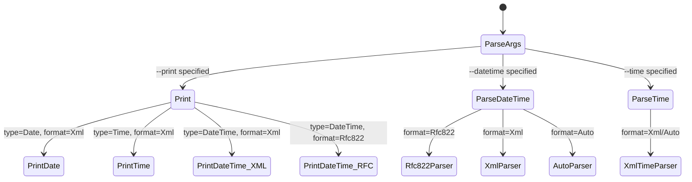
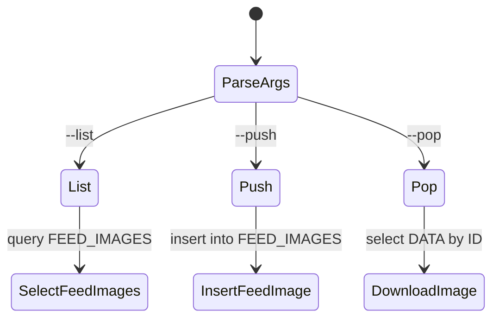
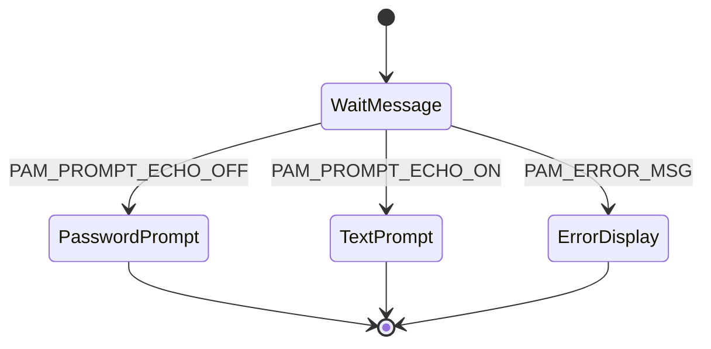

# Semantic Context: TST (tests)

## Section A: Files & Symbols

### Overview

The `tests/` artifact contains **28 standalone test programs** (each as a .h/.cpp pair), plus a `Makefile.am` and 2 text data files. There is **no test framework** (no Google Test, no Qt Test, no CTest) -- each test is an independent CLI executable with its own `main()` function and a `MainObject` class that extends `QObject`. The test logic runs in the `MainObject` constructor and exits via `exit()`.

### Source Files

| File | Type | Symbols | Purpose |
|------|------|---------|---------|
| audio_convert_test.h/.cpp | test | MainObject | Tests RDAudioConvert (format conversion between PCM, MPEG, FLAC, OGG) |
| audio_export_test.h/.cpp | test | MainObject | Tests RDAudioExport (export audio from cart/cut to file) |
| audio_import_test.h/.cpp | test | MainObject | Tests RDAudioImport (import audio file into cart/cut) |
| audio_metadata_test.h/.cpp | test | MainObject | Tests RDWaveFile metadata reading |
| audio_peaks_test.h/.cpp | test | MainObject | Tests RDWaveFile energy/peaks data reading |
| cmdline_parser_test.h/.cpp | test | MainObject | Tests RDCmdSwitch command-line parser |
| dateparse_test.h/.cpp | test | MainObject (Enums: Format, PrintType) | Tests RDParseRfc822DateTime, RDParseXmlDateTime, RDWriteXml*, RDWriteRfc822DateTime |
| datedecode_test.h/.cpp | test | MainObject | Tests RDDateDecode and RDDateTimeDecode |
| db_charset_test.h/.cpp | test | MainObject | Tests database character set and collation settings |
| delete_test.h/.cpp | test | MainObject | Tests RDDelete (remote file deletion via URL) |
| download_test.h/.cpp | test | MainObject | Tests RDDownload (file download from URL) |
| feed_image_test.h/.cpp | test | MainObject (Enum: Command, Methods: RunList, RunPush, RunPop) | Tests RDFeed image management (list, push, pop) |
| getpids_test.h/.cpp | test | MainObject | Tests RDGetPids utility function |
| log_unlink_test.h/.cpp | test | MainObject | Tests log unlinking with RDSvc (traffic/music import source) |
| mcast_recv_test.h/.cpp | test | MainObject | Tests RDMulticaster multicast receive |
| metadata_wildcard_test.h/.cpp | test | MainObject | Tests RDLogLine::resolveWildcards |
| notification_test.h/.cpp | test | MainObject | Tests RDNotification via RIPC connection |
| rdwavefile_test.h/.cpp | test | MainObject | Tests RDWaveFile basic open |
| rdxml_parse_test.h/.cpp | test | MainObject | Tests RDCart::readXml XML parsing |
| readcd_test.h/.cpp | test | MainObject | Tests CD disc reading via libdiscid, RDDiscLookup ISRC validation |
| reserve_carts_test.h/.cpp | test | MainObject | Tests RDGroup::reserveCarts |
| sendmail_test.h/.cpp | test | MainObject | Tests RDSendMail email sending |
| stringcode_test.h/.cpp | test | MainObject | Tests RDXmlEscape, RDXmlUnescape, RDUrlEscape, RDUrlUnescape |
| test_hash.h/.cpp | test | MainObject | Tests RDSha1Hash file hashing |
| test_pam.h/.cpp | test | MainObject, ConversationResponseCallback | Tests PAM authentication |
| timer_test.h/.cpp | test | MainObject (Method: Time, Slot: timeoutData) | Tests QTimer accuracy |
| upload_test.h/.cpp | test | MainObject | Tests RDUpload (file upload to URL) |
| wav_chunk_test.h/.cpp | test | MainObject (Method: NextChunk) | Tests WAV/RIFF chunk parsing |
| Makefile.am | build | -- | Build configuration for all tests |
| rivendell_standard.txt | data | -- | Test data file (Rivendell standard reference) |
| visualtraffic.txt | data | -- | Test data file (Visual Traffic import format) |

### Symbol Index

| Symbol | Kind | File | Qt Class? |
|--------|------|------|-----------|
| MainObject | Class | all test .h files | Yes (QObject, some with Q_OBJECT) |
| MainObject::MainObject | Constructor | all test .cpp files | -- |
| MainObject::NextChunk | Method | wav_chunk_test.h | No |
| MainObject::RunList | Method | feed_image_test.h | No |
| MainObject::RunPush | Method | feed_image_test.h | No |
| MainObject::RunPop | Method | feed_image_test.h | No |
| MainObject::Time | Method | timer_test.h | No |
| MainObject::timeoutData | Slot | timer_test.cpp | Yes |
| MainObject::notificationReceivedData | Slot | notification_test.cpp | Yes |
| MainObject::userData | Slot | log_unlink_test.cpp | Yes |
| MainObject::receivedData | Slot | mcast_recv_test.cpp | Yes |
| MainObject::Format | Enum | dateparse_test.h | No |
| MainObject::PrintType | Enum | dateparse_test.h | No |
| MainObject::Command | Enum | feed_image_test.h | No |
| ConversationResponseCallback | Function | test_pam.cpp | No |
| main | Function | all test .cpp files | No |

### Test Pattern

All 28 tests follow the same architectural pattern:
1. A `MainObject` class inherits from `QObject`
2. `main()` creates a `QCoreApplication` and instantiates `MainObject`
3. The constructor parses command-line args via `RDCmdSwitch`
4. The constructor runs the test logic directly (no assertion framework)
5. Results are printed to stdout via `printf()`
6. Exit code indicates pass/fail (`exit(0)` = success)
7. Most tests requiring database access use `RDApplication` for initialization
8. Some older tests use `RDConfig` + `RDOpenDb` directly

## Section B: Class API Surface

### MainObject [Test Harness Pattern]

All 28 test files define the same class name `MainObject`. This is not code reuse; each test independently defines its own `MainObject` with test-specific fields and logic.

- **File:** Every test .h file
- **Inherits:** QObject
- **Qt Object:** Some declare Q_OBJECT (those with signals/slots), some do not
- **Category:** Test Harness (constructor-as-test-runner pattern)

#### Common Pattern
- Constructor receives `QObject *parent`, initializes test, runs logic, calls `exit()`
- No signals defined in any test
- Only 4 tests define slots (for async event-driven tests)

#### Slots (across all tests)
| Slot | Test File | Parameters | Purpose |
|------|-----------|-----------|---------|
| timeoutData() | timer_test.cpp | () | QTimer callback to measure timer accuracy |
| notificationReceivedData(RDNotification*) | notification_test.cpp | (RDNotification*) | Receives and prints notification events from RIPC |
| userData() | log_unlink_test.cpp | () | Triggered on RIPC user change to run log unlink test |
| receivedData(const QString&, const QHostAddress&) | mcast_recv_test.cpp | (QString, QHostAddress) | Receives multicast data |

#### Notable Methods (beyond constructor)
| Method | Test File | Purpose |
|--------|-----------|---------|
| NextChunk(QString&, uint32_t*) | wav_chunk_test.cpp | Iterate WAV/RIFF chunks |
| RunList() | feed_image_test.cpp | List feed images |
| RunPush() | feed_image_test.cpp | Push image to feed |
| RunPop() | feed_image_test.cpp | Pop/download image from feed |
| Time(const timeval&, const timeval&) | timer_test.cpp | Calculate elapsed time in ms |

#### Enums
| Enum | Test File | Values |
|------|-----------|--------|
| Format | dateparse_test.h | Unknown=0, Rfc822=1, Xml=2, Auto=3 |
| PrintType | dateparse_test.h | None=0, Date=1, Time=2, DateTime=3 |
| Command | feed_image_test.h | None=0, List=1, Push=2, Pop=3 |

### Library Classes Under Test (Coverage Map)

This section maps each test to the LIB artifact classes it exercises.

| Test | LIB Classes Tested | Category |
|------|-------------------|----------|
| audio_convert_test | RDAudioConvert, RDSettings, RDCart, RDWaveData, RDApplication | Audio Processing |
| audio_export_test | RDAudioExport, RDAudioConvert, RDSettings, RDApplication | Audio Processing |
| audio_import_test | RDAudioImport, RDAudioConvert, RDSettings, RDApplication | Audio Processing |
| audio_metadata_test | RDWaveFile, RDWaveData, RDApplication | Audio Processing |
| audio_peaks_test | RDWaveFile, RDCmdSwitch | Audio Processing |
| cmdline_parser_test | RDCmdSwitch | Utility |
| dateparse_test | RDCmdSwitch, RDParseRfc822DateTime, RDParseXmlDateTime, RDParseDateTime, RDParseXmlTime, RDWriteXmlDate, RDWriteXmlTime, RDWriteXmlDateTime, RDWriteRfc822DateTime | Date/Time Parsing |
| datedecode_test | RDCmdSwitch, RDConfig, RDStation, RDDateDecode, RDDateTimeDecode, RDOpenDb | Date/Time Formatting |
| db_charset_test | RDApplication, RDSqlQuery | Database |
| delete_test | RDDelete, RDApplication | File Transfer |
| download_test | RDDownload, RDApplication | File Transfer |
| feed_image_test | RDFeed, RDApplication | Podcast/RSS |
| getpids_test | RDGetPids, RDCmdSwitch | System Utility |
| log_unlink_test | RDCmdSwitch, RDConfig, RDStation, RDRipc, RDSvc, RDOpenDb | Log Management |
| mcast_recv_test | RDMulticaster, RDCmdSwitch | Networking |
| metadata_wildcard_test | RDLogLine::resolveWildcards, RDApplication | Log/Metadata |
| notification_test | RDApplication, RDRipc, RDNotification | IPC/Notifications |
| rdwavefile_test | RDWaveFile, RDWaveData, RDCmdSwitch | Audio Processing |
| rdxml_parse_test | RDCart::readXml, RDWaveData, RDCmdSwitch | XML Parsing |
| readcd_test | RDDiscLookup (ISRC validation), RDCmdSwitch, libdiscid | CD/Disc |
| reserve_carts_test | RDGroup::reserveCarts, RDCart, RDConfig, RDOpenDb | Cart Management |
| sendmail_test | RDSendMail, RDCmdSwitch, RDApplication | Email |
| stringcode_test | RDXmlEscape, RDXmlUnescape, RDUrlEscape, RDUrlUnescape, RDCmdSwitch | String Encoding |
| test_hash | RDSha1Hash, RDCmdSwitch | Security/Hashing |
| test_pam | RDCmdSwitch, PAM (libpam) | Authentication |
| timer_test | QTimer (Qt accuracy test) | Timing |
| upload_test | RDUpload, RDApplication | File Transfer |
| wav_chunk_test | RDCmdSwitch (direct RIFF parsing, no RD wrapper) | Audio Processing |

### Test Coverage by Domain

| Domain | Tests | Count |
|--------|-------|-------|
| Audio Processing | audio_convert, audio_export, audio_import, audio_metadata, audio_peaks, rdwavefile, wav_chunk | 7 |
| File Transfer | upload, download, delete | 3 |
| Date/Time | dateparse, datedecode | 2 |
| String/Encoding | stringcode, rdxml_parse | 2 |
| Cart/Log Management | reserve_carts, log_unlink, metadata_wildcard | 3 |
| Networking/IPC | mcast_recv, notification | 2 |
| Podcast/RSS | feed_image | 1 |
| Utility | cmdline_parser, getpids, test_hash | 3 |
| Authentication | test_pam | 1 |
| Database | db_charset | 1 |
| Email | sendmail | 1 |
| CD/Disc | readcd | 1 |
| Timing | timer | 1 |

## Section C: Data Model

### Direct SQL in Tests

The test artifact does **not define any database tables** (no CREATE TABLE). It relies entirely on the LIB artifact's database schema. Only 2 tests execute SQL directly:

#### db_charset_test
- Executes `SHOW VARIABLES LIKE '%character_set%'` and `SHOW VARIABLES LIKE '%collation%'`
- Read-only diagnostic (no CRUD on application tables)
- Purpose: Verify MySQL/MariaDB character encoding configuration

#### feed_image_test
- **SELECT** from `FEED_IMAGES` (list operation): ID, WIDTH, HEIGHT, DESCRIPTION, FILE_NAME
- **INSERT** into `FEED_IMAGES`: FEED_ID, FEED_KEY_NAME, DESCRIPTION, FILE_NAME, FILE_EXTENSION, DATA
- **SELECT** `DATA` from `FEED_IMAGES` by ID (pop/download operation)
- Operates on table `FEED_IMAGES` (defined in LIB artifact's schema)

### Database Access Pattern

| Test | DB Access Method | Tables Touched | Operations |
|------|-----------------|----------------|-----------|
| db_charset_test | RDSqlQuery (direct) | MySQL system variables | SHOW |
| feed_image_test | RDSqlQuery (direct) | FEED_IMAGES | SELECT, INSERT |
| audio_convert_test | via RDCart (indirect) | CART | SELECT |
| audio_export_test | via RDAudioExport (indirect) | CART, CUTS | SELECT |
| audio_import_test | via RDAudioImport (indirect) | CART, CUTS | SELECT, UPDATE |
| delete_test | via RDApplication (config only) | -- | -- |
| download_test | via RDApplication (config only) | -- | -- |
| upload_test | via RDApplication (config only) | -- | -- |
| datedecode_test | via RDOpenDb + RDStation | STATIONS | SELECT |
| log_unlink_test | via RDRipc + RDSvc | LOGS, SERVICES | SELECT, UPDATE |
| metadata_wildcard_test | via RDLogLine (indirect) | -- | -- |
| notification_test | via RDRipc (indirect) | -- | -- |
| reserve_carts_test | via RDGroup + RDOpenDb | GROUPS, CART | SELECT, INSERT |
| readcd_test | none | -- | -- |
| sendmail_test | none | -- | -- |
| test_hash | none | -- | -- |
| test_pam | none | -- | -- |
| timer_test | none | -- | -- |
| mcast_recv_test | none | -- | -- |
| stringcode_test | none | -- | -- |
| cmdline_parser_test | none | -- | -- |
| getpids_test | none | -- | -- |
| audio_peaks_test | none | -- | -- |
| rdwavefile_test | none | -- | -- |
| rdxml_parse_test | none | -- | -- |
| wav_chunk_test | none | -- | -- |
| dateparse_test | none | -- | -- |
| audio_metadata_test | via RDApplication (config only) | -- | -- |

## Section D: Reactive Architecture

### Signal/Slot Connections

Only 4 of 28 tests use Qt signals/slots. The remaining 24 are purely synchronous (run in constructor, exit).

| # | Sender | Signal | Receiver | Slot | File:Line |
|---|--------|--------|----------|------|-----------|
| 1 | test_timer (QTimer) | timeout() | this (MainObject) | timeoutData() | timer_test.cpp:35 |
| 2 | mcast_multicaster (RDMulticaster) | received(QString, QHostAddress) | this (MainObject) | receivedData(QString, QHostAddress) | mcast_recv_test.cpp:79 |
| 3 | test_ripc (RDRipc) | userChanged() | this (MainObject) | userData() | log_unlink_test.cpp:99 |
| 4 | rda->ripc() (RDRipc) | notificationReceived(RDNotification*) | this (MainObject) | notificationReceivedData(RDNotification*) | notification_test.cpp:52 |

### Async vs Sync Test Classification

| Category | Tests | Pattern |
|----------|-------|---------|
| Synchronous (exit in constructor) | 24 tests | Parse args, run test, print result, exit(0) |
| Async (event loop) | timer_test, mcast_recv_test, notification_test, log_unlink_test | Connect signal/slot, enter Qt event loop, respond to events |

### Cross-Artifact Dependencies

| External Class | From Artifact | Used In Tests | Purpose |
|---------------|---------------|---------------|---------|
| RDApplication | LIB | 14 tests | Application bootstrap, DB connection, config |
| RDCmdSwitch | LIB | All 28 tests | Command-line argument parsing |
| RDConfig | LIB | datedecode, log_unlink, reserve_carts | Configuration loading |
| RDOpenDb | LIB | datedecode, log_unlink, reserve_carts | Database connection (legacy pattern) |
| RDStation | LIB | datedecode, log_unlink | Station configuration |
| RDRipc | LIB | log_unlink, notification | IPC daemon connection |
| RDAudioConvert | LIB | audio_convert | Audio format conversion |
| RDAudioImport | LIB | audio_import | Audio import to cart/cut |
| RDAudioExport | LIB | audio_export | Audio export from cart/cut |
| RDUpload | LIB | upload | File upload (FTP/SFTP/file) |
| RDDownload | LIB | download | File download (HTTP/FTP/SFTP) |
| RDDelete | LIB | delete | Remote file deletion |
| RDWaveFile | LIB | audio_peaks, audio_metadata, rdwavefile | WAV file reading/metadata |
| RDWaveData | LIB | audio_convert, audio_metadata, rdwavefile, rdxml_parse | Audio metadata container |
| RDCart | LIB | audio_convert, rdxml_parse | Cart data access |
| RDGroup | LIB | reserve_carts | Group-based cart reservation |
| RDFeed | LIB | feed_image | Podcast feed management |
| RDMulticaster | LIB | mcast_recv | UDP multicast send/receive |
| RDLogLine | LIB | metadata_wildcard | Log line wildcard resolution |
| RDSvc | LIB | log_unlink | Service (traffic/music) operations |
| RDNotification | LIB | notification | Notification data structure |
| RDSettings | LIB | audio_convert, audio_export, audio_import | Audio format settings |
| RDSqlQuery | LIB | db_charset, feed_image | Direct SQL execution |
| RDDiscLookup | LIB | readcd | ISRC validation |
| RDSha1Hash | LIB | test_hash | SHA1 file hashing |
| RDSendMail | LIB | sendmail | Email sending |
| RDGetPids | LIB | getpids | Process ID lookup |
| RDXmlEscape/Unescape | LIB | stringcode | XML encoding/decoding |
| RDUrlEscape/Unescape | LIB | stringcode | URL encoding/decoding |
| RDDateDecode | LIB | datedecode | Date string formatting |
| RDDateTimeDecode | LIB | datedecode | DateTime string formatting |
| RDParseRfc822DateTime | LIB | dateparse | RFC822 date parsing |
| RDParseXmlDateTime | LIB | dateparse | XML dateTime parsing |
| RDParseXmlTime | LIB | dateparse | XML time parsing |
| RDWriteXml* | LIB | dateparse | XML date/time formatting |
| RDWriteRfc822DateTime | LIB | dateparse | RFC822 date formatting |

## Section E: Business Rules & Logic

### Test Initialization Patterns

Two distinct initialization patterns are used across the test suite:

#### Pattern 1: RDApplication (Modern - 14 tests)
```
rda = new RDApplication("test_name", "test_name", USAGE, this);
if (!rda->open(&err_msg)) { exit(1); }
// Uses rda->cmdSwitch() for argument parsing
```
Tests: audio_convert, audio_export, audio_import, audio_metadata, db_charset, delete, download, feed_image, metadata_wildcard, notification, rdwavefile (inferred), sendmail (partial), upload

#### Pattern 2: RDConfig + RDOpenDb (Legacy - 3 tests)
```
RDConfig *config = new RDConfig();
config->load();
RDOpenDb(&schema, &err, config);
```
Tests: datedecode, log_unlink, reserve_carts

#### Pattern 3: Standalone (No DB - 11 tests)
```
RDCmdSwitch *cmd = new RDCmdSwitch(qApp->argc(), qApp->argv(), ...);
// Direct test logic, no database
```
Tests: audio_peaks, cmdline_parser, dateparse, getpids, mcast_recv, readcd, stringcode, test_hash, test_pam, timer, wav_chunk

### Validation Rules in Tests

| Rule | Test | Condition | Action |
|------|------|-----------|--------|
| Cart number range | audio_import, audio_export, audio_convert | cart_number > 999999 or cart_number == 0 | exit(256) |
| Cut number range | audio_import, audio_export | cut_number > 999 or cut_number == 0 | exit(256) |
| Metadata cart exists | audio_convert | metadata_cart > RD_MAX_CART_NUMBER or cart does not exist in DB | exit(256) |
| Normalization level | audio_import, audio_export, audio_convert | normalization_level > 0 | exit(256) |
| Autotrim level | audio_import | autotrim_level > 0 | exit(256) |
| Bit rate vs quality | audio_export, audio_convert | bitRate != 0 AND quality != 0 | exit(256) "mutually exclusive" |
| Speed ratio | audio_convert | speed_ratio <= 0 | exit(256) |
| URL validity | delete | URL is relative or invalid | exit(1) |
| Group exists | reserve_carts | group does not exist | exit(256) |
| Feed exists | feed_image | feed does not exist | exit(1) |
| Mutually exclusive flags | dateparse (datetime vs time), sendmail (body vs body-file), feed_image (list/push/pop) | Multiple conflicting flags | exit(1) or exit(256) |
| Multicast port range | mcast_recv | port == 0 or port >= 65536 | exit(1) |
| Audio format whitelist | audio_convert, audio_export | Format not in {Pcm16, Pcm24, MpegL2, MpegL2Wav, MpegL3, Flac, OggVorbis} | exit(256) |

### State Machines

#### dateparse_test Format x PrintType dispatch


#### feed_image_test Command dispatch


#### test_pam PAM conversation callback


### Error Patterns

| Error | Severity | Condition | Message | Test |
|-------|----------|-----------|---------|------|
| Missing required arg | fatal | Required CLI arg empty | "{test}: missing {arg}" | All tests |
| Unknown option | fatal | Unprocessed CLI key | "{test}: unknown option" | All tests |
| DB open failure | fatal | RDApplication::open fails | "{test}: {err_msg}" | DB-using tests |
| Invalid numeric | fatal | toUInt/toInt returns !ok | "{test}: invalid {field}" | Numeric arg tests |
| File open failure | fatal | Cannot open input file | "{test}: unable to open" | audio_peaks, wav_chunk, rdxml_parse, audio_metadata |
| Operation result | info | After test execution | "Result: {errorText}" | upload, download, delete, audio_import, audio_export, audio_convert |

### Configuration Keys

No QSettings usage. All configuration comes from:
- Command-line arguments (via RDCmdSwitch)
- RDConfig (reads /etc/rd.conf)
- RDApplication (wraps RDConfig + database)

## Section F: UI Contracts

**No UI components.** The tests artifact contains only CLI-based test executables. No .ui files, no .qml files, no QWidget/QMainWindow/QDialog subclasses. All test output is via `printf()` to stdout/stderr.

