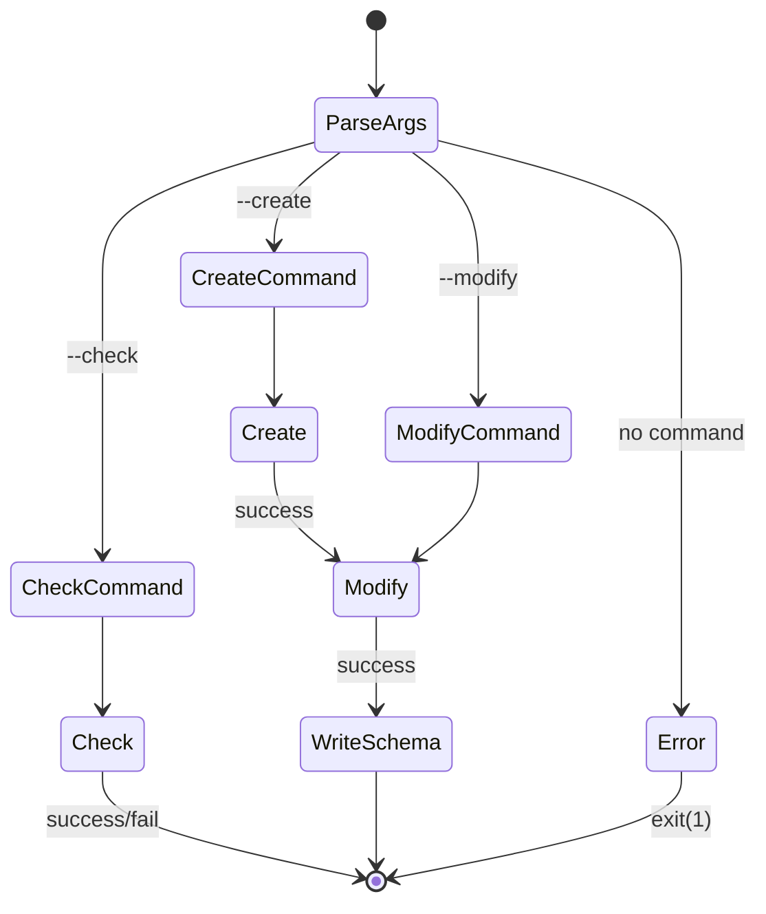

# Semantic Context: UTL (utils)

> Auto-generated by Extraction Agent v2.0.0
> Artifact type: tool (collection of CLI and GUI utilities)
> Depends on: LIB (librd)

## Section A: Files & Symbols

The UTL artifact is a collection of 23 independent sub-utilities in `utils/`. Each sub-directory is a standalone tool (CLI or GUI).

### Sub-Utility Index

| # | Sub-Tool | Type | Purpose | Key Files |
|---|----------|------|---------|-----------|
| 1 | rddbmgr | CLI | Database schema manager (create, update, revert, check) | rddbmgr.h, rddbmgr.cpp, create.cpp, updateschema.cpp, revertschema.cpp, check.cpp, modify.cpp, schemamap.cpp, printstatus.cpp |
| 2 | rddbconfig | GUI | Database configuration UI (create, backup, restore) | rddbconfig.h, rddbconfig.cpp, db.h, db.cpp, createdb.h, createdb.cpp, mysql_login.h, mysql_login.cpp |
| 3 | rdimport | CLI | Audio file importer (single/dropbox/batch) | rdimport.h, rdimport.cpp, journal.h, journal.cpp, markerset.h, markerset.cpp |
| 4 | rdexport | CLI | Audio file exporter (by cart/group/schedcode) | rdexport.h, rdexport.cpp |
| 5 | rdclilogedit | CLI | Command-line log editor | rdclilogedit.h, rdclilogedit.cpp, operations.cpp, parser.cpp, help.cpp |
| 6 | rmlsend | GUI+CLI | RML (Rivendell Macro Language) command sender | rmlsend.h, rmlsend.cpp |
| 7 | rdrender | CLI | Log-to-audio renderer | rdrender.h, rdrender.cpp, mainloop.cpp |
| 8 | rdconvert | CLI | Audio format converter | rdconvert.h, rdconvert.cpp |
| 9 | rddelete | CLI | Cart/log bulk deleter | rddelete.h, rddelete.cpp |
| 10 | rdmaint | CLI | System/local maintenance (purge old data) | rdmaint.h, rdmaint.cpp |
| 11 | rdmarkerset | CLI | Batch marker (trim/segue) setter per group | rdmarkerset.h, rdmarkerset.cpp |
| 12 | rdmetadata | CLI | Cart metadata updater | rdmetadata.h, rdmetadata.cpp |
| 13 | rdcheckcuts | CLI | Audio cut validation/rendering | rdcheckcuts.h, rdcheckcuts.cpp |
| 14 | rdcollect | CLI | Multi-file collector/sorter to single output | rdcollect.h, rdcollect.cpp |
| 15 | rdcleandirs | CLI | Directory cleanup utility | rdcleandirs.h, rdcleandirs.cpp |
| 16 | rdpopup | CLI | Simple popup dialog (no symbols visible) | rdpopup.h, rdpopup.cpp |
| 17 | rdselect_helper | CLI | Audio store selector helper (manages config) | rdselect_helper.h, rdselect_helper.cpp |
| 18 | rdsoftkeys | GUI | Macro soft-key panel (sends RML via network) | rdsoftkeys.h, rdsoftkeys.cpp |
| 19 | rddiscimport | GUI | CD disc audio importer with metadata | rddiscimport.h, rddiscimport.cpp, metarecord.h, metarecord.cpp, metalibrary.h, metalibrary.cpp |
| 20 | rddgimport | GUI | DG Systems traffic import tool | rddgimport.h, rddgimport.cpp, event.h, event.cpp |
| 21 | rdgpimon | GUI | GPI/GPO monitor and event viewer | rdgpimon.h, rdgpimon.cpp, gpi_label.h, gpi_label.cpp |
| 22 | rdalsaconfig | GUI | ALSA audio device configuration | rdalsaconfig.h, rdalsaconfig.cpp, alsaitem.h, alsaitem.cpp, rdalsamodel.h, rdalsamodel.cpp, rdalsacard.h, rdalsacard.cpp |
| 23 | rdgen | CLI (C) | WAV file tone generator (pure C, no Qt) | rdgen.c, wavlib.h, wavlib.c |

### Symbol Index

| Symbol | Kind | File | Qt? | Category |
|--------|------|------|-----|----------|
| MainObject (rddbmgr) | Class | rddbmgr/rddbmgr.h | No | Service - DB Schema Manager |
| MainObject (rdimport) | Class | rdimport/rdimport.h | Yes (Q_OBJECT) | Service - Audio Importer |
| MainObject (rdclilogedit) | Class | rdclilogedit/rdclilogedit.h | Yes (Q_OBJECT) | Service - CLI Log Editor |
| MainObject (rdexport) | Class | rdexport/rdexport.h | Yes (Q_OBJECT) | Service - Audio Exporter |
| MainObject (rdrender) | Class | rdrender/rdrender.h | Yes (Q_OBJECT) | Service - Log Renderer |
| MainObject (rddelete) | Class | rddelete/rddelete.h | Yes (Q_OBJECT) | Service - Bulk Deleter |
| MainObject (rdmaint) | Class | rdmaint/rdmaint.h | Yes (Q_OBJECT) | Service - Maintenance |
| MainObject (rdmarkerset) | Class | rdmarkerset/rdmarkerset.h | Yes (Q_OBJECT) | Service - Marker Setter |
| MainObject (rdmetadata) | Class | rdmetadata/rdmetadata.h | Yes (Q_OBJECT) | Service - Metadata Updater |
| MainObject (rdcheckcuts) | Class | rdcheckcuts/rdcheckcuts.h | No | Service - Cut Validator |
| MainObject (rdcollect) | Class | rdcollect/rdcollect.h | No | Service - File Collector |
| MainObject (rdcleandirs) | Class | rdcleandirs/rdcleandirs.h | No | Service - Dir Cleaner |
| MainObject (rdselect_helper) | Class | rdselect_helper/rdselect_helper.h | Yes (Q_OBJECT) | Service - Config Helper |
| MainObject (rdconvert) | Class | rdconvert/rdconvert.h | No | Service - Audio Converter |
| MainWidget (rmlsend) | Class | rmlsend/rmlsend.h | No | GUI - RML Sender |
| MainObject (rmlsend) | Class | rmlsend/rmlsend.h | No | CLI - RML Sender |
| MainWidget (rddbconfig) | Class | rddbconfig/rddbconfig.h | No | GUI - DB Config |
| Db | Class | rddbconfig/db.h | No | Utility - DB Access |
| CreateDb | Class | rddbconfig/createdb.h | No | Utility - DB Creator |
| MySqlLogin | Class | rddbconfig/mysql_login.h | No | GUI - MySQL Login Dialog |
| MainWidget (rddiscimport) | Class | rddiscimport/rddiscimport.h | No | GUI - Disc Importer |
| MetaRecord | Class | rddiscimport/metarecord.h | No | Value Object - Track Metadata |
| MetaLibrary | Class | rddiscimport/metalibrary.h | No | Value Object - Track Collection |
| MainWidget (rddgimport) | Class | rddgimport/rddgimport.h | No | GUI - DG Traffic Import |
| Event | Class | rddgimport/event.h | No | Value Object - Traffic Event |
| MainWidget (rdgpimon) | Class | rdgpimon/rdgpimon.h | No | GUI - GPI Monitor |
| GpiLabel | Class | rdgpimon/gpi_label.h | No | Widget - GPI Line Label |
| MainWidget (rdalsaconfig) | Class | rdalsaconfig/rdalsaconfig.h | No | GUI - ALSA Config |
| RDAlsaModel | Class | rdalsaconfig/rdalsamodel.h | Yes (Q_OBJECT) | Model - ALSA Card Model |
| RDAlsaCard | Class | rdalsaconfig/rdalsacard.h | No | Value Object - ALSA Card |
| AlsaItem | Class | rdalsaconfig/alsaitem.h | No | Value Object - ALSA Item |
| MainWidget (rdsoftkeys) | Class | rdsoftkeys/rdsoftkeys.h | No | GUI - Soft Keys |
| Journal | Class | rdimport/journal.h | No | Utility - Import Journal |
| MarkerSet | Class | rdimport/markerset.h | No | Value Object - Marker Set |
| wavHeader | Struct | rdgen/wavlib.h | No | Value Object - WAV Header |
| wavChunk | Struct | rdgen/wavlib.h | No | Value Object - WAV Chunk |
| wavProcess | Struct | rdgen/wavlib.h | No | Value Object - WAV Process |
| wavList | Struct | rdgen/wavlib.h | No | Value Object - WAV LIST chunk |

## Section B: Class API Surface

NOTE: All 23 sub-utilities follow the same Qt CLI pattern: a `MainObject` (or `MainWidget` for GUI tools)
class that parses command-line switches in its constructor, authenticates with ripcd (for tools needing DB access),
then runs its core logic. Each utility is a standalone executable.

### MainObject (rddbmgr) [Service - Database Schema Manager]
- **File:** utils/rddbmgr/rddbmgr.h
- **Inherits:** QObject
- **Qt Object:** No (no Q_OBJECT macro)
- **Purpose:** Creates, upgrades, downgrades, and verifies the Rivendell MySQL database schema.

#### Enums
| Enum | Values |
|------|--------|
| Command | NoCommand=0, ModifyCommand=1, CreateCommand=2, CheckCommand=3 |

#### CLI Options
| Option | Type | Description |
|--------|------|-------------|
| --create | flag | Create a new empty database with current schema |
| --modify | flag | Upgrade or downgrade schema to target version |
| --check | flag | Verify database integrity (orphaned records, audio, etc.) |
| --mysql-hostname | string | MySQL server hostname |
| --mysql-loginname | string | MySQL login name |
| --mysql-password | string | MySQL password |
| --mysql-database | string | Database name |
| --mysql-driver | string | MySQL driver |
| --mysql-engine | string | MySQL engine type |
| --set-schema | int | Target schema version number |
| --set-version | string | Target Rivendell version (e.g. "3.6") |
| --verbose | flag | Verbose output |
| --yes | flag | Auto-confirm prompts |
| --no | flag | Auto-deny prompts |
| --orphan-group | string | Group name for orphaned items |
| --dump-cuts-dir | string | Directory to dump orphaned cuts |
| --relink-audio | string | Relink audio from specified path |
| --relink-audio-move | flag | Move (not copy) when relinking |
| --rehash | string | Rehash audio for specified cart/cut |
| --orphaned-audio | flag | Check only orphaned audio files |
| --orphaned-carts | flag | Check only orphaned carts |
| --orphaned-cuts | flag | Check only orphaned cuts |
| --orphaned-tracks | flag | Check only orphaned tracks |
| --station-name | string | Station name for initialization |
| --print-progress | flag | Print progress timestamps |
| --generate-audio | flag | Generate audio tones during creation |

#### Public Methods (grouped by source file)
**create.cpp:**
| Method | Return | Brief |
|--------|--------|-------|
| Create() | bool | Orchestrate full DB creation |
| CreateNewDb() | bool | Create database and all tables |
| InititalizeNewDb() | bool | Populate initial data (default user, station, groups, services) |
| InsertImportFormats() | void | Insert default import format templates |
| InsertRDAirplayHotkeys() | void | Insert default RDAirplay hotkey mappings |
| CreateReconciliationTable() | void | Create per-service reconciliation (SRT) tables |

**updateschema.cpp:**
| Method | Return | Brief |
|--------|--------|-------|
| UpdateSchema() | bool | Apply incremental schema migrations up to target version |

**revertschema.cpp:**
| Method | Return | Brief |
|--------|--------|-------|
| RevertSchema() | bool | Revert schema to a previous version |

**check.cpp:**
| Method | Return | Brief |
|--------|--------|-------|
| Check() | bool | Run all or selected integrity checks |
| CheckTableAttributes() | bool | Verify table charset and engine settings |
| RewriteTable() | bool | Rewrite a table to fix attributes |
| RewriteFile() | bool | Rewrite a file for relinking |
| RelinkAudio() | bool | Relink audio files from alternate path |
| RelinkCut() | bool | Relink a single cut's audio |
| RelinkCast() | bool | Relink a single podcast's audio |
| CheckOrphanedTracks() | bool | Find voice tracks without parent logs |
| CheckCutCounts() | bool | Verify cut counts match actual cuts |
| CheckPendingCarts() | bool | Find carts stuck in pending state |
| CheckOrphanedCarts() | bool | Find carts not in any group |
| CheckOrphanedCuts() | bool | Find cuts not attached to any cart |
| CheckOrphanedAudio() | bool | Find audio files without DB records |
| ValidateAudioLengths() | bool | Check audio file lengths match DB |
| Rehash() | bool | Recalculate audio SHA-1 hashes |
| RehashCart() | bool | Rehash all cuts in a cart |
| RehashCut() | bool | Rehash a single cut |
| SetCutLength() | bool | Fix cut length in DB |
| RemoveCart() | bool | Remove a cart and its audio |
| CopyToAudioStore() | bool | Copy audio to the audio store |
| UserResponse() | bool | Interactive yes/no prompt |

**modify.cpp:**
| Method | Return | Brief |
|--------|--------|-------|
| Modify() | bool | Orchestrate modify command (upgrade/downgrade) |
| GetCurrentSchema() | int | Get current DB schema version |
| ModifyCharset() | bool | Convert character set |

**schemamap.cpp:**
| Method | Return | Brief |
|--------|--------|-------|
| InitializeSchemaMap() | void | Initialize version-to-schema mapping (v1.0=159 through v3.6=347) |
| GetVersionSchema() | int | Get schema number for a Rivendell version string |
| GetSchemaVersion() | QString | Get version string for a schema number |

**printstatus.cpp:**
| Method | Return | Brief |
|--------|--------|-------|
| PrintStatus() | bool | Print current DB schema version and status |

#### Schema Version Map (key entries)
| Version | Schema |
|---------|--------|
| 1.0 | 159 |
| 2.0 | 202 |
| 3.0 | 308 |
| 3.5 | 346 |
| 3.6 | 347 |

---

### MainObject (rdimport) [Service - Audio Importer]
- **File:** utils/rdimport/rdimport.h
- **Inherits:** QObject
- **Qt Object:** Yes (Q_OBJECT)
- **Purpose:** Import audio files into Rivendell cart/cut system. Supports single files, batch import, dropbox monitoring, metadata patterns, and ISCI cross-reference.

#### Enums
| Enum | Values |
|------|--------|
| Result | Success=0, FileBad=1, NoCart=2, NoCut=3, DuplicateTitle=4 |

#### Public Methods
| Method | Return | Brief |
|--------|--------|-------|
| RunDropBox() | void | Monitor dropbox directories for new files |
| ProcessFileEntry() | Result | Process a single file entry |
| ImportFile() | Result | Import a single audio file |
| OpenAudioFile() | bool | Open and validate audio file |
| VerifyFile() | bool | Verify audio file integrity |
| FixFile() | bool | Fix broken WAV format issues |
| IsWav() | bool | Check if file is WAV format |
| FindChunk() | bool | Find WAV chunk in file |
| FixChunkSizes() | bool | Fix WAV chunk size headers |
| RunPattern() | void | Apply metadata pattern to filename |
| VerifyPattern() | bool | Validate metadata pattern syntax |
| DeleteCuts() | void | Delete existing cuts before import |
| GetCachedTimestamp() | QDateTime | Retrieve cached file timestamp |
| WriteTimestampCache() | void | Write file timestamp to cache |
| LoadIsciXref() | bool | Load ISCI cross-reference table |
| SchedulerCodeExists() | bool | Check if scheduler code exists |
| ReadXmlFile() | bool | Read XML metadata file |
| Log() | void | Write to import log |
| SendNotification() | void | Send RD notification on import |
| NormalExit() | void | Clean exit |
| ErrorExit() | void | Error exit |

#### Key Fields (CLI Options)
| Field | Type | Description |
|-------|------|-------------|
| import_group | QString | Target group for import |
| import_to_mono | bool | Mix down to mono |
| import_normalization_level | int | Normalization level in dBFS |
| import_autotrim_level | int | Auto-trim level in dBFS |
| import_single_cart | bool | Import to specific cart number |
| import_cart_number | unsigned | Target cart number |
| import_delete_source | bool | Delete source file after import |
| import_delete_cuts | bool | Delete existing cuts before import |
| import_drop_box | bool | Run in dropbox mode |
| import_metadata_pattern | QString | Filename metadata extraction pattern |
| import_fix_broken_formats | bool | Attempt to fix broken audio formats |
| import_xml | bool | Read XML metadata |
| import_by_isci | bool | Import by ISCI code cross-reference |

#### Helper Classes
**Journal** (rdimport/journal.h):
- Tracks import successes and failures
- Sends email notifications grouped by address
- Methods: addSuccess(), addFailure(), sendAll(), GroupsByAddress()

**MarkerSet** (rdimport/markerset.h):
- Holds audio marker positions (start/end/fade)
- Methods: loadMarker(), loadFade(), setAudioLength(), LimitCheck(), FrontReference()

---

### MainObject (rdclilogedit) [Service - CLI Log Editor]
- **File:** utils/rdclilogedit/rdclilogedit.h
- **Inherits:** QObject
- **Qt Object:** Yes (Q_OBJECT)
- **Purpose:** Interactive command-line editor for Rivendell logs. Provides REPL-style commands.

#### Public Methods (operations.cpp)
| Method | Return | Brief |
|--------|--------|-------|
| Addcart() | void | Add a cart to current log |
| Addchain() | void | Add a chain-to event |
| Addmarker() | void | Add a marker event |
| Addtrack() | void | Add a voice track placeholder |
| Deletelog() | void | Delete a log |
| Header() | void | Display/edit log header |
| List() | void | List log lines |
| ListLogs() | void | List all available logs |
| Listservices() | void | List available services |
| Load() | void | Load a log for editing |
| New() | void | Create a new log |
| Remove() | void | Remove a log line |
| Save() | void | Save current log |
| Saveas() | void | Save log with new name |
| Setautorefresh() | void | Set auto-refresh flag |
| Setcart() | void | Set cart number for a line |
| Setcomment() | void | Set comment on a line |
| Setdesc() | void | Set log description |
| Setenddate() | void | Set log end date |
| Setlabel() | void | Set label on a line |
| Setpurgedate() | void | Set log purge date |
| Setservice() | void | Set log service |
| Setstartdate() | void | Set log start date |
| Settime() | void | Set time for a log line |
| Settrans() | void | Set transition type for a line |
| Unload() | void | Unload current log |
| DispatchCommand() | void | Parse and route user commands |
| Help() | void | Display help text |

---

### MainObject (rdexport) [Service - Audio Exporter]
- **File:** utils/rdexport/rdexport.h
- **Inherits:** QObject
- **Qt Object:** Yes (Q_OBJECT)
- **Purpose:** Export audio from carts/cuts to files in various formats.

#### Public Methods
| Method | Return | Brief |
|--------|--------|-------|
| ExportTitle() | void | Export carts matching title |
| ExportGroup() | void | Export all carts in a group |
| ExportSchedCode() | void | Export carts by scheduler code |
| ExportCart() | void | Export a single cart |
| ExportCut() | void | Export a single cut |
| ResolveOutputName() | QString | Resolve output filename from pattern |
| SanitizePath() | QString | Sanitize file path characters |
| Verbose() | void | Print verbose message |

---

### MainObject (rdrender) [Service - Log Renderer]
- **File:** utils/rdrender/rdrender.h
- **Inherits:** QObject
- **Qt Object:** Yes (Q_OBJECT)
- **Purpose:** Render a Rivendell log to a single audio file (mix-down all scheduled audio).

#### Key Fields
| Field | Type | Description |
|-------|------|-------------|
| render_logname | QString | Log name to render |
| render_to_file | QString | Output filename |
| render_cart_number | unsigned | Output cart number (if saving to cart) |
| render_start_time | QTime | Render start time |
| render_first_line / render_last_line | int | Line range to render |
| render_ignore_stops | bool | Ignore stop transitions |
| render_settings | RDSettings* | Audio output settings |

---

### MainObject (rddelete) [Service - Bulk Deleter]
- **File:** utils/rddelete/rddelete.h
- **Inherits:** QObject
- **Qt Object:** Yes (Q_OBJECT)
- **Purpose:** Bulk delete carts or logs from command line.

#### Public Methods
| Method | Return | Brief |
|--------|--------|-------|
| DeleteCarts() | void | Delete specified carts |
| DeleteLogs() | void | Delete specified logs |
| GetNextObject() (2 overloads) | bool | Get next object ID from args/stdin |
| GetNextStdinObject() | bool | Get next object from stdin pipe |

---

### MainObject (rdmaint) [Service - Maintenance]
- **File:** utils/rdmaint/rdmaint.h
- **Inherits:** QObject
- **Qt Object:** Yes (Q_OBJECT)
- **Purpose:** Run periodic maintenance tasks - purge expired data, rehash audio.

#### Public Methods
| Method | Return | Brief |
|--------|--------|-------|
| RunSystemMaintenance() | void | Run system-wide maintenance |
| RunLocalMaintenance() | void | Run host-local maintenance |
| PurgeCuts() | void | Delete cuts past their expiration |
| PurgeLogs() | void | Delete logs past their purge date |
| PurgeElr() | void | Purge old ELR (event log record) data |
| PurgeDropboxes() | void | Clean up stale dropbox records |
| PurgeGpioEvents() | void | Purge old GPIO event records |
| PurgeWebapiAuths() | void | Purge expired web API auth tokens |
| PurgeStacks() | void | Purge old scheduler stack data |
| RehashCuts() | void | Recalculate SHA-1 for cuts needing it |

---

### MainObject (rdmarkerset) [Service - Marker Setter]
- **File:** utils/rdmarkerset/rdmarkerset.h
- **Inherits:** QObject
- **Qt Object:** Yes (Q_OBJECT)
- **Purpose:** Set auto-trim and auto-segue markers for all cuts in specified groups.

#### Public Methods
| Method | Return | Brief |
|--------|--------|-------|
| ProcessGroup() | void | Process all cuts in a group |
| SetAutoTrim() | void | Set auto-trim markers |
| ClearAutoTrim() | void | Clear auto-trim markers |
| SetAutoSegue() | void | Set auto-segue markers |
| ClearAutoSegue() | void | Clear auto-segue markers |

---

### MainObject (rdmetadata) [Service - Metadata Updater]
- **File:** utils/rdmetadata/rdmetadata.h
- **Inherits:** QObject
- **Qt Object:** Yes (Q_OBJECT)
- **Purpose:** Update metadata fields on existing carts from command line.

#### Public Methods
| Method | Return | Brief |
|--------|--------|-------|
| updateMetadata() | void | Apply metadata changes to cart |
| SendNotification() | void | Notify system of changes |

#### Key Fields (CLI)
| Field | Type | Description |
|-------|------|-------------|
| cartnum | unsigned | Target cart number |
| artist / title / album / year | QString | Metadata fields to set |
| add_schedcode / rem_schedcode | QStringList | Scheduler codes to add/remove |

---

### MainObject (rdconvert) [Service - Audio Converter]
- **File:** utils/rdconvert/rdconvert.h
- **Inherits:** (none visible)
- **Qt Object:** No
- **Purpose:** Convert audio between formats (WAV, MPEG, etc.) with optional start/end points and speed ratio.

#### Key Fields
| Field | Type | Description |
|-------|------|-------------|
| source_filename | QString | Input file |
| destination_filename | QString | Output file |
| start_point / end_point | int | Audio range (ms) |
| speed_ratio | float | Playback speed adjustment |
| destination_settings | RDSettings | Target format settings |

---

### MainObject (rdselect_helper) [Service - Config Selector]
- **File:** utils/rdselect_helper/rdselect_helper.h
- **Inherits:** QObject
- **Qt Object:** Yes (Q_OBJECT)
- **Purpose:** Manage switching between multiple Rivendell configurations (audio stores). Controls automounter, starts/stops config.

#### Public Methods
| Method | Return | Brief |
|--------|--------|-------|
| Startup() | void | Activate a Rivendell configuration |
| Shutdown() | void | Deactivate current configuration |
| ControlAutomounter() | bool | Start/stop automounter for audio NFS mounts |
| ProcessActive() | bool | Check if another instance is running |
| ModulesActive() | bool | Check for active kernel modules |

---

### MainWidget (rddbconfig) [GUI - Database Configuration]
- **File:** utils/rddbconfig/rddbconfig.h
- **Inherits:** QWidget
- **Qt Object:** No (implicit)
- **Purpose:** GUI for database management: create new DB, backup, restore.

#### Slots
| Slot | Trigger | Brief |
|------|---------|-------|
| createData() | Create button | Create new Rivendell database |
| backupData() | Backup button | Backup database to SQL dump |
| restoreData() | Restore button | Restore database from SQL dump |
| closeData() | Close button | Exit application |
| mismatchData() | dbMismatch signal | Handle schema version mismatch |
| updateLabels() | dbChanged signal | Refresh version/status labels |

#### Helper Classes
**Db** (rddbconfig/db.h): Wraps database connection. Methods: isOpen(), clearDatabase(), schema().
**CreateDb** (rddbconfig/createdb.h): Creates new MySQL database. Methods: create(), isOpen().
**MySqlLogin** (rddbconfig/mysql_login.h): Login dialog for MySQL credentials.

---

### MainWidget (rmlsend) [GUI+CLI - RML Command Sender]
- **File:** utils/rmlsend/rmlsend.h
- **Inherits:** QWidget (GUI mode) / standalone (CLI mode)
- **Purpose:** Send RML (Rivendell Macro Language) commands to a host via UDP. GUI mode has text input + response display. CLI mode reads from file/stdin.

#### GUI Slots
| Slot | Brief |
|------|-------|
| sendCommand() | Send RML command via UDP |
| readResponse() | Read UDP response |
| destChangedData() | Handle destination type change (TCP/UDP) |

#### CLI Methods
| Method | Brief |
|--------|-------|
| ReadSwitches() | Parse CLI arguments |
| ResolveName() | Resolve hostname to address |
| ProcessCommands() | Read and send commands from file/stdin |

---

### MainWidget (rddiscimport) [GUI - CD Disc Importer]
- **File:** utils/rddiscimport/rddiscimport.h
- **Inherits:** QWidget
- **Purpose:** Rip audio from CD and import into Rivendell with metadata (from index file).

#### Slots
| Slot | Brief |
|------|-------|
| groupActivatedData() | Handle group selection change |
| autotrimCheckData() | Toggle auto-trim |
| trackDoubleClickedData() | Edit track metadata |
| ripData() | Start ripping selected tracks |
| normalizeCheckData() | Toggle normalization |
| mediaChangedData() | Handle CD media change |
| discIdChangedData() | Handle disc ID change |
| ejectData() | Eject CD |
| userChangedData() | Handle user authentication change |

#### Helper Classes
**MetaRecord**: Value object for track metadata (title, artist, album, year, ISRC, BPM, segue points, etc.)
**MetaLibrary**: Collection of MetaRecord objects, loaded from index file.

---

### MainWidget (rddgimport) [GUI - DG Systems Traffic Import]
- **File:** utils/rddgimport/rddgimport.h
- **Inherits:** QWidget
- **Purpose:** Import traffic/scheduling data from DG Systems format files.

#### Slots
| Slot | Brief |
|------|-------|
| filenameChangedData() | Handle filename text change |
| filenameSelectedData() | Browse for import file |
| dateSelectedData() | Pick import date |
| processData() | Process the import |
| userChangedData() | Handle user auth change |

#### Key Methods
| Method | Brief |
|--------|-------|
| LoadEvents() | Load events from DG file |
| ImportAudio() | Import audio for events |
| WriteTrafficFile() | Write processed traffic file |
| CheckSpot() / ImportSpot() | Verify and import individual spots |

#### Helper Class
**Event**: Value object for traffic events (time, length, ISCI, title, client).

---

### MainWidget (rdgpimon) [GUI - GPI/GPO Monitor]
- **File:** utils/rdgpimon/rdgpimon.h
- **Inherits:** QWidget
- **Purpose:** Real-time monitor for GPIO (General Purpose I/O) lines. Shows state, mask, carts, and event history.

#### Slots
| Slot | Brief |
|------|-------|
| typeActivatedData() | Switch GPI/GPO view |
| matrixActivatedData() | Select matrix to monitor |
| gpiStateChangedData() | Update GPI state display |
| gpoStateChangedData() | Update GPO state display |
| gpiMaskChangedData() / gpoMaskChangedData() | Update mask display |
| gpiCartChangedData() / gpoCartChangedData() | Update cart assignments |
| eventsDateChangedData() | Filter events by date |
| eventsScrollData() | Toggle auto-scroll |
| eventsReportData() | Generate events report |

#### Helper Class
**GpiLabel**: Widget showing one GPIO line with state, on-cart, off-cart labels.

---

### MainWidget (rdalsaconfig) [GUI - ALSA Configuration]
- **File:** utils/rdalsaconfig/rdalsaconfig.h
- **Inherits:** QWidget
- **Purpose:** Configure ALSA audio devices for Rivendell. Platform-specific (Linux/ALSA only).

#### Helper Classes
**RDAlsaModel** (Q_OBJECT): QAbstractTableModel for ALSA cards. Loads/saves `/etc/asound.conf`.
**RDAlsaCard**: Value object for ALSA sound card (index, id, driver, name, PCM devices).
**AlsaItem**: Simple value object for card/PCM number pair.

---

### MainWidget (rdsoftkeys) [GUI - Soft Key Panel]
- **File:** utils/rdsoftkeys/rdsoftkeys.h
- **Inherits:** QWidget
- **Purpose:** Display configurable button grid that sends RML macros via UDP. Reads config from map file.

---

### MainObject (rdcheckcuts) [Service - Cut Validator]
- **File:** utils/rdcheckcuts/rdcheckcuts.h
- **Purpose:** Validate audio cuts exist and optionally render them.
- Methods: RenderCut(), ValidateGroup()

### MainObject (rdcollect) [Service - File Collector]
- **File:** utils/rdcollect/rdcollect.h
- **Purpose:** Collect and merge multiple traffic/music data files into one sorted output.
- Methods: GetDirectoryList(), LoadSourceFiles(), SortLines(), WriteOutputFile()

### MainObject (rdcleandirs) [Service - Directory Cleaner]
- **File:** utils/rdcleandirs/rdcleandirs.h
- **Purpose:** Clean up empty/stale directories.

## Section C: Data Model

The UTL artifact (specifically rddbmgr) is the **canonical source** of the Rivendell physical database schema.
The `CreateNewDb()` method in `utils/rddbmgr/create.cpp` creates ALL tables from scratch.
The `UpdateSchema()` in `utils/rddbmgr/updateschema.cpp` contains incremental migrations (schema 1 through 347).
The `RevertSchema()` in `utils/rddbmgr/revertschema.cpp` reverses migrations for downgrades.

Current schema version: **347** (Rivendell 3.6)

### Complete Table Inventory (from create.cpp)

The following tables are created by `CreateNewDb()`. This is the definitive physical schema.

#### Core Domain Tables
| Table | Primary Key | Description |
|-------|-------------|-------------|
| USERS | LOGIN_NAME char(255) | User accounts and permissions |
| STATIONS | NAME char(64) | Rivendell workstations/hosts |
| CART | NUMBER int unsigned | Audio carts (the fundamental content unit) |
| CUTS | CUT_NAME char(12) | Audio cuts (physical audio files within carts) |
| CLIPBOARD | CUT_NAME char(12) | Clipboard for cut copy/paste |
| GROUPS | NAME char(10) | Cart groups (organizational containers) |
| SERVICES | NAME char(10) | Broadcast services (stations/channels) |
| LOGS | NAME char(64) | Program logs (playlists) |
| VERSION | DB int | Database version tracking |
| SYSTEM | ID int | System-wide configuration singleton |

#### Scheduling & Events Tables
| Table | Primary Key | Description |
|-------|-------------|-------------|
| EVENTS | NAME char(64) | Scheduling events (for clock-based scheduling) |
| CLOCKS | NAME char(64) | Scheduling clocks (hourly templates) |
| AUTOFILLS | ID int auto_increment | Autofill rules for scheduling |
| SCHED_CODES | CODE varchar(10) | Scheduler codes (categories for scheduling rules) |
| SERVICE_CLOCKS | ID int auto_increment | Clock assignments per service per hour |
| EVENT_LINES | ID int unsigned auto_increment | Lines within scheduling events |
| CLOCK_LINES | ID int unsigned auto_increment | Lines within scheduling clocks |
| RULE_LINES | ID int unsigned auto_increment | Scheduling rule entries per clock |
| STACK_LINES | ID int unsigned auto_increment | Scheduler stack (recently played) |
| STACK_SCHED_CODES | ID int auto_increment | Sched codes for stack entries |
| CART_SCHED_CODES | ID int auto_increment | Sched code assignments per cart |
| LOG_LINES | ID int auto_increment | Individual lines within program logs |
| LOG_MODES | ID int unsigned auto_increment | Log machine mode settings |
| LOG_MACHINES | ID int auto_increment | Log machine assignments per station |
| IMPORTER_LINES | ID int auto_increment | Traffic/music import format definitions |

#### Recording & Playback Tables
| Table | Primary Key | Description |
|-------|-------------|-------------|
| RECORDINGS | ID int unsigned auto_increment | Scheduled recording events (rdcatch) |
| DECKS | ID int unsigned auto_increment | Record/play deck configurations |
| TRIGGERS | ID int unsigned auto_increment | Triggered events |

#### Audio Hardware Tables
| Table | Primary Key | Description |
|-------|-------------|-------------|
| AUDIO_CARDS | ID int auto_increment | Audio card configurations per station |
| AUDIO_INPUTS | ID int auto_increment | Audio input port configurations |
| AUDIO_OUTPUTS | ID int auto_increment | Audio output port configurations |

#### I/O Switching & GPIO Tables
| Table | Primary Key | Description |
|-------|-------------|-------------|
| MATRICES | ID int auto_increment | Audio switching matrices |
| INPUTS | ID int auto_increment | Matrix input ports |
| OUTPUTS | ID int auto_increment | Matrix output ports |
| GPIS | ID int auto_increment | GPI (General Purpose Input) lines |
| GPOS | ID int auto_increment | GPO (General Purpose Output) lines |
| SWITCHER_NODES | ID int auto_increment | Network switcher node configs |
| LIVEWIRE_GPIO_SLOTS | ID int unsigned auto_increment | Livewire GPIO slot mappings |
| VGUEST_RESOURCES | ID int unsigned auto_increment | VGuest console resources |
| GPIO_EVENTS | ID int auto_increment | GPIO event log |
| NOWNEXT_PLUGINS | ID int auto_increment | Now/Next PAD plugin configs |

#### Serial/TTY Tables
| Table | Primary Key | Description |
|-------|-------------|-------------|
| TTYS | ID int unsigned auto_increment | Serial port (TTY) configurations |

#### Application Config Tables
| Table | Primary Key | Description |
|-------|-------------|-------------|
| RDAIRPLAY | ID int auto_increment | RDAirplay configuration per station |
| RDAIRPLAY_CHANNELS | ID int unsigned auto_increment | RDAirplay channel assignments |
| RDLIBRARY | ID int auto_increment | RDLibrary configuration per station |
| RDLOGEDIT | ID int unsigned auto_increment | RDLogEdit configuration per station |
| RDCATCH | ID int unsigned auto_increment | RDCatch configuration per station |
| RDPANEL | ID int auto_increment | RDPanel configuration per station |
| RDPANEL_CHANNELS | ID int unsigned auto_increment | RDPanel channel assignments |
| RDHOTKEYS | ID int unsigned auto_increment | Hotkey assignments |
| CARTSLOTS | ID int unsigned auto_increment | Cart slot configs (rdcartslots app) |

#### Panel/Button Tables
| Table | Primary Key | Description |
|-------|-------------|-------------|
| PANELS | ID int auto_increment | Sound panel button assignments |
| EXTENDED_PANELS | ID int auto_increment | Extended panel button assignments |
| PANEL_NAMES | ID int auto_increment | Panel name labels |
| EXTENDED_PANEL_NAMES | ID int auto_increment | Extended panel name labels |

#### Podcast/RSS Tables
| Table | Primary Key | Description |
|-------|-------------|-------------|
| FEEDS | ID int unsigned auto_increment | Podcast feed definitions |
| PODCASTS | ID int unsigned auto_increment | Individual podcast episodes |
| AUX_METADATA | ID int unsigned auto_increment | Auxiliary metadata for podcasts |
| CAST_DOWNLOADS | ID int unsigned auto_increment | Podcast download tracking |
| SUPERFEED_MAPS | ID int unsigned auto_increment | Superfeed (aggregate feed) mappings |
| RSS_SCHEMAS | ID int unsigned | RSS schema definitions |
| FEED_IMAGES | ID int unsigned auto_increment | Podcast feed images |

#### Encoder Tables
| Table | Primary Key | Description |
|-------|-------------|-------------|
| ENCODERS | ID int auto_increment | Audio encoder definitions |
| ENCODER_BITRATES | ID int auto_increment | Supported bitrates per encoder |
| ENCODER_CHANNELS | ID int auto_increment | Supported channels per encoder |
| ENCODER_SAMPLERATES | ID int auto_increment | Supported sample rates per encoder |
| ENCODER_PRESETS | ID int auto_increment | Encoder preset configurations |

#### Permissions/ACL Tables
| Table | Primary Key | Description |
|-------|-------------|-------------|
| AUDIO_PERMS | ID int unsigned auto_increment | Audio group permissions per service |
| USER_PERMS | ID int unsigned auto_increment | User-to-group permission mapping |
| SERVICE_PERMS | ID int unsigned auto_increment | Station-to-service permission mapping |
| USER_SERVICE_PERMS | ID int auto_increment | User-to-service permission mapping |
| CLOCK_PERMS | ID int unsigned auto_increment | Station-to-clock permission mapping |
| EVENT_PERMS | ID int unsigned auto_increment | Station-to-event permission mapping |
| FEED_PERMS | ID int unsigned auto_increment | User-to-feed permission mapping |

#### Replication Tables
| Table | Primary Key | Description |
|-------|-------------|-------------|
| REPLICATORS | NAME char(32) | Replicator definitions |
| REPLICATOR_MAP | ID int unsigned auto_increment | Group-to-replicator mappings |
| REPL_CART_STATE | ID int unsigned auto_increment | Replication state per cart |
| REPL_CUT_STATE | ID int unsigned auto_increment | Replication state per cut |

#### Reporting Tables
| Table | Primary Key | Description |
|-------|-------------|-------------|
| REPORTS | ID int unsigned auto_increment | Report definitions |
| REPORT_SERVICES | ID int unsigned auto_increment | Services included in reports |
| REPORT_STATIONS | ID int unsigned auto_increment | Stations included in reports |
| REPORT_GROUPS | ID int unsigned auto_increment | Groups included in reports |
| ELR_LINES | ID int unsigned auto_increment | Event Log Reconciliation lines |

#### Import/Dropbox Tables
| Table | Primary Key | Description |
|-------|-------------|-------------|
| DROPBOXES | ID int auto_increment | Dropbox configurations |
| DROPBOX_PATHS | ID int auto_increment | File paths per dropbox |
| DROPBOX_SCHED_CODES | ID int auto_increment | Sched codes per dropbox |
| IMPORT_TEMPLATES | NAME char(64) | Traffic/music import format templates |
| ISCI_XREFERENCE | ID int unsigned auto_increment | ISCI code cross-reference table |

#### Miscellaneous Tables
| Table | Primary Key | Description |
|-------|-------------|-------------|
| HOSTVARS | ID int auto_increment | Host-specific variables |
| JACK_CLIENTS | ID int unsigned auto_increment | JACK audio client configs |
| WEB_CONNECTIONS | SESSION_ID int unsigned | Web API session tracking |
| WEBAPI_AUTHS | TICKET char(41) | Web API authentication tokens |
| CUT_EVENTS | ID int auto_increment | Cut playback event log |
| DECK_EVENTS | ID int auto_increment | Deck event log |
| PYPAD_INSTANCES | ID int auto_increment | PyPAD plugin instances |

#### Nexus Integration Tables
| Table | Primary Key | Description |
|-------|-------------|-------------|
| NEXUS_FIELDS | STATION varchar(255) | Nexus field mappings per station |
| NEXUS_QUEUE | ID int auto_increment | Nexus notification queue |
| NEXUS_SERVER | (no auto PK) | Nexus server configuration |
| NEXUS_STATIONS | STATION varchar(255) | Nexus station mappings |

#### Dynamic/Per-Service Tables
These tables are created dynamically based on service names:
| Pattern | Description |
|---------|-------------|
| `{SERVICE}_SRT` | Service Reconciliation Table (traffic/music reconciliation) |
| `{FEED_KEY}_FIELDS` | Custom fields per podcast feed |
| `{FEED_KEY}_FLG` | Feed log entries |
| `SAMPLE_LOG` | Sample/template log |

### Key Relationships (ERD)

```mermaid
erDiagram
    CART ||--o{ CUTS : "has many"
    CART ||--o{ CART_SCHED_CODES : "has codes"
    GROUPS ||--o{ CART : "contains"
    SERVICES ||--o{ LOGS : "owns"
    LOGS ||--o{ LOG_LINES : "has lines"
    SERVICES ||--o{ SERVICE_CLOCKS : "has clocks"
    CLOCKS ||--o{ CLOCK_LINES : "has lines"
    EVENTS ||--o{ EVENT_LINES : "has lines"
    CLOCKS ||--o{ RULE_LINES : "has rules"
    STATIONS ||--o{ RDAIRPLAY : "configures"
    STATIONS ||--o{ RDCATCH : "configures"
    STATIONS ||--o{ AUDIO_CARDS : "has cards"
    STATIONS ||--o{ MATRICES : "has matrices"
    MATRICES ||--o{ INPUTS : "has inputs"
    MATRICES ||--o{ OUTPUTS : "has outputs"
    MATRICES ||--o{ GPIS : "has GPIs"
    MATRICES ||--o{ GPOS : "has GPOs"
    FEEDS ||--o{ PODCASTS : "has episodes"
    FEEDS ||--o{ AUX_METADATA : "has metadata"
    FEEDS ||--o{ FEED_IMAGES : "has images"
    USERS ||--o{ USER_PERMS : "has perms"
    USERS ||--o{ USER_SERVICE_PERMS : "has svc perms"
    DROPBOXES ||--o{ DROPBOX_PATHS : "has paths"
    DROPBOXES ||--o{ DROPBOX_SCHED_CODES : "has codes"
    REPORTS ||--o{ REPORT_SERVICES : "includes svcs"
    REPORTS ||--o{ REPORT_STATIONS : "includes stations"
    REPORTS ||--o{ REPORT_GROUPS : "includes groups"
    REPLICATORS ||--o{ REPLICATOR_MAP : "maps groups"
    REPLICATORS ||--o{ REPL_CART_STATE : "tracks carts"
    REPLICATORS ||--o{ REPL_CUT_STATE : "tracks cuts"
```



**Total unique tables: ~90+ (including dynamically created per-service/per-feed tables)**

## Section D: Reactive Architecture

### Common Pattern: RIPC Authentication
Nearly all CLI/GUI tools that need database access follow this pattern:
```
connect(rda, SIGNAL(userChanged()), this, SLOT(userData()));
rda->ripc()->connectHost("localhost", RIPCD_TCP_PORT, rda->config()->password());
```
This connects to the local ripcd daemon for authentication before proceeding with the tool's main logic.
Tools using this pattern: rdimport, rdexport, rdrender, rddelete, rdmaint, rdmarkerset, rdmetadata, rdclilogedit, rddiscimport, rddgimport, rdgpimon.

### Signal/Slot Connections by Sub-Tool

#### rdalsaconfig (2 connections)
| Sender | Signal | Receiver | Slot |
|--------|--------|----------|------|
| alsa_save_button | clicked() | this | saveData() |
| alsa_cancel_button | clicked() | this | cancelData() |

#### rdsoftkeys (2 connections)
| Sender | Signal | Receiver | Slot |
|--------|--------|----------|------|
| mapper (QSignalMapper) | mapped(int) | this | buttonData(int) |
| button (per-key) | clicked() | mapper | map() |

#### rmlsend (4 connections)
| Sender | Signal | Receiver | Slot |
|--------|--------|----------|------|
| port_box | activated(int) | this | destChangedData(int) |
| send | clicked() | this | sendCommand() |
| quit | clicked() | qApp | quit() |
| timer | timeout() | this | readResponse() |

#### rddbconfig (6 connections)
| Sender | Signal | Receiver | Slot |
|--------|--------|----------|------|
| db_create_button | clicked() | this | createData() |
| db_backup_button | clicked() | this | backupData() |
| db_restore_button | clicked() | this | restoreData() |
| db_close_button | clicked() | this | closeData() |
| this | dbChanged() | this | updateLabels() |
| this | dbMismatch() | this | mismatchData() |

#### rddiscimport (13 connections)
| Sender | Signal | Receiver | Slot |
|--------|--------|----------|------|
| rda | userChanged() | this | userChangedData() |
| dg_player | mediaChanged() | this | mediaChangedData() |
| dg_player | ejected() | this | ejectData() |
| dg_indexfile_button | clicked() | this | indexFileSelectedData() |
| dg_group_box | activated(int) | this | groupActivatedData(int) |
| dg_track_list | doubleClicked() | this | trackDoubleClickedData() |
| dg_ripper | progressChanged(int) | dg_track_bar | setProgress(int) |
| dg_discid_edit | textChanged(QString) | this | discIdChangedData(QString) |
| dg_rip_button | clicked() | this | ripData() |
| dg_autotrim_box | toggled(bool) | this | autotrimCheckData(bool) |
| dg_normalize_box | toggled(bool) | this | normalizeCheckData(bool) |
| dg_eject_button | clicked() | dg_player | eject() |
| dg_close_button | clicked() | this | quitMainWidget() |

#### rddgimport (7 connections)
| Sender | Signal | Receiver | Slot |
|--------|--------|----------|------|
| rda | userChanged() | this | userChangedData() |
| dg_service_box | activated(int) | this | serviceActivatedData(int) |
| dg_filename_edit | textChanged(QString) | this | filenameChangedData(QString) |
| dg_filename_button | clicked() | this | filenameSelectedData() |
| dg_date_button | clicked() | this | dateSelectedData() |
| dg_process_button | clicked() | this | processData() |
| dg_close_button | clicked() | this | quitMainWidget() |

#### rdgpimon (16 connections)
| Sender | Signal | Receiver | Slot |
|--------|--------|----------|------|
| rda | userChanged() | this | userData() |
| rda->ripc() | gpiStateChanged(int,int,bool) | this | gpiStateChangedData(int,int,bool) |
| rda->ripc() | gpoStateChanged(int,int,bool) | this | gpoStateChangedData(int,int,bool) |
| rda->ripc() | gpiMaskChanged(int,int,bool) | this | gpiMaskChangedData(int,int,bool) |
| rda->ripc() | gpoMaskChanged(int,int,bool) | this | gpoMaskChangedData(int,int,bool) |
| rda->ripc() | gpiCartChanged(int,int,int,int) | this | gpiCartChangedData(int,int,int,int) |
| rda->ripc() | gpoCartChanged(int,int,int,int) | this | gpoCartChangedData(int,int,int,int) |
| gpi_type_box | activated(int) | this | matrixActivatedData(int) |
| gpi_matrix_box | activated(int) | this | matrixActivatedData(int) |
| gpi_up_button | clicked() | this | upData() |
| gpi_down_button | clicked() | this | downData() |
| gpi_events_date_edit | valueChanged(QDate) | this | eventsDateChangedData(QDate) |
| gpi_events_state_box | activated(int) | this | eventsStateChangedData(int) |
| gpi_events_scroll_button | clicked() | this | eventsScrollData() |
| gpi_events_report_button | clicked() | this | eventsReportData() |
| gpi_events_startup_timer | timeout() | this | startUpData() |

#### rdrender (1 key connection beyond auth)
| Sender | Signal | Receiver | Slot |
|--------|--------|----------|------|
| RDRenderer r | progressMessageSent(QString) | this | printProgressMessage(QString) |

### Cross-Artifact Dependencies
| External Class | From Artifact | Used In | Purpose |
|---------------|---------------|---------|---------|
| RDApplication (rda) | LIB | All tools | Application singleton, auth, config |
| RDConfig | LIB | All tools | Configuration file access |
| RDCmdSwitch | LIB | All CLI tools | Command-line argument parsing |
| RDCart / RDCut | LIB | rdimport, rdexport, rddelete, rdmetadata | Cart/cut data access |
| RDLog / RDLogEvent | LIB | rdclilogedit, rdrender | Log data access |
| RDCdPlayer / RDCdRipper | LIB | rddiscimport | CD playback and ripping |
| RDSettings | LIB | rdconvert, rdrender, rdexport | Audio format settings |
| RDRenderer | LIB | rdrender | Audio rendering engine |
| RDGroup | LIB | rdimport, rdmarkerset | Group data access |
| RDNotification | LIB | rdimport, rdmetadata | System notifications |
| RDDbHeartbeat | LIB | multiple | DB connection keepalive |

## Section E: Business Rules & Logic

### Rule: Root Privilege Required (rddbmgr)
- **Source:** utils/rddbmgr/rddbmgr.cpp:65
- **Trigger:** rddbmgr startup
- **Condition:** `geteuid() != 0`
- **Action:** Print error "this utility requires root privileges", exit(1)
- **Gherkin:**
  ```gherkin
  Scenario: rddbmgr requires root
    Given the user is not root
    When rddbmgr is launched
    Then it exits with error "this utility requires root privileges"
  ```

### Rule: Exactly One Command (rddbmgr)
- **Source:** utils/rddbmgr/rddbmgr.cpp:93-116
- **Trigger:** CLI argument parsing
- **Condition:** Multiple command flags (--create, --modify, --check) specified
- **Action:** Print error "exactly one command must be specified", exit(1)
- **Gherkin:**
  ```gherkin
  Scenario: Only one rddbmgr command allowed
    Given the user specifies both --create and --modify
    When rddbmgr parses arguments
    Then it exits with error "exactly one command must be specified"
  ```

### Rule: --yes and --no Mutual Exclusion (rddbmgr)
- **Source:** utils/rddbmgr/rddbmgr.cpp:253
- **Condition:** `db_yes && db_no`
- **Action:** Exit with error "'--yes' and '--no' are mutually exclusive"

### Rule: Schema Version Validation (rddbmgr)
- **Source:** utils/rddbmgr/rddbmgr.cpp:327-349
- **Trigger:** Before executing command
- **Conditions:**
  - Current schema > RD_VERSION_DATABASE => "unknown current schema", exit
  - Target schema < 242 or > RD_VERSION_DATABASE => "unsupported schema", exit
  - Implied reversion without explicit target => "reversion implied, you must explicitly specify the target schema", exit
  - Invalid version string => "invalid/unsupported Rivendell version", exit

### Rule: Dump Directory Validation (rddbmgr)
- **Source:** utils/rddbmgr/rddbmgr.cpp:264-278
- **Trigger:** --dump-cuts-dir specified
- **Conditions checked:** exists, isDir, isWritable
- **Action:** Exit with appropriate error if any check fails

### Rule: Orphan Group Validation (rddbmgr)
- **Source:** utils/rddbmgr/rddbmgr.cpp:286-290
- **Trigger:** --orphan-group specified
- **Condition:** Group does not exist in GROUPS table
- **Action:** Exit with "invalid group" error

### Rule: Create Then Modify (rddbmgr)
- **Source:** utils/rddbmgr/rddbmgr.cpp:363-366
- **Trigger:** --create command
- **Logic:** First Create(), then Modify() to apply any pending schema updates
- **Gherkin:**
  ```gherkin
  Scenario: Database creation includes schema upgrade
    Given --create is specified
    When rddbmgr executes
    Then it creates the base schema
    And applies all schema migrations to current version
  ```

### State Machine: rddbmgr Command Dispatch


### Rule: rdimport Result Codes
- **Source:** utils/rdimport/rdimport.h:63
- **Values:** Success=0, FileBad=1, NoCart=2, NoCut=3, DuplicateTitle=4
- **Behavior:** Each import attempt returns a Result. On ErrorExit, failed_imports count is used as exit code.

### Rule: rdimport Authentication Pattern
- **Source:** utils/rdimport/rdimport.cpp:523
- **All imports require ripcd authentication** before proceeding.
- Pattern: connect userChanged signal, connectHost to localhost, wait for callback.

### Rule: rdmaint Purge Logic
- **Source:** utils/rdmaint/rdmaint.cpp
- **PurgeElr():** Deletes ELR_LINES older than service-configured ELR_SHELFLIFE days
- **PurgeDropboxes():** Removes DROPBOX_PATHS entries whose files no longer exist on disk
- **PurgeGpioEvents():** Deletes GPIO_EVENTS older than RD_GPIO_EVENT_DAYS
- **PurgeWebapiAuths():** Deletes WEBAPI_AUTHS where EXPIRATION_DATETIME < now()
- **PurgeStacks():** Trims STACK_LINES per service to configured stack size, cascading to STACK_SCHED_CODES
- **Gherkin:**
  ```gherkin
  Scenario: Expired ELR data is purged
    Given a service with ELR_SHELFLIFE = 30 days
    And ELR_LINES records older than 30 days exist
    When rdmaint runs system maintenance
    Then those ELR_LINES records are deleted
  
  Scenario: Stale dropbox paths are purged
    Given a DROPBOX_PATHS record pointing to a non-existent file
    When rdmaint runs local maintenance
    Then that DROPBOX_PATHS record is deleted
  ```

### Rule: rddbmgr Schema Migration (incremental)
- **Source:** utils/rddbmgr/updateschema.cpp (10000+ lines)
- Each schema version increment is a numbered block applying ALTER TABLE, CREATE TABLE, INSERT, UPDATE, or DROP operations.
- Migrations run sequentially from current schema to target schema.
- RevertSchema() runs the reverse operations.
- The schema map (schemamap.cpp) maps Rivendell versions to schema numbers (e.g., "3.6" => 347).

### Rule: rddbmgr Integrity Checks
- **Source:** utils/rddbmgr/check.cpp
- CheckOrphanedCarts: Finds CART records not belonging to any valid group
- CheckOrphanedCuts: Finds CUTS records not belonging to any valid cart
- CheckOrphanedAudio: Scans audio store directory for files not referenced in CUTS
- CheckOrphanedTracks: Finds voice track carts not referenced by any log
- CheckCutCounts: Verifies CART.CUT_QUANTITY matches actual CUTS count
- CheckPendingCarts: Finds carts stuck in PENDING_STATION state
- ValidateAudioLengths: Compares actual audio file length with DB LENGTH value
- CheckTableAttributes: Verifies charset (latin1/utf8) and engine (InnoDB/MyISAM) settings

### Configuration: rddbmgr reads from rd.conf
- **Source:** utils/rddbmgr/rddbmgr.cpp
- Falls back to `/etc/rd.conf` for MySQL credentials if not provided on command line
- Fields: `db_config` (RDConfig) loaded from config file

### Error Patterns Summary
| Tool | Error Type | Condition | Message |
|------|-----------|-----------|---------|
| rddbmgr | fatal | Not root | "this utility requires root privileges" |
| rddbmgr | fatal | No command | "exactly one command must be specified" |
| rddbmgr | fatal | Conflicting flags | "'--yes' and '--no' are mutually exclusive" |
| rddbmgr | fatal | Bad schema | "invalid schema" / "unsupported schema" |
| rddbmgr | fatal | Bad version | "invalid/unsupported Rivendell version" |
| rddbmgr | fatal | DB connect fail | "unable to open database" |
| rddbmgr | fatal | Bad dump dir | "does not exist" / "not a directory" / "not writable" |
| rddbmgr | fatal | Bad group | "invalid group" |
| rdimport | error | Bad file | Result::FileBad |
| rdimport | error | No cart available | Result::NoCart |
| rdimport | error | No cut slot | Result::NoCut |
| rdimport | error | Duplicate title | Result::DuplicateTitle |

## Section F: UI Contracts

All GUI utilities use programmatic UI (no .ui files). Layouts use absolute positioning via setGeometry().

### Window: MainWidget (rddbconfig) - Database Configuration
- **Type:** QWidget
- **Title:** "RDDbConfig v{VERSION}"
- **Size:** 280x330
- **Layout:** Manual (setGeometry)

#### Widgets
| Widget | Type | Label/Text | Binding |
|--------|------|-----------|---------|
| label_hostname | QLabel | Hostname: {value} | display only |
| label_username | QLabel | Username: {value} | display only |
| label_dbname | QLabel | Database: {value} | display only |
| label_schema | QLabel | Schema: {value} | display only |
| db_create_button | QPushButton | Create | clicked->createData() |
| db_backup_button | QPushButton | Backup | clicked->backupData() |
| db_restore_button | QPushButton | Restore | clicked->restoreData() |
| db_close_button | QPushButton | Close | clicked->closeData() |

#### Data Flow
- Source: /etc/rd.conf for DB credentials; MySQL for schema version
- Display: Status labels showing connection info
- Edit: Buttons trigger DB operations (create/backup/restore)
- Save: SQL dump file (backup) or direct DB operations

---

### Window: MainWidget (rmlsend) - RML Command Sender
- **Type:** QWidget
- **Title:** "RMLSend v{VERSION} - [Station]"
- **Size:** 570x150
- **Layout:** Manual (setGeometry)

#### Widgets
| Widget | Type | Label/Text | Binding |
|--------|------|-----------|---------|
| host | QLineEdit | Host address | target hostname |
| port_box | QComboBox | TCP/UDP selector | destChangedData(int) |
| port_edit | QLineEdit | Port number | target port |
| command | QLineEdit | RML command | command text input |
| response | QLineEdit | Response text | read-only display |
| send | QPushButton | &Send | clicked->sendCommand() |
| quit | QPushButton | &Quit | clicked->qApp->quit() |

#### Data Flow
- Source: User types RML command
- Action: Send via UDP to target host:port
- Response: Displayed in response field
- Timer: 100ms poll for UDP responses

---

### Window: MainWidget (rddiscimport) - CD Disc Importer
- **Type:** QWidget
- **Title:** "RDDiscImport v{VERSION} User: {username}"
- **Size:** 700x700
- **Layout:** Manual (setGeometry, resizable)

#### Widgets
| Widget | Type | Label/Text | Binding |
|--------|------|-----------|---------|
| dg_indexfile_edit | QLineEdit | Index file path | metadata source |
| dg_indexfile_button | QPushButton | Browse | indexFileSelectedData() |
| dg_group_box | QComboBox | Target group | groupActivatedData() |
| dg_userdef_edit | QLineEdit | User defined field | custom metadata |
| dg_track_list | Q3ListView | CD tracks list | trackDoubleClickedData() |
| dg_disc_bar | QProgressBar | Disc progress | ripper progress |
| dg_track_bar | QProgressBar | Track progress | ripper progress |
| dg_discid_edit | QLineEdit | Disc ID | discIdChangedData() |
| dg_rip_button | QPushButton | Rip | ripData() |
| dg_channels_box | QComboBox | Channels (mono/stereo) | audio settings |
| dg_autotrim_box | QCheckBox | Auto Trim | autotrimCheckData() |
| dg_autotrim_spin | QSpinBox | Trim level (dB) | trim setting |
| dg_normalize_box | QCheckBox | Normalize | normalizeCheckData() |
| dg_normalize_spin | QSpinBox | Normalize level (dB) | normalize setting |
| dg_eject_button | QPushButton | Eject | dg_player->eject() |
| dg_close_button | QPushButton | Close | quitMainWidget() |

#### Data Flow
- Source: CD audio via RDCdPlayer/RDCdRipper; metadata from index file (MetaLibrary)
- Display: Track list with metadata; progress bars for ripping
- Edit: Select tracks, set group, adjust trim/normalize settings
- Save: Import ripped audio into Rivendell cart/cut system

---

### Window: MainWidget (rddgimport) - DG Systems Traffic Import
- **Type:** QWidget
- **Title:** "RDDgImport v{VERSION} User: {username}"
- **Size:** 400x300 (resizable)
- **Layout:** Manual (setGeometry)

#### Widgets
| Widget | Type | Label/Text | Binding |
|--------|------|-----------|---------|
| dg_service_box | QComboBox | Service | serviceActivatedData() |
| dg_filename_edit | QLineEdit | Filename | filenameChangedData() |
| dg_filename_button | QPushButton | Browse | filenameSelectedData() |
| dg_date_edit | QDateEdit | Date | date selection |
| dg_date_button | QPushButton | Pick | dateSelectedData() |
| dg_bar | QProgressBar | Import progress | progress display |
| dg_messages_text | QTextEdit | Messages | log output |
| dg_process_button | QPushButton | Process | processData() |
| dg_close_button | QPushButton | Close | quitMainWidget() |

#### Data Flow
- Source: DG Systems format file on disk
- Display: Messages text area showing import progress/errors
- Action: Parse events, import audio, write traffic file
- Save: Audio imported to carts; traffic file written to service directory

---

### Window: MainWidget (rdgpimon) - GPI/GPO Monitor
- **Type:** QWidget
- **Title:** "RDGpiMon - {user}"
- **Size:** 528x(78*ROWS+410) [dynamic based on GPIMON_ROWS]
- **Layout:** Manual (setGeometry)

#### Widgets
| Widget | Type | Label/Text | Binding |
|--------|------|-----------|---------|
| gpi_type_box | QComboBox | GPI/GPO selector | typeActivatedData() |
| gpi_matrix_box | QComboBox | Matrix selector | matrixActivatedData() |
| gpi_labels[N] | GpiLabel (custom) | GPIO line display | state/mask/cart |
| gpi_up_button | QPushButton | Up | upData() - scroll lines |
| gpi_down_button | QPushButton | Down | downData() - scroll lines |
| gpi_events_date_edit | QDateEdit | Events date filter | eventsDateChangedData() |
| gpi_events_state_box | QComboBox | State filter | eventsStateChangedData() |
| gpi_events_list | Q3ListView | GPIO events log | event history display |
| gpi_events_scroll_button | QPushButton | Scroll | eventsScrollData() |
| gpi_events_report_button | QPushButton | Report | eventsReportData() |

#### Data Flow
- Source: Real-time GPI/GPO state from ripcd via SIGNAL/SLOT
- Display: Grid of GpiLabel widgets showing line state, ON/OFF carts
- Events: Historical GPIO events from database, filtered by date/state
- Live updates via ripcd signals (gpiStateChanged, gpoStateChanged, etc.)

---

### Window: MainWidget (rdalsaconfig) - ALSA Audio Configuration
- **Type:** QWidget
- **Title:** "RDAlsaConfig v{VERSION}"
- **Size:** 400x400 (resizable)
- **Layout:** Manual (setGeometry)

#### Widgets
| Widget | Type | Label/Text | Binding |
|--------|------|-----------|---------|
| alsa_system_list | QTableView | ALSA cards list | RDAlsaModel |
| alsa_save_button | QPushButton | Save | saveData() |
| alsa_cancel_button | QPushButton | Cancel | cancelData() |

#### Data Flow
- Source: System ALSA card detection + `/etc/asound.conf`
- Display: Table of ALSA cards with enable/disable checkboxes
- Save: Write updated `/etc/asound.conf`, restart daemons

---

### Window: MainWidget (rdsoftkeys) - Soft Key Panel
- **Type:** QWidget
- **Title:** "RDSoftKeys v{VERSION}"
- **Size:** Dynamic (10+90*cols x key_ysize)
- **Layout:** Grid of buttons (manual setGeometry, 80x50 each)

#### Data Flow
- Source: Key map file (configurable) with RML macros per button
- Display: Grid of labeled QPushButtons
- Action: Click sends RML macro via UDP to configured host

---

### Dialog: MySqlLogin - MySQL Admin Login
- **Type:** QDialog
- **Title:** "mySQL Admin"
- **Size:** 340x160

#### Widgets
| Widget | Type | Label/Text |
|--------|------|-----------|
| login_name_edit | QLineEdit | User Name: |
| login_password_edit | QLineEdit | Password: (password mode) |
| OK button | QPushButton | OK |
| Cancel button | QPushButton | Cancel |

