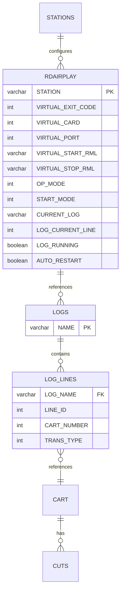
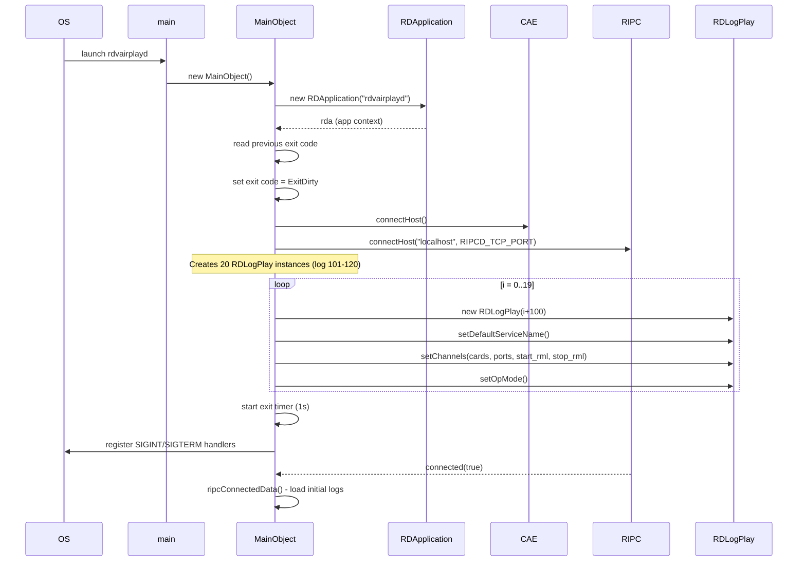
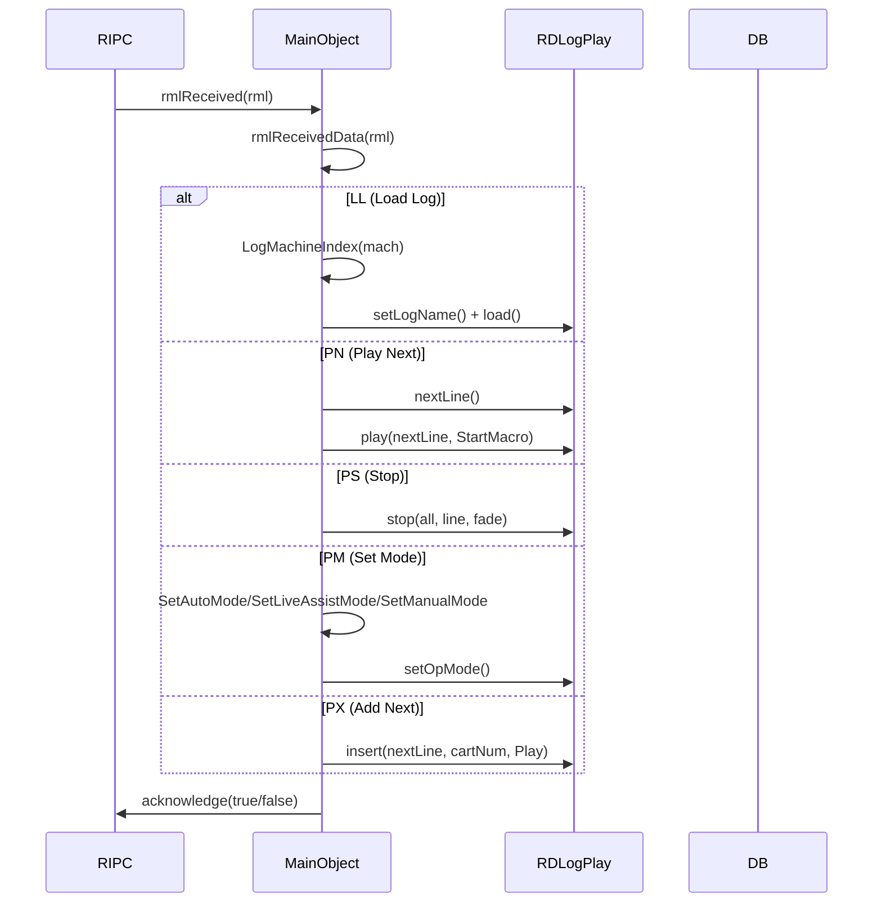
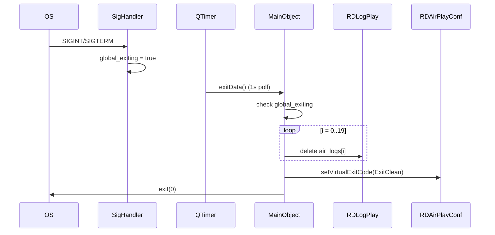
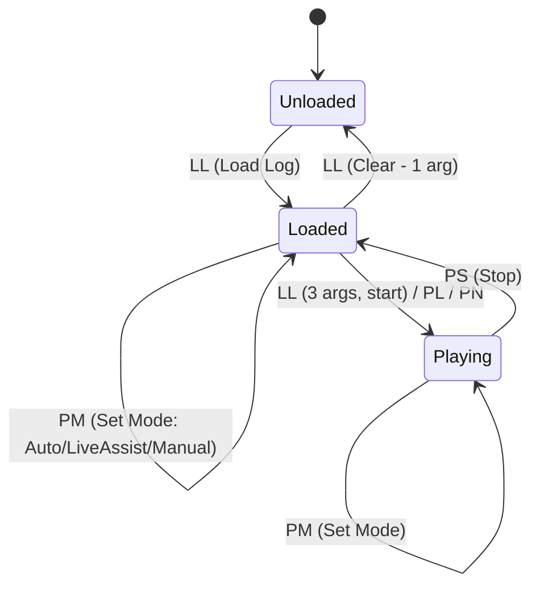
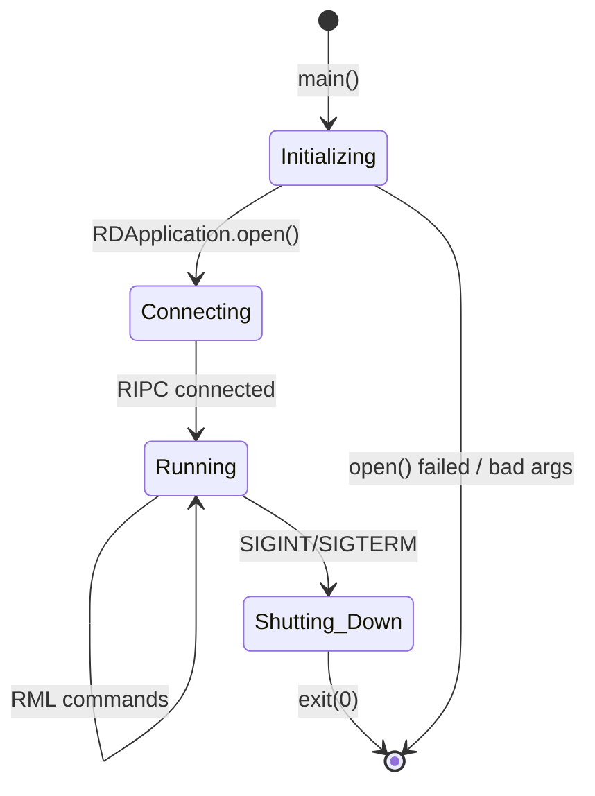

# Semantic Context: VAD (rdvairplayd)

## Files & Symbols

### Source Files
| File | Type | Symbols | LOC (est) |
|------|------|---------|-----------|
| rdvairplayd.h | header | MainObject (class), RDVAIRPLAYD_USAGE (macro) | ~30 |
| rdvairplayd.cpp | source | MainObject (ctor), ripcConnectedData, userData, logReloadedData, exitData, SetAutoMode, SetLiveAssistMode, SetManualMode, main, SigHandler, global_exiting | ~310 |
| local_macros.cpp | source | rmlReceivedData, LogMachineIndex | ~575 |

### Symbol Index
| Symbol | Kind | File | Qt Class? |
|--------|------|------|-----------|
| MainObject | Class | rdvairplayd.h | Yes (Q_OBJECT) |
| main | Function | rdvairplayd.cpp | No |
| SigHandler | Function | rdvairplayd.cpp | No |
| global_exiting | Variable | rdvairplayd.cpp | No |
| RDVAIRPLAYD_USAGE | Macro | rdvairplayd.h | No |

## Class API Surface

### MainObject [Service - Daemon Main Controller]
- **File:** rdvairplayd.h
- **Inherits:** QObject
- **Qt Object:** Yes (Q_OBJECT)
- **Purpose:** Headless daemon that manages "virtual" RDAirPlay log machines (log machines 101-120). Receives RML (Rivendell Macro Language) commands via the RIPC connection and delegates playback operations to RDLogPlay instances. Runs without a GUI as a background service.

#### Signals
None defined in this class (daemon does not emit signals).

#### Slots
| Slot | Visibility | Parameters | Description |
|------|-----------|-----------|-------------|
| ripcConnectedData | private | (bool state) | Called when RIPC connection is established; loads initial logs based on startup configuration (StartEmpty/StartPrevious/StartSpecified) |
| userData | private | () | Called when user changes; currently a no-op stub |
| rmlReceivedData | private | (RDMacro *rml) | Main RML command dispatcher; handles LL, AL, MN, PL, PM, PN, PS, MD, PX, RL, SN commands |
| logReloadedData | private | (int log) | Called after a log is reloaded; sets the next line and optionally starts playback based on saved state |
| exitData | private | () | Timer-driven (1s interval); checks global_exiting flag and performs clean shutdown |

#### Public Methods
| Method | Return | Parameters | Brief |
|--------|--------|-----------|-------|
| MainObject | (ctor) | (QObject *parent=0) | Initializes RDApplication, connects to CAE and RIPC, creates RDLogPlay instances for all virtual log machines, sets up signal handlers |

#### Private Methods
| Method | Return | Parameters | Brief |
|--------|--------|-----------|-------|
| SetAutoMode | void | (int index) | Sets log machine to Automatic operation mode |
| SetLiveAssistMode | void | (int index) | Sets log machine to Live Assist operation mode |
| SetManualMode | void | (int index) | Sets log machine to Manual operation mode |
| LogMachineIndex | int | (int log_mach, bool *all=NULL) const | Converts RML log machine number (101-120) to array index (0-19); returns -1 if out of range; sets *all=true if log_mach points to "all logs" address |

#### Fields
| Field | Type | Description |
|-------|------|-------------|
| air_logs | RDLogPlay*[RD_RDVAIRPLAY_LOG_QUAN] | Array of 20 virtual log machine playback engines |
| air_start_lognames | QString[RD_RDVAIRPLAY_LOG_QUAN] | Log names to load at startup |
| air_start_lines | int[RD_RDVAIRPLAY_LOG_QUAN] | Starting line numbers for log resume |
| air_start_starts | bool[RD_RDVAIRPLAY_LOG_QUAN] | Whether to auto-start playback on resume |
| air_event_player | RDEventPlayer* | Macro event player for RML execution |
| air_startup_datetime | QDateTime | Timestamp of daemon startup |
| air_previous_exit_code | RDAirPlayConf::ExitCode | Exit code from previous run (ExitClean/ExitDirty) |
| air_exit_timer | QTimer* | 1-second periodic timer checking for shutdown signal |

#### Constants (from lib/rd.h)
| Constant | Value | Description |
|----------|-------|-------------|
| RD_RDVAIRPLAY_LOG_BASE | 100 | Base log machine number for virtual airplay |
| RD_RDVAIRPLAY_LOG_QUAN | 20 | Number of virtual log machines supported |

#### Enums
None defined in this class. Uses enums from library:
- `RDAirPlayConf::OpMode` (Auto, LiveAssist, Manual)
- `RDAirPlayConf::StartMode` (StartEmpty, StartPrevious, StartSpecified)
- `RDAirPlayConf::ExitCode` (ExitClean, ExitDirty)
- `RDMacro::Role` (Cmd)
- `RDMacro` command codes (LL, AL, MN, PL, PM, PN, PS, MD, PX, RL, SN)
- `RDLogLine::TransType` (Play, Segue, Stop, NoTrans)
- `RDLogLine::Status` (Scheduled)
- `RDLogLine::StartSource` (StartMacro)

### Standalone Functions

#### SigHandler
- **File:** rdvairplayd.cpp
- **Signature:** `void SigHandler(int signo)`
- **Description:** Unix signal handler for SIGINT and SIGTERM. Sets global_exiting flag to true, which is polled by exitData() timer slot.

#### main
- **File:** rdvairplayd.cpp
- **Signature:** `int main(int argc, char *argv[])`
- **Description:** Creates QApplication (headless, no GUI), instantiates MainObject, enters Qt event loop.

## Data Model

This daemon performs minimal direct SQL access. The bulk of database operations are delegated to library classes (RDLogPlay, RDLog, RDAirPlayConf, etc.).

### Direct SQL Access

#### Table: LOGS (read-only)
| Column Used | Type | Operation |
|-------------|------|-----------|
| NAME | varchar | SELECT (existence check) |

- **Query:** `SELECT NAME FROM LOGS WHERE NAME="{logname}"` (rdvairplayd.cpp:232)
- **Purpose:** Verify that a log exists before attempting to load it via RML command
- **CRUD Classes:** MainObject::ripcConnectedData (SELECT only)

### Indirect Database Access (via LIB classes)
| Library Class | Tables Accessed | Operations | Used For |
|--------------|----------------|------------|----------|
| RDApplication | STATIONS, SYSTEM, RDAIRPLAY | R | Configuration loading, station info |
| RDAirPlayConf | RDAIRPLAY | R/W | Virtual airplay configuration: start modes, exit codes, current log, cards, ports, RMLs, op modes |
| RDLogPlay | LOG_LINES, CART, CUTS | R/W | Log playback engine: load, play, stop, append, refresh, insert, makeNext |
| RDLog | LOGS | R | Log existence check (static method) |
| RDStation | STATIONS | R | Card driver info, card output counts |
| RDConfig | rd.conf | R | System password, config file parsing |

### ERD (Relevant Tables)


## Reactive Architecture

### Signal/Slot Connections
| # | Sender | Signal | Receiver | Slot | File:Line |
|---|--------|--------|----------|------|-----------|
| 1 | rda->ripc() | connected(bool) | this (MainObject) | ripcConnectedData(bool) | rdvairplayd.cpp:99 |
| 2 | rda | userChanged() | this (MainObject) | userData() | rdvairplayd.cpp:101 |
| 3 | rda->ripc() | rmlReceived(RDMacro*) | this (MainObject) | rmlReceivedData(RDMacro*) | rdvairplayd.cpp:102 |
| 4 | reload_mapper (QSignalMapper) | mapped(int) | this (MainObject) | logReloadedData(int) | rdvairplayd.cpp:118 |
| 5 | air_logs[i] (RDLogPlay) | reloaded() | reload_mapper (QSignalMapper) | map() | rdvairplayd.cpp:127 |
| 6 | air_logs[i] (RDLogPlay) | renamed() | rename_mapper (QSignalMapper) | map() | rdvairplayd.cpp:129 |
| 7 | air_exit_timer (QTimer) | timeout() | this (MainObject) | exitData() | rdvairplayd.cpp:161 |

### Emit Statements
None. This daemon does not emit any signals. It only receives them.

### Key Sequence Diagrams

#### Startup Sequence


#### RML Command Processing


#### Graceful Shutdown


### Cross-Artifact Dependencies
| External Class | From Artifact | Used In Files | Purpose |
|---------------|---------------|---------------|---------|
| RDApplication | LIB | rdvairplayd.cpp | Application context, DB, config access |
| RDLogPlay | LIB | rdvairplayd.cpp, local_macros.cpp | Log playback engine (core functionality) |
| RDEventPlayer | LIB | rdvairplayd.cpp | RML macro event execution |
| RDAirPlayConf | LIB | rdvairplayd.cpp | Virtual airplay configuration |
| RDStation | LIB | rdvairplayd.cpp | Station hardware config (cards, ports) |
| RDConfig | LIB | rdvairplayd.cpp | System config (password) |
| RDMacro | LIB | local_macros.cpp | RML command representation |
| RDLog | LIB | local_macros.cpp | Log existence check |
| RDLogLine | LIB | local_macros.cpp | Log line status/transport type |
| RDSqlQuery | LIB | rdvairplayd.cpp | Direct SQL query wrapper |
| QSignalMapper | Qt | rdvairplayd.cpp | Map multiple log signals to single slot |

## Business Rules

### Rule: Log Machine Index Validation
- **Source:** local_macros.cpp:592-602
- **Trigger:** Any RML command targeting a log machine
- **Condition:** `log_mach <= RD_RDVAIRPLAY_LOG_BASE (100)` OR `log_mach > RD_RDVAIRPLAY_LOG_BASE + RD_RDVAIRPLAY_LOG_QUAN (120)`
- **Action:** Returns -1 (invalid), causing the RML command to be rejected with negative acknowledgment
- **Special:** When `log_mach - RD_RDVAIRPLAY_LOG_BASE == 0` (i.e., log_mach == 100+1?), sets `*all=true` to indicate "all logs" addressing
- **Gherkin:**
  ```gherkin
  Scenario: Reject RML command for invalid log machine number
    Given an RML command targeting log machine number 50
    When the command is received
    Then the command is rejected with negative acknowledgment

  Scenario: Accept RML command for valid virtual log machine
    Given an RML command targeting log machine number 105
    When the command is received
    Then the command is processed for virtual log index 4
  ```

### Rule: Startup Log Loading - StartPrevious Mode
- **Source:** rdvairplayd.cpp:193-213
- **Trigger:** RIPC connection established (ripcConnectedData)
- **Condition:** `startMode(mach) == StartPrevious`
- **Action:**
  1. Load the previously-playing log name (with date/time macro expansion)
  2. If previous exit was dirty (crash/kill): restore line position and auto-restart if configured
  3. If previous exit was clean: start from line 0, no auto-start
- **Gherkin:**
  ```gherkin
  Scenario: Resume log after dirty exit
    Given the previous exit code was ExitDirty
    And start mode is StartPrevious
    And the previous log was "MyLog" at line 15 and was running
    When rdvairplayd connects to RIPC
    Then it loads "MyLog" and resumes at line 15
    And auto-starts playback if autoRestart is enabled

  Scenario: Clean restart with StartPrevious
    Given the previous exit code was ExitClean
    And start mode is StartPrevious
    When rdvairplayd connects to RIPC
    Then it loads the previous log starting at line 0
    And does not auto-start playback
  ```

### Rule: Startup Log Loading - StartSpecified Mode
- **Source:** rdvairplayd.cpp:214-230
- **Trigger:** RIPC connection established (ripcConnectedData)
- **Condition:** `startMode(mach) == StartSpecified`
- **Action:**
  1. Load the configured log name (with date/time macro expansion)
  2. If dirty exit AND the specified log matches what was previously playing: restore position
  3. Otherwise: start from line 0
- **Gherkin:**
  ```gherkin
  Scenario: Resume specified log after dirty exit
    Given the previous exit code was ExitDirty
    And start mode is StartSpecified with log "DailyLog"
    And "DailyLog" was the log playing when the crash occurred
    When rdvairplayd connects to RIPC
    Then it loads "DailyLog" and resumes at the saved line position
  ```

### Rule: Log Existence Verification Before Load
- **Source:** rdvairplayd.cpp:231-249
- **Trigger:** Attempting to load an initial log
- **Condition:** SQL check: `SELECT NAME FROM LOGS WHERE NAME="{logname}"`
- **Action:** If log does not exist, log a WARNING via syslog and skip loading
- **Gherkin:**
  ```gherkin
  Scenario: Skip loading non-existent log
    Given start mode references log "MissingLog"
    And "MissingLog" does not exist in the LOGS table
    When rdvairplayd attempts to load initial logs
    Then a WARNING is logged "vlog N: log "MissingLog" doesn't exist"
    And no load command is sent
  ```

### Rule: RML Command - Load Log (LL)
- **Source:** local_macros.cpp:47-137
- **Trigger:** RML LL command received
- **Condition:** 1-3 arguments required
- **Action:**
  - 1 arg: Clear/unload the log
  - 2 args: Load specified log into machine (verifies log exists via RDLog::exists)
  - 3 args: Load and start at specified line; arg2=-2 means "start if transition type allows" (Play/Segue start, Stop/NoTrans don't)
- **Gherkin:**
  ```gherkin
  Scenario: Load and start log conditionally (arg=-2)
    Given an LL command with machine=105, log="MyLog", startLine=-2
    And the first scheduled event has transition type Segue
    When the command is processed
    Then the log is loaded and playback starts at line 0

  Scenario: Load and start log conditionally - Stop transition
    Given an LL command with machine=105, log="MyLog", startLine=-2
    And the first scheduled event has transition type Stop
    When the command is processed
    Then the log is loaded but playback does NOT start
  ```

### Rule: RML Command - Stop (PS) with All-Logs Support
- **Source:** local_macros.cpp:388-425
- **Trigger:** RML PS command received
- **Condition:** 1-3 args; log machine can target "all" via special address
- **Action:**
  - If all_logs flag: stops all 20 virtual log machines
  - If specific machine: stops with optional fade time and specific line
- **Gherkin:**
  ```gherkin
  Scenario: Stop all virtual log machines
    Given a PS command targeting all logs (machine address triggers all=true)
    When the command is processed
    Then all 20 virtual log machines are stopped

  Scenario: Stop single log machine with fade
    Given a PS command for machine 105 with fade=500ms
    When the command is processed
    Then log machine 105 is stopped with a 500ms fade
  ```

### Rule: RML Command - Set Mode (PM)
- **Source:** local_macros.cpp:248-299
- **Trigger:** RML PM command received
- **Condition:** 1-2 args: mode (required), machine (optional)
- **Action:**
  - If machine specified: set that machine's mode
  - If no machine specified: set ALL machines to the given mode
  - Modes: Auto (0), LiveAssist (1), Manual (2)
- **Gherkin:**
  ```gherkin
  Scenario: Set all machines to Auto mode
    Given a PM command with mode=0 and no machine specified
    When the command is processed
    Then all 20 virtual log machines are set to Automatic mode
  ```

### Rule: RML Command - Duck Machine (MD) Volume Control
- **Source:** local_macros.cpp:427-467
- **Trigger:** RML MD command received
- **Condition:** 3-4 args: machine, level (dBFS), duration; optional: specific line
- **Action:** Adjusts volume (ducking) on one or all log machines. Level is multiplied by 100 internally.
- **Gherkin:**
  ```gherkin
  Scenario: Duck all log machines
    Given an MD command targeting all logs with level=-10 dBFS and duration=500ms
    When the command is processed
    Then all 20 virtual log machines have volume set to -10 dBFS over 500ms
  ```

### Rule: RML Command - Add Next (PX)
- **Source:** local_macros.cpp:469-507
- **Trigger:** RML PX command received
- **Condition:** 2 args: machine, cart number (must be <= 999999)
- **Action:** Inserts a cart at the next-play position. If no next line exists, appends to end and makes it next.
- **Gherkin:**
  ```gherkin
  Scenario: Insert cart before next event
    Given a PX command for machine 105 with cart 001234
    And the next line is 5
    When the command is processed
    Then cart 001234 is inserted at line 5

  Scenario: Insert cart into empty log
    Given a PX command for machine 105 with cart 001234
    And there is no next line
    When the command is processed
    Then cart 001234 is appended at the end and made the next event
  ```

### Rule: RML Command - Set Now/Next Cart (SN)
- **Source:** local_macros.cpp:541-585
- **Trigger:** RML SN command received
- **Condition:** 3 args: "now"/"next" keyword, machine, cart number (must be <= 999999)
- **Action:** Sets the default "now playing" or "next up" notification cart for a log machine
- **Gherkin:**
  ```gherkin
  Scenario: Set default Now cart
    Given an SN command with type="now", machine=105, cart=002000
    When the command is processed
    Then log machine 105's default "now" cart is set to 002000
  ```

### Rule: Dirty Exit Code Management
- **Source:** rdvairplayd.cpp:73, 310
- **Trigger:** Daemon startup and shutdown
- **Condition:** On startup, set exit code to ExitDirty immediately; on clean shutdown, set to ExitClean
- **Action:** Allows detection of crashes - if exit code is still Dirty on next startup, the daemon knows the previous run did not exit cleanly and can attempt to resume playback state
- **Gherkin:**
  ```gherkin
  Scenario: Detect previous crash on startup
    Given rdvairplayd was killed without clean shutdown
    When rdvairplayd starts again
    Then the previous exit code is ExitDirty
    And logs are resumed from their saved positions
  ```

### Rule: Card/Port Validation
- **Source:** rdvairplayd.cpp:133-142
- **Trigger:** Log machine initialization
- **Condition:** If card driver is None, or port number exceeds card output count
- **Action:** Sets cards and ports to -1 (disabled), effectively disabling audio output for that log machine
- **Gherkin:**
  ```gherkin
  Scenario: Disable audio for unconfigured card
    Given virtual log machine 101 is configured with card 2
    And card 2 has driver type None
    When rdvairplayd initializes
    Then log machine 101's audio output is disabled (card=-1, port=-1)
  ```

### State Machines

#### RML Command Processing State (per log machine)


#### Daemon Lifecycle


### Configuration Keys
| Source | Key/Method | Type | Description |
|--------|-----------|------|-------------|
| RDAirPlayConf | virtualExitCode() | ExitCode enum | Previous exit state (Clean/Dirty) |
| RDAirPlayConf | startMode(mach) | StartMode enum | How to initialize log on startup |
| RDAirPlayConf | currentLog(mach) | QString | Name of log that was playing |
| RDAirPlayConf | logCurrentLine(mach) | int | Line number where playback was |
| RDAirPlayConf | autoRestart(mach) | bool | Whether to auto-restart after dirty exit |
| RDAirPlayConf | logRunning(mach) | bool | Whether log was running at exit |
| RDAirPlayConf | logName(mach) | QString | Specified log name for StartSpecified mode |
| RDAirPlayConf | virtualCard(mach) | int | Audio card assignment |
| RDAirPlayConf | virtualPort(mach) | int | Audio port assignment |
| RDAirPlayConf | virtualStartRml(mach) | QString | RML to execute on channel start |
| RDAirPlayConf | virtualStopRml(mach) | QString | RML to execute on channel stop |
| RDAirPlayConf | opMode(mach) | OpMode enum | Operation mode (Auto/LiveAssist/Manual) |
| RDAirPlayConf | defaultSvc() | QString | Default service name |
| RDAirPlayConf | logNowCart(i) | unsigned | Default "now playing" notification cart |
| RDAirPlayConf | logNextCart(i) | unsigned | Default "next up" notification cart |
| RDStation | cardDriver(card) | DriverType enum | Audio card driver type |
| RDStation | cardOutputs(card) | int | Number of outputs on card |
| RDConfig | password() | QString | RIPC connection password |

### Error/Log Patterns
| Level | Condition | Message |
|-------|-----------|---------|
| WARNING | Log does not exist in DB at startup | "vlog N: log "X" doesn't exist" |
| WARNING | Line exceeds log size after reload | "vlog N: line N doesn't exist in log "X"" |
| WARNING | Log machine fails to start | "log machine N failed to start" |
| INFO | Log loaded | "loaded log "X" into log machine N" |
| INFO | Log unloaded | "unloaded log machine N" |
| INFO | Log started | "started log machine N at line N" |
| INFO | Log stopped | "stopped log machine N" / "stopped all logs" |
| INFO | All logs stopped | "stopped all logs" |
| INFO | Mode change | "log machine N mode set to AUTOMATIC/LIVE ASSIST/MANUAL" |
| INFO | Log appended | "appended log "X" into log machine N" |
| INFO | Make next | "made line N next in log machine N" |
| INFO | Cart inserted | "inserted cart NNNNNN at line N on log machine N" |
| INFO | Log refreshed | "refreshed log machine N" |
| INFO | Now/Next cart set | "set default "now"/"next" cart to NNNNNN on log machine N" |
| INFO | Volume ducked | "set volumne of log machine N to N dBFS" (note: typo "volumne" in source) |
| INFO | Clean exit | "exiting" |

### RML Command Summary
| Command | Code | Args | Description |
|---------|------|------|-------------|
| LL | Load Log | 1-3 | Load/clear/start a log |
| AL | Append Log | 2 | Append a log to existing |
| MN | Make Next | 2 | Set next line to play |
| PL | Start | 2 | Start playback at line |
| PM | Set Mode | 1-2 | Set operation mode |
| PN | Play Next | 1-3 | Start next scheduled event |
| PS | Stop | 1-3 | Stop playback (with optional fade) |
| MD | Duck Machine | 3-4 | Adjust volume/ducking |
| PX | Add Next | 2 | Insert cart before next event |
| RL | Refresh Log | 1 | Refresh log from DB |
| SN | Set Now/Next | 3 | Set default now/next cart |
