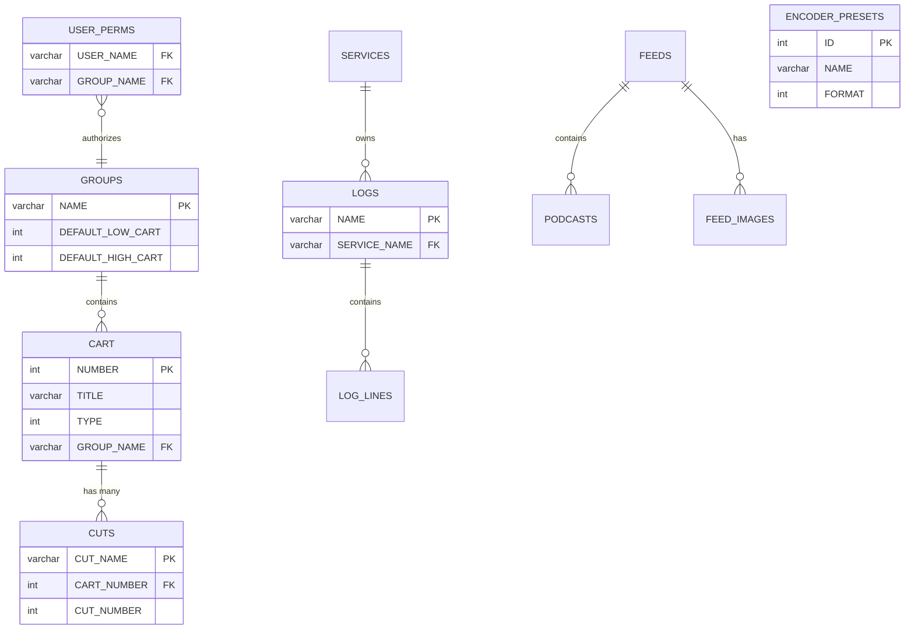
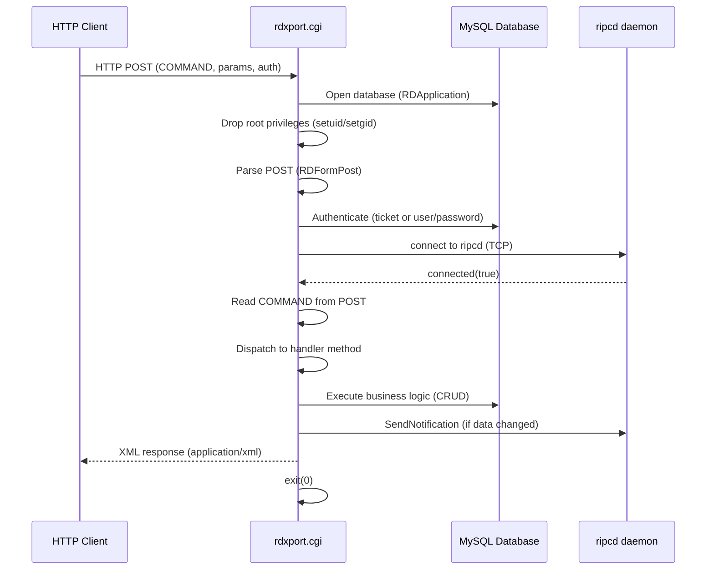
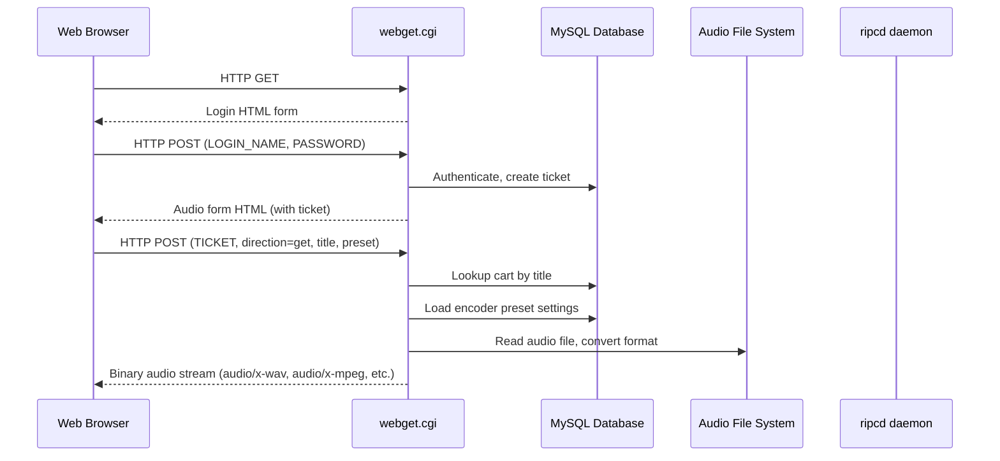
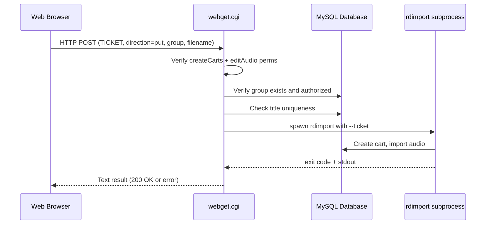
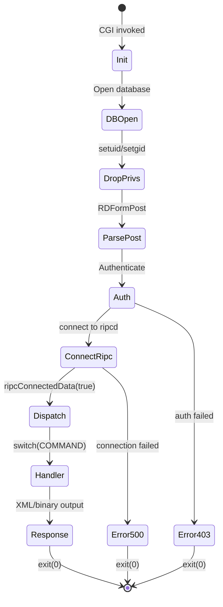
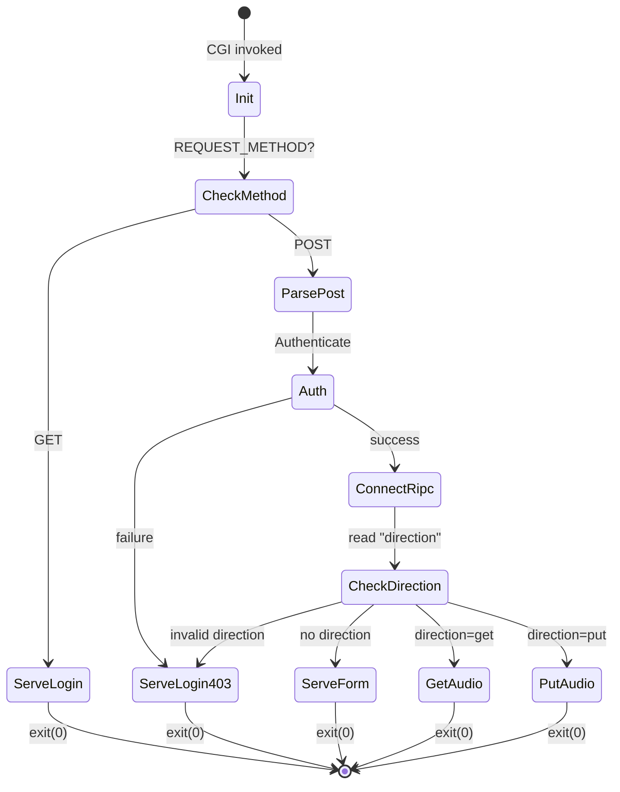

## Files & Symbols

### Source Files

| File | Type | Symbols | LOC (est) |
|------|------|---------|-----------|
| web/rdxport/rdxport.h | header | Xport, LockLogOperation | ~80 |
| web/rdxport/rdxport.cpp | source | Xport::Xport, Xport::Authenticate, Xport::TryCreateTicket, Xport::SendNotification, Xport::Exit, Xport::XmlExit, main() | ~300 |
| web/rdxport/carts.cpp | source | Xport::AddCart, ListCarts, ListCart, EditCart, RemoveCart, AddCut, ListCuts, ListCut, EditCut, CheckPointerValidity, RemoveCut | ~800 |
| web/rdxport/logs.cpp | source | Xport::AddLog, DeleteLog, ListLogs, ListLog, SaveLog, LockLog, GetLogService, ServiceUserValid, LogLockXml | ~600 |
| web/rdxport/podcasts.cpp | source | Xport::SavePodcast, GetPodcast, DeletePodcast, PostPodcast, RemovePodcast, PostRssElemental, PostRss, RemoveRss, PostImage, RemoveImage; __PostRss_Readfunction_Callback | ~700 |
| web/rdxport/groups.cpp | source | Xport::ListGroups, ListGroup | ~100 |
| web/rdxport/services.cpp | source | Xport::ListServices | ~80 |
| web/rdxport/schedcodes.cpp | source | Xport::ListSchedCodes, AssignSchedCode, UnassignSchedCode, ListCartSchedCodes | ~200 |
| web/rdxport/import.cpp | source | Xport::Import | ~200 |
| web/rdxport/export.cpp | source | Xport::Export | ~150 |
| web/rdxport/audioinfo.cpp | source | Xport::AudioInfo | ~80 |
| web/rdxport/audiostore.cpp | source | Xport::AudioStore | ~80 |
| web/rdxport/copyaudio.cpp | source | Xport::CopyAudio | ~80 |
| web/rdxport/trimaudio.cpp | source | Xport::TrimAudio | ~80 |
| web/rdxport/deleteaudio.cpp | source | Xport::DeleteAudio | ~50 |
| web/rdxport/exportpeaks.cpp | source | Xport::ExportPeaks | ~80 |
| web/rdxport/rehash.cpp | source | Xport::Rehash | ~50 |
| web/rdxport/systemsettings.cpp | source | Xport::ListSystemSettings | ~80 |
| web/rdxport/tests.cpp | source | Xport::SaveString, Xport::SaveFile | ~100 |
| web/webget/webget.h | header | MainObject | ~25 |
| web/webget/webget.cpp | source | MainObject::MainObject, GetAudio, PutAudio, ServeForm, ServeLogin, Authenticate, SaveSourceFile, Exit, TextExit, main() | ~400 |

### Symbol Index

| Symbol | Kind | File | Qt Class? |
|--------|------|------|-----------|
| Xport | Class | web/rdxport/rdxport.h | Yes (Q_OBJECT) |
| Xport::LockLogOperation | Enum | web/rdxport/rdxport.h | -- |
| MainObject | Class | web/webget/webget.h | Yes (Q_OBJECT) |
| __PostRss_Readfunction_Callback | Function | web/rdxport/podcasts.cpp | No |
| main (rdxport) | Function | web/rdxport/rdxport.cpp | No |
| main (webget) | Function | web/webget/webget.cpp | No |

## Class API Surface

### Xport [CGI Service / API Endpoint Dispatcher]
- **File:** web/rdxport/rdxport.h
- **Inherits:** QObject
- **Qt Object:** Yes (Q_OBJECT)
- **Runtime Identity:** rdxport.cgi -- CGI-based web service dispatching REST-like commands via HTTP POST
- **Architecture:** Single-request CGI process. Constructor opens DB, drops root privs, parses POST, authenticates, connects to ripcd. On ripcd connection, reads COMMAND integer and dispatches to handler method. Each handler outputs XML or binary response via printf(), then calls exit(0).

#### Slots
| Slot | Visibility | Parameters | Description |
|------|-----------|-----------|-------------|
| ripcConnectedData | private | (bool state) | Fires on ripcd connection; reads COMMAND from POST and dispatches to appropriate handler method via large switch statement |

#### Enums
| Enum | Values |
|------|--------|
| LockLogOperation | LockLogCreate=0, LockLogUpdate=1, LockLogClear=2 |

#### Private Fields
| Field | Type | Description |
|-------|------|-------------|
| xport_post | RDFormPost* | Parsed HTTP POST data |
| xport_remote_hostname | QString | Client hostname |
| xport_remote_address | QHostAddress | Client IP address |
| xport_curl_data | QByteArray | cURL data buffer |
| xport_curl_data_ptr | char* | cURL data pointer |

#### API Command Methods (all private, dispatched via COMMAND integer)

**Authentication & Infrastructure:**
| Method | COMMAND Constant | POST Parameters | Response | Description |
|--------|-----------------|----------------|----------|-------------|
| Authenticate() | -- | LOGIN_NAME, PASSWORD or TICKET | bool | Validates credentials via RDFormPost::authenticate(); on success with password, tries to create ticket |
| TryCreateTicket(name) | RDXPORT_COMMAND_CREATETICKET | COMMAND | XML ticketInfo (ticket, expires) | Creates auth ticket if COMMAND==CREATETICKET |
| SendNotification(type, action, id) | -- | -- | -- | Sends RDNotification via ripcd for real-time event propagation |
| Exit(code) | -- | -- | -- | Process exit |
| XmlExit(str, code, srcfile, srcline, err) | -- | -- | XML RDWebResult | Outputs XML error/status response and calls exit(0) |

**Cart Management:**
| Method | COMMAND Constant | Required POST Parameters | Response | Description |
|--------|-----------------|------------------------|----------|-------------|
| AddCart() | RDXPORT_COMMAND_ADDCART | GROUP_NAME, TYPE | XML cartAdd with cart XML | Creates new cart in group; optional CART_NUMBER |
| ListCarts() | RDXPORT_COMMAND_LISTCARTS | -- | XML cartList | Lists carts; optional GROUP_NAME, FILTER, TYPE, INCLUDE_CUTS |
| ListCart() | RDXPORT_COMMAND_LISTCART | CART_NUMBER | XML cartList | Returns single cart XML; optional INCLUDE_CUTS |
| EditCart() | RDXPORT_COMMAND_EDITCART | CART_NUMBER | XML cartList | Updates cart metadata (TITLE, ARTIST, ALBUM, YEAR, SONG_ID, LABEL, CLIENT, AGENCY, PUBLISHER, COMPOSER, CONDUCTOR, USER_DEFINED, USAGE_CODE, ENFORCE_LENGTH, FORCED_LENGTH, ASYNCRONOUS, OWNER, NOTES, SCHED_CODES, GROUP_NAME, MACROn); optional INCLUDE_CUTS |
| RemoveCart() | RDXPORT_COMMAND_REMOVECART | CART_NUMBER | XML OK | Deletes cart and all associated data |

**Cut Management:**
| Method | COMMAND Constant | Required POST Parameters | Response | Description |
|--------|-----------------|------------------------|----------|-------------|
| AddCut() | RDXPORT_COMMAND_ADDCUT | CART_NUMBER | XML cutAdd | Creates new cut for cart |
| ListCuts() | RDXPORT_COMMAND_LISTCUTS | CART_NUMBER | XML cutList | Lists all cuts for a cart |
| ListCut() | RDXPORT_COMMAND_LISTCUT | CART_NUMBER, CUT_NUMBER | XML cutList | Returns single cut |
| EditCut() | RDXPORT_COMMAND_EDITCUT | CART_NUMBER, CUT_NUMBER | XML cutList | Updates cut metadata |
| CheckPointerValidity() | -- | -- | -- | Validates pointer values for a cut |
| RemoveCut() | RDXPORT_COMMAND_REMOVECUT | CART_NUMBER, CUT_NUMBER | XML OK | Deletes a cut |

**Audio Operations:**
| Method | COMMAND Constant | Required POST Parameters | Response | Description |
|--------|-----------------|------------------------|----------|-------------|
| Export() | RDXPORT_COMMAND_EXPORT | CART_NUMBER, CUT_NUMBER, FORMAT, CHANNELS, SAMPLE_RATE, BIT_RATE, QUALITY, START_POINT, END_POINT, NORMALIZATION_LEVEL, ENABLE_METADATA | Binary audio stream (wav/mpeg/ogg/flac) | Converts and streams audio file |
| Import() | RDXPORT_COMMAND_IMPORT | CART_NUMBER, CUT_NUMBER, CHANNELS, NORMALIZATION_LEVEL, AUTOTRIM_LEVEL, USE_METADATA, FILENAME (file upload) | XML RDWebResult with CartNumber, CutNumber | Imports audio file into cart/cut; optional CREATE, GROUP_NAME, TITLE |
| DeleteAudio() | RDXPORT_COMMAND_DELETEAUDIO | CART_NUMBER, CUT_NUMBER | XML OK | Deletes audio file and energy data for cut |
| CopyAudio() | RDXPORT_COMMAND_COPYAUDIO | SOURCE_CART_NUMBER, SOURCE_CUT_NUMBER, DESTINATION_CART_NUMBER, DESTINATION_CUT_NUMBER | XML OK | Copies audio between cuts |
| TrimAudio() | RDXPORT_COMMAND_TRIMAUDIO | CART_NUMBER, CUT_NUMBER, TRIM_LEVEL | XML with trimPoint | Returns trim points for specified level |
| AudioInfo() | RDXPORT_COMMAND_AUDIOINFO | CART_NUMBER, CUT_NUMBER | XML audioInfo | Returns audio file metadata (frames, channels, sample_rate, bit_rate) |
| AudioStore() | RDXPORT_COMMAND_AUDIOSTORE | -- | XML audioStore | Returns audio store capacity info |
| ExportPeaks() | RDXPORT_COMMAND_EXPORT_PEAKS | CART_NUMBER, CUT_NUMBER | Binary peak data | Exports waveform peak energy data |
| Rehash() | RDXPORT_COMMAND_REHASH | CART_NUMBER, CUT_NUMBER | XML OK | Recalculates SHA-1 hash for audio file |

**Log Management:**
| Method | COMMAND Constant | Required POST Parameters | Response | Description |
|--------|-----------------|------------------------|----------|-------------|
| AddLog() | RDXPORT_COMMAND_ADDLOG | LOG_NAME, SERVICE_NAME | XML OK | Creates new log |
| DeleteLog() | RDXPORT_COMMAND_DELETELOG | LOG_NAME | XML OK | Deletes a log |
| ListLogs() | RDXPORT_COMMAND_LISTLOGS | -- | XML logList | Lists logs; optional SERVICE_NAME, LOG_NAME (filter), TRACKABLE |
| ListLog() | RDXPORT_COMMAND_LISTLOG | NAME | XML logList with logLines | Returns log with all lines |
| SaveLog() | RDXPORT_COMMAND_SAVELOG | LOG_NAME, SERVICE_NAME, DESCRIPTION, PURGE_DATE, AUTO_REFRESH, START_DATE, END_DATE, LINE_QUANTITY, LINE0..N_* (per-line fields: ID, TYPE, CART_NUMBER, TIME_TYPE, START_TIME, GRACE_TIME, TRANS_TYPE, START_POINT, END_POINT, SEGUE_START_POINT, SEGUE_END_POINT, FADEUP_POINT, FADEUP_GAIN, FADEDOWN_POINT, FADEDOWN_GAIN, DUCK_UP_GAIN, DUCK_DOWN_GAIN, COMMENT, LABEL, ORIGIN_USER, ORIGIN_DATETIME, EVENT_LENGTH, LINK_EVENT_NAME, LINK_START_TIME, LINK_LENGTH, LINK_START_SLOP, LINK_END_SLOP, LINK_ID, LINK_EMBEDDED, EXT_START_TIME, EXT_CART_NAME, EXT_DATA, EXT_EVENT_ID, EXT_ANNC_TYPE) | XML OK with event count | Saves complete log with all lines; acquires/validates log lock |
| LockLog() | RDXPORT_COMMAND_LOCKLOG | LOG_NAME, OPERATION (create/update/clear), LOCK_GUID | XML logLock | Manages log locking (create/update/clear operations) |
| GetLogService() | -- | service_name | -- | Helper: verifies service exists |
| ServiceUserValid() | -- | service_name | bool | Helper: checks if user has perms for service |
| LogLockXml() | -- | -- | QString XML | Helper: generates XML for log lock response |

**Group & SchedCode Management:**
| Method | COMMAND Constant | Required POST Parameters | Response | Description |
|--------|-----------------|------------------------|----------|-------------|
| ListGroups() | RDXPORT_COMMAND_LISTGROUPS | -- | XML groupList | Lists all groups user has access to |
| ListGroup() | RDXPORT_COMMAND_LISTGROUP | GROUP_NAME | XML groupList | Returns single group details |
| ListSchedCodes() | RDXPORT_COMMAND_LISTSCHEDCODES | -- | XML schedCodeList | Lists all scheduler codes |
| AssignSchedCode() | RDXPORT_COMMAND_ASSIGNSCHEDCODE | CART_NUMBER, CODE | XML OK | Assigns scheduler code to cart |
| UnassignSchedCode() | RDXPORT_COMMAND_UNASSIGNSCHEDCODE | CART_NUMBER, CODE | XML OK | Removes scheduler code from cart |
| ListCartSchedCodes() | RDXPORT_COMMAND_LISTCARTSCHEDCODES | CART_NUMBER | XML schedCodeList | Lists scheduler codes for a cart |

**Service & System:**
| Method | COMMAND Constant | Required POST Parameters | Response | Description |
|--------|-----------------|------------------------|----------|-------------|
| ListServices() | RDXPORT_COMMAND_LISTSERVICES | -- | XML serviceList | Lists services; optional TRACKABLE |
| ListSystemSettings() | RDXPORT_COMMAND_LISTSYSTEMSETTINGS | -- | XML systemSettings | Returns system-wide settings |

**Podcast/RSS Management:**
| Method | COMMAND Constant | Required POST Parameters | Response | Description |
|--------|-----------------|------------------------|----------|-------------|
| SavePodcast() | RDXPORT_COMMAND_SAVE_PODCAST | ID + metadata fields | XML OK | Saves podcast episode metadata |
| GetPodcast() | RDXPORT_COMMAND_GET_PODCAST | ID | XML podcast | Returns podcast episode |
| DeletePodcast() | RDXPORT_COMMAND_DELETE_PODCAST | ID | XML OK | Deletes podcast episode |
| PostPodcast() | RDXPORT_COMMAND_POST_PODCAST | ID | text OK | Uploads podcast audio to remote server via RDUpload |
| RemovePodcast() | RDXPORT_COMMAND_REMOVE_PODCAST | ID | text OK | Removes podcast audio from remote server |
| PostRss() | RDXPORT_COMMAND_POST_RSS | ID (feed) | text OK | Generates and uploads RSS XML feed |
| PostRssElemental() | -- | -- | -- | Helper: generates individual RSS item XML |
| RemoveRss() | RDXPORT_COMMAND_REMOVE_RSS | ID (feed) | text OK | Removes RSS feed from remote server |
| PostImage() | RDXPORT_COMMAND_POST_IMAGE | ID (image), FEED_ID | text OK | Uploads feed image to remote server |
| RemoveImage() | RDXPORT_COMMAND_REMOVE_IMAGE | ID (image), FEED_ID | text OK | Removes feed image from remote server |

**Test/Debug:**
| Method | COMMAND Constant | Required POST Parameters | Response | Description |
|--------|-----------------|------------------------|----------|-------------|
| SaveString() | RDXPORT_COMMAND_SAVESTRING | -- | XML OK | Test endpoint for string encoding |
| SaveFile() | RDXPORT_COMMAND_SAVEFILE | FILENAME | XML OK | Test endpoint for file upload |

---

### MainObject [CGI Service / Web UI + Audio Transfer]
- **File:** web/webget/webget.h
- **Inherits:** QObject
- **Qt Object:** Yes (Q_OBJECT)
- **Runtime Identity:** webget.cgi -- CGI-based web application for browser-based audio get/put
- **Architecture:** Single-request CGI process. Supports GET (serves login page) and POST (processes audio transfer). Authentication via ticket or username/password. On POST, dispatches based on "direction" parameter: "get" downloads audio, "put" uploads audio. Serves HTML forms directly via printf().

#### Slots
| Slot | Visibility | Parameters | Description |
|------|-----------|-----------|-------------|
| ripcConnectedData | private | (bool state) | Fires on ripcd connection; reads "direction" POST field and dispatches to GetAudio/PutAudio or serves form |

#### Private Fields
| Field | Type | Description |
|-------|------|-------------|
| webget_post | RDFormPost* | Parsed HTTP POST data |
| webget_remote_hostname | QString | Client hostname |
| webget_remote_username | QString | Authenticated username |
| webget_remote_password | QString | User's password (during auth) |
| webget_ticket | QString | Authentication ticket |
| webget_remote_address | QHostAddress | Client IP address |

#### Private Methods
| Method | Parameters | Return | Description |
|--------|-----------|--------|-------------|
| GetAudio() | () | void | Downloads audio: looks up cart by title, converts to requested format preset, streams binary audio (wav/mpeg/ogg/flac). POST params: title, preset |
| PutAudio() | () | void | Uploads audio: validates createCarts+editAudio perms, validates group access, checks title uniqueness, invokes rdimport subprocess. POST params: group, filename (file upload). Sends email notification on success/failure |
| ServeForm() | () | void | Serves authenticated HTML form with Get/Put audio sections. Populates format presets from ENCODER_PRESETS table, groups from USER_PERMS. Includes JavaScript for async operations |
| ServeLogin(resp_code) | (int resp_code) | void | Serves HTML login form with LOGIN_NAME and PASSWORD fields. Form POSTs to /rd-bin/webget.cgi |
| Authenticate() | () | bool | Two-stage auth: first tries TICKET validation, then LOGIN_NAME/PASSWORD. Creates new ticket on password auth success. Checks webgetLogin() permission |
| SaveSourceFile(filepath) | (const QString&) | void | Copies uploaded file to configured save directory |
| Exit(code) | (int code) | void | Process exit |
| TextExit(str, code, line) | (QString, int, int) | void | Outputs text error/status response and exits |

#### Standalone Functions
| Function | File | Description |
|----------|------|-------------|
| __PostRss_Readfunction_Callback | web/rdxport/podcasts.cpp | cURL read callback for RSS posting |
| main() | web/rdxport/rdxport.cpp | Creates QCoreApplication + Xport object |
| main() | web/webget/webget.cpp | Creates QCoreApplication + MainObject |

## Data Model

No tables are created within the WEB artifact. All database access is through tables defined in the LIB (librd) dependency. The following tables are directly accessed via SQL queries in the web/ source files:

### Tables Accessed by WEB Artifact

| Table | Operations | Accessed By | Purpose |
|-------|-----------|-------------|---------|
| CART | SELECT | Xport (carts.cpp via RDCart), MainObject (webget.cpp) | Cart metadata lookup, title search, existence check |
| CUTS | SELECT | Xport (carts.cpp via RDCut), MainObject (webget.cpp) | Cut lookup by cart number, audio file paths |
| CUT_EVENTS | DELETE | Xport (deleteaudio.cpp) | Cleanup cut event data on audio deletion |
| GROUPS | SELECT | MainObject (webget.cpp) | Populate group dropdown for upload form |
| USER_PERMS | SELECT | Xport (carts.cpp, groups.cpp), MainObject (webget.cpp) | Authorization: check user group permissions |
| USER_SERVICE_PERMS | SELECT | Xport (services.cpp, logs.cpp) | Authorization: check user service permissions |
| SERVICES | SELECT | Xport (services.cpp) | List available services |
| LOGS | SELECT, INSERT, UPDATE, DELETE | Xport (logs.cpp) | Log CRUD operations |
| SCHED_CODES | SELECT | Xport (schedcodes.cpp) | List scheduler codes |
| ENCODER_PRESETS | SELECT | MainObject (webget.cpp) | Populate format preset dropdown |
| FEED_IMAGES | SELECT | Xport (podcasts.cpp) | Podcast feed image metadata |

Note: Many CRUD operations are performed through library classes (RDCart, RDCut, RDLog, RDLogEvent, RDPodcast, RDFeed, RDGroup, RDUser, etc.) rather than direct SQL. The above captures only explicit SQL in web/ source files. The library classes perform additional SQL operations on tables including CART, CUTS, LOGS, LOG_LINES, FEEDS, PODCASTS, FEED_IMAGES, and others.

### Key Data Relationships (via LIB classes)



## Reactive Architecture

### Signal/Slot Connections

Both CGI processes have exactly one signal/slot connection each -- to the ripcd IPC daemon. This connection is mandatory because the command dispatch happens inside the ripcConnectedData slot.

| # | Sender | Signal | Receiver | Slot | File:Line |
|---|--------|--------|----------|------|-----------|
| 1 | rda->ripc() | connected(bool) | Xport (this) | ripcConnectedData(bool) | web/rdxport/rdxport.cpp:138 |
| 2 | rda->ripc() | connected(bool) | MainObject (this) | ripcConnectedData(bool) | web/webget/webget.cpp:131 |

### Emit Statements
None. These are CGI processes (short-lived, single-request). They do not emit signals.

### Notification Mechanism
The Xport class sends notifications to ripcd via `Xport::SendNotification()` which creates an `RDNotification` and sends it through `rda->ripc()->sendNotification()`. This is used to notify other Rivendell components of data changes (cart add/modify/delete, log add/modify).

### Key Sequence Diagrams

#### rdxport.cgi -- Typical API Request Flow


#### webget.cgi -- Audio Download Flow


#### webget.cgi -- Audio Upload Flow


### Cross-Artifact Dependencies

| External Class | From Artifact | Used In | Purpose |
|---------------|---------------|---------|---------|
| RDApplication | LIB | rdxport.cpp, webget.cpp | Application bootstrap, DB connection, config, user, ripc |
| RDFormPost | LIB | rdxport.cpp, webget.cpp | HTTP POST parsing (multipart/urlencoded), file uploads, authentication |
| RDCart | LIB | carts.cpp, import.cpp, webget.cpp | Cart CRUD operations |
| RDCut | LIB | carts.cpp, import.cpp, deleteaudio.cpp, export.cpp, webget.cpp | Cut CRUD, audio file paths |
| RDGroup | LIB | carts.cpp, import.cpp, webget.cpp | Group validation, cart number ranges |
| RDLog | LIB | logs.cpp | Log CRUD |
| RDLogEvent | LIB | logs.cpp | Log line management (save/load) |
| RDLogLine | LIB | logs.cpp | Individual log line data |
| RDLogLock | LIB | logs.cpp | Log locking mechanism |
| RDUser | LIB | rdxport.cpp, webget.cpp, various | User authentication, permissions |
| RDNotification | LIB | rdxport.cpp | Real-time change notifications |
| RDAudioConvert | LIB | export.cpp, import.cpp, webget.cpp | Audio format conversion |
| RDSettings | LIB | export.cpp, import.cpp, webget.cpp | Audio format settings |
| RDWaveFile | LIB | import.cpp | Wave file metadata reading |
| RDWaveData | LIB | export.cpp, webget.cpp | Audio metadata container |
| RDPodcast | LIB | podcasts.cpp | Podcast episode management |
| RDFeed | LIB | podcasts.cpp | RSS feed management |
| RDUpload | LIB | podcasts.cpp | File upload to remote servers |
| RDSqlQuery | LIB | multiple files | SQL query execution |
| RDLibraryConf | LIB | import.cpp, webget.cpp | Library configuration (default format, channels) |
| RDTempDirectory | LIB | export.cpp, webget.cpp | Temporary file management |
| RDStation | LIB | podcasts.cpp | Station configuration (SSH identity) |
| RDSendMail | LIB | webget.cpp | Email notification |
| rdimport | IMP (external process) | webget.cpp | Audio import subprocess |

## Business Rules

### Rule: Authentication Required for All API Calls
- **Source:** web/rdxport/rdxport.cpp:132, web/webget/webget.cpp:125
- **Trigger:** Every incoming HTTP POST request
- **Condition:** `!Authenticate()` returns false
- **Action:** rdxport: XmlExit("Invalid User", 403). webget: ServeLogin(403)
- **Mechanism:** Two-stage authentication:
  1. Ticket-based auth: POST field TICKET validated via RDFormPost::authenticate() or RDUser::ticketIsValid()
  2. Password-based auth: POST fields LOGIN_NAME + PASSWORD validated via RDUser::checkPassword()
  3. On successful password auth, a new ticket is created for subsequent requests
- **Gherkin:**
  ```gherkin
  Scenario: Unauthenticated API request rejected
    Given an HTTP POST request to rdxport.cgi
    When no valid TICKET or LOGIN_NAME/PASSWORD is provided
    Then the request is rejected with HTTP 403 and "Invalid User" XML response
  ```

### Rule: Webget Login Permission Required
- **Source:** web/webget/webget.cpp:732, 758
- **Trigger:** Authentication in webget.cgi
- **Condition:** `!rda->user()->webgetLogin()` -- user must have specific webgetLogin flag enabled
- **Action:** Returns false, serves login page with 403
- **Gherkin:**
  ```gherkin
  Scenario: User without webget permission denied
    Given a user with valid credentials
    When the user's webgetLogin permission is disabled
    Then authentication fails and the login page is shown with HTTP 403
  ```

### Rule: HTTP POST Only (rdxport)
- **Source:** web/rdxport/rdxport.cpp:99-103
- **Trigger:** Request method check in constructor
- **Condition:** `REQUEST_METHOD != "post"`
- **Action:** Text error "invalid web method" and exit
- **Gherkin:**
  ```gherkin
  Scenario: Non-POST request rejected
    Given an HTTP request to rdxport.cgi
    When the REQUEST_METHOD is not POST
    Then the request is rejected with "invalid web method"
  ```

### Rule: Root Privilege Dropping
- **Source:** web/rdxport/rdxport.cpp:78-88, web/webget/webget.cpp:68-77
- **Trigger:** Process initialization
- **Condition:** Must be able to setgid/setuid to Rivendell user; must NOT remain root
- **Action:** Fatal error if setgid/setuid fails or getuid()==0 after drop
- **Gherkin:**
  ```gherkin
  Scenario: CGI refuses to run as root
    Given the CGI process starts
    When the Rivendell user/group cannot be set or process remains root
    Then the process exits with HTTP 500 error
  ```

### Rule: Cart Authorization Check
- **Source:** web/rdxport/carts.cpp:74, 204, 250, 427, 470, 524, 567, 639; web/rdxport/export.cpp:100; web/rdxport/import.cpp:106
- **Trigger:** Any cart operation (view, edit, delete, export, import)
- **Condition:** `!rda->user()->cartAuthorized(cart_number)` or `!rda->user()->groupAuthorized(group_name)`
- **Action:** XmlExit("No such cart", 404) -- intentionally hides existence from unauthorized users
- **Gherkin:**
  ```gherkin
  Scenario: Unauthorized cart access denied
    Given a user requests a cart operation
    When the user does not have access to the cart's group
    Then the API returns 404 "No such cart" (not 403, for security)
  ```

### Rule: Permission-Based Operation Gates
- **Source:** Multiple files
- **Permission Matrix:**

| Operation | Permission Check | Source |
|-----------|-----------------|--------|
| AddCart | user()->createCarts() | carts.cpp:89 |
| EditCart | user()->modifyCarts() | carts.cpp:253 |
| RemoveCart | user()->deleteCarts() | carts.cpp:430 |
| AddCut | user()->editAudio() | carts.cpp:473 |
| EditCut | user()->editAudio() | carts.cpp:642 |
| Import | user()->editAudio() + optionally createCarts() | import.cpp:120,123 |
| DeleteAudio | user()->deleteCarts() OR adminConfig() | deleteaudio.cpp:53 |
| AddLog | user()->createLog() | logs.cpp:60 |
| DeleteLog | user()->deleteLog() | logs.cpp:89 |
| SaveLog | user()->addtoLog() AND removefromLog() AND arrangeLog() | logs.cpp:247 |
| SavePodcast | user()->addPodcast() AND feedAuthorized() OR adminConfig() | podcasts.cpp:88-90 |
| DeletePodcast | user()->deletePodcast() AND feedAuthorized() OR adminConfig() | podcasts.cpp:208-210 |
| PostPodcast | user()->addPodcast() AND feedAuthorized() OR adminConfig() | podcasts.cpp:258-260 |
| PostRss/RemoveRss | user()->adminConfig() | podcasts.cpp:597,705 |
| PutAudio (webget) | user()->createCarts() AND editAudio() AND groupAuthorized() | webget.cpp:355,362,380 |

### Rule: Duplicate Cart Title Prevention
- **Source:** web/rdxport/carts.cpp:317-321, web/rdxport/import.cpp:131-134, web/webget/webget.cpp:435-436
- **Trigger:** EditCart (TITLE change), Import (with TITLE or USE_METADATA), PutAudio
- **Condition:** `!system()->allowDuplicateCartTitles() && !system()->fixDuplicateCartTitles() && !RDCart::titleIsUnique()`
- **Action:** XmlExit("Duplicate Cart Title Not Allowed", 404) or TextExit with 400
- **Gherkin:**
  ```gherkin
  Scenario: Duplicate cart title rejected
    Given the system disallows duplicate cart titles
    And duplicate title fixing is disabled
    When a user tries to set a cart title that already exists
    Then the operation fails with "Duplicate Cart Title Not Allowed"
  ```

### Rule: Cart Number Range Enforcement
- **Source:** web/rdxport/carts.cpp:75-86, 265-269
- **Trigger:** AddCart, EditCart (group change)
- **Condition:** Group enforces cart range and number is outside DEFAULT_LOW_CART..DEFAULT_HIGH_CART
- **Action:** XmlExit("Cart number out of range for group", 404) or "Invalid cart number for group" (409)
- **Gherkin:**
  ```gherkin
  Scenario: Cart number out of group range
    Given a group with enforced cart range 100-199
    When a user creates a cart with number 200
    Then the operation fails with "Cart number out of range for group"
  ```

### Rule: Log Locking for Concurrent Edit Prevention
- **Source:** web/rdxport/logs.cpp:506-543
- **Trigger:** SaveLog operation
- **Condition:** If LOCK_GUID provided, validates existing lock; if not, acquires new lock
- **Action:** Lock must be valid or acquirable for save to proceed; otherwise "unable to get log lock" or "invalid log lock"
- **Gherkin:**
  ```gherkin
  Scenario: Log save with valid lock
    Given a user has acquired a log lock (LOCK_GUID)
    When the user saves the log with that LOCK_GUID
    Then the log is saved and the lock remains valid
  
  Scenario: Log save with invalid lock
    Given a log lock has been acquired by another user
    When a second user tries to save with a different LOCK_GUID
    Then the save fails with "invalid log lock"
  ```

### Rule: Audio Format Validation on Export/Import
- **Source:** web/rdxport/export.cpp:137-225, web/rdxport/import.cpp:195-278
- **Trigger:** Export or Import operation
- **Condition:** Conversion error codes from RDAudioConvert
- **Action:** Maps conversion errors to HTTP status codes: ErrorFormatNotSupported/ErrorInvalidSettings->415, ErrorNoSource->404, other errors->500
- **Gherkin:**
  ```gherkin
  Scenario: Export with unsupported format
    Given a valid cart and cut
    When an export is requested with an unsupported audio format
    Then the API returns HTTP 415 with format error message
  ```

### Rule: Macro Validation
- **Source:** web/rdxport/carts.cpp:296-305
- **Trigger:** EditCart for macro-type cart
- **Condition:** Each macro line must end with "!"
- **Action:** XmlExit("Invalid macro data", 400)
- **Gherkin:**
  ```gherkin
  Scenario: Invalid macro syntax
    Given a macro cart
    When a macro line does not end with "!"
    Then the edit fails with "Invalid macro data"
  ```

### Rule: Webget File Archival
- **Source:** web/webget/webget.cpp:474
- **Trigger:** PutAudio upload
- **Condition:** `!rda->config()->saveWebgetFilesDirectory().isEmpty()`
- **Action:** Copies the uploaded source file to the configured save directory before importing
- **Gherkin:**
  ```gherkin
  Scenario: Uploaded file archived before import
    Given the saveWebgetFilesDirectory is configured
    When a user uploads audio via webget
    Then the original file is saved to the archive directory
  ```

### Rule: Email Notification on Upload Failure
- **Source:** web/webget/webget.cpp:445-460
- **Trigger:** PutAudio when title already exists
- **Condition:** Duplicate title detected AND group or user has email configured
- **Action:** Sends email with failure report via RDSendMail using system originEmailAddress

### State Machine: Command Dispatch (rdxport)


### State Machine: Webget Flow


### Configuration Keys (from rd.conf via RDConfig)
| Key | Type | Used In | Description |
|-----|------|---------|-------------|
| uid | int | rdxport.cpp, webget.cpp | Rivendell process user ID for privilege dropping |
| gid | int | rdxport.cpp, webget.cpp | Rivendell process group ID for privilege dropping |
| password | QString | rdxport.cpp, webget.cpp | ripcd connection password |
| audioRoot | QString | audiostore.cpp | Audio file storage root path |
| stationName | QString | import.cpp | Local station name for recording check-in |
| logXloadDebugData | bool | podcasts.cpp | Enable debug logging for uploads |
| userAgent | QString | podcasts.cpp | HTTP User-Agent string for RSS operations |
| saveWebgetFilesDirectory | QString | webget.cpp | Directory to archive uploaded files (empty=disabled) |

### Error Patterns
| Error | HTTP Code | Condition | Message |
|-------|-----------|-----------|---------|
| Auth failure | 403 | Invalid credentials | "Invalid User" |
| Missing parameter | 400 | Required POST field absent | "Missing {FIELD_NAME}" |
| Entity not found | 404 | Cart/cut/log/group does not exist | "No such cart/cut/log/group" |
| Permission denied | 404 | User lacks required permission | "No such cart" / "Unauthorized" / "Forbidden" (intentionally vague) |
| Duplicate title | 404 | Title uniqueness violation | "Duplicate Cart Title Not Allowed" |
| Format error | 415 | Unsupported audio format | RDAudioConvert error text |
| Server error | 500 | Internal failure | Various |
| Invalid data | 400 | Malformed input | "Invalid TYPE" / "Invalid macro data" / etc. |

## UI Contracts

This artifact has no Qt .ui or .qml files. However, webget.cgi serves HTML pages programmatically via printf(). The rdxport.cgi API has no UI -- it returns XML/binary responses only.

### Webget: Login Page (ServeLogin)
- **Type:** HTML page served via printf()
- **URL:** /rd-bin/webget.cgi (GET request or POST auth failure)
- **Title:** "Rivendell Webget"

#### Layout
- Centered table layout
- Logo image: logos/webget_logo.png
- "Log in to Rivendell" heading

#### Widgets
| Widget | Type | Name/ID | Label | Purpose |
|--------|------|---------|-------|---------|
| Logo | img | -- | -- | Webget logo |
| Username | input[text] | LOGIN_NAME | "User Name:" | Rivendell username |
| Password | input[password] | PASSWORD | "Password:" | Rivendell password |
| Submit | input[submit] | -- | "OK" | Submit login form |

#### Data Flow
- Form action: /rd-bin/webget.cgi
- Method: POST
- Enctype: multipart/form-data
- On submit: posts LOGIN_NAME + PASSWORD to webget.cgi

### Webget: Main Form (ServeForm)
- **Type:** HTML page served via printf() with embedded JavaScript
- **URL:** /rd-bin/webget.cgi (after successful authentication)
- **Title:** "Rivendell Webget [User: {username}]"
- **JavaScript:** webget.js (async form submission)

#### Layout
- Centered table layout
- Logo image: logos/webget_logo.png
- Two sections: "Get audio from Rivendell" and "Put audio into Rivendell"
- Put section only shown if user has createCarts permission

#### Widgets -- Get Audio Section
| Widget | Type | ID | Label | Purpose | Enabled-When |
|--------|------|----|-------|---------|--------------|
| Hidden ticket | input[hidden] | TICKET | -- | Auth ticket for subsequent requests | always |
| Title | input[text] | title | "From Cart Title:" | Cart title to search for | always |
| Preset | select | preset | "Using Format:" | Audio format preset (populated from ENCODER_PRESETS table) | always |
| Spinner | td | get_spinner | -- | Loading spinner (donut-spinner.gif) | during request |
| OK button | input[button] | get_button | "OK" | Triggers ProcessGet() | title not empty |

#### Widgets -- Put Audio Section (conditional: user has createCarts)
| Widget | Type | ID | Label | Purpose | Enabled-When |
|--------|------|----|-------|---------|--------------|
| File | input[file] | filename | "From File:" | Audio file upload (accept=audio/*) | always |
| Group | select | group | "To Group:" | Target group (populated from GROUPS/USER_PERMS with DEFAULT_CART_TYPE=Audio) | always |
| Spinner | td | put_spinner | -- | Loading spinner | during request |
| OK button | input[button] | put_button | "OK" | Triggers ProcessPut() | filename selected |

#### JavaScript (webget.js)
| Function | Description |
|----------|-------------|
| ProcessGet() | Builds FormData with TICKET, direction=get, title, preset; sends via SendForm() |
| ProcessPut() | Builds FormData with TICKET, direction=put, group, filename (file); sends via SendForm() |
| SendForm(form, url, spinner_id) | XHR POST to url; shows spinner during request; on response: if audio mimetype, triggers browser download with title.{ext}; if text/html with 403, reloads login page; otherwise alerts text |
| FileExtension(prof_id) | Maps preset ID to file extension using server-generated preset_ids/preset_exts arrays |
| TitleChanged() | Enables/disables get_button based on title field length |
| FilenameChanged() | Enables/disables put_button based on filename field selection |

#### Data Flow
- **Get Audio:** User enters cart title + selects format preset -> JS sends AJAX POST -> server looks up cart by title, converts audio, returns binary -> JS creates download link with correct extension
- **Put Audio:** User selects file + target group -> JS sends AJAX POST with file -> server validates perms, spawns rdimport -> returns success/error text
- **Auth Expiry:** If server returns 403 with HTML, JS replaces page with login form

### JavaScript Utilities (web/common/utils.js)
Shared utility functions for legacy web test pages:
| Function | Description |
|----------|-------------|
| RD_PostForm(form, url) | Synchronous XHR POST, replaces document with response |
| RD_MakeMimeSeparator() | Generates random MIME boundary string |
| RD_AddMimePart(name, value, sep, is_last) | Creates MIME form-data part |
| RD_UrlEncode(str) | Manual URL encoding (handles special chars) |
| RD_EncodeChar(c) | Encodes single char as %hex |
| RD_GetXMLHttpRequest() | Cross-browser XMLHttpRequest factory (incl. IE ActiveX fallback) |

### XSL Stylesheet
- **File:** web/stylesheets/rdcastmanager-report.xsl
- **Purpose:** XSLT stylesheet for RDCastManager podcast report rendering

### Test Pages (web/tests/)
HTML test forms for exercising rdxport.cgi API endpoints. Each file is a standalone HTML form that POSTs to rdxport.cgi with the appropriate COMMAND and parameters. Files include: addcart.html, addcut.html, addlog.html, audioinfo.html, audiostore.html, copyaudio.html, createticket.html, delete_audio.html, deletelog.html, deletepodcast.html, editcart.html, editcut.html, export.html, exportpeaks.html, getpodcast.html, import.html, listcart.html, listcarts.html, listcartschedcodes.html, listcut.html, listcuts.html, listgroup.html, listgroups.html, listlog.html, listlogs.html, listschedcodes.html, listservices.html, listsystemsettings.html, locklog.html, postimage.html, postpodcast.html, postrss.html, rehash.html, removecut.html, removeimage.html, removecart.html, removepodcast.html, removerss.html, savefile.html, savelog.html, savepodcast.html, savestring.html, trimaudio.html, unassignschedcode.html, assignschedcode.html. Plus editcart.js and editcut.js helper scripts.
