# Project Manifest: Rivendell

## Overview

| Field | Value |
|-------|-------|
| Project | Rivendell |
| Version | 3.6.7 |
| Build System | autotools (Makefile.am) + qmake (.pro) |
| LOC (est.) | ~307,000 |
| Artifacts | 29 |
| Analysis Date | 2026-04-08 |

## Artifacts

| ID | Name | Type | Pri | Folder | Files | Depends On |
|----|------|------|-----|--------|-------|------------|
| LIB | librd | library | 0 | lib/ | 399 | -- |
| HPI | librdhpi | library | 0 | rdhpi/ | 10 | LIB |
| API | rivwebcapi | library | 0 | apis/rivwebcapi/ | 140 | -- |
| CAE | caed | daemon | 1 | cae/ | 7 | LIB, HPI |
| RPC | ripcd | daemon | 1 | ripcd/ | 100 | LIB, HPI |
| SVC | rdservice | daemon | 1 | rdservice/ | 5 | LIB |
| CTD | rdcatchd | daemon | 1 | rdcatchd/ | 8 | LIB |
| RPL | rdrepld | daemon | 1 | rdrepld/ | 8 | LIB |
| VAD | rdvairplayd | daemon | 1 | rdvairplayd/ | 3 | LIB |
| PDD | rdpadengined | daemon | 1 | rdpadengined/ | 2 | LIB |
| PAD | rdpadd | daemon | 1 | rdpadd/ | 2 | LIB |
| RSS | rdrssd | daemon | 1 | rdrssd/ | 2 | LIB |
| AIR | rdairplay | application | 2 | rdairplay/ | 31 | LIB |
| ADM | rdadmin | application | 2 | rdadmin/ | 163 | LIB |
| LBR | rdlibrary | application | 2 | rdlibrary/ | 32 | LIB |
| LGE | rdlogedit | application | 2 | rdlogedit/ | 29 | LIB |
| LGM | rdlogmanager | application | 2 | rdlogmanager/ | 54 | LIB |
| CTH | rdcatch | application | 2 | rdcatch/ | 28 | LIB |
| PNL | rdpanel | application | 3 | rdpanel/ | 3 | LIB |
| CST | rdcartslots | application | 3 | rdcartslots/ | 3 | LIB |
| CSM | rdcastmanager | application | 3 | rdcastmanager/ | 13 | LIB |
| MON | rdmonitor | application | 3 | rdmonitor/ | 4 | LIB |
| SEL | rdselect | application | 3 | rdselect/ | 2 | LIB |
| LGN | rdlogin | application | 3 | rdlogin/ | 2 | LIB |
| UTL | utils | tool | 4 | utils/ | 80 | LIB |
| IMP | importers | tool | 4 | importers/ | 12 | LIB |
| WEB | web (rdxport, webget) | api | 5 | web/ | 21 | LIB |
| TST | tests | test | 9 | tests/ | 56 | LIB |
| MLI | MairList integration | data+adapter | 0 | .analysis/MLI/ | -- | LIB |

## Pipeline Status

| ID | Name | Discovery | Extraction | Bridge | Tasks | Impl |
|----|------|-----------|------------|--------|-------|------|
| LIB | librd | done | done | done | done | pending |
| HPI | librdhpi | done | done | done | done | pending |
| API | rivwebcapi | done | done | done | done | pending |
| CAE | caed | done | done | done | done | pending |
| RPC | ripcd | done | done | done | done | pending |
| SVC | rdservice | done | done | done | done | pending |
| CTD | rdcatchd | done | done | done | done | pending |
| RPL | rdrepld | done | done | done | done | pending |
| VAD | rdvairplayd | done | done | done | done | pending |
| PDD | rdpadengined | done | done | done | done | pending |
| PAD | rdpadd | done | done | done | done | pending |
| RSS | rdrssd | done | done | done | done | pending |
| AIR | rdairplay | done | done | done | done | pending |
| ADM | rdadmin | done | done | done | done | pending |
| LBR | rdlibrary | done | done | done | done | pending |
| LGE | rdlogedit | done | done | done | done | pending |
| LGM | rdlogmanager | done | done | done | done | pending |
| CTH | rdcatch | done | done | done | done | pending |
| PNL | rdpanel | done | done | done | done | pending |
| CST | rdcartslots | done | done | done | done | pending |
| CSM | rdcastmanager | done | done | done | done | pending |
| MON | rdmonitor | done | done | done | done | pending |
| SEL | rdselect | done | done | done | done | pending |
| LGN | rdlogin | done | done | done | done | pending |
| UTL | utils | done | done | done | done | pending |
| IMP | importers | done | done | done | done | pending |
| WEB | web | done | done | done | done | pending |
| TST | tests | done | done | done | done | pending |
| MLI | MairList integration | done | done | done | n/a | n/a |

Status values: `pending` | `in-progress` | `done` | `failed` | `skip`

## Platform-Specific Components

| Component | Technology | Files Affected | Replacement Needed |
|-----------|-----------|----------------|-------------------|
| Audio Engine (CAE) | ALSA | cae/cae_alsa.cpp, cae/cae.h, cae/cae.cpp | Yes |
| Audio Engine (CAE) | JACK | cae/cae_jack.cpp, cae/cae.h, cae/cae.cpp | Yes |
| Audio Engine (CAE) | HPI (AudioScience) | cae/cae.h, cae/cae.cpp (via librdhpi) | Yes |
| ALSA Config Utility | ALSA | utils/rdalsaconfig/*.cpp, utils/rdalsaconfig/*.h | Yes |
| IPC Daemon (ripcd) | JACK | ripcd/ripcd.cpp, ripcd/ripcd.h | Yes |
| IPC Daemon (ripcd) | HPI | ripcd/ripcd.cpp, ripcd/ripcd.h, ripcd/loaddrivers.cpp | Yes |
| IPC Daemon (ripcd) | Serial/TTY (ModBus) | ripcd/modbus.cpp, ripcd/modbus.h, ripcd/modemlines.cpp | Yes |
| Core Library | ALSA/JACK config | lib/rdconfig.cpp, lib/rdconfig.h, lib/rdstation.cpp, lib/rdstation.h | Yes |
| Core Library | CD Player (/dev/) | lib/rdcdplayer.cpp, lib/rdcdplayer.h | Yes |
| Core Library | Unix Sockets | lib/rdunixsocket.cpp, lib/rdunixserver.cpp | Evaluate |
| Core Library | Ring Buffer | lib/rdringbuffer.cpp, lib/rdringbuffer.h | Evaluate |
| Core Library | TTY Device | lib/rdttydevice.cpp | Evaluate |
| Core Library | GPIO | lib/gpio.h, lib/rdgpio.h, lib/rdgpio.cpp | Yes |
| HPI Library | AudioScience HPI | rdhpi/*.cpp, rdhpi/*.h | Yes |
| Admin App | JACK config UI | rdadmin/edit_jack.cpp, rdadmin/edit_jack.h, rdadmin/edit_jack_client.* | Yes |
| Admin App | ALSA/JACK references | rdadmin/edit_audios.cpp, rdadmin/edit_station.cpp, rdadmin/view_adapters.cpp | Yes |
| DB Manager | ALSA/JACK schema refs | utils/rddbmgr/create.cpp, utils/rddbmgr/updateschema.cpp, utils/rddbmgr/revertschema.cpp | Evaluate |
| PyPAD API | Python PAD scripting | apis/pypad/ | Evaluate |

## Dependency Graph

```mermaid
graph TD
    %% Libraries (priority 0)
    LIB[LIB: librd]
    HPI[HPI: librdhpi]
    API[API: rivwebcapi]

    %% Daemons (priority 1)
    CAE[CAE: caed]
    RPC[RPC: ripcd]
    SVC[SVC: rdservice]
    CTD[CTD: rdcatchd]
    RPL[RPL: rdrepld]
    VAD[VAD: rdvairplayd]
    PDD[PDD: rdpadengined]
    PAD[PAD: rdpadd]
    RSS[RSS: rdrssd]

    %% Applications (priority 2)
    AIR[AIR: rdairplay]
    ADM[ADM: rdadmin]
    LBR[LBR: rdlibrary]
    LGE[LGE: rdlogedit]
    LGM[LGM: rdlogmanager]
    CTH[CTH: rdcatch]

    %% Secondary Applications (priority 3)
    PNL[PNL: rdpanel]
    CST[CST: rdcartslots]
    CSM[CSM: rdcastmanager]
    MON[MON: rdmonitor]
    SEL[SEL: rdselect]
    LGN[LGN: rdlogin]

    %% Tools (priority 4)
    UTL[UTL: utils]
    IMP[IMP: importers]

    %% API/Web (priority 5)
    WEB[WEB: web]

    %% Tests (priority 9)
    TST[TST: tests]

    %% Dependencies
    HPI --> LIB
    CAE --> LIB
    CAE --> HPI
    RPC --> LIB
    RPC --> HPI
    SVC --> LIB
    CTD --> LIB
    RPL --> LIB
    VAD --> LIB
    PDD --> LIB
    PAD --> LIB
    RSS --> LIB
    AIR --> LIB
    ADM --> LIB
    LBR --> LIB
    LGE --> LIB
    LGM --> LIB
    CTH --> LIB
    PNL --> LIB
    CST --> LIB
    CSM --> LIB
    MON --> LIB
    SEL --> LIB
    LGN --> LIB
    UTL --> LIB
    IMP --> LIB
    WEB --> LIB
    TST --> LIB
```

## MLI — MairList Integration (Test Data & Schema Registry)

> **Starting point for all implementations requiring real radio data.**
> MLI contains the complete Rivendell database schema registry (90+ tables),
> MairList→cart-based migration tooling, and access to real-world test data:
> music library, playlists, voicetracks, cue points, and playback history.
> Any artifact needing database schema knowledge, test fixtures, or media
> file access should reference MLI as a dependency.

### Role
1. **Schema Registry** — complete Rivendell MySQL schema (v3.6, 90+ tables) extracted from semantic analysis, organized by domain (cart/cut, logs, scheduling, audio HW, permissions, etc.)
2. **Test Data Adapter** — hexagonal port/adapter architecture to read MairList data and write to cart-based schema (SQLite for tests, PostgreSQL for staging)
3. **Media File Gateway** — adapter to access ~4,200 real audio files (music, jingles, beds, voicetracks)
4. **Migration Tool** — standalone CLI to migrate MairList→Rivendell with full cart/cut/log/voicetrack mapping

### Test Data Source: Radio 929 FM

Source: MairList automation system (sync from 2025-03-14)

| Resource | Path | Description |
|----------|------|-------------|
| MairList DB | `/data/929-sync-2025-03-14/dump/20250314.mldb` | SQLite database (2,296 items) |
| Music files | `/data/929-sync-2025-03-14/mus/` | 2,086 files (FLAC/WAV) |
| Jingles | `/data/929-sync-2025-03-14/jin/` | 27 files + subdirs |
| Beds | `/data/929-sync-2025-03-14/bed/` | 132 files in subdirs |
| News | `/data/929-sync-2025-03-14/nws/` | 15 files |
| Drones | `/data/929-sync-2025-03-14/drn/` | 20 files |
| VoiceTracks | `/data/929-sync-2025-03-14/vtx/` | 1,862 WAV files |
| Playlists | `/data/929-sync-2025-03-14/ply/` | MairList .mlp playlist files |
| Playback logs | `/data/929-sync-2025-03-14/logi-mm/` | .TPI files |

### Data Coverage
- **Items:** 2,296 (2,079 Music, 152 Instrumental, 29 Jingle, 23 Drop, 8 Weather, 5 News)
- **Playlists:** 15,092 entries across 488 hourly slots (2025-02-12 to 2025-03-14)
- **Playback log:** 12,452 entries
- **VoiceTracks:** 702 playlist references, 1,862 WAV files
- **Cue markers:** 13,271 (CueIn/Out, FadeOut, StartNext, Hook, Ramp)
- **Metadata attributes:** 43,162 (BPM, Album, ISRC, RadioText, etc.)
- **Stations:** 2 (Lublin 92,9 FM, DAB+)

### MLI Artifact Contents (`.analysis/MLI/`)
- `semantic-context.md` — Schema registry: all Rivendell tables + MairList tables + test data locations
- `schema-mapping.md` — Field-level MairList→Rivendell mapping with conversion rules
- `rivendell-schema.sql` — Cart-based target schema (SQLite/PostgreSQL compatible)
- `migration/` — Python package with hexagonal architecture:
  - **Ports:** `source_port.py`, `persistence_port.py`, `media_port.py`
  - **Adapters:** MairList SQLite, SQLite persistence, PostgreSQL persistence, local media
  - **CLI:** `cd .analysis/MLI && python3 -m migration.cli /data/929-sync-2025-03-14/dump/20250314.mldb`
  - **Tests:** 19 tests (adapter, persistence, media, full end-to-end migration)

## Sessions Log

| Date | Agent | Artifact | Phase | Duration | Status |
|------|-------|----------|-------|----------|--------|
| 2026-04-08 | Discovery v2.0.0 | ALL | Discovery | -- | done |
