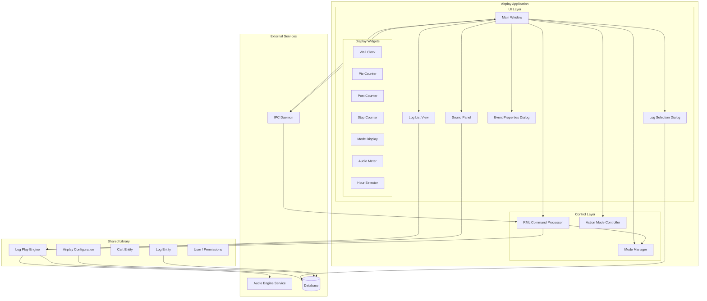
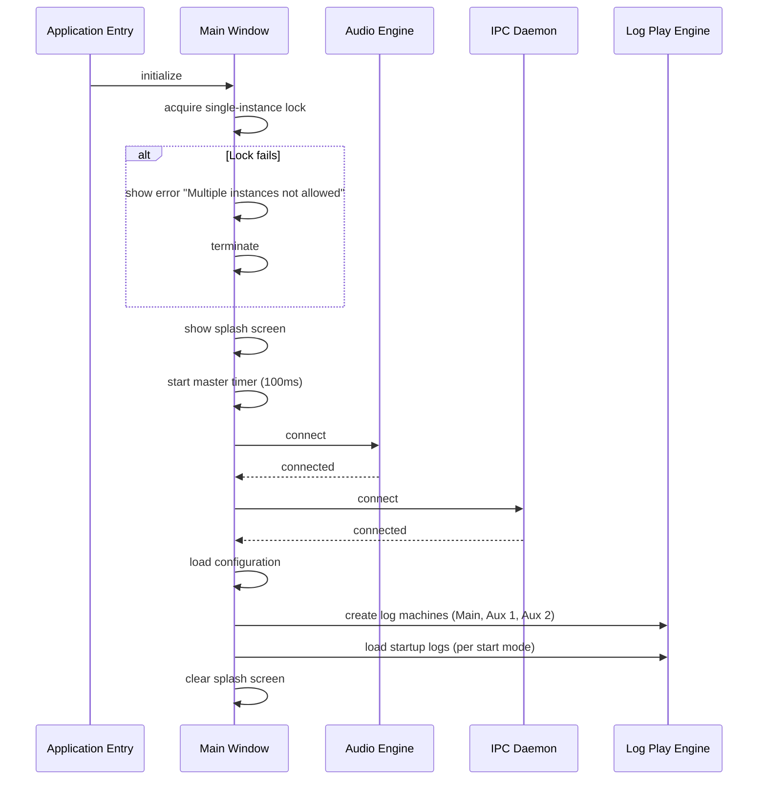
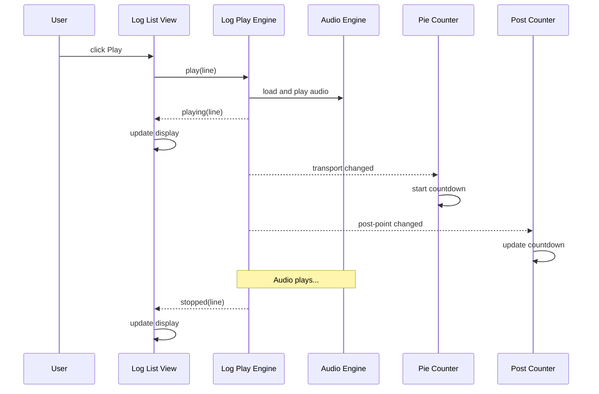
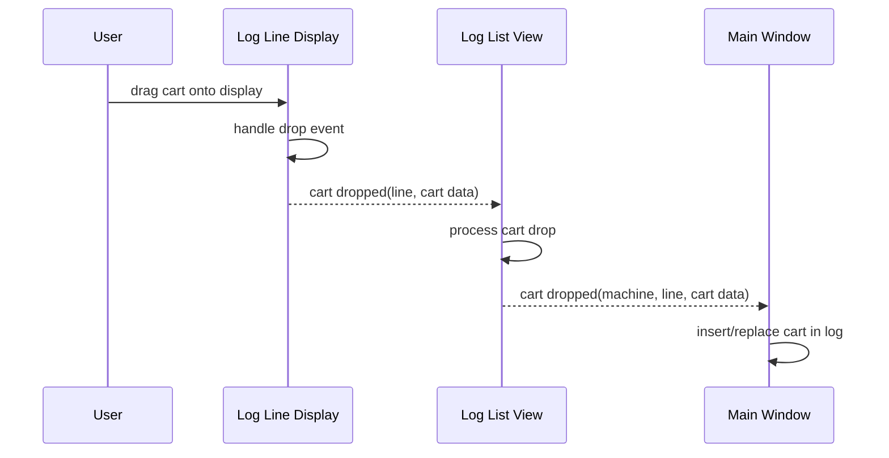
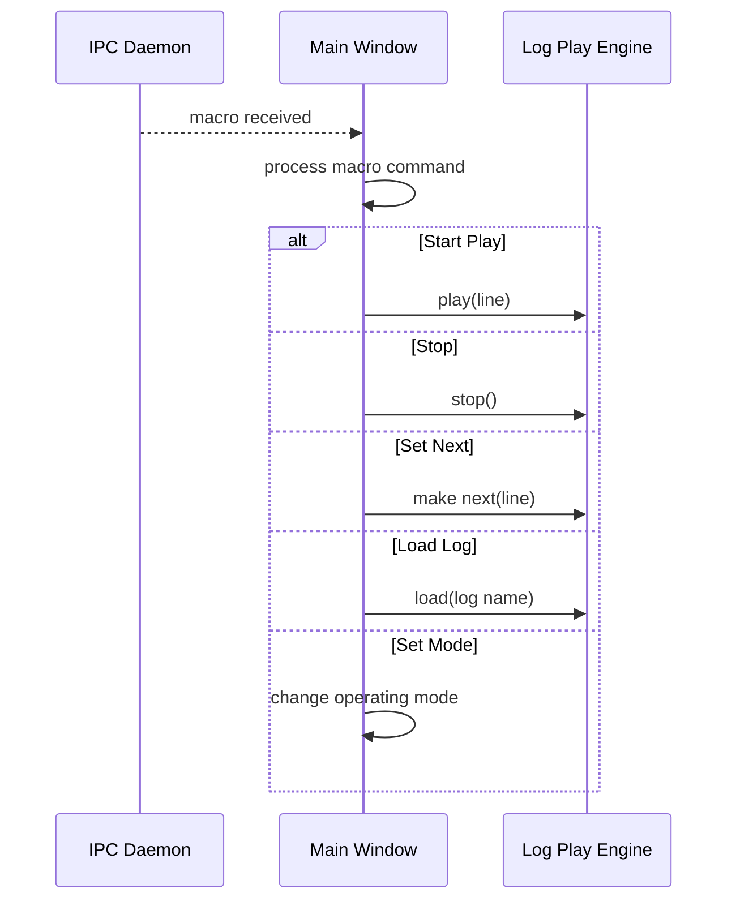
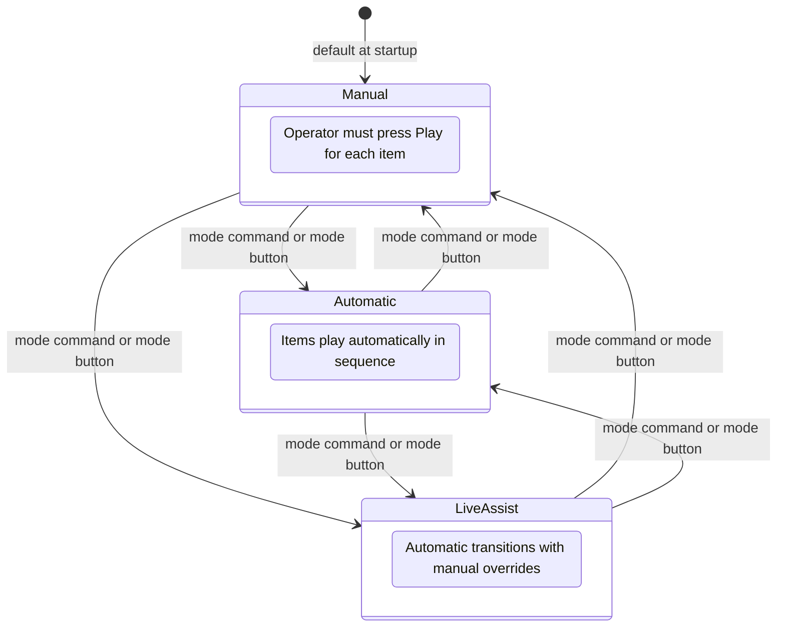
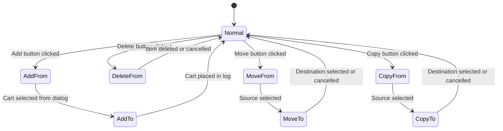
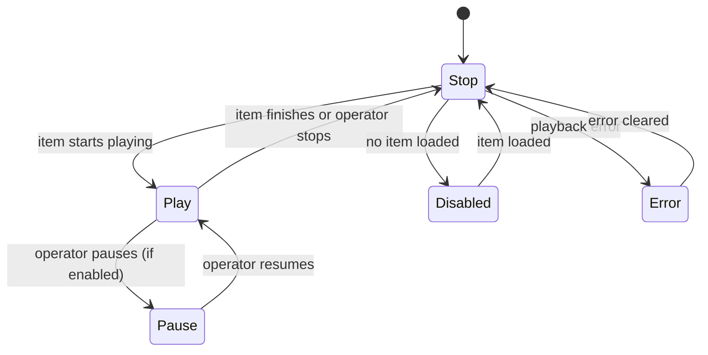
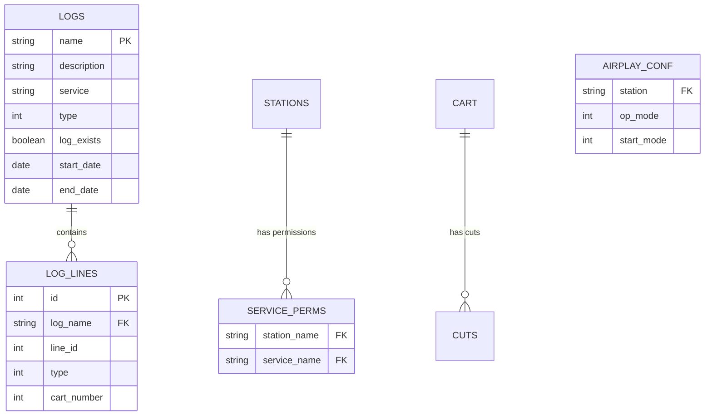

# Design Document

## Overview

**Purpose:** The Airplay module delivers real-time broadcast log playout to radio station operators. It is the primary on-air interface for the Rivendell radio automation system, enabling operators to play audio content from scheduled logs, trigger instant audio from sound panels, and control playout modes for unattended, semi-automated, or fully manual broadcasting.

**Users:** Broadcast operators use this application during live shows and unattended broadcasts. Broadcast engineers configure it and integrate it with external automation via remote macro commands and hardware GPIO triggers.

**Impact:** This module is the mission-critical on-air component. It reads broadcast logs and cart metadata from the central database, communicates with the audio engine for playback, and coordinates with the inter-process communication daemon for remote control, GPIO events, and user authentication.

### Goals

- Enable reliable, continuous on-air playout from broadcast logs
- Support three operating modes: Manual, Automatic, and Live Assist
- Provide real-time timing displays (countdown, post-point, stop time) for precise broadcasting
- Allow live log editing (add, delete, move, copy) during broadcasts
- Support remote control via RML macro commands and GPI hardware triggers
- Provide instant audio access via sound panel buttons
- Support multiple simultaneous log machines (Main Log, Aux 1, Aux 2)

### Non-Goals

- Audio encoding/decoding (delegated to the audio engine service)
- Log scheduling and generation (handled by the Log Manager module)
- Cart and audio file management (handled by the Library module)
- Station and system administration (handled by the Admin module)
- Audio device driver management (delegated to the audio engine service)

## Visual Design Reference

All UI/UX implementation decisions (colors, typography, spacing, component appearance, interaction patterns) are defined in the design system files. **Agents implementing UI components MUST read these before writing any visual code.**

| Layer | File | Scope |
|-------|------|-------|
| Global | `.blah/steering/design.md` | Typography (Fira Code/Sans), base palette, spacing, z-index, accessibility baseline |
| Spec | `design-system/MASTER.md` | Airplay-specific tokens (timing colors, panel states, layout, component specs) |
| Page | `design-system/pages/*.md` | Per-view overrides (main-window, log-list-view, sound-panel, timing-displays) |

**Hierarchy:** page override > spec MASTER > global steering. Higher layers only define differences.

## Architecture

### Architecture Pattern & Boundary Map



### Technology Stack

| Layer | Choice | Role | Notes |
|-------|--------|------|-------|
| Frontend / UI | TBD | Main operator interface | Single-window application with multiple panels |
| Backend / Services | TBD | Business logic and playout control | Event-driven architecture with timer-based updates |
| Data / Storage | Relational database | Log, cart, configuration persistence | Shared database with other Rivendell modules |
| Messaging / Events | Event bus / publish-subscribe | Internal widget communication, remote commands | RML commands via IPC daemon |
| Infrastructure / Runtime | TBD | Audio playback, system integration | Requires audio engine service connection |

## System Flows

### Startup Sequence



### Playout Sequence (List Mode)



### Cart Drag-and-Drop Sequence



### RML Macro Processing



### Operating Mode State Machine



### Action Mode State Machine



### Playback Button State Machine



## Requirements Traceability

| Requirement | Summary | Components | Interfaces | Flows |
|-------------|---------|------------|------------|-------|
| 1 | Application Lifecycle | Main Window | Audio Engine, IPC Daemon | Startup Sequence |
| 2 | Log Playout | Log List View, Log Play Engine, Pie Counter, Post Counter | Audio Engine | Playout Sequence |
| 3 | Log Management | Log Selection Dialog, Log List View, Log Play Engine | Database | Startup Sequence |
| 4 | Sound Panel | Sound Panel | Log Play Engine, Audio Engine | Playout Sequence |
| 5 | Log Editing | Log List View, Event Properties Dialog, Main Window | Log Play Engine | Cart Drag-and-Drop |
| 6 | Timing and Display | Wall Clock, Pie Counter, Post Counter, Stop Counter, Mode Display, Audio Meter, Hour Selector | Log Play Engine | Playout Sequence |
| 7 | Remote Control | RML Command Processor, Main Window | IPC Daemon, Log Play Engine | RML Macro Processing |

## Components and Interfaces

| Component | Domain/Layer | Intent | Req Coverage | Key Dependencies | Contracts |
|-----------|--------------|--------|--------------|-----------------|-----------|
| Main Window | UI | Top-level container orchestrating all views and services | 1, 2, 5, 6, 7 | All components | Event, State |
| Log List View | UI | Display and interact with a broadcast log in list form | 2, 3, 5 | Log Play Engine (P0) | Event, Service |
| Sound Panel | UI | Grid of instant-play audio buttons | 4 | Log Play Engine (P0) | Event |
| Event Properties Dialog | UI | Edit timing and transition properties of a log event | 5 | Log Play Engine (P1) | Service |
| Log Selection Dialog | UI | Browse, filter, load, save, and unload logs | 3 | Database (P0), Log Lock (P1) | Service |
| Wall Clock | Display | Real-time clock with 12h/24h toggle | 6 | None | Event |
| Pie Counter | Display | Pie chart countdown showing remaining time and talk markers | 6 | Log Play Engine (P1) | Service |
| Post Counter | Display | Post-point countdown with early/on-time/late indication | 6 | Log Play Engine (P1) | Service |
| Stop Counter | Display | Next stop time display | 6 | Log Play Engine (P1) | Service |
| Mode Display | Display | Operating mode indicator | 6 | Mode Manager (P1) | Service |
| Audio Meter | Display | Real-time stereo audio level meter | 6 | Audio Engine (P0) | Service |
| Hour Selector | Display | Hour navigation bar with event indicators | 6 | Log Play Engine (P1) | Event |
| RML Command Processor | Control | Parse and dispatch remote macro commands | 7 | Log Play Engine (P0), Mode Manager (P1) | Service |
| Action Mode Controller | Control | Manage add/delete/move/copy state machine | 5 | Log List View (P1), Sound Panel (P1) | State |
| Mode Manager | Control | Manage operating mode (Manual/Auto/Live Assist) transitions | 2 | Log Play Engine (P0) | State |

### UI Layer

#### Main Window

| Field | Detail |
|-------|--------|
| Intent | Top-level application window that orchestrates all views, services, timers, and external connections |
| Requirements | 1, 2, 5, 6, 7 |

**Responsibilities & Constraints**
- Initialize and manage connections to the audio engine and IPC daemon
- Enforce single-instance constraint via lock file
- Manage view switching between log machines and sound panel
- Route incoming RML macro commands to the appropriate handler
- Handle GPI triggers and channel lock assertions
- Coordinate master timer (100ms tick) for all time-dependent widgets
- Manage exit protection (password or confirmation)

**Dependencies**
- Outbound: Audio Engine -- audio playback (P0)
- Outbound: IPC Daemon -- remote commands, GPI events, user authentication (P0)
- Outbound: Log Play Engine -- playout control (P0)
- Outbound: Airplay Configuration -- startup and runtime settings (P0)
- Outbound: Database -- log existence checks, service permissions (P1)

**Contracts**: Event [x] / State [x]

##### Event Contract
- Subscribed events: audio engine connected, IPC connected, user changed, macro received, GPI state changed, log reloaded, log renamed, transport changed, time mode changed, on-air flag changed, channel started/stopped
- Published events: (none -- orchestrates via direct method calls)
- Ordering: master timer drives all periodic updates at 100ms intervals

##### State Management
- State model: operating mode per log machine, action mode, active view, start-next flag, pause-enabled flag
- Persistence: configuration loaded from database at startup, log state persisted on save/exit
- Concurrency: single-threaded event loop with timer-driven updates

#### Log List View

| Field | Detail |
|-------|--------|
| Intent | Display a broadcast log as a scrollable list with transport controls |
| Requirements | 2, 3, 5 |

**Responsibilities & Constraints**
- Display log lines with title, artist, timing, transition type, and status
- Provide transport controls: Play, Stop, Take, Head, Tail, Next, Scroll, Refresh, Load, Modify
- Support hour-based navigation via hour selector
- Manage action modes for the log (add/delete/move/copy)
- Support drag-and-drop of carts onto log positions
- Forward selection and cart-drop events to the main window

**Dependencies**
- Inbound: Main Window -- mode changes, action mode, time mode (P0)
- Outbound: Log Play Engine -- playback control, log data (P0)
- Outbound: Event Properties Dialog -- edit log line properties (P1)
- Outbound: Log Selection Dialog -- load/save logs (P1)

**Contracts**: Event [x] / Service [x]

##### Event Contract
- Published events: select clicked (line selected), cart dropped (cart placed in log)
- Subscribed events: played, paused, stopped, inserted, removed, modified, transport changed, reloaded, refreshability changed, audition head/tail/stopped
- Ordering: events processed in order received from the log play engine

##### Service Interface
```
interface LogListView {
  refresh(): void
  refresh(line: number): void
  setStatus(line: number, status: LogLineStatus): void
  setActionMode(mode: ActionMode, cartNumber?: number): void
  setOpMode(mode: OperatingMode): void
  setTimeMode(mode: TimeMode): void
  userChanged(permissions: UserPermissions): void
}
```

#### Sound Panel

| Field | Detail |
|-------|--------|
| Intent | Grid of instant-play buttons for sound effects, jingles, and stingers |
| Requirements | 4 |

**Responsibilities & Constraints**
- Display a grid of audio buttons with cart title and timing
- Start/stop/pause playback per button
- Support hotkey-triggered start, stop, and pause
- Support drag-and-drop cart assignment
- Report channel start/stop to the main window

**Dependencies**
- Inbound: Main Window -- mode changes, user changes, clock ticks (P0)
- Outbound: Log Play Engine -- playback control (P0)

**Contracts**: Event [x]

##### Event Contract
- Published events: select clicked (button selected), cart dropped, channel started, channel stopped
- Subscribed events: transport changed, modified, played, stopped, paused, position

#### Event Properties Dialog

| Field | Detail |
|-------|--------|
| Intent | Edit timing and transition properties of a single log event |
| Requirements | 5 |

**Responsibilities & Constraints**
- Allow editing of hard start time, grace time, transition type, and overlap settings
- Display audio cue point editor for fine-tuning
- Display cart notes (read-only)
- Validate that no duplicate hard start times exist
- Return OK/Cancel result

**Dependencies**
- Inbound: Log List View or Sound Panel -- log line data (P0)
- Outbound: Log Play Engine -- log line metadata (P1)

**Contracts**: Service [x]

##### Service Interface
```
interface EventPropertiesDialog {
  open(line: number): DialogResult
}
```
- Preconditions: line must reference a valid log line
- Postconditions: on OK, log line is updated with new properties
- Invariants: duplicate hard start times are rejected

#### Log Selection Dialog

| Field | Detail |
|-------|--------|
| Intent | Browse, filter, and manage log loading/saving |
| Requirements | 3 |

**Responsibilities & Constraints**
- Display filterable list of available logs (name, description, service)
- Filter by date range, active status, and station service permissions
- Support Load, Save, Save As, Unload operations
- Enforce log locking before save operations
- Enforce refresh requirement before saving

**Dependencies**
- Outbound: Database -- log listing query (P0)
- Outbound: Log Lock Manager -- exclusive editing locks (P1)

**Contracts**: Service [x]

##### Service Interface
```
interface LogSelectionDialog {
  open(): LogSelectionResult  // { operation: Load|Save|SaveAs|Unload|Cancel, logName?: string, serviceName?: string }
}
```
- Preconditions: database connection active
- Postconditions: on Load, log name and service returned; on Save, log lock acquired
- Invariants: locked logs cannot be saved by another user

### Display Layer

#### Wall Clock

| Field | Detail |
|-------|--------|
| Intent | Display current time of day with 12h/24h toggle |
| Requirements | 6 |

**Contracts**: Event [x]

##### Event Contract
- Published events: time mode changed (12h/24h toggle)
- Subscribed events: master timer tick

#### Pie Counter

| Field | Detail |
|-------|--------|
| Intent | Pie chart countdown showing remaining playback time with talk markers |
| Requirements | 6 |

**Contracts**: Service [x]

##### Service Interface
```
interface PieCounter {
  setLine(line: number): void
  setTime(milliseconds: number): void
  setCountLength(milliseconds: number): void
  setTalkStart(milliseconds: number): void
  setTalkEnd(milliseconds: number): void
  start(offset: number): void
  stop(): void
  resetTime(): void
  setOpMode(mode: OperatingMode): void
  setTransType(type: TransitionType): void
  setOnAirFlag(state: boolean): void
}
```

#### Post Counter

| Field | Detail |
|-------|--------|
| Intent | Post-point countdown indicating early, on-time, or late status |
| Requirements | 6 |

**Contracts**: Service [x]

##### Service Interface
```
interface PostCounter {
  setPostPoint(point: Time, offset: number, valid: boolean, running: boolean): void
  setTimeMode(mode: TimeMode): void
}
```

#### Hour Selector

| Field | Detail |
|-------|--------|
| Intent | Hour navigation bar showing which hours contain events |
| Requirements | 6 |

**Contracts**: Event [x]

##### Event Contract
- Published events: hour selected (user clicks an hour)
- Subscribed events: master timer tick (for current hour highlighting)

### Control Layer

#### RML Command Processor

| Field | Detail |
|-------|--------|
| Intent | Parse and dispatch incoming RML macro commands to appropriate handlers |
| Requirements | 7 |

**Responsibilities & Constraints**
- Parse command code and arguments from RML macro
- Dispatch to the correct handler based on command code
- Support all documented RML commands: LB, LC, LL, AL, MN, PB, PC, PE, PL, PM, PN, PP, PS, MD, PT, PU, PD, PW, PX, RL, SN

**Dependencies**
- Inbound: IPC Daemon -- incoming macro commands (P0)
- Outbound: Log Play Engine -- playback control (P0)
- Outbound: Mode Manager -- mode changes (P1)
- Outbound: Sound Panel -- panel commands (P1)

**Contracts**: Service [x]

##### Service Interface
```
interface RmlCommandProcessor {
  processCommand(command: MacroCommand): void
}
```

**RML Command Reference:**

| Command | Code | Arguments | Description |
|---------|------|-----------|-------------|
| Label | LB | 0+ | Set or clear message label text |
| Color Label | LC | 1+ | Set colored message label text |
| Load Log | LL | 1-3 | Load a log into a log machine |
| Append Log | AL | 2 | Append log to current log |
| Make Next | MN | 2 | Set next line in log |
| Push Button | PB | 1 | Simulate button push |
| Label Button | PC | 5+ | Set sound panel button label |
| Load Panel | PE | 4 | Load cart into panel button |
| Start | PL | 2 | Start playing a log line |
| Set Mode | PM | 1-2 | Set operating mode |
| Start Next | PN | 1-3 | Start next item with optional transition/offset |
| Play Panel | PP | 3-5 | Play a sound panel button |
| Stop | PS | 1-3 | Stop playing |
| Duck Machine | MD | 3-4 | Reduce volume on a machine |
| Stop Panel | PT | 3-6 | Stop a sound panel button |
| Pause Panel | PU | 3-4 | Pause a sound panel button |
| Duck Panel | PD | 5-6 | Reduce volume on a panel button |
| Select Widget | PW | 1 | Switch visible log widget |
| Add Next | PX | 2-4 | Add cart as next item in log |
| Refresh Log | RL | 1 | Refresh a log |
| Set Default Now and Next | SN | 3 | Set default now-and-next cart |

## Data Models

### Domain Model

**Entities:**
- **Log**: A named broadcast playlist containing ordered log lines, associated with a service
- **Log Line**: A single entry in a log, referencing a cart with timing, transition, and scheduling properties
- **Cart**: An audio asset container with metadata (title, artist, duration, type)
- **Cut**: A specific audio recording within a cart
- **Service Permission**: Maps stations to authorized broadcast services
- **Airplay Configuration**: Per-station playout settings (operating mode, start mode, channel assignments)
- **Log Lock**: Exclusive editing lock on a log, recording the locking user and station

**Relationships:**
- Log contains ordered Log Lines (1:many)
- Log Line references a Cart (many:1)
- Cart contains Cuts (1:many)
- Station has Service Permissions (1:many)
- Station has Airplay Configuration (1:1)

**Business Rules:**
- A log can only be saved by the user who holds its lock
- Hard start times must be unique within a log
- A log must be refreshed before it can be saved after external changes
- Only one instance of the playout application may run per station

### Logical Data Model



### Physical Data Model

The Airplay module accesses but does not own these tables. The schema is defined in the shared library (LIB). Direct SQL queries are limited to:

1. **Log existence check:** `SELECT NAME FROM LOGS WHERE NAME = ?`
2. **Available logs listing:** `SELECT NAME, DESCRIPTION, SERVICE FROM LOGS WHERE TYPE = 0 AND LOG_EXISTS = 'Y' AND date-range filters`
3. **Service permissions:** `SELECT SERVICE_NAME FROM SERVICE_PERMS WHERE STATION_NAME = ?`

All other data access is through the shared library's entity classes (Log Play Engine, Log, Log Line, Cart, Cut, Configuration).

## Error Handling

### Error Categories and Responses

**User Errors:**
- Duplicate hard start time: display warning, prevent save, allow correction
- Save without refresh: display warning, require refresh first
- Log locked by another user: display who holds the lock and from which station, prevent operation

**System Errors:**
- Application initialization failure (database, configuration): display error, terminate
- Memory lock failure: display warning, continue operating (non-fatal)
- Invalid audio channel assignments: display warning, continue operating

**Business Logic Errors:**
- Multiple instance attempt: display error, terminate second instance
- Unknown command-line option: display error with the option name, terminate
- Exit blocked by password: display password prompt, reject incorrect password

### Error Severity Guide

| Severity | Behavior |
|----------|----------|
| Critical (terminate) | Initialization failure, unknown CLI option |
| Error (block action) | Multiple instances, duplicate start time, log locked, refresh required |
| Warning (inform, continue) | Memory lock failure, invalid channel assignments |
| Confirmation (user decision) | Exit confirmation dialog |

## Testing Strategy

### E2E Tests

1. **Start application, load log, play item, verify audio output** -- covers Requirements 1, 2, 3
2. **Switch between Manual, Automatic, and Live Assist modes** -- covers Requirement 2
3. **Add, delete, move, and copy items in a running log** -- covers Requirement 5
4. **Load and trigger sound panel buttons** -- covers Requirement 4
5. **Send RML commands and verify playout responds** -- covers Requirement 7

### Integration Tests

1. **Audio Engine connection and playback lifecycle** -- verify connect, load, play, stop
2. **IPC Daemon connection and RML command routing** -- verify macro reception and dispatch
3. **Database log loading with service permission filtering** -- verify correct logs appear
4. **Log locking across multiple sessions** -- verify lock acquisition and conflict detection
5. **GPI trigger to channel play/stop** -- verify hardware input routing

### Unit Tests

1. **Operating mode transitions** -- all valid state transitions between Manual, Automatic, Live Assist
2. **Action mode state machine** -- complete cycle for add, delete, move, copy operations
3. **RML command parsing** -- each command code with valid and invalid arguments
4. **Startup log loading strategy** -- empty, previous, specified modes
5. **Duplicate start time validation** -- detect and reject conflicting hard start times
6. **Exit protection logic** -- password required vs. confirmation dialog paths
