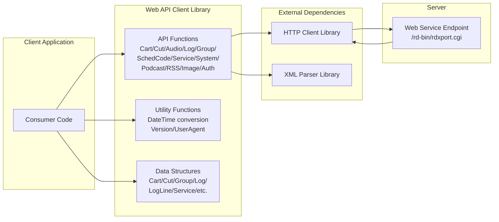
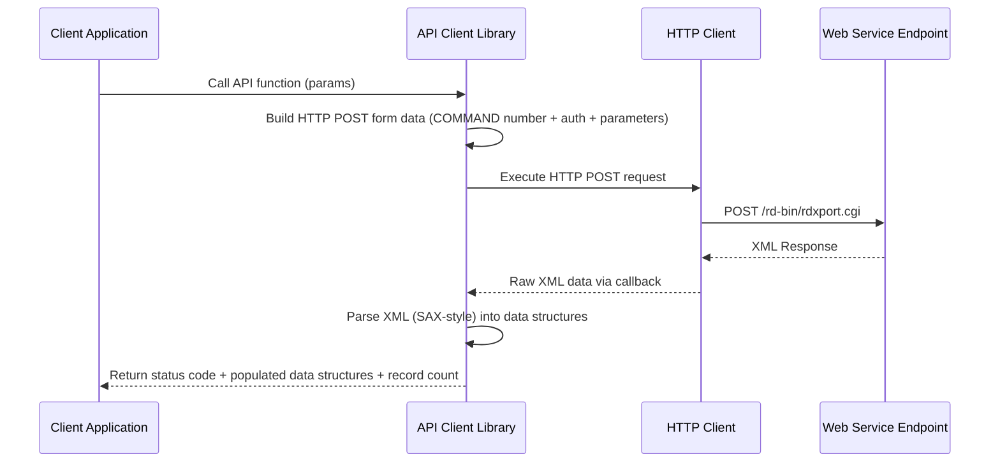
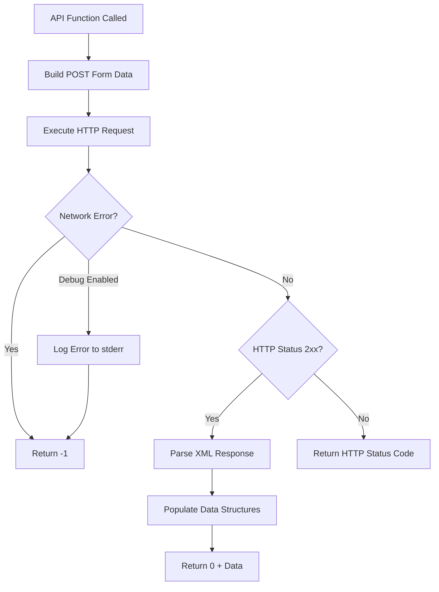
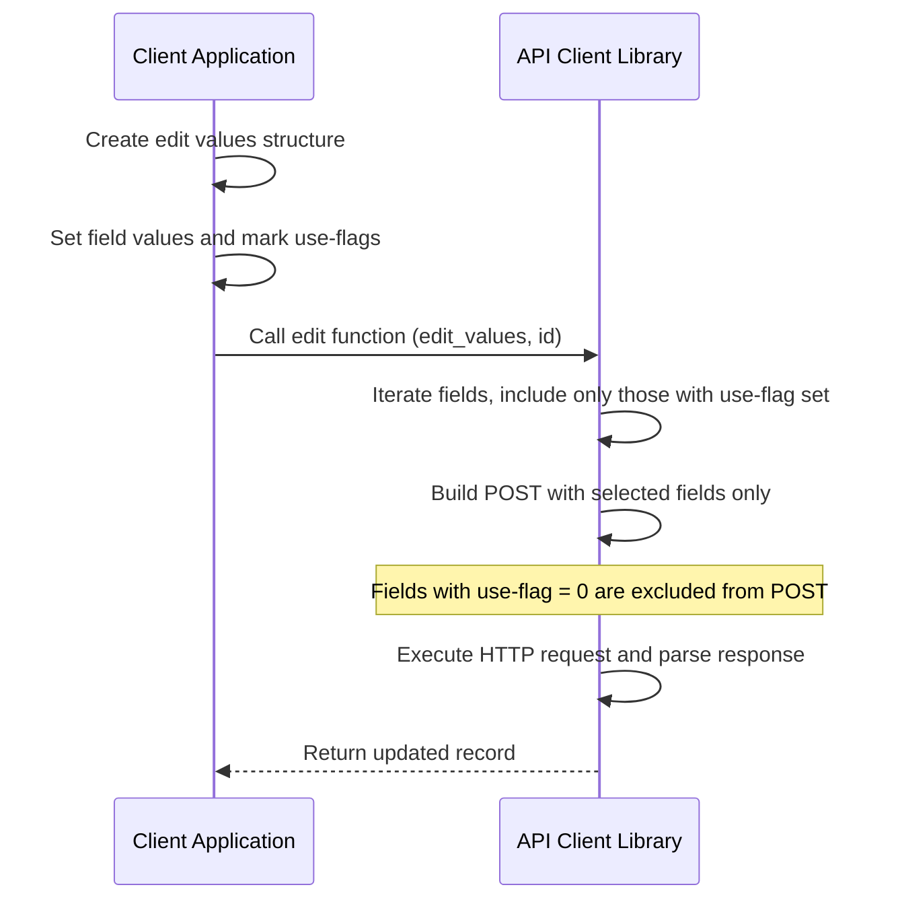

# Design Document

## Overview

**Purpose:** The Web API Client Library delivers a technology-agnostic programmatic interface for managing radio automation resources (carts, cuts, audio files, logs, groups, scheduler codes, podcasts, RSS feeds, and images) on a Rivendell server. It abstracts the HTTP communication, request serialization, XML response parsing, and data mapping so that consumers interact only with typed function calls and data structures.

**Users:** Third-party integrators, automation script developers, and external applications that need to manage Rivendell resources without using the native desktop applications.

**Impact:** Enables any platform or language that can call a C-compatible library to interact with the full Rivendell web API surface, decoupling client code from HTTP/XML protocol details.

### Goals
- Provide complete CRUD coverage for all Rivendell web API operations (carts, cuts, audio, logs, scheduler codes, media publishing)
- Provide read-only access to groups, services, and system settings
- Deliver consistent authentication, error handling, and data conversion across all operations
- Remain standalone with no dependencies on other Rivendell artifacts

### Non-Goals
- Direct database access (all data flows through the web API)
- Server-side logic or validation (the library is a client-side wrapper)
- Asynchronous or event-driven operation (all calls are synchronous request/response)
- User interface of any kind

## Architecture

### Architecture Pattern & Boundary Map

The library follows a **flat function-per-operation** pattern. Each API operation is a standalone function that encapsulates the full request lifecycle: parameter serialization, HTTP communication, XML response parsing, and data structure population.



**Architecture Integration:**
- Selected pattern: Flat procedural library with one function per API operation
- Domain boundaries: Cart management, cut management, audio operations, log management, scheduler codes, system queries, media publishing, authentication, and utilities are separated into individual source files
- No internal dependencies between API functions; each is self-contained
- Steering compliance: Follows the principle of domain-separated modules, each API function being its own module

### Technology Stack

| Layer | Choice / Version | Role in Feature | Notes |
|-------|------------------|-----------------|-------|
| Language | TBD | Library implementation | Original: C; target TBD per steering |
| HTTP Client | TBD | HTTP POST communication | Original: libcurl |
| XML Parser | TBD | Response parsing | Original: expat (SAX-style) |
| Build System | TBD | Compilation and linking | Original: autotools |
| Runtime | TBD | Execution environment | No runtime dependencies beyond HTTP and XML |

## System Flows

### API Call Lifecycle

All API operations follow the same synchronous request/response flow:



### Error Handling Flow



### Partial Update Flow (Edit Operations)



## Requirements Traceability

| Requirement | Summary | Components | Interfaces | Flows |
|-------------|---------|------------|------------|-------|
| 1 | Cart Management | CartService | Cart CRUD API | API Call Lifecycle |
| 2 | Cut Management | CutService | Cut CRUD API | API Call Lifecycle |
| 3 | Audio Operations | AudioService | Audio API | API Call Lifecycle |
| 4 | Log Management | LogService | Log CRUD API | API Call Lifecycle |
| 5 | Scheduler Code Management | SchedulerCodeService | SchedCode API | API Call Lifecycle |
| 6 | System Queries | SystemQueryService | Group/Service/Settings API | API Call Lifecycle |
| 7 | Media Publishing | MediaPublishService | Podcast/RSS/Image API | API Call Lifecycle |
| 8 | Authentication | AuthService | Ticket API | API Call Lifecycle |
| 9 | Error Handling | All API functions | HTTP status mapping | Error Handling Flow |
| 10 | Data Conversion Utilities | UtilityModule | Conversion functions | N/A (local) |

## Components and Interfaces

| Component | Domain/Layer | Intent | Req Coverage | Key Dependencies | Contracts |
|-----------|--------------|--------|--------------|-----------------|-----------|
| CartService | Cart / API | Full CRUD for carts with filtering and embedded cuts | 1 | HTTP Client, XML Parser | Service |
| CutService | Cut / API | Full CRUD for cuts within carts | 2 | HTTP Client, XML Parser | Service |
| AudioService | Audio / API | Import, export, copy, delete, info, peaks, trim | 3 | HTTP Client, XML Parser | Service |
| LogService | Log / API | Create, delete, save, list logs and log lines | 4 | HTTP Client, XML Parser | Service |
| SchedulerCodeService | Scheduling / API | Assign, unassign, list scheduler codes | 5 | HTTP Client, XML Parser | Service |
| SystemQueryService | System / API | Read-only access to groups, services, system settings | 6 | HTTP Client, XML Parser | Service |
| MediaPublishService | Media / API | Publish, upload, remove podcasts, RSS, images | 7 | HTTP Client, XML Parser | Service |
| AuthService | Auth / API | Create authentication tickets | 8 | HTTP Client, XML Parser | Service |
| UtilityModule | Utility / Support | Datetime conversion, version, user agent | 10 | None | Service |

### Cart / API Layer

#### CartService

| Field | Detail |
|-------|--------|
| Intent | Manages cart lifecycle (create, read, update, delete) and listing with filters and optional embedded cuts |
| Requirements | 1 |

**Responsibilities & Constraints**
- Create carts with group, type, and optional cart number
- Edit carts with selective partial updates (only flagged fields sent)
- Delete carts by cart number
- Query single carts or lists with group/type/text filtering
- Support embedded cuts mode for combined cart+cut retrieval

**Dependencies**
- Outbound: Web Service Endpoint -- HTTP POST for all operations (P0)
- External: HTTP Client Library -- HTTP communication (P0)
- External: XML Parser Library -- response parsing (P0)

**Contracts**: Service [x]

##### Service Interface
```
interface CartService {
  addCart(host, user, pass, ticket, group, type, cartNumber, userAgent): Result<Cart, ErrorCode>
  editCart(host, user, pass, ticket, editValues, cartNumber, userAgent): Result<Cart, ErrorCode>
  removeCart(host, user, pass, ticket, cartNumber, userAgent): Result<void, ErrorCode>
  listCart(host, user, pass, ticket, cartNumber, userAgent): Result<Cart, ErrorCode>
  listCarts(host, user, pass, ticket, group, filter, type, userAgent): Result<Cart[], ErrorCode>
  listCartCuts(host, user, pass, ticket, cartNumber, userAgent): Result<CartWithCuts, ErrorCode>
  listCartsCuts(host, user, pass, ticket, group, filter, type, userAgent): Result<CartWithCuts[], ErrorCode>
}
```

### Cut / API Layer

#### CutService

| Field | Detail |
|-------|--------|
| Intent | Manages cut lifecycle within carts (create, read, update, delete, list) |
| Requirements | 2 |

**Responsibilities & Constraints**
- Add cuts to existing carts
- Edit cuts with selective partial updates
- Delete individual cuts
- Query single or all cuts within a cart

**Dependencies**
- Outbound: Web Service Endpoint (P0)
- External: HTTP Client Library (P0), XML Parser Library (P0)

**Contracts**: Service [x]

##### Service Interface
```
interface CutService {
  addCut(host, user, pass, ticket, cartNumber, userAgent): Result<Cut, ErrorCode>
  editCut(host, user, pass, ticket, editValues, cartNumber, cutNumber, userAgent): Result<Cut, ErrorCode>
  removeCut(host, user, pass, ticket, cartNumber, cutNumber, userAgent): Result<void, ErrorCode>
  listCut(host, user, pass, ticket, cartNumber, cutNumber, userAgent): Result<Cut, ErrorCode>
  listCuts(host, user, pass, ticket, cartNumber, userAgent): Result<Cut[], ErrorCode>
}
```

### Audio / API Layer

#### AudioService

| Field | Detail |
|-------|--------|
| Intent | Manages audio file operations: import, export, copy, delete, info, peaks, and trim level calculation |
| Requirements | 3 |

**Responsibilities & Constraints**
- Import audio files with processing parameters (channels, normalization, autotrim, metadata)
- Export audio to local files with format conversion options
- Copy audio between cuts, delete audio files
- Query audio metadata and storage capacity
- Export peak data and calculate trim points

**Dependencies**
- Outbound: Web Service Endpoint (P0)
- External: HTTP Client Library (P0), XML Parser Library (P0)

**Contracts**: Service [x]

##### Service Interface
```
interface AudioService {
  importAudio(host, user, pass, ticket, cartNum, cutNum, channels, normLevel, autotrimLevel, useMetadata, create, group, title, filename, userAgent): Result<ImportResult, ErrorCode>
  exportAudio(host, user, pass, ticket, cartNum, cutNum, format, channels, sampleRate, bitRate, quality, startPoint, endPoint, normLevel, enableMetadata, filename, userAgent): Result<void, ErrorCode>
  deleteAudio(host, user, pass, ticket, cartNumber, cutNumber, userAgent): Result<void, ErrorCode>
  copyAudio(host, user, pass, ticket, srcCart, srcCut, destCart, destCut, userAgent): Result<void, ErrorCode>
  audioInfo(host, user, pass, ticket, cartNumber, cutNumber, userAgent): Result<AudioInfo, ErrorCode>
  audioStore(host, user, pass, ticket, userAgent): Result<AudioStore, ErrorCode>
  exportPeaks(host, user, pass, ticket, cartNum, cutNum, filename, userAgent): Result<void, ErrorCode>
  trimAudio(host, user, pass, ticket, cartNumber, cutNumber, trimLevel, userAgent): Result<TrimResult, ErrorCode>
}
```

### Log / API Layer

#### LogService

| Field | Detail |
|-------|--------|
| Intent | Manages program log lifecycle (create, delete, save, list) with transition type encoding |
| Requirements | 4 |

**Responsibilities & Constraints**
- Create and delete logs by name and service
- Save complete logs with header and line array
- Encode transition types: 0=PLAY, 1=SEGUE, 2=STOP
- List log contents or filter log records

**Dependencies**
- Outbound: Web Service Endpoint (P0)
- External: HTTP Client Library (P0), XML Parser Library (P0)

**Contracts**: Service [x]

##### Service Interface
```
interface LogService {
  addLog(host, user, pass, ticket, logName, serviceName, userAgent): Result<void, ErrorCode>
  deleteLog(host, user, pass, ticket, logName, userAgent): Result<void, ErrorCode>
  saveLog(host, user, pass, ticket, headerValues, lineValues, lineCount, logName, userAgent): Result<void, ErrorCode>
  listLog(host, user, pass, ticket, logName, userAgent): Result<LogLine[], ErrorCode>
  listLogs(host, user, pass, ticket, serviceName, logName, trackable, filter, recent, userAgent): Result<Log[], ErrorCode>
}
```

### Scheduling / API Layer

#### SchedulerCodeService

| Field | Detail |
|-------|--------|
| Intent | Manages scheduler code assignments to carts and lists available codes |
| Requirements | 5 |

**Dependencies**
- Outbound: Web Service Endpoint (P0)
- External: HTTP Client Library (P0), XML Parser Library (P0)

**Contracts**: Service [x]

##### Service Interface
```
interface SchedulerCodeService {
  assignSchedCode(host, user, pass, ticket, cartNum, code, userAgent): Result<void, ErrorCode>
  unassignSchedCode(host, user, pass, ticket, cartNum, code, userAgent): Result<void, ErrorCode>
  listSchedCodes(host, user, pass, ticket, userAgent): Result<SchedCode[], ErrorCode>
  listCartSchedCodes(host, user, pass, ticket, cartNum, userAgent): Result<SchedCode[], ErrorCode>
}
```

### System / API Layer

#### SystemQueryService

| Field | Detail |
|-------|--------|
| Intent | Provides read-only access to groups, services, and system settings |
| Requirements | 6 |

**Dependencies**
- Outbound: Web Service Endpoint (P0)
- External: HTTP Client Library (P0), XML Parser Library (P0)

**Contracts**: Service [x]

##### Service Interface
```
interface SystemQueryService {
  listGroup(host, user, pass, ticket, group, userAgent): Result<Group, ErrorCode>
  listGroups(host, user, pass, ticket, userAgent): Result<Group[], ErrorCode>
  listServices(host, user, pass, ticket, trackable, userAgent): Result<Service[], ErrorCode>
  listSystemSettings(host, user, pass, ticket, userAgent): Result<SystemSettings, ErrorCode>
}
```

### Media / API Layer

#### MediaPublishService

| Field | Detail |
|-------|--------|
| Intent | Manages podcast, RSS feed, and image publishing and removal |
| Requirements | 7 |

**Dependencies**
- Outbound: Web Service Endpoint (P0)
- External: HTTP Client Library (P0), XML Parser Library (P0)

**Contracts**: Service [x]

##### Service Interface
```
interface MediaPublishService {
  postPodcast(host, user, pass, ticket, castId, userAgent): Result<void, ErrorCode>
  savePodcast(host, user, pass, ticket, castId, filename, userAgent): Result<void, ErrorCode>
  deletePodcast(host, user, pass, ticket, castId, userAgent): Result<void, ErrorCode>
  removePodcast(host, user, pass, ticket, castId, userAgent): Result<void, ErrorCode>
  postRss(host, user, pass, ticket, feedId, userAgent): Result<void, ErrorCode>
  removeRss(host, user, pass, ticket, feedId, userAgent): Result<void, ErrorCode>
  postImage(host, user, pass, ticket, imgId, userAgent): Result<void, ErrorCode>
  removeImage(host, user, pass, ticket, imgId, userAgent): Result<void, ErrorCode>
}
```

### Auth / API Layer

#### AuthService

| Field | Detail |
|-------|--------|
| Intent | Creates authentication tickets for session-based API access |
| Requirements | 8 |

**Dependencies**
- Outbound: Web Service Endpoint (P0)
- External: HTTP Client Library (P0), XML Parser Library (P0)

**Contracts**: Service [x]

##### Service Interface
```
interface AuthService {
  createTicket(host, user, pass, userAgent): Result<TicketInfo, ErrorCode>
}
```

### Utility / Support Layer

#### UtilityModule

| Field | Detail |
|-------|--------|
| Intent | Provides datetime conversion, validation, version info, and string utilities with no network dependency |
| Requirements | 10 |

**Responsibilities & Constraints**
- Convert between datetime strings and datetime structures
- Convert between time strings and milliseconds
- Validate datetime structures
- Parse boolean values from strings
- Retrieve local timezone offset
- Return library version and user agent information

**Dependencies**
- None (pure local computation)

**Contracts**: Service [x]

##### Service Interface
```
interface UtilityModule {
  convertDatetimeStringToDatetime(value: string): Datetime
  convertDatetimeToDatetimeString(value: Datetime): string
  convertTimeStringToMilliseconds(value: string): integer
  convertMillisecondsToTimeString(value: integer): string
  validateDatetime(value: Datetime): boolean
  readBoolean(value: string): boolean
  getLocalTimezoneOffset(): integer
  getVersion(): VersionInfo
  getUserAgent(): UserAgentInfo
}
```

## Data Models

### Domain Model

The library operates on a set of value objects that mirror the server-side data model. There are no aggregates or transactional boundaries since all state resides on the server.

**Entities:**
- **Cart** -- Primary content unit with metadata (title, artist, album, timing, etc.)
- **Cut** -- Audio segment within a cart (audio properties, scheduling, play counters)
- **Group** -- Organizational container for carts with number range limits
- **Log** -- Program schedule with header metadata
- **LogLine** -- Individual entry in a log (cart reference, timing, transitions)
- **Service** -- Broadcast service definition
- **SystemSettings** -- Global system configuration singleton
- **SchedCode** -- Scheduler classification code
- **AudioInfo** -- Audio file technical metadata
- **AudioStore** -- Storage capacity information
- **ImportResult** -- Audio import operation result
- **TicketInfo** -- Authentication ticket with expiration
- **TrimResult** -- Audio trim calculation result

**Edit Parameter Structures:**
- **CartEditValues** -- Partial update structure for carts with per-field inclusion flags
- **CutEditValues** -- Partial update structure for cuts with per-field inclusion flags
- **LogHeaderValues** -- Log header data for save operations
- **LogLineValues** -- Log line data for save operations

### Logical Data Model

```mermaid
erDiagram
    CART ||--o{ CUT : "has many"
    CART ||--o{ SCHEDCODE_ASSIGNMENT : "has many"
    GROUP ||--o{ CART : "contains"
    LOG ||--o{ LOGLINE : "has many"
    SERVICE ||--o{ LOG : "owns"
    SYSTEM_SETTINGS ||--|| SYSTEM : "singleton"

    CART {
        integer cart_number PK
        integer cart_type
        string group_name FK
        string title
        string artist
        string album
        integer year
        string label
        string client
        string agency
        string publisher
        string composer
        string conductor
        string user_defined
        integer usage_code
        integer forced_length_ms
        integer average_length_ms
        integer length_deviation_ms
        integer average_segue_length_ms
        integer average_hook_length_ms
        integer last_cut_played
        integer validity
        boolean enforce_length
        boolean asynchronous
        string owner
        string notes
        datetime metadata_datetime
        integer cut_quantity
    }
    CUT {
        string cut_name PK
        integer cart_number FK
        integer cut_number
        boolean evergreen
        string description
        string outcue
        string isrc
        string isci
        integer length_ms
        datetime origin_datetime
        datetime start_datetime
        datetime end_datetime
        boolean day_sun
        boolean day_mon
        boolean day_tue
        boolean day_wed
        boolean day_thu
        boolean day_fri
        boolean day_sat
        string start_daypart
        string end_daypart
        string origin_name
        string origin_login_name
        string source_hostname
        integer weight
        datetime last_play_datetime
        integer play_counter
        integer local_counter
        integer validity
        integer coding_format
        integer sample_rate
        integer bit_rate
        integer channels
        integer play_gain
        integer start_point_ms
        integer end_point_ms
        integer fadeup_point_ms
        integer fadedown_point_ms
        integer segue_start_point_ms
        integer segue_end_point_ms
        integer segue_gain
        integer hook_start_point_ms
        integer hook_end_point_ms
        integer talk_start_point_ms
        integer talk_end_point_ms
    }
    GROUP {
        string name PK
        string description
        integer default_cart_type
        integer low_cart_limit
        integer high_cart_limit
        integer shelf_life_days
        string default_title
        boolean enforce_range
        boolean report_traffic
        boolean report_music
        boolean now_next_enabled
        string color
    }
    LOG {
        string name PK
        string service_name FK
        string description
        string origin_username
        datetime origin_datetime
        datetime purge_date
        datetime link_datetime
        datetime modified_datetime
        boolean auto_refresh
        datetime start_date
        datetime end_date
        integer scheduled_tracks
        integer completed_tracks
        integer music_links
        boolean music_linked
        integer traffic_links
        boolean traffic_linked
    }
    LOGLINE {
        integer line_number PK
        integer line_id
        integer type
        integer cart_type
        integer cart_number FK
        integer cut_number
        string group_name
        string group_color
        string title
        string artist
        integer transition_type
        integer start_time_ms
        integer time_type
        integer forced_length
        boolean enforce_length
        boolean evergreen
    }
    SERVICE {
        string name PK
        string description
    }
    SYSTEM_SETTINGS {
        integer sample_rate
        boolean duplicate_cart_titles
        integer max_post_length
        string isci_xreference_path
        string temp_cart_group
    }
```



### Data Contracts & Integration

**API Data Transfer:**
- All requests are HTTP POST with form-encoded parameters
- All responses are XML documents parsed via SAX-style callbacks
- Each operation uses a numeric COMMAND identifier (1-45)
- Authentication parameters (hostname, username, password, ticket) are included in every request

**Partial Update Pattern:**
- Cart and cut edit operations use a companion flag for each field
- Only fields with their inclusion flag set are serialized into the POST request
- This enables selective updates without requiring the caller to provide all fields

## Error Handling

### Error Strategy

All API functions return an integer status code following a consistent pattern across the entire library.

### Error Categories and Responses

**Network Errors:** HTTP client failure during request execution results in return code -1. When debug output is enabled, the error details are logged to standard error.

**Authentication Errors (401/403):** Invalid or missing credentials result in the corresponding HTTP status code being returned.

**Not Found Errors (404):** Requests for non-existent resources return 404.

**Server Errors (500):** Internal server failures return 500.

**Success (200-299):** Successful operations return 0 and populate output data structures.

| Category | Condition | Return Value | Recovery |
|----------|-----------|-------------|----------|
| Network failure | HTTP client error | -1 | Retry with exponential backoff |
| Authentication failure | Invalid credentials | 401 or 403 | Re-authenticate, create new ticket |
| Resource not found | Invalid cart/cut/log ID | 404 | Verify resource existence |
| Server error | Internal failure | 500 | Retry or escalate |
| Success | 2xx response | 0 | Process returned data |

## Testing Strategy

### Unit Tests
- Datetime string to datetime structure conversion (various formats, edge cases)
- Datetime structure to string conversion (round-trip validation)
- Time string to milliseconds conversion
- Boolean parsing from string values
- Datetime structure validation (valid and invalid dates)
- Partial update field serialization (only flagged fields included)
- Transition type encoding (0=PLAY, 1=SEGUE, 2=STOP)

### Integration Tests
- Cart CRUD lifecycle: create, read, edit (partial update), delete
- Cut CRUD lifecycle: add to cart, read, edit, remove
- Audio import and export round-trip
- Log create, save with multiple lines, list contents, delete
- Scheduler code assign, list, unassign
- Ticket creation and use in subsequent API calls
- Embedded cuts retrieval (cart with cuts in single request)

### E2E Tests
- Full workflow: create group query, add cart, add cut, import audio, export audio, verify, cleanup
- Log management workflow: create log, save with transitions, list, delete
- Media publishing workflow: save podcast, post podcast, remove podcast
- Error handling: verify correct status codes for auth failure, not found, server error

### Performance Tests
- Large cart listing with filters (pagination behavior)
- Concurrent API calls from multiple threads
- Audio import/export with large files
