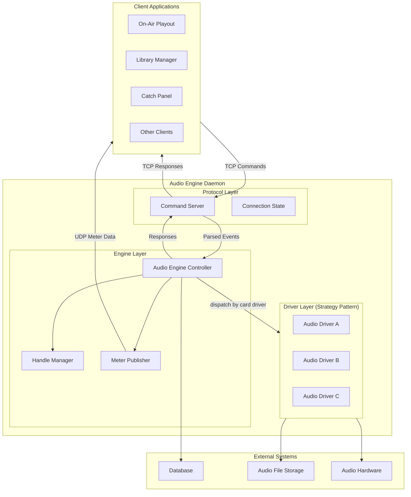
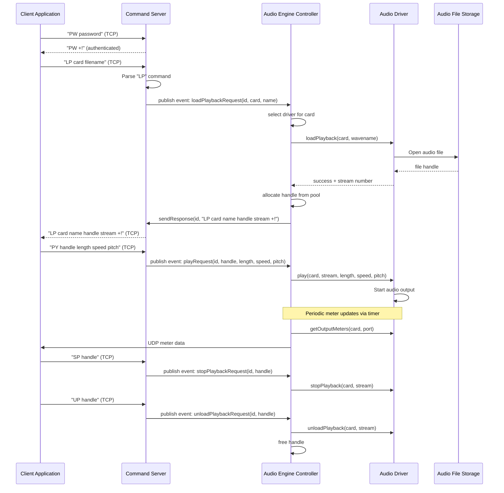
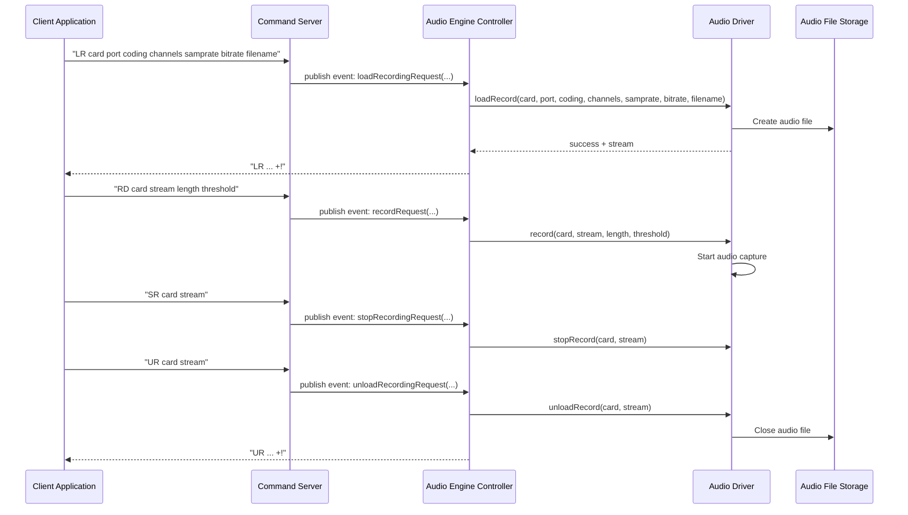
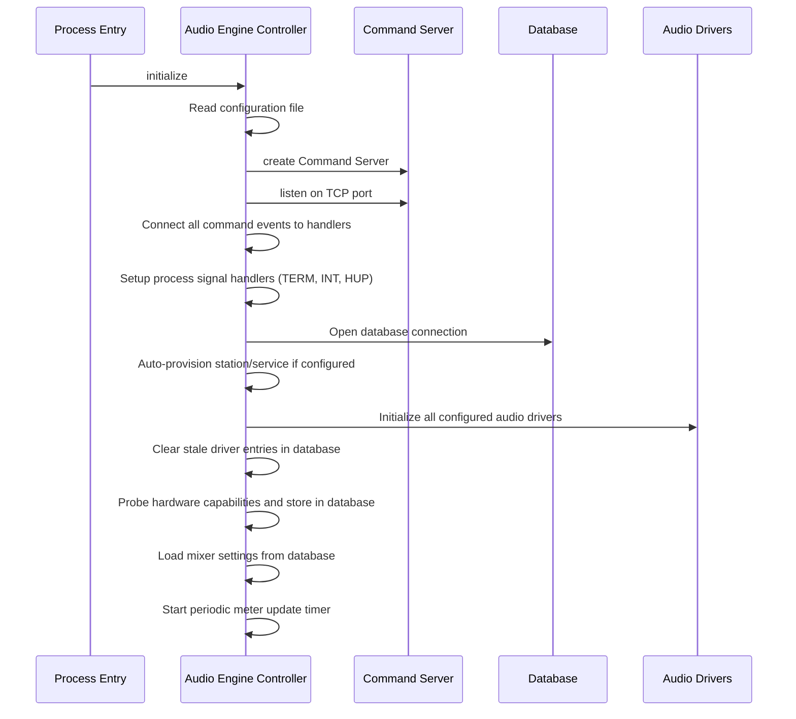
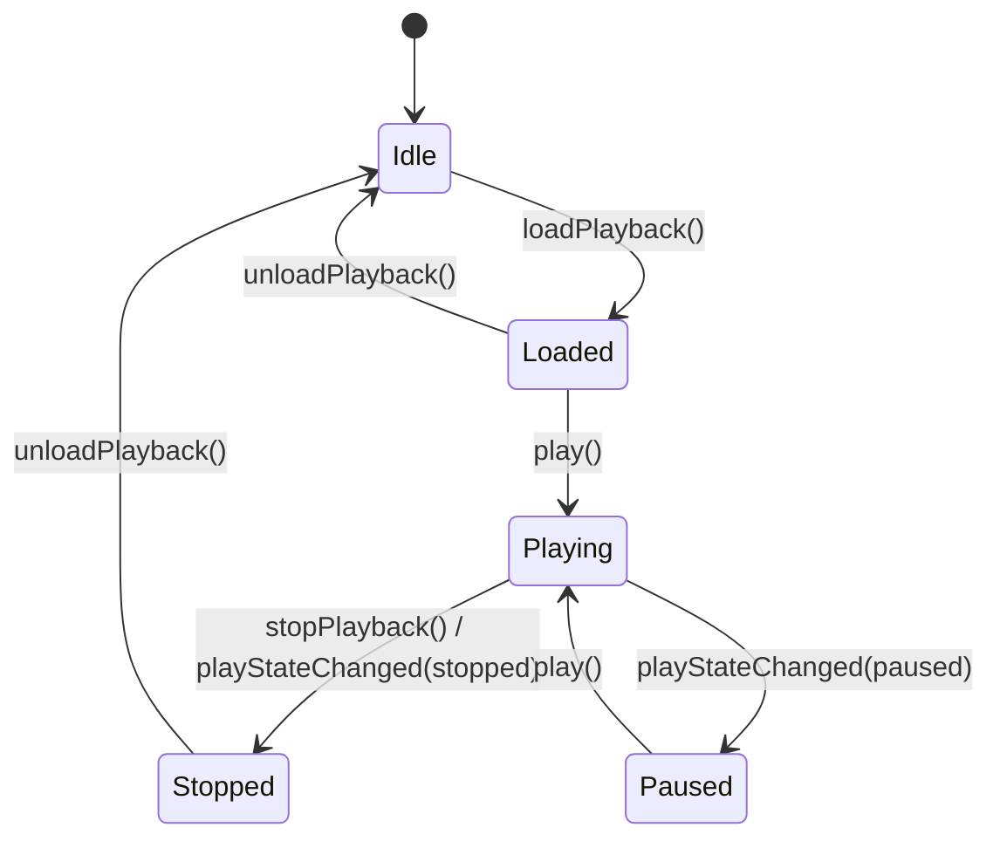
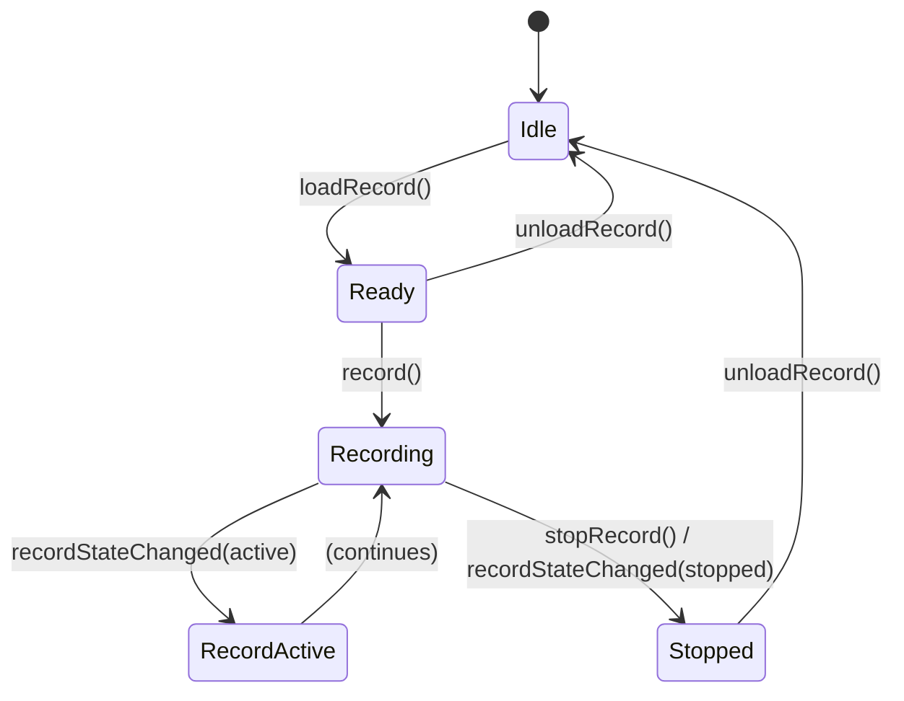
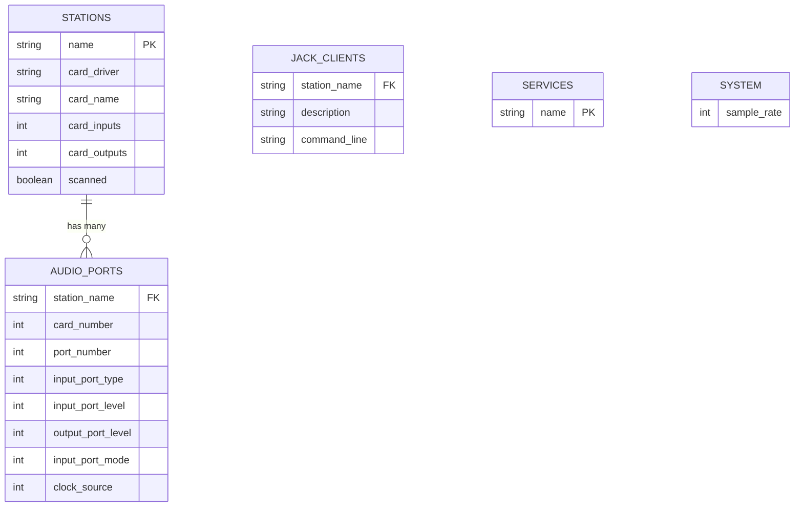

# Design Document: Audio Engine Daemon (CAE)

## Overview

**Purpose:** The Audio Engine Daemon provides centralized audio hardware management for the Rivendell radio automation system. It abstracts multiple audio device backends behind a uniform TCP command protocol, enabling client applications to perform playback, recording, volume control, metering, and audio routing without direct hardware access.

**Users:** On-air operators (via playout applications), production engineers (via library/recording applications), system administrators (via configuration), and client application developers (via the command protocol).

**Impact:** CAE is a critical infrastructure daemon. All audio operations in the system flow through it. It manages exclusive access to audio hardware, preventing resource conflicts between concurrent client applications.

### Goals
- Provide a unified, driver-agnostic interface for audio playback and recording across heterogeneous sound card hardware
- Support concurrent multi-client access with per-connection resource isolation and authentication
- Deliver real-time audio metering data to connected clients via UDP
- Automatically detect and configure audio hardware capabilities on startup
- Clean up resources automatically when clients disconnect or the daemon shuts down

### Non-Goals
- Direct user interface (CAE is headless; all interaction is via TCP/UDP protocol)
- Audio file format conversion (handled by the core library)
- Scheduling or automation logic (handled by playout and catch applications)
- Audio device driver implementation details (these are platform-specific and will be replaced in re-implementation)
- Network audio streaming beyond RTP capture

## Architecture

### Architecture Pattern & Boundary Map



**Architecture Integration:**
- Selected pattern: Strategy pattern for driver dispatch -- each sound card is assigned a driver at startup, and all audio operations are dispatched to the appropriate driver implementation based on the card number
- Domain boundaries: Protocol layer handles TCP parsing and authentication; Engine layer handles business logic and resource management; Driver layer handles hardware-specific operations
- The audio engine controller acts as a facade, receiving all parsed commands from the protocol layer and dispatching to the correct driver

### Technology Stack

| Layer | Choice | Role | Notes |
|-------|--------|------|-------|
| Protocol | TCP server (text-based) | Accept client connections, parse commands | Two-letter command codes, newline-delimited |
| Metering | UDP socket | Broadcast real-time meter levels | Periodic polling from drivers |
| Business Logic | Audio Engine Controller | Command dispatch, handle management, resource tracking | Strategy pattern for driver selection |
| Data Access | Database (relational) | Station config, port config, capabilities | Via core library Active Record classes |
| Audio I/O | Audio device drivers | Hardware interaction for playback/recording | Platform-specific, abstracted by driver interface |
| File I/O | Audio file library | Read/write audio files (WAV, MP2, MP3, FLAC, Ogg) | Via core library |
| Configuration | Configuration file | Database credentials, paths, passwords, provisioning | Read at startup |

## System Flows

### Playback Flow



### Recording Flow



### Startup Initialization Flow



### Playback State Machine



### Recording State Machine



## Requirements Traceability

| Requirement | Summary | Components | Interfaces | Flows |
|-------------|---------|------------|------------|-------|
| 1 | Client Authentication | Command Server, Connection State | TCP Protocol | Playback Flow (auth step) |
| 2 | Audio Playback | Audio Engine Controller, Handle Manager, Audio Drivers | TCP Protocol, Driver Interface | Playback Flow |
| 3 | Audio Recording | Audio Engine Controller, Audio Drivers | TCP Protocol, Driver Interface | Recording Flow |
| 4 | Volume/Level Control | Audio Engine Controller, Audio Drivers | TCP Protocol, Driver Interface | -- |
| 5 | Input Configuration | Audio Engine Controller, Audio Drivers | TCP Protocol, Driver Interface | -- |
| 6 | Output Configuration | Audio Engine Controller, Audio Drivers | TCP Protocol, Driver Interface | -- |
| 7 | Real-Time Metering | Meter Publisher, Audio Drivers | UDP Protocol, Driver Interface | Playback Flow (meter updates) |
| 8 | Clock/Timescaling | Audio Engine Controller, Audio Drivers | TCP Protocol, Driver Interface | -- |
| 9 | RTP Capture | Audio Engine Controller, Audio Drivers | TCP Protocol, Driver Interface | -- |
| 10 | Command Protocol | Command Server, Connection State | TCP Protocol | All flows |
| 11 | Driver Dispatch | Audio Engine Controller, Audio Drivers | Driver Interface | Playback Flow, Recording Flow |
| 12 | Handle Management | Handle Manager | Internal | Playback Flow |
| 13 | Connection Lifecycle | Command Server, Audio Engine Controller | TCP Protocol | -- |
| 14 | Daemon Startup | Audio Engine Controller, Command Server, Audio Drivers | Database, Config File | Startup Flow |
| 15 | Graceful Shutdown | Audio Engine Controller, Audio Drivers | Process Signals | -- |
| 16 | Codec Detection | Audio Engine Controller | Dynamic Library Loading | Startup Flow |

## Components and Interfaces

| Component | Domain/Layer | Intent | Req Coverage | Key Dependencies | Contracts |
|-----------|--------------|--------|--------------|------------------|-----------|
| Command Server | Protocol | Accept TCP connections, parse text commands, emit typed events | 1, 10 | Configuration (P0) | Service, Event |
| Connection State | Protocol | Hold per-connection authentication, buffering, meter config | 1, 10 | Command Server (P0) | State |
| Audio Engine Controller | Engine | Dispatch audio commands to drivers, manage resources | 2-9, 11, 13-16 | Command Server (P0), Audio Drivers (P0), Database (P0) | Service, Event |
| Handle Manager | Engine | Allocate/free/lookup playback handles (256 circular pool) | 12 | Audio Engine Controller (P0) | Service |
| Meter Publisher | Engine | Poll driver meters and send UDP updates to clients | 7 | Audio Drivers (P0), Command Server (P1) | Service |
| Audio Driver (interface) | Driver | Abstract audio hardware operations | 2-6, 8, 9, 11 | Audio Hardware (P0), Audio File Storage (P0) | Service |

### Protocol Layer

#### Command Server

| Field | Detail |
|-------|--------|
| Intent | Accept TCP client connections, parse the two-letter text command protocol, and emit typed events for each recognized command |
| Requirements | 1, 10 |

**Responsibilities & Constraints**
- Listen on a configured TCP port for incoming connections
- Parse newline-delimited, space-separated command tokens
- Validate authentication state before dispatching privileged commands
- Maintain a map of active connections with independent state
- Support broadcasting responses to all connections or targeted to a specific connection

**Dependencies**
- Inbound: Client applications -- TCP connections (P0)
- Outbound: Audio Engine Controller -- command events (P0)
- External: Configuration -- password for authentication (P0)

**Contracts**: Service [x] / Event [x] / State [x]

##### Service Interface
```
interface CommandServer {
  listen(address: string, port: number): boolean
  sendResponse(connectionId: number, response: string): void
  broadcastResponse(response: string): void
  getConnectionIds(): list of number
  getPeerAddress(connectionId: number): string
  getMeterPort(connectionId: number): number
  setMeterPort(connectionId: number, port: number): void
  isMetersEnabled(connectionId: number): boolean
  setMetersEnabled(connectionId: number, enabled: boolean): void
}
```

##### Event Contract
- Published events: loadPlaybackRequest, unloadPlaybackRequest, playPositionRequest, playRequest, stopPlaybackRequest, timescalingSupportRequest, loadRecordingRequest, unloadRecordingRequest, recordRequest, stopRecordingRequest, setInputVolumeRequest, setOutputVolumeRequest, fadeOutputVolumeRequest, setInputLevelRequest, setOutputLevelRequest, setInputModeRequest, setOutputModeRequest, setInputVoxLevelRequest, setInputTypeRequest, getInputStatusRequest, setAudioPassthroughLevelRequest, setClockSourceRequest, setOutputStatusFlagRequest, openRtpCaptureChannelRequest, meterEnableRequest, connectionDropped
- Subscribed events: none
- Ordering: Commands processed sequentially per connection

##### Protocol Command Reference

| Code | Name | Arguments |
|------|------|-----------|
| DC | Disconnect | (none) |
| PW | Password | password_string |
| LP | Load Playback | card filename |
| UP | Unload Playback | handle |
| PP | Play Position | handle position |
| PY | Play | handle length speed pitch |
| SP | Stop Playback | handle |
| TS | Timescale Support | card |
| LR | Load Recording | card port coding channels samprate bitrate filename |
| UR | Unload Recording | card stream |
| RD | Record | card stream length threshold |
| SR | Stop Recording | card stream |
| IV | Input Volume | card stream level |
| OV | Output Volume | card stream port level |
| FV | Fade Volume | card stream port level length |
| IL | Input Level | card port level |
| OL | Output Level | card port level |
| IM | Input Mode | card port mode |
| OM | Output Mode | card port mode |
| IX | Input Vox Level | card stream level |
| IT | Input Type | card port type |
| IS | Input Status | card port |
| AL | Audio Passthrough | card input output level |
| CS | Clock Source | card input |
| OS | Output Status Flag | card port stream state |
| ME | Meter Enable | udp_port card1 [card2...] |

#### Connection State

| Field | Detail |
|-------|--------|
| Intent | Hold per-connection state including TCP socket reference, authentication flag, command accumulator buffer, and meter configuration |
| Requirements | 1, 10 |

**Responsibilities & Constraints**
- Track whether the connection has been authenticated
- Buffer partial command data until a complete line is received
- Store the UDP port for meter delivery and whether metering is enabled

##### State Management
- State model: `{ socket, authenticated: boolean, commandBuffer: string, meterPort: number, metersEnabled: boolean }`
- One instance per active TCP connection
- Lifecycle tied to TCP connection (created on connect, destroyed on disconnect)

### Engine Layer

#### Audio Engine Controller

| Field | Detail |
|-------|--------|
| Intent | Central coordinator that receives parsed audio commands and dispatches them to the appropriate audio driver based on card configuration |
| Requirements | 2, 3, 4, 5, 6, 7, 8, 9, 11, 13, 14, 15, 16 |

**Responsibilities & Constraints**
- Dispatch all audio operations to the correct driver using a strategy pattern based on the per-card driver configuration
- Validate card, port, and stream boundaries before dispatching
- Manage connection resource ownership (track which connection owns which playback/recording streams)
- Clean up all resources owned by a connection when it disconnects
- Initialize all subsystems on startup: database, drivers, provisioning, hardware probing, mixer loading
- Handle process termination signals for graceful shutdown
- Coordinate periodic meter updates

**Dependencies**
- Inbound: Command Server -- command events (P0)
- Outbound: Audio Drivers -- hardware operations (P0)
- Outbound: Handle Manager -- handle allocation/lookup (P0)
- Outbound: Meter Publisher -- meter data distribution (P1)
- External: Database -- station/port configuration, provisioning (P0)
- External: Configuration file -- startup parameters (P0)

**Contracts**: Service [x] / Event [x] / State [x]

##### State Management
- Per-card driver type: `driverType[MAX_CARDS]`
- Per-card/stream ownership: `playOwner[MAX_CARDS][MAX_STREAMS]`, `recordOwner[MAX_CARDS][MAX_STREAMS]`
- Per-card/stream parameters: length, speed, pitch, threshold
- Output status flags: `outputStatusFlag[MAX_CARDS][MAX_PORTS][MAX_STREAMS]`
- Global: system sample rate, debug mode, shutdown flag

#### Handle Manager

| Field | Detail |
|-------|--------|
| Intent | Manage a circular pool of 256 playback handles, mapping handles to card/stream/owner tuples |
| Requirements | 12 |

**Responsibilities & Constraints**
- Allocate handles from a 256-entry circular pool
- Map each handle to { card, stream, owner }
- Detect and clear stale handles (same card+stream already mapped)
- Free handles when playback is unloaded
- Handle index wraps at 255 back to 0

##### Service Interface
```
interface HandleManager {
  allocateHandle(card: number, stream: number, owner: number): number
  lookupHandle(handle: number): { card: number, stream: number, owner: number } | null
  findByCardStream(card: number, stream: number): number | null
  freeHandle(handle: number): void
}
```

#### Meter Publisher

| Field | Detail |
|-------|--------|
| Intent | Periodically poll audio levels from all active drivers and distribute meter data to connected clients via UDP |
| Requirements | 7 |

**Responsibilities & Constraints**
- Run on a periodic timer at the configured meter update interval
- For each enabled connection, poll input meters, output meters, stream meters, playback positions, and output status from drivers
- Send meter data as UDP packets to each connection's configured meter port
- Also responsible for checking the shutdown flag on each timer tick

**Dependencies**
- Inbound: Audio Engine Controller -- timer trigger (P0)
- Outbound: Audio Drivers -- meter queries (P0)
- Outbound: Client connections -- UDP meter packets (P0)

### Driver Layer

#### Audio Driver (Interface)

| Field | Detail |
|-------|--------|
| Intent | Define the contract that all audio device drivers must implement for hardware abstraction |
| Requirements | 2, 3, 4, 5, 6, 8, 9, 11 |

**Responsibilities & Constraints**
- Each driver implementation manages one type of audio hardware
- Drivers are initialized once at startup and freed at shutdown
- All methods are synchronous from the caller's perspective (some use internal timers for fades and recording)

**Contracts**: Service [x]

##### Service Interface
```
interface AudioDriver {
  // Lifecycle
  init(stationConfig: StationConfig): void
  free(): void
  getVersion(): string

  // Playback
  loadPlayback(card: number, filename: string): { success: boolean, stream: number }
  unloadPlayback(card: number, stream: number): boolean
  setPlaybackPosition(card: number, stream: number, position: number): boolean
  play(card: number, stream: number, length: number, speed: number, pitchEnabled: boolean, rateChange: boolean): boolean
  stopPlayback(card: number, stream: number): boolean
  isTimescaleSupported(card: number): boolean

  // Recording
  loadRecord(card: number, port: number, codec: number, channels: number, sampleRate: number, bitRate: number, filename: string): { success: boolean, stream: number }
  unloadRecord(card: number, stream: number): { success: boolean, length: number }
  record(card: number, stream: number, length: number, threshold: number): boolean
  stopRecord(card: number, stream: number): boolean

  // Volume & Levels
  setInputVolume(card: number, stream: number, level: number): boolean
  setOutputVolume(card: number, stream: number, port: number, level: number): boolean
  fadeOutputVolume(card: number, stream: number, port: number, level: number, duration: number): boolean
  setInputLevel(card: number, port: number, level: number): boolean
  setOutputLevel(card: number, port: number, level: number): boolean

  // Configuration
  setInputMode(card: number, stream: number, mode: number): boolean
  setOutputMode(card: number, stream: number, mode: number): boolean
  setInputVoxLevel(card: number, stream: number, level: number): boolean
  setInputType(card: number, port: number, type: number): boolean
  getInputStatus(card: number, port: number): boolean
  setClockSource(card: number, input: number): boolean
  setPassthroughLevel(card: number, inputPort: number, outputPort: number, level: number): boolean

  // Metering
  getInputMeters(card: number, port: number): { left: number, right: number }
  getOutputMeters(card: number, port: number): { left: number, right: number }
  getStreamOutputMeters(card: number, stream: number): { left: number, right: number }
  getOutputPosition(card: number): list of number
}
```

## Data Models

### Domain Model

CAE does not own any database tables. It accesses tables defined in the core library (LIB artifact) via Active Record classes:

- **Station** (aggregate root for audio hardware config): card drivers, capabilities, driver versions
- **Audio Port** (child of Station): per-port input/output configuration (type, levels, modes, clock source)
- **System** (singleton): system-wide settings such as sample rate
- **Service**: service registry entries (for auto-provisioning)

### Logical Data Model



### Audio File Access
- Playback reads audio files from a configured audio storage path
- Recording writes audio files to the same storage path
- File ownership is set to configured user/group identifiers
- Supported codecs: PCM 16-bit, PCM 24-bit, MPEG Layer 2, MPEG Layer 3, Ogg Vorbis, FLAC

### Configuration Model

| Key | Type | Description |
|-----|------|-------------|
| database.driver | string | Database driver |
| database.name | string | Database name |
| database.username | string | Database username |
| database.password | string | Database password |
| database.hostname | string | Database hostname |
| station.name | string | This station's identity |
| auth.password | string | Authentication password for command protocol |
| audio.filePath(name) | string | Maps logical audio name to filesystem path |
| file.uid | number | User ID for file ownership |
| file.gid | number | Group ID for file ownership |
| provisioning.createHost | boolean | Enable auto-host provisioning |
| provisioning.hostTemplate | string | Template station name |
| provisioning.hostIpAddress | string | IP for provisioned host |
| provisioning.hostShortName | string | Short name for provisioned host |
| provisioning.createService | boolean | Enable auto-service provisioning |
| provisioning.serviceTemplate | string | Template service |
| provisioning.serviceName | string | Service name to provision |

## Error Handling

### Error Categories and Responses

**Startup Errors (fatal):**
- TCP port bind failure: log error and terminate
- Database connection failure: log error and terminate
- Host provisioning failure: log error and terminate with non-zero exit code
- Service provisioning failure: log error and terminate with non-zero exit code

**Runtime Errors (recoverable):**
- Stream allocation failure: return error response ("-!") to the requesting client, log a warning
- Stale handle detected: clear stale handle, log a warning, and continue with new allocation
- Realtime scheduling failure: log warning and continue without realtime priority
- MP2 encoder initialization failure: return failure to caller, log warning
- MP2 encoder parameter validation failure: return failure to caller, log warning

**Protocol Errors:**
- Unrecognized command: return generic error response to the client
- Command parameter validation failure (card/port/stream/mode/type/codec out of range): silently reject the command
- Unauthenticated client sends privileged command: silently ignore

### Error Response Format
- Success: `COMMAND_CODE [params] +!`
- Failure: `COMMAND_CODE [params] -!`
- Unrecognized: `command_tokens-!`

## Testing Strategy

### Unit Tests
- Handle Manager: allocate, free, lookup, stale detection, circular wrap-around
- Command parser: parse all 26 command codes with valid and invalid arguments
- Authentication state machine: unauthenticated rejection, successful auth, failed auth
- Parameter validation: card, port, stream, mode, type, codec boundary checks
- Connection cleanup: verify all owned resources are released on disconnect

### Integration Tests
- Full playback lifecycle: authenticate, load, play, stop, unload via TCP protocol
- Full recording lifecycle: authenticate, load, record, stop, unload via TCP protocol
- Concurrent client connections: multiple clients sharing the same daemon
- Meter delivery: verify UDP meter packets are sent to the correct port at the correct interval
- Driver dispatch: commands routed to correct driver based on card configuration

### E2E Tests
- Startup initialization: daemon starts, provisions station if needed, probes hardware, begins listening
- Client disconnect cleanup: client drops mid-playback, verify streams are released
- Graceful shutdown: send SIGTERM, verify all drivers are freed and daemon exits cleanly
- Authentication enforcement: verify commands are rejected before PW, accepted after

### Performance Tests
- Meter update latency under load with maximum cards and streams active
- Concurrent client command throughput
- Handle allocation performance with near-full pool (approaching 256 handles)
