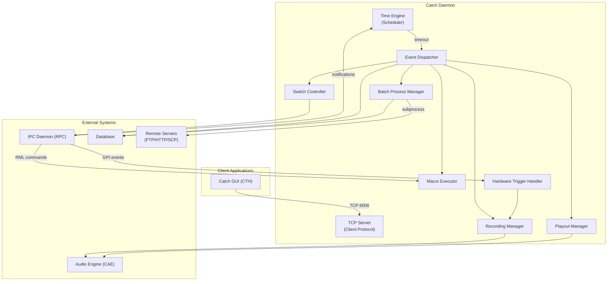
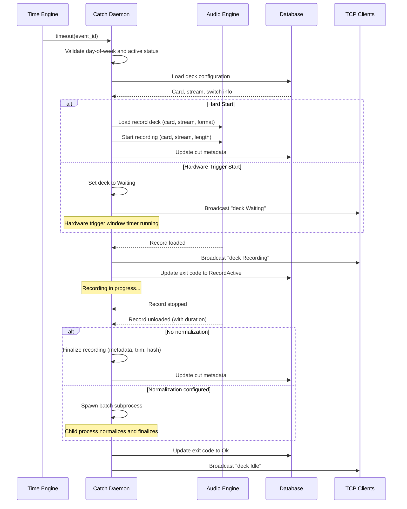
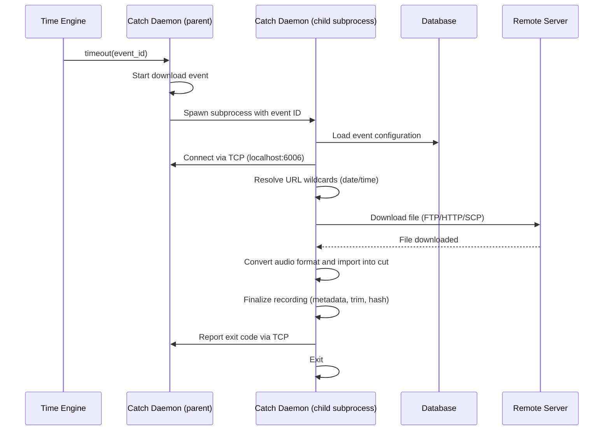
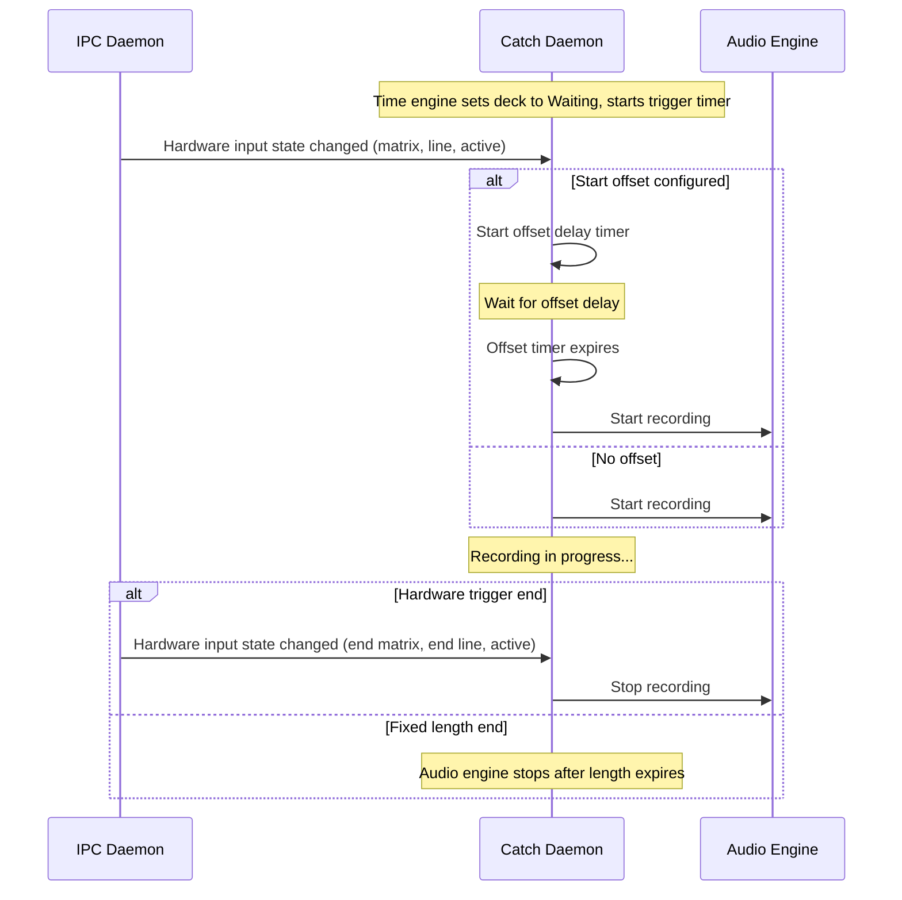
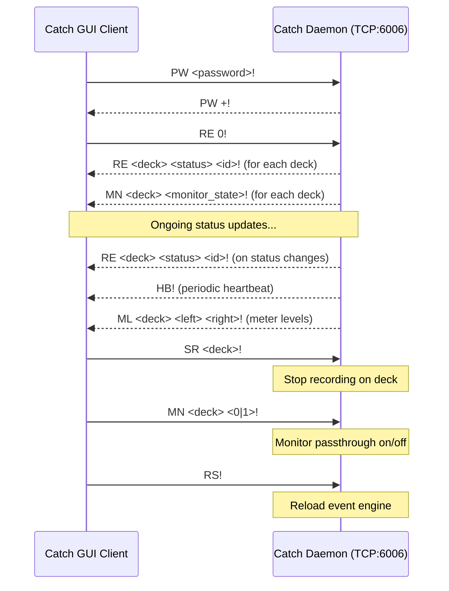
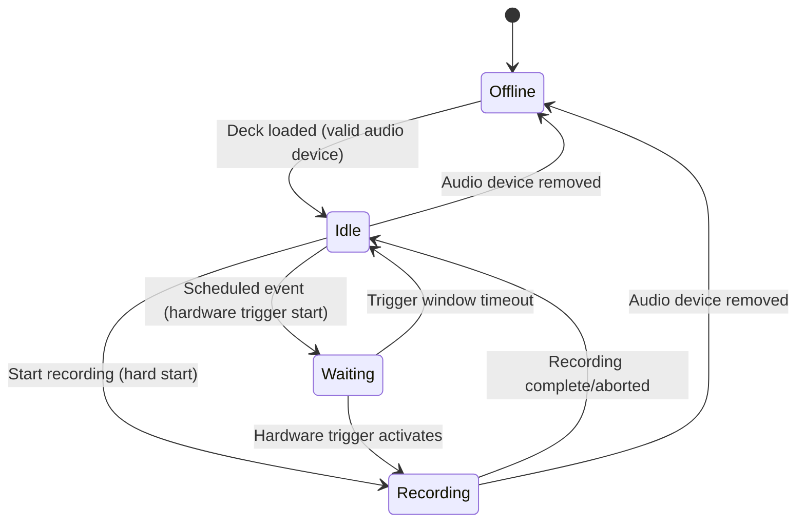
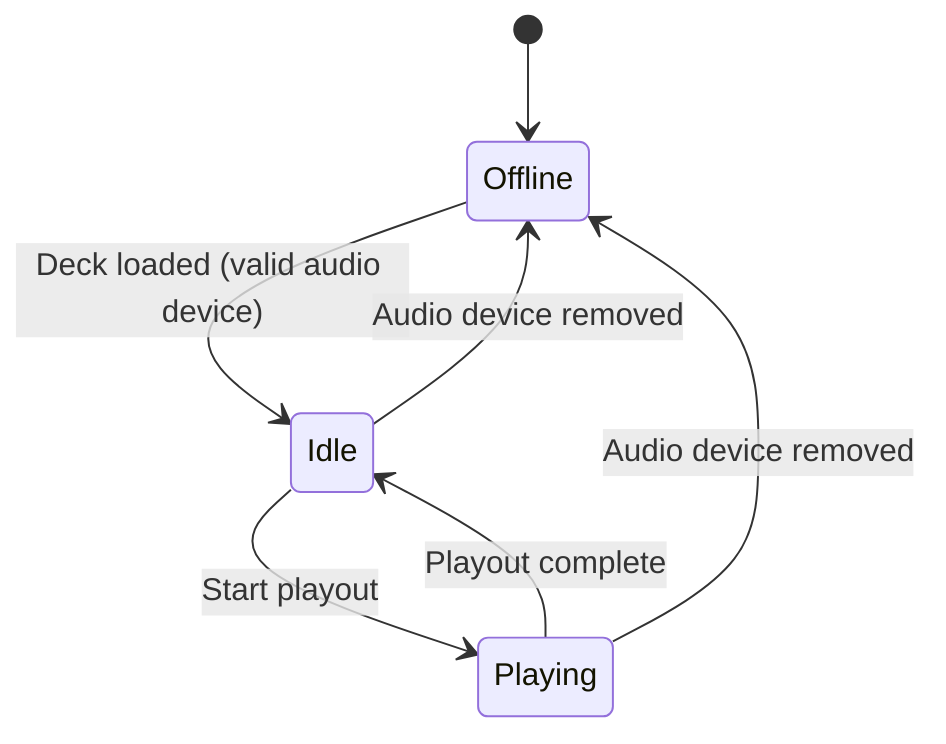
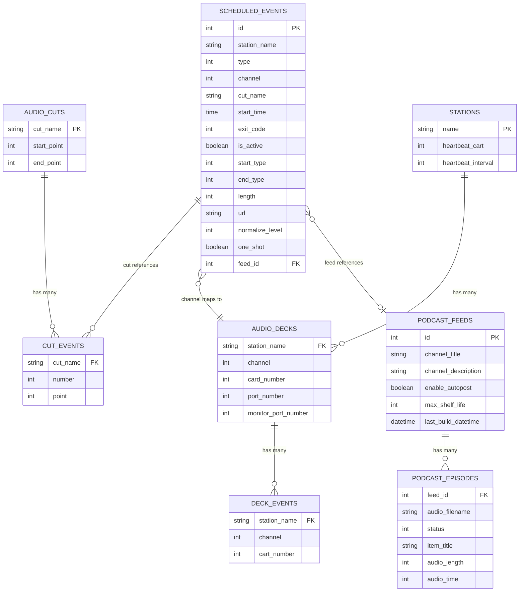

# Design Document

## Overview

**Purpose**: The Catch Daemon is the scheduling and execution engine for timed audio events in the radio automation system. It runs as a background service that loads event schedules from the database, monitors time-based and hardware-based triggers, and dispatches audio operations (recording, playout, downloads, uploads, macro execution, switch control) to the appropriate subsystems.

**Users**: Radio station operators (indirectly, via the Catch GUI client application), other system daemons (audio engine, IPC daemon), and batch subprocesses.

**Impact**: Central coordination point for all scheduled audio operations. Interacts with the audio engine for recording/playout, the IPC daemon for hardware triggers and inter-daemon communication, the database for event persistence, and remote servers for file transfers.

### Goals

- Execute scheduled audio events reliably at configured times and days of week
- Support hardware-triggered (GPI) recording start and stop with configurable windows and offsets
- Manage concurrent recording and playout decks (up to 8 each)
- Process batch operations (downloads, uploads, normalization) via subprocess isolation
- Provide real-time status updates to connected GUI clients via TCP protocol
- Support podcast publishing after successful uploads
- Handle daemon restarts gracefully by detecting and marking interrupted events

### Non-Goals

- User interface (this is a headless daemon; the GUI is a separate artifact CTH)
- Audio device driver management (delegated to the audio engine daemon CAE)
- Hardware I/O management (delegated to the IPC daemon RPC)
- Database schema management (tables are owned by the core library LIB)
- Platform-specific audio codec implementation details

## Architecture

### Architecture Pattern & Boundary Map



**Architecture Integration**:
- Selected pattern: Event-driven daemon with time-based scheduler and reactive event handlers
- Domain boundaries: Recording, playout, batch processing, and client communication are logically separated
- The daemon uses a single-process event loop with signal-based reactive dispatch
- Batch operations are isolated into forked subprocesses for reliability

### Technology Stack

| Layer | Choice | Role | Notes |
|-------|--------|------|-------|
| Runtime | Background daemon process | Long-running service | Auto-started by service manager (SVC) |
| Scheduling | Time engine | Fire events at scheduled times | Loaded from database on startup and on reload |
| Audio I/O | Audio engine client (CAE) | Recording and playout control | Via IPC connection to audio engine daemon |
| Hardware I/O | IPC daemon client (RPC) | GPI triggers, RML commands, notifications | Via IPC connection to IPC daemon |
| Network | TCP server | Client communication | Port 6006 default, custom text protocol |
| Data | Relational database | Event persistence and configuration | Shared database with other system components |
| File Transfer | Download/upload adapters | FTP, HTTP, SCP file transfers | Used by batch subprocesses |

## System Flows

### Scheduled Recording Flow



### Download Batch Flow



### Hardware-Triggered Recording Flow



### TCP Client Protocol Flow



### State Machine: Record Deck



### State Machine: Playout Deck



## Requirements Traceability

| Requirement | Summary | Components | Interfaces | Flows |
|-------------|---------|------------|------------|-------|
| 1.1-1.2 | Event day-of-week filtering | EventDispatcher | Time Engine callback | Scheduled Recording |
| 1.3 | Event type dispatch | EventDispatcher | Time Engine callback | All event flows |
| 1.4 | Cut existence validation | EventDispatcher | Database query | Scheduled Recording |
| 1.5-1.7 | Startup event loading and cleanup | EventScheduler | Database query | -- |
| 1.8 | One-shot event purge | EventDispatcher | Database delete | -- |
| 1.9 | Live event notifications | EventScheduler | IPC notification | -- |
| 1.10 | Startup cart | EventScheduler | Macro executor | -- |
| 2.1-2.5 | Recording start (hard/GPI) | RecordingManager | Audio Engine, GPI handler | Scheduled Recording, GPI Recording |
| 2.6-2.8 | Recording end types | RecordingManager | Audio Engine | Scheduled Recording |
| 2.9 | Deck busy check | RecordingManager | -- | Scheduled Recording |
| 2.10-2.11 | Recording finalization | RecordingManager, BatchProcessor | Audio Engine, Database | Scheduled Recording, Download Batch |
| 2.12-2.13 | Multiple GPI recordings | RecordingManager | GPI handler | GPI Recording |
| 3.1-3.2 | Playout and cut events | PlayoutManager, EventPlayer | Audio Engine | -- |
| 3.3-3.4 | Macro execution | MacroExecutor | Macro engine | -- |
| 3.5 | Switch commands | SwitchController | IPC daemon | -- |
| 3.6-3.8 | Local RML commands | LocalCommandHandler | Database, Audio Engine | -- |
| 4.1-4.3 | Download processing | BatchProcessor | File transfer, Audio converter | Download Batch |
| 4.4 | Upload processing | BatchProcessor | File transfer, Audio converter | -- |
| 4.5 | Anonymous FTP | BatchProcessor | File transfer | Download Batch |
| 4.6 | Podcast publishing | BatchProcessor | Database | -- |
| 4.7-4.8 | Batch status reporting | BatchProcessor | TCP protocol | Download Batch |
| 5.1-5.3 | TCP authentication | ClientProtocol | TCP server | TCP Client Protocol |
| 5.4-5.6 | Status and meter updates | ClientProtocol | TCP server | TCP Client Protocol |
| 5.7 | Heartbeat | ClientProtocol | TCP server | TCP Client Protocol |
| 5.8-5.10 | Client commands | ClientProtocol | TCP server | TCP Client Protocol |

## Components and Interfaces

| Component | Domain/Layer | Intent | Req Coverage | Key Dependencies | Contracts |
|-----------|-------------|--------|-------------|-----------------|-----------|
| EventScheduler | Core | Load and maintain scheduled events from database | 1 | Database, TimeEngine | Service, State |
| EventDispatcher | Core | Route timed events to type-specific handlers | 1, 2, 3, 4 | EventScheduler, all Managers | Service |
| RecordingManager | Audio | Manage recording deck lifecycle and audio capture | 2 | AudioEngine, GPI handler | Service, State, Event |
| PlayoutManager | Audio | Manage playout deck lifecycle and audio playback | 3 | AudioEngine, EventPlayer | Service, State |
| EventPlayer | Audio | Sequence timed cut event markers during playout | 3 | Database (cut events) | Service, Event |
| MacroExecutor | Automation | Execute macro carts with slot pooling | 3 | MacroEngine | Service |
| SwitchController | Automation | Send switch commands to IPC daemon | 3 | IPC daemon | Service |
| BatchProcessor | Processing | Manage download/upload/normalization subprocesses | 4 | FileTransfer, AudioConverter, Database | Batch |
| ClientProtocol | Network | Handle TCP client connections and command protocol | 5 | TCP server | Service, Event |
| ClientConnection | Network | Track per-client connection state | 5 | ClientProtocol | State |
| CatchEvent | Data | Value object representing a scheduled event | 1-4 | -- | State |

### Core

#### EventScheduler

| Field | Detail |
|-------|--------|
| Intent | Load scheduled events from database, maintain in-memory event list, respond to add/modify/delete notifications |
| Requirements | 1.5, 1.6, 1.7, 1.9, 1.10 |

**Responsibilities & Constraints**
- Load all events for the current station from the scheduled events table on startup
- Clean up interrupted events from previous sessions (mark uploading/downloading/recording-active as interrupted)
- Respond to live notifications for event add/modify/delete
- Manage the time engine (add/remove event timers)

**Dependencies**
- Inbound: IPC daemon -- event modification notifications (P0)
- Outbound: Database -- event persistence (P0)
- Outbound: Time Engine -- scheduling (P0)

**Contracts**: Service [x] / State [x]

##### Service Interface
```
interface EventSchedulerService {
  loadAllEvents(): void
  addEvent(eventId: number): void
  removeEvent(eventId: number): void
  updateEvent(eventId: number): void
  reloadEngine(): void
}
```

#### EventDispatcher

| Field | Detail |
|-------|--------|
| Intent | Receive time engine callbacks and route events to type-specific handlers after validation |
| Requirements | 1.1, 1.2, 1.3, 1.4, 1.8 |

**Responsibilities & Constraints**
- Validate event is active and current day of week is enabled
- Verify referenced audio cut exists before dispatching recording/playout/download events
- Route to RecordingManager, PlayoutManager, MacroExecutor, SwitchController, or BatchProcessor based on event type
- Purge one-shot events after successful execution

**Dependencies**
- Inbound: Time Engine -- timeout callbacks (P0)
- Outbound: RecordingManager, PlayoutManager, MacroExecutor, SwitchController, BatchProcessor (P0)
- Outbound: Database -- cut existence check, one-shot deletion (P0)

**Contracts**: Service [x]

### Audio

#### RecordingManager

| Field | Detail |
|-------|--------|
| Intent | Manage recording deck lifecycle including hard-start and hardware-triggered recordings |
| Requirements | 2.1, 2.2, 2.3, 2.4, 2.5, 2.6, 2.7, 2.8, 2.9, 2.10, 2.11, 2.12, 2.13 |

**Responsibilities & Constraints**
- Manage up to 8 recording decks with state tracking (Offline, Idle, Waiting, Recording)
- Support hard-start and hardware-trigger-start recording modes
- Handle hardware trigger windows with configurable timeout
- Support offset delay between trigger activation and recording start
- Calculate recording length based on end type (fixed-length, hard-end, hardware-trigger-end)
- Detect and reject recordings when deck is busy
- Finalize recordings directly or via batch normalization subprocess
- Support multiple sequential recordings for hardware-triggered events

**Dependencies**
- Inbound: EventDispatcher -- recording event dispatch (P0)
- Inbound: Hardware trigger handler -- GPI state changes (P0)
- Outbound: Audio Engine -- record load/start/stop (P0)
- Outbound: BatchProcessor -- normalization subprocess (P1)
- Outbound: Database -- cut metadata, exit codes (P0)

**Contracts**: Service [x] / State [x] / Event [x]

##### State Management
- State model: Record Deck Status (Offline -> Idle -> Waiting -> Recording -> Idle)
- Each deck maintains independent state
- Hardware trigger timers are per-event

##### Event Contract
- Subscribed events: Audio engine record loaded/started/stopped/unloaded, hardware trigger state changes
- Published events: Status broadcasts to TCP clients

#### PlayoutManager

| Field | Detail |
|-------|--------|
| Intent | Manage playout deck lifecycle and audio playback |
| Requirements | 3.1, 3.2 |

**Responsibilities & Constraints**
- Manage up to 8 playout decks
- Load and play audio cuts at configured start/end points
- Coordinate with EventPlayer for timed cut event markers

**Dependencies**
- Inbound: EventDispatcher -- playout event dispatch (P0)
- Outbound: Audio Engine -- play load/start/stop (P0)
- Outbound: EventPlayer -- cut event sequencing (P1)

**Contracts**: Service [x] / State [x]

#### EventPlayer

| Field | Detail |
|-------|--------|
| Intent | Sequence timed event markers within audio cuts during playout to trigger macro cart execution |
| Requirements | 3.2 |

**Responsibilities & Constraints**
- Load cut event markers for a given audio cut
- Fire macro cart execution requests at correct audio positions
- Support start/stop of event sequencing

**Dependencies**
- Inbound: PlayoutManager -- load/start/stop (P0)
- Outbound: MacroExecutor -- cart execution requests via event (P0)

**Contracts**: Service [x] / Event [x]

##### Event Contract
- Published events: runCart(channel, number, cartNumber) -- request macro cart execution at a playout event point
- Subscribed events: internal timer timeout for next event marker

### Automation

#### MacroExecutor

| Field | Detail |
|-------|--------|
| Intent | Execute macro carts using a fixed pool of execution slots |
| Requirements | 3.3, 3.4 |

**Responsibilities & Constraints**
- Maintain a pool of up to 64 concurrent macro execution slots
- Allocate a free slot for each macro execution request
- Periodically clean up completed execution slots
- Reject execution when all slots are occupied

**Dependencies**
- Inbound: EventDispatcher, EventPlayer -- macro execution requests (P0)
- Outbound: Macro engine (from core library) -- cart execution (P0)

**Contracts**: Service [x]

#### SwitchController

| Field | Detail |
|-------|--------|
| Intent | Send audio switch commands to the IPC daemon for scheduled switch events |
| Requirements | 3.5 |

**Responsibilities & Constraints**
- Translate scheduled switch events into switching commands
- Send commands to the IPC daemon

**Dependencies**
- Outbound: IPC daemon -- switch commands (P0)

**Contracts**: Service [x]

### Processing

#### BatchProcessor

| Field | Detail |
|-------|--------|
| Intent | Manage batch subprocesses for downloads, uploads, and audio normalization |
| Requirements | 4.1, 4.2, 4.3, 4.4, 4.5, 4.6, 4.7, 4.8 |

**Responsibilities & Constraints**
- Spawn child daemon processes for batch operations (download, upload, normalization)
- Resolve URL wildcards with date/time values before file transfers
- Convert downloaded audio to the station's configured format
- Support FTP, HTTP, and SCP protocols with optional anonymous FTP
- Create podcast entries after successful uploads when feed is configured
- Report exit codes to parent process via TCP protocol
- Periodically poll for batch operation progress

**Dependencies**
- Inbound: EventDispatcher, RecordingManager -- batch operation requests (P0)
- Outbound: File transfer adapters (download/upload) -- remote file access (P0)
- Outbound: Audio converter -- format conversion (P0)
- Outbound: Database -- podcast entries, exit codes (P0)
- Outbound: ClientProtocol -- exit code reporting (P1)

**Contracts**: Batch [x]

##### Batch Contract
- Trigger: Event dispatch (download/upload) or recording completion (normalization)
- Input: Event configuration with URL, format, credentials
- Output: Imported audio cut or uploaded file; podcast entry if configured
- Idempotency: Events track exit codes; interrupted operations detected on restart

### Network

#### ClientProtocol

| Field | Detail |
|-------|--------|
| Intent | Handle TCP client connections, authentication, command parsing, and status broadcasting |
| Requirements | 5.1, 5.2, 5.3, 5.4, 5.5, 5.6, 5.7, 5.8, 5.9, 5.10 |

**Responsibilities & Constraints**
- Listen for TCP connections on configurable port (default 6006)
- Require password authentication before accepting commands
- Parse text-based command protocol (commands terminated by '!' character)
- Broadcast deck status changes to all authenticated clients
- Send periodic heartbeat messages and audio meter levels
- Support commands: authenticate, disconnect, reload, status request, stop, monitor, set exit code

**Dependencies**
- Inbound: TCP socket connections from GUI clients (P0)
- Inbound: Batch subprocesses -- exit code reporting (P1)
- Outbound: RecordingManager, PlayoutManager -- stop commands (P0)
- Outbound: EventScheduler -- reload commands (P0)

**Contracts**: Service [x] / Event [x]

##### TCP Command Protocol

| Command | Arguments | Auth Required | Description |
|---------|-----------|--------------|-------------|
| PW | password | No | Authenticate client |
| DC | -- | No | Disconnect |
| RS | -- | Yes | Reload event engine |
| RD | -- | Yes | Reload deck list |
| RO | -- | Yes | Reload time offset |
| RE | channel | Yes | Request deck status (0=all) |
| RM | 0/1 | Yes | Enable/disable meter data |
| SR | channel | Yes | Stop recording/playout |
| RH | -- | Yes | Reload heartbeat config |
| MN | channel, state | Yes | Set monitor passthrough on/off |
| SC | id, code, text | Yes | Set exit code (from batch subprocess) |

##### Event Contract
- Published events: Status broadcasts (RE), heartbeat (HB), meter levels (ML), monitor state (MN)
- Subscribed events: Deck status changes from RecordingManager and PlayoutManager

#### ClientConnection

| Field | Detail |
|-------|--------|
| Intent | Track per-client TCP connection state including authentication and meter preferences |
| Requirements | 5.2, 5.3, 5.6 |

**Responsibilities & Constraints**
- Track authentication state per connection
- Track meter data preference per connection
- Buffer incoming command data until command terminator is received
- Support graceful close with garbage collection

**Contracts**: State [x]

### Data

#### CatchEvent

| Field | Detail |
|-------|--------|
| Intent | Value object representing a scheduled catch event with all its configuration properties |
| Requirements | 1-4 |

**Responsibilities & Constraints**
- Hold all event configuration (~50 properties)
- Support URL wildcard resolution with date/time substitution
- Track day-of-week activation flags
- Support clear/reset to defaults

**Contracts**: State [x]

## Data Models

### Domain Model

- **CatchEvent** (aggregate): Represents a scheduled event with type, timing, audio format, trigger configuration, and transfer settings
- **RecordDeck** (entity): Recording deck with card/stream assignment and current status
- **PlayoutDeck** (entity): Playout deck with card assignment and current status
- **ClientConnection** (entity): Connected TCP client with authentication and preference state
- **MacroSlot** (entity): Execution slot for a running macro cart

### Logical Data Model



### Physical Data Model

All tables are owned by the core library (LIB). The Catch Daemon performs the following operations:

| Table | Operations | Key Filters |
|-------|-----------|-------------|
| SCHEDULED_EVENTS (RECORDINGS) | SELECT, UPDATE (exit code), DELETE (one-shot) | station_name = current station |
| AUDIO_DECKS (DECKS) | SELECT | station_name = current station |
| AUDIO_CUTS (CUTS) | SELECT (start/end points) | cut_name |
| CUT_EVENTS | SELECT, INSERT (CE macro), DELETE (before recording) | cut_name |
| DECK_EVENTS | SELECT | station_name, channel |
| STATIONS | SELECT (heartbeat config) | name = current station |
| LIBRARY_CONFIG (RDLIBRARY) | SELECT (default format) | station = current station |
| PODCAST_FEEDS (FEEDS) | SELECT, UPDATE (last_build_datetime) | id = feed_id |
| PODCAST_EPISODES (PODCASTS) | INSERT, DELETE (stale entries) | feed_id, audio_filename |

## Error Handling

### Error Categories

**System Errors**
- Audio device unavailable: Deck set to Offline, events on that deck cannot execute
- Audio engine disconnection: Connection state tracked, operations paused
- Database connectivity: Operations fail with appropriate exit codes

**Business Logic Errors**
- Deck busy: Exit code "DeviceBusy" written, status broadcast to clients
- Cut not found: Exit code "NoCut" written, event aborted with log warning
- Download/upload failure: Exit code reflects transfer error, logged
- Macro slots exhausted: Execution skipped with warning log

**Operational Errors**
- Daemon crash recovery: On restart, events in active states are marked as "Interrupted"
- Batch subprocess failure: Exit code communicated to parent via TCP protocol

### Error Notification

- Configurable error notification macro cart can be executed when errors occur
- Error messages support wildcard substitution for event details (ID, description, cut name, etc.)

## Testing Strategy

### Unit Tests
- Event day-of-week filtering logic
- Recording length calculation for each end type (fixed-length, hard-end, hardware-trigger-end)
- URL wildcard resolution with date/time substitution
- TCP command parsing and routing
- One-shot event purge logic

### Integration Tests
- Full recording lifecycle: schedule -> start -> record -> finalize
- Hardware-triggered recording with offset delay
- Download batch: spawn subprocess -> download -> convert -> import -> report
- Upload with podcast publishing
- Client authentication and command protocol

### E2E Tests
- Multiple concurrent recordings on different decks
- Hardware-triggered recording restart (multiple recordings mode)
- Daemon restart with interrupted event cleanup
- Client connection, status monitoring, and stop command

### Performance Tests
- Maximum concurrent recordings (8 decks)
- Maximum concurrent macro execution slots (64)
- Client connection handling under load
- Batch subprocess spawning and monitoring
