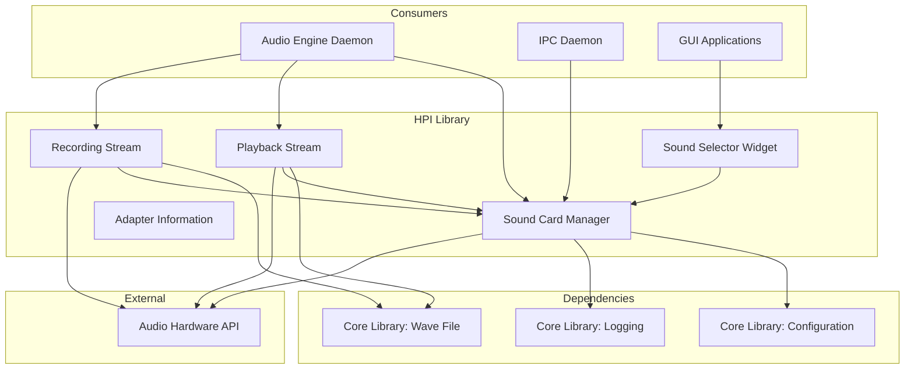
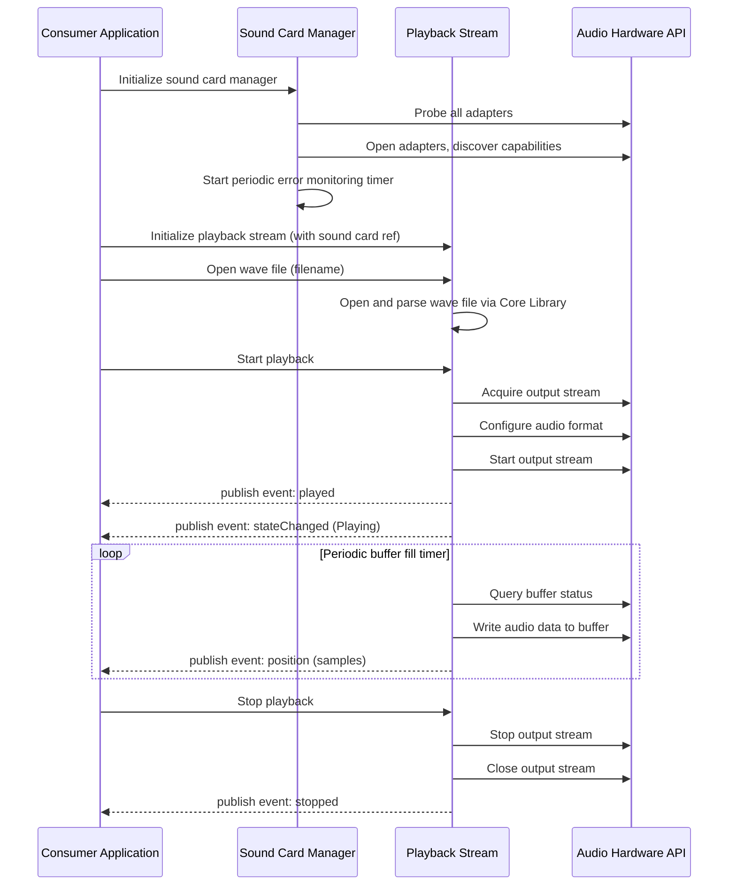
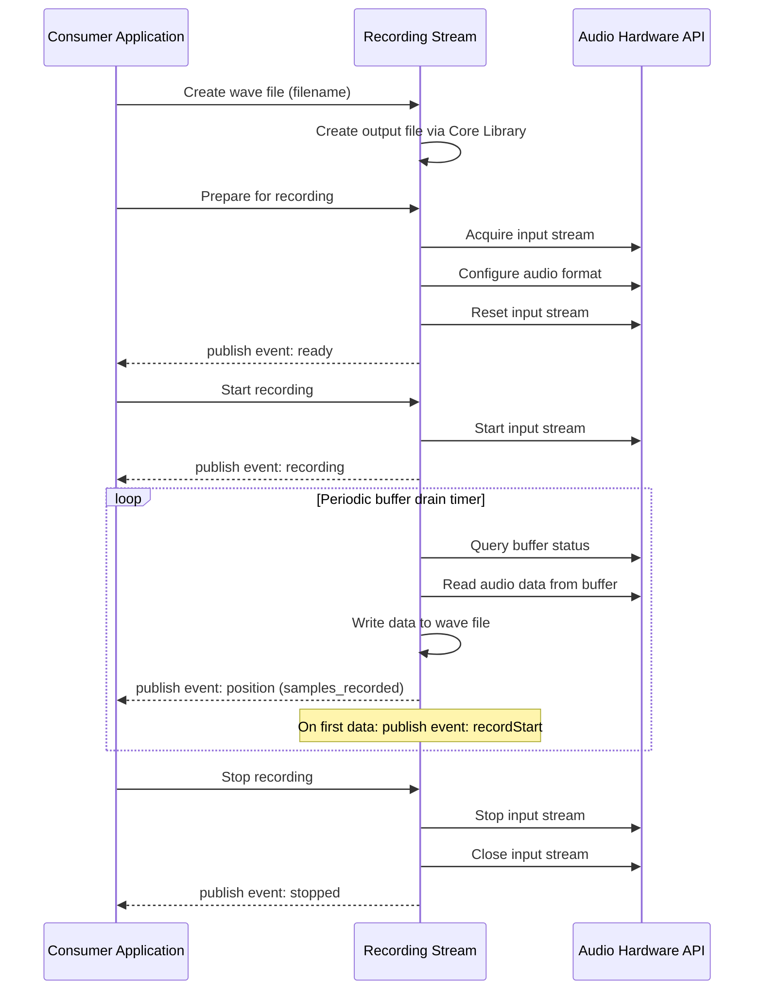
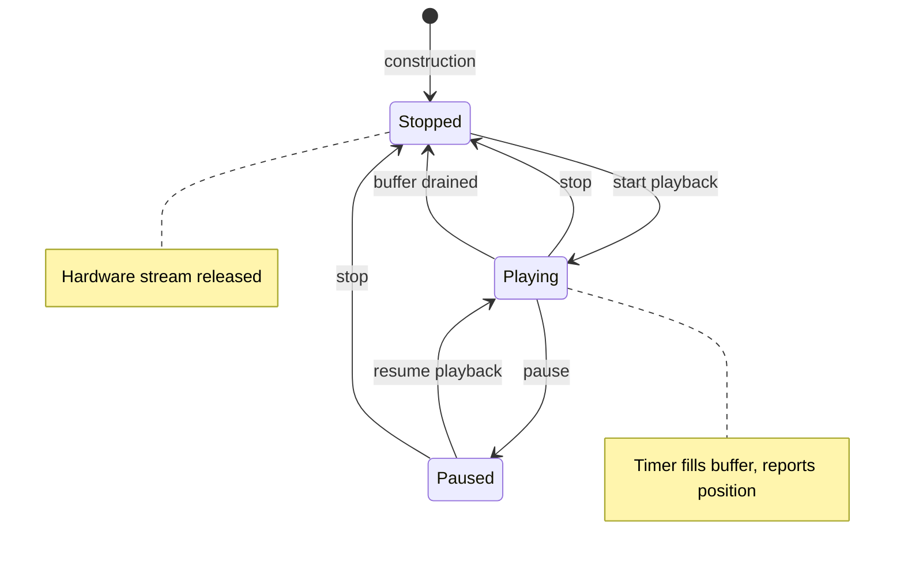
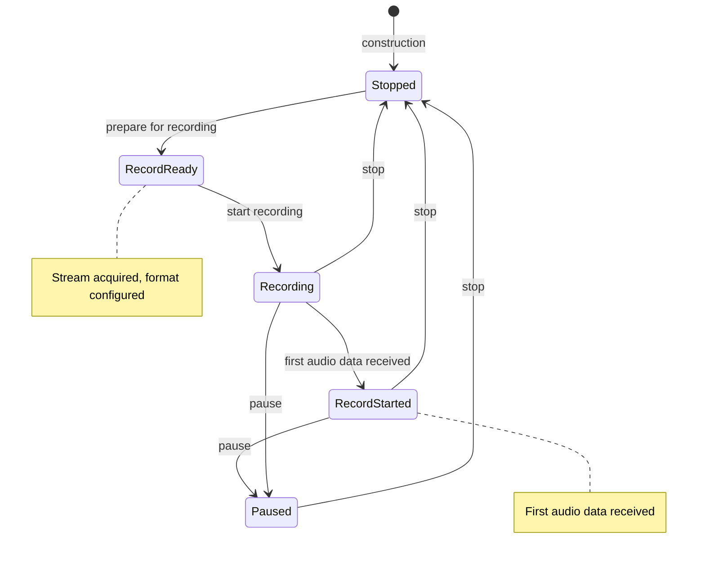
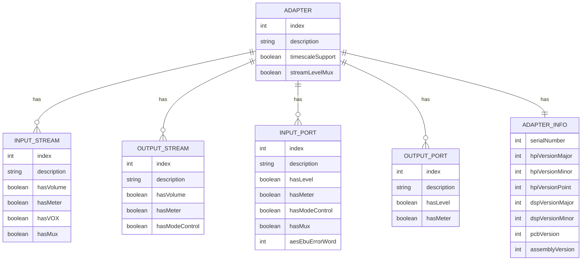

# Design Document: Audio Device Abstraction Library (HPI)

## Overview

**Purpose:** This library delivers a technology-agnostic abstraction layer over professional audio hardware for the Rivendell broadcast automation system. It encapsulates hardware probing, audio stream management (playback and recording), mixer control, metering, and device selection into a cohesive API consumed by higher-level system components.

**Users:** The Audio Engine daemon (CAE) uses this library for all audio I/O operations. The IPC daemon (RPC) uses it for sound card status and GPIO access. Administrative and operational applications reference it indirectly through configuration interfaces.

**Impact:** This library is the sole interface between the broadcast system and professional audio hardware. All audio playback, recording, mixing, and metering operations flow through this abstraction.

### Goals

- Provide a complete hardware abstraction for professional audio adapters in broadcast environments
- Support multi-adapter configurations with independent stream, port, and mixer management
- Enable real-time audio playback with position tracking, speed control, and automatic buffer management
- Enable audio recording with VOX support, length limiting, and position tracking
- Provide real-time metering and digital audio error monitoring
- Abstract hardware capabilities so consumers can query and adapt to available features

### Non-Goals

- Direct support for consumer-grade audio interfaces (ALSA, JACK, PulseAudio) -- those are handled by separate audio engine backends
- Audio format conversion or transcoding -- the library validates format support but does not convert
- Persistent configuration storage -- the library reads configuration from the core library
- Network audio transport or streaming protocols
- Tuner/RF functionality (present as stubs in legacy code, not implemented)

## Architecture

### Architecture Pattern & Boundary Map



**Architecture Integration:**
- Selected pattern: Hardware Abstraction Layer (HAL) with event-driven notifications
- Domain boundaries: Sound Card Manager owns all hardware discovery and mixer control; Playback/Recording Streams own their respective I/O lifecycles; Sound Selector handles UI concerns
- The library depends on Core Library (LIB) for configuration, wave file handling, and logging
- Event-driven architecture: state changes and meter readings are published as events to consumers

### Technology Stack

| Layer | Choice | Role | Notes |
|-------|--------|------|-------|
| Hardware Interface | Audio Hardware API | Direct hardware communication | Currently AudioScience HPI; to be abstracted |
| Audio I/O | Playback Stream, Recording Stream | Buffered audio streaming | Timer-driven buffer management |
| Mixer Control | Sound Card Manager | Volume, level, mode, routing | Per-adapter capability discovery |
| Monitoring | Sound Card Manager (timer) | Metering, error detection | Periodic polling at configured interval |
| UI | Sound Selector Widget | Device selection list | Legacy widget; needs modernization |
| Dependencies | Core Library (LIB) | Config, wave files, logging | Priority-0 dependency |

## System Flows

### Playback Flow



### Recording Flow



### Playback Stream State Machine



### Recording Stream State Machine



## Requirements Traceability

| Requirement | Summary | Components | Interfaces | Flows |
|-------------|---------|------------|------------|-------|
| 1 | Audio Device Discovery and Information | Sound Card Manager, Adapter Information | Discovery API, capability queries | Initialization (probe) |
| 2 | Audio Playback Streaming | Playback Stream | Playback lifecycle API, state events | Playback Flow |
| 3 | Audio Recording Streaming | Recording Stream | Recording lifecycle API, state events | Recording Flow |
| 4 | Mixer and Volume Control | Sound Card Manager | Mixer control API (volume, level, mode, mux, fade) | -- |
| 5 | Audio Metering and Monitoring | Sound Card Manager | Meter read API, error monitoring events | Periodic timer |
| 6 | Audio Device Selection | Sound Selector Widget | Selection events | -- |
| 7 | Audio Format Support Validation | Playback Stream, Recording Stream | Format query API | -- |
| 8 | Error Handling and Logging | All components | Error logging, bounds validation | -- |

## Components and Interfaces

| Component | Domain/Layer | Intent | Req Coverage | Key Dependencies | Contracts |
|-----------|-------------|--------|--------------|-----------------|-----------|
| Adapter Information | Hardware / Value Object | Store hardware adapter metadata | 1 | None | Data |
| Sound Card Manager | Hardware / Service | Manage adapter discovery, mixer, metering | 1, 4, 5, 8 | Core Library Config, Logging | Service, Event |
| Playback Stream | Audio I/O / Service | Manage audio playback lifecycle | 2, 7, 8 | Sound Card Manager, Core Library Wave File | Service, Event, State |
| Recording Stream | Audio I/O / Service | Manage audio recording lifecycle | 3, 7, 8 | Sound Card Manager, Core Library Wave File | Service, Event, State |
| Sound Selector Widget | UI / Widget | Display and select audio device ports | 6 | Sound Card Manager | Event |

### Hardware Layer

#### Adapter Information

| Field | Detail |
|-------|--------|
| Intent | Value object holding hardware adapter metadata (serial number, firmware versions, PCB version) |
| Requirements | 1 |

**Responsibilities & Constraints**
- Pure data container with getters, setters, and reset
- No hardware interaction; populated by Sound Card Manager during probe
- Immutable after probe completes (in practice)

**Dependencies**
- Inbound: Sound Card Manager populates this during discovery
- Outbound: None

**Contracts:** State [ ]

##### State Management
- Fields: serialNumber, hpiVersion (major/minor/point), dspVersion (major/minor), pcbVersion, assemblyVersion
- All fields are unsigned integers
- `clear()` resets all fields to zero

---

#### Sound Card Manager

| Field | Detail |
|-------|--------|
| Intent | Central service for hardware discovery, mixer control, metering, and error monitoring |
| Requirements | 1, 4, 5, 8 |

**Responsibilities & Constraints**
- On initialization, probes all installed adapters and discovers full capability matrix
- Manages mixer controls: volume, level, channel mode, multiplexer, fade, passthrough
- Provides meter readings for streams and ports (left/right channels)
- Monitors digital audio error status via periodic timer
- All methods validate card/stream/port bounds before hardware access
- Capability checks (have*) must be called or are implicitly enforced before control operations

**Dependencies**
- Inbound: Audio Engine Daemon, IPC Daemon, Sound Selector Widget
- Outbound: Core Library Configuration (P0), Core Library Logging (P0)
- External: Audio Hardware API (P0)

**Contracts:** Service [x] / Event [x]

##### Service Interface
```
interface SoundCardManagerService {
  getCardQuantity(): number
  getCardInputStreams(card: number): number
  getCardOutputStreams(card: number): number
  getCardInputPorts(card: number): number
  getCardOutputPorts(card: number): number
  getCardDescription(card: number): string
  getStreamDescription(card: number, stream: number, direction: Direction): string
  getPortDescription(card: number, port: number, direction: Direction): string
  getAdapterInfo(card: number): AdapterInformation
  haveTimescaling(card: number): boolean
  setClockSource(card: number, source: ClockSource): boolean

  // Volume and level controls
  setInputVolume(card: number, stream: number, level: number): void
  setOutputVolume(card: number, stream: number, port: number, level: number): void
  fadeOutputVolume(card: number, stream: number, port: number, level: number, durationMs: number): void
  setInputLevel(card: number, port: number, level: number): void
  setOutputLevel(card: number, port: number, level: number): void
  getInputVolume(card: number, stream: number, port: number): number
  getOutputVolume(card: number, stream: number, port: number): number

  // Channel mode controls
  setInputMode(card: number, port: number, mode: ChannelMode): void
  setOutputMode(card: number, stream: number, mode: ChannelMode): void

  // Multiplexer controls
  setInputPortMux(card: number, port: number, source: SourceNode): boolean
  getInputPortMux(card: number, port: number): SourceNode

  // Passthrough
  havePassthroughVolume(card: number, inPort: number, outPort: number): boolean
  setPassthroughVolume(card: number, inPort: number, outPort: number, level: number): boolean

  // Metering
  inputStreamMeter(card: number, stream: number): Result<[number, number], boolean>
  outputStreamMeter(card: number, stream: number): Result<[number, number], boolean>
  inputPortMeter(card: number, port: number): Result<[number, number], boolean>
  outputPortMeter(card: number, port: number): Result<[number, number], boolean>

  // Fade profile
  setFadeProfile(profile: FadeProfile): void
  getFadeProfile(): FadeProfile
}
```
- Preconditions: All card/stream/port indices must be within discovered bounds
- Postconditions: Hardware state matches requested configuration
- Invariants: Capability checks prevent operations on unsupported controls

##### Event Contract
- Published events:
  - `inputPortError(card, port)` -- digital audio error status changed
  - `leftInputStreamMeter(card, stream, level)` -- input stream left channel level
  - `rightInputStreamMeter(card, stream, level)` -- input stream right channel level
  - `leftOutputStreamMeter(card, stream, level)` -- output stream left channel level
  - `rightOutputStreamMeter(card, stream, level)` -- output stream right channel level
  - `leftInputPortMeter(card, port, level)` -- input port left channel level
  - `rightInputPortMeter(card, port, level)` -- input port right channel level
  - `leftOutputPortMeter(card, port, level)` -- output port left channel level
  - `rightOutputPortMeter(card, port, level)` -- output port right channel level
  - `inputMode(card, port, mode)` -- input channel mode changed
  - `outputMode(card, stream, mode)` -- output channel mode changed
- Subscribed events: None (timer-driven polling)
- Delivery: Periodic polling at configured meter interval

---

### Audio I/O Layer

#### Playback Stream

| Field | Detail |
|-------|--------|
| Intent | Manage the lifecycle of audio playback on a hardware output stream |
| Requirements | 2, 7, 8 |

**Responsibilities & Constraints**
- Extends the Core Library Wave File for audio file access
- Acquires and releases hardware output streams
- Timer-driven buffer filling with periodic position reporting
- Supports speed/pitch control on adapters with timescaling
- Supports play length limiting (auto-pause after duration)
- State transitions: Stopped -> Playing -> Paused -> Stopped

**Dependencies**
- Inbound: Audio Engine Daemon (P0)
- Outbound: Sound Card Manager -- hardware access (P0), Core Library Wave File -- file I/O (P0)
- External: Audio Hardware API (P0)

**Contracts:** Service [x] / Event [x] / State [x]

##### Service Interface
```
interface PlaybackStreamService {
  openWave(): PlaybackError
  openWave(filename: string): PlaybackError
  closeWave(): void
  play(): boolean
  pause(): void
  stop(): void
  currentPosition(): number
  setPosition(samples: number): boolean
  setPlayLength(lengthMs: number): void
  getSpeed(): number
  setSpeed(speed: number, pitch: boolean, rate: boolean): boolean
  getState(): PlaybackState
  formatSupported(format?: AudioFormat): boolean
  errorString(error: PlaybackError): string
  getCard(): number
  getStream(): number
}
```
- Preconditions: Wave file must be opened before play; stream must not be already open
- Postconditions: On stop, hardware stream is released and position is zero
- Invariants: State transitions follow the defined state machine

##### Event Contract
- Published events:
  - `played()` -- playback started
  - `paused()` -- playback paused
  - `stopped()` -- playback stopped
  - `isStopped(state)` -- stopped state changed
  - `position(samples)` -- current playback position
  - `stateChanged(card, stream, state)` -- stream state changed
- Subscribed events: None (timer-driven)

##### State Management
- States: Stopped, Playing, Paused
- Transitions: see Playback Stream State Machine diagram
- Timer drives buffer filling and position reporting
- Buffer drain triggers automatic stop

---

#### Recording Stream

| Field | Detail |
|-------|--------|
| Intent | Manage the lifecycle of audio recording from a hardware input stream |
| Requirements | 3, 7, 8 |

**Responsibilities & Constraints**
- Extends the Core Library Wave File for audio file creation
- Acquires and releases hardware input streams
- Timer-driven buffer draining with periodic position reporting
- Detects first audio data arrival (record start vs. record ready)
- Supports VOX (voice-operated switching) threshold configuration
- Supports record length limiting (auto-pause after duration)
- State transitions: Stopped -> RecordReady -> Recording -> RecordStarted -> Paused -> Stopped

**Dependencies**
- Inbound: Audio Engine Daemon (P0)
- Outbound: Sound Card Manager -- hardware access (P0), Core Library Wave File -- file I/O (P0)
- External: Audio Hardware API (P0)

**Contracts:** Service [x] / Event [x] / State [x]

##### Service Interface
```
interface RecordingStreamService {
  createWave(): RecordingError
  createWave(filename: string): RecordingError
  closeWave(): void
  recordReady(): boolean
  record(): void
  pause(): void
  stop(): void
  setInputVOX(gain: number): void
  haveInputVOX(): boolean
  setRecordLength(lengthMs: number): void
  getState(): RecordState
  getPosition(): number
  samplesRecorded(): number
  formatSupported(format?: AudioFormat): boolean
  errorString(error: RecordingError): string
  getCard(): number
  getStream(): number
}
```
- Preconditions: Wave file must be created before recordReady; stream must not be already open
- Postconditions: On stop, hardware stream is released, file is closed, position is zero
- Invariants: State transitions follow the defined state machine

##### Event Contract
- Published events:
  - `ready()` -- stream prepared for recording
  - `recording()` -- recording started
  - `recordStart()` -- first audio data received
  - `paused()` -- recording paused
  - `stopped()` -- recording stopped
  - `isStopped(state)` -- stopped state changed
  - `position(samples)` -- current recording position
  - `stateChanged(card, stream, state)` -- stream state changed
- Subscribed events: None (timer-driven)

##### State Management
- States: Stopped, RecordReady, Recording, RecordStarted, Paused
- Transitions: see Recording Stream State Machine diagram
- Timer drives buffer draining and position reporting
- First data detection triggers RecordStarted state

---

### UI Layer

#### Sound Selector Widget

| Field | Detail |
|-------|--------|
| Intent | Display available audio device ports and allow user selection |
| Requirements | 6 |

**Responsibilities & Constraints**
- Displays a flat list of "Card Description - Port Description" entries
- Supports separate instances for playback devices and recording devices
- Decodes list selection into card and port indices
- Legacy widget based on Qt3 list box; needs modernization for target platform

**Dependencies**
- Inbound: GUI applications (P1)
- Outbound: Sound Card Manager -- adapter/port descriptions (P0)

**Contracts:** Event [x]

##### Event Contract
- Published events:
  - `changed(card, port)` -- user selected a different card/port combination
  - `cardChanged(card)` -- card selection changed
  - `portChanged(port)` -- port selection changed
- Subscribed events: List item selection from UI framework

## Data Models

### Domain Model

This library has no persistent data model. All state is held in memory, organized as arrays indexed by card, stream, and port numbers.

**In-Memory State:**
- Adapter information: array of AdapterInformation objects, indexed by card number
- Capability matrices: boolean arrays for volume, level, mode, VOX, meter, and mux support, indexed by [card][stream/port]
- Mixer control handles: hardware-specific handles for each mixer control point
- Meter values: cached peak levels for streams and ports
- Error status: cached digital audio error words per input port

**Constants:**
- MAX_ADAPTERS: maximum number of supported audio adapters
- MAX_STREAMS: maximum number of streams per adapter
- MAX_NODES: maximum number of ports/nodes per adapter

### Logical Data Model



## Error Handling

### Error Categories

**Hardware Errors (Warning level):**
- Any audio hardware API call returning a non-zero error code
- Logged to system log with error description and source location
- Error code propagated to caller

**Stream Errors (Application level):**
- NoFile: Attempted operation without a loaded/created file
- NoStream: No hardware stream available for acquisition
- AlreadyOpen: Attempted to open an already-open stream

**Bounds Validation Errors (Silent rejection):**
- Card index exceeds detected adapter count
- Stream index exceeds adapter stream count
- Port index exceeds adapter port count
- Operations silently return false or return early without hardware access

**Capability Errors (Silent rejection):**
- Volume/level/mode/mux control requested on unsupported hardware
- Operations silently return without error

### Error Strategy

- Hardware API errors: log and propagate -- callers decide recovery strategy
- Stream lifecycle errors: return typed error enum -- callers can display user-facing messages via errorString()
- Bounds/capability errors: silent rejection -- safe by design, no crash risk
- Digital audio errors: event-based notification -- consumers subscribe and handle

## Testing Strategy

### Unit Tests
- Adapter Information: getter/setter round-trip, clear() resets all fields
- Bounds validation: all methods reject out-of-range card/stream/port indices
- Capability guards: control methods are no-ops when capability is absent
- Mux source validation: only line-in and digital audio input accepted
- Format support dispatch: correct format query for PCM bit depths and compressed layers
- State machine transitions: playback and recording state machines follow defined transitions

### Integration Tests
- Sound Card Manager initialization with mock hardware API: probe discovers adapters and capabilities
- Playback stream lifecycle: open -> play -> tick -> position update -> stop -> stream released
- Recording stream lifecycle: create -> ready -> record -> tick -> position update -> stop -> file closed
- Meter polling: timer triggers meter reads, events published with correct values
- Digital audio error monitoring: error word change triggers inputPortError event

### E2E Tests
- Full playback flow: initialize sound card, open file, play, verify position events, stop, verify cleanup
- Full recording flow: initialize sound card, create file, prepare, record, verify data capture, stop, verify file
- Mixer control flow: set volumes, levels, modes on multi-stream adapter, verify hardware state
- Device selector: populate list from probed adapters, select item, verify card/port events
