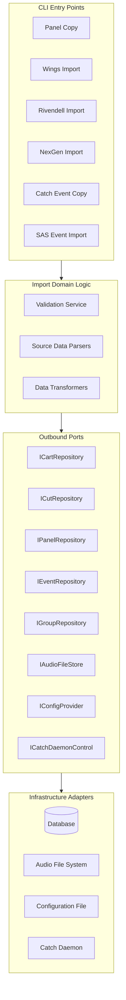
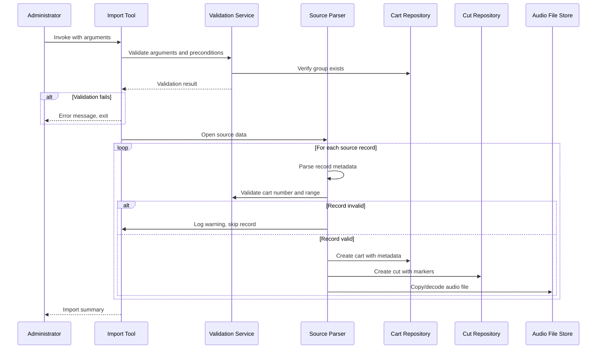
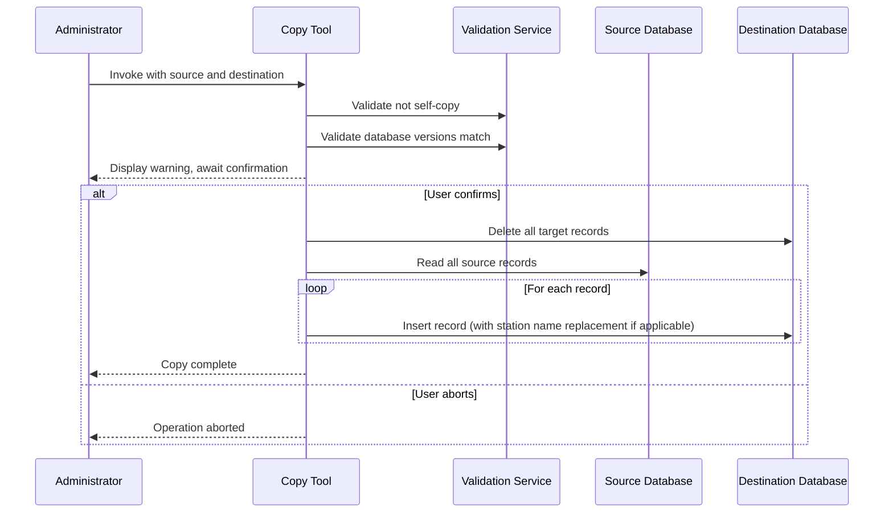
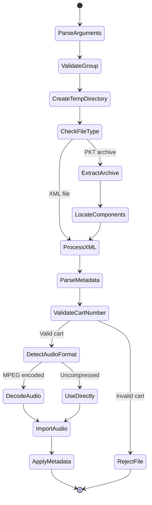
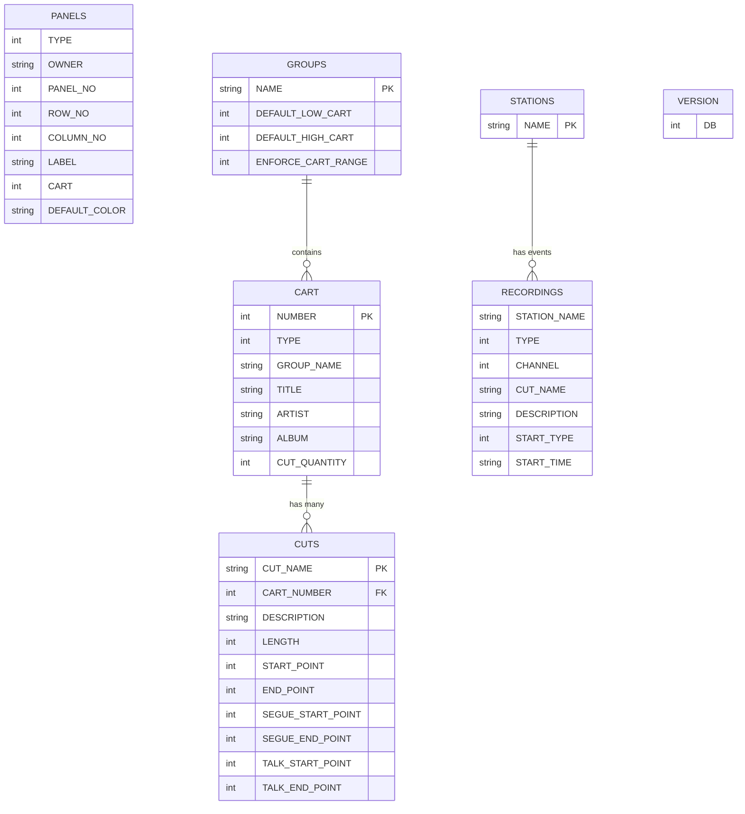

# Design Document

## Overview

**Purpose:** The Importers module provides a set of standalone command-line tools for bulk data migration into and between Rivendell broadcast automation instances. Each tool handles a specific migration scenario: copying panel configurations between databases, transferring audio content from external broadcast systems (Wings, NexGen, SAS), or replicating catch events across stations.

**Users:** System administrators and broadcast engineers performing station setup, system migration, or content library consolidation.

**Impact:** These tools write directly to the Rivendell database (carts, cuts, panels, scheduling events) and audio file store. They depend entirely on the core library for database access, configuration, audio file handling, and group management.

### Goals

- Enable bulk migration of audio content and metadata from Wings, NexGen, SAS, and remote Rivendell systems
- Enable replication of panel button assignments and catch scheduling events between database instances
- Validate all preconditions (database version, group existence, cart ranges) before any destructive operations
- Provide clear error reporting and graceful handling of missing or corrupt source data
- Support configurable import parameters (cart offsets, normalization levels, reject directories, group assignment)

### Non-Goals

- Graphical user interface (all tools are CLI-only)
- Real-time or incremental synchronization (batch import only)
- Support for legacy platform-specific audio APIs (tools delegate to the core library audio abstraction)
- Import from broadcast systems other than Wings, NexGen, and SAS (extensibility is future scope)
- Interactive editing of imported data during the import process

## Architecture

### Architecture Pattern & Boundary Map



**Architecture Integration:**
- Selected pattern: Hexagonal (Ports & Adapters) per project steering
- Each CLI tool is a thin entry point that parses arguments, wires dependencies, and delegates to domain services
- Source data parsing (Wings fixed-width, NexGen XML/PKT, SAS fixed-width) is domain logic with no framework dependency
- All database and file I/O goes through outbound port interfaces
- Steering compliance: domain layer is pure C++ with no framework dependencies

### Technology Stack

| Layer | Choice / Version | Role in Feature | Notes |
|-------|------------------|-----------------|-------|
| CLI | C++20 | Argument parsing, tool entry points | One executable per import tool |
| Domain | C++20 (pure, no Qt) | Parsing, validation, transformation | Source format parsers, business rules |
| Adapters | Qt 6 SQL, Qt 6 Core | Database access, file I/O, configuration | Implements outbound ports |
| External tools | (none) | Audio decoding handled by adapters | Legacy used external MPEG decoder; new version uses Qt Multimedia or library adapter |
| Infrastructure | QMake | Build system | Each tool is a separate SUBDIRS target |

## System Flows

### Audio Import Flow (Generic)



### Database Copy Flow



### NexGen PKT Archive Processing



## Requirements Traceability

| Requirement | Summary | Components | Interfaces | Flows |
|-------------|---------|------------|------------|-------|
| 1 | Database copy operations | PanelCopyService, CatchEventCopyService | IPanelRepository, IEventRepository, IConfigProvider | Database Copy Flow |
| 2 | Audio and metadata import | WingsImportService, RivendellImportService, NexGenImportService | ICartRepository, ICutRepository, IAudioFileStore, IGroupRepository | Audio Import Flow, NexGen PKT Flow |
| 3 | Automation event import | SasEventImportService | IEventRepository, ICatchDaemonControl, IConfigProvider | Audio Import Flow (variant) |
| 4 | Validation and error handling | ValidationService (cross-cutting) | IGroupRepository, IConfigProvider | All flows (precondition checks) |

## Components and Interfaces

| Component | Domain/Layer | Intent | Req Coverage | Key Dependencies | Contracts |
|-----------|--------------|--------|--------------|------------------|-----------|
| PanelCopyService | Domain | Copy panel button assignments between databases | 1 | IPanelRepository, IConfigProvider (P0) | Service, Batch |
| CatchEventCopyService | Domain | Copy catch scheduling events between stations | 1 | IEventRepository, IConfigProvider (P0) | Service, Batch |
| WingsImportService | Domain | Import audio from Wings broadcast system | 2, 4 | ICartRepository, ICutRepository, IAudioFileStore, IGroupRepository (P0) | Service, Batch |
| RivendellImportService | Domain | Import carts/cuts from remote Rivendell instance | 2, 4 | ICartRepository, ICutRepository, IAudioFileStore, IGroupRepository (P0) | Service, Batch |
| NexGenImportService | Domain | Import from NexGen XML/PKT archives | 2, 4 | ICartRepository, ICutRepository, IAudioFileStore, IGroupRepository (P0) | Service, Batch |
| SasEventImportService | Domain | Import SAS switch/macro event lists | 3, 4 | IEventRepository, ICatchDaemonControl, IConfigProvider (P0) | Service, Batch |
| ValidationService | Domain | Cross-cutting precondition validation | 4 | IGroupRepository, IConfigProvider (P0) | Service |
| WingsRecordParser | Domain | Parse Wings fixed-width database format | 2 | (none) | Service |
| NexGenXmlParser | Domain | Parse NexGen XMLDAT metadata files | 2 | (none) | Service |
| NexGenArchiveExtractor | Domain | Extract NexGen PKT binary archives | 2 | (none) | Service |
| SasEventParser | Domain | Parse SAS fixed-width event format | 3 | (none) | Service |

### Domain Layer

#### ValidationService

| Field | Detail |
|-------|--------|
| Intent | Validate import preconditions: database version, group existence, cart ranges, normalization levels |
| Requirements | 4 |

**Responsibilities & Constraints**
- Validate database schema version matches expected version
- Validate group existence in local database
- Validate cart number ranges (1-999999, start <= end)
- Validate normalization levels (must be non-positive)
- Pure domain logic, no framework dependencies

**Dependencies**
- Outbound: IGroupRepository -- group existence checks (P0)
- Outbound: IConfigProvider -- database version, configuration values (P0)

**Contracts**: Service [x]

##### Service Interface
```
interface ValidationService {
    validateDatabaseVersion(connection): Result<void, VersionMismatchError>
    validateGroupExists(groupName): Result<Group, GroupNotFoundError>
    validateCartRange(start, end): Result<void, InvalidCartRangeError>
    validateCartNumber(cartNumber, group): Result<void, CartOutOfRangeError>
    validateNormalizationLevel(level): Result<void, InvalidLevelError>
    validateNotSelfCopy(sourceHost, destHost): Result<void, SelfCopyError>
}
```

#### WingsImportService

| Field | Detail |
|-------|--------|
| Intent | Import audio content and metadata from Wings broadcast system fixed-width database and ATX audio files |
| Requirements | 2, 4 |

**Responsibilities & Constraints**
- Parse Wings fixed-width database records (filename, title, artist, album, group, length)
- Validate ATX audio file header integrity
- Assign carts to appropriate groups with fallback to default
- Create cart and cut records with imported metadata
- Copy audio data to Rivendell audio store

**Dependencies**
- Outbound: ICartRepository -- cart creation (P0)
- Outbound: ICutRepository -- cut creation (P0)
- Outbound: IAudioFileStore -- audio file copy (P0)
- Outbound: IGroupRepository -- group validation and cart number allocation (P0)

**Contracts**: Service [x] / Batch [x]

##### Batch / Job Contract
- Trigger: CLI invocation with group, database file, and audio directory
- Input / validation: Wings database file must be readable, audio directory must exist, default group must exist
- Output / destination: New carts, cuts, and audio files in Rivendell store
- Idempotency & recovery: Not idempotent; creates new carts on each run. Corrupt files are skipped with warning.

#### RivendellImportService

| Field | Detail |
|-------|--------|
| Intent | Transfer carts, cuts, and audio files from a remote Rivendell database to the local instance |
| Requirements | 2, 4 |

**Responsibilities & Constraints**
- Connect to remote database with provided credentials
- Transfer carts within a specified number range
- Purge existing local carts before inserting transferred data
- Handle NULL/invalid datetime fields gracefully
- Copy audio files from remote audio directory
- Fall back to default group when original group does not exist locally

**Dependencies**
- Outbound: ICartRepository -- cart CRUD (P0)
- Outbound: ICutRepository -- cut CRUD (P0)
- Outbound: IAudioFileStore -- audio file copy from remote path (P0)
- Outbound: IGroupRepository -- group validation (P0)
- Outbound: IConfigProvider -- local database credentials (P0)

**Contracts**: Service [x] / Batch [x]

##### Batch / Job Contract
- Trigger: CLI invocation with remote credentials, group, and cart range
- Input / validation: Remote DB accessible, default group exists locally, cart range valid (1-999999, start <= end)
- Output / destination: Replaced carts, cuts, and audio files in local Rivendell store
- Idempotency & recovery: Idempotent for a given cart range (deletes then re-inserts). Missing audio files produce warnings but do not halt.

#### NexGenImportService

| Field | Detail |
|-------|--------|
| Intent | Import audio and metadata from Prophet NexGen broadcast system via XML metadata and PKT binary archives |
| Requirements | 2, 4 |

**Responsibilities & Constraints**
- Process both standalone XML files and PKT binary archives
- Extract PKT archives: parse 104-byte headers (marker + path + 4-byte little-endian length), extract file data
- Parse NexGen XMLDAT format for metadata (title, artist, album, label, composer, content identifier, dates, markers)
- Apply cart number offset to derived cart numbers
- Detect audio encoding (MPEG vs uncompressed) and decode MPEG if needed
- Apply normalization during import
- Calculate segue markers from crossfade values, start markers from fade-up values
- Write rejected files to configurable reject directory

**Dependencies**
- Outbound: ICartRepository -- cart creation and metadata update (P0)
- Outbound: ICutRepository -- cut creation and marker update (P0)
- Outbound: IAudioFileStore -- audio import with normalization (P0)
- Outbound: IGroupRepository -- group validation and cart range enforcement (P0)
- Outbound: IAudioDecoder -- MPEG to uncompressed audio conversion (P1)

**Contracts**: Service [x] / Batch [x]

##### Batch / Job Contract
- Trigger: CLI invocation with group, audio directory, and input file(s)
- Input / validation: Group must exist, audio directory readable, cart numbers valid after offset
- Output / destination: New/updated carts, cuts, audio files; rejected XMLs to reject directory
- Idempotency & recovery: Optionally deletes existing cuts before import (--delete-cuts flag). Rejected files preserved for retry.

#### PanelCopyService

| Field | Detail |
|-------|--------|
| Intent | Copy all panel button assignments from one database instance to another |
| Requirements | 1, 4 |

**Responsibilities & Constraints**
- Validate source and destination are not the same host
- Validate database schema versions match
- Require user confirmation before destructive overwrite
- Delete all destination panel records, then copy all source records

**Dependencies**
- Outbound: IPanelRepository -- panel CRUD on both source and destination (P0)
- Outbound: IConfigProvider -- database credentials and version (P0)

**Contracts**: Service [x] / Batch [x]

##### Batch / Job Contract
- Trigger: CLI invocation with source and destination hosts
- Input / validation: Different hosts, matching database versions, user confirmation
- Output / destination: Destination PANELS table fully replaced
- Idempotency & recovery: Idempotent (full replacement). Abortable at confirmation prompt.

#### CatchEventCopyService

| Field | Detail |
|-------|--------|
| Intent | Copy all catch scheduling events from one station to another across database instances |
| Requirements | 1, 4 |

**Responsibilities & Constraints**
- Validate source and destination are not identical (same host AND same station)
- Allow same host with different station names (reuse single connection)
- Validate database schema versions match
- Validate both station names exist in the database
- Require user confirmation before destructive overwrite
- Replace station identifier in copied events

**Dependencies**
- Outbound: IEventRepository -- scheduling event CRUD (P0)
- Outbound: IConfigProvider -- database credentials and version (P0)

**Contracts**: Service [x] / Batch [x]

##### Batch / Job Contract
- Trigger: CLI invocation with source/destination hosts and station names
- Input / validation: Not identical host+station, matching DB versions, stations exist, user confirmation
- Output / destination: Destination station's events fully replaced
- Idempotency & recovery: Idempotent (full replacement). Abortable at confirmation prompt.

#### SasEventImportService

| Field | Detail |
|-------|--------|
| Intent | Import switch and macro automation events from SAS fixed-width event files into catch scheduling |
| Requirements | 3, 4 |

**Responsibilities & Constraints**
- Parse 79-character fixed-width SAS event lines
- Extract day-of-week flags, start time, description, active flag, output/input/GPO numbers
- Create switch events (when input > 0 and output > 0) or macro cart events (when GPO > 0)
- Calculate macro cart number from configured base cart + GPO number
- Support full delete mode (wipe all events)
- Reset catch daemon after import or delete

**Dependencies**
- Outbound: IEventRepository -- scheduling event CRUD (P0)
- Outbound: ICatchDaemonControl -- daemon reset (P0)
- Outbound: IConfigProvider -- SAS station, matrix, base cart configuration (P0)

**Contracts**: Service [x] / Batch [x]

##### Batch / Job Contract
- Trigger: CLI invocation in insert or delete mode
- Input / validation: SAS event file readable (insert mode), valid configuration
- Output / destination: Scheduling events in database; daemon reset
- Idempotency & recovery: Delete mode is idempotent (full wipe). Insert mode appends to database.

### Outbound Ports

#### IPanelRepository

```
interface IPanelRepository {
    findAll(connection): list of PanelAssignment
    deleteAll(connection): void
    insertAll(assignments: list of PanelAssignment, connection): void
}
```

#### IEventRepository

```
interface IEventRepository {
    findAllForStation(stationName): list of SchedulingEvent
    deleteAllForStation(stationName): void
    deleteAll(): void
    insert(event: SchedulingEvent): void
}
```

#### IAudioFileStore

```
interface IAudioFileStore {
    copyAudioFile(sourcePath, destinationCutId): Result<void, AudioNotFoundError>
    importWithNormalization(sourcePath, destinationCutId, normalizationLevel): Result<void, ImportError>
}
```

#### IAudioDecoder

```
interface IAudioDecoder {
    decode(sourcePath, destinationPath): Result<void, DecodeError>
    detectEncoding(filePath): AudioEncoding
}
```

#### ICatchDaemonControl

```
interface ICatchDaemonControl {
    reset(): void
}
```

## Data Models

### Domain Model

This artifact creates no new database tables. All operations target tables defined in the core library (LIB). The domain model consists of:

- **PanelAssignment** - Value object: type, owner, panel number, row, column, label, cart number, color
- **SchedulingEvent** - Entity: station, type (switch/macro), channel, day-of-week flags, start time, description, active status, input/output numbers, cart number
- **Cart** - Entity (from LIB domain): number, type, group, title, artist, album, and full metadata set
- **Cut** - Entity (from LIB domain): cut name, markers, date range, daypart, audio properties
- **WingsRecord** - Value object: filename, extension, title, artist, album, group code, length
- **NexGenMetadata** - Value object: all parsed XMLDAT fields including title, artist, album, label, composer, content identifier, dates, crossfade values

### Logical Data Model

The tools operate on these existing tables (defined in LIB):



### Physical Data Model

The physical schema is defined and managed by the core library (LIB) and database manager utility (UTL). Import tools perform INSERT, UPDATE, DELETE, and SELECT operations against the existing schema. No schema migration is needed for this artifact.

## Error Handling

### Error Categories

**User Errors**
- Invalid or missing command-line arguments -- exit with usage guidance
- Self-copy attempt (same source and destination) -- exit with descriptive error
- Positive normalization level -- exit with "positive normalization level is invalid"

**System Errors**
- Database connection failure -- exit with error identifying the failing host
- Audio file not found during transfer -- log warning, continue processing (non-fatal)
- MPEG audio decode failure -- log warning, skip file (non-fatal)
- Audio file header corruption -- log warning, skip file (non-fatal)

**Business Logic Errors**
- Database version mismatch -- exit with "database version mismatch"
- Default group does not exist -- exit with "default group does not exist"
- Cart range invalid (start > end, out of bounds) -- exit with "invalid cart value"
- Cart number out of group range -- log error, write to reject directory, skip
- No available carts in group -- log warning, skip record

### Error Strategy

All fatal errors terminate the process immediately with a non-zero exit code and descriptive message to standard error. Non-fatal errors (missing audio, corrupt files, full groups) are logged as warnings and the tool continues processing remaining records. This ensures that a single bad record does not prevent the rest of a large import batch from completing.

## Testing Strategy

### Unit Tests
- WingsRecordParser: parse valid fixed-width records, handle truncated lines, trim trailing spaces
- NexGenXmlParser: parse complete XMLDAT file, handle missing tags, extract all metadata fields
- NexGenArchiveExtractor: parse PKT headers, extract files, handle malformed archives
- SasEventParser: parse 79-char event lines, extract day flags, classify switch vs macro events
- ValidationService: database version mismatch detection, cart range boundary checks, self-copy rejection, normalization level validation

### Integration Tests
- WingsImportService with test database: import records, verify cart/cut creation, verify group fallback
- RivendellImportService: transfer cart range, verify metadata fidelity, verify audio file copy, verify missing audio warning
- NexGenImportService: process XML file, process PKT archive, verify reject directory for invalid carts
- PanelCopyService: copy panels between two test databases, verify full replacement
- CatchEventCopyService: copy events with station name substitution
- SasEventImportService: insert events from file, verify switch/macro type classification, verify delete mode

### E2E Tests
- Full Wings import pipeline: database file + audio directory to Rivendell store
- Full NexGen PKT archive import with MPEG decoding and normalization
- Full Rivendell-to-Rivendell transfer with mixed valid/missing audio
- Panel copy with confirmation prompt simulation
- SAS import followed by delete, verify clean state
