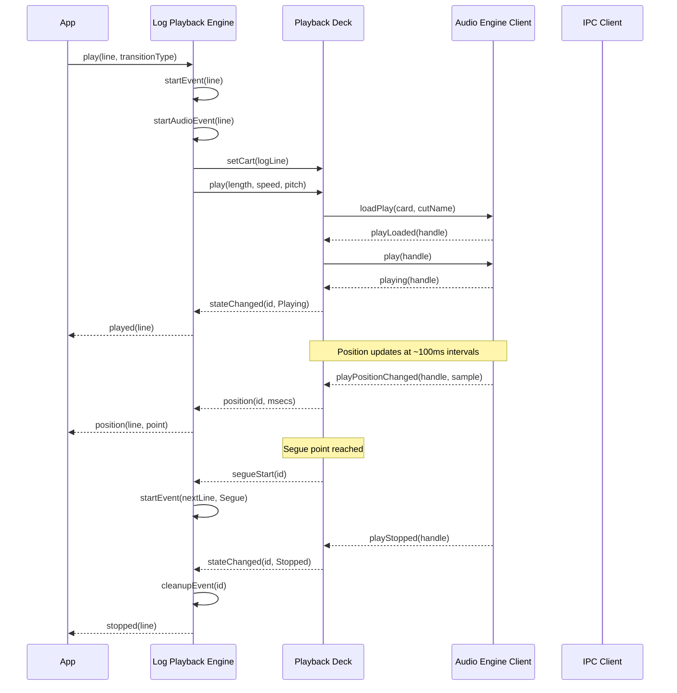
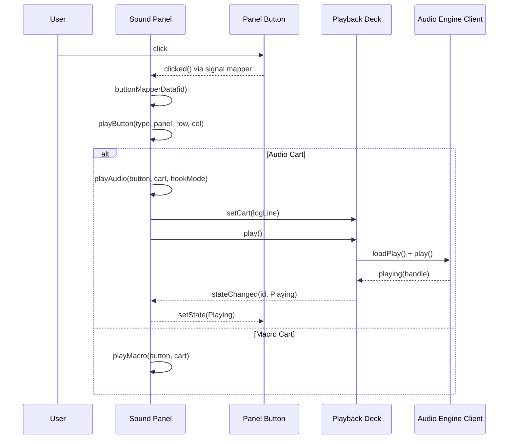
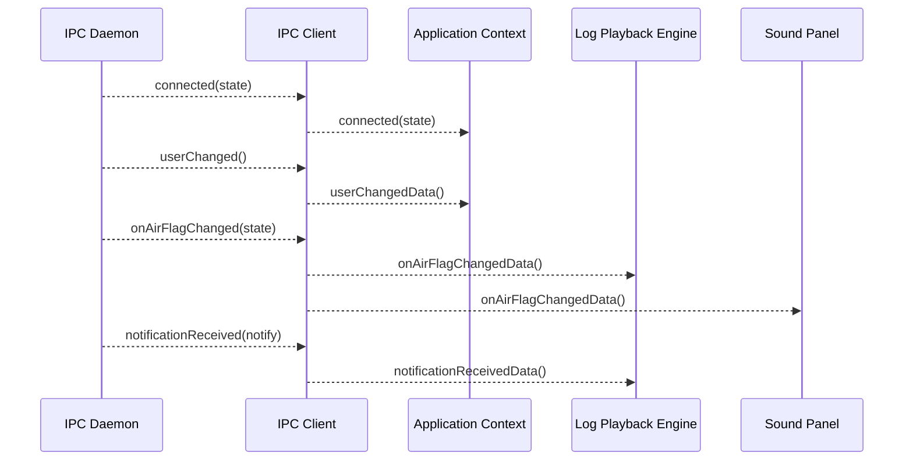
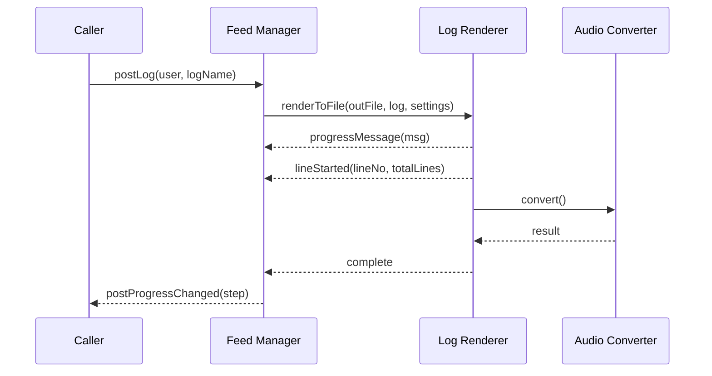
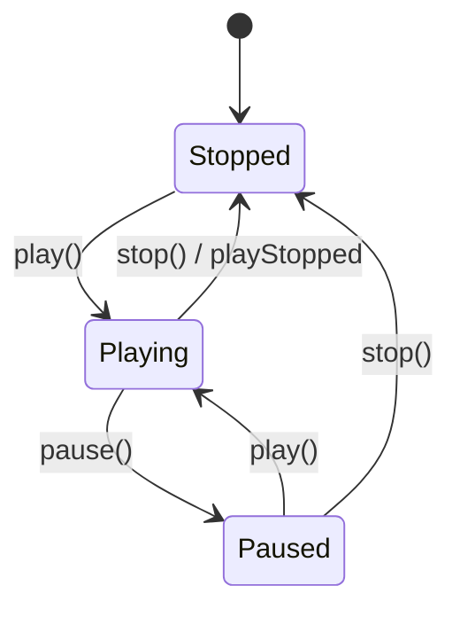
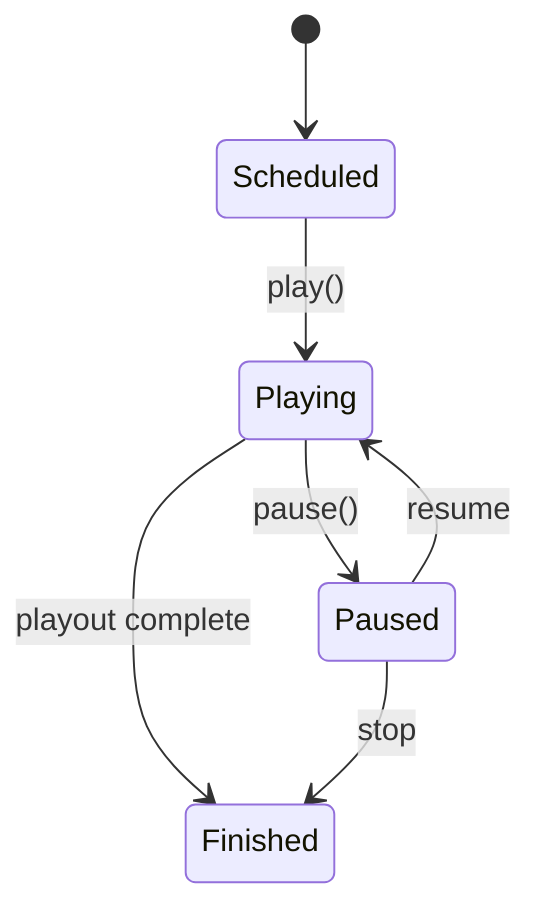
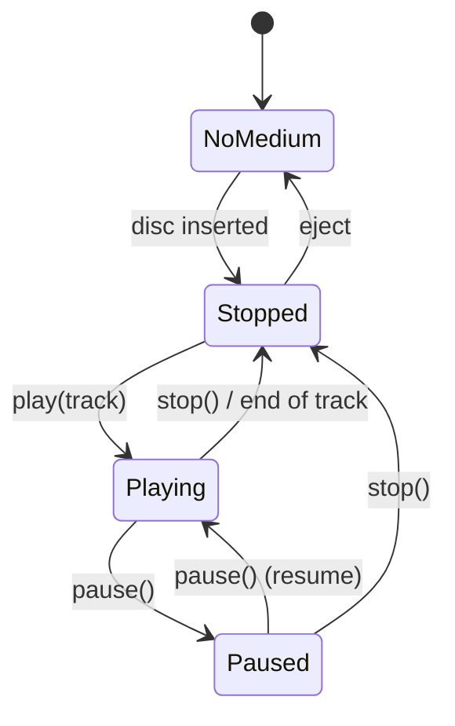
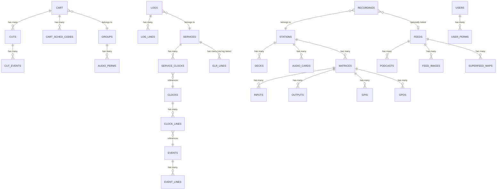

# Design Document: Core Library (LIB)

## Overview

**Purpose**: The Core Library provides the foundational domain entities, business logic, service clients, audio processing, UI components, and utilities shared by all applications and daemons in the radio automation system. It is the single dependency for every other artifact in the platform.

**Users**: Radio operators (playback, sound panels), content producers (audio editing, import/export), radio programmers (log management, scheduling), content managers (podcasting), system administrators (configuration, user management), and all application/daemon modules (service clients, utilities).

**Impact**: Every component in the system depends on this library. Changes here propagate to all 27 dependent artifacts.

### Goals
- Provide technology-agnostic domain entities for all radio automation concepts (carts, cuts, logs, services, feeds, stations, users)
- Encapsulate business rules for content scheduling, cut rotation, log generation, and permission enforcement
- Provide service client abstractions for audio engine, IPC daemon, and catch daemon communication
- Provide reusable UI dialog and widget components for consistent user interfaces
- Provide audio file I/O, format conversion, and rendering services
- Provide hardware abstraction for audio devices, GPIO, serial communication, and routing matrices

### Non-Goals
- Database schema creation/migration (resides in the database manager utility)
- Audio engine daemon implementation (resides in the audio engine daemon artifact)
- IPC daemon implementation (resides in the IPC daemon artifact)
- Application-specific business logic (resides in individual application artifacts)
- Platform-specific audio driver implementations (to be replaced with portable abstractions)

## Architecture

### Architecture Pattern & Boundary Map

```mermaid
graph TD
    subgraph "UI Layer"
        UI_BASE[Base Dialog / Widget]
        UI_DIALOGS[Shared Dialogs]
        UI_WIDGETS[Shared Widgets]
        UI_METERS[Audio Meters]
    end

    subgraph "Service Layer"
        SVC_PLAYBACK[Playback Engine]
        SVC_AUDIO[Audio File Processing]
        SVC_MACRO[Macro Execution]
        SVC_SCHEDULING[Scheduling Engine]
        SVC_PODCAST[Podcast Publishing]
        SVC_REPORT[Report Generation]
        SVC_RENDER[Log Renderer]
    end

    subgraph "Client Layer"
        CLT_CAE[Audio Engine Client]
        CLT_RIPC[IPC Client]
        CLT_CATCH[Catch Daemon Client]
        CLT_TRANSFER[File Transfer]
        CLT_LIVEWIRE[Networked Audio Client]
    end

    subgraph "Domain Layer"
        DOM_CART[Cart / Cut]
        DOM_LOG[Log / LogLine / LogEvent]
        DOM_SVC[Service / Clock / Event]
        DOM_FEED[Feed / Podcast]
        DOM_STATION[Station / Config / System]
        DOM_USER[User / Permissions]
        DOM_MATRIX[Matrix / GPIO]
        DOM_RECORDING[Recording / Dropbox]
    end

    subgraph "Infrastructure Layer"
        INF_DB[Database Access]
        INF_WAVE[Audio File I/O]
        INF_NET[Network / Socket]
        INF_HW[Hardware Abstraction]
        INF_UTIL[Utilities]
    end

    UI_DIALOGS --> DOM_CART
    UI_DIALOGS --> DOM_LOG
    UI_WIDGETS --> SVC_PLAYBACK
    UI_WIDGETS --> CLT_CAE

    SVC_PLAYBACK --> DOM_LOG
    SVC_PLAYBACK --> CLT_CAE
    SVC_PLAYBACK --> SVC_MACRO
    SVC_SCHEDULING --> DOM_SVC
    SVC_SCHEDULING --> DOM_CART
    SVC_AUDIO --> INF_WAVE
    SVC_PODCAST --> CLT_TRANSFER
    SVC_PODCAST --> SVC_RENDER
    SVC_RENDER --> SVC_AUDIO
    SVC_REPORT --> INF_DB

    CLT_CAE --> INF_NET
    CLT_RIPC --> INF_NET
    CLT_CATCH --> INF_NET
    CLT_TRANSFER --> INF_NET
    CLT_LIVEWIRE --> INF_NET

    DOM_CART --> INF_DB
    DOM_LOG --> INF_DB
    DOM_SVC --> INF_DB
    DOM_FEED --> INF_DB
    DOM_STATION --> INF_DB
    DOM_USER --> INF_DB
    DOM_MATRIX --> INF_DB
    DOM_RECORDING --> INF_DB
```



**Architecture Integration**:
- Selected pattern: Layered architecture with Active Record domain entities and event-driven service communication
- Domain/feature boundaries: Domain entities own their database tables; services orchestrate cross-entity operations; clients abstract daemon communication
- Event-driven communication: Services publish events that UI and other services subscribe to for loose coupling
- All UI components inherit from common base classes for consistent styling

### Technology Stack

| Layer | Choice / Version | Role in Feature | Notes |
|-------|------------------|-----------------|-------|
| Domain | Active Record entities | Data access and business rules | Each entity maps to one or more database tables |
| Services | Event-driven services | Business logic orchestration | Publish/subscribe events for state changes |
| Clients | TCP socket clients | Daemon communication | Audio engine, IPC, catch daemon |
| UI | Shared dialogs and widgets | Consistent UI components | Base classes enforce font and style settings |
| Audio I/O | Multi-format audio library | Read/write/convert audio files | Supports PCM, MPEG, Ogg, FLAC, AIFF, M4A |
| Database | Relational database | Persistent storage | 62+ tables accessed by Active Record entities |
| Network | TCP/UDP sockets, HTTP | Inter-process and file transfer | Multicast UDP for meter data |

## System Flows

### Audio Playback Pipeline



### Sound Panel Button Press



### IPC / Notification Flow



### Log Rendering Flow



### State Machines

#### Playback Deck States



#### Log Line Status



#### CD Player States



## Requirements Traceability

| Requirement | Summary | Components | Interfaces | Flows |
|-------------|---------|------------|------------|-------|
| 1 | Cart and Cut Management | Cart, Cut, Group, AddCartDialog | Cart Service, Cut Service | -- |
| 2 | Cut Rotation and Validity | Cart, Cut | Cart Service (selectCut) | -- |
| 3 | Log Management | Log, LogEvent, LogLine, LogLock | Log Service | -- |
| 4 | Audio Playback Engine | PlaybackDeck, AudioEngineClient | Audio Engine Service, Event contracts | Audio Playback Pipeline |
| 5 | Log Playback | LogPlayback, PlaybackDeck | Log Playback Service, Event contracts | Audio Playback Pipeline |
| 6 | Audio File Processing | WaveFile, AudioConverter, AudioImport, AudioExport | Audio File Service | Log Rendering Flow |
| 7 | Audio Marker Editing | AudioEditor, MarkerBar, MarkerEdit | Marker Service | -- |
| 8 | Sound Panel | SoundPanel, PanelButton, ButtonPanel | Panel Service, Event contracts | Sound Panel Button Press |
| 9 | Cart Slot | CartSlot, SlotBox, SlotOptions | Slot Service | -- |
| 10 | Scheduling and Log Generation | Service, Clock, EventLine, SchedulerRules | Scheduling Service | -- |
| 11 | Podcasting and RSS | Feed, Podcast, RssSchemas | Feed Service | Log Rendering Flow |
| 12 | System Configuration | ApplicationContext, Config, Station, System | Config Service | -- |
| 13 | User and Permission Management | User, GroupList | Auth Service | -- |
| 14 | IPC and Notifications | IPCClient, CatchClient, Notification, Multicaster | IPC Service, Event contracts | IPC / Notification Flow |
| 15 | RML Macro Execution | Macro, MacroEvent | Macro Service | -- |
| 16 | Reporting | Report, ExportFilters | Report Service | -- |
| 17 | Reusable UI Components | BaseDialog, BaseWidget, all shared dialogs/widgets | UI Component contracts | -- |
| 18 | File Transfer | Download, Upload, Delete, Socket | Transfer Service | -- |
| 19 | Hardware Interface Abstraction | AudioPort, GPIO, TTYDevice, Matrix, LivewireClient | Hardware Service | -- |
| 20 | Utility Services | DateTime, Escape, Hash, Profile, CmdSwitch, etc. | Utility functions | -- |

## Components and Interfaces

### Domain Layer

#### Cart (Active Record)

| Field | Detail |
|-------|--------|
| Intent | Represents a numbered audio or macro content item in the library, managing its metadata, cuts, and rotation logic |
| Requirements | 1, 2 |

**Responsibilities & Constraints**
- Owns CRUD for the CART table and related CART_SCHED_CODES
- Manages cut rotation (weighted and sequential algorithms)
- Validates cart number ranges against group configuration
- Enforces title uniqueness when system setting requires it

**Dependencies**
- Outbound: Cut -- manages child cuts (P0)
- Outbound: Group -- belongs to a group for permissions and numbering (P0)
- Outbound: Database Access -- all persistence (P0)

**Contracts**: Service [x] / Event [ ] / State [ ]

##### Service Interface
```
interface CartService {
  exists(): boolean
  selectCut(options): string  // returns cut name
  create(group, type, number?): CartId
  remove(): void
  addCut(): CutNumber
  removeCut(cutName): void
  updateLength(enforceLength, forcedLength): void
  getMetadata(): WaveData
  setMetadata(data: WaveData): void
  toXml(): string
}
```

#### Cut (Active Record)

| Field | Detail |
|-------|--------|
| Intent | Represents a single audio recording within a cart, with markers, validity rules, and playback metadata |
| Requirements | 1, 2, 7 |

**Responsibilities & Constraints**
- Owns CRUD for the CUTS table
- Validates cut availability across multiple dimensions (date, daypart, day-of-week, audio existence)
- Manages audio markers (start, end, segue, talk, hook, fade)
- Supports copy, auto-trim, and auto-segue operations

**Dependencies**
- Inbound: Cart -- parent entity (P0)
- Outbound: Database Access -- all persistence (P0)

**Contracts**: Service [x]

##### Service Interface
```
interface CutService {
  exists(): boolean
  isValid(date?, time?, dayOfWeek?): ValidityStatus
  copyTo(destCart, destCut): boolean
  autoTrim(end: AudioEnd, threshold: number): void
  autoSegue(level, length): void
  checkInRecording(station, settings, duration): void
  create(cartNumber, cutNumber): void
}
```

#### Log / LogEvent / LogLine

| Field | Detail |
|-------|--------|
| Intent | Represents a broadcast playout log as an ordered collection of log lines, supporting load/save, validation, and manipulation |
| Requirements | 3, 5 |

**Responsibilities & Constraints**
- LogEvent owns the ordered collection of LogLine objects
- LogLine carries all metadata for a single log entry (cart reference, transition, timing, status)
- Supports insert, remove, move, copy operations with transition preservation
- Validates log integrity (cart existence, cut validity for date)

**Dependencies**
- Outbound: Cart/Cut -- references for each log line (P0)
- Outbound: Service -- log belongs to a service (P0)
- Outbound: Database Access -- LOG_LINES, LOGS tables (P0)

**Contracts**: Service [x] / Event [x]

##### Service Interface
```
interface LogEventService {
  load(trackPointers: boolean): void
  save(): void
  append(line: LogLine): void
  insert(position, count, preserveTrans): void
  remove(position, count): void
  move(from, to): void
  validate(date): ValidationReport
  toXml(version): string
  length(from?, to?): number
  size(): number
}
```

#### Service / Clock / EventLine (Scheduling)

| Field | Detail |
|-------|--------|
| Intent | Represents broadcast services with their clock grids and scheduling events for automated log generation |
| Requirements | 10 |

**Responsibilities & Constraints**
- Service owns clock assignments per hour, traffic/music import configuration, and log generation
- Clock defines a one-hour template with event lines at specific start times
- EventLine defines cart selection rules, scheduling constraints, and import sources
- Scheduler enforces: max appearances, min wait, not-after, or-after, artist/title separation

**Dependencies**
- Outbound: Cart -- selected during scheduling (P0)
- Outbound: Database Access -- SERVICES, SERVICE_CLOCKS, CLOCKS, CLOCK_LINES, EVENTS, EVENT_LINES, etc. (P0)

**Contracts**: Service [x] / Event [x]

##### Service Interface
```
interface SchedulingService {
  import(source: ImportSource, date: Date): boolean
  generateLog(date: Date): boolean
  linkLog(source: ImportSource, date: Date): boolean
  clearLogLinks(source: ImportSource, date: Date): void
}
```

##### Event Contract
- Published events: generationProgress(step)

#### Feed / Podcast

| Field | Detail |
|-------|--------|
| Intent | Manages podcast feeds and episodes, including audio posting, RSS XML generation, and image management |
| Requirements | 11 |

**Responsibilities & Constraints**
- Feed owns podcast episodes and feed images
- Supports posting from carts, files, or rendered logs
- Generates valid RSS XML with all episode metadata
- Super-feeds aggregate content from multiple feeds

**Dependencies**
- Outbound: Log Renderer -- for posting rendered logs (P1)
- Outbound: File Transfer -- for uploading audio and XML (P0)
- Outbound: Database Access -- FEEDS, PODCASTS, FEED_IMAGES (P0)

**Contracts**: Service [x] / Event [x]

##### Event Contract
- Published events: postProgressChanged(step), postProgressRangeChanged(min, max)

#### User (Active Record)

| Field | Detail |
|-------|--------|
| Intent | Represents a system user with authentication and fine-grained permission checking |
| Requirements | 13 |

**Responsibilities & Constraints**
- Authenticates via password verification
- Enforces per-user boolean permissions (admin, cart CRUD, audio edit, log CRUD, etc.)
- Enforces group-based and feed-based authorization

**Dependencies**
- Outbound: Database Access -- USERS, USER_PERMS, WEBAPI_AUTHS, FEED_PERMS (P0)

**Contracts**: Service [x]

##### Service Interface
```
interface AuthService {
  authenticate(password: string, isWebUser: boolean): boolean
  checkPermission(permission: PermissionType): boolean
  isGroupAuthorized(group: string): boolean
  isCartAuthorized(cartNumber: number): boolean
  isFeedAuthorized(feedKey: string): boolean
}
```

#### Station / Config / System

| Field | Detail |
|-------|--------|
| Intent | Manages station identity, system-wide configuration, and per-station hardware settings |
| Requirements | 12 |

**Responsibilities & Constraints**
- Config loads from system configuration file at startup
- Station manages per-station settings (address, audio cards, drivers, capabilities)
- System stores global platform settings

**Dependencies**
- Outbound: Database Access -- STATIONS, AUDIO_CARDS, etc. (P0)

### Service Layer

#### Log Playback Engine

| Field | Detail |
|-------|--------|
| Intent | Orchestrates sequential playback of log lines with automatic transitions, segue handling, and multi-deck management |
| Requirements | 4, 5 |

**Responsibilities & Constraints**
- Extends LogEvent with real-time playback state
- Manages multiple playback decks for overlapping segue transitions
- Responds to IPC notifications for live log updates
- Supports multiple operation modes

**Dependencies**
- Inbound: Application -- controls playback (P0)
- Outbound: Playback Deck -- delegates audio playback (P0)
- Outbound: Audio Engine Client -- audio hardware control (P0)
- Outbound: Macro Event -- executes macro carts (P1)

**Contracts**: Service [x] / Event [x] / State [x]

##### Event Contract
- Published events: played(line), paused(line), stopped(line), position(line, point), transportChanged(), inserted(line), removed(line, count), modified(line), nextEventChanged(line), activeEventChanged(line, transType), runStatusChanged(running), channelStarted/Stopped(id, mport, card, port)

##### State Management
- State model: Per-line status (Scheduled, Playing, Paused, Finished)
- Log-level state: running/stopped, refreshable

#### Playback Deck

| Field | Detail |
|-------|--------|
| Intent | Manages the lifecycle of a single audio playback stream with position tracking and marker events |
| Requirements | 4 |

**Responsibilities & Constraints**
- Wraps audio engine client operations into a high-level deck abstraction
- Tracks playback position and emits marker events (segue, talk, hook)
- Maintains state: Stopped, Playing, Paused

**Dependencies**
- Inbound: Log Playback Engine, Sound Panel, Cart Slot (P0)
- Outbound: Audio Engine Client (P0)

**Contracts**: Event [x] / State [x]

##### Event Contract
- Published events: stateChanged(id, state), position(id, msecs), segueStart/End(id), talkStart/End(id), hookStart/End(id)

#### Audio File Processing (WaveFile, AudioConverter)

| Field | Detail |
|-------|--------|
| Intent | Reads, writes, and converts audio files across multiple formats with optional time-stretching and range extraction |
| Requirements | 6 |

**Responsibilities & Constraints**
- Supports formats: PCM (8/16/24-bit), MPEG L1/L2/L3, Ogg Vorbis, FLAC, AIFF, M4A
- Three-stage conversion pipeline: decode source, process, encode destination
- Provides energy/waveform data for visual display

**Contracts**: Service [x]

##### Service Interface
```
interface AudioFileService {
  open(metadata: WaveData): boolean
  create(metadata: WaveData): boolean
  read(buffer, count): number
  write(buffer, count): number
  close(): void
  getDuration(): number  // milliseconds
  getEnergy(frame: number): number
  trimStart(threshold): number
  trimEnd(threshold): number
}

interface AudioConvertService {
  convert(): ErrorCode
  setSource(file: string): void
  setDestination(file: string): void
  setSettings(settings: AudioSettings): void
  setRange(start, end): void
  setSpeedRatio(ratio: number): void
}
```

#### Log Renderer

| Field | Detail |
|-------|--------|
| Intent | Renders a complete log to a single audio file by mixing all log lines with their transitions |
| Requirements | 6, 11 |

**Dependencies**
- Outbound: Audio File Processing (P0)
- Outbound: LogEvent (P0)

**Contracts**: Service [x] / Event [x]

##### Event Contract
- Published events: progressMessageSent(msg), lineStarted(lineNo, totalLines)

#### Macro Execution Engine

| Field | Detail |
|-------|--------|
| Intent | Loads and executes sequences of RML (automation macro) commands with timing control |
| Requirements | 15 |

**Contracts**: Service [x] / Event [x]

##### Event Contract
- Published events: started(line), finished(line), stopped()

#### Report Generator

| Field | Detail |
|-------|--------|
| Intent | Generates playout reports from electronic log records in multiple export filter formats |
| Requirements | 16 |

**Contracts**: Service [x]

### Client Layer

#### Audio Engine Client

| Field | Detail |
|-------|--------|
| Intent | TCP client for the audio engine daemon, providing playback, recording, and metering control |
| Requirements | 4, 14 |

**Dependencies**
- Outbound: TCP Socket -- network communication (P0)
- External: Audio Engine Daemon -- server-side (P0)

**Contracts**: Event [x]

##### Event Contract
- Published events: isConnected(state), playLoaded(handle), playing(handle), playStopped(handle), playPositionChanged(handle, sample), recordLoaded(card, stream), recording(card, stream), recordStopped(card, stream), recordUnloaded(card, stream, duration), timescalingSupported(card, state), inputStatusChanged(card, stream, state)

#### IPC Client

| Field | Detail |
|-------|--------|
| Intent | TCP client for the IPC daemon, providing user management, notifications, GPIO monitoring, and RML command exchange |
| Requirements | 14 |

**Dependencies**
- Outbound: TCP Socket -- network communication (P0)
- External: IPC Daemon -- server-side (P0)

**Contracts**: Event [x]

##### Event Contract
- Published events: connected(state), userChanged(), gpiStateChanged(matrix, line, state), gpoStateChanged(matrix, line, state), notificationReceived(notification), onAirFlagChanged(state), rmlReceived(macro)

#### Catch Daemon Client

| Field | Detail |
|-------|--------|
| Intent | TCP client for the catch (scheduled recording) daemon, providing deck status monitoring and event tracking |
| Requirements | 14 |

**Contracts**: Event [x]

##### Event Contract
- Published events: connected(serial, state), statusChanged(serial, channel, status, id, cutName), meterLevel(serial, deck, channel, level), heartbeatFailed(id)

### UI Layer

#### Shared Dialogs

| Field | Detail |
|-------|--------|
| Intent | Reusable dialog windows for common operations: cart selection, cut selection, audio editing, and configuration |
| Requirements | 17 |

Key dialogs:
- **Cart Selection Dialog**: Search/filter carts by text, group, scheduler code; limit results; import from file
- **Cut Selection Dialog**: Browse carts, select specific cuts with preview
- **Audio Editor Dialog**: Full waveform display with marker editing, zoom, transport controls, VU meter
- **Audio Import/Export Widget**: Format selection, normalization, auto-trim, progress display
- **Export Settings Dialog**: Audio format, channels, sample rate, bitrate configuration
- **Add Cart Dialog**: Group selection, cart number (auto or manual), title, type
- **Button Config Dialog**: Cart assignment, label, color for sound panel buttons
- **Password Dialog**: Password entry with confirmation matching

#### Shared Widgets

| Field | Detail |
|-------|--------|
| Intent | Reusable UI building blocks for audio visualization, transport control, data input, and content display |
| Requirements | 17 |

Key widgets:
- **Audio Meters**: Stereo VU meter, segmented level meter, playback level meter
- **Transport Controls**: Play, stop, pause, record buttons with standard icons
- **Time/Date Input**: Time editor (HH:MM:SS.mmm), date picker (calendar grid)
- **Content Display**: Slot box (cart metadata + progress), marker bar (audio position)
- **Selection**: Dual-list selector, card/port selector, GPIO selector, image picker
- **Log Filter**: Service dropdown + text search for log browsing

## Data Models

### Domain Model

The library operates on 62+ database tables organized into the following aggregate boundaries:

- **Cart Aggregate**: Cart (root) -> Cuts, CartSchedulerCodes, CutEvents
- **Log Aggregate**: Log (root) -> LogLines
- **Service Aggregate**: Service (root) -> ServiceClocks -> Clocks -> ClockLines -> Events -> EventLines
- **Feed Aggregate**: Feed (root) -> Podcasts, FeedImages, SuperfeedMaps
- **Station Aggregate**: Station (root) -> Decks, AudioCards, AudioInputs, AudioOutputs, Matrices, GPIs, GPOs
- **User Aggregate**: User (root) -> UserPermissions, UserServicePermissions

### Logical Data Model



### Key Table Groups

| Group | Tables | Purpose |
|-------|--------|---------|
| Cart/Audio Content | CART, CUTS, CART_SCHED_CODES, CUT_EVENTS | Audio content library |
| Log/Scheduling | LOGS, LOG_LINES, SERVICES, EVENTS, CLOCKS, CLOCK_LINES, EVENT_LINES | Broadcast scheduling |
| Station Config | STATIONS, DECKS, AUDIO_CARDS, AUDIO_INPUTS, AUDIO_OUTPUTS, MATRICES, INPUTS, OUTPUTS | Hardware configuration |
| User/Permissions | USERS, USER_PERMS, AUDIO_PERMS, SERVICE_PERMS, FEED_PERMS | Access control |
| App Config | RDAIRPLAY, RDAIRPLAY_CHANNELS, RDLIBRARY, RDLOGEDIT, RDCATCH, RDHOTKEYS | Per-app settings |
| Reporting | REPORTS, ELR_LINES, REPORT_STATIONS, REPORT_GROUPS | Playout logging |
| Podcasting | FEEDS, PODCASTS, FEED_IMAGES, SUPERFEED_MAPS | RSS/Podcast management |
| Recording | RECORDINGS, DROPBOXES | Scheduled recording |
| Routing/GPIO | GPIS, GPOS, VGUEST_RESOURCES, HOSTVARS | Hardware I/O control |
| Scheduler | SCHED_CODES, RULE_LINES, STACK_LINES, IMPORTER_LINES, AUTOFILLS | Scheduling engine |
| Replication | REPLICATORS, REPL_CART_STATE, REPL_CUT_STATE | Content replication |
| Sound Panels | PANELS, EXTENDED_PANELS, CARTSLOTS | Panel configuration |

### Physical Data Model

The physical schema is managed by the database manager utility (artifact UTL/rddbmgr). The library accesses tables via Active Record pattern -- each domain entity constructs its own queries. Schema creation and migration reside outside this artifact.

## Error Handling

### Error Categories and Responses

**User Errors**
- Empty cart title -> "You must enter a cart title" (blocks creation)
- Cart number outside range -> "cart number is outside permitted range" (blocks creation)
- Duplicate cart title -> "cart title must be unique" (blocks creation)
- Password mismatch -> "the passwords don't match" (blocks change)
- No service selected -> "the service is invalid" (blocks log creation)
- Marker too restrictive -> "less than half of the audio is playable" (confirmation prompt)
- Excessive fade -> "more than half of the audio will be faded" (confirmation prompt)

**System Errors**
- File not found during import -> "file does not exist" (blocks import)
- Audio conversion failure -> error text from converter (blocks import)
- RSS XML upload failure -> "XML data upload failed" (warning)
- Peak data download failure -> "unable to download peak data" (warning)
- Temp file creation failure -> "unable to create temporary file" (warning)
- CD read failure -> "unable to read CD" (warning)
- No browser configured -> "no web browser configured" (warning)

**Business Logic Errors**
- No available cart numbers -> "no more available cart numbers for the group" (blocks creation)
- Cart already exists -> "this cart already exists" (informational)
- Export file exists -> "the selected file already exists, do you want to overwrite it?" (confirmation)

### Audio Conversion Error Codes

| Code | Meaning |
|------|---------|
| Ok | Conversion succeeded |
| InvalidSource | Source file is not a valid audio file |
| NoSource | Source file not specified |
| NoDestination | Destination file not specified |
| Internal | Internal processing error |
| NoSpace | Insufficient disk space |
| Unsupported | Unsupported format combination |
| NoDisc | No disc in CD drive |
| FormatError | Source format parsing error |

## Testing Strategy

### E2E Tests

1. Cart creation with group range enforcement and title uniqueness
2. Cut rotation with weighted and sequential algorithms
3. Cut validity checking across date, daypart, and day-of-week dimensions
4. Log generation from service clocks with scheduler rule enforcement
5. Audio import/export with format conversion
6. Podcast posting from cart, file, and rendered log
7. Audio marker editing with warning thresholds
8. Sound panel button press triggering audio and macro playback
9. User permission enforcement across all privileged operations
10. Password change with confirmation matching

### Integration Tests

1. Audio playback pipeline: application -> log playback -> playback deck -> audio engine client
2. IPC notification flow: IPC client -> application context -> log playback -> sound panel
3. Macro execution flow: macro event engine -> log playback engine
4. Log rendering flow: feed manager -> renderer -> audio converter
5. Cart selection dialog: text filter + group filter + scheduler code filter -> database query -> result display
6. Catch daemon client: connection, heartbeat, status updates

### Unit Tests

1. Cut validity: date range, daypart, day-of-week, audio existence checks
2. Cart number range validation against group configuration
3. Title uniqueness check with system setting
4. Scheduler rules: max-row, min-wait, not-after, or-after, artist/title separation
5. Macro command serialization and deserialization
6. Log validation: cart existence, cut validity for date
7. Notification type/action enum mapping
8. Audio settings transfer between formats
9. RML command parsing with variable argument counts
10. Log line effective length, talk length, and segue length calculations

## Optional Sections

### Security Considerations

- User authentication via password verification with support for web user mode
- Fine-grained per-user boolean permissions (14 distinct permission flags)
- Group-based authorization for cart access
- Feed-based authorization for podcast management
- Process-level instance locking to prevent duplicate daemon instances
- Database heartbeat for connection health monitoring
- Web API authentication tokens with session management

### Performance & Scalability

- Audio metering via UDP multicast for low-latency level data
- Data rate pacing for controlled network transmission
- Ring buffer for efficient streaming data handling
- Meter averaging for smooth visual display
- Result limiting in cart selection dialog (configurable "show only first N" option)
- Log line position updates at ~100ms intervals for responsive UI without excessive overhead

### Migration Strategy

This library is the reverse-engineered specification of the existing system. Implementation in a new technology stack will require:
1. Domain entity migration: Active Record pattern to repository/service pattern
2. Event system migration: publish/subscribe mechanism for service communication
3. Audio file I/O: portable audio library selection
4. Database access: query builder or ORM selection
5. Network clients: TCP/UDP socket abstraction
6. UI components: framework-appropriate widget implementations
7. Hardware abstractions: platform-appropriate device interfaces
