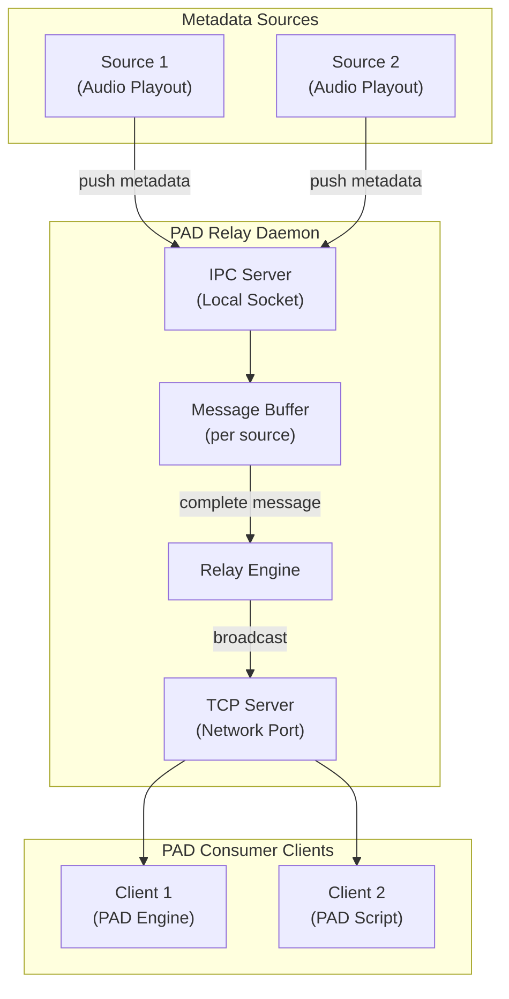
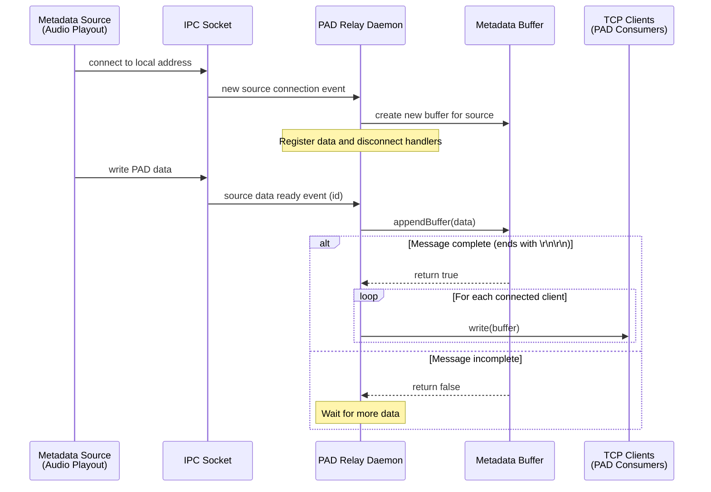
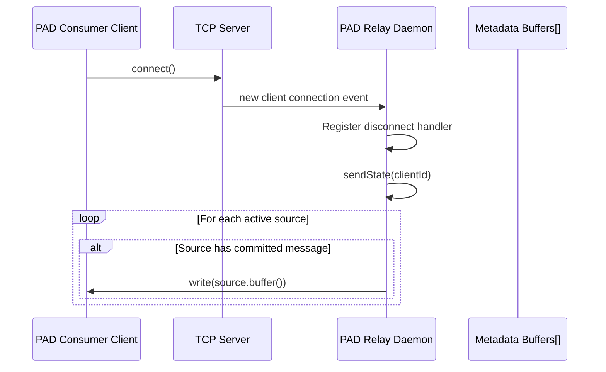
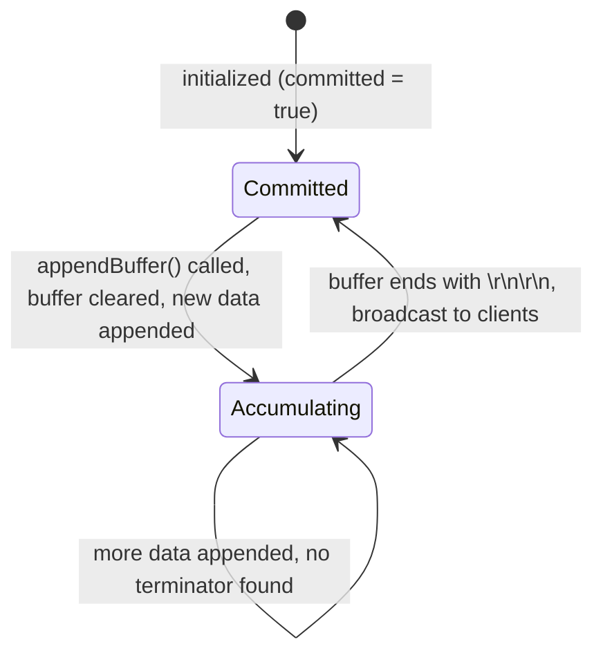
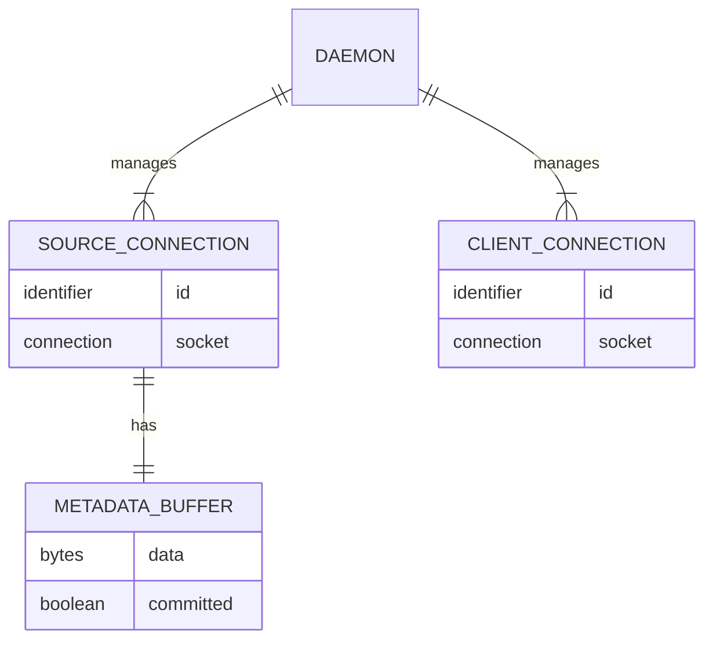

# Design Document: PAD Relay Daemon

## Overview

**Purpose:** The PAD (Program Associated Data) relay daemon provides a centralized message broker for distributing real-time metadata (Now Playing, Next track) from audio playout sources to consumer clients within a radio automation system.

**Users:** Audio playout engines connect as metadata sources. PAD consumer services and external scripting engines connect as clients to receive metadata updates for display, logging, or forwarding to external systems (e.g., RDS encoders, web displays).

**Impact:** This daemon sits at the center of the metadata distribution pipeline, bridging the gap between playout engines that produce metadata and downstream consumers that display or forward it.

### Goals

- Relay metadata messages from sources to all connected clients in real time
- Ensure new clients receive the current state immediately upon connection
- Support multiple concurrent sources and clients
- Provide simple, reliable message framing over streaming connections
- Operate as a lightweight, headless background service

### Non-Goals

- Parsing or interpreting the content of metadata messages (the daemon treats them as opaque byte streams)
- Persisting metadata to a database or filesystem
- Providing a graphical user interface
- Implementing authentication or access control on connections
- Platform-specific audio device integration

## Architecture

### Architecture Pattern & Boundary Map

The daemon follows an event-driven message broker pattern with two server interfaces:



**Architecture Integration:**
- Selected pattern: Event-driven message broker with publish-subscribe semantics
- Domain boundaries: Source management (IPC side) and client management (TCP side) are separate concerns within a single process
- The daemon is stateless beyond in-memory buffers -- no persistence layer

### Technology Stack

| Layer | Choice | Role | Notes |
|-------|--------|------|-------|
| Runtime | Headless background service | Event loop for async I/O | No GUI framework needed |
| Source Transport | Local IPC socket | Receives metadata from playout engines | Abstract socket address |
| Client Transport | TCP server | Distributes metadata to consumers | Well-known port |
| Data | In-memory buffers | Per-source message accumulation | No database |

## System Flows

### Source Publishes Metadata



### Client Connects and Receives State



### Metadata Buffer State Cycle



## Requirements Traceability

| Requirement | Summary | Components | Interfaces | Flows |
|-------------|---------|------------|------------|-------|
| 1 | Client connection management | ClientManager, TCPServer | TCP accept, disconnect | Client Connects |
| 2 | Source connection management | SourceManager, IPCServer | IPC accept, disconnect | Source Publishes |
| 3 | Message framing and relay | MetadataBuffer, RelayEngine | appendBuffer, broadcast | Source Publishes |
| 4 | State replay for new clients | RelayEngine, MetadataBuffer | sendState | Client Connects |
| 5 | Daemon startup and port binding | DaemonController | listen, bind | -- |

## Components and Interfaces

| Component | Domain/Layer | Intent | Req Coverage | Key Dependencies | Contracts |
|-----------|-------------|--------|--------------|------------------|-----------|
| DaemonController | Infrastructure | Initializes servers, manages daemon lifecycle | 5 | IPCServer, TCPServer | Service |
| MetadataBuffer | Core | Accumulates and frames per-source metadata messages | 3 | -- | State |
| RelayEngine | Core | Broadcasts completed messages, replays state to new clients | 3, 4 | MetadataBuffer, ClientManager | Service, Event |
| SourceManager | Transport/IPC | Accepts and manages source connections | 2 | IPCServer, MetadataBuffer | Service |
| ClientManager | Transport/TCP | Accepts and manages client connections | 1 | TCPServer | Service |

### Core Layer

#### MetadataBuffer

| Field | Detail |
|-------|--------|
| Intent | Accumulates incoming bytes per source and detects complete messages using the `\r\n\r\n` terminator |
| Requirements | 3 |

**Responsibilities & Constraints**
- Buffers incoming data from a single source connection
- Detects message completion by checking for `\r\n\r\n` terminator
- Clears buffer when new data arrives after a completed message
- Does NOT interpret message content (opaque byte stream)

**Dependencies**
- Inbound: SourceManager -- provides raw data chunks
- Outbound: RelayEngine -- notifies on message completion

**Contracts:** State [x]

##### State Management
- State model: Two states -- Committed and Accumulating (see state diagram above)
- Persistence: None (in-memory only)
- Concurrency: Single-threaded event loop; no concurrent access

#### RelayEngine

| Field | Detail |
|-------|--------|
| Intent | Distributes completed metadata messages to all connected clients and replays current state to newly connected clients |
| Requirements | 3, 4 |

**Responsibilities & Constraints**
- Broadcasts completed message buffers to all active client connections
- On new client connection, iterates all source buffers and sends committed ones
- Does not filter or transform message content

**Dependencies**
- Inbound: MetadataBuffer -- completed message notification
- Outbound: ClientManager -- access to client connection list

**Contracts:** Service [x] / Event [x]

##### Service Interface
```
interface RelayEngine {
  broadcast(buffer: bytes): void
  sendState(clientId: identifier): void
}
```
- Preconditions: At least one client connected (for broadcast); client exists (for sendState)
- Postconditions: All connected clients receive the buffer data

##### Event Contract
- Published events: message_completed (triggers broadcast)
- Subscribed events: source_data_ready, client_connected
- Ordering: Messages are broadcast in the order they are completed

### Transport Layer

#### SourceManager

| Field | Detail |
|-------|--------|
| Intent | Manages source connections over local IPC socket and routes incoming data to per-source MetadataBuffers |
| Requirements | 2 |

**Responsibilities & Constraints**
- Accepts new source connections on the local IPC address
- Creates a MetadataBuffer for each connected source
- Routes incoming data to the appropriate buffer
- Cleans up buffer and connection on source disconnect

**Dependencies**
- Inbound: IPCServer -- new connection and data events
- Outbound: MetadataBuffer -- data forwarding
- External: IPC socket library (P0)

**Contracts:** Service [x]

##### Service Interface
```
interface SourceManager {
  onSourceConnected(socket: connection): void
  onSourceDataReady(sourceId: identifier): void
  onSourceDisconnected(sourceId: identifier): void
}
```

#### ClientManager

| Field | Detail |
|-------|--------|
| Intent | Manages client connections over TCP and provides access to the list of active clients for broadcasting |
| Requirements | 1 |

**Responsibilities & Constraints**
- Accepts new client connections on the designated TCP port
- Maintains a map of active client connections by identifier
- Triggers state replay for each new client
- Cleans up on client disconnect

**Dependencies**
- Inbound: TCPServer -- new connection events
- Outbound: RelayEngine -- triggers state replay on new client

**Contracts:** Service [x]

##### Service Interface
```
interface ClientManager {
  onClientConnected(socket: connection): void
  onClientDisconnected(clientId: identifier): void
  getActiveClients(): map<identifier, connection>
}
```

### Infrastructure Layer

#### DaemonController

| Field | Detail |
|-------|--------|
| Intent | Bootstraps the daemon, binds server sockets, and enters the event loop |
| Requirements | 5 |

**Responsibilities & Constraints**
- Binds TCP server to the designated client port on all interfaces
- Binds IPC server to the designated local address
- Exits with error if either binding fails
- Runs as a headless background service

**Dependencies**
- Outbound: SourceManager, ClientManager -- initialization
- External: Operating system socket APIs (P0)

## Data Models

### Domain Model

The PAD relay daemon has no persistent data model. All data exists in-memory as transient buffers:

- **MetadataBuffer**: A per-source accumulation buffer containing raw bytes. The daemon does not parse or interpret the content -- it only detects message boundaries.
- **Connection Registry**: Maps of active source and client connections indexed by connection identifier.

No database tables, no file storage, no persistent state.

### Logical Data Model



## Error Handling

### Error Categories and Responses

**System Errors (fatal):**
- TCP client port binding failure: The daemon prints an error identifying the port and terminates immediately. This prevents silent failures where the daemon appears to run but cannot accept clients.
- IPC source socket binding failure: The daemon prints an error including the failure reason and terminates immediately.
- Source connection acceptance failure (pending connection returns null): The daemon prints the socket error details and terminates immediately.

**Warning Errors (non-fatal):**
- Unknown client disconnect: A disconnect event references a connection identifier not in the active client map. The daemon logs a warning to standard error and continues operation.
- Unknown source disconnect: A disconnect event references a connection identifier not in the active source map. The daemon logs a warning to standard error and continues operation.

### Error Strategy

All fatal errors result in immediate daemon termination with a non-zero exit code. The daemon follows a fail-fast philosophy -- if critical infrastructure (port binding, socket acceptance) fails, the process exits rather than running in a degraded state.

Non-fatal errors (unknown disconnects) are logged but do not affect daemon operation, as they represent edge cases in connection lifecycle management.

## Testing Strategy

### E2E Tests

1. **Source-to-client relay:** Connect a source and a client, send a complete message from source, verify client receives the exact buffer.
2. **Multi-client broadcast:** Connect multiple clients, send a message from source, verify all clients receive it.
3. **State replay on connect:** Connect a source, send a committed message, then connect a new client, verify it receives the current state.
4. **Partial message buffering:** Send partial data (no terminator), verify no broadcast occurs; send remaining data with terminator, verify broadcast.
5. **Source disconnect cleanup:** Connect a source, send data, disconnect source, verify cleanup and no errors on subsequent client operations.

### Integration Tests

1. **Concurrent sources and clients:** Multiple sources pushing updates simultaneously with multiple clients connected.
2. **Connection lifecycle:** Rapid connect/disconnect cycles for both sources and clients under load.
3. **Cross-artifact integration:** Verify that an audio playout engine (source) and PAD engine daemon (client) can exchange metadata through the relay.

### Unit Tests

1. **Message framing:** Verify `appendBuffer` correctly detects `\r\n\r\n` terminator across multiple partial writes.
2. **Buffer clearing:** Verify buffer is cleared on first append after a committed message.
3. **Committed state tracking:** Verify `isCommitted` returns correct values through the Committed/Accumulating state cycle.
4. **State replay:** Verify `sendState` sends only committed buffers and skips uncommitted ones.
5. **Connection registry:** Verify add/remove operations on the client and source connection maps.
