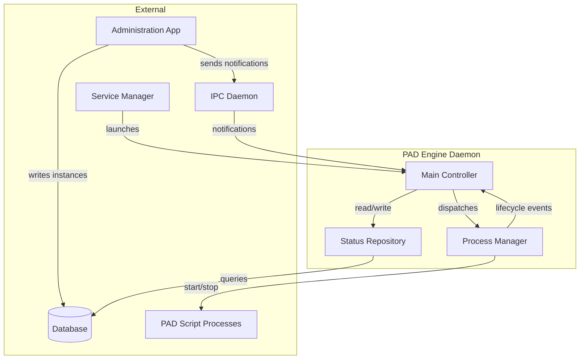
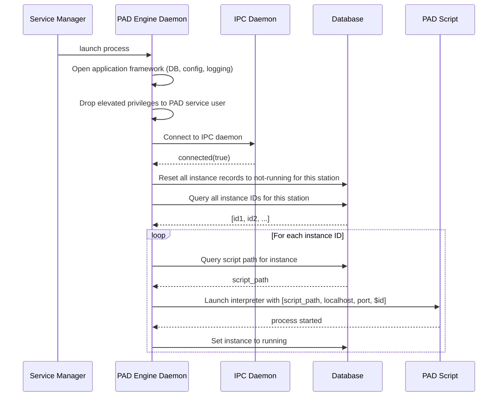
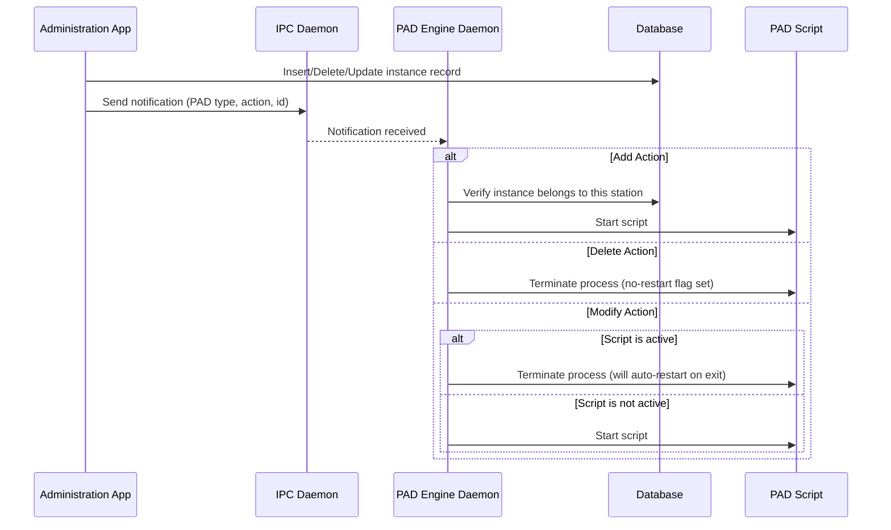
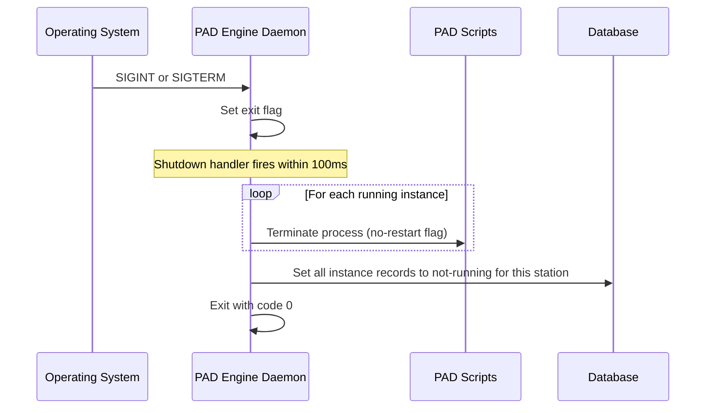
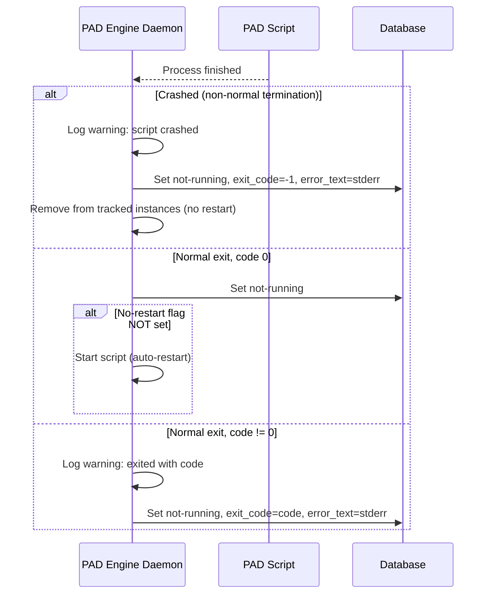
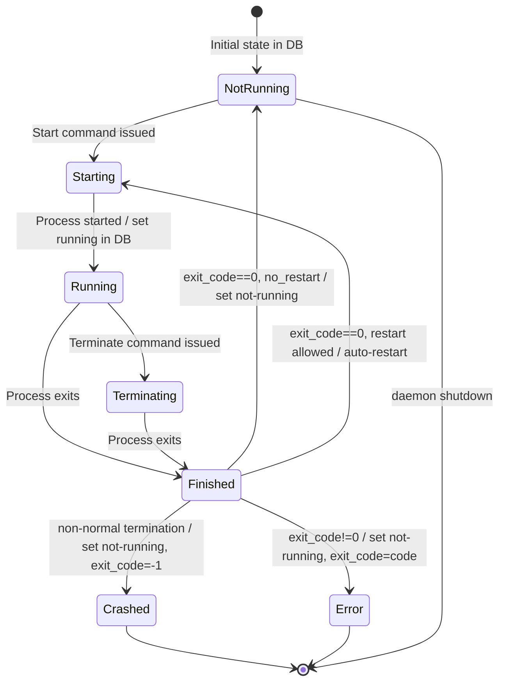
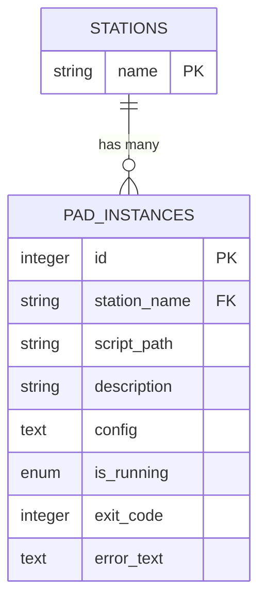

# Design Document: PAD Engine Daemon

## Overview

**Purpose:** The PAD Engine Daemon manages the lifecycle of PAD (Program Associated Data) script instances for a radio automation station. It is a headless background service that starts, monitors, restarts, and stops interpreter-based scripts responsible for publishing program metadata to external systems.

**Users:** System administrators configure PAD instances via the administration application. The daemon itself runs unattended, managed by the Service Manager daemon.

**Impact:** The daemon bridges the administration interface and the PAD script runtime. It ensures configured scripts remain running, handles crash recovery, and responds to dynamic configuration changes pushed through the IPC notification system.

### Goals

- Reliably manage PAD script process lifecycles (start, stop, restart, crash recovery)
- Maintain accurate runtime status in the database for administrative visibility
- Support dynamic add/delete/modify operations without daemon restart
- Run scripts under restricted privileges for security
- Shut down gracefully on system signals

### Non-Goals

- PAD script logic itself (scripts are external interpreter programs)
- Administration UI for managing PAD instances (handled by the ADM artifact)
- IPC daemon implementation (handled by the RPC artifact)
- Database schema management (handled by the UTL artifact)

## Architecture

### Architecture Pattern and Boundary Map

The daemon follows an event-driven service pattern: it reacts to IPC notifications and process lifecycle events, executing commands against managed child processes and updating database state.



**Architecture Integration:**
- Selected pattern: Event-driven process manager reacting to IPC notifications
- Domain boundaries: The daemon owns only script process lifecycle; instance configuration is owned by the administration application
- Existing patterns preserved: Notification-based communication via IPC daemon, database as shared state store
- Steering compliance: The steering tech stack (TypeScript/Node.js) applies to the target reimplementation; this design is technology-agnostic

### Technology Stack

| Layer | Choice | Role | Notes |
|-------|--------|------|-------|
| Runtime | TBD | Headless daemon process | Must support child process management |
| IPC | TCP-based notification system | Receive add/delete/modify commands | Via IPC daemon relay |
| Data | Relational database | Store instance configuration and runtime status | Shared with administration application |
| Process Management | OS child process API | Launch and monitor interpreter scripts | Must support signal-based termination |

## System Flows

### Startup Sequence



### Notification Handling (Add/Delete/Modify)



### Graceful Shutdown



### Script Crash/Restart Cycle



### Script Instance State Machine



## Requirements Traceability

| Requirement | Summary | Components | Interfaces | Flows |
|-------------|---------|------------|------------|-------|
| 1 | Secure Process Initialization | Main Controller | Application Framework | Startup |
| 2 | IPC Connection and State Reset | Main Controller, Status Repository | IPC Notification | Startup |
| 3 | Notification-Driven Script Management | Main Controller, Process Manager | IPC Notification | Notification Handling |
| 4 | Script Process Lifecycle | Process Manager, Status Repository | Process Management | Startup, Notification Handling |
| 5 | Auto-Restart on Clean Exit | Process Manager | Process Lifecycle Events | Crash/Restart Cycle |
| 6 | Crash and Error Handling | Main Controller, Status Repository | Process Lifecycle Events | Crash/Restart Cycle |
| 7 | Graceful Shutdown | Main Controller, Process Manager, Status Repository | OS Signal | Graceful Shutdown |
| 8 | Script Status Tracking | Status Repository | Database | All flows |

## Components and Interfaces

| Component | Domain/Layer | Intent | Req Coverage | Key Dependencies | Contracts |
|-----------|-------------|--------|-------------|-----------------|-----------|
| Main Controller | Application | Orchestrates daemon lifecycle, dispatches notifications | 1, 2, 3, 7 | IPC Daemon, Application Framework | Event, Service |
| Process Manager | Service | Manages child process start/stop/restart | 3, 4, 5, 6 | OS Process API | Service, Event |
| Status Repository | Data | Reads/writes PAD instance records in database | 2, 4, 6, 7, 8 | Database | Service |

### Application Layer

#### Main Controller

| Field | Detail |
|-------|--------|
| Intent | Orchestrates daemon startup, privilege dropping, IPC connection, notification dispatch, and shutdown |
| Requirements | 1, 2, 3, 7 |

**Responsibilities and Constraints**
- Initialize application framework (database, configuration, logging)
- Drop elevated privileges to configured PAD service user/group
- Connect to IPC daemon and handle connection state changes
- Dispatch PAD-type notifications to Process Manager
- Manage graceful shutdown on OS termination signals
- Poll for shutdown flag at 100ms intervals

**Dependencies**
- Inbound: Service Manager -- launches daemon process (Critical)
- Inbound: IPC Daemon -- delivers notifications (Critical)
- Outbound: Process Manager -- delegates script lifecycle operations (Critical)
- Outbound: Status Repository -- reads/writes instance state (Critical)
- External: Application Framework (LIB) -- bootstrap, config, logging (Critical)

**Contracts:** Event, Service

##### Event Contract
- Subscribed events:
  - `ipc.connected(state: boolean)` -- IPC connection state changes
  - `ipc.notificationReceived(notification)` -- PAD-type notifications from administration app
  - `os.signal(SIGINT | SIGTERM)` -- OS termination signals
  - `timer.tick(100ms)` -- Periodic check for shutdown flag

##### Service Interface
```
interface MainController {
  initialize(): Result<void, InitError>
  shutdown(): void
}
```

#### Process Manager

| Field | Detail |
|-------|--------|
| Intent | Manages lifecycle of child PAD script processes |
| Requirements | 3, 4, 5, 6 |

**Responsibilities and Constraints**
- Start scripts by launching the interpreter with correct arguments
- Maintain a map of instance ID to managed process objects
- Handle process lifecycle events (started, finished)
- Apply auto-restart logic on clean exit (when no-restart flag is not set)
- Handle crash detection and error recording
- Terminate processes on demand (with optional no-restart flag)

**Dependencies**
- Inbound: Main Controller -- start/stop/kill commands (Critical)
- Outbound: Status Repository -- update running state on lifecycle events (Critical)
- External: OS Process API -- child process management (Critical)

**Contracts:** Service, Event

##### Service Interface
```
interface ProcessManager {
  startScript(id: number): Result<void, StartError>
  killScript(id: number): void
  isActive(id: number): boolean
  terminateAll(noRestart: boolean): void
}
```

##### Event Contract
- Published events:
  - `script.started(id: number)` -- Script process launched successfully
  - `script.finished(id: number, exitCode: number, crashed: boolean, errorText: string)` -- Script process terminated

### Data Layer

#### Status Repository

| Field | Detail |
|-------|--------|
| Intent | Manages PAD instance records in the database |
| Requirements | 2, 4, 6, 7, 8 |

**Responsibilities and Constraints**
- Query instance IDs and script paths for a given station
- Update running status, exit code, and error text for individual instances
- Bulk reset all instances for a station to not-running
- Verify instance ownership (instance belongs to this station)

**Dependencies**
- External: Database -- relational database connection (Critical)

**Contracts:** Service

##### Service Interface
```
interface StatusRepository {
  getInstanceIds(stationName: string): Result<number[], QueryError>
  getScriptPath(id: number, stationName: string): Result<string | null, QueryError>
  setRunStatus(id: number, running: boolean, exitCode?: number, errorText?: string): Result<void, QueryError>
  resetAllInstances(stationName: string): Result<void, QueryError>
  instanceBelongsToStation(id: number, stationName: string): Result<boolean, QueryError>
}
```

## Data Models

### Domain Model

The PAD Engine Daemon operates on a single entity: the PAD Script Instance. Each instance represents a configured PAD script that should be managed for a specific station.

- **PAD Script Instance** (entity): Represents a configured PAD script with its path, description, configuration, and runtime state
- **Station** (reference): The station this instance belongs to; owned by the core library

### Logical Data Model



### Physical Data Model

**Table: PAD_INSTANCES**

| Column | Type | Constraints | Description |
|--------|------|------------|-------------|
| id | integer | PRIMARY KEY, AUTO INCREMENT | Unique instance identifier |
| station_name | string(64) | NOT NULL, INDEXED | Station this instance belongs to |
| script_path | string(191) | NOT NULL | Filesystem path to the PAD script |
| description | string(191) | DEFAULT '[new]' | Human-readable description |
| config | text | NOT NULL | Configuration data for the script |
| is_running | enum('N','Y') | NOT NULL, DEFAULT 'N' | Whether the script is currently running |
| exit_code | integer | NOT NULL, DEFAULT 0 | Last exit code of the script process |
| error_text | text | nullable | Error output from last run |

- **Primary Key:** id
- **Indexes:** station_name
- **Foreign Keys:** station_name references STATIONS.name (implicit, no enforced constraint)

## Error Handling

### Error Categories

**Fatal Errors (daemon terminates):**

| Error | Condition | Action |
|-------|-----------|--------|
| Application framework failure | Database/config connection fails at startup | Output error message, exit with code 1 |
| Group privilege drop failure | OS call to change group ID returns error | Log error, exit with code 1 |
| User privilege drop failure | OS call to change user ID returns error | Log error, exit with code 1 |
| Unknown command option | Unrecognized command-line argument | Log error, exit with code 2 |

**Warning Errors (logged, daemon continues):**

| Error | Condition | Action |
|-------|-----------|--------|
| Script crash | Script process terminates abnormally | Log warning, record exit code -1 and error output in database, do not restart |
| Script non-zero exit | Script exits normally with non-zero code | Log warning with exit code, record exit code and error output in database |

### Error Strategy

- Fatal errors during initialization cause immediate daemon termination with appropriate exit codes
- Runtime script errors are logged and persisted to the database for administrator review via the administration application
- Crashed scripts are not restarted to prevent crash loops
- Scripts with non-zero exit codes are recorded but the process reference is retained

## Testing Strategy

### E2E Tests

1. **Startup flow:** Daemon starts, connects to IPC, resets database, starts all configured scripts
2. **Add notification:** Administration app creates instance, sends add notification, daemon starts script
3. **Delete notification:** Administration app sends delete notification, daemon terminates script without restart
4. **Modify notification (active):** Send modify for running script, script restarts with new configuration
5. **Modify notification (inactive):** Send modify for stopped script, daemon starts it
6. **Graceful shutdown:** Send termination signal, all scripts terminated, database updated, daemon exits cleanly

### Integration Tests

1. **IPC reconnection:** Verify state reset and script restart when IPC connection is re-established
2. **Auto-restart on clean exit:** Script exits with code 0, verify automatic restart occurs
3. **Crash handling:** Script crashes, verify database updated with error info and no restart attempted
4. **Privilege dropping:** Verify daemon drops to configured user/group on startup
5. **Concurrent script management:** Multiple scripts running, verify independent lifecycle management

### Unit Tests

1. **Notification dispatch:** Verify correct action (add/delete/modify) based on notification type
2. **Script active check:** Verify active status detection for running vs. stopped processes
3. **Run status update:** Verify correct database fields set for various exit scenarios
4. **No-restart flag:** Verify restart suppression when flag is set
5. **Shutdown flag polling:** Verify exit timer detects shutdown flag and initiates termination

## Security Considerations

- The daemon drops elevated privileges immediately after initialization, running PAD scripts under a dedicated restricted user account
- Script paths are read from the database (configured by administrators), not from untrusted input
- The daemon connects to the IPC daemon on localhost only
