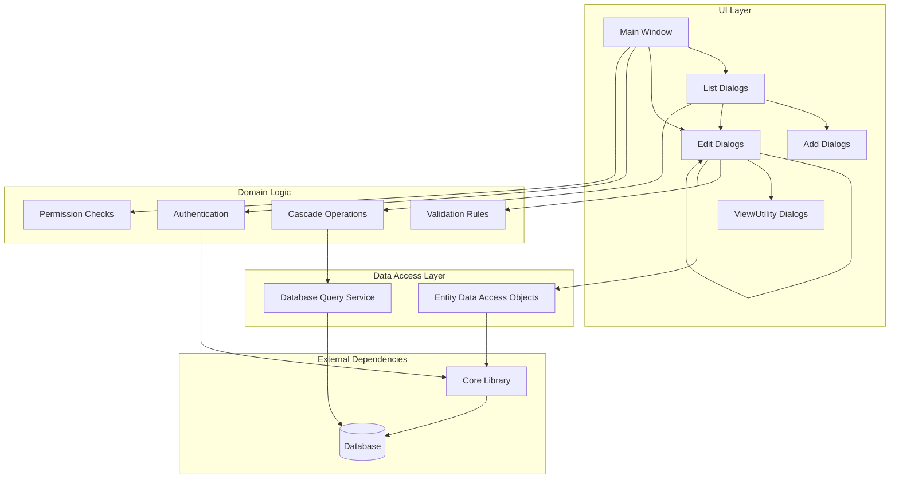
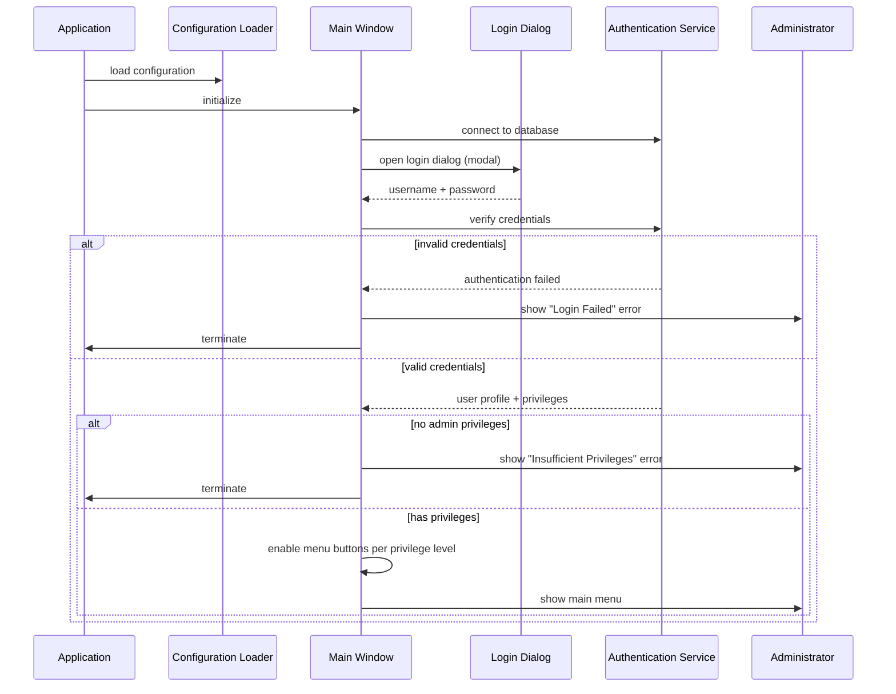
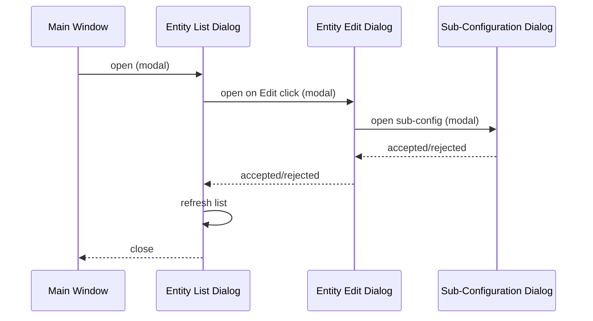
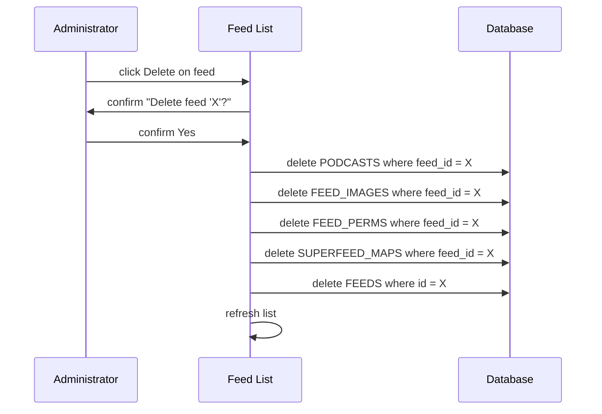
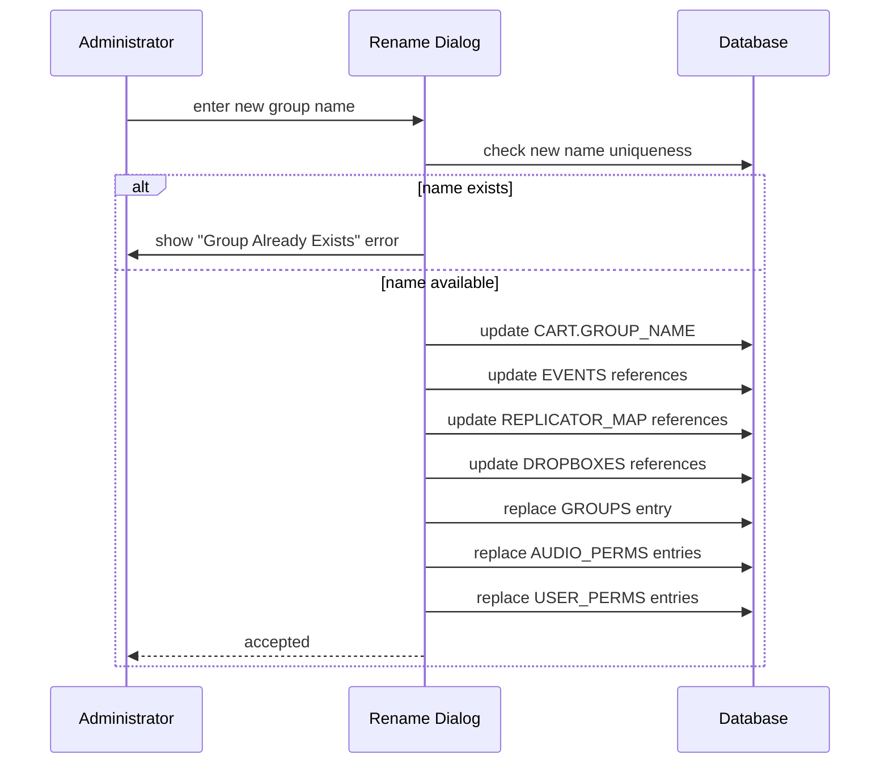

# Design Document

## Overview

**Purpose:** RDAdmin is the centralized administration console for a broadcast automation system. It provides a comprehensive configuration interface covering every aspect of the broadcast infrastructure: user accounts and permissions, content groups, broadcast services, station hardware, audio routing matrices, podcast distribution, traffic/music import, content replication, scheduled operations, and system-wide settings.

**Users:** System administrators with either "admin configuration" or "admin RSS" privileges. The application enforces authentication at startup and restricts menu access based on privilege level.

**Impact:** RDAdmin is the primary configuration tool for the entire broadcast system. Changes made here affect all other applications (on-air playout, library management, log editing, panel operations, catch/record scheduling) and all daemons (audio engine, IPC, catch daemon, replication daemon, RSS daemon, automation plugin daemon). It manages approximately 43 database tables.

### Goals

- Provide a single administrative interface for all broadcast system configuration
- Enforce role-based access control with granular user permissions
- Support CRUD operations on all configurable entities with validation and cascade integrity
- Enable per-station configuration of application profiles and hardware assignments
- Manage audio routing matrix configuration with support for multiple matrix types
- Configure podcast feed distribution with RSS metadata and image management
- Support content replication to remote systems
- Maintain data integrity through validation, conflict detection, and cascade operations

### Non-Goals

- Real-time audio processing or playout (handled by other applications and daemons)
- Direct file system monitoring or audio import execution (handled by dropbox daemon)
- Log scheduling or generation (handled by log manager application)
- End-user operations such as cart editing, log editing, or on-air control
- Platform-specific audio driver configuration (ALSA, JACK, HPI references are legacy)
- Implementation of the absolute-positioning UI layout from the legacy system

## Visual Design Reference

All UI/UX implementation decisions (colors, typography, spacing, component appearance, interaction patterns) are defined in the design system files. **Agents implementing UI components MUST read these before writing any visual code.**

| Layer | File | Scope |
|-------|------|-------|
| Global | `.blah/steering/design.md` | Typography, base palette, spacing, z-index, accessibility baseline |
| Spec | `design-system/MASTER.md` | rdadmin-specific tokens (colors, states, layout, component specs) |
| Page | `design-system/pages/*.md` | Per-view overrides |

**Hierarchy:** page override > spec MASTER > global steering. Higher layers only define differences.

<!-- design-system/ generated by ui-ux-pro-max: SPA settings panel with sidebar + content area layout.
     Mockups available at mockup/index.html (HTML+Tailwind) and mockup/main.qml (Qt Quick). -->

## Architecture

### Architecture Pattern & Boundary Map

The application follows a **modal dialog tree** pattern. A single main window presents navigation buttons that open list dialogs. List dialogs open add/edit dialogs. Edit dialogs may open further sub-dialogs. All dialogs are modal -- the parent waits for the child to complete before processing the result.

No custom inter-component events are used. Communication is exclusively through dialog return values (accepted/rejected) and shared data objects passed via constructor parameters.



### Technology Stack

| Layer | Choice | Role | Notes |
|-------|--------|------|-------|
| Frontend | TBD (see steering) | Admin UI with modal dialog navigation | Dark theme, information-dense layout per design steering |
| Backend / Services | TBD (see steering) | Business logic, validation, cascade operations | Domain module per entity type |
| Data / Storage | Relational database | All configuration persistence | ~43 tables, see Data Models section |
| Messaging / Events | None required | N/A | Pure request-response, no async events |
| Infrastructure / Runtime | TBD (see steering) | Application hosting | Single-user desktop-style application |

## System Flows

### Application Lifecycle



### Dialog Navigation (Typical CRUD Flow)



### Cascade Delete Flow (Example: Feed)



### Group Rename Cascade Flow



## Requirements Traceability

| Requirement | Summary | Components | Interfaces | Flows |
|-------------|---------|------------|------------|-------|
| 1 | Authentication and Authorization | AuthenticationService, LoginDialog, MainWindow | Auth Service | Application Lifecycle |
| 2 | User Management | UserListView, UserEditor, UserPermissionEditor, ServicePermissionEditor, FeedPermissionEditor | User CRUD, Permission CRUD | Dialog Navigation |
| 3 | Group Management | GroupListView, GroupEditor, GroupRenameDialog | Group CRUD | Group Rename Cascade |
| 4 | Service Management | ServiceListView, ServiceEditor, ServicePermissionEditor, ImportTestView, AutofillEditor, ImportFieldMapper | Service CRUD, Import Test | Dialog Navigation |
| 5 | Station Core Configuration | StationListView, StationEditor | Station CRUD | Dialog Navigation |
| 6 | Station Application Profiles | AirPlayProfileEditor, LibraryProfileEditor, LogEditProfileEditor, PanelProfileEditor, DeckEditor, HotkeyEditor, ChannelGpioEditor | Profile CRUD | Dialog Navigation |
| 7 | Station Hardware Configuration | AudioPortEditor, SerialPortEditor, AudioServerEditor, AutomationPluginList, AutomationPluginEditor, CartSlotEditor | Hardware Config CRUD | Dialog Navigation |
| 8 | Switcher/Matrix Management | MatrixListView, MatrixEditor, EndpointListView, GpiEditor, NodeListView, NodeEditor, NetworkAudioGpioList, VendorResourceEditors | Matrix CRUD, Endpoint CRUD | Dialog Navigation, Cascade Delete |
| 9 | Dropbox Management | DropboxListView, DropboxEditor | Dropbox CRUD | Dialog Navigation |
| 10 | Podcast/Feed Management | FeedListView, FeedEditor, SuperfeedEditor, ImageListView, ImageViewer | Feed CRUD, Image CRUD | Cascade Delete (Feed) |
| 11 | Report Management | ReportListView, ReportEditor | Report CRUD | Dialog Navigation |
| 12 | Replicator Management | ReplicatorListView, ReplicatorEditor, ReplicatorCartView | Replicator CRUD | Dialog Navigation |
| 13 | Scheduler Code Management | SchedulerCodeListView, SchedulerCodeEditor | SchedulerCode CRUD | Dialog Navigation |
| 14 | System Settings | SystemSettingsEditor, EncoderListView, SystemInfoDialog, LicenseDialog | System Settings CRUD | Dialog Navigation |
| 15 | Host Variable Management | HostVariableListView, HostVariableEditor | HostVariable CRUD | Dialog Navigation |
| 16 | Universal Entity Validation | ValidationService (shared) | Validation | All CRUD flows |

## Components and Interfaces

### Summary

| Component | Domain/Layer | Intent | Req Coverage | Key Dependencies | Contracts |
|-----------|-------------|--------|--------------|-----------------|-----------|
| MainWindow | UI | Navigation hub with privilege-gated menu | 1 | AuthenticationService (P0) | State |
| LoginDialog | UI | Credential input | 1 | None | Service |
| AuthenticationService | Logic | Credential verification and privilege check | 1 | UserDataAccess (P0) | Service |
| UserListView | UI | User CRUD list | 2 | UserDataAccess (P0) | Service |
| UserEditor | UI | User account and permission editing | 2, 16 | UserDataAccess (P0), PermissionDataAccess (P1) | Service |
| GroupListView | UI | Group CRUD list | 3 | GroupDataAccess (P0) | Service |
| GroupEditor | UI | Group property editing | 3, 16 | GroupDataAccess (P0), ValidationService (P1) | Service |
| GroupRenameService | Logic | Multi-table rename cascade | 3 | DatabaseQueryService (P0) | Service |
| ServiceListView | UI | Service CRUD list | 4 | ServiceDataAccess (P0) | Service |
| ServiceEditor | UI | Service configuration with import templates | 4, 16 | ServiceDataAccess (P0), ImportFieldMapper (P1) | Service |
| ImportFieldMapper | UI | Traffic/music import field position mapping | 4 | ServiceDataAccess (P1) | Service |
| ImportTestView | UI | Traffic/music import testing | 4 | DatabaseQueryService (P1) | Service |
| StationListView | UI | Station CRUD list | 5 | StationDataAccess (P0) | Service |
| StationEditor | UI | Station core configuration and sub-dialog navigation | 5, 6, 7 | StationDataAccess (P0), multiple sub-editors (P1) | Service |
| AirPlayProfileEditor | UI | Per-station on-air app configuration | 6 | AirPlayConfigDataAccess (P0) | Service |
| LibraryProfileEditor | UI | Per-station library app configuration | 6 | LibraryConfigDataAccess (P0) | Service |
| LogEditProfileEditor | UI | Per-station log editor configuration | 6 | LibraryConfigDataAccess (P0) | Service |
| PanelProfileEditor | UI | Per-station panel configuration | 6 | AirPlayConfigDataAccess (P0) | Service |
| DeckEditor | UI | Record/play deck configuration | 6 | CatchConfigDataAccess (P0) | Service |
| HotkeyEditor | UI | Keyboard hotkey assignment | 6 | DatabaseQueryService (P0) | Service |
| AudioPortEditor | UI | Sound card port configuration | 7 | StationDataAccess (P0) | Service |
| SerialPortEditor | UI | Serial/TTY port configuration | 7 | DatabaseQueryService (P0) | Service |
| AudioServerEditor | UI | Audio server and client configuration | 7 | DatabaseQueryService (P0) | Service |
| AutomationPluginList | UI | Plugin instance CRUD list | 7 | DatabaseQueryService (P0) | Service |
| AutomationPluginEditor | UI | Plugin instance configuration | 7 | DatabaseQueryService (P0) | Service |
| CartSlotEditor | UI | Cart slot grid configuration | 7 | DatabaseQueryService (P0) | Service |
| MatrixListView | UI | Switcher/matrix CRUD list | 8 | MatrixDataAccess (P0) | Service |
| MatrixEditor | UI | Matrix configuration with sub-dialog navigation | 8, 16 | MatrixDataAccess (P0), ValidationService (P1) | Service |
| EndpointListView | UI | Matrix input/output management | 8 | DatabaseQueryService (P0) | Service |
| NodeEditor | UI | Network audio node configuration | 8 | DatabaseQueryService (P0) | Service |
| GpiEditor | UI | GPI/GPO trigger cart assignment | 8 | DatabaseQueryService (P0) | Service |
| DropboxListView | UI | Dropbox CRUD list with duplicate | 9 | DropboxDataAccess (P0) | Service |
| DropboxEditor | UI | Dropbox configuration | 9, 16 | DropboxDataAccess (P0), ValidationService (P1) | Service |
| FeedListView | UI | Podcast feed CRUD list | 10 | FeedDataAccess (P0) | Service |
| FeedEditor | UI | Feed configuration with metadata and encoding | 10, 16 | FeedDataAccess (P0), ImageDataAccess (P1) | Service |
| ImageListView | UI | Feed image management | 10 | ImageDataAccess (P0) | Service |
| ReportListView | UI | Report CRUD list | 11 | ReportDataAccess (P0) | Service |
| ReportEditor | UI | Report filter and export configuration | 11, 16 | ReportDataAccess (P0) | Service |
| ReplicatorListView | UI | Replicator CRUD list | 12 | ReplicatorDataAccess (P0) | Service |
| ReplicatorEditor | UI | Replicator connection and group configuration | 12, 16 | ReplicatorDataAccess (P0) | Service |
| ReplicatorCartView | UI | Replication state viewer with auto-refresh | 12 | DatabaseQueryService (P0) | Service |
| SchedulerCodeListView | UI | Scheduler code CRUD list | 13 | DatabaseQueryService (P0) | Service |
| SchedulerCodeEditor | UI | Scheduler code editing | 13, 16 | DatabaseQueryService (P0) | Service |
| SystemSettingsEditor | UI | System-wide settings | 14 | SystemDataAccess (P0) | Service |
| EncoderListView | UI | Encoder profile management | 14 | DatabaseQueryService (P0) | Service |
| SystemInfoDialog | UI | System information display | 14 | SystemDataAccess (P0) | Service |
| HostVariableListView | UI | Host variable CRUD list | 15 | DatabaseQueryService (P0) | Service |
| HostVariableEditor | UI | Host variable editing | 15, 16 | DatabaseQueryService (P0) | Service |
| ValidationService | Logic | Shared validation: name emptiness, uniqueness, IP format, numeric range | 16 | DatabaseQueryService (P0) | Service |
| CascadeDeleteService | Logic | Multi-table cascade delete operations | 3, 8, 10, 12, 13 | DatabaseQueryService (P0) | Service |
| PermissionSelectorWidget | UI | Dual-list available/assigned selector | 2, 4 | None | State |

### Logic Layer

#### AuthenticationService

| Field | Detail |
|-------|--------|
| Intent | Verify user credentials and determine privilege level |
| Requirements | 1 |

**Responsibilities & Constraints**
- Verify username/password against user database
- Determine admin configuration and admin RSS privileges
- Return authentication result with privilege flags

**Dependencies**
- Inbound: MainWindow -- authentication on startup (P0)
- Outbound: UserDataAccess -- credential verification (P0)

**Contracts:** Service [x]

##### Service Interface
```
interface AuthenticationService {
  authenticate(username: string, password: string): Result<AuthResult, AuthError>
}

type AuthResult = {
  userId: string
  username: string
  description: string
  hasAdminConfig: boolean
  hasAdminRss: boolean
}

type AuthError = "INVALID_CREDENTIALS" | "USER_NOT_FOUND" | "DATABASE_ERROR"
```

#### ValidationService

| Field | Detail |
|-------|--------|
| Intent | Shared validation logic for all entity CRUD operations |
| Requirements | 16 |

**Responsibilities & Constraints**
- Validate non-empty entity names
- Check entity name uniqueness across the appropriate table
- Validate IP address format
- Validate numeric ranges (cart numbers, port numbers)
- Validate URL format

**Contracts:** Service [x]

##### Service Interface
```
interface ValidationService {
  validateNonEmpty(value: string, fieldName: string): Result<void, ValidationError>
  validateUnique(entityType: string, name: string): Result<void, ValidationError>
  validateIpAddress(address: string): Result<void, ValidationError>
  validateCartNumber(cartNumber: number): Result<void, ValidationError>
  validateUrlFormat(url: string): Result<void, ValidationError>
}
```

#### CascadeDeleteService

| Field | Detail |
|-------|--------|
| Intent | Execute multi-table cascade delete operations maintaining referential integrity |
| Requirements | 3, 8, 10, 12, 13 |

**Responsibilities & Constraints**
- Delete feed cascades: podcasts, images, permissions, superfeed maps, then feed
- Delete matrix cascades: inputs, outputs, nodes, GPIs, GPOs, vendor resources, then matrix
- Delete replicator cascades: map entries, cart state, cut state, then replicator
- Delete group cascades: user permissions, audio permissions, then group (with cart warning)
- All cascade operations must be transactional

**Contracts:** Service [x]

##### Service Interface
```
interface CascadeDeleteService {
  deleteFeed(feedId: number): Result<void, CascadeError>
  deleteMatrix(stationName: string, matrixNumber: number): Result<void, CascadeError>
  deleteReplicator(replicatorName: string): Result<void, CascadeError>
  deleteGroup(groupName: string): Result<{cartCount: number}, CascadeError>
}
```

#### GroupRenameService

| Field | Detail |
|-------|--------|
| Intent | Execute multi-table group rename maintaining referential integrity |
| Requirements | 3 |

**Responsibilities & Constraints**
- Update all cart records referencing the old group name
- Update all event records referencing the old group name
- Update replicator map entries
- Update dropbox entries
- Replace group, audio permission, and user permission records
- Must be transactional

**Contracts:** Service [x]

##### Service Interface
```
interface GroupRenameService {
  renameGroup(oldName: string, newName: string): Result<void, RenameError>
}
```

### UI Layer

#### MainWindow

| Field | Detail |
|-------|--------|
| Intent | Top-level navigation hub presenting privilege-gated menu buttons |
| Requirements | 1 |

**Responsibilities & Constraints**
- Display current user identity
- Enable/disable menu buttons based on user privileges
- Open list/edit dialogs modally in response to button clicks

**Contracts:** State [x]

##### State Management
- State model: authenticated user identity, privilege flags, button enabled states
- Persistence: session-only (no persistence beyond application lifecycle)

#### PermissionSelectorWidget

| Field | Detail |
|-------|--------|
| Intent | Reusable dual-list widget for available/assigned permission management |
| Requirements | 2, 4 |

**Responsibilities & Constraints**
- Display two lists: available items and assigned items
- Support move-left/move-right operations
- Used by: UserPermissionEditor, ServicePermissionEditor, FeedPermissionEditor, ServiceHostPermissionEditor

**Contracts:** State [x]

##### State Management
- State model: list of available items, list of assigned items
- Persistence: changes committed only when parent dialog is accepted

## Data Models

### Domain Model

The data model is owned by the core library (LIB artifact). RDAdmin performs CRUD operations on these tables but does not define the schema. Key domain aggregates:

- **Station** (aggregate root): owns matrices, dropboxes, host variables, audio server clients, automation plugin instances, cart slots, serial port configs, per-application profiles
- **User** (aggregate root): owns user-group permissions, user-service permissions, feed permissions
- **Group** (aggregate root): owns audio permissions, referenced by user permissions and carts
- **Service**: owns report-service filters, audio permissions, host permissions
- **Feed** (aggregate root): owns images, podcasts, permissions, superfeed maps
- **Matrix** (aggregate root): owns inputs, outputs, GPIs, GPOs, nodes, vendor resources
- **Replicator** (aggregate root): owns replicator map entries, cart state, cut state
- **Report**: owns report-service, report-station, and report-group filter entries

### Logical Data Model

```mermaid
erDiagram
    STATIONS ||--o{ MATRICES : "has many"
    STATIONS ||--o{ DROPBOXES : "has many"
    STATIONS ||--o{ HOSTVARS : "has many"
    STATIONS ||--o{ AUDIO_SERVER_CLIENTS : "has many"
    STATIONS ||--o{ AUTOMATION_PLUGINS : "has many"
    STATIONS ||--o{ CARTSLOTS : "has many"
    STATIONS ||--o{ SERVICE_PERMS : "allowed on"
    GROUPS ||--o{ USER_PERMS : "assigned to"
    GROUPS ||--o{ AUDIO_PERMS : "assigned to"
    USERS ||--o{ USER_PERMS : "has"
    USERS ||--o{ USER_SERVICE_PERMS : "has"
    USERS ||--o{ FEED_PERMS : "has"
    SERVICES ||--o{ REPORT_SERVICES : "in"
    SERVICES ||--o{ AUDIO_PERMS : "allows"
    FEEDS ||--o{ FEED_PERMS : "has"
    FEEDS ||--o{ FEED_IMAGES : "has"
    FEEDS ||--o{ PODCASTS : "has"
    FEEDS ||--o{ SUPERFEED_MAPS : "includes"
    REPORTS ||--o{ REPORT_SERVICES : "filters by"
    REPORTS ||--o{ REPORT_STATIONS : "filters by"
    REPORTS ||--o{ REPORT_GROUPS : "filters by"
    MATRICES ||--o{ INPUTS : "has"
    MATRICES ||--o{ OUTPUTS : "has"
    MATRICES ||--o{ GPIS : "has"
    MATRICES ||--o{ GPOS : "has"
    MATRICES ||--o{ SWITCHER_NODES : "has"
    MATRICES ||--o{ VENDOR_RESOURCES : "has"
    REPLICATORS ||--o{ REPLICATOR_MAP : "covers"
    REPLICATORS ||--o{ REPL_CART_STATE : "tracks"
    DROPBOXES ||--o{ DROPBOX_PATHS : "watches"
    DROPBOXES ||--o{ DROPBOX_SCHED_CODES : "uses"
    SCHED_CODES ||--o{ DROPBOX_SCHED_CODES : "referenced by"
```



### Key Tables (Referenced by RDAdmin)

| Table | Primary Key | Key Columns | Used For |
|-------|-------------|-------------|----------|
| STATIONS | NAME | IP_ADDRESS, SYSTEM_MAINT, HEARTBEAT_CART | Station identity and system config |
| USERS | LOGIN_NAME | FULL_NAME, ADMIN_CONFIG_PRIV, ADMIN_RSS_PRIV, LOCAL_AUTH | User accounts and privileges |
| GROUPS | NAME | LOW_CART, HIGH_CART, COLOR, DEFAULT_CART_TYPE, SHELF_LIFE, CUT_LIFE | Content group definitions |
| SERVICES | NAME | TRACK_GROUP, AUTOSPOT_GROUP, LOG_SHELFLIFE | Broadcast service definitions |
| FEEDS | KEY_NAME | CHANNEL_TITLE, CHANNEL_DESCRIPTION, ORIGIN_LINK, BASE_URL | Podcast feed metadata |
| REPORTS | NAME | FILTER_TYPE, STATION_TYPE, CART_DIGITS, EXPORT_PATH | Report definitions |
| MATRICES | STATION_NAME + NUMBER | TYPE, IP_ADDRESS, IP_PORT | Audio switcher/matrix definitions |
| DROPBOXES | ID | STATION_NAME, PATH, TO_CART, NORMALIZATION_LEVEL | Auto-import dropbox configs |
| REPLICATORS | NAME | TYPE_ID, STATION_NAME, URL, FORMAT | Content replicator definitions |
| SCHED_CODES | CODE | DESCRIPTION | Scheduler classification codes |
| HOSTVARS | STATION_NAME + NAME | VARVALUE, REMARK | Per-station custom variables |

### Physical Data Model

The physical schema is defined in the LIB artifact (core library database manager). RDAdmin consumes this schema. For migration planning, refer to the LIB spec's data model section.

## Error Handling

### Error Categories

**User Errors (validation failures):**
- Empty name fields (~10 entity types)
- Invalid IP address format
- Invalid cart numbers
- Invalid segue lengths
- Invalid date offsets
- Invalid URL formats

**Duplicate Entity Errors:**
- User already exists
- Group already exists
- Service already exists
- Report already exists
- Replicator already exists
- Scheduler code already exists
- Duplicate network audio node hostname
- Duplicate matrix connection (IP/port)
- Duplicate hotkey assignment

**Business Constraint Errors:**
- Self-deletion prevention (cannot delete own user account)
- User has associated logs (deletion blocked)
- System maintenance pool minimum (at least one station required)
- Cart number range conflict (overlapping group ranges)
- Serial port in-use conflict
- Image in-use protection
- Duplicate cart title deprecation warning

**Cascade Warnings:**
- Group deletion with member carts (displays cart count)
- Service deletion with existing logs (second confirmation)
- Feed deletion cascade (podcasts, images, permissions, superfeed maps)
- Matrix deletion cascade (inputs, outputs, nodes, GPIs, GPOs, vendor resources)

### Error Strategy

All errors use modal dialog presentation:
- **Validation errors:** Warning dialog with message, save is blocked, user returns to form
- **Duplicate errors:** Warning dialog with entity-specific message, creation is blocked
- **Business constraints:** Warning dialog with explanation, operation is blocked or requires explicit confirmation
- **Cascade warnings:** Confirmation dialog (Yes/No) explaining what will be deleted, user may proceed or cancel
- **Delete confirmations:** Standard confirmation dialog for all entity deletions

## Testing Strategy

### E2E Tests

1. **Login flow:** Valid credentials grant access; invalid credentials terminate; insufficient privileges terminate
2. **User CRUD:** Create user, edit permissions, attempt self-delete (blocked), delete other user
3. **Group CRUD:** Create group, set cart range with overlap detection, rename with cascade, delete with cart warning
4. **Service CRUD:** Create service, configure import templates, test import, delete with log warning
5. **Station CRUD:** Create station (with exemplar cloning), configure application profiles, configure hardware, delete
6. **Feed CRUD:** Create feed, manage images, configure superfeed, delete with cascade
7. **Matrix CRUD:** Create matrix, add endpoints and nodes, assign GPI/GPO carts, delete with cascade
8. **Dropbox CRUD:** Create dropbox, configure import rules, duplicate, delete
9. **Replicator CRUD:** Create replicator, view cart state with auto-refresh, delete
10. **System settings:** Change sample rate, toggle duplicate cart titles (deprecation warning), manage encoders

### Integration Tests

1. **Authentication integration:** Login dialog -> authentication service -> user database -> privilege check -> menu state
2. **Cascade delete integrity:** Feed delete removes all child records across 5 tables
3. **Group rename cascade:** Rename updates all referencing records across 7 tables
4. **Station exemplar cloning:** New station clones encoder profiles from exemplar
5. **Permission assignment:** User-group, user-service, user-feed, service-host permission CRUD flows
6. **Matrix cascade delete:** Matrix delete removes all child records across 6 tables

### Unit Tests

1. **Validation rules:** Empty name rejection, IP address format validation, cart number range validation, URL format validation
2. **Cart range overlap detection:** Detect overlapping ranges across groups, allow non-overlapping ranges
3. **Privilege gate logic:** Admin config enables correct menu items, admin RSS enables correct menu items, both enables all
4. **Self-deletion guard:** Current user ID matches delete target -> blocked
5. **System maintenance pool check:** Count stations in pool, block removal of last station
6. **Serial port conflict detection:** Port already assigned to matrix -> blocked with detail message
7. **Hotkey duplicate detection:** Same keystroke assigned twice -> warning
