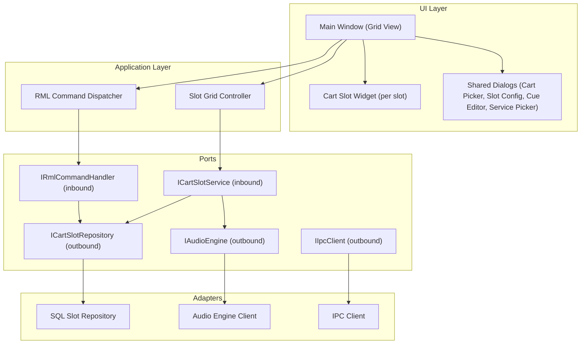
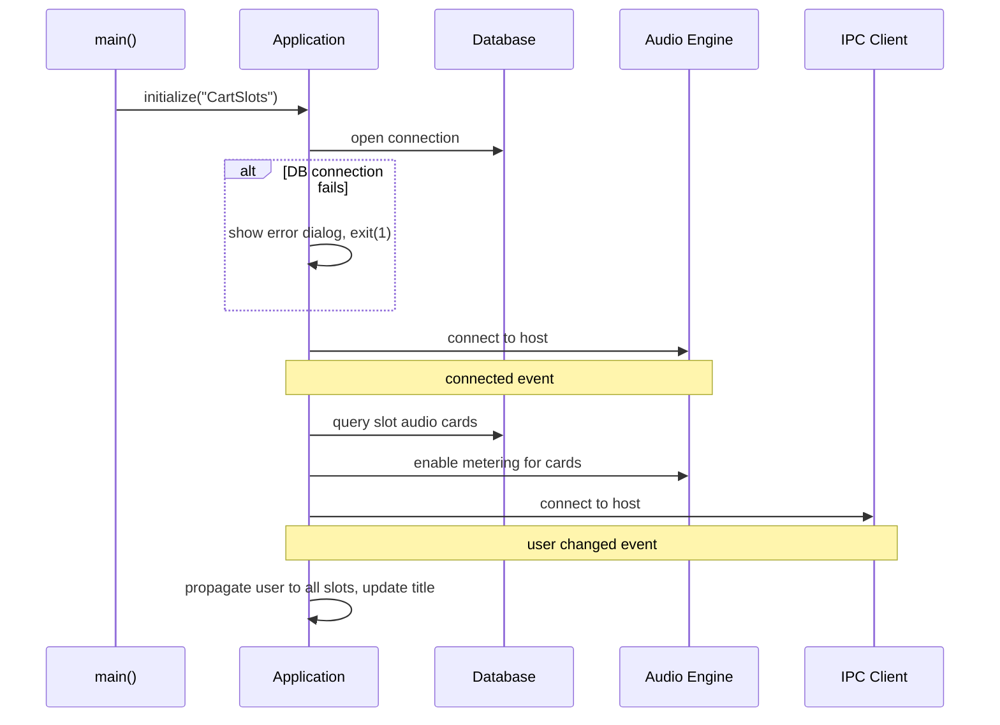
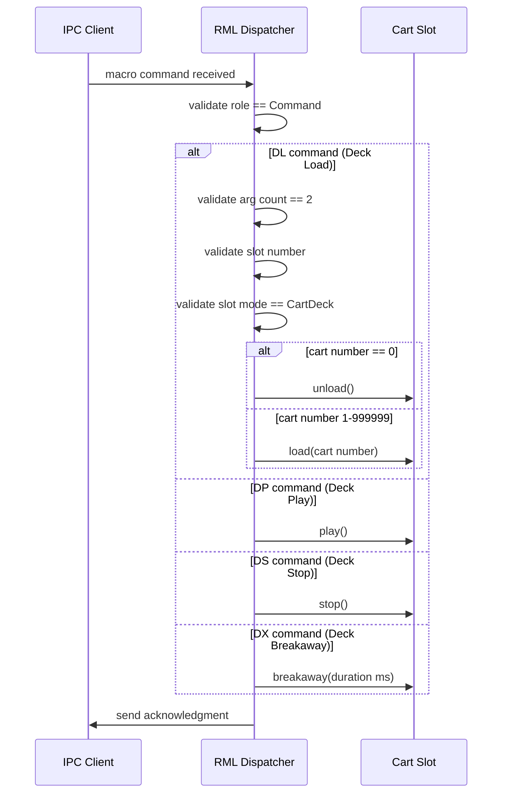
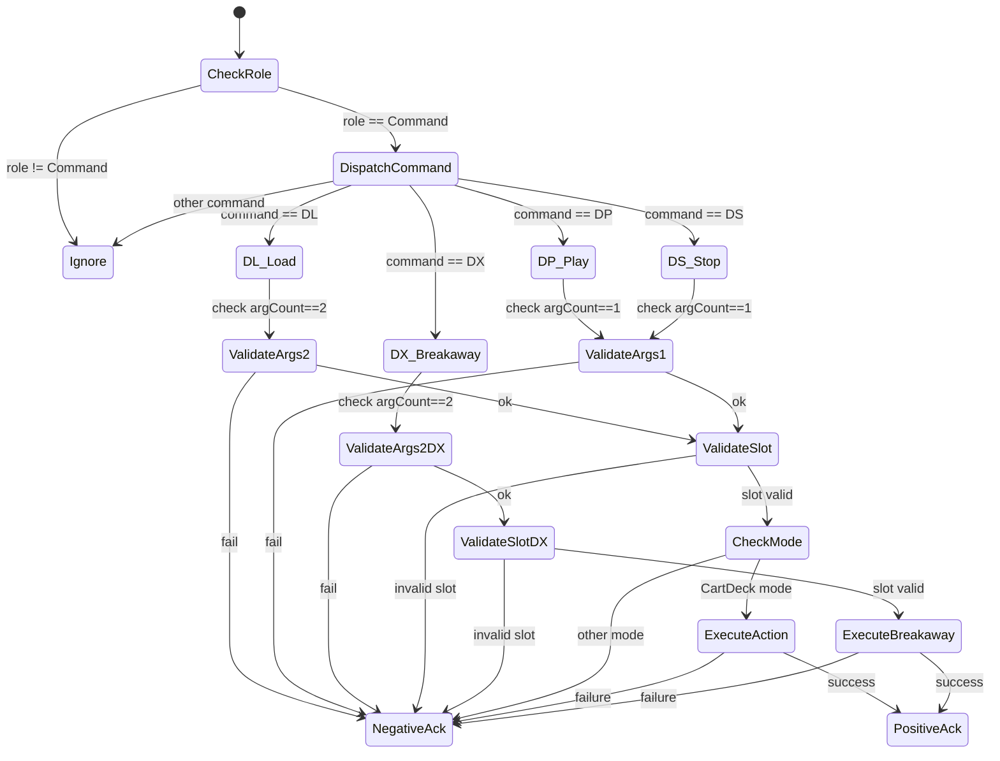
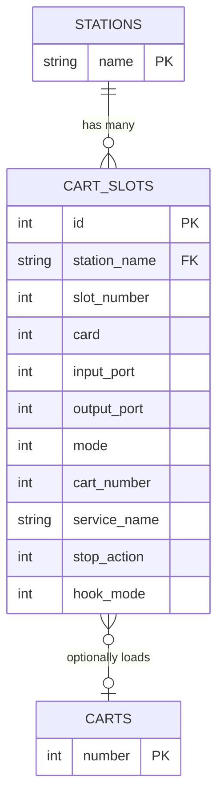

# Design Document

## Overview

**Purpose:** Cart Slots Viewer provides a grid-based audio playback interface for broadcast operators. Each cell in the grid is an independent audio deck that can load, play, stop, and configure audio carts. The application also accepts remote control commands via the Rivendell Macro Language (RML) protocol, enabling automated playout workflows.

**Users:** Broadcast operators interact with the grid directly via buttons on each slot. Automation systems and scheduled events control slots remotely via RML commands dispatched through the IPC layer. System administrators configure the slot grid layout and audio routing.

**Impact:** This application depends on the core library for all slot widgets, audio engine connectivity, IPC communication, dialog infrastructure, and database access. It is a consumer of station configuration, cart slot configuration, and cart content managed elsewhere in the system.

### Goals
- Present a configurable grid of cart slot widgets reflecting the station's slot layout
- Enable remote deck control (load, play, stop, breakaway) via RML macro commands with full argument validation
- Ensure clean startup with proper connection sequencing (database, audio engine, IPC) and clean shutdown with resource cleanup
- Support user context switching with live caption updates

### Non-Goals
- Cart slot widget implementation (provided by the core library)
- Slot configuration persistence (managed by the core library's SlotOptions active record)
- Audio engine internals (delegated to the Core Audio Engine daemon)
- Cart content management (handled by the library application)
- Platform-specific audio device configuration

## Visual Design Reference

All UI/UX implementation decisions (colors, typography, spacing, component appearance, interaction patterns) are defined in the design system files. **Agents implementing UI components MUST read these before writing any visual code.**

| Layer | File | Scope |
|-------|------|-------|
| Global | `.blah/steering/design.md` | Typography, base palette, spacing, z-index, accessibility baseline |
| Spec | `design-system/MASTER.md` | rdcartslots-specific tokens (colors, states, layout, component specs) |
| Page | `design-system/pages/*.md` | Per-view overrides |

**Hierarchy:** page override > spec MASTER > global steering. Higher layers only define differences.

<!-- NOTE: design-system/ files are generated by the ui-ux-pro-max skill in a separate step.
     If design-system/ does not yet exist, this section serves as a placeholder indicating
     that visual design generation is required before implementation. -->

## Architecture

### Architecture Pattern & Boundary Map



**Architecture Integration:**
- Selected pattern: Hexagonal (ports & adapters) per project steering
- Domain boundary: RML command validation is domain logic; UI grid layout is presentation
- The slot widget itself is a reusable component from the core library, exposed via a UI adapter
- All external connections (database, audio engine, IPC) go through outbound port interfaces

### Technology Stack

| Layer | Choice / Version | Role in Feature | Notes |
|-------|------------------|-----------------|-------|
| UI | Qt 6 / QML | Grid of slot widgets, shared dialogs | Replaces programmatic widget layout with declarative QML |
| Application | C++20 | RML command dispatch, slot grid orchestration | Pure domain logic for command validation |
| Data / Storage | Qt SQL (via adapter) | Read slot configuration (audio cards) | Minimal DB access -- config read only |
| Messaging / Events | Qt signals/slots | Audio engine events, IPC events, user change, meter updates | Event-driven reactive flow |
| Infrastructure | Audio Engine daemon, IPC daemon | Audio metering + playback, remote command reception, user auth | External daemons, connected at startup |

## System Flows

### Application Startup



### RML Command Processing (Deck Load)



### RML Command Dispatch State Machine



## Requirements Traceability

| Requirement | Summary | Components | Interfaces | Flows |
|-------------|---------|------------|------------|-------|
| 1.1 | Grid display from station config | SlotGridController, MainWindow | ICartSlotService | Startup |
| 1.2 | Dynamic window size | MainWindow | -- | Startup |
| 1.3 | Fixed window size policy | MainWindow | -- | -- |
| 1.4 | Column dividers | MainWindow | -- | -- |
| 1.5 | Audio meter updates | CartSlotWidget, AudioEngineAdapter | IAudioEngine | Startup |
| 1.6 | Enable metering on connect | SlotGridController | IAudioEngine, ICartSlotRepository | Startup |
| 1.7 | Shared dialogs | MainWindow, SharedDialogProvider | -- | -- |
| 2.1-2.11 | RML command validation and execution | RmlCommandDispatcher | IRmlCommandHandler, IIpcClient | RML Command Processing |
| 3.1 | DB required at startup | Application bootstrap | -- | Startup |
| 3.2 | Reject unknown CLI options | Application bootstrap | -- | Startup |
| 3.3 | Enable metering on audio connect | SlotGridController | IAudioEngine, ICartSlotRepository | Startup |
| 3.4 | User change propagation | SlotGridController | IIpcClient | Startup |
| 3.5 | Clean shutdown with resource cleanup | MainWindow, SlotGridController | -- | -- |

## Components and Interfaces

| Component | Domain/Layer | Intent | Req Coverage | Key Dependencies | Contracts |
|-----------|-------------|--------|--------------|------------------|-----------|
| MainWindow | UI | Grid view of cart slot widgets with column dividers | 1.1-1.4, 1.7, 3.5 | SlotGridController, CartSlotWidget | -- |
| CartSlotWidget | UI (from LIB) | Individual playback deck with start/load/options buttons and meters | 1.5, 1.7 | AudioEngine, SlotOptions | Event |
| SlotGridController | Application | Orchestrates slot creation, metering setup, user propagation | 1.1, 1.5, 1.6, 3.3, 3.4 | ICartSlotRepository, IAudioEngine, IIpcClient | Service |
| RmlCommandDispatcher | Application | Validates and dispatches RML deck commands to slots | 2.1-2.11 | IIpcClient | Service |
| SharedDialogProvider | UI | Provides shared instances of cart picker, slot config, cue editor, service picker | 1.7 | -- | -- |

### Application Layer

#### SlotGridController

| Field | Detail |
|-------|--------|
| Intent | Orchestrate slot grid initialization, audio metering setup, and user context propagation |
| Requirements | 1.1, 1.5, 1.6, 3.3, 3.4 |

**Responsibilities & Constraints**
- Create the configured number of cart slot widgets based on station settings (columns x rows)
- On audio engine connection: query slot repository for audio card assignments, enable metering
- On user change: propagate user identity to all slots, update window caption
- On meter timer tick: trigger meter update on all slots

**Dependencies**
- Outbound: ICartSlotRepository -- read slot audio card configuration (P0)
- Outbound: IAudioEngine -- enable metering for audio cards (P0)
- Outbound: IIpcClient -- receive user change events (P0)

**Contracts**: Service [x] / Event [x]

##### Service Interface
```
interface ICartSlotService {
    initializeGrid(columns: int, rows: int): list of CartSlotWidget
    onAudioEngineConnected(connected: bool): void
    onUserChanged(): void
}
```

##### Event Contract
- Subscribed events: audioEngineConnected(bool), userChanged(), meterTimerTick()
- Published events: none

#### RmlCommandDispatcher

| Field | Detail |
|-------|--------|
| Intent | Validate and dispatch incoming RML deck commands (DL, DP, DS, DX) to the appropriate cart slot |
| Requirements | 2.1-2.11 |

**Responsibilities & Constraints**
- Filter non-command RML messages (silently ignore)
- Validate argument count per command type (DL: 2, DP: 1, DS: 1, DX: 2)
- Validate slot number is within range
- Validate slot mode for DL/DP/DS (must be CartDeck mode)
- Execute the appropriate slot action (load/unload, play, stop, breakaway)
- Send positive or negative acknowledgment via IPC

**Dependencies**
- Outbound: IIpcClient -- receive RML commands, send acknowledgments (P0)
- Internal: slot widget list -- access individual slots by index (P0)

**Contracts**: Service [x]

##### Service Interface
```
interface IRmlCommandHandler {
    handleCommand(command: MacroCommand): void
}
```

- Preconditions: command object is well-formed
- Postconditions: acknowledgment sent (positive or negative)

### UI Layer

#### MainWindow

| Field | Detail |
|-------|--------|
| Intent | Display the cart slot grid and provide window-level behaviors (sizing, column dividers, close handling) |
| Requirements | 1.1-1.4, 1.7, 3.5 |

**Responsibilities & Constraints**
- Calculate window dimensions from column count and row count
- Arrange cart slot widgets in a grid layout
- Paint column divider visuals between slot columns
- On close: ensure all slot resources are released before exit

**Dependencies**
- Inbound: SlotGridController -- receives slot widgets and configuration
- Inbound: SharedDialogProvider -- cart picker, slot config, cue editor, service picker dialogs

## Data Models

### Domain Model

The application has minimal data ownership. It reads slot configuration at startup and delegates persistence to the core library.

- **CartSlot** (entity, owned by LIB): individual playback deck with mode, audio routing, and loaded cart
- **SlotOptions** (value object / active record, owned by LIB): persisted slot configuration (mode, stop action, default cart, audio card/port)
- **MacroCommand** (value object): an RML command with command type, arguments, and role

### Logical Data Model



**CART_SLOTS table:**

| Column | Type | Constraints | Description |
|--------|------|-------------|-------------|
| id | integer | PK, auto-increment | Unique slot record ID |
| station_name | string | FK -> STATIONS.name | Owning station |
| slot_number | integer | not null | Zero-based slot index |
| card | integer | | Audio card number |
| input_port | integer | | Audio input port |
| output_port | integer | | Audio output port |
| mode | integer | | Operating mode (0=CartDeck, 1=Breakaway) |
| default_mode | integer | | Default mode override (-1 = use mode) |
| hook_mode | integer | | Hook playback flag |
| default_hook_mode | integer | | Default hook override (-1 = use hook_mode) |
| stop_action | integer | | Stop behavior (0=Unload, 1=Recue, 2=Loop) |
| default_stop_action | integer | | Default stop override (-1 = use stop_action) |
| cart_number | integer | | Currently loaded cart number |
| default_cart_number | integer | | Default cart override (-1 = use cart_number, 0=none) |
| service_name | string | | Breakaway service name |

### Physical Data Model

The CART_SLOTS table schema originates from the Rivendell database (originally MySQL). The new implementation uses database-agnostic access through the persistence adapter. See the core library (LIB) specification for the complete schema registry.

## Error Handling

### Error Categories

**System Errors (Critical -- block startup):**
- Database connection failure at startup: display error dialog, terminate with exit code 1
- Unknown command-line option: display error dialog identifying the option, terminate with exit code 2

**Business Logic Errors (RML command validation):**
- Wrong argument count for deck command: send negative acknowledgment via IPC
- Invalid or out-of-range slot number: send negative acknowledgment via IPC
- Slot not in CartDeck mode for DL/DP/DS commands: send negative acknowledgment via IPC
- Non-command RML message: silently ignored (not an error)

### Error Strategy
- Startup errors are fatal and prevent the application from running
- RML validation errors produce negative acknowledgments but do not affect application stability
- No exceptions; errors propagated via signals carrying structured error info per project steering

## Testing Strategy

### E2E Tests
1. Application starts and displays a grid matching the station's configured slot dimensions
2. Loading a cart via DL command populates the target slot
3. Playing a slot via DP command starts audio playback
4. Stopping a slot via DS command stops audio playback
5. Closing the application cleans up all slot resources

### Integration Tests
1. Audio engine connection triggers metering enablement for configured audio cards
2. IPC user change event propagates to all slot widgets and updates the window title
3. RML command received via IPC is dispatched and acknowledged through the full stack

### Unit Tests
1. RML command dispatcher rejects non-command messages silently
2. DL command with wrong argument count produces negative acknowledgment
3. DL command with out-of-range slot number produces negative acknowledgment
4. DL command targeting non-CartDeck slot produces negative acknowledgment
5. DL command with cart number 0 triggers slot unload
6. DL command with valid cart number triggers slot load
7. DP command with valid slot starts playback
8. DS command with valid slot stops playback
9. DX command with valid slot and duration initiates breakaway
10. Window size calculation matches columns * slot_width by rows * slot_height
