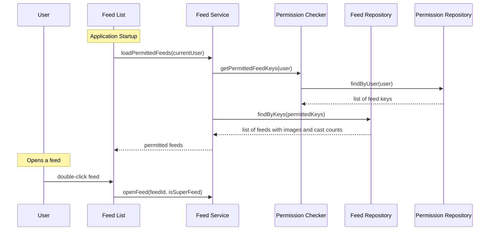
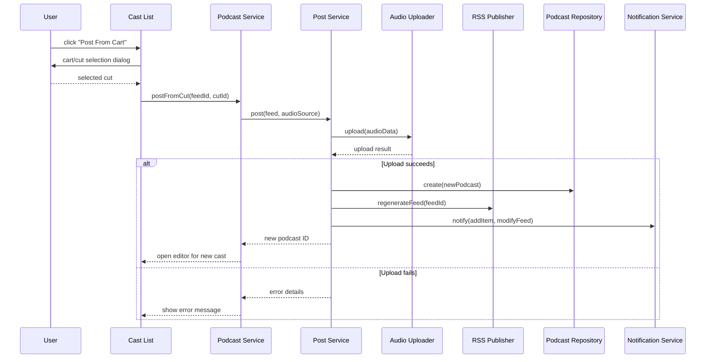
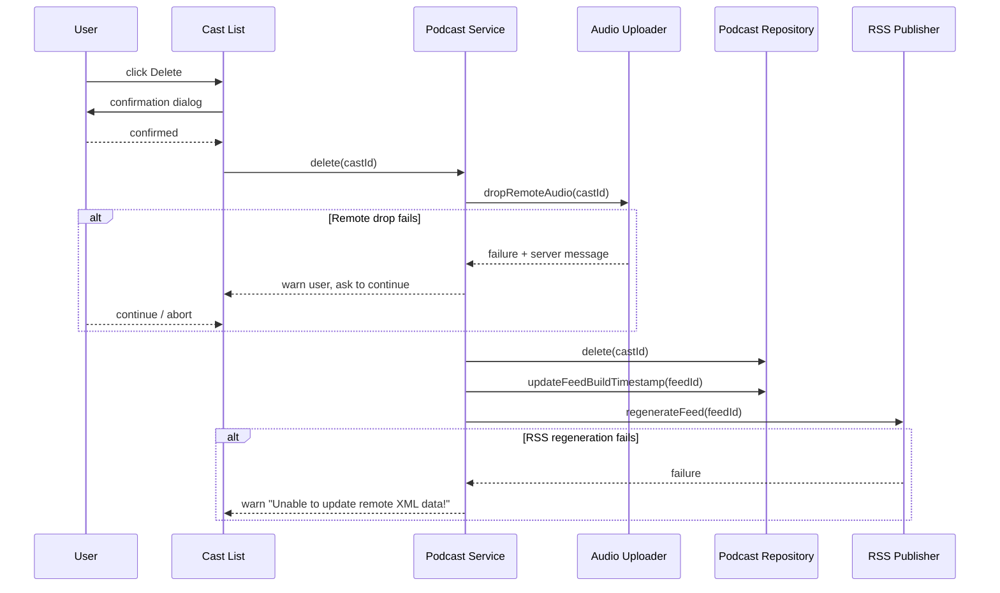
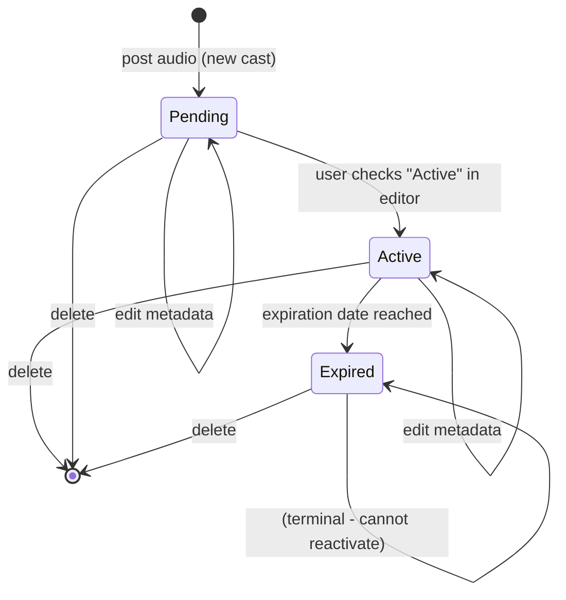
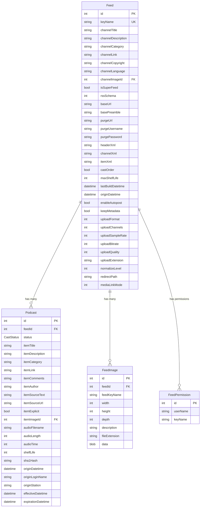

# Design Document — RDCastManager (Podcast Feed Manager)

---
**Purpose**: Provide sufficient detail to ensure implementation consistency across different implementers, preventing interpretation drift.

**Approach**:
- Include essential sections that directly inform implementation decisions
- Match detail level to feature complexity
- Use diagrams and tables over lengthy prose
---

## Overview

RDCastManager is the podcast feed management application in the Rivendell radio automation platform. It allows content managers to browse their permitted podcast feeds, manage individual cast (episode) items, edit metadata, and publish content from three source workflows: cart-based audio, uploaded files, and rendered broadcast logs. The application enforces role-based access control at the feed level and privilege-based restrictions at the operation level.

**Purpose**: This feature delivers podcast/RSS feed content management to content managers and program directors.
**Users**: Content managers publish and maintain podcast episodes; system administrators control access via feed permissions and podcast privileges.
**Impact**: Replaces the legacy RDCastManager application with a cross-platform, hexagonal-architecture implementation using modern C++20/Qt6.

### Goals

- Preserve all existing podcast management workflows (post from cart/file/log, edit, delete)
- Enforce feed-level access control and operation-level privilege checking
- Support superfeed (aggregated feed) read-only browsing
- Handle remote audio and RSS XML synchronization with graceful error recovery
- Provide cast lifecycle management (pending, active, expired)

### Non-Goals

- Feed configuration and creation (handled by the administration application)
- RSS schema editing and XML template management (admin responsibility)
- Audio encoding configuration (configured at the feed level in admin)
- Direct audio editing or waveform manipulation
- Podcast analytics or listener statistics

## Visual Design Reference

All UI/UX implementation decisions (colors, typography, spacing, component appearance, interaction patterns) are defined in the design system files. **Agents implementing UI components MUST read these before writing any visual code.**

| Layer | File | Scope |
|-------|------|-------|
| Global | `.blah/steering/design.md` | Typography, base palette, spacing, z-index, accessibility baseline |
| Spec | `design-system/MASTER.md` | rdcastmanager-specific tokens (colors, states, layout, component specs) |
| Page | `design-system/pages/*.md` | Per-view overrides |

**Hierarchy:** page override > spec MASTER > global steering. Higher layers only define differences.

<!-- NOTE: design-system/ files are generated by the ui-ux-pro-max skill in a separate step.
     If design-system/ does not yet exist, this section serves as a placeholder indicating
     that visual design generation is required before implementation. -->

## Architecture

### Architecture Pattern & Boundary Map

```mermaid
graph TD
    subgraph UI["UI Layer (QML)"]
        FeedListView["Feed List View"]
        CastListView["Cast List View"]
        CastEditorView["Cast Editor View"]
        RenderOptionsView["Render Options View"]
        LogSelectorView["Log Selector View"]
    end

    subgraph Adapters["Adapter Layer"]
        FeedListModel["FeedListModel (QAbstractListModel)"]
        CastListModel["CastListModel (QAbstractListModel)"]
        CastEditorController["CastEditorController"]
        RenderController["RenderController"]
        LogEventModel["LogEventModel (QAbstractTableModel)"]
        SqlFeedRepo["SqlFeedRepository"]
        SqlPodcastRepo["SqlPodcastRepository"]
        SqlPermRepo["SqlFeedPermissionRepository"]
        RssPublisher["RssPublishAdapter"]
        AudioUploader["AudioUploadAdapter"]
    end

    subgraph Ports["Port Layer (Interfaces)"]
        IFeedService["IFeedService (inbound)"]
        IPodcastService["IPodcastService (inbound)"]
        IFeedRepo["IFeedRepository (outbound)"]
        IPodcastRepo["IPodcastRepository (outbound)"]
        IPermRepo["IFeedPermissionRepository (outbound)"]
        IRssPublisher["IRssPublisher (outbound)"]
        IAudioUploader["IAudioUploader (outbound)"]
        INotification["INotificationService (outbound)"]
    end

    subgraph Domain["Domain Layer"]
        FeedEntity["Feed"]
        PodcastEntity["Podcast"]
        FeedPermEntity["FeedPermission"]
        FeedImageVO["FeedImage"]
        CastStatusVO["CastStatus"]
        PostService["PostService"]
        PermissionService["PermissionChecker"]
    end

    FeedListView --> FeedListModel
    CastListView --> CastListModel
    CastEditorView --> CastEditorController
    RenderOptionsView --> RenderController
    LogSelectorView --> LogEventModel

    FeedListModel --> IFeedService
    CastListModel --> IPodcastService
    CastEditorController --> IPodcastService
    RenderController --> IPodcastService

    IFeedService --> FeedEntity
    IFeedService --> PermissionService
    IPodcastService --> PodcastEntity
    IPodcastService --> PostService

    SqlFeedRepo -.-> IFeedRepo
    SqlPodcastRepo -.-> IPodcastRepo
    SqlPermRepo -.-> IPermRepo
    RssPublisher -.-> IRssPublisher
    AudioUploader -.-> IAudioUploader

    PostService --> IFeedRepo
    PostService --> IPodcastRepo
    PostService --> IRssPublisher
    PostService --> IAudioUploader
    PermissionService --> IPermRepo
```



**Architecture Integration**:
- Selected pattern: Hexagonal architecture (ports and adapters) per project steering
- Domain boundaries: Feed management, podcast lifecycle, permission checking, and content posting are separate domain concerns
- Existing patterns preserved: Qt parent-child ownership for UI objects, signal/slot for error propagation
- Steering compliance: Domain layer has zero Qt dependencies; all framework usage confined to adapters

### Technology Stack

| Layer | Choice / Version | Role in Feature | Notes |
|-------|------------------|-----------------|-------|
| Frontend / UI | Qt 6 / QML | Declarative views for feed list, cast list, editor, render dialogs | Dark theme per design steering |
| Backend / Services | C++20 | Domain logic, use case orchestration | Pure C++, no Qt in domain |
| Data / Storage | Qt SQL (adapter) | Feed, podcast, permission persistence | Via repository ports |
| Networking | Qt Network (adapter) | RSS XML publishing, audio upload | Via publisher/uploader ports |
| Events | Qt signals/slots | Cross-thread notification, UI updates | QueuedConnection for cross-thread |
| Infrastructure | QMake (Qt 6) | Build system | Single project, subdirs template |

## System Flows

### Main Application Flow



### Cast Posting Flow



### Cast Deletion Flow



### Cast Lifecycle State Machine



## Requirements Traceability

| Requirement | Summary | Components | Interfaces | Flows |
|-------------|---------|------------|------------|-------|
| 1 | Feed list and access control | FeedListModel, PermissionChecker | IFeedRepository, IFeedPermissionRepository | Main Application Flow |
| 2 | Feed navigation and actions | FeedListModel, FeedListView | IFeedService | Main Application Flow |
| 3 | Cast item list management | CastListModel, CastListView | IPodcastService, IPodcastRepository | Main Application Flow |
| 4 | Superfeed restrictions | CastListView, PermissionChecker | IPodcastService | — |
| 5 | Podcast privilege enforcement | PermissionChecker, CastListView | IFeedPermissionRepository | — |
| 6 | Post from cart | PostService, CastListView | IAudioUploader, IPodcastRepository, IRssPublisher | Cast Posting Flow |
| 7 | Post from file | PostService, CastListView | IAudioUploader, IPodcastRepository, IRssPublisher | Cast Posting Flow |
| 8 | Post from rendered log | PostService, RenderController, LogEventModel | IAudioUploader, IPodcastRepository, IRssPublisher | Cast Posting Flow |
| 9 | Cast item editing | CastEditorController | IPodcastService, IRssPublisher | — |
| 10 | Cast item deletion | CastListView, PodcastService | IAudioUploader, IPodcastRepository, IRssPublisher | Cast Deletion Flow |
| 11 | App initialization and errors | Application startup | IFeedService | Main Application Flow |

## Components and Interfaces

| Component | Domain/Layer | Intent | Req Coverage | Key Dependencies | Contracts |
|-----------|--------------|--------|--------------|------------------|-----------|
| Feed | Domain | Feed entity with channel metadata | 1, 2 | — | — |
| Podcast | Domain | Podcast episode entity with lifecycle | 3, 9, 10 | Feed | State |
| FeedPermission | Domain | Feed access permission value object | 1, 5 | — | — |
| FeedImage | Domain | Feed/podcast image value object | 1, 3 | Feed | — |
| CastStatus | Domain | Cast lifecycle status value object | 3, 9 | — | — |
| PermissionChecker | Domain | Feed/privilege access logic | 1, 4, 5 | FeedPermission | Service |
| PostService | Domain | Orchestrates posting workflow | 6, 7, 8 | IAudioUploader, IRssPublisher, IPodcastRepository | Service |
| FeedListModel | Adapter/UI | Exposes feed list to QML | 1, 2 | IFeedService | State |
| CastListModel | Adapter/UI | Exposes cast list to QML with filtering | 3, 4, 5 | IPodcastService | State |
| CastEditorController | Adapter/UI | Bridges editor view to podcast service | 9 | IPodcastService | Service |
| RenderController | Adapter/UI | Manages log render workflow | 8 | IPodcastService | Service |
| LogEventModel | Adapter/UI | Table model for log event selection | 8 | — | State |
| SqlFeedRepository | Adapter/Persistence | SQL implementation of feed repo | 1, 2 | Qt SQL | — |
| SqlPodcastRepository | Adapter/Persistence | SQL implementation of podcast repo | 3, 6, 7, 8, 9, 10 | Qt SQL | — |
| SqlFeedPermissionRepository | Adapter/Persistence | SQL implementation of perm repo | 1, 5 | Qt SQL | — |
| RssPublishAdapter | Adapter/Network | RSS XML generation and upload | 6, 7, 8, 9, 10 | Qt Network | — |
| AudioUploadAdapter | Adapter/Network | Audio file upload and remote drop | 6, 7, 8, 10 | Qt Network | — |

### Domain Layer

#### Feed

| Field | Detail |
|-------|--------|
| Intent | Represents a podcast feed with channel metadata, upload configuration, and superfeed status |
| Requirements | 1, 2, 4 |

**Responsibilities & Constraints**
- Holds channel metadata (title, description, category, language, copyright, image)
- Knows its own superfeed status to enforce read-only policy
- Holds upload configuration (format, channels, sample rate, bitrate, extension)
- Computes public URL from base URL and key name

#### Podcast

| Field | Detail |
|-------|--------|
| Intent | Represents a single podcast episode with lifecycle state management |
| Requirements | 3, 9, 10 |

**Responsibilities & Constraints**
- Manages cast lifecycle: Pending -> Active -> Expired
- Validates date constraints (expiration after effective, expiration in future)
- Holds episode metadata (title, author, category, link, description, explicit flag, image, comments URL)
- Tracks origin information (login name, station, datetime)

**Contracts**: State [x]

##### State Management
- State model: `CastStatus` enum with values: Pending, Active, Expired
- Active requires explicit user activation via "Active" checkbox
- Expired is terminal — cannot return to Active or Pending
- Status display: green (active, effective now/past), blue (active, future effective), red (pending), white (expired)

#### PermissionChecker

| Field | Detail |
|-------|--------|
| Intent | Evaluates feed access and podcast operation privileges for the current user |
| Requirements | 1, 4, 5 |

**Contracts**: Service [x]

##### Service Interface
```
interface PermissionChecker:
  getPermittedFeedKeys(userName: string) -> list of string
  canAddPodcast(userName: string) -> bool
  canEditPodcast(userName: string) -> bool
  canDeletePodcast(userName: string) -> bool
```

#### PostService

| Field | Detail |
|-------|--------|
| Intent | Orchestrates the posting workflow: upload audio, create podcast record, regenerate RSS |
| Requirements | 6, 7, 8 |

**Dependencies**
- Outbound: IAudioUploader — audio upload (P0)
- Outbound: IPodcastRepository — podcast persistence (P0)
- Outbound: IRssPublisher — RSS XML regeneration (P0)
- Outbound: INotificationService — cross-application notifications (P1)

**Contracts**: Service [x]

##### Service Interface
```
interface PostService:
  postFromCut(feedId: int, cutId: int) -> Result<int, PostError>
  postFromFile(feedId: int, filePath: string) -> Result<int, PostError>
  postFromLog(feedId: int, logName: string, startTime: time, ignoreStops: bool, startLine: int, endLine: int) -> Result<int, PostError>
```

### Adapter Layer — UI

#### FeedListModel

| Field | Detail |
|-------|--------|
| Intent | Exposes permitted feed list to QML with roles for key name, title, cast counts, URL, image |
| Requirements | 1, 2 |

**Responsibilities & Constraints**
- Implements QAbstractListModel for QML consumption
- Filters feeds by current user's permissions
- Refreshes on user change and feed notifications
- Provides feed image as role data (32x32 thumbnails)

#### CastListModel

| Field | Detail |
|-------|--------|
| Intent | Exposes filtered cast item list to QML with status indicators and search |
| Requirements | 3, 4, 5 |

**Responsibilities & Constraints**
- Implements QAbstractListModel with roles for all cast columns
- Supports text filter and active-only toggle
- Computes status indicator color from cast status and effective date
- Disables modification operations for superfeeds and privilege-restricted users

#### CastEditorController

| Field | Detail |
|-------|--------|
| Intent | Bridges the cast editor view to the podcast service, handles validation |
| Requirements | 9 |

**Responsibilities & Constraints**
- Loads podcast metadata into QML-exposed properties
- Validates expiration date constraints before saving
- Emits error signals for validation failures
- Triggers conditional RSS regeneration on save

#### RenderController

| Field | Detail |
|-------|--------|
| Intent | Manages the log render options workflow including event range selection |
| Requirements | 8 |

**Responsibilities & Constraints**
- Configures start time mode (from log or specified)
- Configures stop handling
- Delegates event range selection to LogEventModel
- Validates at least one event is selected

#### LogEventModel

| Field | Detail |
|-------|--------|
| Intent | Table model displaying log events for range selection during render |
| Requirements | 8 |

**Responsibilities & Constraints**
- Implements QAbstractTableModel with columns: start time, transition, cart, group, length, title, artist, client, agency, label, source, ext data, line ID, count
- Supports multi-row contiguous selection
- Returns min/max selected rows as start/end line range

### Adapter Layer — Persistence

#### SqlFeedRepository

| Field | Detail |
|-------|--------|
| Intent | SQL implementation of feed data access |
| Requirements | 1, 2 |

**Contracts**: Service [x]

##### Service Interface
```
interface IFeedRepository:
  findByKeys(keys: list of string) -> list of Feed
  findById(id: int) -> optional<Feed>
  getActiveCastCount(feedId: int) -> int
  getTotalCastCount(feedId: int) -> int
  updateLastBuildDatetime(feedId: int, datetime: datetime) -> void
```

#### SqlPodcastRepository

| Field | Detail |
|-------|--------|
| Intent | SQL implementation of podcast data access |
| Requirements | 3, 6, 7, 8, 9, 10 |

**Contracts**: Service [x]

##### Service Interface
```
interface IPodcastRepository:
  findByFeed(feedId: int, filter: optional<string>, activeOnly: bool) -> list of Podcast
  findById(id: int) -> optional<Podcast>
  create(podcast: Podcast) -> int
  update(podcast: Podcast) -> void
  delete(id: int) -> void
```

### Adapter Layer — Network

#### RssPublishAdapter

| Field | Detail |
|-------|--------|
| Intent | Generates and uploads RSS XML to the configured remote server |
| Requirements | 6, 7, 8, 9, 10 |

**Contracts**: Service [x]

##### Service Interface
```
interface IRssPublisher:
  regenerateFeed(feedId: int) -> Result<void, PublishError>
```

#### AudioUploadAdapter

| Field | Detail |
|-------|--------|
| Intent | Uploads audio content and manages remote audio file lifecycle |
| Requirements | 6, 7, 8, 10 |

**Contracts**: Service [x]

##### Service Interface
```
interface IAudioUploader:
  uploadFromCut(feedId: int, cutId: int, progressCallback: function) -> Result<AudioUploadResult, UploadError>
  uploadFromFile(feedId: int, filePath: string, progressCallback: function) -> Result<AudioUploadResult, UploadError>
  uploadFromRenderedLog(feedId: int, logName: string, renderParams: RenderParams, progressCallback: function) -> Result<AudioUploadResult, UploadError>
  dropRemoteAudio(castId: int) -> Result<void, DropError>
```

## Data Models

### Domain Model

**Aggregates:**
- **Feed** (aggregate root): owns Podcasts, FeedImages, referenced by FeedPermissions
- **Podcast**: child of Feed, represents a single episode with lifecycle

**Value Objects:**
- CastStatus (Pending, Active, Expired)
- FeedImage (width, height, depth, description, extension, binary data)
- FeedPermission (userName, keyName)

**Domain Events:**
- FeedItemAdded(feedId, podcastId)
- FeedItemModified(feedId, podcastId)
- FeedItemDeleted(feedId, podcastId)
- FeedModified(feedId)

### Logical Data Model



### Physical Data Model

Reference tables: FEEDS, PODCASTS, FEED_PERMS, FEED_IMAGES as defined in the Rivendell schema. Migration from the legacy MySQL schema to the target database is handled by the MLI (MairList Integration) artifact's schema registry.

Key indexes:
- FEEDS: KEY_NAME (unique), CHANNEL_IMAGE_ID
- PODCASTS: (FEED_ID, ORIGIN_DATETIME) composite
- FEED_PERMS: USER_NAME, KEY_NAME
- FEED_IMAGES: FEED_ID, FEED_KEY_NAME

## Error Handling

### Error Categories and Responses

**User Errors (validation):**
- Expiration before air date: field-level validation message, editor stays open
- Expiration in past: field-level validation message, editor stays open
- No log events selected: informational message, selection dialog stays open

**System Errors (infrastructure):**
- Application config load failure: critical error dialog, application exits
- Unknown command-line option: critical error dialog, application exits
- Temporary directory creation failure: warning, operation may be degraded

**Business Logic Errors (remote operations):**
- Post failure (cart/file/log): warning with server error details, operation aborted
- Remote audio drop failure: warning with server message, user decides whether to continue local deletion
- Remote RSS XML regeneration failure: warning, local state is already updated

### Error Strategy

All errors are communicated via dedicated error signals carrying structured error information (error code, context, severity). No exceptions are used. The UI layer subscribes to error signals and displays appropriate dialogs based on severity:
- Critical: modal error dialog, blocks further operation
- Warning: modal warning dialog with optional user decision
- Information: modal information dialog, informational only

## Testing Strategy

### Unit Tests
- PermissionChecker: verify feed filtering by user permissions, privilege flag evaluation
- Podcast validation: expiration date constraints, lifecycle state transitions
- PostService: orchestration logic with mocked adapters
- CastStatus: state machine transitions (Pending -> Active -> Expired, terminal state)

### Integration Tests
- SqlFeedRepository: CRUD against real database with feed/image/permission data
- SqlPodcastRepository: CRUD with filter and active-only queries
- Post workflow end-to-end: cart selection through podcast creation and RSS regeneration
- Delete workflow: confirmation, remote drop, local delete, RSS regeneration

### E2E Tests
- Feed list loads only permitted feeds for current user
- Post from cart: select cut, verify progress dialog, verify editor opens
- Post from file: select file, verify upload and editor
- Post from log: select log, configure render options, verify event selection
- Edit cast: modify metadata, verify validation errors, verify save
- Delete cast: confirm, handle remote drop failure, verify list update
- Superfeed restrictions: verify all modification buttons disabled
- Privilege enforcement: verify button states match user privileges
- Filter and active toggle: verify cast list filtering behavior
