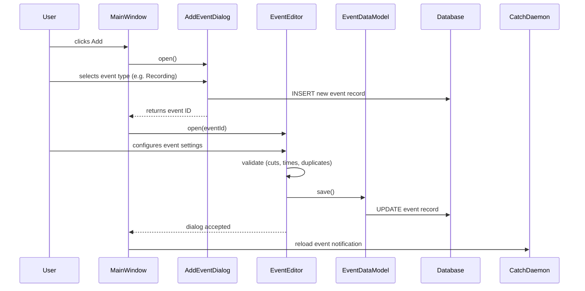
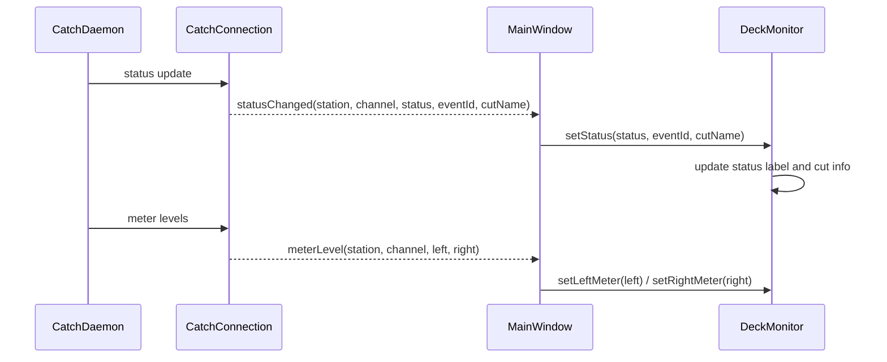
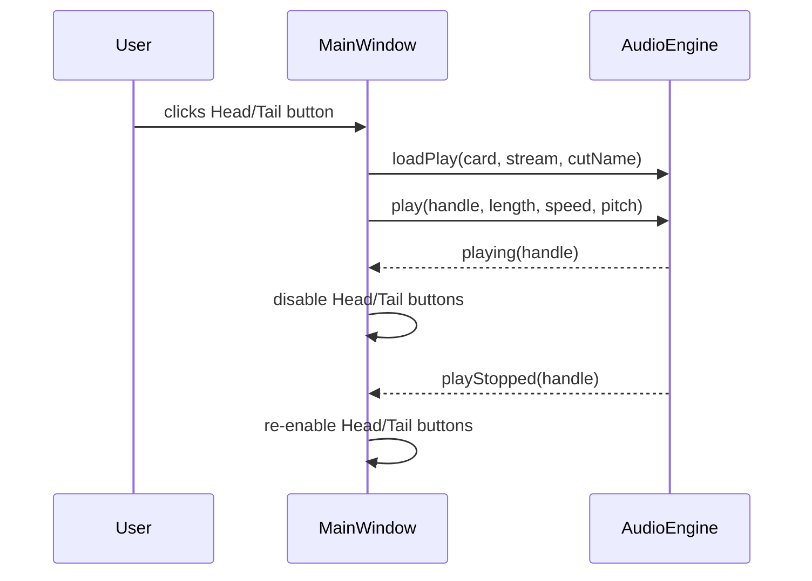
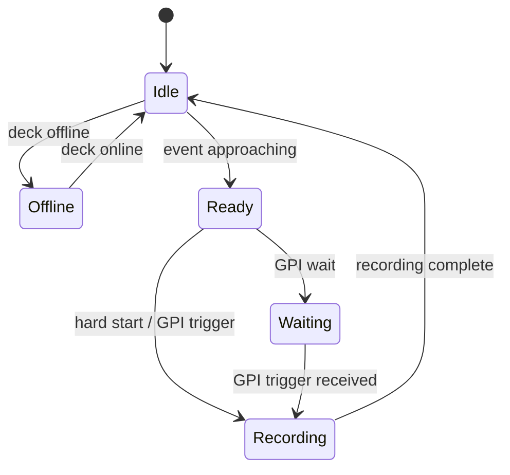
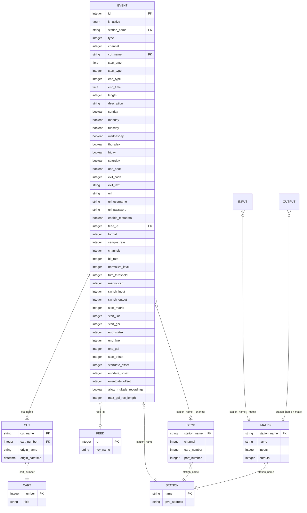

# Design Document

## Overview

**Purpose:** RDCatch (Catch Event Manager) delivers scheduled automation event management to broadcast operators. It provides a unified interface for creating, editing, monitoring, and auditing six types of time-based automation events: audio recording, audio playout, file download, file upload, macro cart execution, and audio switcher routing.

**Users:** Broadcast operators and station engineers use this application during daily operations to schedule and monitor all automated capture, distribution, and routing tasks across one or more stations in a Rivendell radio automation network.

**Impact:** RDCatch serves as the primary interface to the catch daemon (rdcatchd) on each station. It reads and writes the central RECORDINGS table and provides real-time monitoring via persistent TCP connections to catch daemons. Changes affect scheduled automation across the entire station network.

### Goals
- Provide a single management interface for all six scheduled event types
- Real-time deck status monitoring with audio level metering
- Flexible time-based and GPI-triggered scheduling
- Multi-station connectivity with heartbeat monitoring
- Event audition for pre-verification of cut assignments
- Report generation for schedule documentation

### Non-Goals
- Direct audio engine control (delegated to the audio engine service)
- Deck hardware configuration (managed in the admin application)
- Log/playlist management (separate application domain)
- Audio file editing or waveform display
- User/permission management

## Visual Design Reference

All UI/UX implementation decisions (colors, typography, spacing, component appearance, interaction patterns) are defined in the design system files. **Agents implementing UI components MUST read these before writing any visual code.**

| Layer | File | Scope |
|-------|------|-------|
| Global | `.blah/steering/design.md` | Typography, base palette, spacing, z-index, accessibility baseline |
| Spec | `design-system/MASTER.md` | rdcatch-specific tokens (colors, states, layout, component specs) |
| Page | `design-system/pages/*.md` | Per-view overrides |

**Hierarchy:** page override > spec MASTER > global steering. Higher layers only define differences.

<!-- NOTE: design-system/ files are generated by the ui-ux-pro-max skill in a separate step.
     If design-system/ does not yet exist, this section serves as a placeholder indicating
     that visual design generation is required before implementation. -->

## Architecture

### Architecture Pattern & Boundary Map

```mermaid
graph TD
    subgraph "Catch Event Manager (CTH)"
        subgraph "UI Layer"
            MW[Main Window]
            DM[Deck Monitor Widgets]
            ER[Recording Editor]
            ED[Download Editor]
            EU[Upload Editor]
            EP[Playout Editor]
            ES[Switch Event Editor]
            EC[Cart Event Editor]
            AR[Add Event Dialog]
            LR[Report Generator]
        end

        subgraph "Application Logic"
            EL[Event List Controller]
            FL[Filter Logic]
            AU[Audition Controller]
            SC[Scroll Controller]
        end
    end

    subgraph "Core Library (LIB)"
        CC[Catch Connection Service]
        REC[Recording Data Model]
        DK[Deck Data Model]
        CT[Cart Data Model]
        MX[Matrix Data Model]
        AE[Audio Engine Client]
        IPC[IPC Client]
        AP[Audio Port Config]
    end

    subgraph "External Services"
        CD[Catch Daemon - per station]
        IPCD[IPC Daemon]
        CAED[Audio Engine Daemon]
        DB[(Database)]
    end

    MW --> EL
    MW --> FL
    MW --> AU
    MW --> SC
    MW --> DM
    EL --> CC
    EL --> REC
    DM --> CC
    AU --> AE
    ER --> REC
    ER --> DK
    ED --> REC
    EU --> REC
    EP --> REC
    EP --> DK
    ES --> MX
    EC --> CT

    CC --> CD
    IPC --> IPCD
    AE --> CAED
    REC --> DB
    DK --> DB
    MX --> DB
end
```

**Architecture Integration:**
- Selected pattern: Event-driven client with multi-daemon connectivity
- Domain boundaries: UI dialogs per event type, shared event list controller, centralized daemon communication
- Existing patterns preserved: Active Record for data persistence, event bus for real-time updates
- New components rationale: Each event type editor is isolated to contain its specific validation logic

### Technology Stack

| Layer | Choice | Role | Notes |
|-------|--------|------|-------|
| Frontend | SPA (per steering) | Main window + modal dialogs | Dark theme, broadcast-optimized |
| Backend/Services | Per steering tech stack | REST API + WebSocket for real-time | Event CRUD + daemon proxy |
| Data/Storage | Relational database | RECORDINGS table + reference tables | Shared with other modules |
| Messaging/Events | WebSocket | Real-time deck status, meters, heartbeat | Replaces TCP catch connections |
| Infrastructure | Per steering | Daemon connectivity layer | Multi-station support |

## System Flows

### Event Creation Flow



### Real-Time Status Monitoring Flow



### Audition Playback Flow



### Deck Status State Machine



### Event Exit Code State Machine

```mermaid
stateDiagram-v2
    [*] --> Ok : successful completion
    [*] --> Short : recording too short
    [*] --> LowLevel : audio level too low
    [*] --> HighLevel : audio level too high
    [*] --> Interrupted : user aborted
    [*] --> DeviceBusy : deck already in use
    [*] --> NoCut : no cut assigned
    [*] --> UnknownFormat : unsupported format
    [*] --> ServerError : server communication error
    [*] --> InternalError : internal error
    [*] --> Downloading : download in progress
    [*] --> Uploading : upload in progress
    [*] --> RecordActive : recording active
    [*] --> PlayActive : playout active
    [*] --> Waiting : waiting for trigger

    state "Normal" as normal {
        Ok
        Downloading
        Uploading
        RecordActive
        PlayActive
        Waiting
    }
    state "Error" as error {
        Short
        LowLevel
        HighLevel
        Interrupted
        DeviceBusy
        NoCut
        UnknownFormat
        ServerError
        InternalError
    }
```



## Requirements Traceability

| Requirement | Summary | Components | Interfaces | Flows |
|-------------|---------|------------|------------|-------|
| 1 | Event List Management | MainWindow, EventListController | Event CRUD API | Event Creation Flow |
| 2 | Event Filtering | MainWindow, FilterLogic | Filter state | - |
| 3 | Recording Event Config | RecordingEditor | Event CRUD API, Deck API | Event Creation Flow |
| 4 | Download Event Config | DownloadEditor | Event CRUD API | Event Creation Flow |
| 5 | Upload Event Config | UploadEditor | Event CRUD API, Feed API | Event Creation Flow |
| 6 | Playout Event Config | PlayoutEditor | Event CRUD API, Deck API | Event Creation Flow |
| 7 | Switch Event Config | SwitchEventEditor | Event CRUD API, Matrix API | Event Creation Flow |
| 8 | Cart/Macro Event Config | CartEventEditor | Event CRUD API, Cart API | Event Creation Flow |
| 9 | Duplicate Event Prevention | All Editors | Event query API | - |
| 10 | Real-Time Deck Monitoring | DeckMonitor, CatchConnection | WebSocket events | Status Monitoring Flow |
| 11 | Daemon Connectivity | MainWindow, CatchConnection | WebSocket, heartbeat | - |
| 12 | Event Audition | MainWindow, AuditionController | Audio Engine API | Audition Flow |
| 13 | Event Reports | ReportGenerator | Event query API | - |
| 14 | Save As New | All Editors | Event CRUD API | Event Creation Flow |

## Components and Interfaces

| Component | Domain/Layer | Intent | Req Coverage | Key Dependencies | Contracts |
|-----------|--------------|--------|--------------|-----------------|-----------|
| MainWindow | UI | Central event list and deck monitoring host | 1, 2, 10, 11, 12 | CatchConnection, AudioEngine | Event, State |
| DeckMonitor | UI | Real-time deck status and meter display | 10 | CatchConnection | Event |
| RecordingEditor | UI | Recording event configuration dialog | 3, 9 | EventDataModel, DeckConfig | Service |
| DownloadEditor | UI | Download event configuration dialog | 4, 9 | EventDataModel | Service |
| UploadEditor | UI | Upload event configuration dialog | 5, 9 | EventDataModel, FeedConfig | Service |
| PlayoutEditor | UI | Playout event configuration dialog | 6, 9 | EventDataModel, DeckConfig | Service |
| SwitchEventEditor | UI | Switch event configuration dialog | 7, 9 | EventDataModel, MatrixConfig | Service |
| CartEventEditor | UI | Cart/macro event configuration dialog | 8, 9 | EventDataModel, CartConfig | Service |
| AddEventDialog | UI | Event type selection dialog | 1 | DeckConfig | - |
| ReportGenerator | UI | Event report generation dialog | 13 | EventDataModel | Service |
| EventListController | Logic | Event CRUD orchestration and list refresh | 1, 14 | EventDataModel, CatchConnection | Service |
| FilterLogic | Logic | Multi-criteria event list filtering | 2 | - | State |
| AuditionController | Logic | Audio preview playback control | 12 | AudioEngine | Service |
| CatchConnection | Integration | Per-station daemon communication | 10, 11 | Catch Daemon (external) | Event |
| EventDataModel | Data | Event persistence (Active Record) | 1-9, 13, 14 | Database | Service |

### UI Layer

#### MainWindow

| Field | Detail |
|-------|--------|
| Intent | Host the event list, deck monitors, filter bar, action buttons, and audition controls |
| Requirements | 1, 2, 10, 11, 12 |

**Responsibilities & Constraints**
- Owns the event list view with color-coded rows based on deck/event status
- Manages dynamic deck monitor widget creation (one per configured deck per station)
- Coordinates filter state across four filter dimensions (active, today, day-of-week, event type)
- Handles window geometry persistence (save/restore position and size)
- Manages auto-scroll to next scheduled event
- Displays current time clock and next event information

**Dependencies**
- Inbound: CatchConnection -- real-time status, meter, heartbeat events (P0)
- Inbound: AudioEngine -- audition playback state events (P1)
- Outbound: EventListController -- CRUD operations (P0)
- Outbound: CatchConnection -- event reload notifications (P0)

**Contracts:** Event [x] / State [x]

##### Event Contract
- Subscribed events: statusChanged, monitorChanged, connected, meterLevel, eventUpdated, eventPurged, deckEventSent, heartbeatFailed, playing, playStopped
- Published events: abort(deckIndex), monitor(deckIndex)
- Ordering: Status events processed in order per station/channel

##### State Management
- State model: Filter state (4 dimensions), scroll state, audition state, connection states per station
- Persistence: Window geometry saved to config file
- Concurrency: Single-threaded UI with async daemon event processing

#### DeckMonitor

| Field | Detail |
|-------|--------|
| Intent | Display real-time status, audio meters, and control buttons for a single deck |
| Requirements | 10 |

**Responsibilities & Constraints**
- Displays station name, channel, status label, cut info, and event description
- Renders left and right audio level meters
- Provides Abort and Monitor toggle buttons
- Status colors: white (idle), cyan (ready), magenta (waiting), green (recording), pink (offline/error)

**Dependencies**
- Inbound: MainWindow -- status updates, meter levels (P0)
- Outbound: MainWindow -- abort and monitor button click events (P0)

**Contracts:** Event [x]

##### Event Contract
- Published events: abortClicked, monitorClicked
- Subscribed events: setStatus, setEvent, setLeftMeter, setRightMeter, setMonitor

### Logic Layer

#### EventListController

| Field | Detail |
|-------|--------|
| Intent | Orchestrate event CRUD operations and list data refresh |
| Requirements | 1, 14 |

**Responsibilities & Constraints**
- Build filtered query joining events with cuts and feeds data
- Refresh individual rows or entire list on external updates
- Route edit requests to appropriate event type editor
- Handle Save As New by creating new records with cloned settings

**Dependencies**
- Outbound: EventDataModel -- persistence (P0)
- Outbound: CatchConnection -- reload notifications (P0)

**Contracts:** Service [x]

##### Service Interface
```
interface EventListService {
  listEvents(filters: EventFilters): Result<EventRow[], QueryError>;
  addEvent(type: EventType): Result<EventId, CreateError>;
  deleteEvent(id: EventId): Result<void, DeleteError>;
  refreshEvent(id: EventId): Result<EventRow, QueryError>;
}
```

#### FilterLogic

| Field | Detail |
|-------|--------|
| Intent | Apply multi-dimensional client-side filtering to the event list |
| Requirements | 2 |

**Responsibilities & Constraints**
- Four filter dimensions combined with AND logic: active-only, today-only, day-of-week, event type
- Filtering operates client-side by showing/hiding list items
- Filter state is not persisted between sessions

### Integration Layer

#### CatchConnection

| Field | Detail |
|-------|--------|
| Intent | Maintain persistent connection to a catch daemon on a remote station for real-time status |
| Requirements | 10, 11 |

**Responsibilities & Constraints**
- One connection instance per configured station
- Heartbeat monitoring with timeout detection
- Receives: deck status changes, meter levels, event updates, event purges
- Sends: event reload notifications, monitor toggle, abort commands

**Dependencies**
- External: Catch Daemon (rdcatchd) -- TCP/WebSocket connection (P0)

**Contracts:** Event [x]

##### Event Contract
- Published events: statusChanged, monitorChanged, connected, meterLevel, eventUpdated, eventPurged, deckEventSent, heartbeatFailed
- Delivery: Ordered per connection, events buffered during reconnection

### Data Layer

#### EventDataModel

| Field | Detail |
|-------|--------|
| Intent | Active Record model for the RECORDINGS table providing full CRUD |
| Requirements | 1-9, 13, 14 |

**Responsibilities & Constraints**
- Maps all columns of the RECORDINGS table to domain properties
- Provides type-aware validation (different rules per event type)
- Duplicate detection: query for existing events with matching station, type, start time, and channel
- Supports Save As New (insert with new ID, copy all fields)

**Dependencies**
- External: Database -- RECORDINGS table (P0)

**Contracts:** Service [x]

##### Service Interface
```
interface EventDataService {
  getById(id: EventId): Result<EventRecord, NotFoundError>;
  save(record: EventRecord): Result<void, ValidationError | DuplicateError>;
  saveAsNew(record: EventRecord): Result<EventId, ValidationError | DuplicateError>;
  delete(id: EventId): Result<void, NotFoundError>;
  checkDuplicate(params: DuplicateCheckParams): Result<boolean, QueryError>;
}
```

## Data Models

### Domain Model

**Aggregates:**
- **Event (Recording):** Central entity representing a scheduled automation event. Discriminated by type into six variants: Recording, Playout, Download, Upload, MacroEvent, SwitchEvent.
- **Deck:** Read-only reference entity representing a configured audio deck on a station.
- **Station:** Read-only reference entity representing a network station.
- **Matrix:** Read-only reference entity for audio switcher matrices with inputs and outputs.
- **Cart:** Read-only reference entity for audio cart/macro containers.
- **Feed:** Read-only reference entity for podcast feed configuration.

**Business Rules:**
- Events are uniquely identified by station + type + start time + channel (for recordings)
- Recording events require a cut assignment
- GPI time windows must have valid start-before-end ordering
- Download/Upload URLs must be absolute with supported protocols
- Cart events must reference existing carts

### Logical Data Model



**Event Type Discriminator:**

| Type Value | Name | Specific Fields Used |
|-----------|------|---------------------|
| 0 | Recording | channel, cut_name, start_type, end_type, GPI fields, audio settings, allow_multiple |
| 1 | Playout | channel, cut_name |
| 2 | Download | url, url_username, url_password, cut_name, enable_metadata, audio settings |
| 3 | Upload | url, url_username, url_password, cut_name, feed_id, format settings, enable_metadata |
| 4 | MacroEvent | macro_cart |
| 5 | SwitchEvent | switch_input, switch_output, start_matrix |

**Recording Start Types:**

| Value | Name | Behavior |
|-------|------|----------|
| 0 | HardStart | Start at exact time |
| 1 | GpiStart | Wait for GPI trigger within window |

**Recording End Types:**

| Value | Name | Behavior |
|-------|------|----------|
| 0 | LengthEnd | End after specified duration |
| 1 | HardEnd | End at exact time |
| 2 | GpiEnd | Wait for GPI trigger within window |

### Physical Data Model

Reference: The RECORDINGS table schema is defined in the core library (LIB) database schema. All other tables (STATIONS, DECKS, CUTS, CART, MATRICES, INPUTS, OUTPUTS, FEEDS) are owned by LIB and accessed read-only by this module.

## Error Handling

### Error Categories and Responses

**User Errors:**
- Missing cut assignment on recording event: field-level validation with warning dialog
- Invalid URL format (relative, trailing slash): field-level validation with warning dialog
- Unsupported URL protocol: field-level validation with warning dialog
- Missing username for file:// protocol: field-level validation with warning dialog
- Invalid time window ordering (end before start): field-level validation with warning dialog
- Non-existent cart reference: field-level validation with information dialog
- Non-existent GPI matrix or line: field-level validation with warning dialog
- Duplicate event parameters: business rule validation with warning dialog

**System Errors:**
- Application initialization failure: critical error dialog, application exit
- Unknown command line options: critical error dialog, application exit
- IPC daemon connection loss: warning dialog, application exit
- Audio engine connection loss: warning dialog, application exit
- Catch daemon heartbeat timeout: warning dialog (non-fatal, per station)

**Business Logic Errors:**
- Attempt to edit active event: information dialog "You cannot edit an active event!", action cancelled
- Unsupported export format on target host: warning dialog with host name

### Error Strategy
- All validation errors are presented as modal dialogs before save
- Connection errors are fatal (except heartbeat timeout which is per-station)
- Event editors remain open on validation failure to allow correction
- Exit codes from completed events are displayed in the event list for post-hoc diagnosis

## Testing Strategy

### E2E Tests
1. Create a recording event with hard start/end, verify it appears in event list with correct details
2. Create a download event with valid URL, verify save and list display
3. Attempt to create duplicate event, verify rejection with warning
4. Filter events by type and day, verify correct items shown/hidden
5. Delete an event with confirmation, verify removal from list

### Integration Tests
1. Connect to catch daemon, receive status update, verify deck monitor reflects new status
2. Create event via editor, verify database record, send reload to daemon
3. Audition a cut head/tail, verify audio engine receives correct play commands
4. Heartbeat timeout on one station, verify warning and continued operation of other stations
5. Save As New on existing event, verify new record with new ID in database

### Unit Tests
1. URL validation: relative URLs rejected, trailing slash rejected, supported/unsupported protocols
2. Time window validation: end before start rejected, valid ranges accepted
3. Duplicate detection: matching station+type+time+channel detected, differing parameters pass
4. Filter logic: AND combination of four filter dimensions produces correct visibility
5. Exit code display formatting for all exit code enum values
