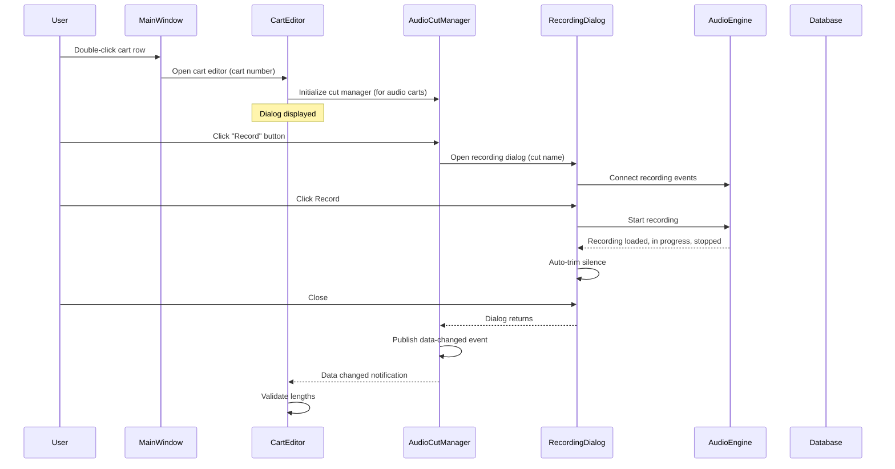
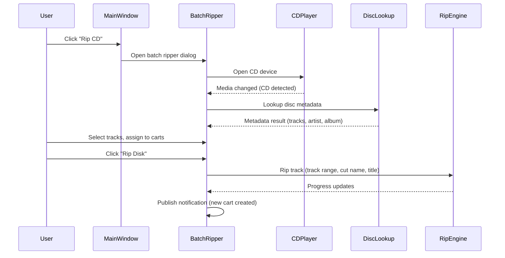
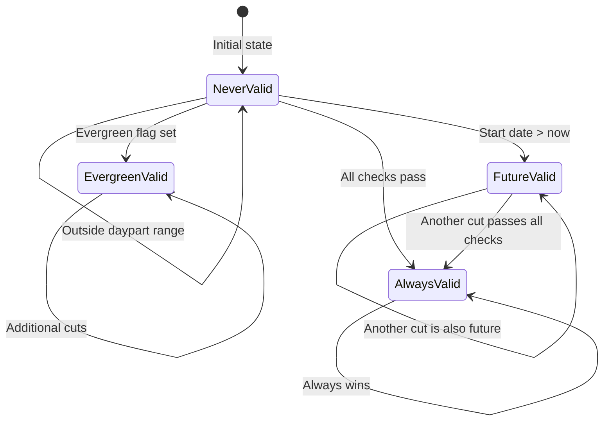
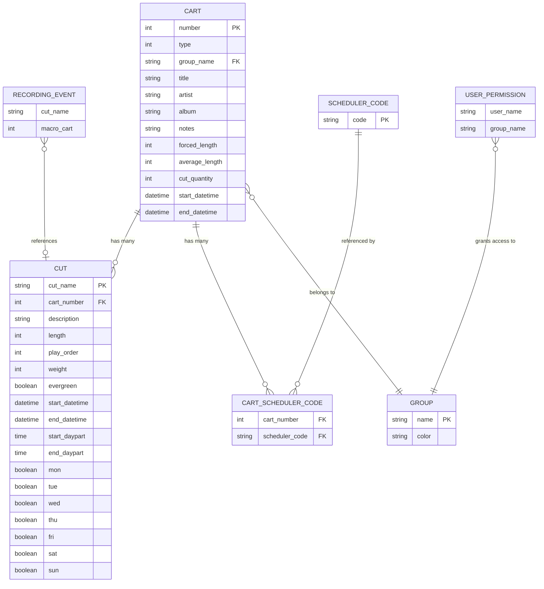

# Design Document

## Overview

The Library Manager is the central application for managing the broadcast automation system's audio and macro cart library. It provides a comprehensive interface for browsing, searching, creating, editing, and deleting carts and their associated audio cuts, as well as recording audio, ripping CDs, managing macro command sequences, and generating reports.

**Purpose:** Deliver a full-featured media asset management interface that enables broadcast operators, audio engineers, and library managers to maintain the station's content library efficiently.

**Users:** Broadcast operators (browse, preview, drag-and-drop), audio engineers (record, edit, rip), library managers (create, delete, report, bulk edit), scheduling operators (cut validity, scheduler codes).

**Impact:** Core content management module. Changes here affect all downstream systems that consume cart data -- playout, logging, scheduling, and catch events.

### Goals
- Provide fast, filterable access to the entire cart library with real-time search
- Support full lifecycle management of audio carts (create, edit, record, import, rip, delete)
- Support macro cart creation and execution for automation workflows
- Enable multi-user concurrent access with real-time cross-client notifications
- Integrate with CD ripping and online metadata lookup for physical media ingest
- Generate reports and CSV exports for library analysis

### Non-Goals
- Audio waveform editing (deferred to external editor integration)
- Playout scheduling and log management (handled by separate modules)
- User and permission administration (handled by admin module)
- Audio format conversion or transcoding beyond rip-time encoding settings

## Visual Design Reference

All UI/UX implementation decisions (colors, typography, spacing, component appearance, interaction patterns) are defined in the design system files. **Agents implementing UI components MUST read these before writing any visual code.**

| Layer | File | Scope |
|-------|------|-------|
| Global | `.blah/steering/design.md` | Typography, base palette, spacing, z-index, accessibility baseline |
| Spec | `design-system/MASTER.md` | rdlibrary-specific tokens (colors, states, layout, component specs) |
| Page | `design-system/pages/*.md` | Per-view overrides |

**Hierarchy:** page override > spec MASTER > global steering. Higher layers only define differences.

<!-- NOTE: design-system/ files are generated by the ui-ux-pro-max skill in a separate step.
     If design-system/ does not yet exist, this section serves as a placeholder indicating
     that visual design generation is required before implementation. -->

## Architecture

### Architecture Pattern & Boundary Map

```mermaid
graph TD
    subgraph UI["UI Layer"]
        MW[Main Window]
        EC[Cart Editor Dialog]
        AC[Audio Cut Manager]
        MC[Macro Editor]
        RC[Recording Dialog]
        DR[Batch CD Ripper Dialog]
        CR[Single Track Ripper Dialog]
        EM[Macro Command Editor]
        EN[Notes Editor]
        SC[Scheduler Codes Editor]
        LR[Reports Dialog]
        DG[Disk Space Gauge]
        NB[Note Bubble]
        AP[Audio Player]
    end

    subgraph Logic["Business Logic Layer"]
        CF[Cart Filtering Engine]
        CV[Cut Validation Engine]
        NF[Notification Manager]
        SM[Session Manager]
        CB[Clipboard Manager]
    end

    subgraph Data["Data Access Layer"]
        CR2[Cart Repository]
        CU[Cut Repository]
        GR[Group Repository]
        SR[Scheduler Code Repository]
        RP[Report Generator]
    end

    subgraph External["External Services"]
        AE[Audio Engine Service]
        CD[CD Player Service]
        DL[Disc Lookup Service]
        AI[Audio Import Service]
        EE[External Editor]
        NS[Notification Service]
        DB[(Database)]
    end

    MW --> CF
    MW --> NF
    MW --> SM
    EC --> CV
    AC --> CB
    RC --> AE
    DR --> CD
    DR --> DL
    CR --> CD
    CR --> DL

    CF --> CR2
    CF --> GR
    CV --> CU
    CR2 --> DB
    CU --> DB
    GR --> DB
    SR --> DB
    RP --> DB
    NF --> NS
    AC --> AI
    DR --> AI
```



**Architecture Integration:**
- Selected pattern: Layered architecture with UI / Business Logic / Data Access / External Services
- Domain boundaries: Cart management, cut management, CD ripping, recording, reporting are distinct feature areas sharing a common data layer
- Event-driven updates: notification events keep multiple client instances synchronized
- Session management: user lock/unlock pattern protects data integrity during concurrent edits

### Technology Stack

| Layer | Choice | Role | Notes |
|-------|--------|------|-------|
| Frontend | TBD | Desktop application UI | See steering for target technology |
| Business Logic | TBD | Cart/cut validation, filtering, session management | |
| Data / Storage | Relational database | Cart, cut, group, scheduler code persistence | Shared database with other system modules |
| Audio Engine | Audio Engine Service (external daemon) | Recording, playback, metering | Communicates via service connection |
| CD Ripping | CD player + ripper libraries | Physical media ingest | Includes online metadata lookup |
| Notifications | Inter-client notification service | Real-time multi-client sync | Add/modify/delete cart events |

## System Flows

### Cart Edit Flow



### Batch CD Rip Flow



### Cut Validity State Machine



Validation priority: (1) any cut always-valid marks the cart as always-valid, (2) length must be > 0, (3) evergreen bypasses all date/time checks, (4) day-of-week, (5) date range, (6) daypart range.

### Notification Flow

| Action | Trigger | Notification Type | Effect on Other Clients |
|--------|---------|-------------------|------------------------|
| Add | After cart creation | Cart/Add | Add cart to list if matches filter |
| Modify | After cart save | Cart/Modify | Refresh the cart row |
| Delete | After cart removal | Cart/Delete | Remove cart from list (defer if editing) |

## Requirements Traceability

| Requirement | Summary | Components | Interfaces | Flows |
|-------------|---------|------------|------------|-------|
| 1 | Cart library browsing and filtering | Main Window, Cart Filtering Engine, Cart List View | Cart Repository, Group Repository | -- |
| 2 | Cart creation and deletion | Main Window, Notification Manager | Cart Repository, Notification Service | Notification Flow |
| 3 | Cart metadata editing | Cart Editor, Notes Editor, Scheduler Codes Editor | Cart Repository, Session Manager | Cart Edit Flow |
| 4 | Audio cut management | Audio Cut Manager, Clipboard Manager | Cut Repository, Audio Import Service | Cart Edit Flow |
| 5 | Audio recording | Recording Dialog | Audio Engine Service, Cut Repository | Cart Edit Flow |
| 6 | CD ripping (batch) | Batch CD Ripper | CD Player Service, Disc Lookup, Audio Import | Batch CD Rip Flow |
| 7 | CD ripping (single track) | Single Track Ripper | CD Player Service, Disc Lookup, Audio Import | -- |
| 8 | Macro cart editing | Macro Editor, Macro Command Editor | Macro Event Repository | -- |
| 9 | Cut validity and scheduling | Cut Validation Engine | Cut Repository | Cut Validity State Machine |
| 10 | Reporting and export | Reports Dialog, Report Generator | Cart Repository, Cut Repository | -- |
| 11 | Note bubbles and preview | Note Bubble, Audio Player | Cart Repository, Audio Engine Service | -- |
| 12 | Drag-and-drop integration | Cart List View | -- | -- |
| 13 | Multi-user session management | Session Manager, Notification Manager | Notification Service | Notification Flow |

## Components and Interfaces

| Component | Domain/Layer | Intent | Req Coverage | Key Dependencies | Contracts |
|-----------|--------------|--------|--------------|------------------|-----------|
| Main Window | UI | Primary cart browsing, filtering, and action dispatch | 1, 2, 11, 12, 13 | Cart Filtering Engine, Notification Manager, Session Manager | Event |
| Cart Editor | UI | Modal editor for cart metadata | 3 | Cart Repository, Cut Validation Engine | Service |
| Audio Cut Manager | UI | Manage cuts within an audio cart | 4 | Clipboard Manager, Cut Repository, Audio Import Service | Event |
| Macro Editor | UI | Manage macro command sequences | 8 | Macro Event Repository | Event |
| Recording Dialog | UI | Record audio into a cut | 5 | Audio Engine Service | Service |
| Batch CD Ripper | UI | Rip multiple CD tracks to carts | 6 | CD Player Service, Disc Lookup, Audio Import Service | Service |
| Single Track Ripper | UI | Rip one CD track to a cut | 7 | CD Player Service, Disc Lookup, Audio Import Service | Service |
| Macro Command Editor | UI | Edit a single macro command | 8 | -- | -- |
| Notes Editor | UI | Edit free-text cart notes | 3 | Cart Repository | -- |
| Scheduler Codes Editor | UI | Assign/remove scheduler codes | 3 | Scheduler Code Repository | -- |
| Reports Dialog | UI | Select and generate reports | 10 | Report Generator | -- |
| Disk Space Gauge | UI | Display available recording space | 5 | -- | -- |
| Note Bubble | UI | Tooltip showing cart notes on hover | 11 | Cart Repository | -- |
| Audio Player | UI | Embedded preview player | 11 | Audio Engine Service | -- |
| Cart Filtering Engine | Logic | Build filter queries from UI state | 1 | Cart Repository, Group Repository | Service |
| Cut Validation Engine | Logic | Validate cut scheduling eligibility | 9 | Cut Repository | Service |
| Notification Manager | Logic | Send/receive cross-client notifications | 2, 13 | Notification Service | Event |
| Session Manager | Logic | Handle user login/change and edit locking | 13 | -- | State |
| Clipboard Manager | Logic | Manage cut copy/paste clipboard | 4 | -- | State |
| Report Generator | Data | Generate HTML and CSV reports | 10 | Database | Service |

### Business Logic Layer

#### Cart Filtering Engine

| Field | Detail |
|-------|--------|
| Intent | Build dynamic database queries based on user-selected filter criteria (text, group, scheduler codes, cart type) |
| Requirements | 1 |

**Responsibilities & Constraints**
- Combine text filter, group filter, scheduler code filters, and type filters into a single query
- Support both synchronous (real-time) and asynchronous (on-demand) filtering modes based on station configuration
- Return results sorted and color-coded by group

**Dependencies**
- Outbound: Cart Repository -- query carts (P0)
- Outbound: Group Repository -- retrieve group colors (P0)

**Contracts:** Service [x]

##### Service Interface
```
interface CartFilteringEngine {
  buildFilterQuery(text: string, group: string, schedCode1: string, schedCode2: string, showAudio: boolean, showMacro: boolean, matchesOnly: boolean): FilterQuery;
  executeFilter(query: FilterQuery): Result<list of CartDisplayRecord, DatabaseError>;
}
```
- Preconditions: User is authenticated and has at least one group permission
- Postconditions: Returns only carts in groups the current user can access

#### Cut Validation Engine

| Field | Detail |
|-------|--------|
| Intent | Evaluate scheduling validity of cuts based on date/time/day-of-week rules and evergreen status |
| Requirements | 9 |

**Responsibilities & Constraints**
- Evaluate cuts in priority order: always-valid > length check > evergreen > day-of-week > date range > daypart
- Aggregate cut-level validity into cart-level validity
- A single always-valid cut makes the entire cart always-valid

**Contracts:** Service [x]

##### Service Interface
```
interface CutValidationEngine {
  validateCut(cutRecord: CutRecord, currentDatetime: datetime): CutValidity;
  validateCart(cuts: list of CutRecord, currentDatetime: datetime): CartValidity;
}

enum CutValidity { AlwaysValid, EvergreenValid, FutureValid, NeverValid }
enum CartValidity { AlwaysValid, ConditionallyValid, FutureValid, NeverValid }
```

#### Notification Manager

| Field | Detail |
|-------|--------|
| Intent | Send and receive inter-client notifications for cart add/modify/delete events |
| Requirements | 2, 13 |

**Responsibilities & Constraints**
- Publish add/modify/delete events after cart operations
- On receiving add: check if new cart matches current filter, add to display if so
- On receiving modify: refresh the affected cart row
- On receiving delete: remove cart from display; defer if editor is open

**Contracts:** Event [x]

##### Event Contract
- Published events: Cart.Added(cartNumber), Cart.Modified(cartNumber), Cart.Deleted(cartNumber)
- Subscribed events: Cart.Added, Cart.Modified, Cart.Deleted (from other clients)
- Delivery guarantees: Best-effort delivery via notification service

#### Session Manager

| Field | Detail |
|-------|--------|
| Intent | Track user session state, lock during edits, process deferred operations |
| Requirements | 13 |

**Responsibilities & Constraints**
- Lock session when editor dialog opens (prevent concurrent state changes)
- Queue incoming deletion notifications during lock
- Process deferred notifications when editor closes
- Detect user change during edit and refresh permissions

**Contracts:** State [x]

##### State Management
- State model: { currentUser, editPending, deferredDeletions: list of cartNumber }
- Persistence: In-memory session state only
- Concurrency strategy: Lock/unlock pattern around modal dialogs

### Data Access Layer

#### Report Generator

| Field | Detail |
|-------|--------|
| Intent | Generate formatted reports and CSV exports from cart/cut data |
| Requirements | 10 |

**Responsibilities & Constraints**
- Cart report: formatted output of carts matching current filter
- Cut report: formatted output including cut-level detail
- CSV dump: raw data export with optional field name header
- All reports respect the current filter context (text, type, group, scheduler code)

**Contracts:** Service [x]

##### Service Interface
```
interface ReportGenerator {
  generateCartReport(filter: FilterContext): string;
  generateCutReport(filter: FilterContext): string;
  generateCsvExport(filter: FilterContext, includeHeaders: boolean): string;
}
```

## Data Models

### Domain Model

**Entities:**
- **Cart** (aggregate root): A numbered container for audio content or macro commands. Has a type (audio or macro), belongs to a group, carries metadata (title, artist, album, etc.), and contains zero or more cuts (audio) or macro lines (macro).
- **Cut**: An individual audio segment within a cart. Carries scheduling rules (dates, dayparts, days of week, evergreen flag), playback metadata (length, weight, play order), and origin tracking.
- **Group**: A named category with a display color. Users are granted access to groups via permissions.
- **Scheduler Code**: A tag that can be assigned to carts for scheduling system integration.
- **Recording Event Reference**: A reference from the scheduling module to a cut or macro cart, used to protect referenced content from deletion.

**Business Rules:**
- Cart title is mandatory (single-edit mode)
- Cart title uniqueness is configurable system-wide
- A cart owned by a voice tracking session cannot be deleted
- Content referenced by recording events requires explicit user confirmation before deletion
- Cut validity is computed from a priority-ordered rule chain

### Logical Data Model



### Physical Data Model

Tables are owned and managed by the core library module (LIB). This module performs direct queries against these tables but does not own the schema. See the LIB specification for full table definitions, indexes, and migration strategy.

Key access patterns for this module:
- Cart list: SELECT with JOIN to GROUP for color, filtered by user permissions, text search, type, group, and scheduler codes
- Cut list: SELECT by cart number, ordered by play order or weight
- Cut validation: SELECT scheduling fields for all cuts in a cart
- Reports: Full cart/cut joins with optional scheduler code inclusion
- Recording event check: SELECT from recording events by cut name or macro cart number

## Error Handling

### Error Categories

**User Errors:**
- Missing cart title -- field-level validation with warning dialog
- Duplicate cart title -- business rule validation with warning dialog
- No cut selected for copy -- information dialog guiding user to select a single cut
- Empty clipboard on paste -- information dialog
- Length mismatch with enforce-length -- warning with override option

**System Errors:**
- Database connection failure -- critical error dialog, application cannot start
- Unknown command-line option -- critical error dialog at startup
- Audio deletion failure -- warning dialog with error details
- Cut audio deletion failure -- warning dialog with specific cut number

**Business Logic Errors:**
- Maximum cuts reached -- warning dialog, operation prevented
- Duplicate play order values -- warning dialog, save prevented
- Cart referenced by recording events -- warning dialog requiring explicit confirmation
- Cart owned by voice tracker -- silent skip (no dialog)
- Clipboard content at risk of deletion -- confirmation dialog

### Error Strategy

All user-facing errors display modal dialogs categorized by severity:
- **Critical:** Application startup failures; prevent continuation
- **Warning:** Validation failures and destructive actions; prevent operation or require confirmation
- **Information:** Non-blocking notices (clipboard empty, no audio present)

## Testing Strategy

### E2E Tests
1. Create a new audio cart, add a cut, import audio, verify cart appears in filtered list
2. Edit cart metadata (title, artist, album), save, verify changes persist
3. Delete a cart with confirmation, verify removal from list and notification to other clients
4. Rip a CD track into a cut, verify metadata populated from disc lookup
5. Generate each report type (cart report, cut report, CSV) and verify content matches filter

### Integration Tests
1. Multi-client notification: create a cart in one session, verify it appears in another session's filtered view
2. Recording flow: connect to audio engine, record audio, stop, verify auto-trim applied and cut length updated
3. Cut validation: create cuts with various scheduling configurations, verify computed validity states
4. Session locking: receive a delete notification while editor is open, verify deferred processing after close
5. CD ripping with metadata lookup: insert disc, verify lookup service integration and metadata population

### Unit Tests
1. Filter query builder: verify correct query construction for each combination of filter criteria
2. Cut validation engine: test each validity rule (evergreen, date range, daypart, day-of-week, zero length)
3. Cart title uniqueness check: verify enforcement when system setting is enabled/disabled
4. Play order duplicate detection: verify detection of duplicate order values across cuts
5. Report generator: verify correct formatting for cart report, cut report, and CSV with/without headers
