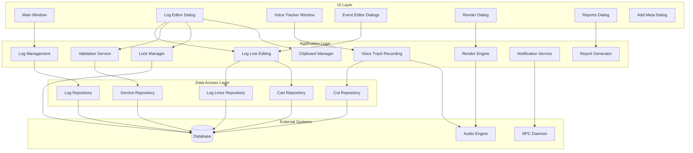
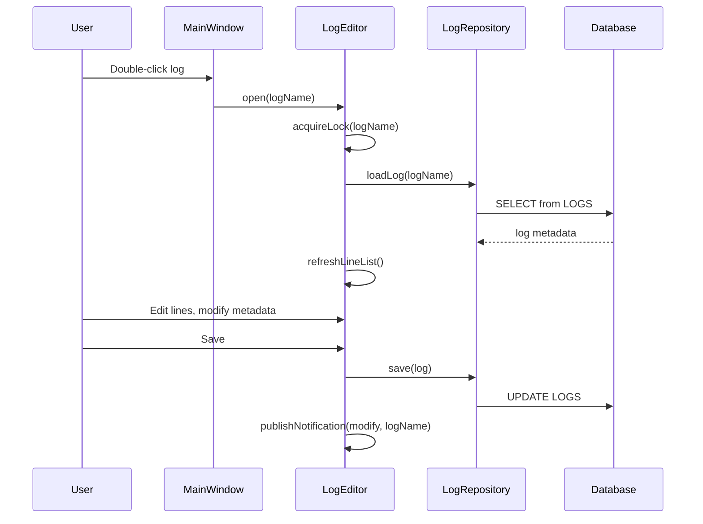
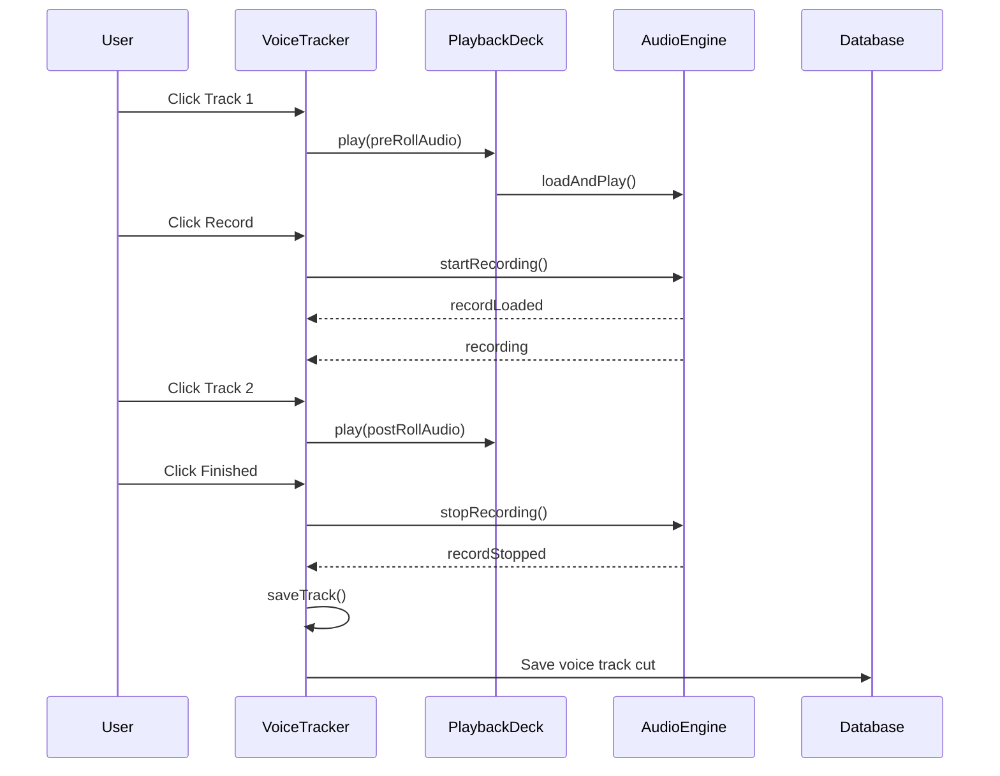
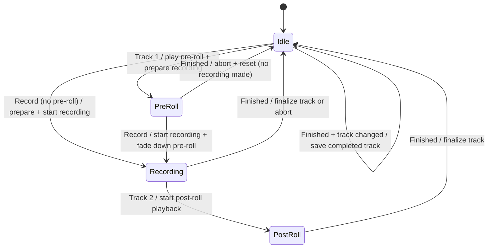
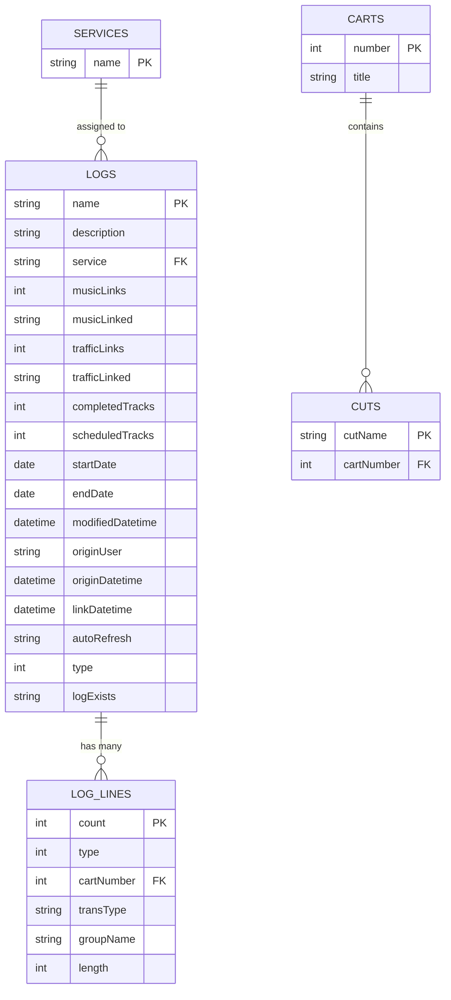

# Design Document

## Overview

**Purpose:** RDLogEdit delivers broadcast log editing capabilities to radio station operators. It allows creating, browsing, editing, and deleting broadcast logs -- ordered sequences of audio events that define a station's daily programming. The application also provides voice tracking (recording voice-over segments between scheduled audio) and log-to-audio rendering.

**Users:** Broadcast operators and program directors use this application to build and refine daily broadcast schedules. Voice tracking enables pre-production of shows with natural-sounding transitions.

**Impact:** RDLogEdit reads and writes to the central broadcast automation database (LOGS and LOG_LINES tables), communicates with the audio engine for voice tracking and rendering, and sends inter-client notifications so that changes are visible across all connected workstations.

### Goals

- Enable full CRUD lifecycle for broadcast logs and their line items
- Support voice tracking with real-time waveform visualization and audio recording
- Provide log-to-audio rendering for pre-production use
- Enforce concurrent editing protection through exclusive locks
- Validate cart-to-service compatibility to prevent scheduling errors
- Generate reports for log review and exception identification

### Non-Goals

- Automatic log generation or scheduling (handled by LogManager / LGM artifact)
- Cart/audio library management (handled by Library / LBR artifact)
- Live on-air playout (handled by AirPlay / AIR artifact)
- Traffic and music import linking (handled by external systems via the core library)
- Audio engine implementation details (delegated to CAE daemon)

## Visual Design Reference

All UI/UX implementation decisions (colors, typography, spacing, component appearance, interaction patterns) are defined in the design system files. **Agents implementing UI components MUST read these before writing any visual code.**

| Layer | File | Scope |
|-------|------|-------|
| Global | `.blah/steering/design.md` | Typography, base palette, spacing, z-index, accessibility baseline |
| Spec | `design-system/MASTER.md` | rdlogedit-specific tokens (colors, states, layout, component specs) |
| Page | `design-system/pages/*.md` | Per-view overrides |

**Hierarchy:** page override > spec MASTER > global steering. Higher layers only define differences.

<!-- NOTE: design-system/ files are generated by the ui-ux-pro-max skill in a separate step.
     If design-system/ does not yet exist, this section serves as a placeholder indicating
     that visual design generation is required before implementation. -->

## Architecture

### Architecture Pattern & Boundary Map



**Architecture Integration:**
- Selected pattern: Layered architecture with UI / Logic / Data separation
- Domain boundaries: Log management, line editing, voice tracking, and rendering are distinct domains
- Dependency direction: UI depends on Logic; Logic depends on Data; Data depends on External
- The audio engine and RPC daemon are external services accessed via service abstractions

### Technology Stack

| Layer | Choice | Role | Notes |
|-------|--------|------|-------|
| Frontend | TBD | Desktop application UI | See steering for target stack |
| Backend / Services | TBD | Business logic layer | Domain services |
| Data / Storage | Relational database | Log and cart metadata persistence | PostgreSQL recommended per steering |
| Audio | Audio engine service | Playback, recording, rendering | Abstracted behind service interface |
| Messaging / Events | Notification service | Inter-client real-time updates | Via RPC daemon or equivalent |

## System Flows

### Log Editing Flow



### Voice Tracking Flow



### Voice Tracker State Machine



**State Descriptions:**
- **Idle:** No audio transport active. Completed tracks can be saved.
- **PreRoll:** Pre-roll audio playing. Recording hardware prepared but not started. Cancel returns to idle.
- **Recording:** Recording active. Pre-roll fading down. Can finish or move to post-roll.
- **PostRoll:** Post-roll audio playing while recording continues. Finish completes the track.

## Requirements Traceability

| Requirement | Summary | Components | Interfaces | Flows |
|-------------|---------|------------|------------|-------|
| 1 | Log List Management | MainWindow, LogListWidget | LogRepository, NotificationService | Log Editing Flow |
| 2 | Log Editing | LogEditor, LogLineList | LogRepository, LockManager, ClipboardManager, NotificationService | Log Editing Flow |
| 3 | Cart Line Editing | CartLineEditor | CartRepository, ValidationService | -- |
| 4 | Marker/Chain/Track Editing | MarkerEditor, ChainEditor, TrackMarkerEditor | LogLineRepository | -- |
| 5 | Voice Tracking | VoiceTracker, WaveformDisplay | AudioEngine, CutRepository, PlaybackDeck | Voice Tracking Flow |
| 6 | Log Rendering | RenderDialog | RenderEngine, AudioSettings | -- |
| 7 | Report Generation | ReportsDialog | ReportGenerator | -- |
| 8 | Service Validation | ValidationService | ServiceRepository, CartRepository | -- |
| 9 | Concurrent Editing Protection | LockManager | Database | -- |
| 10 | Inter-Client Notifications | NotificationService | RPCDaemon | -- |
| 11 | Configuration Persistence | ConfigManager | ConfigStorage | -- |

## Components and Interfaces

| Component | Domain/Layer | Intent | Req Coverage | Key Dependencies | Contracts |
|-----------|--------------|--------|--------------|------------------|-----------|
| MainWindow | UI | Top-level log list and navigation | 1, 10, 11 | LogRepository, NotificationService | Event |
| LogEditor | UI/Logic | Log metadata and line editing | 2, 8, 9 | LogRepository, LockManager, ClipboardManager, ValidationService | Service, Event |
| CartLineEditor | UI | Cart-type log line configuration | 3 | CartRepository, ValidationService | Service |
| MarkerEditor | UI | Marker log line configuration | 4 | -- | Service |
| ChainEditor | UI | Chain/link log line configuration | 4 | LogRepository | Service |
| TrackMarkerEditor | UI | Voice track marker configuration | 4 | -- | Service |
| VoiceTracker | UI/Logic | Voice recording with waveform display | 5 | AudioEngine, PlaybackDeck, CutRepository | Service, State, Event |
| RenderDialog | UI/Logic | Log-to-audio rendering | 6 | RenderEngine | Service |
| ReportsDialog | UI | Report generation interface | 7 | ReportGenerator | Service |
| ValidationService | Logic | Cart-to-service compatibility checks | 8 | ServiceRepository, CartRepository | Service |
| LockManager | Logic | Exclusive log editing locks | 9 | Database | Service |
| NotificationService | Logic | Inter-client change notifications | 10 | RPCDaemon | Event |
| ClipboardManager | Logic | Cut/copy/paste for log lines | 2 | -- | Service |
| ConfigManager | Logic | Window position and preference persistence | 11 | ConfigStorage | Service |
| LogListWidget | UI | Filterable, sortable log list with status icons | 1 | -- | Event |
| LogLineList | UI | Drag-drop log line list with color coding | 2 | -- | Event |
| WaveformDisplay | UI | Three-track waveform visualization | 5 | -- | -- |

### UI Layer

#### MainWindow

| Field | Detail |
|-------|--------|
| Intent | Top-level window displaying the log list with filter, action buttons, and status icons |
| Requirements | 1, 10, 11 |

**Responsibilities & Constraints**
- Display all available logs in a filterable tabular list
- Provide add, edit, delete, voice tracker, and report action buttons
- React to inter-client notifications by refreshing affected list entries
- Persist and restore window position

**Dependencies**
- Outbound: LogEditor -- opens for editing (P0)
- Outbound: VoiceTracker -- opens for voice tracking (P0)
- Outbound: ReportsDialog -- opens for reporting (P1)
- Outbound: LogRepository -- log CRUD operations (P0)
- Inbound: NotificationService -- receives change events (P0)

**Contracts:** Event [ x ]

##### Event Contract
- Subscribed events: logCreated, logModified, logDeleted (from NotificationService)
- Published events: none directly (delegates to LogEditor)

#### LogEditor

| Field | Detail |
|-------|--------|
| Intent | Full-featured log editing dialog with metadata fields, line list, and clipboard operations |
| Requirements | 2, 8, 9 |

**Responsibilities & Constraints**
- Acquire exclusive lock on open; release on close
- Display and edit log metadata (description, service, dates, auto-refresh, time style)
- Manage log lines: insert, delete, reorder, cut/copy/paste, drag-drop
- Color-code lines based on cart validity state
- Validate service compatibility on save
- Publish modification notifications on save

**Dependencies**
- Outbound: LockManager -- acquire/release log locks (P0)
- Outbound: LogRepository -- persist log data (P0)
- Outbound: ValidationService -- check cart-service compatibility (P0)
- Outbound: ClipboardManager -- cut/copy/paste operations (P1)
- Outbound: CartLineEditor, MarkerEditor, ChainEditor, TrackMarkerEditor -- line editing (P0)
- Outbound: RenderDialog -- render log to audio (P1)
- Outbound: ReportsDialog -- generate reports (P2)
- Outbound: NotificationService -- publish changes (P0)

**Contracts:** Service [ x ] / Event [ x ]

##### Service Interface
```
interface LogEditorService {
  openLog(logName: string): Result<LogData, LockError | NotFoundError>
  savelog(log: LogData): Result<void, ValidationError | AudioDeletionError>
  saveLogAs(log: LogData, newName: string): Result<void, ValidationError>
  insertLine(position: number, line: LogLine): Result<void, Error>
  deleteLine(position: number): Result<void, Error>
  moveLine(from: number, to: number): Result<void, Error>
}
```

##### Event Contract
- Subscribed events: notification(logModified) -- refresh if another client modified the same log
- Published events: notification(logModified, logName) -- after save

#### VoiceTracker

| Field | Detail |
|-------|--------|
| Intent | Voice tracking window with transport controls, waveform display, and recording management |
| Requirements | 5 |

**Responsibilities & Constraints**
- Manage deck state machine: Idle -> PreRoll -> Recording -> PostRoll -> Idle
- Coordinate audio playback (pre-roll, post-roll) and recording simultaneously
- Display real-time waveform visualization for three audio tracks
- Allow interactive segue/crossfade point adjustment via mouse drag on waveform
- Calculate and save segue transition points after recording
- Support import workflow as alternative to live recording

**Dependencies**
- Outbound: AudioEngine -- playback and recording (P0)
- Outbound: PlaybackDeck -- multi-deck audio playback (P0)
- Outbound: CutRepository -- save recorded audio cuts (P0)
- Outbound: LogRepository -- update log lines with track data (P0)
- Outbound: NotificationService -- publish changes (P1)
- External: Service configuration -- for track group and channel settings (P1)

**Contracts:** Service [ x ] / State [ x ] / Event [ x ]

##### State Management
- State model: DeckState enum { Idle, PreRoll, Recording, PostRoll }
- Transitions governed by user transport actions and audio engine callbacks
- Concurrency: only one deck state active at a time; transport buttons are enabled/disabled based on current state

##### Event Contract
- Subscribed events: recordLoaded, recording, recordStopped, recordUnloaded (from AudioEngine); stateChanged, segueStart (from PlaybackDeck); notification (from NotificationService)
- Published events: notification(logModified, logName) -- after track save

### Logic Layer

#### ValidationService

| Field | Detail |
|-------|--------|
| Intent | Validate cart and group compatibility with the log's assigned service |
| Requirements | 3, 8 |

**Responsibilities & Constraints**
- Check whether a cart's group is enabled for the selected service
- Report validation failures with descriptive messages
- Allow user override on log-level validation (save anyway)

##### Service Interface
```
interface ValidationService {
  isCartValidForService(cartNumber: number, serviceName: string): Result<boolean, NotFoundError>
  validateLogForService(log: LogData): Result<ValidationReport, Error>
}
```

#### LockManager

| Field | Detail |
|-------|--------|
| Intent | Manage exclusive locks for concurrent log editing protection |
| Requirements | 9 |

##### Service Interface
```
interface LockManager {
  tryLock(logName: string, user: string, station: string): Result<Lock, LockConflictError>
  releaseLock(logName: string): Result<void, Error>
}
```
- LockConflictError includes: lockingUser, lockingStation

#### NotificationService

| Field | Detail |
|-------|--------|
| Intent | Publish and receive inter-client notifications for log changes |
| Requirements | 10 |

##### Event Contract
- Published events: logCreated(logName), logModified(logName), logDeleted(logName)
- Subscribed events: same (from other clients via RPC daemon)
- Delivery: best-effort, via connected RPC daemon

#### ClipboardManager

| Field | Detail |
|-------|--------|
| Intent | Manage cut/copy/paste operations for log lines |
| Requirements | 2 |

##### Service Interface
```
interface ClipboardManager {
  cut(lines: LogLine[]): void
  copy(lines: LogLine[]): void
  paste(): Result<LogLine[], EmptyClipboardError>
  hasContent(): boolean
}
```

## Data Models

### Domain Model

**Entities:**
- **Log** -- aggregate root representing a broadcast schedule for a specific date/service
- **LogLine** -- ordered entry within a log (cart, marker, chain, or voice track)
- **Cart** -- reference to an audio asset in the library
- **Cut** -- specific audio recording within a cart
- **Service** -- broadcast service/channel that a log is assigned to
- **Group** -- categorization of carts, with per-service enable/disable rules

**Business Rules:**
- A log has an ordered list of log lines
- Each log line has a type: cart, marker, chain (link to another log), or voice track
- Cart lines reference a cart number and must belong to an enabled group for the log's service
- Log names are unique identifiers
- Only one user can edit a log at a time (exclusive lock)

### Logical Data Model



**Notes:**
- LOG_LINES are stored in dynamically named tables (one per log) in the source system
- The LOGS.type field filters standard logs (type=0) from other log types
- LOGS.logExists flag indicates whether the log line table exists

### Physical Data Model

Refer to the LIB (librd) specification for the canonical table definitions. This artifact is a consumer of the database schema, not a definer.

## Error Handling

### Error Categories

**User Errors:**
- Missing cart number -- field-level validation, prevent save
- Disabled cart for service -- group-level validation, prevent save with explanation

**System Errors:**
- Application initialization failure -- critical, display error and exit
- Audio deletion failure -- prevent log save, display error with affected log name
- Voice track cart creation failure -- prevent recording, display warning

**Business Logic Errors:**
- Log locked by another user -- display locking user and station, prevent edit
- Invalid carts in log for service -- warning with option to save anyway or cancel
- Unsaved changes on cancel -- three-way dialog (save / discard / stay)
- Unknown command-line option -- critical error, display and exit

### Cart Validity Color Coding

| State | Visual Indicator | Meaning |
|-------|-----------------|---------|
| Always valid + valid group | Default | Cart is valid for playback |
| Always valid + invalid group | Service-invalid color | Group disabled for the assigned service |
| Conditionally valid | Conditional color | Cart valid only at certain times |
| Future valid | Future color | Cart becomes valid in the future |
| Evergreen | Evergreen color | Always-available fallback cart |
| Never valid | Error color | Invalid cart, display "[INVALID CART]" |

## Testing Strategy

### E2E Tests

1. Create a new log, add cart lines, save, verify log appears in list
2. Open a log, edit metadata and lines, save, verify changes persist
3. Voice track a segment: pre-roll, record, post-roll, finish, verify track saved
4. Render a log to an audio file, verify output file created
5. Delete a log with voice tracks, confirm both deletion prompts, verify removal

### Integration Tests

1. Concurrent editing: user A opens log, user B attempts to open same log -- verify lock conflict
2. Inter-client notification: user A saves log, user B's list refreshes automatically
3. Cart-service validation: add cart from disabled group, attempt save, verify warning
4. Voice track audio flow: verify audio engine receives correct record/play/stop commands
5. Drag-drop cart insertion: drop cart onto log line list, verify correct position

### Unit Tests

1. ValidationService: cart group enabled/disabled for various services
2. LockManager: acquire, release, conflict detection
3. ClipboardManager: cut/copy/paste with empty and populated states
4. Cart validity color assignment based on cart state and group membership
5. Log line renumbering after insert, delete, and reorder operations
6. Voice tracker state machine: valid and invalid transitions
