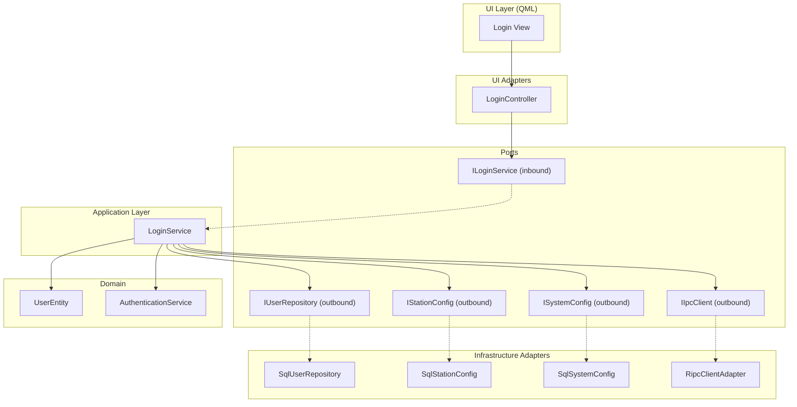
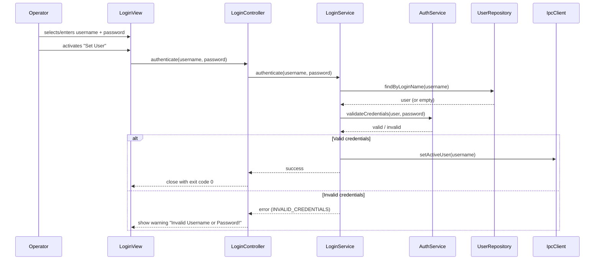
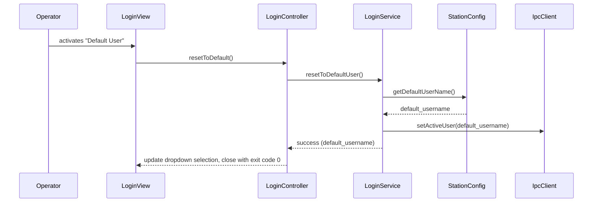
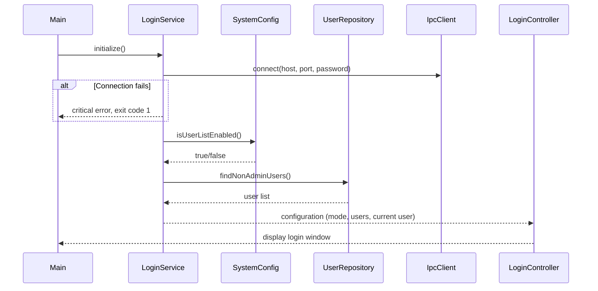
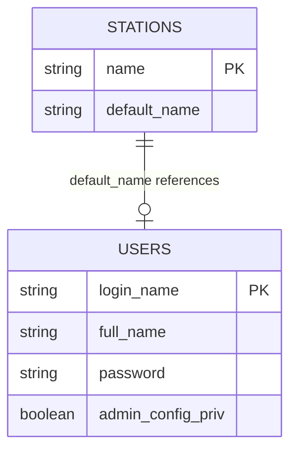

# Design Document

## Overview

**Purpose:** RDLogin delivers a lightweight user-switching dialog for the Rivendell broadcast automation platform. It enables operators to authenticate and change the active workstation user, or reset to the station's default user, without navigating the full administration interface.

**Users:** Broadcast operators use this during shift changes to switch the active user. System administrators configure the user list display mode and default user per station.

**Impact:** RDLogin modifies the active user state across the entire Rivendell system by communicating with the IPC daemon. All other Rivendell applications on the same workstation observe the user change.

### Goals
- Provide a fast, focused user-switching experience (launch, authenticate, exit)
- Support both dropdown and manual-entry modes for username input
- Enforce credential validation before user switching
- Exclude admin accounts from casual switching via the login dialog
- Adapt window dimensions to the actual user list

### Non-Goals
- User account creation or modification (handled by the administration application)
- Permission management or role assignment
- Session management or timeout policies
- Multi-station user switching (only affects the local station)
- Direct database writes (all user changes go through IPC)

## Visual Design Reference

All UI/UX implementation decisions (colors, typography, spacing, component appearance, interaction patterns) are defined in the design system files. **Agents implementing UI components MUST read these before writing any visual code.**

| Layer | File | Scope |
|-------|------|-------|
| Global | `.blah/steering/design.md` | Typography, base palette, spacing, z-index, accessibility baseline |
| Spec | `design-system/MASTER.md` | rdlogin-specific tokens (colors, states, layout, component specs) |
| Page | `design-system/pages/*.md` | Per-view overrides |

**Hierarchy:** page override > spec MASTER > global steering. Higher layers only define differences.

<!-- NOTE: design-system/ files are generated by the ui-ux-pro-max skill in a separate step.
     If design-system/ does not yet exist, this section serves as a placeholder indicating
     that visual design generation is required before implementation. -->

## Architecture

### Architecture Pattern & Boundary Map

RDLogin follows the project-wide lightweight hexagonal architecture. As a small, single-window utility application, its architecture is minimal: one UI adapter, one application service, and outbound ports for user repository, station configuration, and IPC communication.



### Technology Stack

| Layer | Choice | Role | Notes |
|-------|--------|------|-------|
| UI | Qt Quick / QML | Login dialog view | Single-window dialog |
| UI Adapter | C++ QObject | LoginController exposing model to QML | Bridges domain to UI |
| Application | C++ | LoginService implementing ILoginService | Orchestrates auth workflow |
| Domain | Pure C++ | UserEntity, AuthenticationService | No Qt dependency |
| Persistence | Qt SQL adapter | SqlUserRepository | Read-only user queries |
| IPC | Qt Network adapter | RipcClientAdapter | User change notification to IPC daemon |
| Configuration | Qt SQL adapter | SqlStationConfig, SqlSystemConfig | Station default user, show-user-list flag |

## System Flows

### Login Flow



### Default User Reset Flow



### Startup Flow



## Requirements Traceability

| Requirement | Summary | Components | Interfaces | Flows |
|-------------|---------|------------|------------|-------|
| 1 | Startup and initialization | LoginService, RipcClientAdapter, SqlUserRepository | ILoginService, IIpcClient, IUserRepository | Startup Flow |
| 2 | User list display mode | LoginController, LoginView, SqlSystemConfig | ISystemConfig | Startup Flow |
| 3 | User authentication | AuthenticationService, LoginService, LoginController | ILoginService, IUserRepository | Login Flow |
| 4 | Default user reset | LoginService, LoginController, SqlStationConfig | IStationConfig, IIpcClient | Default User Reset Flow |
| 5 | Cancel and exit | LoginController, LoginView | — | — |
| 6 | Admin user filtering | SqlUserRepository, LoginService | IUserRepository | Startup Flow |
| 7 | Dynamic window sizing | LoginController, LoginView | — | Startup Flow |
| 8 | Active user change notification | RipcClientAdapter, LoginController | IIpcClient | — |

## Components and Interfaces

| Component | Domain/Layer | Intent | Req Coverage | Key Dependencies | Contracts |
|-----------|-------------|--------|--------------|-----------------|-----------|
| UserEntity | Domain | Represents a system user with login name and privilege flags | 3, 6 | None | — |
| AuthenticationService | Domain | Validates user existence and password | 3 | None | Service |
| LoginService | Application | Orchestrates login, logout, and initialization workflows | 1, 2, 3, 4, 6, 8 | IUserRepository, IStationConfig, ISystemConfig, IIpcClient | Service |
| LoginController | UI Adapter | Bridges LoginService to QML, exposes user list model and actions | 2, 3, 4, 5, 7, 8 | ILoginService | State |
| LoginView | UI (QML) | Renders the login dialog | 2, 3, 4, 5, 7 | LoginController | — |
| SqlUserRepository | Adapter | Queries users from database, filters admin accounts | 1, 6 | Qt SQL | — |
| SqlStationConfig | Adapter | Reads station default user from database | 4 | Qt SQL | — |
| SqlSystemConfig | Adapter | Reads system-wide settings (show user list) | 2 | Qt SQL | — |
| RipcClientAdapter | Adapter | Communicates user changes to IPC daemon | 1, 3, 4, 8 | Qt Network | Event |

### Domain

#### UserEntity

| Field | Detail |
|-------|--------|
| Intent | Represents a Rivendell system user with identity and privilege information |
| Requirements | 3, 6 |

**Responsibilities & Constraints**
- Holds user identity: login name, full name
- Holds privilege flags (specifically: configuration administration privilege for filtering)
- Immutable value object after construction
- No Qt dependency

#### AuthenticationService

| Field | Detail |
|-------|--------|
| Intent | Validates that a user exists and that provided credentials are correct |
| Requirements | 3 |

**Responsibilities & Constraints**
- Accepts a user entity (or empty) and a password
- Returns validation result (valid/invalid)
- Pure domain logic, no I/O

##### Service Interface
```
interface IAuthenticationService:
    validateCredentials(user: optional<UserEntity>, password: string) -> bool
```
- Preconditions: none (handles missing user gracefully)
- Postconditions: returns true only if user exists AND password matches

### Application

#### LoginService

| Field | Detail |
|-------|--------|
| Intent | Orchestrates the complete login/logout workflow: initialization, authentication, default user reset |
| Requirements | 1, 2, 3, 4, 6, 8 |

**Responsibilities & Constraints**
- Coordinates startup: connect IPC, load user list, determine display mode
- Delegates credential validation to AuthenticationService
- Communicates user changes through IPC client port
- Does not contain business rules (delegates to domain)

**Dependencies**
- Outbound: IUserRepository — load user list (P0)
- Outbound: IStationConfig — read default user (P0)
- Outbound: ISystemConfig — read display mode setting (P0)
- Outbound: IIpcClient — set active user, receive user change events (P0)

**Contracts**: Service [x] / Event [x]

##### Service Interface
```
interface ILoginService:
    initialize() -> Result<LoginConfig, ErrorInfo>
    authenticate(username: string, password: string) -> Result<void, ErrorInfo>
    resetToDefaultUser() -> Result<string, ErrorInfo>
    currentUser() -> string
```

##### Event Contract
- Published events: userChanged(username: string)
- Subscribed events: IPC daemon user change notification
- Ordering: single-threaded event loop delivery

### UI Adapter

#### LoginController

| Field | Detail |
|-------|--------|
| Intent | Exposes login state and actions to QML, manages the user list model |
| Requirements | 2, 3, 4, 5, 7, 8 |

**Responsibilities & Constraints**
- Exposes properties: currentUser, userListMode, userList, maxUsernameWidth
- Exposes actions: authenticate(), resetToDefault(), cancel()
- Translates service errors into UI-visible error signals
- Calculates dynamic window width from user list

**Dependencies**
- Inbound: ILoginService — all login operations (P0)

**Contracts**: State [x] / Event [x]

##### State Management
- State model: currentUser (string), userList (list of strings), displayMode (dropdown/manual), errorMessage (string)
- Persistence: none (ephemeral — application exits after action)
- Concurrency: single-threaded (main event loop only)

##### Event Contract
- Published events: errorOccurred(code: string, message: string), loginSucceeded(), exitRequested(exitCode: int)
- Subscribed events: ILoginService.userChanged

### Infrastructure Adapters

#### SqlUserRepository

| Field | Detail |
|-------|--------|
| Intent | Reads user records from the database, filtering out configuration administrators |
| Requirements | 1, 6 |

**Responsibilities & Constraints**
- Implements IUserRepository
- Executes: `SELECT LOGIN_NAME FROM USERS WHERE ADMIN_CONFIG_PRIV='N' ORDER BY LOGIN_NAME`
- Read-only access; never writes to the USERS table
- Translates SQL results to domain UserEntity objects

#### RipcClientAdapter

| Field | Detail |
|-------|--------|
| Intent | Manages TCP connection to the IPC daemon for user change operations and notifications |
| Requirements | 1, 3, 4, 8 |

**Responsibilities & Constraints**
- Implements IIpcClient
- Connects to the IPC daemon on startup
- Sends user change commands (setActiveUser)
- Receives and forwards user change notifications as events

##### Event Contract
- Published events: connected(state: bool), userChanged()
- Subscribed events: IPC daemon TCP messages

## Data Models

### Domain Model

**Entities:**
- **UserEntity**: login name (string, max 8 chars), full name (string), configuration admin privilege (boolean)

**Value Objects:**
- **LoginName**: string, primary identifier, max 8 characters
- **ErrorInfo**: category, severity, code, message (per project error-handling standards)

### Logical Data Model



**USERS table** (read-only from this application):
| Column | Type | Constraints | Description |
|--------|------|-------------|-------------|
| login_name | string(8) | PK, NOT NULL | User login identifier |
| full_name | string(64) | INDEXED | Display name |
| password | string(32) | NOT NULL | Hashed password |
| admin_config_priv | boolean | NOT NULL, default false | Configuration administration privilege |

Additional privilege columns exist (admin_users, create_carts, delete_carts, modify_carts, edit_audio, assign_cart, create_log, delete_log, playout_log, arrange_log, addto_log, removefrom_log, edit_catches) but are not used by this application.

**STATIONS table** (read-only):
| Column | Type | Description |
|--------|------|-------------|
| name | string | Station identifier |
| default_name | string | Default user login name for the station |

### Physical Data Model

Existing database schema — no migrations required. This application performs read-only queries against the USERS table and reads station configuration. All user state changes propagate through IPC, not direct database writes.

## Error Handling

### Error Categories and Responses

**User Errors:**
| Error | Category | Severity | Trigger | Response |
|-------|----------|----------|---------|----------|
| Invalid credentials | Validation | Warning | User does not exist or password mismatch | Display warning dialog "Invalid Username or Password!", keep application open |

**System Errors:**
| Error | Category | Severity | Trigger | Response |
|-------|----------|----------|---------|----------|
| Application initialization failure | Internal | Critical | IPC connection fails or configuration error | Display critical error dialog with details, exit with code 1 |
| Unknown command-line option | Validation | Critical | Unrecognized CLI argument | Display critical error dialog with the option name, exit with code 2 |

### Error Propagation
1. Domain: AuthenticationService returns boolean (valid/invalid)
2. Application: LoginService detects failure, emits structured ErrorInfo
3. UI Adapter: LoginController receives error, emits errorOccurred signal
4. UI: QML displays appropriate dialog (warning for auth failure, critical modal for system errors)

## Testing Strategy

### Unit Tests (Domain)
- AuthenticationService validates credentials correctly (valid user + correct password)
- AuthenticationService rejects missing user
- AuthenticationService rejects incorrect password
- UserEntity correctly reports admin privilege status

### Unit Tests (Application)
- LoginService.initialize() loads user list excluding admin users
- LoginService.authenticate() delegates to AuthenticationService and calls IPC on success
- LoginService.authenticate() returns error on invalid credentials without calling IPC
- LoginService.resetToDefaultUser() reads station config and calls IPC

### Integration Tests
- Full login flow: initialize -> authenticate with valid credentials -> IPC setUser called
- Full login flow: initialize -> authenticate with invalid credentials -> error returned, no IPC call
- Default user reset: initialize -> resetToDefault -> correct default user sent to IPC
- User list filtering: only non-admin users returned from repository

### E2E Tests
- Launch login dialog -> select user from dropdown -> enter password -> click Set User -> application exits
- Launch login dialog -> enter wrong password -> warning shown -> application stays open
- Launch login dialog -> click Default User -> application exits
- Launch login dialog -> click Cancel -> application exits without user change
