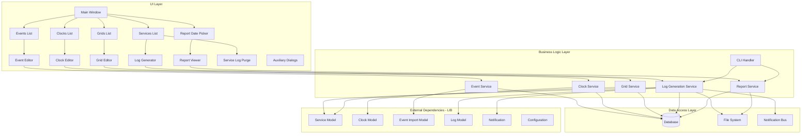
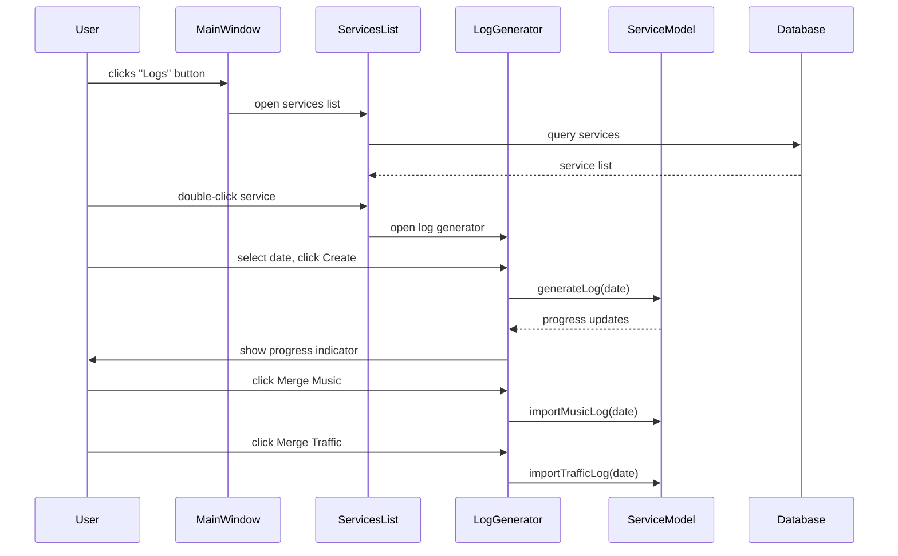
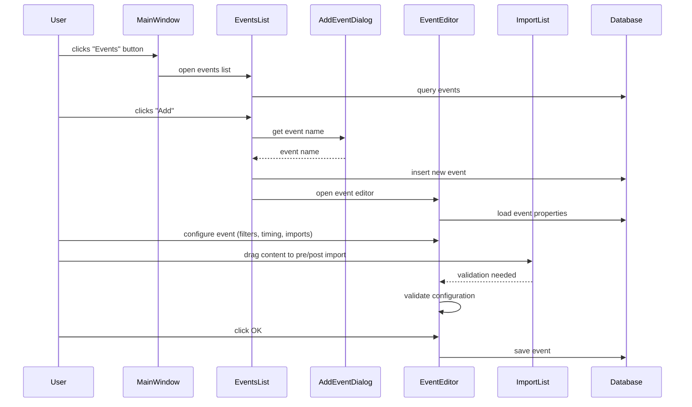
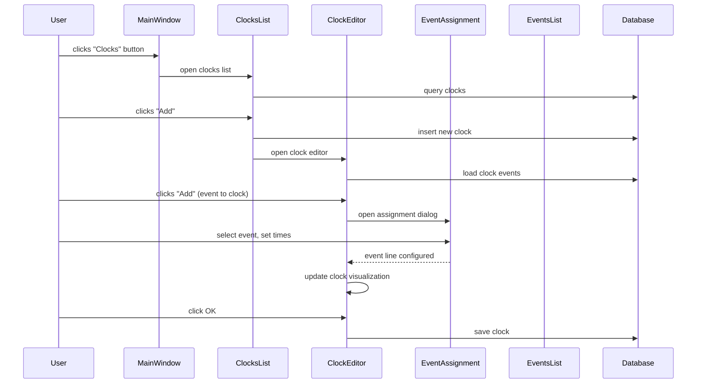
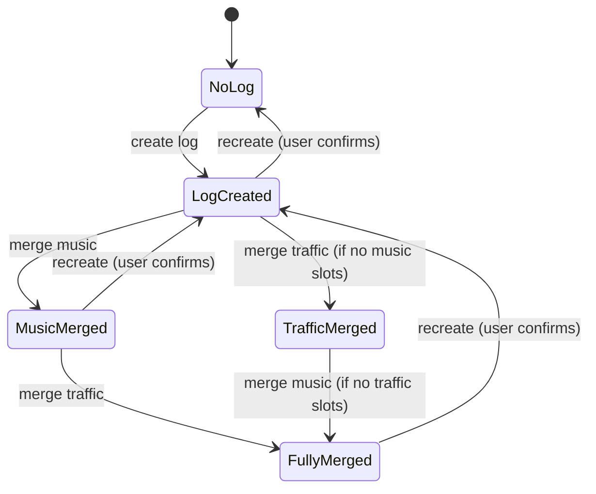
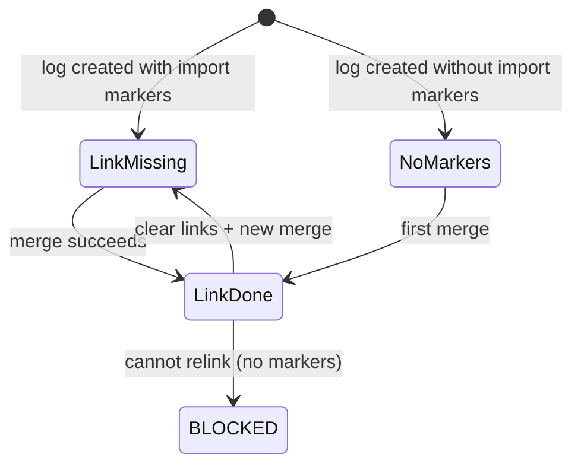
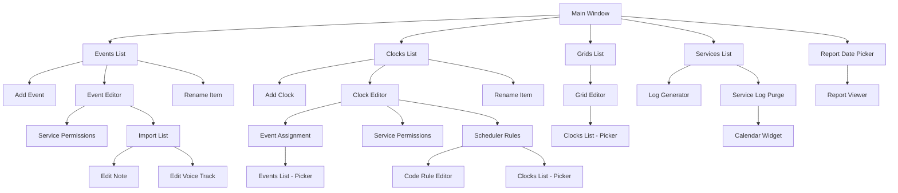
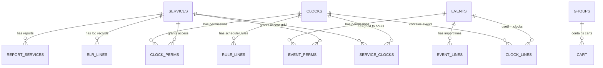

# Design Document

## Overview

**Purpose:** Log Manager provides broadcast scheduling tools for radio stations. It enables program directors and traffic managers to define scheduling events (reusable content blocks with timing and import rules), compose them into one-hour clocks, assign clocks to a weekly service grid, and generate daily broadcast logs that merge music and traffic content. The application also supports report generation and log lifecycle management.

**Users:** Program directors (event/clock/grid management), traffic managers (log generation and music/traffic merging), station managers (reporting), and automation scripts (CLI mode for batch log generation).

**Impact:** Log Manager is the bridge between programming decisions and on-air automation. Its output (generated logs) is consumed by the playout system (airplay). It reads from the service, event, clock, and cart databases, and writes to the log and event log record tables.

### Goals

- Enable CRUD operations on scheduling events with rich timing, import, and content rules
- Enable CRUD operations on clocks that compose events into hourly blocks
- Enable assignment of clocks to a 7x24 weekly service grid
- Generate daily broadcast logs from service grids with music and traffic merge
- Provide log lifecycle management (create, recreate, purge)
- Support both interactive GUI and command-line interfaces
- Generate and view broadcast reports for date ranges

### Non-Goals

- Audio playback or real-time broadcast control (handled by the playout system)
- Service or station configuration (handled by the administration application)
- Cart/content management (handled by the library application)
- Direct database schema management
- Platform-specific audio device integration

## Visual Design Reference

All UI/UX implementation decisions (colors, typography, spacing, component appearance, interaction patterns) are defined in the design system files. **Agents implementing UI components MUST read these before writing any visual code.**

| Layer | File | Scope |
|-------|------|-------|
| Global | `.blah/steering/design.md` | Typography, base palette, spacing, z-index, accessibility baseline |
| Spec | `design-system/MASTER.md` | rdlogmanager-specific tokens (colors, states, layout, component specs) |
| Page | `design-system/pages/*.md` | Per-view overrides |

**Hierarchy:** page override > spec MASTER > global steering. Higher layers only define differences.

<!-- NOTE: design-system/ files are generated by the ui-ux-pro-max skill in a separate step.
     If design-system/ does not yet exist, this section serves as a placeholder indicating
     that visual design generation is required before implementation. -->

## Architecture

### Architecture Pattern & Boundary Map



**Architecture Integration:**
- Selected pattern: Layered architecture with dialog-per-feature UI, domain services, and shared data access
- Domain boundaries: Events, Clocks, Grids, Log Generation, and Reporting are independent domains connected through the database
- Existing patterns preserved: Event-driven UI with signal/slot bindings, modal dialog navigation
- New components rationale: CLI handler encapsulates command-line operations separately from GUI

### Technology Stack

| Layer | Choice | Role | Notes |
|-------|--------|------|-------|
| Frontend | TBD | Desktop application UI | See steering for target technology |
| Backend | TBD | Business logic services | |
| Data | Relational database | Event, clock, grid, log persistence | Shared database with other Rivendell modules |
| File System | Local filesystem | Music/traffic import files, report output | |
| Messaging | Notification bus | Log change notifications | Inter-process communication with other modules |

## System Flows

### Log Generation Flow



### Event Creation Flow



### Clock Creation Flow



### Log Generation State Machine



### Import Link States (per source)



### Navigation Flow



## Requirements Traceability

| Requirement | Summary | Components | Interfaces | Flows |
|-------------|---------|------------|------------|-------|
| 1 | Event Management | EventsList, AddEventDialog, EventEditor, ImportList, ServicePermissions, EditNote, EditVoiceTrack, RenameItem | Event Service, Import List events | Event Creation Flow |
| 2 | Clock Management | ClocksList, AddClockDialog, ClockEditor, EventAssignment, ServicePermissions, SchedulerRules, CodeRuleEditor, ClockListView | Clock Service, Clock events | Clock Creation Flow |
| 3 | Grid Management | GridsList, GridEditor | Grid Service | - |
| 4 | Log Generation & Lifecycle | ServicesList, LogGenerator, CLIHandler, ServiceLogPurge, CalendarWidget | Log Generation Service, Notification Bus | Log Generation Flow, Log State Machine |
| 5 | Reporting | ReportDatePicker, ReportViewer | Report Service | - |

## Components and Interfaces

| Component | Domain/Layer | Intent | Req Coverage | Key Dependencies | Contracts |
|-----------|--------------|--------|--------------|------------------|-----------|
| MainWindow | UI | Application entry point and navigation hub | All | All list components | - |
| EventsList | UI/Events | List, filter, and manage events | 1 | EventEditor, AddEventDialog | Service |
| EventEditor | UI/Events | Rich event configuration with library browser | 1 | ImportList, ServicePermissions | Service, Event |
| ImportList | UI/Events | Drag-and-drop import content list with context menu | 1 | EventEditor (parent) | Event |
| ClocksList | UI/Clocks | List, filter, and manage clocks (list and picker modes) | 2 | ClockEditor, AddClockDialog | Service |
| ClockEditor | UI/Clocks | Clock event composition with visual representation | 2 | EventAssignment, SchedulerRules | Service, Event |
| GridEditor | UI/Grids | 7x24 weekly schedule grid editor | 3 | ClocksList (picker mode) | Service |
| LogGenerator | UI/Logs | Log creation and music/traffic merge with status indicators | 4 | ServiceModel (LIB) | Service, Event |
| CLIHandler | Logic/Logs | Command-line log and report generation | 4, 5 | ServiceModel, Notification (LIB) | Batch |
| ReportDatePicker | UI/Reports | Report selection and date range configuration | 5 | ReportViewer | Service |
| CalendarWidget | UI/Logs | Calendar with visual log existence indicators | 4 | ServiceLogPurge (parent) | State |

### Events Domain

#### EventsList

| Field | Detail |
|-------|--------|
| Intent | Display, filter, and manage the list of scheduling events with CRUD operations |
| Requirements | 1 |

**Responsibilities & Constraints**
- Display events in a filterable multi-column list (name, properties, nested event, color)
- Filter by service using service permissions
- Coordinate creation (via AddEventDialog), editing (via EventEditor), deletion, and renaming
- Validate uniqueness of event names before creation
- Check for clock references before deletion and warn the user

**Dependencies**
- Inbound: MainWindow -- navigation (P0)
- Outbound: EventEditor -- editing (P0), AddEventDialog -- creation (P1), RenameItem -- renaming (P1)
- External: Database -- event queries (P0)

**Contracts:** Service [x]

##### Service Interface
```
interface EventsListService {
  listEvents(serviceFilter?: string): Result<Event[], Error>;
  createEvent(name: string): Result<Event, DuplicateNameError>;
  deleteEvent(name: string): Result<void, EventInUseError>;
  renameEvent(oldName: string, newName: string): Result<void, Error>;
  getActiveEventUsage(name: string): Result<{count: number, clocks: string[]}, Error>;
}
```

#### EventEditor

| Field | Detail |
|-------|--------|
| Intent | Provide a comprehensive editor for event configuration including library browsing, timing, imports, and content rules |
| Requirements | 1 |

**Responsibilities & Constraints**
- Split-panel layout: content library browser (left) and event properties (right)
- Library browser supports text search, group filter, and audio/macro type filter
- Manage pre-import and post-import lists with drag-and-drop from library
- Configure timing (pre-position, hard start, grace time, transitions)
- Configure import source (none, scheduler, file) with associated settings
- Validate event configuration on import list changes
- Save/Save As with permission copying

**Dependencies**
- Inbound: EventsList -- open for editing (P0)
- Outbound: ImportList -- pre/post import management (P0), ServicePermissions -- permissions (P1)
- External: Database -- event and cart queries (P0)

**Contracts:** Service [x] / Event [x]

##### Event Contract
- Published events: validation needed (on import list change)
- Subscribed events: import length changed, import size changed, validation needed

#### ImportList

| Field | Detail |
|-------|--------|
| Intent | Manage ordered list of import items (carts, notes, voice tracks) with drag-and-drop and context menu |
| Requirements | 1 |

**Responsibilities & Constraints**
- Support drag-and-drop from library browser to add content items
- Context menu for inserting/editing notes and voice track markers
- Context menu for setting transition types (play, segue, stop)
- Emit events for length changes and validation needs
- Move items up/down in the list

**Dependencies**
- Inbound: EventEditor -- parent container (P0)
- Outbound: EditNote -- note editing (P1), EditVoiceTrack -- track editing (P1)
- External: Event import model (LIB) (P0)

**Contracts:** Event [x]

##### Event Contract
- Published events: size changed, length changed, validation needed
- Subscribed events: none (responds to user interaction)

### Clocks Domain

#### ClockEditor

| Field | Detail |
|-------|--------|
| Intent | Compose events into one-hour clock blocks with visual representation and scheduler rules |
| Requirements | 2 |

**Responsibilities & Constraints**
- Split-panel: event list with context menu (left) and visual clock pie chart (right)
- Add, clone, edit, delete events within the clock
- Require a unique 3-character short code
- Manage modified state and prompt before discarding changes
- Save/Save As with permission and rule copying

**Dependencies**
- Inbound: ClocksList -- open for editing (P0)
- Outbound: EventAssignment -- add/edit events (P0), SchedulerRules -- rule editing (P1), ServicePermissions -- permissions (P1)
- External: Clock model (LIB) (P0), Database (P0)

**Contracts:** Service [x] / Event [x]

##### Event Contract
- Published events: none
- Subscribed events: edit line (from clock list view context menu)

#### SchedulerRules

| Field | Detail |
|-------|--------|
| Intent | Configure scheduling rules for a clock including artist separation and per-code constraints |
| Requirements | 2 |

**Responsibilities & Constraints**
- Display and edit artist separation value
- List scheduler code rules with edit capability
- Import rules from another clock
- Track modified state and prompt before discarding

**Dependencies**
- Inbound: ClockEditor -- rule editing (P0)
- Outbound: CodeRuleEditor -- per-code rule editing (P0), ClocksList (picker) -- import source (P1)
- External: Scheduler rules model (LIB) (P0)

### Grids Domain

#### GridEditor

| Field | Detail |
|-------|--------|
| Intent | Assign clocks to each hour of a 7-day weekly schedule for a broadcast service |
| Requirements | 3 |

**Responsibilities & Constraints**
- Display 168 hour buttons (7 days x 24 hours) organized by day of week
- Color-code buttons by assigned clock color and label with clock short code
- Support "Set All Clocks" to bulk-assign one clock to all hours
- Right-click context menu for editing assigned clock or clearing assignment
- Persist assignments per hour to the database

**Dependencies**
- Inbound: GridsList -- open for editing (P0)
- Outbound: ClocksList (picker mode) -- clock selection (P0)
- External: Database -- service clock assignments (P0)

**Contracts:** Service [x]

##### Service Interface
```
interface GridService {
  getGridAssignments(serviceName: string): Result<GridAssignment[168], Error>;
  setHourClock(serviceName: string, dayOfWeek: number, hour: number, clockName: string | null): Result<void, Error>;
  setAllClocks(serviceName: string, clockName: string): Result<void, Error>;
}
```

### Log Generation Domain

#### LogGenerator

| Field | Detail |
|-------|--------|
| Intent | Generate daily broadcast logs and merge music/traffic data with status tracking and protection rules |
| Requirements | 4 |

**Responsibilities & Constraints**
- Display service selector and date picker
- Show status indicators (available/merged) for music and traffic sources
- Enforce log existence protection with multi-level confirmation (base + voice tracks)
- Enforce import marker requirements for relinking
- Enforce music-before-traffic ordering when both sources are configured
- Display progress during generation
- Periodically scan for import file availability
- Publish notifications on log changes

**Dependencies**
- Inbound: ServicesList -- open generator (P0)
- External: Service model (LIB) -- log generation and import (P0), Log model (LIB) -- log state queries (P0), File system -- import file scanning (P1), Notification bus (P1)

**Contracts:** Service [x] / Event [x] / Batch [x]

##### Batch / Job Contract
- Trigger: User clicks Create / Merge Music / Merge Traffic (GUI) or CLI invocation
- Input: Service name + target date + operation flags
- Output: Generated log in database; notification published
- Idempotency: Protected by existence checks and confirmation dialogs (GUI) or protect-existing flag (CLI)

#### CLIHandler

| Field | Detail |
|-------|--------|
| Intent | Handle command-line log generation and report operations with automated error handling |
| Requirements | 4, 5 |

**Responsibilities & Constraints**
- Parse command-line arguments for service name, date offset, and operation flags
- Execute log generation with optional music and traffic merge
- Execute report generation with date range
- Return specific exit codes for protected output, link failures, and other errors
- No interactive prompts; all decisions based on flags

**Dependencies**
- External: Service model (LIB) (P0), Log model (LIB) (P0), Notification bus (P1)

### Reports Domain

#### ReportDatePicker

| Field | Detail |
|-------|--------|
| Intent | Select report type and date range for report generation |
| Requirements | 5 |

**Responsibilities & Constraints**
- Display report selector filtered by services associated with the report
- Date range selection with start and end dates
- Trigger report generation and display result viewer

**Dependencies**
- Inbound: MainWindow -- navigation (P0)
- Outbound: ReportViewer -- display results (P0)
- External: Database -- report and service queries (P0), File system -- report output (P1)

## Data Models

### Domain Model

- **Event**: A reusable scheduling building block with timing rules, import configuration, content references, and service permissions. Events can be nested.
- **Clock**: A one-hour time block composed of ordered event assignments, each with start/end times. Clocks have a unique short code and optional scheduler rules.
- **Grid**: A weekly schedule for a service, mapping each of 168 hours to a clock assignment.
- **Log**: A generated daily broadcast playlist created from a service grid, with merge slots for music and traffic data.
- **Service**: A broadcast service definition (read-only reference from this module).
- **Cart**: A content item in the library (read-only reference for library browsing).

### Logical Data Model



**Key Tables:**

| Table | Purpose | Key Columns |
|-------|---------|-------------|
| EVENTS | Event definitions | NAME, NESTED_EVENT, (many property columns) |
| EVENT_LINES | Import items for events | EVENT_NAME |
| EVENT_PERMS | Event-to-service permissions | EVENT_NAME, SERVICE_NAME |
| CLOCKS | Clock definitions | NAME, SHORT_NAME, COLOR, ARTISTSEP |
| CLOCK_LINES | Event assignments in clocks | CLOCK_NAME, EVENT_NAME |
| CLOCK_PERMS | Clock-to-service permissions | CLOCK_NAME, SERVICE_NAME |
| RULE_LINES | Scheduler rules for clocks | CLOCK_NAME |
| SERVICES | Broadcast service definitions (read-only) | NAME, DESCRIPTION |
| SERVICE_CLOCKS | Weekly grid assignments (168 per service) | SERVICE_NAME, CLOCK_NAME, HOUR |
| ELR_LINES | Event log records (log existence per day) | SERVICE_NAME, EVENT_DATETIME, ID |
| REPORT_SERVICES | Report-to-service associations | REPORT_NAME, SERVICE_NAME |
| GROUPS | Content groups (read-only) | NAME |
| CART | Content items (read-only) | NUMBER, TITLE, ARTIST, GROUP_NAME, END_DATETIME |
| SCHED_CODES | Scheduler codes (read-only) | CODE |

### Physical Data Model

Tables are defined in the core library (LIB) and shared across all Rivendell modules. This module performs CRUD on event, clock, grid, and log record tables, and reads from service, cart, group, and scheduler code tables. Refer to the LIB specification for complete schema definitions.

## Error Handling

### Error Categories

**User Errors:**
- Duplicate event name -- informational message, creation blocked
- Duplicate clock name -- creation blocked
- Empty clock short code -- warning, save blocked
- Duplicate clock short code -- error, save blocked
- Invalid report date range (end before start) -- error message

**System Errors:**
- Log generation failure -- error dialog with message from service model
- Music/traffic import failure -- error dialog with message from service model
- Report file access failure -- warning dialog
- CLI service/report not found -- fatal exit with error message

**Business Logic Errors:**
- Event in use (deletion) -- warning listing affected clocks, requires confirmation
- Log exists (recreation) -- confirmation dialog with data loss warning
- Voice tracks exist (recreation) -- secondary confirmation with track count
- Music/traffic already merged (remerge) -- confirmation dialog
- Cannot relink without import markers -- error, operation blocked
- Clock modified without saving -- three-way prompt (save/discard/cancel)
- Scheduler rules modified without saving -- prompt

### Error Patterns

| Error | Severity | Condition | Response |
|-------|----------|-----------|----------|
| Duplicate event name | info | Name exists in events table | Block creation, show message |
| Event in use | warning | Event referenced by clocks | List clocks, require confirmation |
| Log exists | question | Log exists for date | Warn about data loss, require confirmation |
| Voice tracks exist | warning | Completed tracks in log | Show count, require secondary confirmation |
| Cannot relink | warning | No import markers + already linked | Block operation, show error |
| Missing clock code | warning | Empty short code field | Block save, show warning |
| Code in use | error | Duplicate clock short code | Block save, show error |
| Generation failed | error | Service model returns failure | Show error with details |
| Import failed | error | Link operation returns failure | Show error with details |
| No such service (CLI) | fatal | Service not in database | Exit with error code |

## Testing Strategy

### E2E Tests

1. Create a new event with timing configuration and import items, verify it appears in the events list
2. Create a clock with multiple event assignments, verify the visual representation updates
3. Assign clocks to a service grid using the 7x24 editor, verify assignments persist
4. Generate a log for a date, merge music and traffic, verify status indicators update correctly
5. Attempt to recreate a log with voice tracks, verify two-level confirmation flow

### Integration Tests

1. Event-to-clock dependency: create event, add to clock, verify deletion warning shows clock name
2. Clock-to-grid assignment: create clock, assign to grid hour, verify grid displays clock code and color
3. Log generation pipeline: configure service grid, generate log, verify log records in database
4. Music/traffic merge ordering: verify traffic button disabled until music merged when both slots exist
5. CLI log generation with protect-existing flag: verify exit codes for all protection scenarios

### Unit Tests

1. Event name uniqueness validation
2. Clock short code uniqueness validation
3. Import list transition type fixup logic (pre-position/timed start rules)
4. Log link state transitions (missing -> done -> blocked without markers)
5. Report date range validation (end >= start)
6. Service filter SQL generation for events and clocks
7. Grid hour-to-day/hour index mapping (168 slots)
