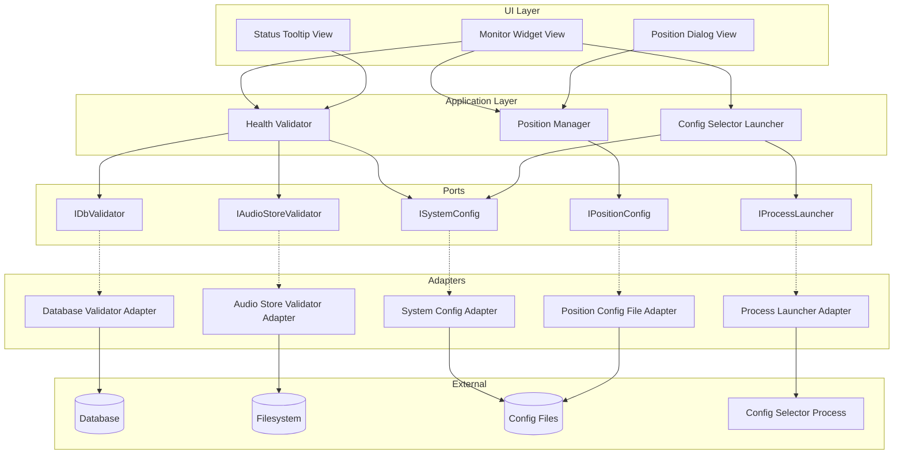
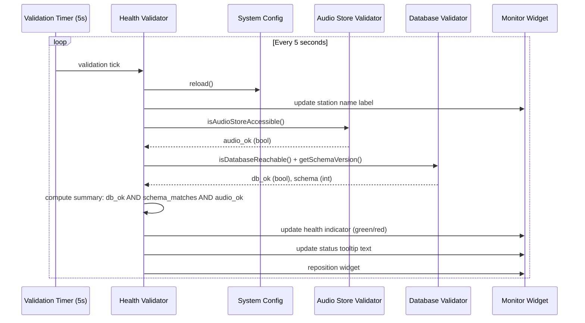
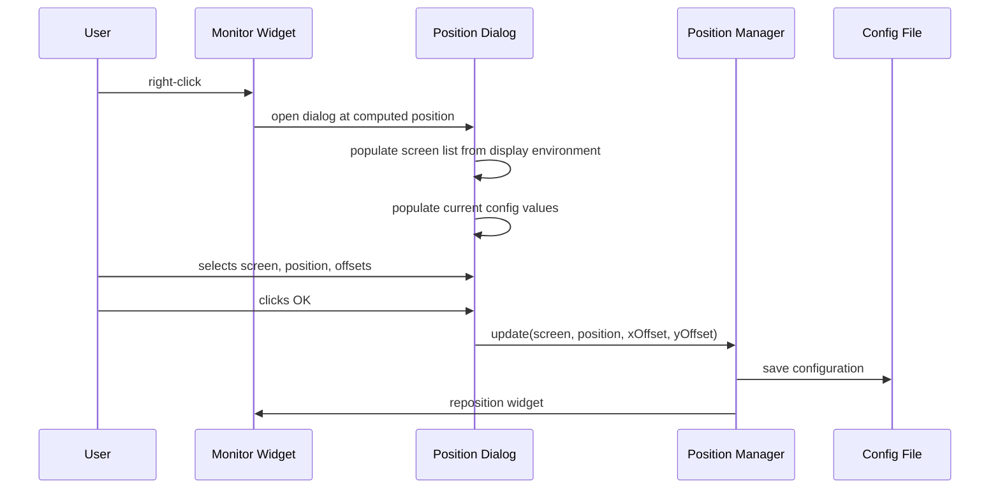
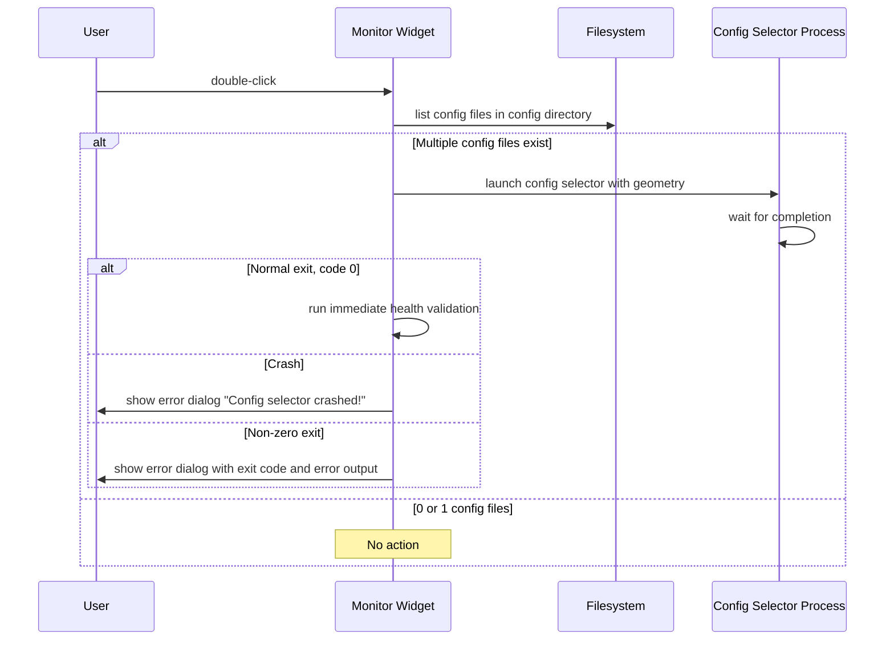
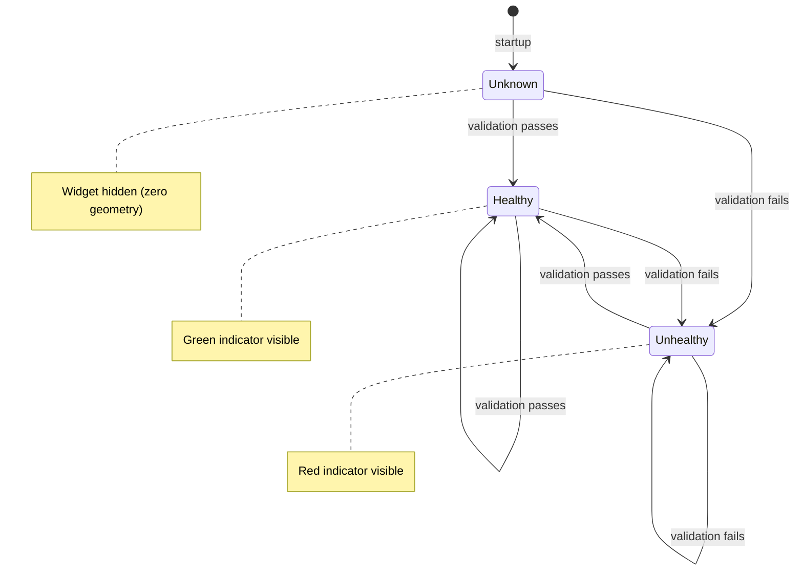
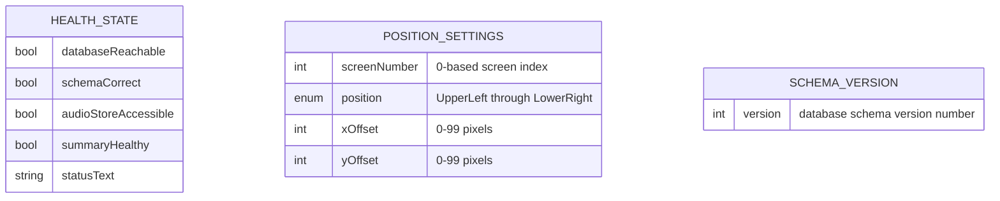

# Design Document

## Overview

RDMonitor is a lightweight system health monitor for the Rivendell broadcast automation platform. It presents a compact, frameless, always-on-top widget on the operator's desktop that continuously validates database connectivity, schema integrity, and audio storage availability. The widget displays a green or red indicator at a glance, with detailed status available on hover.

**Purpose**: Provide broadcast operators with continuous, non-intrusive visibility into critical infrastructure health so that problems are detected before they impact live broadcast operations.

**Users**: Broadcast operators and system administrators who need to monitor station infrastructure health during daily operations.

**Impact**: This component depends on the core library for database validation, audio store validation, system configuration, and position configuration persistence. It also interacts with the configuration selector application for multi-configuration station management.

### Goals
- Provide real-time health status for database and audio storage subsystems
- Minimize screen footprint while remaining always visible
- Support multi-monitor environments with configurable positioning
- Enable quick access to configuration switching on multi-config stations

### Non-Goals
- Monitoring network connectivity to other Rivendell daemons (audio engine, RPC daemon, etc.)
- Providing historical health data or trend analysis
- Sending alerts or notifications to remote systems
- Managing or restarting failed subsystems
- Replicating legacy absolute-positioning UI layout (new implementation uses modern declarative UI)

## Visual Design Reference

All UI/UX implementation decisions (colors, typography, spacing, component appearance, interaction patterns) are defined in the design system files. **Agents implementing UI components MUST read these before writing any visual code.**

| Layer | File | Scope |
|-------|------|-------|
| Global | `.blah/steering/design.md` | Typography, base palette, spacing, z-index, accessibility baseline |
| Spec | `design-system/MASTER.md` | rdmonitor-specific tokens (colors, states, layout, component specs) |
| Page | `design-system/pages/*.md` | Per-view overrides |

**Hierarchy:** page override > spec MASTER > global steering. Higher layers only define differences.

<!-- NOTE: design-system/ files are generated by the ui-ux-pro-max skill in a separate step.
     If design-system/ does not yet exist, this section serves as a placeholder indicating
     that visual design generation is required before implementation. -->

## Architecture

### Architecture Pattern & Boundary Map



**Architecture Integration**:
- Selected pattern: Hexagonal architecture per project steering
- Domain boundaries: Health validation logic, position management, and process launching are separate concerns connected through ports
- Existing patterns preserved: Signal/slot for event propagation, port/adapter for external dependencies
- Steering compliance: Domain logic has zero Qt dependency; all framework usage confined to adapters and UI

### Technology Stack

| Layer | Choice / Version | Role in Feature | Notes |
|-------|------------------|-----------------|-------|
| UI | Qt 6 / QML | Monitor widget, position dialog, status tooltip | Frameless, always-on-top window |
| Application | C++20 | Health validation orchestration, position management | Pure domain logic |
| Data / Storage | INI-style config file | Position persistence | Read/write via adapter |
| Data / Storage | SQL database (read-only) | Schema version check | Single SELECT query |
| Infrastructure | Filesystem | Audio store mount verification | Mount table inspection |
| External Process | Config selector | Multi-config station switching | Launched as child process |

## System Flows

### Health Validation Cycle (every 5 seconds)



### Position Configuration Flow



### Configuration Selector Launch Flow



### Monitor Health State Machine



## Requirements Traceability

| Requirement | Summary | Components | Interfaces | Flows |
|-------------|---------|------------|------------|-------|
| 1 | Periodic Health Validation | Health Validator, Database Validator Adapter, Audio Store Validator Adapter | IDbValidator, IAudioStoreValidator, ISystemConfig | Health Validation Cycle |
| 2 | Status Tooltip Display | Status Tooltip View, Health Validator | IDbValidator, IAudioStoreValidator | Health Validation Cycle |
| 3 | Widget Screen Positioning | Position Manager, Position Dialog View, Position Config File Adapter | IPositionConfig | Position Configuration Flow |
| 4 | Configuration Selector Launch | Config Selector Launcher, Process Launcher Adapter | IProcessLauncher, ISystemConfig | Config Selector Launch Flow |
| 5 | Process Lifecycle | Monitor Widget View, Health Validator, Position Manager | ISystemConfig, IPositionConfig | Health Validation Cycle |

## Components and Interfaces

| Component | Domain/Layer | Intent | Req Coverage | Key Dependencies | Contracts |
|-----------|--------------|--------|--------------|------------------|-----------|
| Health Validator | Application | Orchestrates periodic health checks and computes summary state | 1, 2 | IDbValidator (P0), IAudioStoreValidator (P0), ISystemConfig (P0) | Service, Event |
| Position Manager | Application | Manages widget screen position and configuration persistence | 3 | IPositionConfig (P0) | Service |
| Config Selector Launcher | Application | Launches external config selector process and handles results | 4 | IProcessLauncher (P0), ISystemConfig (P1) | Service |
| Monitor Widget View | UI | Main frameless always-on-top widget with health indicator | 1, 2, 3, 4, 5 | Health Validator (P0), Position Manager (P0) | State |
| Position Dialog View | UI | Modal dialog for configuring screen position | 3 | Position Manager (P0) | State |
| Status Tooltip View | UI | Floating label showing detailed health status on hover | 2 | Health Validator (P0) | State |
| Database Validator Adapter | Adapter | Checks database connectivity and reads schema version | 1 | Database (P0) | Service |
| Audio Store Validator Adapter | Adapter | Verifies audio storage filesystem accessibility | 1 | Filesystem (P0) | Service |
| System Config Adapter | Adapter | Reads system configuration (station name, credentials, audio root) | 1, 5 | Config file (P0) | Service |
| Position Config File Adapter | Adapter | Reads/writes position configuration to INI-style file | 3 | Config file (P0) | Service |
| Process Launcher Adapter | Adapter | Launches and monitors external processes | 4 | OS process (P0) | Service |

### Application Layer

#### Health Validator

| Field | Detail |
|-------|--------|
| Intent | Periodically validates database connectivity, schema version, and audio store accessibility; publishes health state changes |
| Requirements | 1, 2 |

**Responsibilities & Constraints**
- Runs validation cycle every 5 seconds via timer
- Computes composite health: all three checks must pass for healthy state
- Publishes health state changed event (green/red) and detailed status text
- Reloads system configuration each cycle to pick up external changes

**Dependencies**
- Outbound: IDbValidator -- database health check (P0)
- Outbound: IAudioStoreValidator -- audio store health check (P0)
- Outbound: ISystemConfig -- station name and configuration reload (P0)

**Contracts**: Service [x] / Event [x]

##### Service Interface
```typescript
interface HealthValidator {
  start(): void;
  stop(): void;
  validateNow(): void;
}
```

##### Event Contract
- Published events: healthStateChanged(healthy: bool), statusTextChanged(text: string)
- Subscribed events: timer tick (internal)

#### Position Manager

| Field | Detail |
|-------|--------|
| Intent | Manages widget screen position calculation and configuration persistence |
| Requirements | 3 |

**Responsibilities & Constraints**
- Calculates absolute screen coordinates from position enum, screen index, and offsets
- Clamps position to keep widget within desktop bounds
- Persists configuration changes to file

**Dependencies**
- Outbound: IPositionConfig -- load/save position settings (P0)

**Contracts**: Service [x]

##### Service Interface
```typescript
interface PositionManager {
  loadConfig(): Result<PositionConfig, Error>;
  saveConfig(config: PositionConfig): Result<void, Error>;
  calculateGeometry(config: PositionConfig, widgetWidth: int, widgetHeight: int, screenGeometries: list of Rectangle): Rectangle;
}
```

#### Config Selector Launcher

| Field | Detail |
|-------|--------|
| Intent | Launches the configuration selector process when multiple configs exist and handles exit results |
| Requirements | 4 |

**Responsibilities & Constraints**
- Checks filesystem for number of config files before launching
- Launches external process with geometry arguments
- Reports success, crash, or error exit to the UI layer

**Dependencies**
- Outbound: IProcessLauncher -- process execution (P0)
- Outbound: ISystemConfig -- config directory path (P1)

**Contracts**: Service [x]

##### Service Interface
```typescript
interface ConfigSelectorLauncher {
  hasMultipleConfigs(): bool;
  launch(geometry: string): Result<void, LaunchError>;
}

enum LaunchError {
  NotNeeded,    // 0 or 1 config files
  Crashed,      // abnormal termination
  ExitError     // non-zero exit code (with code and stderr)
}
```

### Ports

#### IDbValidator

```typescript
interface IDbValidator {
  checkConnection(): Result<SchemaInfo, DbError>;
}

type SchemaInfo = { reachable: bool, schemaVersion: int };
```

#### IAudioStoreValidator

```typescript
interface IAudioStoreValidator {
  isAccessible(): bool;
}
```

#### ISystemConfig

```typescript
interface ISystemConfig {
  reload(): void;
  stationName(): string;
  configDirectoryPath(): string;
  expectedSchemaVersion(): int;
}
```

#### IPositionConfig

```typescript
interface IPositionConfig {
  load(): Result<PositionSettings, Error>;
  save(settings: PositionSettings): Result<void, Error>;
  clear(): void;
}

type PositionSettings = {
  screenNumber: int,
  position: ScreenPosition,
  xOffset: int,      // 0-99
  yOffset: int        // 0-99
};

enum ScreenPosition {
  UpperLeft, UpperCenter, UpperRight,
  LowerLeft, LowerCenter, LowerRight
}
```

#### IProcessLauncher

```typescript
interface IProcessLauncher {
  launch(executable: string, args: list of string): Result<ProcessResult, LaunchError>;
}

type ProcessResult = { exitCode: int, stderr: string, crashed: bool };
```

## Data Models

### Domain Model

The monitor has a minimal domain model focused on two value objects:

- **HealthState**: Composite value representing the current system health (database reachable, schema correct, audio store accessible, summary healthy/unhealthy, status text)
- **PositionSettings**: Configuration value for widget screen placement (screen number, position enum, x/y offsets)

### Logical Data Model



### Physical Data Model

**Position Configuration File (INI format)**:
```ini
[Monitor]
ScreenNumber=0
Position=0
XOffset=0
YOffset=0
```

**Database Table: VERSION (read-only)**:
| Column | Type | Constraints |
|--------|------|-------------|
| DB | integer | Schema version number |

The monitor only performs a SELECT on this table to read the schema version. No writes.

**System Configuration File**: Read-only access to the station configuration file for database credentials, audio root path, audio store mount source, and station label.

## Error Handling

### Error Categories

**Status Errors (displayed in tooltip, non-blocking)**:
| Error | Category | Condition | Display |
|-------|----------|-----------|---------|
| Database Connection Failed | Infrastructure | Database validator returns unreachable | "Database: CONNECTION FAILED" |
| Schema Version Mismatch | Infrastructure | Schema version differs from expected | "Database: SCHEMA SKEWED" |
| Audio Store Unavailable | Infrastructure | Audio store validator returns inaccessible | "Audio Store: FAILED" |

These errors are non-blocking: the monitor continues operating and re-checks every 5 seconds. Multiple errors are combined in the status text.

**Critical Errors (displayed as modal dialog)**:
| Error | Category | Condition | Display |
|-------|----------|-----------|---------|
| Config Selector Crash | External Process | Process terminates abnormally | Error dialog: "Config selector crashed!" |
| Config Selector Error | External Process | Process exits with non-zero code | Error dialog: exit code + error output |

### Error Recovery
- Infrastructure errors (database, audio store) recover automatically on the next successful validation cycle
- Process launch errors require user acknowledgment via dialog dismissal

## Testing Strategy

### Unit Tests
- Health state computation: verify green when all checks pass, red when any single check fails
- Status text generation: verify correct text for each failure combination (DB fail, schema mismatch, audio fail, multiple failures)
- Position calculation: verify correct coordinates for all six positions across single and multi-screen setups
- Position clamping: verify widget stays within desktop bounds when offsets would push it outside
- Config selector guard: verify launch blocked when 0 or 1 config files exist

### Integration Tests
- Health validation cycle: verify timer fires, calls all validators, and publishes correct state
- Position configuration round-trip: verify save and reload produces identical settings
- Config selector lifecycle: verify process launch, normal exit triggers re-validation, crash triggers error dialog

### E2E Tests
- Startup: monitor widget appears on configured screen with correct station name
- Hover: mouse enter shows status tooltip, mouse leave hides it
- Right-click: opens position dialog, OK saves and repositions, Cancel discards
- Health indicator: simulate database down to verify red indicator, restore to verify green recovery
- Double-click: verify config selector launches when multiple configs exist
