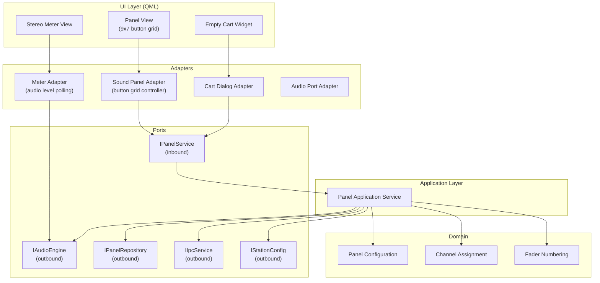
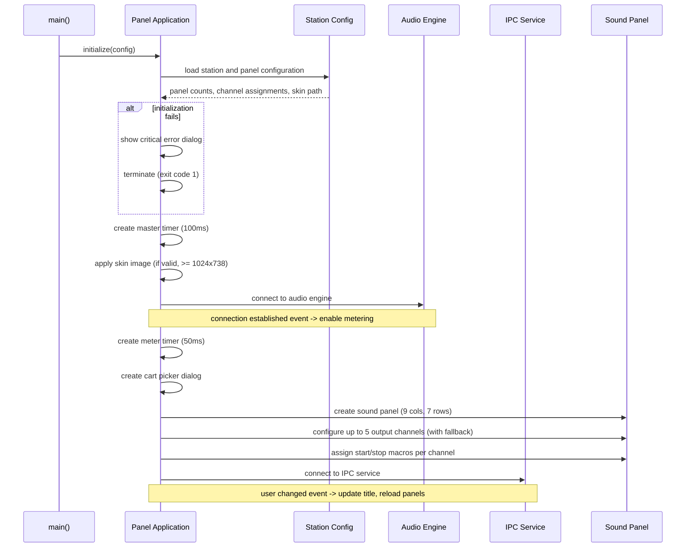
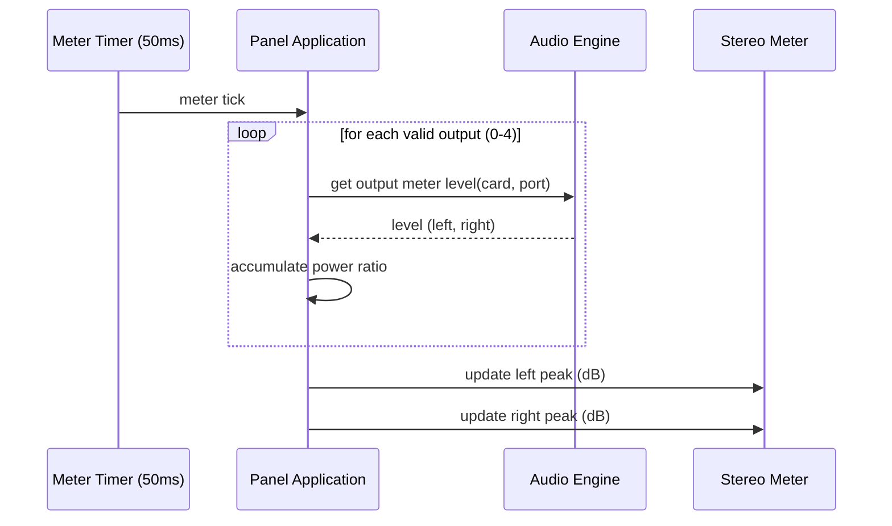
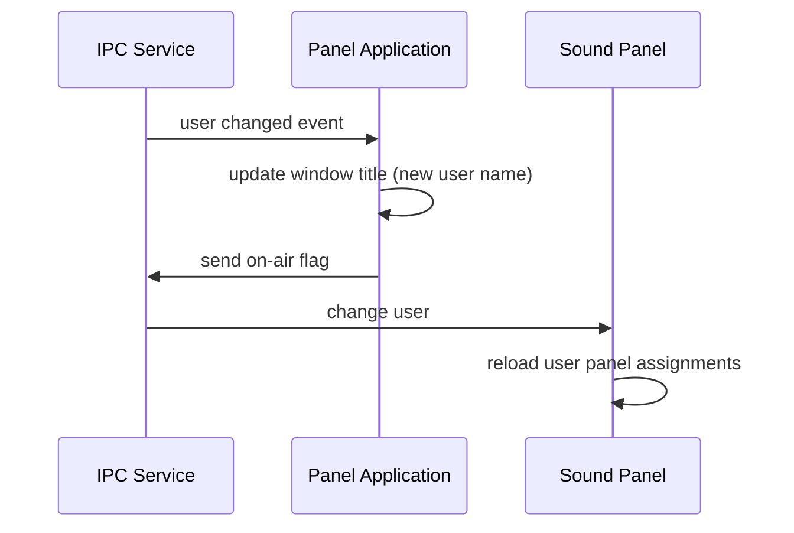
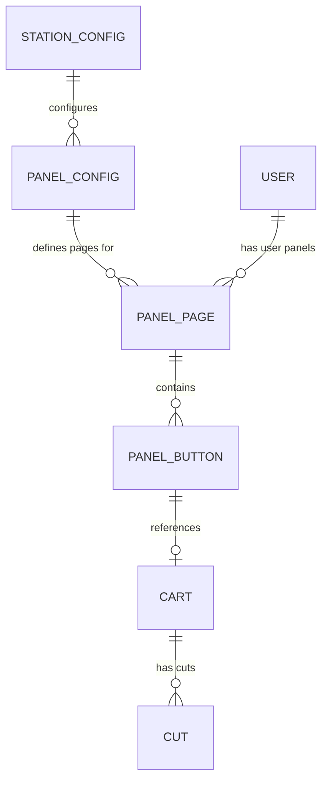

# Design Document

## Overview

**Purpose:** RDPanel is a standalone sound panel application that provides broadcast operators with a grid of configurable buttons for instant audio cart playback. It is a single-window, single-purpose tool within the Rivendell radio automation suite, connecting to the shared audio engine, inter-process communication services, and database to deliver low-latency panel-based triggering with real-time audio metering.

**Users:** Broadcast operators use RDPanel during live-assist or automated broadcasts to trigger sound effects, jingles, and other audio carts. Station administrators configure panel layouts, audio channel assignments, and visual skins.

**Impact:** RDPanel is a consumer of the core library (LIB) services. It reads panel configurations, cart metadata, and user assignments from the database. It delegates all audio playback to the audio engine and all button state management to the shared SoundPanel component. The application itself contains minimal business logic, acting primarily as a composition shell.

### Goals
- Provide a responsive 9x7 button grid for instant cart playback with up to 5 configurable audio output channels
- Display real-time stereo audio level metering across all active outputs
- Support station-wide and per-user panel button assignments with hot-switching on user change
- Support multiple panel pages with mouse wheel navigation
- Allow visual customization via configurable skin images
- Enable drag-and-drop cart assignment when the station permits it

### Non-Goals
- Implementing audio playback logic (delegated to audio engine via LIB)
- Managing panel button state machines (delegated to SoundPanel component in LIB)
- Providing log playback, scheduling, or library management features
- Supporting platform-specific audio stacks (original ALSA/JACK references are replaced by the portable audio engine)
- Implementing a complex menu or toolbar system (the application has no menus)

## Visual Design Reference

All UI/UX implementation decisions (colors, typography, spacing, component appearance, interaction patterns) are defined in the design system files. **Agents implementing UI components MUST read these before writing any visual code.**

| Layer | File | Scope |
|-------|------|-------|
| Global | `.blah/steering/design.md` | Typography, base palette, spacing, z-index, accessibility baseline |
| Spec | `design-system/MASTER.md` | rdpanel-specific tokens (colors, states, layout, component specs) |
| Page | `design-system/pages/*.md` | Per-view overrides |

**Hierarchy:** page override > spec MASTER > global steering. Higher layers only define differences.

<!-- NOTE: design-system/ files are generated by the ui-ux-pro-max skill in a separate step.
     If design-system/ does not yet exist, this section serves as a placeholder indicating
     that visual design generation is required before implementation. -->

## Architecture

### Architecture Pattern & Boundary Map

RDPanel follows the project-wide hexagonal architecture. The application is a thin composition shell that wires domain services, audio adapters, and UI together.



**Architecture Integration:**
- Selected pattern: Hexagonal (Ports & Adapters) per project steering
- Domain boundary: Panel configuration, channel assignment logic, fader numbering logic
- Application service: Orchestrates startup, wires audio channels, handles user changes
- All audio I/O through IAudioEngine port; all persistence through IPanelRepository port
- IPC (remote macro commands, user change events) through IIpcService port

### Technology Stack

| Layer | Choice / Version | Role in Feature | Notes |
|-------|------------------|-----------------|-------|
| Frontend / UI | Qt 6 / QML | Sound panel grid, stereo meter, empty cart widget | Declarative UI |
| Backend / Services | C++20 | Application service, domain logic | Hexagonal architecture |
| Data / Storage | Qt SQL (via repository port) | Panel assignments, cart metadata, station config | Read-heavy, writes delegated to SoundPanel |
| Messaging / Events | Qt signals/slots | Audio engine events, user change, meter polling, macro dispatch | Event-driven |
| Infrastructure / Runtime | Qt 6 platform | Cross-platform audio, windowing, timers | No platform-specific code |

## System Flows

### Application Startup



### Audio Metering Loop (50ms)



### User Change



## Requirements Traceability

| Requirement | Summary | Components | Interfaces | Flows |
|-------------|---------|------------|------------|-------|
| 1 | Startup and initialization | PanelApplication, StationConfig | IStationConfig, IAudioEngine, IIpcService | Application Startup |
| 2 | Sound panel display and configuration | SoundPanelAdapter, ChannelAssignment | IPanelService, IPanelRepository | Application Startup |
| 3 | Audio level metering | MeterAdapter, FaderNumbering | IAudioEngine | Audio Metering Loop |
| 4 | Panel navigation | SoundPanelAdapter | IPanelService | -- |
| 5 | Visual customization | PanelApplication | IStationConfig | Application Startup |
| 6 | Drag-and-drop cart assignment | EmptyCartWidget, CartDialogAdapter | IPanelService, IStationConfig | -- |
| 7 | Remote macro support | PanelApplication | IIpcService | -- |
| 8 | Application shutdown | PanelApplication | -- | -- |

## Components and Interfaces

| Component | Domain/Layer | Intent | Req Coverage | Key Dependencies | Contracts |
|-----------|--------------|--------|--------------|------------------|-----------|
| PanelApplication | App | Composition root: wires all services, manages lifecycle | 1, 5, 7, 8 | IAudioEngine (P0), IIpcService (P0), IStationConfig (P0), IPanelRepository (P0) | Service |
| SoundPanelAdapter | Adapters/UI | QML model for the 9x7 button grid with panel page navigation | 2, 4 | IPanelService (P0) | Service, State, Event |
| MeterAdapter | Adapters/UI | Polls audio engine for output levels and exposes to meter view | 3 | IAudioEngine (P0) | Service |
| CartDialogAdapter | Adapters/UI | Bridges cart picker dialog for button assignment | 6 | IPanelService (P1) | Service |
| EmptyCartWidget | UI | Drag-and-drop target for cart assignment | 6 | CartDialogAdapter (P1) | -- |
| ChannelAssignment | Domain | Determines effective audio channel configuration with fallback logic | 2, 3 | -- | -- |
| FaderNumbering | Domain | Assigns display numbers to output faders, deduplicating shared ports | 3 | -- | -- |
| PanelConfig | Domain | Value object holding panel counts, flash settings, pause enable, button label template | 2, 5 | -- | -- |

### Domain

#### ChannelAssignment

| Field | Detail |
|-------|--------|
| Intent | Determine the effective audio card and port for each of the 5 output channels, applying fallback rules when a channel is not explicitly configured |
| Requirements | 2, 3 |

**Responsibilities & Constraints**
- Accept 5 channel configurations (card/port pairs) from the panel configuration
- For channels 2-5 where card is less than 0 (not configured), apply the defined fallback: channel 2 falls back to main log 1 channel, channel 3 to main log 2 channel, channel 4 to sound panel 1 channel, channel 5 to cue channel
- Return the resolved set of 5 channel assignments as value objects
- Pure domain logic with no I/O

**Dependencies**
- None (standalone domain service)

**Contracts**: Service [ ]

##### Service Interface
```
interface IChannelAssignmentService {
    resolveChannels(
        explicit: list of ChannelConfig[5],
        fallbacks: FallbackConfig
    ) -> list of ResolvedChannel[5]
}
```
- Preconditions: exactly 5 channel configurations provided
- Postconditions: all 5 channels have valid card/port assignments (either explicit or fallback)

#### FaderNumbering

| Field | Detail |
|-------|--------|
| Intent | Assign sequential display numbers to output faders, sharing numbers when multiple outputs use the same card and port |
| Requirements | 3 |

**Responsibilities & Constraints**
- Accept the resolved list of 5 channel assignments
- Assign incrementing display numbers starting from 1 to unique card/port combinations
- Duplicate card/port combinations receive the same display number as their first occurrence
- Also determine meter validity: only the first occurrence of each card/port is valid for metering

**Dependencies**
- Inbound: ChannelAssignment output

**Contracts**: Service [ ]

##### Service Interface
```
interface IFaderNumberingService {
    assignNumbers(
        channels: list of ResolvedChannel[5]
    ) -> list of FaderInfo[5]
    // FaderInfo = { displayNumber: int, meterValid: bool }
}
```

### Application

#### PanelApplication

| Field | Detail |
|-------|--------|
| Intent | Composition root and lifecycle manager for the panel application |
| Requirements | 1, 5, 7, 8 |

**Responsibilities & Constraints**
- Initialize database, configuration, audio engine, and IPC connections at startup
- Apply skin image if configured and meets minimum size requirements (1024x738)
- Create and configure the sound panel with resolved channel assignments
- Handle user change events: update window title, send on-air flag, trigger panel reload
- Delegate received remote macro commands to the local macro handler
- On close: remove database connection and exit cleanly

**Dependencies**
- Outbound: IAudioEngine -- audio engine connection and metering (P0)
- Outbound: IIpcService -- user change events, on-air flag, macro reception (P0)
- Outbound: IStationConfig -- station name, drag-drop setting, skin path (P0)
- Outbound: IPanelRepository -- panel button assignments (P0)
- Domain: ChannelAssignment, FaderNumbering

**Contracts**: Service [ ] / Event [ ]

##### Service Interface
```
interface IPanelApplicationService {
    initialize(config: ApplicationConfig) -> Result<void, ErrorInfo>
    shutdown() -> void
}
```
- Preconditions: valid configuration file path
- Postconditions: all connections established or error reported

##### Event Contract
- Subscribed events: audioEngineConnected(bool), userChanged(), macroReceived(Macro)
- Published events: none (all state changes are internal or delegated)

### Adapters / UI

#### SoundPanelAdapter

| Field | Detail |
|-------|--------|
| Intent | QML-facing controller for the 9x7 button grid with panel page navigation and user panel switching |
| Requirements | 2, 4 |

**Responsibilities & Constraints**
- Expose a grid model (9 columns x 7 rows) of panel buttons to QML
- Support station panels and user panels with page navigation
- Handle mouse wheel events: scroll up navigates to previous page, scroll down to next page
- On user change: reload panel assignments from the repository
- Configure 5 output channels with start/stop macro strings

**Dependencies**
- Inbound: IPanelService -- panel CRUD and playback control (P0)
- Outbound: IPanelRepository -- panel button data (P0)
- Outbound: IAudioEngine -- playback control (P0)

**Contracts**: Service [ ] / State [ ] / Event [ ]

##### State Management
- State model: current panel page, current panel type (station/user), button assignments per page
- Persistence: loaded from database on startup and user change
- Concurrency: single-threaded (UI thread only)

##### Event Contract
- Subscribed events: userChanged (triggers panel reload)
- Published events: buttonPressed(channelIndex, cartNumber), pageChanged(pageIndex)

#### MeterAdapter

| Field | Detail |
|-------|--------|
| Intent | Polls the audio engine at 50ms intervals for output levels and exposes aggregated stereo peak data to the meter QML view |
| Requirements | 3 |

**Responsibilities & Constraints**
- Maintain a 50ms polling timer
- For each of 5 output channels, read left/right audio levels from the audio engine (only for meter-valid channels)
- Aggregate power ratios across valid outputs
- Convert to decibels and expose left/right peak values to QML

**Dependencies**
- Outbound: IAudioEngine -- output meter data (P0)
- Domain: FaderNumbering -- meter validity flags

**Contracts**: Service [ ]

##### Service Interface
```
interface IMeterService {
    start() -> void
    stop() -> void
    // Exposes properties: leftPeakDb, rightPeakDb (updated at 50ms)
}
```

## Data Models

### Domain Model

RDPanel has no direct database access. All persistence is delegated to the SoundPanel component and repository ports in LIB. The domain model relevant to this application:

- **PanelConfig** (value object): station panel count, user panel count, flash enabled, pause enabled, button label template, skin path, default service name
- **ChannelConfig** (value object): card number, port number, start macro string, stop macro string
- **ResolvedChannel** (value object): effective card, effective port, origin (explicit or fallback source)
- **FaderInfo** (value object): display number, meter validity flag

### Logical Data Model



- **STATION_CONFIG**: Station-level settings including drag-drop enable, skin path
- **PANEL_CONFIG**: Audio channel card/port assignments, panel counts, flash/pause settings
- **PANEL_PAGE**: A page of buttons (station-scoped or user-scoped)
- **PANEL_BUTTON**: A single button assignment within a page referencing a cart
- **CART**: Audio cart with metadata (title, type, group)
- **CUT**: Audio cut within a cart (actual audio data)
- **USER**: Authenticated user with panel permissions

### Physical Data Model

The physical schema is managed by the core library (LIB). Relevant tables (read-only from RDPanel's perspective):
- `STATIONS` -- station configuration
- `RDAIRPLAY` -- panel audio channel assignments
- `PANELS` -- panel button assignments (station and user)
- `CART` -- cart metadata
- `CUTS` -- audio cut data
- `USERS` -- user identity
- `SERVICES` -- default service name

## Error Handling

### Error Categories

**System Errors (critical, application terminates):**
- Application framework initialization failure (database unavailable, configuration missing) -- display error dialog, exit code 1
- Unrecognized command-line option -- display error dialog showing the unknown option, exit code 2

**Configuration Errors (graceful degradation):**
- Skin image not found or too small -- fall back to default window background
- Audio channel not configured (card < 0) -- apply fallback channel assignment
- Drag-and-drop disabled -- hide the empty cart widget (not an error, a configuration state)

### Monitoring
- Audio meter polling: if audio engine disconnects, metering stops gracefully (no crash)
- IPC connection: user change events stop arriving if IPC disconnects; panel continues with last known state

## Testing Strategy

### Unit Tests
- ChannelAssignment: verify fallback logic for channels 2-5 when card is not configured
- ChannelAssignment: verify no fallback when all channels are explicitly configured
- FaderNumbering: verify sequential numbering for unique card/port combinations
- FaderNumbering: verify shared numbering for duplicate card/port combinations
- FaderNumbering: verify meter validity (only first occurrence is valid)

### Integration Tests
- Application startup: verify database, audio engine, and IPC connections are established in correct order
- User change flow: verify window title update, on-air flag send, and panel reload
- Audio metering: verify 50ms polling produces correct aggregated dB values with mock audio engine

### E2E Tests
- Panel button click triggers audio playback on configured output channel
- Mouse wheel scroll navigates between panel pages
- Skin image is applied as window background when valid
- Empty cart widget visibility matches station drag-drop setting
- Application displays error dialog and exits when started with invalid configuration
