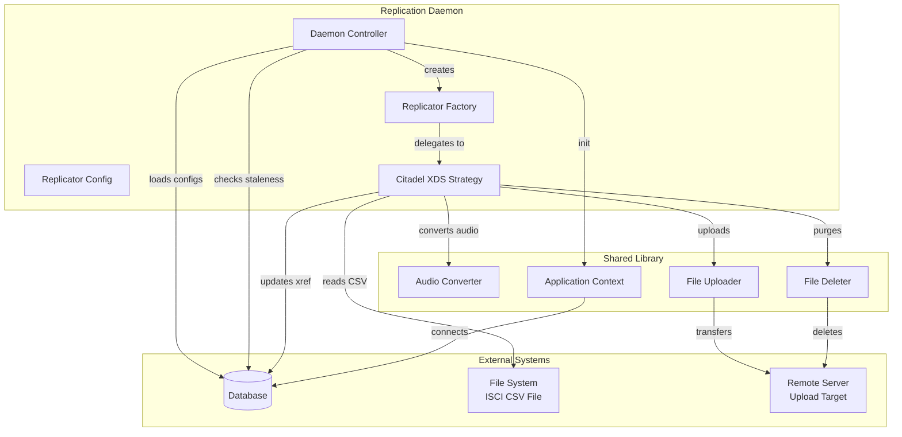
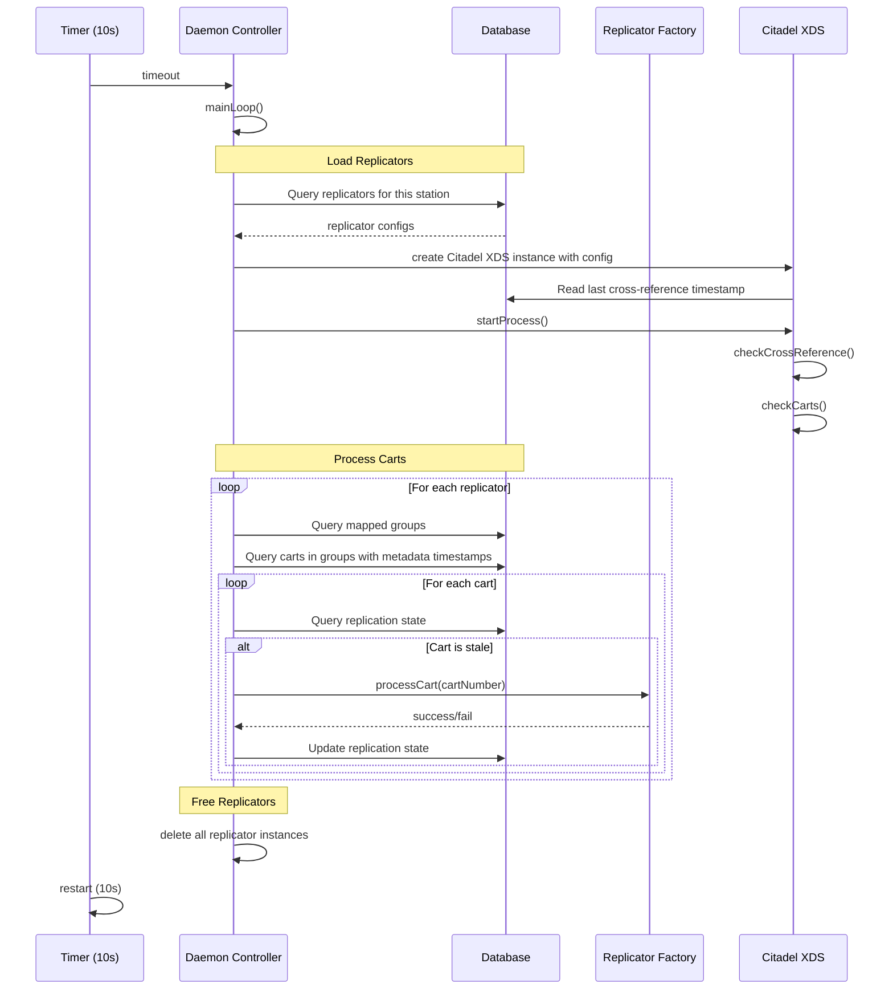
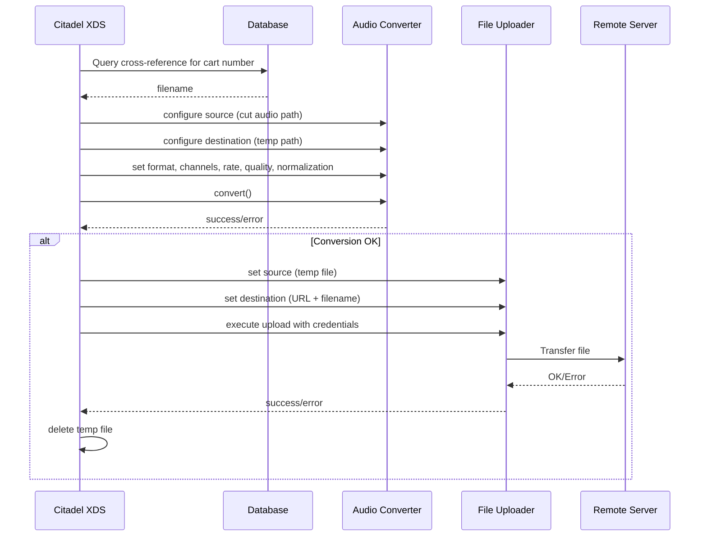
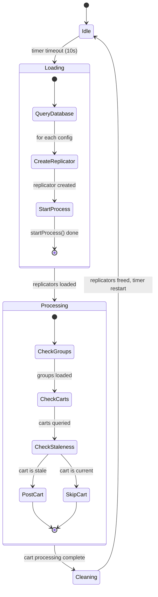
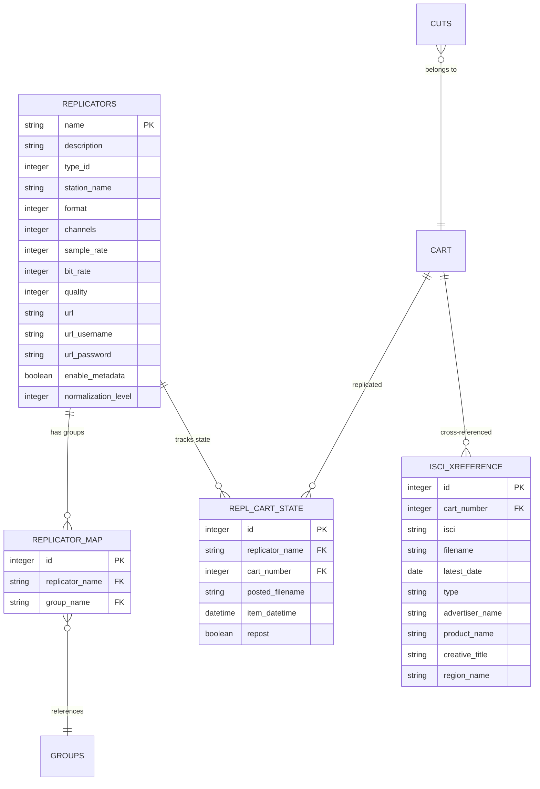

# Design Document: Replication Daemon

## Overview

**Purpose:** The Replication Daemon provides automated, periodic synchronization of audio content from the broadcast automation database to external distribution servers. It monitors cart metadata for changes, converts audio to the required format, and uploads files to configured remote destinations.

**Users:** Station operators benefit from automatic content distribution. System administrators configure replicator targets and monitor daemon health through logs.

**Impact:** This daemon bridges the internal content library with external distribution platforms. It reads from the cart and replicator configuration tables, maintains replication state records, and interacts with remote file servers for upload and deletion operations.

### Goals

- Automatically detect and replicate changed audio content to external servers
- Support pluggable replicator strategies via a factory pattern
- Parse and validate external cross-reference files for cart-to-filename mapping
- Convert audio to configurable formats with normalization and speed adjustment
- Purge stale remote files when cross-reference data changes
- Operate as a managed background service with clean lifecycle handling

### Non-Goals

- User interface for replication management (handled by administration application)
- Real-time streaming or live content distribution
- Multi-format simultaneous output per replicator (one format per replicator config)
- Direct management of replicator database records (handled by administration tools)
- Platform-specific audio device integration

## Architecture

### Architecture Pattern and Boundary Map



**Architecture Integration:**
- Selected pattern: Timer-driven batch processor with Strategy pattern for replicator types
- Domain boundaries: Daemon Controller owns lifecycle and scheduling; Replicator strategies own content processing logic
- The factory pattern allows adding new replicator types without modifying the core daemon loop

### Technology Stack

| Layer | Choice | Role | Notes |
|-------|--------|------|-------|
| Runtime | Background daemon process | Headless service | Managed by Service Manager (SVC) |
| Data | Relational database | Configuration, state tracking, cross-reference storage | Shared database with other system components |
| File I/O | File system | ISCI CSV file reading, temporary audio files | CSV parsed with quote-aware splitting |
| Network | File transfer protocol | Audio upload and deletion on remote servers | Supports URL-based destinations |
| Audio | Audio conversion library | Format conversion, normalization, speed adjustment | From shared library (LIB) |

## System Flows

### Main Processing Loop



### Audio Export and Upload Flow



### Replication Cycle State Machine



## Requirements Traceability

| Requirement | Summary | Components | Interfaces | Flows |
|-------------|---------|------------|------------|-------|
| 1 | Periodic replication scan | Daemon Controller | Timer event | Main Processing Loop |
| 2 | Replicator configuration management | Replicator Config, Daemon Controller | Database queries | Main Processing Loop (Load) |
| 3 | Cart staleness detection | Daemon Controller | Database state comparison | Main Processing Loop (Process) |
| 4 | ISCI cross-reference management | Citadel XDS | File system, Database | Main Processing Loop (Start) |
| 5 | ISCI CSV parsing and validation | Citadel XDS | File parser | Main Processing Loop (Start) |
| 6 | Audio export and upload | Citadel XDS | Audio Converter, File Uploader | Audio Export and Upload |
| 7 | Stale remote file purging | Citadel XDS | File Deleter, Database | Main Processing Loop (Start) |
| 8 | Daemon lifecycle management | Daemon Controller | Signal handlers, PID file | N/A (startup/shutdown) |

## Components and Interfaces

| Component | Domain/Layer | Intent | Req Coverage | Key Dependencies | Contracts |
|-----------|-------------|--------|--------------|------------------|-----------|
| Daemon Controller | Core / Orchestration | Manages daemon lifecycle, timer, and replication cycle | 1, 2, 3, 8 | Database, Replicator Factory | Service, Batch, State |
| Replicator Config | Core / Data | Holds configuration properties for a replicator instance | 2 | None | State |
| Replicator Factory | Core / Strategy | Abstract interface for pluggable replicator implementations | 2, 3 | Replicator Config | Service |
| Citadel XDS | Strategy / Service | Concrete replicator for Citadel cross-distribution system | 4, 5, 6, 7 | Database, Audio Converter, File Uploader, File Deleter | Service, Batch |

### Core / Orchestration

#### Daemon Controller

| Field | Detail |
|-------|--------|
| Intent | Manages daemon initialization, periodic timer, and the load-process-free replication cycle |
| Requirements | 1, 2, 3, 8 |

**Responsibilities and Constraints**
- Initialize application context and database connection
- Parse command-line arguments (debug flag only)
- Register signal handlers for clean shutdown
- Write and manage process identifier file
- Drive the 10-second periodic scan cycle
- Load replicator instances from database configuration
- Detect stale carts by comparing metadata timestamps with replication state
- Delegate cart processing to the appropriate replicator strategy

**Dependencies**
- Outbound: Database -- replicator config, cart state, group mappings (Critical)
- Outbound: Replicator Factory -- cart processing delegation (Critical)
- External: Application Context from shared library -- initialization, config, logging (Critical)

**Contracts:** Service, Batch, State

##### Batch / Job Contract
- Trigger: Timer fires every 10 seconds
- Input: Replicator configurations from database, cart metadata timestamps
- Output: Updated replication state records
- Idempotency: Safe to re-run; stale detection prevents redundant processing

##### State Management
- State model: Idle -> Loading -> Processing -> Cleaning -> Idle
- Persistence: Replication state stored in REPL_CART_STATE table
- Concurrency: Single-threaded timer-driven loop; no concurrent access concerns

### Core / Data

#### Replicator Config

| Field | Detail |
|-------|--------|
| Intent | Value object holding all configuration properties for a single replicator |
| Requirements | 2 |

**Responsibilities and Constraints**
- Store replicator type, name, station, description
- Store audio format settings (format, channels, sample rate, bit rate, quality)
- Store upload destination (URL, username, password)
- Store feature flags (metadata enablement, normalization level)
- Provide clear/reset to defaults

**Dependencies**
- None (pure data object)

**Contracts:** State

##### State Management
- State model: Immutable after loading from database
- Fields: type, name, stationName, description, format, channels, sampleRate, bitRate, quality, url, urlUsername, urlPassword, enableMetadata, normalizeLevel

### Core / Strategy

#### Replicator Factory

| Field | Detail |
|-------|--------|
| Intent | Abstract interface defining the contract for all replicator implementations |
| Requirements | 2, 3 |

**Responsibilities and Constraints**
- Define startProcess() for initialization after loading
- Define processCart(cartNumber) for processing a single cart
- Hold reference to replicator configuration
- Support polymorphic dispatch via factory pattern

**Dependencies**
- Inbound: Daemon Controller -- lifecycle management (Critical)
- Inbound: Replicator Config -- configuration data (Critical)

**Contracts:** Service

##### Service Interface
```
interface ReplicatorService {
  startProcess(): void
  processCart(cartNumber: number): boolean
  getConfig(): ReplicatorConfig
}
```
- Preconditions: Config must be loaded before startProcess()
- Postconditions: processCart returns true on success, false on failure
- Invariants: Config reference remains valid for the lifetime of the instance

### Strategy / Service

#### Citadel XDS

| Field | Detail |
|-------|--------|
| Intent | Concrete replicator strategy implementing the Citadel cross-distribution protocol |
| Requirements | 4, 5, 6, 7 |

**Responsibilities and Constraints**
- Check and reload ISCI cross-reference CSV file when modified
- Parse 9-field CSV records with validation (cart number, date, filename)
- Reject filenames containing illegal characters per Citadel specification
- Look up carts in cross-reference data (type R or B, not expired)
- Convert audio to configured format with optional normalization and speed adjustment
- Upload converted audio to remote server
- Purge remote files no longer in cross-reference data
- Track last cross-reference file modification time

**Dependencies**
- Outbound: Database -- cross-reference data, replication state, version tracking (Critical)
- Outbound: Audio Converter from shared library -- format conversion (Critical)
- Outbound: File Uploader from shared library -- remote upload (Critical)
- Outbound: File Deleter from shared library -- remote deletion (Critical)
- Inbound: File System -- ISCI CSV file (Critical)

**Contracts:** Service, Batch

##### Service Interface
```
interface CitadelXdsService extends ReplicatorService {
  startProcess(): void
  processCart(cartNumber: number): boolean
}
```

##### Batch / Job Contract
- Trigger: Called by Daemon Controller via startProcess() and processCart()
- Input: ISCI cross-reference CSV file, cart audio data
- Output: Uploaded audio files on remote server, updated state records
- Idempotency: Cross-reference reload is idempotent (clear + re-insert); uploads are overwrite-safe

## Data Models

### Domain Model

- **Replicator**: Configuration entity defining a replication target (station, format, destination)
- **Replicator Group Mapping**: Association between a replicator and the cart groups it manages
- **Replication State**: Tracks per-cart replication status (last processed timestamp, posted filename, repost flag)
- **ISCI Cross-Reference**: Maps cart numbers to distribution filenames with expiry dates and advertiser metadata
- **Cart**: Audio content unit (read-only in this context; owned by the content library)
- **Cut**: Audio segment within a cart (read-only; source for audio export)

### Logical Data Model



**Entity Definitions:**

**Replicators**
| Column | Type | Constraints |
|--------|------|-------------|
| name | string(32) | Primary key |
| description | string(64) | Optional |
| type_id | integer | Not null; identifies replicator strategy type |
| station_name | string(64) | Filters replicators per station |
| format | integer | Audio format enum, default 0 |
| channels | integer | Channel count, default 2 |
| sample_rate | integer | Sample rate in Hz, system default |
| bit_rate | integer | Encoding bit rate, default 0 |
| quality | integer | Encoding quality, default 0 |
| url | string(255) | Remote upload destination |
| url_username | string(64) | Authentication username |
| url_password | string(64) | Authentication password |
| enable_metadata | boolean | Default false |
| normalization_level | integer | Default 0 (disabled) |

**Replicator Map**
| Column | Type | Constraints |
|--------|------|-------------|
| id | integer | Primary key, auto-increment |
| replicator_name | string(32) | Foreign key to Replicators |
| group_name | string(10) | Foreign key to Groups |

**Replication Cart State**
| Column | Type | Constraints |
|--------|------|-------------|
| id | integer | Primary key, auto-increment |
| replicator_name | string(32) | Foreign key to Replicators |
| cart_number | integer | Foreign key to Cart |
| posted_filename | string(255) | Filename uploaded to remote server |
| item_datetime | datetime | Timestamp of last successful replication |
| repost | boolean | Default false; forces re-upload when true |

Unique constraint: (replicator_name, cart_number, posted_filename)

**ISCI Cross-Reference**
| Column | Type | Constraints |
|--------|------|-------------|
| id | integer | Primary key, auto-increment |
| cart_number | integer | Foreign key to Cart |
| isci | string(32) | ISCI code |
| filename | string(64) | Distribution filename |
| latest_date | date | Expiry date for this reference |
| type | string(1) | R=Regular, B=Bonus |
| advertiser_name | string(30) | Optional metadata |
| product_name | string(35) | Optional metadata |
| creative_title | string(30) | Optional metadata |
| region_name | string(80) | Optional metadata |

### Physical Data Model

The tables described above represent the existing schema from the source system. Migration to the target platform should preserve the logical structure while adapting data types to the target database engine.

Key indexes:
- REPLICATORS: index on type_id
- REPLICATOR_MAP: indexes on replicator_name and group_name
- REPL_CART_STATE: unique index on (replicator_name, cart_number, posted_filename)
- ISCI_XREFERENCE: indexes on cart_number, (type, latest_date), latest_date

## Error Handling

### Error Categories

**System Errors (Fatal)**
| Error | Condition | Response |
|-------|-----------|----------|
| Database connection failure | Cannot connect at startup | Print error, exit with status 1 |
| PID file write failure | Cannot write process identifier | Print error, exit with status 1 |
| Unknown CLI option | Unrecognized command-line flag | Print error, exit with status 2 |

**Business Logic Errors (Warning)**
| Error | Condition | Response |
|-------|-----------|----------|
| ISCI file missing | Cross-reference file not found | Log warning, continue without reload |
| ISCI file unreadable | Cannot open cross-reference file | Log warning with OS error, continue |
| CSV line malformed | Line does not have 9 fields | Log warning with line number, skip record |
| Invalid date | Date field not valid MM/DD/YY | Log warning with line number, skip record |
| Invalid filename | Filename contains illegal characters | Log warning with filename and line, skip record |
| Audio conversion failure | Format conversion error | Log warning with details, skip cart |
| Upload failure | Remote transfer error | Log warning, clean temp file, skip cart |
| Remote deletion failure | Cannot delete stale remote file | Log warning, retain state for retry |

**Diagnostic Errors (Debug)**
| Error | Condition | Response |
|-------|-----------|----------|
| Invalid cart number | Cart number missing or out of range in CSV | Log debug, skip record |

### Monitoring

- All errors are logged via the system logging facility with appropriate severity levels
- Successful uploads and purges are logged at informational level for audit trail
- Daemon startup is logged at informational level

## Testing Strategy

### E2E Tests

1. **Periodic scan cycle**: Verify that the daemon executes a complete load-process-free cycle every 10 seconds
2. **Stale cart detection and upload**: Modify a cart's metadata, verify it is detected as stale, converted, and uploaded
3. **Cross-reference reload**: Update the ISCI CSV file, verify the cross-reference table is refreshed and stale files are purged
4. **Clean shutdown**: Send termination signal, verify PID file is removed and process exits cleanly

### Integration Tests

1. **Database replicator loading**: Verify correct replicator instances are created from database configuration
2. **CSV parsing with edge cases**: Test malformed lines, invalid dates, illegal filenames, out-of-range cart numbers
3. **Audio conversion pipeline**: Verify format conversion with normalization and speed adjustment
4. **Upload and deletion**: Verify file transfer to and deletion from remote server
5. **Cross-artifact flow**: Verify interaction with shared library components (audio converter, file uploader, file deleter)

### Unit Tests

1. **Staleness comparison**: Test metadata timestamp vs. replication state timestamp logic
2. **Filename validation**: Test all illegal character rejections per the Citadel specification
3. **CSV field parsing**: Test 9-field extraction with quoted values
4. **Replicator factory dispatch**: Test correct type instantiation for known and unknown type identifiers
5. **Configuration clear/reset**: Test that all config fields reset to defaults
6. **Date parsing**: Test MM/DD/YY format handling including edge cases
