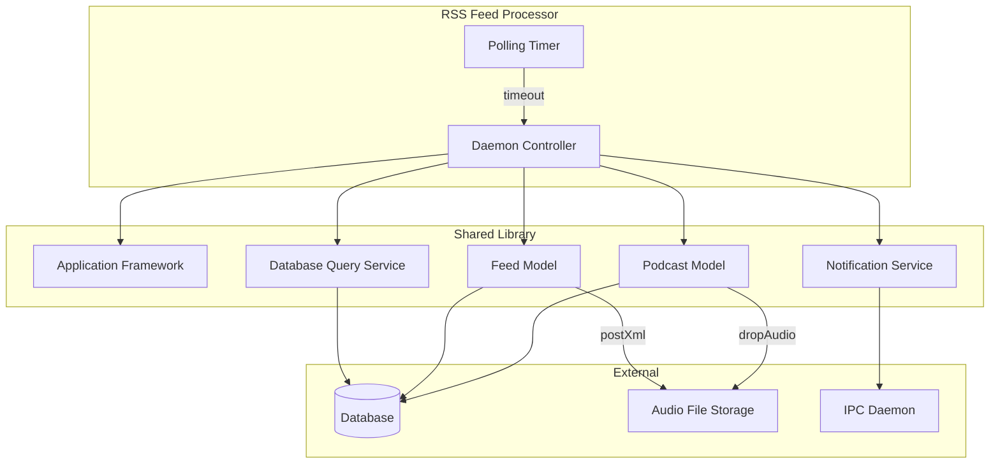
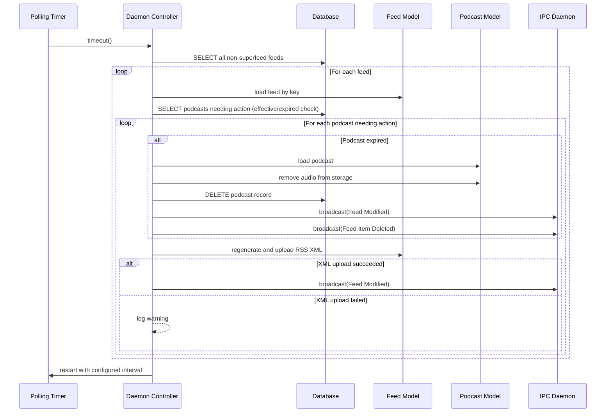
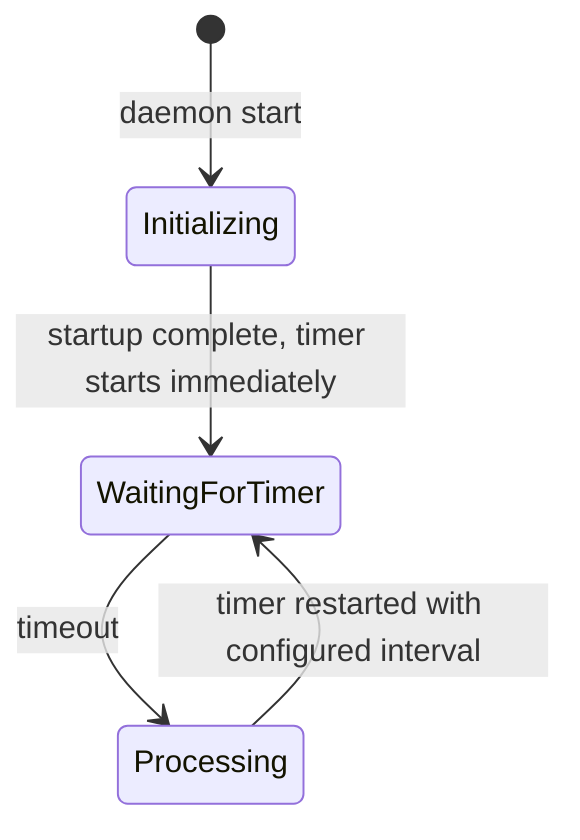
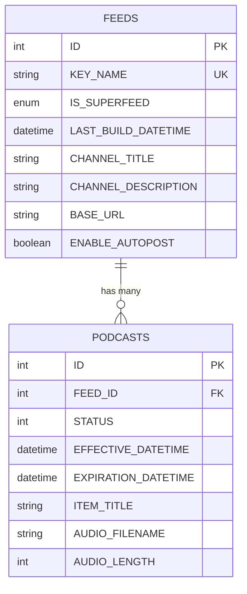

# Design Document: RSS Feed Processor (rdrssd)

## Overview

**Purpose:** The RSS Feed Processor is a background daemon that automates the lifecycle management of podcast episodes within RSS feeds. It ensures that published RSS XML documents remain current by detecting newly effective episodes, purging expired content, and regenerating feed documents on a configurable timer-based schedule.

**Users:** System administrators deploy and configure the daemon. Content managers benefit indirectly as their podcast feeds are kept up-to-date automatically.

**Impact:** This service modifies the FEEDS and PODCASTS data, removes audio files from storage, and broadcasts notifications that trigger UI updates across connected applications.

### Goals
- Automatically detect and purge expired podcast episodes (audio and metadata)
- Regenerate RSS XML documents when episode availability changes
- Broadcast change notifications so other system components stay synchronized
- Run as a low-privilege background process with configurable polling interval

### Non-Goals
- Superfeed processing (explicitly excluded; handled elsewhere)
- Podcast creation or editing (managed by other applications)
- User-facing interface (this is a headless daemon)
- Audio transcoding or format conversion
- Feed subscription management

## Architecture

### Architecture Pattern & Boundary Map

The daemon follows a simple timer-driven batch processor pattern. A single controller object manages the lifecycle: startup, privilege management, and a repeating timer that triggers feed scanning and processing.



**Architecture Integration:**
- Selected pattern: Timer-driven batch processor with single-shot restart
- Domain boundaries: Feed scanning (query layer) vs. feed processing (action layer)
- The daemon depends entirely on the shared library for data access, application framework, and IPC

### Technology Stack

| Layer | Choice | Role | Notes |
|-------|--------|------|-------|
| Runtime | Background daemon (headless) | Process lifecycle | No UI framework needed |
| Data | Relational database | Feed and podcast metadata | Shared schema with other system components |
| Storage | File/object storage | Podcast audio files | Accessed via library model classes |
| Messaging | IPC daemon connection | Change notifications | Broadcasts feed modification and item deletion events |
| Configuration | Config file + CLI arguments | Polling interval, privilege settings | `--process-interval` flag; config file for user/group IDs |

## System Flows

### Main Processing Cycle



### Daemon State Machine



## Requirements Traceability

| Requirement | Summary | Components | Interfaces | Flows |
|-------------|---------|------------|------------|-------|
| 1.1 | Drop root privileges | Daemon Controller | OS identity management | Startup |
| 1.2 | GID set failure exit | Daemon Controller | OS identity management | Startup |
| 1.3 | UID set failure exit | Daemon Controller | OS identity management | Startup |
| 1.4 | Custom polling interval | Daemon Controller | CLI argument parsing | Startup |
| 1.5 | Invalid interval rejection | Daemon Controller | CLI argument parsing | Startup |
| 1.6 | Unknown option rejection | Daemon Controller | CLI argument parsing | Startup |
| 1.7 | DB connection failure exit | Daemon Controller | Application Framework | Startup |
| 1.8 | Successful startup | Daemon Controller, Polling Timer | IPC connection, Timer | Startup |
| 1.9 | Default polling interval | Daemon Controller | Configuration | Startup |
| 2.1 | Scan non-superfeed feeds | Daemon Controller | Database Query Service | Main Processing Cycle |
| 2.2 | Superfeed exclusion | Daemon Controller | Database Query Service | Main Processing Cycle |
| 2.3 | Remove expired audio | Podcast Model | Audio File Storage | Main Processing Cycle |
| 2.4 | Delete expired record | Daemon Controller | Database Query Service | Main Processing Cycle |
| 2.5 | Broadcast feed modified on purge | Notification Service | IPC Daemon | Main Processing Cycle |
| 2.6 | Broadcast item deleted on purge | Notification Service | IPC Daemon | Main Processing Cycle |
| 2.7 | Log purge at info level | Daemon Controller | Logging | Main Processing Cycle |
| 2.8 | Audio purge failure non-fatal | Daemon Controller, Podcast Model | Logging | Main Processing Cycle |
| 2.9 | Repost XML on effective | Feed Model | Audio File Storage | Main Processing Cycle |
| 2.10 | Repost XML on expiration | Feed Model | Audio File Storage | Main Processing Cycle |
| 2.11 | Broadcast feed modified on repost | Notification Service | IPC Daemon | Main Processing Cycle |
| 2.12 | Log XML repost failure | Daemon Controller | Logging | Main Processing Cycle |
| 2.13 | Restart timer after cycle | Polling Timer | Timer | Main Processing Cycle |

## Components and Interfaces

| Component | Domain/Layer | Intent | Req Coverage | Key Dependencies | Contracts |
|-----------|-------------|--------|--------------|------------------|-----------|
| Daemon Controller | Application | Orchestrates startup, privilege management, and feed processing loop | 1.1-1.9, 2.1-2.13 | Application Framework (P0), Feed Model (P0), Podcast Model (P0) | Service, Batch |
| Feed Model | Data/Domain | Represents an RSS feed; provides XML regeneration and upload | 2.9-2.11 | Database (P0), File Storage (P0) | Service |
| Podcast Model | Data/Domain | Represents a podcast episode; provides audio file removal | 2.3-2.4, 2.8 | Database (P0), File Storage (P0) | Service |
| Notification Service | Messaging | Broadcasts change events to other system components | 2.5-2.6, 2.11 | IPC Daemon (P0) | Event |
| Polling Timer | Infrastructure | Single-shot timer that triggers processing cycles | 1.8, 1.9, 2.13 | -- | Batch |

### Application Layer

#### Daemon Controller

| Field | Detail |
|-------|--------|
| Intent | Orchestrates the entire daemon: startup initialization, privilege dropping, CLI parsing, and the periodic feed processing loop |
| Requirements | 1.1-1.9, 2.1-2.13 |

**Responsibilities & Constraints**
- Parse and validate command-line arguments at startup
- Drop root privileges to configured user/group before entering processing
- Connect to the IPC daemon for notification broadcasting
- On each timer cycle, iterate all non-superfeed feeds and process each for expired/effective episodes
- Coordinate podcast purge (audio removal + record deletion + notifications)
- Coordinate RSS XML regeneration on content changes
- Restart the timer after each cycle completes

**Dependencies**
- Inbound: Polling Timer -- triggers processing cycle (P0)
- Outbound: Feed Model -- load feed data, regenerate XML (P0)
- Outbound: Podcast Model -- load episode data, remove audio (P0)
- Outbound: Notification Service -- broadcast change events (P0)
- Outbound: Database Query Service -- direct queries for feed/podcast lists (P0)
- External: Application Framework -- DB connection, config, logging, CLI parsing (P0)

**Contracts**: Service [x] / Batch [x]

##### Batch / Job Contract
- Trigger: Polling timer timeout (configurable interval, default 30 seconds)
- Input: All non-superfeed feed records from database
- Output: Purged expired episodes, regenerated XML documents, broadcast notifications
- Idempotency: Safe to re-run; expired episodes already deleted will not be found again; XML repost is idempotent

### Data/Domain Layer

#### Feed Model

| Field | Detail |
|-------|--------|
| Intent | Represents an RSS feed and provides capability to regenerate and upload the feed's XML document |
| Requirements | 2.9, 2.10, 2.11 |

**Responsibilities & Constraints**
- Encapsulate feed metadata (key name, channel info, build datetime)
- Regenerate RSS XML document from current episode data
- Upload regenerated XML to the configured storage location
- Return success/failure status from XML posting

**Dependencies**
- Outbound: Database -- feed metadata persistence (P0)
- Outbound: File Storage -- XML document upload (P0)

**Contracts**: Service [x]

##### Service Interface
```
interface FeedModelService {
  loadByKey(keyName: string): Feed
  postXml(): Result<void, PostError>
  getKeyName(): string
}
```

#### Podcast Model

| Field | Detail |
|-------|--------|
| Intent | Represents a podcast episode and provides capability to remove associated audio files |
| Requirements | 2.3, 2.4, 2.8 |

**Responsibilities & Constraints**
- Encapsulate podcast episode metadata (title, dates, audio reference)
- Remove audio file from storage when episode expires
- Return success/failure status from audio removal (failure is non-fatal)

**Dependencies**
- Outbound: Database -- episode metadata persistence (P0)
- Outbound: File Storage -- audio file deletion (P0)

**Contracts**: Service [x]

##### Service Interface
```
interface PodcastModelService {
  loadById(id: number): Podcast
  dropAudio(feed: Feed): Result<void, PurgeError>
  getTitle(): string
}
```

### Messaging Layer

#### Notification Service

| Field | Detail |
|-------|--------|
| Intent | Broadcasts change notifications to other system components via the IPC daemon |
| Requirements | 2.5, 2.6, 2.11 |

**Responsibilities & Constraints**
- Send feed modification notifications when feed content changes
- Send feed item deletion notifications when episodes are purged
- Requires active connection to the IPC daemon

**Dependencies**
- Outbound: IPC Daemon -- notification delivery (P0)

**Contracts**: Event [x]

##### Event Contract
- Published events:
  - `FeedModified(feedId)` -- broadcast when a feed's XML is regenerated or an episode is purged
  - `FeedItemDeleted(feedId, itemId)` -- broadcast when a specific episode is removed
- Subscribed events: None
- Ordering / delivery guarantees: Fire-and-forget via IPC daemon; no guaranteed ordering

## Data Models

### Domain Model

The daemon operates on two primary entities:

- **Feed**: Represents an RSS feed channel with metadata, configuration, and build tracking. Feeds can be marked as "superfeeds" which are aggregation feeds excluded from direct processing.
- **Podcast (Episode)**: Represents an individual episode within a feed. Episodes have effective and expiration datetimes that control their visibility lifecycle.

**Business Rules:**
- A feed has zero or more podcast episodes
- Only non-superfeed feeds are processed by this daemon
- Episodes become visible when their effective datetime passes
- Episodes are purged when their expiration datetime passes
- Purging removes both the audio file and the database record

### Logical Data Model



**Feed entity:**
| Attribute | Type | Constraints | Description |
|-----------|------|-------------|-------------|
| ID | integer | Primary key, auto-increment | Unique feed identifier |
| KEY_NAME | string(8) | Unique, not null | Short key used to reference the feed |
| IS_SUPERFEED | enum (Y/N) | Default N | Whether this is an aggregation feed (excluded from processing) |
| LAST_BUILD_DATETIME | datetime | | Timestamp of last XML regeneration |
| CHANNEL_TITLE | string(255) | | RSS channel title |
| CHANNEL_DESCRIPTION | text | | RSS channel description |
| BASE_URL | string(255) | | Base URL for feed content |
| ENABLE_AUTOPOST | enum (Y/N) | Default N | Whether automatic posting is enabled |

**Podcast (Episode) entity:**
| Attribute | Type | Constraints | Description |
|-----------|------|-------------|-------------|
| ID | integer | Primary key, auto-increment | Unique episode identifier |
| FEED_ID | integer | Foreign key to Feed, not null | Parent feed reference |
| STATUS | integer | Default 1 | Episode status code |
| EFFECTIVE_DATETIME | datetime | | When the episode becomes visible |
| EXPIRATION_DATETIME | datetime | | When the episode expires and should be purged |
| ITEM_TITLE | string(255) | | Episode title |
| AUDIO_FILENAME | string(255) | | Reference to the audio file in storage |
| AUDIO_LENGTH | integer | | Audio file size in bytes |

### Physical Data Model

The database schema is shared across the entire system. This daemon reads from and writes to the FEEDS and PODCASTS tables. Key indexes:

- FEEDS: KEY_NAME (unique index), IS_SUPERFEED (index for filtering)
- PODCASTS: compound index on (FEED_ID, ORIGIN_DATETIME)

## Error Handling

### Error Categories and Responses

**System Errors (fatal -- daemon exits):**
| Error | Condition | Response | Exit Code |
|-------|-----------|----------|-----------|
| Database connection failure | Cannot connect to database at startup | Print error message, exit | 1 |
| Privilege drop failure (GID) | Cannot set group identity | Log error, exit | 1 |
| Privilege drop failure (UID) | Cannot set user identity | Log error, exit | 1 |
| Invalid CLI argument | `--process-interval` is not a valid positive integer | Print error message, exit | 1 |
| Unknown CLI option | Unrecognized command-line argument | Log error, exit | 2 |

**Operational Warnings (non-fatal -- processing continues):**
| Error | Condition | Response |
|-------|-----------|----------|
| Audio purge failure | Audio file cannot be removed from storage | Log warning; continue with database record deletion |
| XML repost failure | RSS XML regeneration or upload fails | Log warning with feed key and episode ID; continue processing |

### Monitoring
- All purge operations logged at informational level for audit trail
- Audio purge failures logged at warning level with episode ID, title, feed key, and error details
- XML repost failures logged at warning level with feed key and episode ID

## Testing Strategy

### E2E Tests
1. Start daemon, verify it processes a feed with an expired episode (audio removed, record deleted, notifications sent)
2. Start daemon, verify a newly effective episode triggers XML regeneration
3. Start daemon with superfeed in database, verify the superfeed is excluded from processing
4. Start daemon with `--process-interval 60`, verify the 60-second interval is used
5. Start daemon with invalid `--process-interval`, verify it exits with code 1

### Integration Tests
1. Feed processing cycle: insert test feed and podcast with past expiration, trigger processing, verify database state and notification broadcasts
2. XML repost on effective datetime: insert podcast with recently passed effective datetime, trigger processing, verify XML regeneration
3. Audio purge failure tolerance: simulate storage failure during audio removal, verify podcast record is still deleted
4. Cross-component notification: verify IPC daemon receives correct notification types (feed modified, feed item deleted)

### Unit Tests
1. Superfeed exclusion: verify query filter excludes feeds marked as superfeeds
2. Expiration detection: verify logic correctly identifies podcasts with expiration datetime in the past relative to last build datetime
3. Effective detection: verify logic correctly identifies podcasts with effective datetime in the past relative to last build datetime
4. CLI argument validation: verify valid and invalid `--process-interval` values are handled correctly
5. Privilege dropping logic: verify correct order of GID then UID setting
