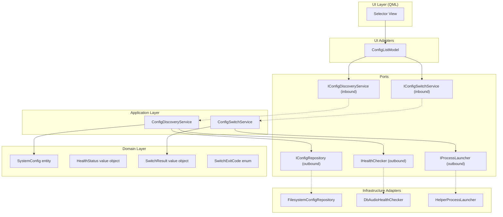
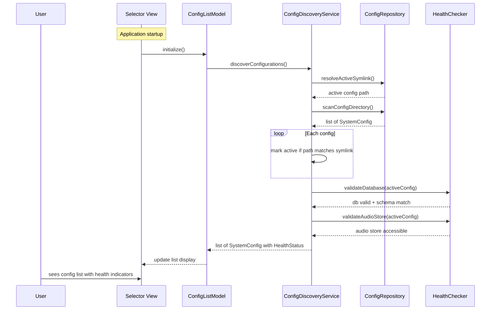
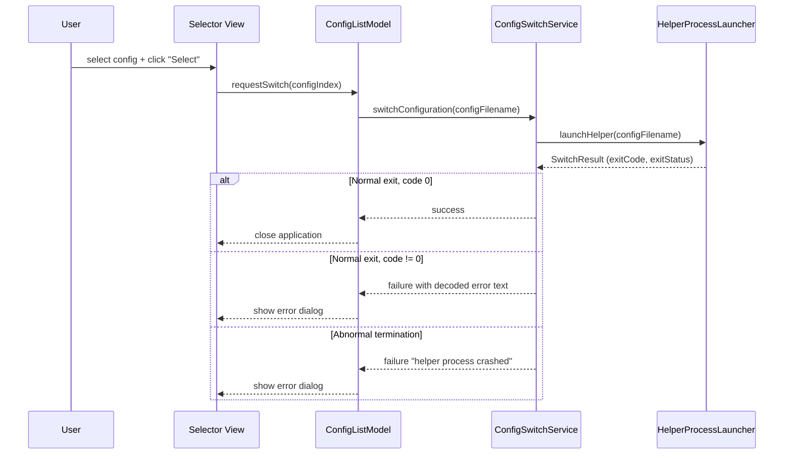

# Design Document

## Overview

**Purpose:** RDSelect delivers a focused utility for switching between multiple Rivendell system configurations on a single workstation. It scans available configuration files, validates the health of the active configuration (database + audio store), and delegates the actual switch operation to a privileged helper process.

**Users:** System administrators and broadcast operators who manage multi-environment Rivendell deployments (production, staging, test) on shared hardware.

**Impact:** Changes the active Rivendell system configuration by updating the configuration symlink and restarting system services. This affects all Rivendell applications on the workstation.

### Goals
- Discover and list all available system configurations from the configuration directory
- Validate the active configuration's database and audio store health with clear visual indicators
- Provide a secure configuration switch mechanism via a privileged helper process
- Position the window predictably relative to the monitor widget

### Non-Goals
- Editing or creating configuration files (out of scope, done by system administrators manually)
- Managing the helper process's privileged operations (symlink, service restart) within this application
- Direct database access or audio store manipulation (delegated to library validation functions)
- Platform-specific audio device configuration

## Visual Design Reference

All UI/UX implementation decisions (colors, typography, spacing, component appearance, interaction patterns) are defined in the design system files. **Agents implementing UI components MUST read these before writing any visual code.**

| Layer | File | Scope |
|-------|------|-------|
| Global | `.blah/steering/design.md` | Typography, base palette, spacing, z-index, accessibility baseline |
| Spec | `design-system/MASTER.md` | rdselect-specific tokens (colors, states, layout, component specs) |
| Page | `design-system/pages/*.md` | Per-view overrides |

**Hierarchy:** page override > spec MASTER > global steering. Higher layers only define differences.

<!-- NOTE: design-system/ files are generated by the ui-ux-pro-max skill in a separate step.
     If design-system/ does not yet exist, this section serves as a placeholder indicating
     that visual design generation is required before implementation. -->

## Architecture

### Architecture Pattern & Boundary Map

RDSelect follows the project-wide hexagonal architecture. Despite being a small single-window utility, it maintains clean separation between domain logic, ports, adapters, and UI.



### Technology Stack

| Layer | Choice | Role | Notes |
|-------|--------|------|-------|
| UI | Qt Quick / QML | Selector view with config list, status icons, buttons | Single-view application |
| UI Adapters | C++ QAbstractListModel | Expose config list and health status to QML | ConfigListModel |
| Application | C++ | Orchestrate discovery and switching | ConfigDiscoveryService, ConfigSwitchService |
| Domain | Pure C++ | Entities, value objects, exit code enum | No Qt dependency |
| Persistence | Qt Core (QDir, QFileInfo, QProcess) | Filesystem scanning, symlink resolution, process launch | Adapter layer only |
| Health Check | Core library port | Database + audio store validation | Delegates to library functions via port |

## System Flows

### Configuration Discovery and Validation (Startup)



### Configuration Switch



## Requirements Traceability

| Requirement | Summary | Components | Interfaces | Flows |
|-------------|---------|------------|------------|-------|
| 1 | Configuration Discovery | SystemConfig, ConfigDiscoveryService, FilesystemConfigRepository | IConfigRepository, IConfigDiscoveryService | Discovery flow |
| 2 | Configuration Validation | HealthStatus, DbAudioHealthChecker | IHealthChecker | Discovery flow (health check) |
| 3 | Configuration Switching | SwitchResult, SwitchExitCode, ConfigSwitchService, HelperProcessLauncher | IConfigSwitchService, IProcessLauncher | Switch flow |
| 4 | Helper Process Exit Codes | SwitchExitCode, SwitchResult | IProcessLauncher | Switch flow (error path) |
| 5 | Window Positioning | ConfigListModel, SelectorView | — | Startup |
| 6 | Internationalization | SelectorView (QML) | — | All views |

## Components and Interfaces

| Component | Domain/Layer | Intent | Req Coverage | Key Dependencies | Contracts |
|-----------|-------------|--------|--------------|------------------|-----------|
| SystemConfig | Domain | Represents a single system configuration with label and file path | 1 | — | — |
| HealthStatus | Domain | Represents validation result (database + audio store) | 2 | — | — |
| SwitchResult | Domain | Represents the outcome of a configuration switch attempt | 3, 4 | — | — |
| SwitchExitCode | Domain | Enumerates all possible helper process exit codes | 4 | — | — |
| ConfigDiscoveryService | App | Orchestrates config scanning and health validation | 1, 2 | IConfigRepository (P0), IHealthChecker (P0) | Service |
| ConfigSwitchService | App | Orchestrates the config switch via helper process | 3, 4 | IProcessLauncher (P0) | Service |
| FilesystemConfigRepository | Adapter | Scans config directory, resolves symlink | 1 | Qt Core (QDir, QFileInfo) | — |
| DbAudioHealthChecker | Adapter | Validates database and audio store for a config | 2 | Core library validation functions | — |
| HelperProcessLauncher | Adapter | Launches helper process and captures result | 3, 4 | Qt Core (QProcess) | — |
| ConfigListModel | Adapter/UI | Exposes config list to QML with health status | 1, 2, 3, 5 | ConfigDiscoveryService, ConfigSwitchService | State |
| SelectorView | UI | Single-window QML view with list, status icons, buttons | 1, 2, 3, 5, 6 | ConfigListModel | — |

### Domain Layer

#### SystemConfig (Entity)

| Field | Detail |
|-------|--------|
| Intent | Represents a loadable system configuration with its identity and active status |
| Requirements | 1 |

**Responsibilities & Constraints**
- Holds configuration label (display name), file path, and active flag
- Pure C++ value type, immutable after construction
- No database or filesystem access

#### HealthStatus (Value Object)

| Field | Detail |
|-------|--------|
| Intent | Captures the health validation result of a system configuration |
| Requirements | 2 |

**Responsibilities & Constraints**
- Tracks three validation dimensions: database reachable, schema version correct, audio store accessible
- Provides a single `isHealthy()` query returning true only when all three pass
- Pure C++ value type

#### SwitchExitCode (Enum)

| Field | Detail |
|-------|--------|
| Intent | Enumerates all possible outcomes from the helper process |
| Requirements | 4 |

**Responsibilities & Constraints**
- Maps integer exit codes (0-11) to named enum values
- Provides a `toDisplayText()` function returning human-readable error descriptions
- Pure C++ enum class

**Exit Code Values:**

| Code | Name | Description |
|------|------|-------------|
| 0 | Ok | Success |
| 1 | InvalidArguments | Invalid command-line arguments |
| 2 | NoSuchConfiguration | Configuration file not found |
| 3 | ModulesActive | Rivendell modules still running |
| 4 | NotRoot | Not running with required privileges |
| 5 | ServiceManagerCrashed | Service manager process crashed |
| 6 | ShutdownFailed | Failed to stop services |
| 7 | AudioUnmountFailed | Failed to unmount audio store |
| 8 | AudioMountFailed | Failed to mount audio store |
| 9 | StartupFailed | Failed to start services |
| 10 | NoCurrentConfig | No current configuration symlink |
| 11 | SymlinkFailed | Failed to create configuration symlink |

#### SwitchResult (Value Object)

| Field | Detail |
|-------|--------|
| Intent | Captures the outcome of a helper process invocation |
| Requirements | 3, 4 |

**Responsibilities & Constraints**
- Holds exit code (SwitchExitCode), normal/abnormal termination flag
- Provides `isSuccess()` and `errorText()` convenience methods
- Pure C++ value type

### Application Layer

#### ConfigDiscoveryService

| Field | Detail |
|-------|--------|
| Intent | Orchestrates configuration file scanning, active config identification, and health validation |
| Requirements | 1, 2 |

**Dependencies**
- Outbound: IConfigRepository -- scan configs, resolve symlink (P0)
- Outbound: IHealthChecker -- validate database and audio store (P0)

**Contracts**: Service [x]

##### Service Interface
```
interface IConfigDiscoveryService:
    discoverConfigurations() -> list of (SystemConfig, optional HealthStatus)
```
- Preconditions: Configuration directory path is known
- Postconditions: Returns all discovered configs; active config includes health status
- Invariants: Only the active configuration receives health validation

#### ConfigSwitchService

| Field | Detail |
|-------|--------|
| Intent | Orchestrates configuration switching by launching the helper process |
| Requirements | 3, 4 |

**Dependencies**
- Outbound: IProcessLauncher -- launch helper and capture result (P0)

**Contracts**: Service [x]

##### Service Interface
```
interface IConfigSwitchService:
    switchConfiguration(configFilename: string) -> SwitchResult
```
- Preconditions: configFilename is a valid configuration file path
- Postconditions: Returns SwitchResult with exit code and termination status
- Invariants: Helper process is always launched synchronously and its result fully captured

### Adapter Layer

#### FilesystemConfigRepository

| Field | Detail |
|-------|--------|
| Intent | Scans the configuration directory and resolves the active configuration symlink |
| Requirements | 1 |

**Dependencies**
- External: Qt Core (QDir, QFileInfo, QFile::symLinkTarget) -- filesystem operations

**Contracts**: Service [x]

##### Service Interface
```
interface IConfigRepository:
    scanConfigDirectory() -> list of SystemConfig
    resolveActiveSymlink() -> optional string (path to active config file)
```

#### DbAudioHealthChecker

| Field | Detail |
|-------|--------|
| Intent | Validates database connectivity, schema version, and audio store accessibility for a given config |
| Requirements | 2 |

**Dependencies**
- External: Core library validation functions (database validator, audio store validator, schema version constant)

**Contracts**: Service [x]

##### Service Interface
```
interface IHealthChecker:
    validateHealth(config: SystemConfig) -> HealthStatus
```

#### HelperProcessLauncher

| Field | Detail |
|-------|--------|
| Intent | Launches the configuration switch helper as a child process and captures its result |
| Requirements | 3, 4 |

**Dependencies**
- External: Qt Core (QProcess) -- process management

**Contracts**: Service [x]

##### Service Interface
```
interface IProcessLauncher:
    launchHelper(configFilename: string) -> SwitchResult
```

### UI Adapter Layer

#### ConfigListModel

| Field | Detail |
|-------|--------|
| Intent | Exposes configuration list with health status to QML and handles user switch requests |
| Requirements | 1, 2, 3, 5 |

**Dependencies**
- Inbound: IConfigDiscoveryService -- discover configs (P0)
- Inbound: IConfigSwitchService -- switch config (P0)

**Contracts**: State [x] / Event [x]

##### State Management
- State model: List of configs with labels, active flag, health status (healthy/unhealthy/unchecked)
- Persistence: None (transient, loaded at startup)
- Exposed QML roles: label, filePath, isActive, healthStatus

##### Event Contract
- Published events: `switchSucceeded()`, `errorOccurred(code, message)`
- Subscribed events: QML user actions (selectConfig, requestSwitch)

## Data Models

### Domain Model

RDSelect does not manage persistent data. Its domain model is entirely transient:

- **SystemConfig**: label (string), filePath (string), isActive (boolean)
- **HealthStatus**: databaseReachable (boolean), schemaCorrect (boolean), audioStoreAccessible (boolean)
- **SwitchResult**: exitCode (SwitchExitCode), normalTermination (boolean)
- **SwitchExitCode**: enumeration of 12 exit codes (0-11)

### Configuration Files (External, Read-Only)

| Path | Format | Purpose |
|------|--------|---------|
| `/etc/rd.conf` (or platform equivalent) | Symlink | Points to the currently active configuration file |
| Configuration directory (`/etc/rivendell.d/` or platform equivalent) | INI files | Individual system configurations |
| User preferences file | INI | Monitor widget position preferences |

Note: Actual paths should be configurable or injected, not hardcoded, to support cross-platform deployment.

## Error Handling

### Error Categories

| Category | Severity | Condition | User-Facing Message |
|----------|----------|-----------|---------------------|
| Helper crash | Critical | Helper process terminates abnormally | "Configuration switch helper process crashed" |
| Switch failed: invalid arguments | Error | Exit code 1 | "Invalid arguments passed to helper" |
| Switch failed: config not found | Error | Exit code 2 | "Selected configuration file not found" |
| Switch failed: modules active | Error | Exit code 3 | "Cannot switch while Rivendell modules are running" |
| Switch failed: insufficient privileges | Error | Exit code 4 | "Insufficient privileges to switch configuration" |
| Switch failed: service manager crash | Error | Exit code 5 | "Service manager process crashed" |
| Switch failed: shutdown failed | Error | Exit code 6 | "Failed to stop Rivendell services" |
| Switch failed: audio unmount failed | Error | Exit code 7 | "Failed to unmount audio store" |
| Switch failed: audio mount failed | Error | Exit code 8 | "Failed to mount audio store" |
| Switch failed: startup failed | Error | Exit code 9 | "Failed to start Rivendell services" |
| Switch failed: no current config | Error | Exit code 10 | "No current configuration symlink found" |
| Switch failed: symlink failed | Error | Exit code 11 | "Failed to create configuration symlink" |

### Error Strategy

All errors from the helper process are captured via exit code and translated to structured error information using the domain SwitchExitCode enum. The ConfigSwitchService translates exit codes to human-readable messages. The UI adapter emits `errorOccurred` signals that QML consumes to display error dialogs.

No exceptions are used. All error paths return structured results. The application remains open after any error so the user can retry.

## Testing Strategy

### Unit Tests
- SystemConfig entity construction and active flag logic
- HealthStatus `isHealthy()` logic (all three checks must pass)
- SwitchExitCode to display text mapping for all 12 codes
- SwitchResult `isSuccess()` and `errorText()` methods
- ConfigDiscoveryService with mock repository and health checker

### Integration Tests
- FilesystemConfigRepository scanning a test directory with sample config files
- FilesystemConfigRepository resolving a test symlink
- HelperProcessLauncher with a mock helper script returning various exit codes
- Full discovery flow: scan + validate with real filesystem adapter

### E2E Tests
- Application starts and displays discovered configurations
- Active configuration shows green checkmark when healthy
- Active configuration shows red X when unhealthy
- Double-clicking a configuration triggers switch flow
- Error dialog appears when switch fails
- Application closes on successful switch
