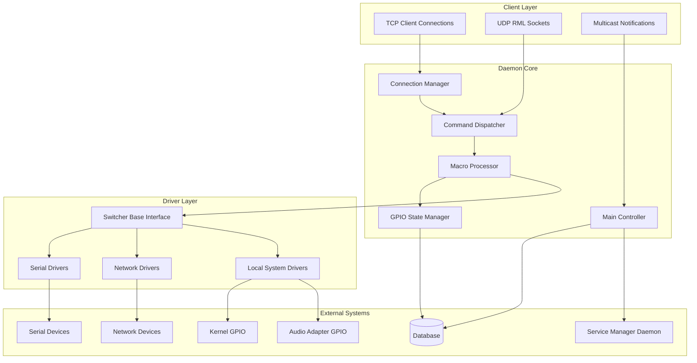
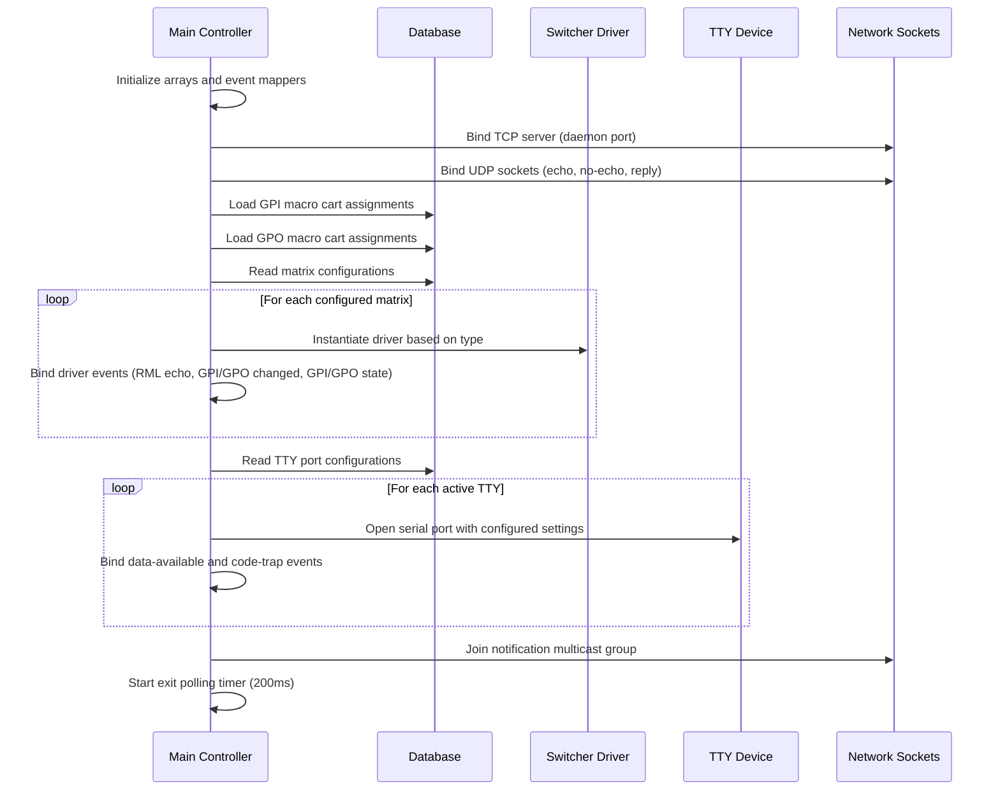
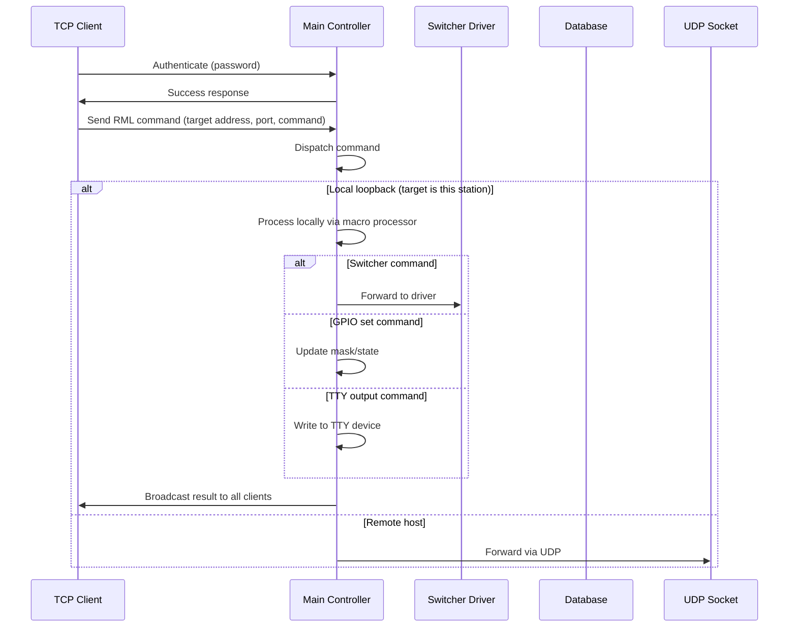
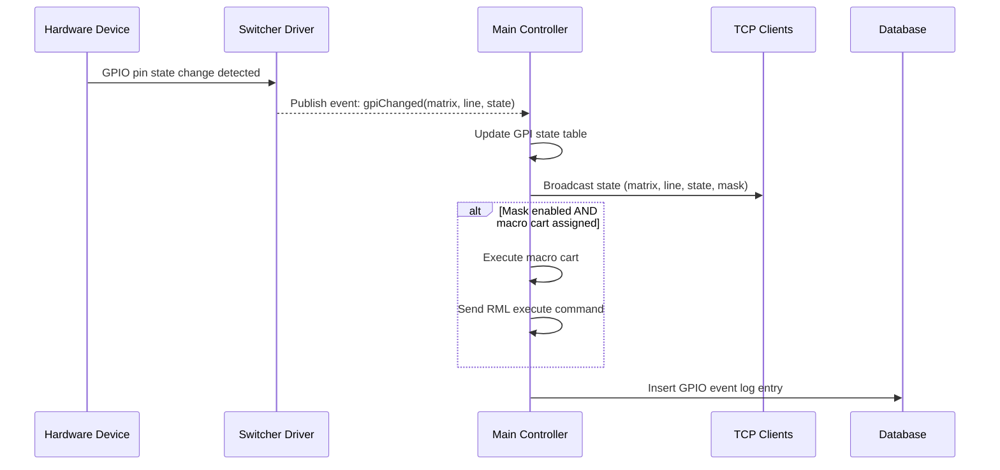
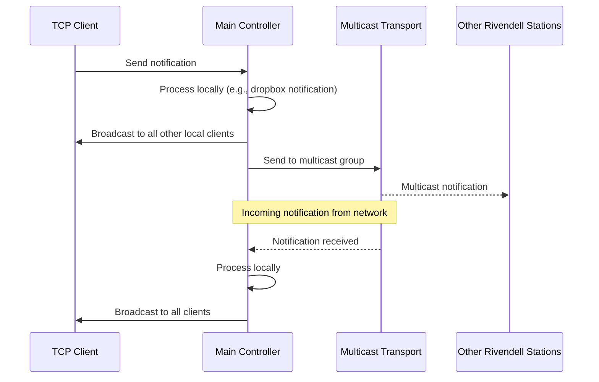
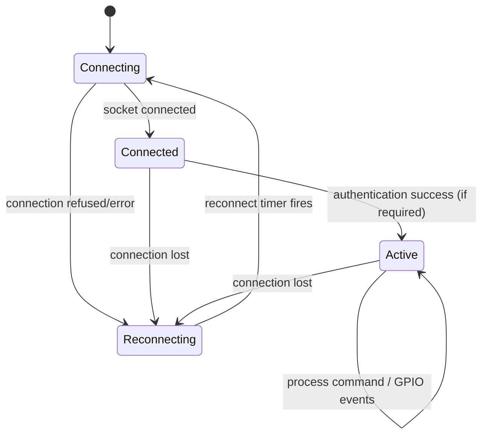
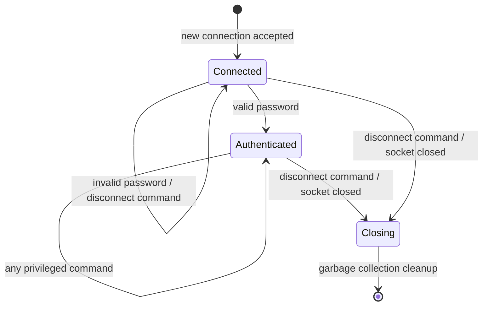
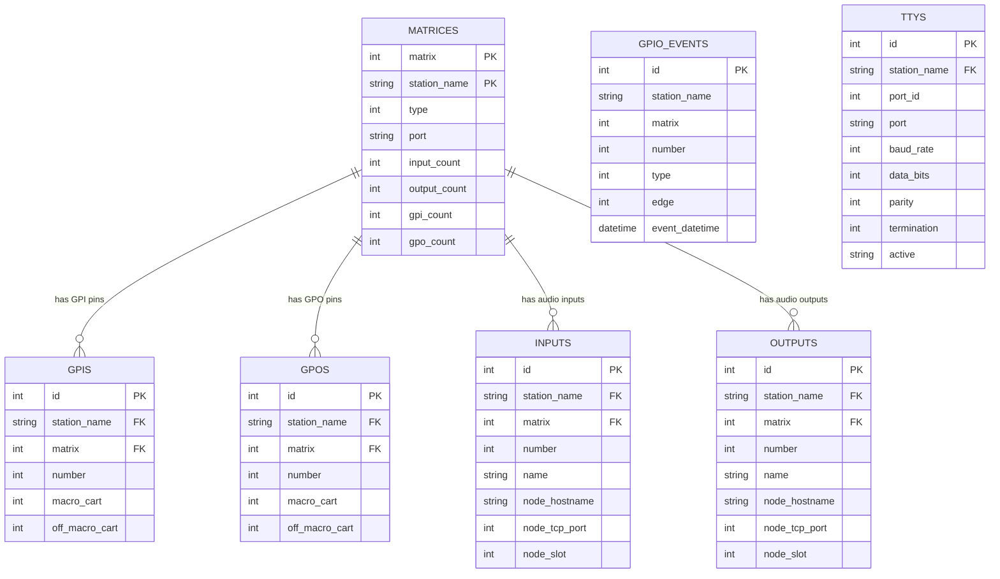

# Design Document: IPC Daemon (ripcd)

## Overview

**Purpose:** The IPC Daemon provides centralized hardware abstraction and inter-process communication for the Rivendell radio automation system. It translates logical commands from client applications into physical device actions, manages GPIO state across dozens of hardware device types, processes RML macro commands, and distributes notifications between system components.

**Users:** Client applications (airplay, library, log editors), other system daemons (service manager, catch daemon), and system administrators managing hardware configurations.

**Impact:** This daemon is the sole interface between Rivendell software components and physical broadcast hardware. All GPIO events, audio crosspoint switching, serial device communication, and inter-station notifications flow through it.

### Goals

- Provide a unified, driver-based abstraction for 40+ hardware switcher/GPIO device types
- Process RML macro commands with support for local execution, remote forwarding, and timed delays
- Manage GPIO state tables with masking, macro cart triggers, and event logging
- Distribute notifications between local clients and remote stations via multicast
- Maintain persistent connections to network-attached devices with automatic reconnection

### Non-Goals

- User interface (this is a headless daemon)
- Audio stream processing (handled by the audio engine daemon)
- Database schema management (tables are defined by the core library)
- Direct user authentication management (delegates to core library)
- Platform-specific audio APIs (JACK connectivity is a legacy feature marked for replacement)

## Architecture

### Architecture Pattern & Boundary Map



**Architecture Integration:**
- Selected pattern: Event-driven daemon with plugin driver architecture
- Domain boundaries: Connection management, command dispatch, GPIO state, driver abstraction
- Key pattern: Factory method for driver instantiation based on database-configured matrix type
- All drivers implement a common interface and communicate with the core via events

### Technology Stack

| Layer | Choice | Role | Notes |
|-------|--------|------|-------|
| Transport | TCP + UDP sockets | Client communication, RML routing | Fixed port numbers from configuration |
| Notification | UDP multicast | Inter-station event distribution | Multicast group address from system config |
| Data | Relational database | Matrix config, GPIO mappings, event logging | Shared database with other system components |
| Serial I/O | TTY devices | Communication with serial-attached hardware | Configurable baud rate, data bits, parity |
| Network I/O | TCP connections | Communication with network-attached hardware | Auto-reconnect on failure |

## System Flows

### Startup Sequence



### RML Command Flow (Client-Initiated)



### GPIO Event Flow (Hardware-Initiated)



### Notification Flow



### Network Driver Connection State



### Client Connection State



## Requirements Traceability

| Requirement | Summary | Components | Interfaces | Flows |
|-------------|---------|------------|------------|-------|
| 1 | Client connection management | Connection Manager, Main Controller | TCP Protocol | Startup, Client Connection State |
| 2 | RML command processing | Command Dispatcher, Macro Processor | TCP Protocol, UDP Sockets | RML Command Flow |
| 3 | Switcher driver management | Driver Factory, Switcher Base, All Drivers | Switcher Interface | Startup Sequence |
| 4 | GPIO state management | GPIO State Manager, Main Controller | TCP Protocol, Driver Events | GPIO Event Flow |
| 5 | GPIO auto-discovery | Auto-configuring Drivers | Switcher Interface, Database | GPIO Event Flow |
| 6 | Serial TTY device management | TTY Manager, Main Controller | Serial Interface | Startup Sequence, RML Command Flow |
| 7 | Notification multicasting | Notification Transport, Main Controller | Multicast Interface | Notification Flow |
| 8 | Network driver resilience | Network Drivers | TCP Connections | Network Driver Connection State |
| 9 | Station state management | Main Controller | TCP Protocol | RML Command Flow |
| 10 | System command execution | Macro Processor | OS Process Interface | RML Command Flow |
| 11 | Daemon lifecycle | Main Controller | All Interfaces | Startup Sequence |

## Components and Interfaces

| Component | Domain/Layer | Intent | Req Coverage | Key Dependencies | Contracts |
|-----------|-------------|--------|--------------|-----------------|-----------|
| Main Controller | Core | Central coordinator for all daemon operations | 1, 2, 4, 7, 9, 11 | Database, all subsystems (P0) | Service, Event |
| Connection Manager | Core | Manage TCP client lifecycle and authentication | 1 | Main Controller (P0) | Service |
| Command Dispatcher | Core | Parse and route incoming commands | 2 | Main Controller (P0) | Service |
| Macro Processor | Core | Execute RML macro commands locally | 2, 10 | GPIO State Manager (P0), Switcher Base (P0) | Service |
| GPIO State Manager | Core | Track GPIO pin states, masks, and cart assignments | 4, 5 | Database (P0) | Service, State |
| Switcher Base Interface | Driver | Abstract interface for all hardware drivers | 3 | Main Controller (P1) | Service, Event |
| Driver Factory | Driver | Instantiate drivers based on matrix type | 3 | Database (P0), Switcher Base (P0) | Service |
| Notification Transport | Core | Multicast notification distribution | 7 | Main Controller (P0) | Event |
| Connection Data Object | Core | Represent a single client TCP connection | 1 | None | State |

### Core Layer

#### Main Controller

| Field | Detail |
|-------|--------|
| Intent | Central daemon object orchestrating all subsystems: connections, commands, drivers, GPIO, timers, TTY devices, and notifications |
| Requirements | 1, 2, 4, 7, 9, 11 |

**Responsibilities & Constraints**
- Owns the daemon lifecycle (startup, polling, shutdown)
- Manages the array of loaded switcher drivers (up to MAX_MATRICES)
- Maintains GPIO state tables and mask tables
- Coordinates macro timer delayed execution
- Handles local loopback detection for RML commands

**Dependencies**
- Inbound: TCP clients, UDP sockets, multicast notifications, switcher driver events (P0)
- Outbound: Database (P0), Switcher drivers (P0), TTY devices (P1), Service manager daemon (P2)
- External: Core library (application framework, configuration, station settings) (P0)
- External: Audio adapter library (for audio adapter GPIO access) (P2)

**Contracts:** Service [x] / Event [x] / State [x]

##### Service Interface

```
interface MainController {
  // Connection management
  acceptConnection(): ConnectionId
  authenticateConnection(connId: ConnectionId, password: string): Result<void, AuthError>
  disconnectClient(connId: ConnectionId): void

  // Command dispatch
  dispatchCommand(connId: ConnectionId, command: string): Result<void, CommandError>
  broadcastCommand(command: string, exceptConnId?: ConnectionId): void

  // RML processing
  processLocalMacro(rml: MacroCommand): Result<void, MacroError>
  sendRml(rml: MacroCommand): void

  // State queries
  getOnAirFlag(): boolean
  setOnAirFlag(state: boolean): void
  getCurrentUser(): string
  setCurrentUser(username: string): void
}
```

##### Event Contract

- Published events: None (Main Controller is an event sink)
- Subscribed events:
  - `gpiChanged(matrix, line, state)` from Switcher drivers
  - `gpoChanged(matrix, line, state)` from Switcher drivers
  - `gpiState(matrix, line, state)` from Switcher drivers (initial report)
  - `gpoState(matrix, line, state)` from Switcher drivers (initial report)
  - `rmlEcho(command)` from Switcher drivers
  - `ttyTrapped(cartNumber)` from TTY code traps
  - `notificationReceived(message, senderAddress)` from multicast transport

##### State Management

- GPIO state: `boolean[MAX_MATRICES][MAX_GPIO_PINS]` for GPI and GPO
- GPIO masks: `boolean[MAX_MATRICES][MAX_GPIO_PINS]` for GPI and GPO
- GPIO macro carts: `integer[MAX_MATRICES][MAX_GPIO_PINS][2]` for GPI and GPO (on/off carts)
- Macro timers: `integer[MAX_MACRO_TIMERS]` cart numbers with associated timers
- On-air flag: `boolean`
- Connection list: dynamic array of Connection Data Objects

#### Connection Manager

| Field | Detail |
|-------|--------|
| Intent | Accept, authenticate, and lifecycle-manage TCP client connections |
| Requirements | 1 |

**Responsibilities & Constraints**
- Accept new TCP connections and assign IDs
- Validate authentication credentials
- Accumulate incoming data per-connection until command delimiter
- Deferred cleanup via garbage collection timer (prevents deleting connections during event processing)

**Contracts:** Service [x] / State [x]

##### State Management

- Per-connection state: id, socket, authenticated flag, closing flag, command accumulator
- Connection lifecycle: Connected -> Authenticated -> Closing -> Deleted

#### Command Dispatcher

| Field | Detail |
|-------|--------|
| Intent | Parse TCP protocol commands and route to appropriate handlers |
| Requirements | 2 |

**Responsibilities & Constraints**
- Parse command codes (DC, PW, RU, SU, MS, ME, RG, GI, GO, GM, GN, GC, GD, ON, TA)
- Enforce authentication requirement for privileged commands
- Route to appropriate handler method

#### Macro Processor

| Field | Detail |
|-------|--------|
| Intent | Execute RML macro commands locally, managing switcher forwarding, GPIO operations, TTY I/O, timers, and system commands |
| Requirements | 2, 10 |

**Responsibilities & Constraints**
- Dispatch RML commands by code to appropriate handler
- Validate matrix and TTY port ranges before executing
- Support delayed execution via macro timers
- Forward switcher-specific commands to the appropriate driver
- Execute system commands with configured credentials

**Dependencies**
- Outbound: GPIO State Manager (P0), Switcher drivers (P0), TTY devices (P1)

**Contracts:** Service [x]

##### Service Interface

```
interface MacroProcessor {
  processCommand(rml: MacroCommand): Result<void, MacroError>
}
```

Supported RML command codes:
- TTY: BO (binary output), SI (input config), SC (code trap), SO (serial output)
- GPIO: GI (set GPI state/mask), GE (set GPIO enable/disable), SY (set on-state), SZ (set off-state)
- Switcher: CL, FS, GO, ST, SA, SD, SG, SR, SL, SX (forwarded to driver)
- Timer: MT (macro timer with delay)
- System: LO (login/logout), MB (message/log), RN (run command), TA (on-air flag), UO (UDP output)

#### GPIO State Manager

| Field | Detail |
|-------|--------|
| Intent | Track GPIO pin states, manage masks, trigger macro carts, and log events |
| Requirements | 4, 5 |

**Responsibilities & Constraints**
- Maintain in-memory state tables for all GPI/GPO pins across all matrices
- Apply mask logic: masked pins broadcast state but do not trigger macro carts
- Log GPIO events to database with timestamp
- Support reload of cart assignments from database on demand

**Dependencies**
- Outbound: Database (P0)

**Contracts:** Service [x] / State [x]

### Driver Layer

#### Switcher Base Interface

| Field | Detail |
|-------|--------|
| Intent | Define the common contract for all hardware switcher/GPIO drivers |
| Requirements | 3, 4, 8 |

**Responsibilities & Constraints**
- Define pure virtual methods: type, GPI/GPO quantity, TTY activity, process command
- Define virtual methods with defaults: send GPI states, send GPO states
- Provide shared utility methods: execute macro cart, log bytes, insert GPIO entry
- All 43 concrete drivers implement this interface

**Contracts:** Service [x] / Event [x]

##### Service Interface

```
interface SwitcherDriver {
  type(): DeviceType
  gpiQuantity(): number
  gpoQuantity(): number
  primaryTtyActive(): boolean
  secondaryTtyActive(): boolean
  processCommand(command: MacroCommand): void
  sendGpi(): void
  sendGpo(): void
  stationName(): string
  matrixNumber(): number
}
```

##### Event Contract

- Published events:
  - `rmlEcho(command)` -- echo RML command back to sender
  - `gpiChanged(matrix, line, state)` -- GPI line state changed
  - `gpoChanged(matrix, line, state)` -- GPO line state changed
  - `gpiState(matrix, line, state)` -- report initial GPI state
  - `gpoState(matrix, line, state)` -- report initial GPO state

#### Driver Factory

| Field | Detail |
|-------|--------|
| Intent | Instantiate the correct driver subclass based on the matrix type stored in the database |
| Requirements | 3 |

**Responsibilities & Constraints**
- Map device type enum to concrete driver class
- Handle unknown types gracefully (log warning, skip)
- Connect driver events to main controller after instantiation

#### Concrete Driver Families

All drivers implement the Switcher Base Interface. They are grouped by communication protocol:

**Serial Drivers** (communicate via TTY ports):
- BroadcastTools: 16x1, 10x1, 16x2, 8x2, SS2.1, SS4.2, SS4.4, SS8.2, SS12.4, SS16.4, SS4.1 MLR, ACS8.2, ADMS44.22, SRC-16, SRC-8 III, GPI-16
- SAS: 64000, 64000 GPI, 32000, 16000
- Ross/NK SCP
- ACU-1 Protocol
- Unity 4000 satellite receiver
- StarGuide III satellite receiver
- 360 Systems AM-16 (MIDI SysEx)
- Modem Lines (serial modem control lines as GPIO)

**Network Drivers** (communicate via TCP/IP, with auto-reconnect):
- BroadcastTools: U4.1 MLR Web, Sentinel 4 Web
- SAS USI Protocol
- Logitek: vGuest, Harlond
- Livewire: LWRP GPIO, LWRP Audio, Multicast GPIO (UDP)
- Wheatnet: SLIO, LIO
- Quartz Type 1
- GrassValley Series 7000
- Software Authority (Pathfinder)
- Modbus TCP

**Local System Drivers** (communicate via kernel or library APIs):
- Local GPIO (Linux kernel GPIO subsystem)
- Kernel GPIO (kernel GPIO device)
- Local Audio (audio adapter GPIO via audio library)

#### Value Objects

- **Unity Feed**: Holds feed number and mode for Unity 4000 satellite receiver data
- **StarGuide Feed**: Holds provider ID, service ID, and mode for StarGuide III satellite receiver data

### Core Layer (continued)

#### Notification Transport

| Field | Detail |
|-------|--------|
| Intent | Send and receive multicast notifications for inter-station event distribution |
| Requirements | 7 |

**Responsibilities & Constraints**
- Join multicast group on daemon startup
- Send notifications from local clients to multicast group
- Receive notifications from multicast group and forward to main controller
- Handle dropbox-type notifications by signaling the service manager daemon

**Dependencies**
- Outbound: Main Controller (P0), Service Manager Daemon (P2)

**Contracts:** Event [x]

##### Event Contract

- Published events: `notificationReceived(message, senderAddress)`
- Subscribed events: None (receives from multicast socket)

## Data Models

### Domain Model

The IPC daemon does not own its data schema. All tables are defined by the core library and shared across the system. The daemon accesses the following entities:

- **Matrix**: Configuration record for a hardware switcher device (type, port, I/O counts)
- **GPI/GPO**: Mapping of GPIO pins to macro carts (on-event cart and off-event cart)
- **Input/Output**: Audio routing port mappings with optional node hostname/port for network devices
- **GPIO Event**: Audit log entry for GPIO state changes
- **TTY**: Serial port configuration (port path, baud rate, data bits, parity, termination)

### Logical Data Model



### Physical Data Model

Tables are owned and managed by the core library (LIB artifact). This daemon performs:
- SELECT on MATRICES, GPIS, GPOS, TTYS at startup
- SELECT + INSERT on GPIS, GPOS for auto-discovery protocols
- SELECT + INSERT + UPDATE on INPUTS, OUTPUTS for auto-configuring protocols
- INSERT on GPIO_EVENTS for audit logging
- UPDATE on MATRICES for discovered GPIO/input/output counts

## Error Handling

### Error Categories and Responses

**Infrastructure Errors:**
- TCP port bind failure: Log error and terminate daemon (fatal)
- Serial port open failure: Log warning and continue without that port (degraded)
- Multicast subscription failure: Log warning and continue without multicast

**Connection Errors (network drivers):**
- Connection refused: Log warning, start reconnect timer
- Connection lost: Log warning, start reconnect timer
- Authentication failure (device-level): Log warning with reason, continue reconnect cycle

**Protocol Errors:**
- Unknown matrix type in factory: Log warning, skip matrix
- Invalid matrix number in command: Negative acknowledgement to sender
- Invalid TTY port number: Negative acknowledgement to sender
- Unparseable notification: Log informational message with sender address

**Hardware Errors:**
- Audio adapter library errors: Log warning with error text, file, and line
- MIDI device failure: Log warning, skip device

### Monitoring

- All errors logged via system logging with severity levels (ERROR, WARNING, INFO)
- GPIO events logged to database for audit trail
- Connection state changes trackable via client broadcast messages

## Testing Strategy

### E2E Tests

1. **Full startup and shutdown**: Daemon starts, loads all configured drivers, opens TTY ports, binds sockets, and shuts down cleanly on exit signal
2. **Client authentication flow**: Connect via TCP, authenticate with password, send privileged commands, disconnect
3. **RML command round-trip**: Send RML command from client, verify local processing, verify broadcast to other clients
4. **GPIO event chain**: Simulate hardware GPI change, verify state update, client broadcast, macro cart execution, and database logging
5. **Notification relay**: Send notification from client, verify multicast transmission and reception on another station

### Integration Tests

1. **Driver factory**: Verify each matrix type produces the correct driver instance
2. **GPIO mask logic**: Verify masked pins broadcast state but do not execute carts
3. **Local loopback detection**: Verify commands targeting local address are processed locally, not sent via UDP
4. **TTY code trap**: Verify serial pattern match triggers associated cart execution
5. **Macro timer**: Verify delayed execution fires after specified interval

### Unit Tests

1. **Command parsing**: Verify each TCP protocol command code is correctly identified and routed
2. **Matrix range validation**: Verify out-of-range matrix numbers are rejected
3. **TTY port range validation**: Verify out-of-range TTY port numbers are rejected
4. **GPIO state table operations**: Verify state updates, mask application, and cart lookup
5. **RML format conversion**: Verify legacy-to-current format translation
6. **Connection lifecycle**: Verify connection states (connected, authenticated, closing, deleted)
