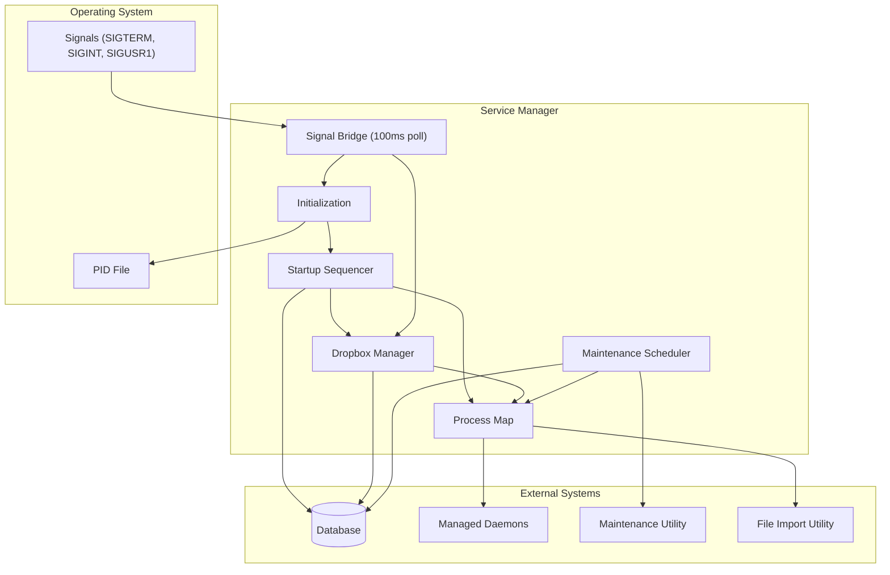
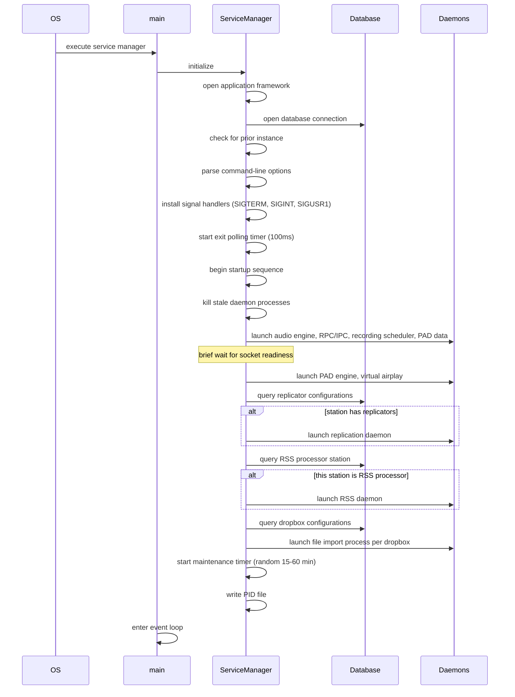
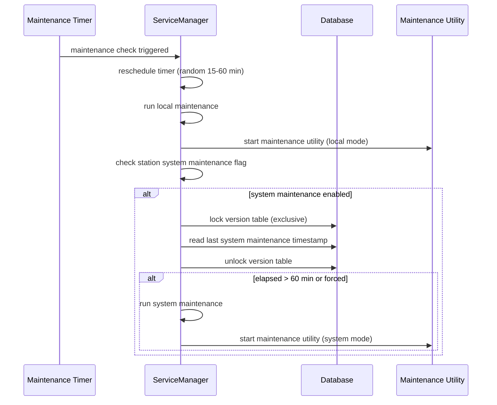
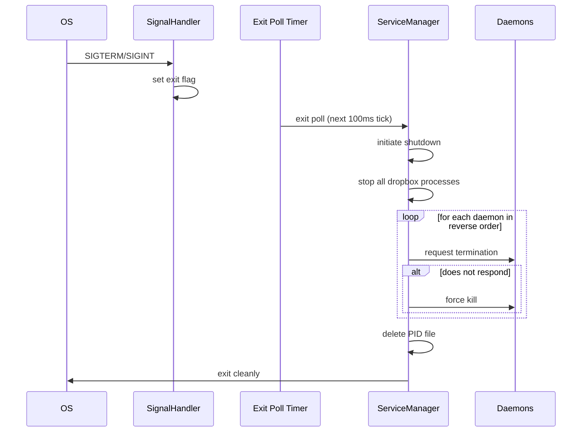
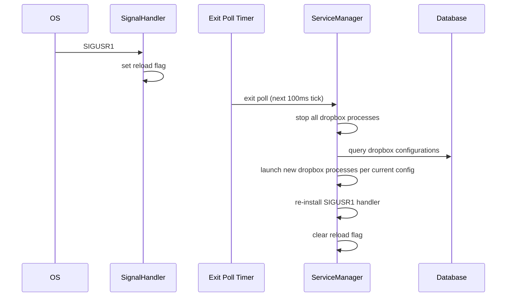
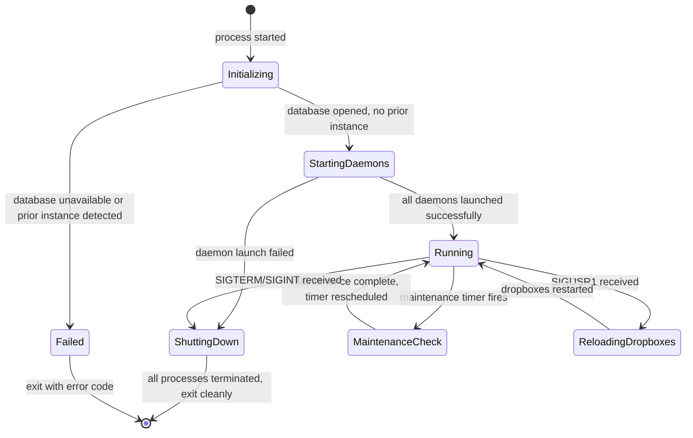
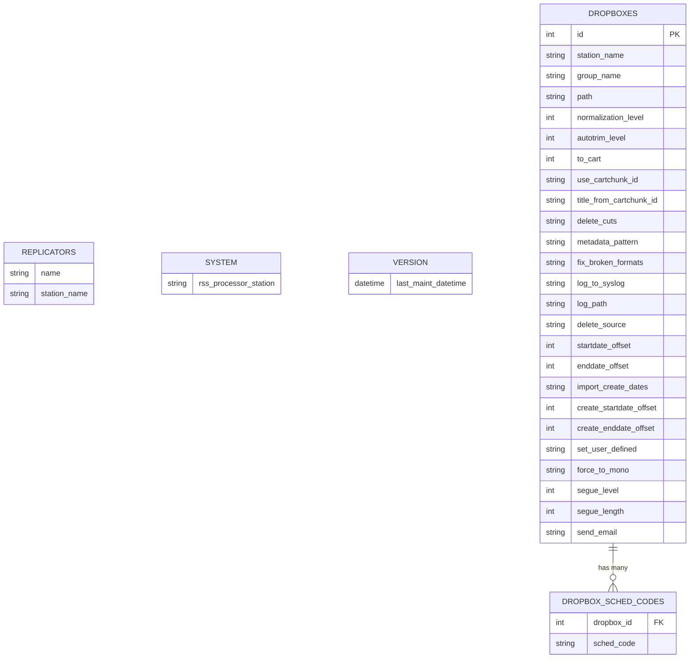

# Design Document: Service Manager (SVC)

## Overview

The Service Manager is a headless background daemon that acts as the process supervisor for all Rivendell services on a single station. It launches daemons in a defined order, manages file import dropbox processes based on database configuration, schedules periodic maintenance routines, and orchestrates graceful shutdown. It has no user interface.

**Purpose:** Centralized process supervision and maintenance scheduling for a Rivendell station.
**Users:** System administrators who start/stop the station service; the operating system init system.
**Impact:** Controls the lifecycle of all other Rivendell daemons (audio engine, RPC/IPC daemon, recording scheduler, PAD daemons, virtual airplay, replication, RSS, file import processes) and maintenance utilities.

### Goals

- Launch all required daemons in a strict, deterministic order with dependency awareness
- Conditionally launch optional daemons based on station configuration in the database
- Manage file import dropbox processes with hot-reload capability via OS signals
- Schedule local and system-wide maintenance at randomized intervals for load distribution
- Provide graceful shutdown with ordered process termination
- Clean up stale processes from prior crashed instances

### Non-Goals

- Graphical user interface (this is a headless daemon)
- Daemon health monitoring or automatic restart of crashed child daemons (processes are launched and left running)
- Network-based remote management API
- Platform-specific audio device management (delegated to child daemons)
- Direct database schema management (delegated to maintenance utilities)

## Architecture

### Architecture Pattern & Boundary Map

The Service Manager follows a simple single-process supervisor pattern. It is a monolithic daemon with timer-driven control flow: one timer for exit/reload signal polling, one timer for maintenance scheduling, and event-driven cleanup for ephemeral processes.



**Architecture Integration:**
- Selected pattern: Process supervisor with timer-driven event loop
- Domain boundaries: Startup sequencing, dropbox management, and maintenance scheduling are logically separated concerns within a single process
- The Service Manager does not implement business logic itself; it delegates to child daemons and external utilities
- All database access is read-only (configuration queries and timestamp checks)

### Technology Stack

| Layer | Choice | Role | Notes |
|-------|--------|------|-------|
| Runtime | TBD | Headless daemon process | No GUI framework required; console/background application |
| Database | Relational database | Configuration queries | Read-only access to station config, dropboxes, replicators, system settings |
| Process Management | OS process API | Launch, monitor, terminate child processes | Requires process lifecycle events (started, finished, crashed) |
| Scheduling | Timer-based | Maintenance interval scheduling | Single-shot timers with random intervals |
| Signal Handling | OS signal API | SIGTERM, SIGINT, SIGUSR1 | Bridged to event loop via polling timer |

## System Flows

### Startup Sequence



### Maintenance Cycle



### Graceful Shutdown



### Dropbox Reload



### Service Lifecycle State Machine



## Requirements Traceability

| Requirement | Summary | Components | Interfaces | Flows |
|-------------|---------|------------|------------|-------|
| 1 | Daemon Lifecycle Management | ServiceManager, ProcessMap | Process lifecycle, signal handling | Startup Sequence, Graceful Shutdown |
| 2 | Dropbox Process Management | DropboxManager, ProcessMap | Database query, process lifecycle | Startup Sequence, Dropbox Reload |
| 3 | Conditional Daemon Launching | StartupSequencer | Database query | Startup Sequence |
| 4 | Maintenance Scheduling | MaintenanceScheduler, ProcessMap | Database query, timer, process lifecycle | Maintenance Cycle |
| 5 | Ephemeral Process Management | ProcessMap | Process lifecycle events | Maintenance Cycle |
| 6 | Signal Handling and Event Loop | SignalBridge | OS signal API, timer | All flows |

## Components and Interfaces

| Component | Domain/Layer | Intent | Req Coverage | Key Dependencies | Contracts |
|-----------|-------------|--------|--------------|------------------|-----------|
| ServiceManager | Core | Central coordinator: initialization, startup, shutdown | 1, 6 | ProcessMap, StartupSequencer, DropboxManager, MaintenanceScheduler | Service, State |
| StartupSequencer | Core | Launch daemons in strict order with conditional logic | 1, 3 | ProcessMap, Database | Service |
| DropboxManager | Core | Manage file import processes from database config | 2 | ProcessMap, Database | Service, Event |
| MaintenanceScheduler | Core | Schedule and run local/system maintenance | 4, 5 | ProcessMap, Database | Service, Batch |
| ProcessMap | Infrastructure | Track all managed processes by ID slot | 1, 2, 4, 5 | OS Process API | Service, Event |
| SignalBridge | Infrastructure | Bridge OS signals to application event loop | 6 | OS Signal API, Timer | Event |

### Core

#### ServiceManager

| Field | Detail |
|-------|--------|
| Intent | Central coordinator for the service lifecycle: initialization, startup orchestration, shutdown orchestration, and event loop management |
| Requirements | 1, 6 |

**Responsibilities & Constraints**
- Initialize the application framework and database connection
- Detect and prevent duplicate instances via PID checking
- Parse command-line options (startup target, force maintenance, initial interval)
- Install OS signal handlers and start the signal bridge polling timer
- Delegate to StartupSequencer for daemon launching
- Delegate to MaintenanceScheduler for maintenance timer setup
- Manage PID file (write on startup, delete on shutdown)

**Dependencies**
- Inbound: OS init system starts the process (P0)
- Outbound: StartupSequencer -- daemon launching (P0)
- Outbound: DropboxManager -- dropbox process management (P0)
- Outbound: MaintenanceScheduler -- maintenance scheduling (P1)
- Outbound: SignalBridge -- signal-to-event-loop bridge (P0)
- External: Core library -- application framework, database, configuration, PID file management (P0)

**Contracts:** Service [x] / Event [ ] / State [x]

##### Service Interface
```
interface ServiceManagerService {
  initialize(args: CommandLineArgs): Result<void, InitError>
  startup(target: StartupTarget): Result<void, StartupError>
  shutdown(): void
}
```
- Preconditions: No prior instance running, database reachable
- Postconditions: All daemons running (or up to target), PID file written
- Invariants: Only one instance per station

##### State Management
- State model: Initializing -> StartingDaemons -> Running -> ShuttingDown (see lifecycle state machine)
- Persistence: PID file on filesystem
- Concurrency: Single-threaded event loop with timer-driven callbacks

#### StartupSequencer

| Field | Detail |
|-------|--------|
| Intent | Launch all required daemons in strict deterministic order with conditional logic for optional daemons |
| Requirements | 1, 3 |

**Responsibilities & Constraints**
- Kill stale processes for each daemon before launching new instances
- Launch daemons in fixed order: audio engine, RPC/IPC, recording scheduler, PAD data, PAD engine, virtual airplay
- Query database for replicator configurations; launch replication daemon if present
- Query database for RSS processor station; launch RSS daemon if this station matches
- Support partial startup via configurable target (stop after a specific daemon)
- Brief wait between first batch and second batch of daemons for socket readiness

**Dependencies**
- Inbound: ServiceManager -- invokes startup (P0)
- Outbound: ProcessMap -- register launched daemons (P0)
- External: Database -- replicator and RSS configuration queries (P0)
- External: Core library -- process launching, PID lookup, SQL query, string escaping (P0)

**Contracts:** Service [x]

##### Service Interface
```
interface StartupSequencerService {
  executeStartup(target: StartupTarget): Result<void, StartupError>
  killStaleProcesses(daemonName: string): void
}
```
- Preconditions: Database connection open
- Postconditions: All daemons up to target are running; stale processes eliminated

#### DropboxManager

| Field | Detail |
|-------|--------|
| Intent | Manage file import processes based on database-driven dropbox configurations with hot-reload capability |
| Requirements | 2 |

**Responsibilities & Constraints**
- Query DROPBOXES and DROPBOX_SCHED_CODES tables for this station's configurations
- Launch one file import process per dropbox with all configured parameters (normalization, autotrim, metadata pattern, date offsets, logging, etc.)
- Support full teardown and re-launch on SIGUSR1 reload signal
- Dropbox process IDs start at slot 100 to separate from daemon slots (0-10)

**Dependencies**
- Inbound: ServiceManager/SignalBridge -- start dropboxes, reload dropboxes (P0)
- Outbound: ProcessMap -- register/remove dropbox processes (P0)
- External: Database -- dropbox configuration queries (P0)

**Contracts:** Service [x] / Event [x]

##### Service Interface
```
interface DropboxManagerService {
  startDropboxes(): Result<void, DropboxError>
  shutdownDropboxes(): void
  reloadDropboxes(): Result<void, DropboxError>
}
```

##### Event Contract
- Subscribed events: reload signal from SignalBridge
- Published events: none
- Ordering: shutdown existing dropboxes must complete before starting new ones

#### MaintenanceScheduler

| Field | Detail |
|-------|--------|
| Intent | Schedule and execute local and system-wide maintenance at randomized intervals for load distribution across stations |
| Requirements | 4, 5 |

**Responsibilities & Constraints**
- Schedule maintenance checks at random intervals between 15 and 60 minutes
- Always run local maintenance on each check
- Conditionally run system-wide maintenance if station is configured for it and time threshold exceeded (60 min)
- Use exclusive table lock on VERSION table for concurrency control when checking system maintenance timestamp
- Support forced system maintenance on first check via command-line option
- Manage ephemeral processes (maintenance utility invocations) including startup failure and crash logging

**Dependencies**
- Inbound: ServiceManager -- initial timer setup (P0)
- Outbound: ProcessMap -- register ephemeral maintenance processes (P0)
- External: Database -- VERSION table queries with locking (P0)
- External: Core library -- station configuration, time formatting (P0)

**Contracts:** Service [x] / Batch [x]

##### Batch / Job Contract
- Trigger: Single-shot timer with random interval (15-60 min)
- Input: Station configuration (maintenance enabled, system maintenance enabled)
- Output: Ephemeral maintenance utility processes
- Idempotency: Each run is independent; uses table locking for concurrency safety across stations

### Infrastructure

#### ProcessMap

| Field | Detail |
|-------|--------|
| Intent | Track all managed child processes by numeric ID slot, providing lifecycle event handling |
| Requirements | 1, 2, 4, 5 |

**Responsibilities & Constraints**
- Map numeric process IDs to process objects (slots 0-10 for daemons, 100+ for dropboxes)
- Handle process finished events: log crash/error/normal exit, clean up entry
- Provide lookup and iteration for shutdown sequences

**Dependencies**
- External: OS process API -- spawn, terminate, kill, wait (P0)
- External: Core library -- process wrapper with ID tracking (P0)

**Contracts:** Service [x] / Event [x]

##### Event Contract
- Subscribed events: process finished (from OS process API)
- Published events: none (logs directly)
- Ordering: cleanup must complete before slot reuse

#### SignalBridge

| Field | Detail |
|-------|--------|
| Intent | Bridge OS-level signals into the application event loop via periodic polling |
| Requirements | 6 |

**Responsibilities & Constraints**
- Install OS signal handlers for SIGTERM, SIGINT, SIGUSR1
- Poll global flags at 100ms intervals
- Dispatch to shutdown procedure (exit flag) or dropbox reload (reload flag)
- Re-install SIGUSR1 handler after each invocation (required by some signal APIs)

**Dependencies**
- External: OS signal API (P0)
- Outbound: ServiceManager -- trigger shutdown (P0)
- Outbound: DropboxManager -- trigger reload (P0)

**Contracts:** Event [x]

##### Event Contract
- Subscribed events: OS signals (SIGTERM, SIGINT, SIGUSR1)
- Published events: exit request, reload request (to ServiceManager/DropboxManager)

## Data Models

### Domain Model

The Service Manager does not own any data entities. It performs read-only queries against tables owned by the core library:

- **Replicators**: Station-to-replicator assignments; queried to determine if replication daemon should launch
- **System**: System-wide settings including designated RSS processor station
- **Version**: Tracks last system maintenance timestamp; accessed with exclusive locking
- **Dropboxes**: File import configurations per station with extensive parameter set
- **Dropbox Scheduler Codes**: Scheduler code assignments per dropbox (many-to-one relationship)

### Logical Data Model



All tables are defined and owned by the core library (LIB artifact). The Service Manager has read-only access.

### Physical Data Model

The physical schema is defined in the core library artifact. The Service Manager performs the following query patterns:

| Query | Table | Lock | Purpose |
|-------|-------|------|---------|
| SELECT name FROM replicators WHERE station_name = ? | REPLICATORS | None | Check replicator configs |
| SELECT rss_processor_station FROM system | SYSTEM | None | Check RSS processor |
| SELECT last_maint_datetime FROM version | VERSION | Exclusive (write lock) | Check maintenance threshold |
| SELECT * FROM dropboxes WHERE station_name = ? | DROPBOXES | None | Load dropbox configs |
| SELECT sched_code FROM dropbox_sched_codes WHERE dropbox_id = ? | DROPBOX_SCHED_CODES | None | Load scheduler codes |

## Error Handling

### Error Categories

**System Errors (fatal -- service exits):**
- Database connection failure at startup: log error, exit with database error code
- Prior instance detected: log error, exit with prior instance error code
- Daemon fails to start: log error with details, exit with startup error code
- Dropbox process fails to start: log error with details, exit
- Unknown command-line option: print error to standard error, exit
- Invalid command-line argument value: print error to standard error, exit

**System Errors (warning -- service continues):**
- PID file write failure: log warning, continue operation
- Ephemeral process fails to start: log warning with error details, remove from process map
- Ephemeral process crashes: log warning indicating crash, clean up
- Ephemeral process exits with non-zero code: log warning with exit code

### Error Strategy

The Service Manager follows a fail-fast approach for critical errors (database, daemon launch) and a log-and-continue approach for non-critical errors (maintenance utility failures, PID file issues). This ensures the station either fully starts or clearly reports why it cannot, while allowing maintenance failures to be retried on the next scheduled interval.

## Testing Strategy

### E2E Tests

1. **Full startup and shutdown**: Start the Service Manager, verify all daemons are launched in order, send SIGTERM, verify graceful shutdown in reverse order
2. **Partial startup with target**: Start with --end-startup-after-ripcd, verify only audio engine and RPC/IPC daemon are launched
3. **Dropbox reload via SIGUSR1**: Start with dropbox configs, send SIGUSR1, verify old processes stopped and new processes launched from updated config
4. **Forced system maintenance**: Start with --force-system-maintenance, verify system maintenance runs on first check regardless of timestamp
5. **Duplicate instance prevention**: Start one instance, attempt to start a second, verify second exits with error

### Integration Tests

1. **Database-driven conditional launch**: Configure replicator entries in database, verify replication daemon is launched; remove entries, verify it is skipped
2. **RSS processor conditional launch**: Set this station as RSS processor in database, verify RSS daemon launches; set a different station, verify it is skipped
3. **Dropbox parameter mapping**: Configure a dropbox with all available options, verify file import process receives correct parameters
4. **Maintenance threshold check**: Set last maintenance timestamp to > 60 minutes ago, verify system maintenance runs; set to < 60 minutes ago, verify it is skipped
5. **Concurrent maintenance locking**: Verify table locking prevents race conditions when multiple stations check maintenance timestamps

### Unit Tests

1. **Random maintenance interval generation**: Verify interval is always between 15 and 60 minutes (900000-3600000 ms)
2. **Startup target mapping**: Verify each command-line option maps to the correct startup target enum value
3. **Stale process cleanup**: Verify kill loop continues until no matching process IDs remain
4. **Process finished handler**: Verify crash, error exit, and normal exit are logged with appropriate severity
5. **Dropbox parameter construction**: Verify each dropbox column maps to the correct import process argument
