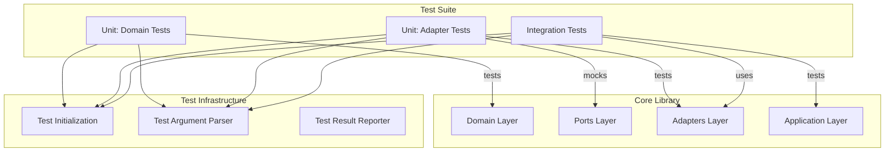
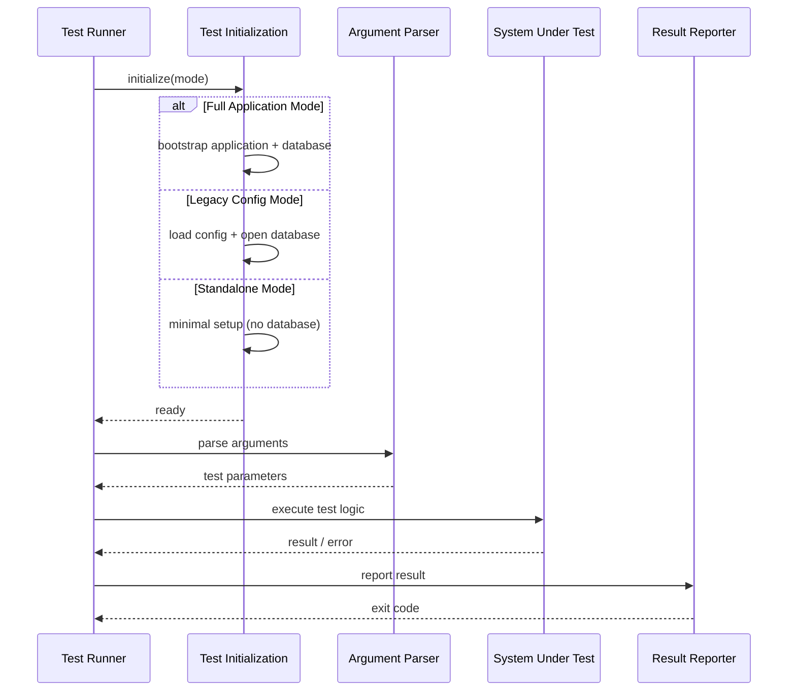
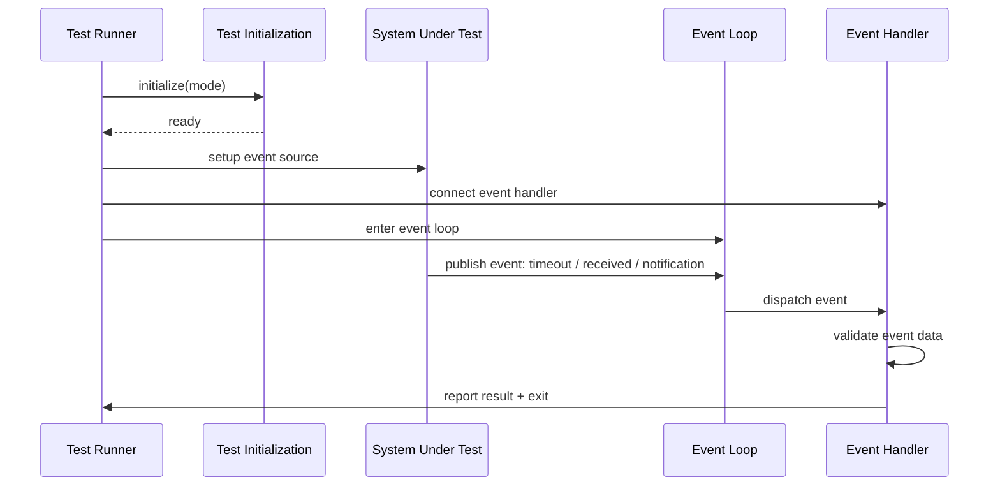
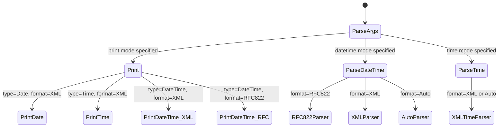
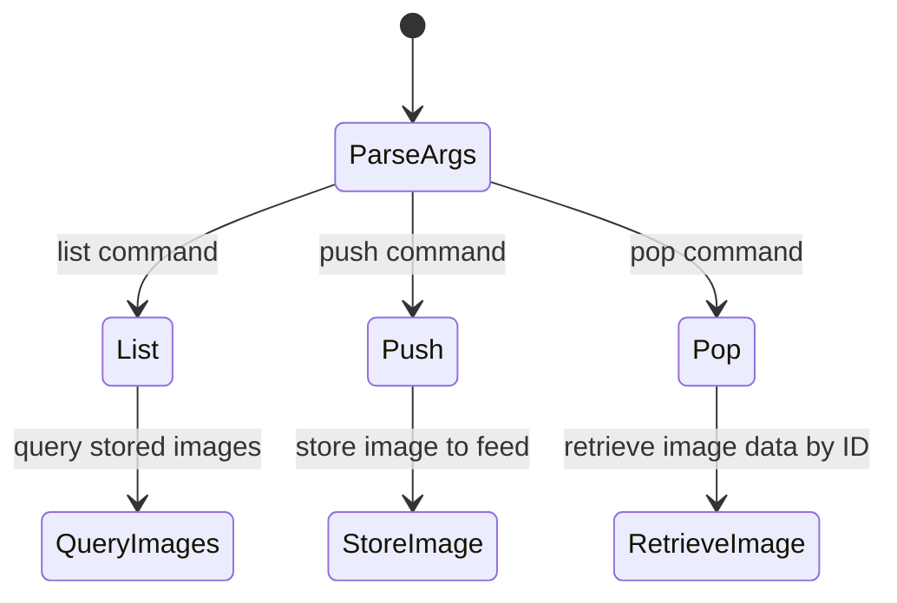
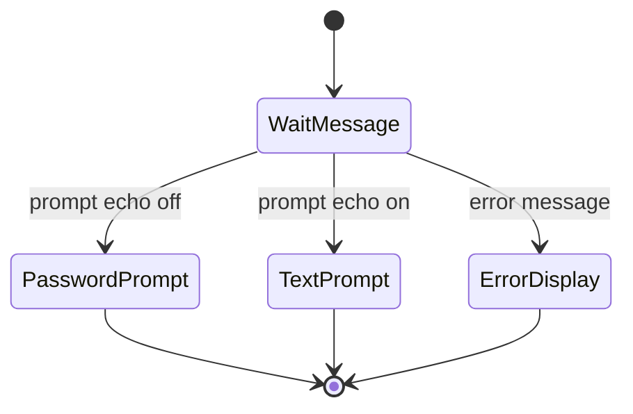

# Design Document

## Overview

**Purpose:** The Tests specification delivers a comprehensive automated verification suite for the Rivendell 2.0 core library. It validates all major functional domains -- audio processing, file transfer, date/time handling, string encoding, cart/log management, networking, podcasting, authentication, database integrity, email, disc handling, and general utilities -- ensuring library correctness before integration with higher-level applications.

**Users:** Developers and CI/CD pipelines will execute these tests to verify library functionality during development and before releases. Quality assurance uses test results to validate builds.

**Impact:** Replaces 28 standalone, framework-less test executables with a structured Qt Test-based suite following the project's hexagonal architecture. The new test suite provides consistent initialization, structured assertions, and machine-parseable output.

### Goals

- Validate all core library functionality across 13 functional domains
- Provide consistent test infrastructure with standardized initialization, assertions, and reporting
- Support three initialization modes: full application bootstrap, legacy configuration, and standalone (no database)
- Enable CI/CD integration with parseable output and deterministic exit codes
- Cover both synchronous operations and asynchronous event-driven flows (timer, multicast, notifications, IPC)

### Non-Goals

- Testing UI components (the test artifact is CLI-only)
- Testing platform-specific audio backends (ALSA, JACK, HPI) -- these are replaced by portable adapters
- Reimplementing the original test pattern (constructor-as-test-runner with printf output)
- Performance or load testing
- Testing daemon-level integration (those belong to daemon artifact test suites)

## Architecture

### Architecture Pattern & Boundary Map

The test suite follows the project's hexagonal architecture. Tests are organized by layer (unit/domain, unit/adapters, integration) and by functional domain within each layer.



**Architecture Integration:**
- Selected pattern: Hexagonal (consistent with main application)
- Tests validate domain layer in isolation (no Qt needed for domain tests)
- Adapter tests use mock port implementations
- Integration tests wire real adapters with in-memory database

### Technology Stack

| Layer | Choice / Version | Role in Feature | Notes |
|-------|------------------|-----------------|-------|
| Test Framework | Qt Test (Qt 6) | Structured assertions, test organization | QCOMPARE, QVERIFY, data-driven tests |
| Domain Tests | Pure C++20 | Domain logic verification | No Qt dependency |
| Database Tests | SQLite in-memory | Database integration verification | Via Qt SQL adapter |
| Build System | QMake (Qt 6) | Test executable compilation | Mirrored from src/ structure |
| CI Integration | Standard exit codes | Pipeline pass/fail determination | 0 = pass, non-zero = fail |

## System Flows

### Synchronous Test Flow (24 of 28 test domains)



### Asynchronous Test Flow (timer, multicast, notifications, IPC)



### Dateparse Format/Print Dispatch



### Feed Image Command Dispatch



### PAM Authentication Conversation



## Requirements Traceability

| Requirement | Summary | Components | Interfaces | Flows |
|-------------|---------|------------|------------|-------|
| 1 | Audio Processing Tests | AudioConvertTest, AudioExportTest, AudioImportTest, AudioMetadataTest, AudioPeaksTest, WaveFileTest, WavChunkTest | IAudioConverter, IAudioImporter, IAudioExporter, IWaveFileReader | Synchronous |
| 2 | File Transfer Tests | UploadTest, DownloadTest, DeleteTest | IFileTransferService | Synchronous |
| 3 | Date/Time Tests | DateParseTest, DateDecodeTest | Date/time utility functions | Synchronous (format dispatch) |
| 4 | String Encoding/XML Tests | StringCodeTest, XmlParseTest | String encoding utilities | Synchronous |
| 5 | Cart/Log Management Tests | ReserveCartsTest, LogUnlinkTest, MetadataWildcardTest | ICartRepository, ILogService, IServiceManager | Synchronous + Async (IPC) |
| 6 | Networking/IPC Tests | MulticastRecvTest, NotificationTest | IMulticaster, INotificationService, IIpcClient | Asynchronous |
| 7 | Feed Management Tests | FeedImageTest | IFeedRepository | Synchronous (command dispatch) |
| 8 | Utility Tests | CmdLineParserTest, GetPidsTest, HashTest, TimerTest | Utility functions | Synchronous + Async (timer) |
| 9 | Authentication Tests | PamAuthTest | Authentication service (PAM) | Synchronous (callback) |
| 10 | Database Integrity Tests | DbCharsetTest | Database connection | Synchronous |
| 11 | Email Tests | SendMailTest | IEmailService | Synchronous |
| 12 | CD/Disc Tests | ReadCdTest | IDiscLookup | Synchronous |
| 13 | Test Infrastructure | TestInitializer, TestArgumentParser, TestResultReporter | -- | All flows |

## Components and Interfaces

### Summary

| Component | Domain/Layer | Intent | Req Coverage | Key Dependencies | Contracts |
|-----------|--------------|--------|--------------|-----------------|-----------|
| TestInitializer | Infrastructure | Standardized test setup across 3 modes | 13 | Application bootstrap, Config loader | Service |
| AudioProcessingTests | Unit/Integration | Audio conversion, import, export, metadata, peaks, WAV | 1 | IAudioConverter, IAudioImporter, IAudioExporter, IWaveFileReader (P0) | -- |
| FileTransferTests | Integration | Upload, download, delete operations | 2 | IFileTransferService (P0) | -- |
| DateTimeTests | Unit | Date/time parsing and formatting | 3 | Date/time utility functions (P0) | -- |
| StringEncodingTests | Unit | XML/URL encoding and XML parsing | 4 | String encoding utilities (P0) | -- |
| CartLogTests | Integration | Cart reservation, log unlink, wildcard | 5 | ICartRepository, ILogService (P0), IIpcClient (P1) | -- |
| NetworkingTests | Integration | Multicast receive, notification delivery | 6 | IMulticaster, INotificationService (P0) | Event |
| FeedTests | Integration | Feed image list, push, pop | 7 | IFeedRepository (P0) | -- |
| UtilityTests | Unit | CLI parsing, PID lookup, hashing, timer | 8 | Utility functions (P0) | -- |
| AuthenticationTests | Integration | PAM authentication conversation | 9 | Authentication service (P0) | -- |
| DatabaseTests | Integration | Character set and collation verification | 10 | Database connection (P0) | -- |
| EmailTests | Integration | Email sending | 11 | IEmailService (P0) | -- |
| DiscTests | Unit/Integration | CD reading, ISRC validation | 12 | IDiscLookup (P0) | -- |

### Test Infrastructure

#### TestInitializer

| Field | Detail |
|-------|--------|
| Intent | Provide standardized test initialization across three modes: full application, legacy config, and standalone |
| Requirements | 13 |

**Responsibilities & Constraints**
- Encapsulate application bootstrap logic (database connection, configuration loading)
- Support in-memory database for integration tests
- Provide clean setup/teardown per test case
- Standalone mode must not require any database or external services

**Dependencies**
- Outbound: Application bootstrap service -- application initialization (P0)
- Outbound: Configuration loader -- configuration access (P1)
- Outbound: Database connection -- schema and data access (P1)

**Contracts**: Service [x]

##### Service Interface
```
interface ITestInitializer {
    initializeFull(testName: string): Result<TestContext, ErrorInfo>
    initializeLegacy(configPath: string): Result<TestContext, ErrorInfo>
    initializeStandalone(): Result<TestContext, ErrorInfo>
    teardown(): void
}
```
- Preconditions: None (initializer handles all setup)
- Postconditions: TestContext is ready for test execution, or error is reported
- Invariants: Each test gets a clean, isolated context

### Audio Processing

#### AudioProcessingTests

| Field | Detail |
|-------|--------|
| Intent | Verify audio format conversion, import/export, metadata reading, peaks analysis, and WAV chunk parsing |
| Requirements | 1 |

**Responsibilities & Constraints**
- Test all supported audio format conversions (PCM16, PCM24, MPEG L2, MPEG L2 WAV, MPEG L3, FLAC, Ogg Vorbis)
- Validate input parameter ranges (cart number, cut number, normalization, autotrim, bit rate/quality exclusivity)
- Test metadata extraction from various audio file formats
- Test RIFF chunk iteration

**Dependencies**
- Inbound: Test runner -- test execution (P0)
- Outbound: IAudioConverter -- format conversion (P0)
- Outbound: IAudioImporter -- audio import (P0)
- Outbound: IAudioExporter -- audio export (P0)
- Outbound: IWaveFileReader -- file reading and metadata (P0)
- Outbound: ICartRepository -- cart data access (P1)

### Networking

#### NetworkingTests

| Field | Detail |
|-------|--------|
| Intent | Verify multicast communication and inter-process notification delivery using asynchronous event-driven patterns |
| Requirements | 6 |

**Responsibilities & Constraints**
- Test multicast receive with real or simulated UDP multicast
- Test notification delivery through the IPC service connection
- Validate port range constraints for multicast
- Tests require event loop entry and signal-based result collection

**Dependencies**
- Outbound: IMulticaster -- multicast communication (P0)
- Outbound: INotificationService -- notification subscription and delivery (P0)
- Outbound: IIpcClient -- IPC daemon connection (P0)

**Contracts**: Event [x]

##### Event Contract
- Subscribed events: multicast data received, notification received, user changed, timer timeout
- Published events: none (tests are consumers)
- Ordering / delivery guarantees: Events processed in signal emission order; tests verify at least one event received before timeout

## Data Models

### Domain Model

The test artifact does not define its own data entities. It operates on entities defined in the core library (LIB):

- **Cart** -- media asset container (cart number, type, title, metadata)
- **Cut** -- individual audio recording within a cart
- **Group** -- organizational grouping for carts with number ranges
- **Log** -- broadcast playlist with ordered log lines
- **Service** -- traffic/music service configuration
- **Feed** -- podcast feed with associated images
- **FeedImage** -- image stored against a feed (ID, dimensions, description, filename, binary data)
- **Notification** -- IPC notification event structure

### Database Access Patterns

Tests interact with the database in two ways:

| Pattern | Tests | Description |
|---------|-------|-------------|
| Direct query | Database charset, Feed image | Execute SQL directly for diagnostic or CRUD operations |
| Indirect via repository | Audio convert/export/import, Cart reservation, Log unlink | Access data through domain repositories and services |

### Feed Image Data (directly accessed in tests)

| Field | Type | Description |
|-------|------|-------------|
| ID | integer | Auto-increment primary key |
| FEED_ID | integer | Foreign key to feed |
| FEED_KEY_NAME | string | Feed key identifier |
| WIDTH | integer | Image width in pixels |
| HEIGHT | integer | Image height in pixels |
| DESCRIPTION | string | Human-readable description |
| FILE_NAME | string | Original filename |
| FILE_EXTENSION | string | File extension |
| DATA | binary | Raw image data |

## Error Handling

### Error Categories

| Category | Source | Condition | Expected Behavior |
|----------|--------|-----------|-------------------|
| Missing argument | All tests | Required CLI argument not provided | Report "{test}: missing {argument}" and exit with non-zero code |
| Unknown option | All tests | Unrecognized CLI switch | Report "{test}: unknown option" and exit with non-zero code |
| Application bootstrap failure | Database-using tests | Database connection or configuration error | Report error message and exit with non-zero code |
| Invalid numeric input | Numeric argument tests | Non-numeric or out-of-range value | Report "{test}: invalid {field}" and exit with non-zero code |
| File access failure | Audio file tests | Cannot open input file | Report "unable to open" and exit with non-zero code |
| Validation error | Multiple tests | Business rule violation (range, exclusivity) | Report specific validation failure and exit with non-zero code |

### Error Strategy

- All errors are reported via structured error info (no exceptions)
- Fatal errors terminate the test with a non-zero exit code
- Operation results are reported as informational messages after execution
- Tests for error conditions explicitly verify that the correct error is raised

## Testing Strategy

This specification IS the test suite, so the testing strategy describes how to test the test infrastructure itself.

### Unit Tests: Domain Validation

- Cart number range validation (0, 1, 999999, 1000000)
- Cut number range validation (0, 1, 999, 1000)
- Normalization level boundary (negative values valid, zero valid, positive invalid)
- Autotrim level boundary (negative values valid, zero valid, positive invalid)
- Bit rate / quality mutual exclusivity
- Audio format whitelist membership
- Multicast port range (0 invalid, 1 valid, 65535 valid, 65536 invalid)
- Date format detection (RFC 822 vs XML vs Auto)

### Integration Tests: Service Operations

- Audio conversion end-to-end with in-memory database and test audio files
- File upload/download/delete against local file system adapter
- Cart reservation within a group with proper number allocation
- Feed image push/pop/list cycle with in-memory database
- Email sending with mock SMTP adapter
- SHA-1 hash computation against known test vectors

### Integration Tests: Async Event Flows

- Timer accuracy measurement over multiple callbacks
- Multicast send/receive round-trip within localhost
- Notification publish/subscribe through IPC service mock
- Log unlink triggered by IPC user change event

### Test Data

| Resource | Purpose | Source |
|----------|---------|--------|
| Test audio files | Audio processing tests | Generated test fixtures (sine waves, silence) |
| rivendell_standard.txt | Traffic import format test data | Carried from original test suite |
| visualtraffic.txt | Visual Traffic import format test data | Carried from original test suite |
| Known hash test vectors | SHA-1 verification | Standard test vectors |
