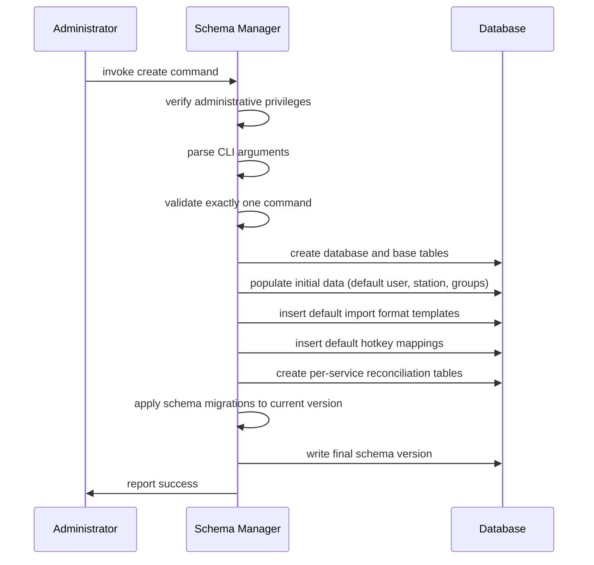
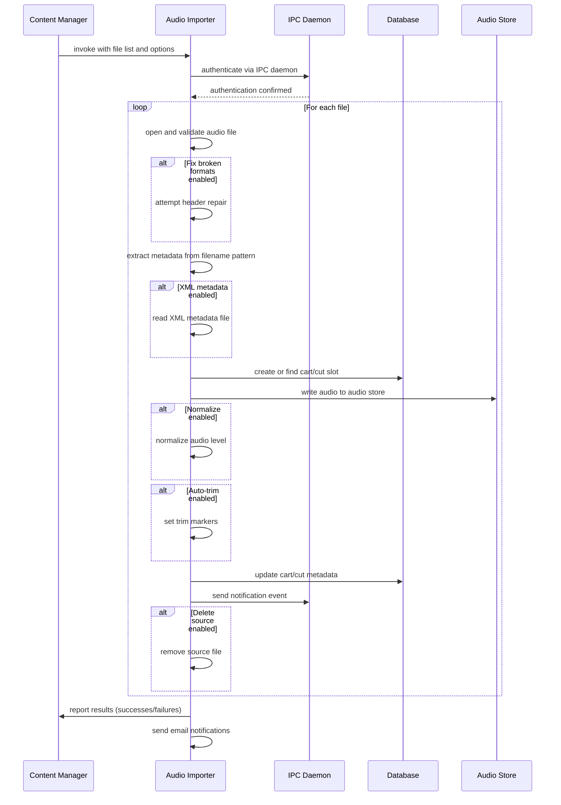
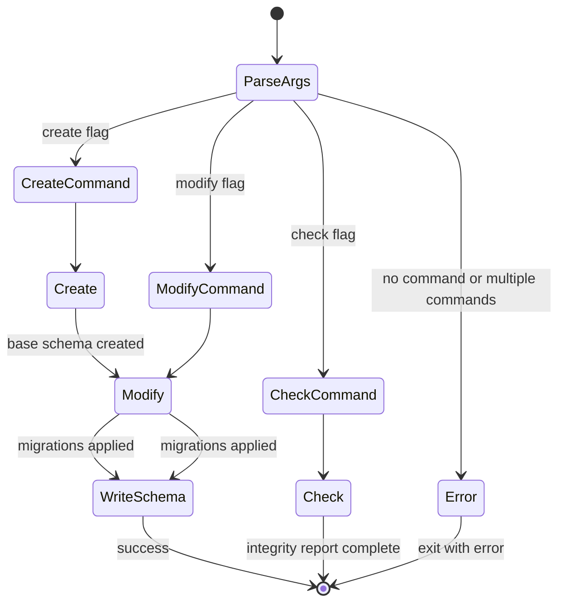
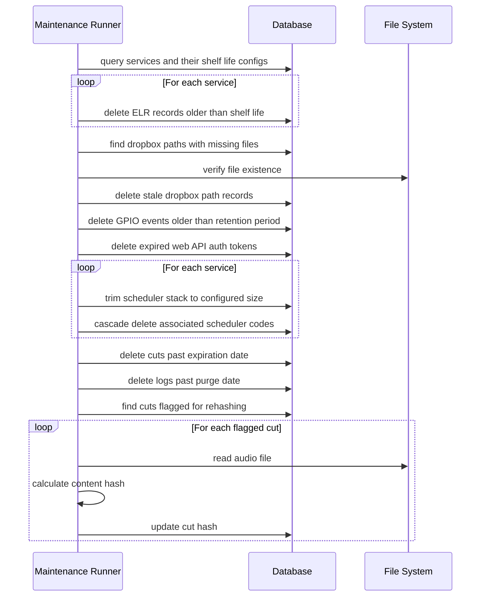
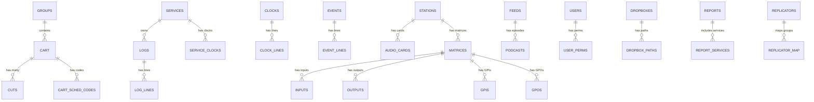

# Design Document

## Overview

**Purpose:** The Utils module delivers a suite of standalone command-line and graphical utility tools for Rivendell system administration, content management, audio processing, and diagnostics. These tools form the operational backbone that system administrators, content managers, and broadcast engineers use outside of the main Rivendell applications to manage the database schema, import/export audio, maintain system health, and interact with hardware I/O.

**Users:** System administrators (database management, maintenance, configuration), content managers (audio import/export, metadata, bulk operations), broadcast operators (macro commands, soft keys, log rendering), broadcast engineers (GPIO monitoring, audio validation), traffic managers (traffic data import), and audio engineers (disc import, format conversion, marker setting).

**Impact:** These utilities operate directly on the Rivendell database, audio store, and IPC infrastructure. They are the primary tools for initial system setup (database creation), ongoing maintenance (purge, validation), and bulk content operations that would be impractical through the main GUI applications.

### Goals

- Provide a complete set of CLI tools for scriptable, automatable system administration
- Enable database lifecycle management: creation, migration, integrity verification, backup, and restoration
- Support bulk audio content operations: import with metadata extraction, export in multiple formats, batch marker setting, batch deletion
- Offer specialized GUI tools for tasks requiring visual interaction: disc import, GPIO monitoring, database configuration, traffic import
- Deliver maintenance automation for keeping the system clean and performant

### Non-Goals

- Real-time audio playout (handled by the playout application)
- Interactive log scheduling and clock management (handled by the log manager application)
- User and permission administration UI (handled by the admin application)
- Platform-specific audio device configuration (the legacy ALSA configurator is excluded from reimplementation)
- CD/disc hardware control (the disc importer functionality will be re-evaluated for relevance in the target platform)

## Architecture

### Architecture Pattern & Boundary Map

The Utils module is a collection of independent executables, each following the hexagonal architecture pattern established in the project steering. Each tool is a thin composition root that wires domain services to infrastructure adapters.

```mermaid
graph TD
    subgraph "CLI Tools"
        DBMGR[Database Schema Manager]
        IMP[Audio Importer]
        EXP[Audio Exporter]
        CLILOG[CLI Log Editor]
        RENDER[Log Renderer]
        DEL[Bulk Deleter]
        MAINT[Maintenance Runner]
        MARKER[Batch Marker Setter]
        META[Metadata Updater]
        CHK[Cut Validator]
        CONV[Audio Converter]
        COLLECT[File Collector]
        CLEAN[Directory Cleaner]
        SELHELP[Config Selector]
        GEN[Tone Generator]
        POPUP[Popup Notifier]
    end

    subgraph "GUI Tools"
        DBCONF[Database Config UI]
        RML[Macro Sender]
        DISC[Disc Importer]
        DGIMPORT[Traffic Importer]
        GPIMON[GPIO Monitor]
        SOFTKEYS[Soft Key Panel]
    end

    subgraph "Shared Infrastructure"
        LIB[Core Library]
        DB[(Database)]
        AUDIO[Audio Store]
        IPC[IPC Daemon]
    end

    DBMGR --> DB
    IMP --> LIB
    IMP --> DB
    IMP --> AUDIO
    IMP --> IPC
    EXP --> LIB
    EXP --> DB
    EXP --> AUDIO
    CLILOG --> LIB
    CLILOG --> DB
    RENDER --> LIB
    RENDER --> AUDIO
    DEL --> LIB
    DEL --> DB
    DEL --> AUDIO
    MAINT --> LIB
    MAINT --> DB
    MARKER --> LIB
    MARKER --> DB
    META --> LIB
    META --> DB
    CHK --> LIB
    CHK --> AUDIO
    CONV --> LIB
    CONV --> AUDIO
    DBCONF --> DB
    RML --> IPC
    DISC --> LIB
    DISC --> AUDIO
    DGIMPORT --> LIB
    DGIMPORT --> DB
    GPIMON --> LIB
    GPIMON --> IPC
    SOFTKEYS --> IPC
end
```

**Architecture Integration:**
- Selected pattern: Collection of independent hexagonal executables sharing the core library
- Domain/feature boundaries: Each utility is a standalone executable with its own composition root; shared domain logic lives in the core library
- Existing patterns preserved: IPC authentication flow, cart/cut domain model, configuration file access
- New components rationale: Each utility addresses a distinct operational need; they are independent by design
- Steering compliance: Hexagonal architecture, cross-platform, no platform-specific APIs in domain logic

### Technology Stack

| Layer | Choice / Version | Role in Feature | Notes |
|-------|------------------|-----------------|-------|
| Language | C++20 | All tool implementations | ISO standard, no extensions |
| UI Framework | Qt 6 / QML | GUI tools only | CLI tools may use Qt Core only |
| Build System | QMake (Qt 6) | Build orchestration | Each tool as a subdirectory |
| Database | Qt SQL (abstract) | Schema management, data access | Database-agnostic via adapter |
| Audio | Qt Multimedia | Import/export/conversion | Via audio adapter port |
| Network | Qt Network | UDP macro sending, IPC | For RML and IPC communication |
| Testing | Qt Test | All tools | Unit + integration |

## System Flows

### Database Schema Creation Flow



### Audio Import Flow



### Database Schema Manager State Machine



### Maintenance Purge Flow



## Requirements Traceability

| Requirement | Summary | Components | Interfaces | Flows |
|-------------|---------|------------|------------|-------|
| 1 | Database Schema Management | SchemaManager, SchemaMap, IntegrityChecker | ISchemaService, IDatabaseAdapter | Schema Creation, Schema Migration |
| 2 | Audio Import | AudioImporter, ImportJournal, MarkerCalculator | IImportService, IAudioStore, INotificationService | Audio Import |
| 3 | Audio Export | AudioExporter | IExportService, IAudioStore | -- |
| 4 | CLI Log Editing | CliLogEditor | ILogService, ILogRepository | -- |
| 5 | Log Rendering | LogRenderer | IRenderService, IAudioStore | -- |
| 6 | Audio Conversion | AudioConverter | IAudioConverter | -- |
| 7 | Bulk Deletion | BulkDeleter | ICartRepository, ILogRepository, IAudioStore | -- |
| 8 | System Maintenance | MaintenanceRunner | IMaintenanceService, ICartRepository | Maintenance Purge |
| 9 | Batch Marker Setting | MarkerSetter | IMarkerService, ICutRepository | -- |
| 10 | Metadata Update | MetadataUpdater | ICartRepository, INotificationService | -- |
| 11 | Audio Validation | CutValidator | ICutRepository, IAudioStore | -- |
| 12 | Database Config UI | DatabaseConfigView | ISchemaService, IDatabaseAdapter | -- |
| 13 | Macro Sender | MacroSender | IMacroTransport | -- |
| 14 | Disc Import | DiscImporter | IDiscReader, IImportService | -- |
| 15 | Traffic Import | TrafficImporter | ITrafficParser, IImportService | -- |
| 16 | GPIO Monitor | GpioMonitor | IGpioService, IIpcClient | -- |
| 17 | Soft Key Panel | SoftKeyPanel | IMacroTransport | -- |
| 18 | File Collection | FileCollector | IFileSystem | -- |
| 19 | Directory Cleanup | DirectoryCleaner | IFileSystem | -- |
| 20 | Config Selector | ConfigSelector | IConfigService, IProcessManager | -- |
| 21 | Tone Generator | ToneGenerator | IAudioFileWriter | -- |
| 22 | Popup Notification | PopupNotifier | (UI only) | -- |

## Components and Interfaces

| Component | Domain/Layer | Intent | Req Coverage | Key Dependencies | Contracts |
|-----------|--------------|--------|--------------|------------------|-----------|
| SchemaManager | Domain/Service | Orchestrate database schema lifecycle | 1 | IDatabaseAdapter, SchemaMap | Service |
| SchemaMap | Domain/Value | Map version strings to schema numbers | 1 | -- | -- |
| IntegrityChecker | Domain/Service | Verify database and audio store consistency | 1 | IDatabaseAdapter, IAudioStore | Service |
| AudioImporter | Domain/Service | Import audio files with metadata | 2 | IAudioStore, ICartRepository, INotificationService | Service |
| ImportJournal | Domain/Value | Track import results for notification | 2 | INotificationService | -- |
| MarkerCalculator | Domain/Service | Calculate audio markers from threshold | 2, 9 | -- | Service |
| AudioExporter | Domain/Service | Export audio from carts to files | 3 | IAudioStore, ICartRepository | Service |
| CliLogEditor | Domain/Service | Interactive REPL for log editing | 4 | ILogRepository | Service |
| LogRenderer | Domain/Service | Mix-down log to single audio file | 5 | ILogRepository, IAudioStore | Service |
| AudioConverter | Domain/Service | Convert audio between formats | 6 | IAudioFileAdapter | Service |
| BulkDeleter | Domain/Service | Delete carts/logs in batch | 7 | ICartRepository, ILogRepository, IAudioStore | Service |
| MaintenanceRunner | Domain/Service | Purge expired data, validate integrity | 8 | IDatabaseAdapter, IAudioStore | Service |
| MetadataUpdater | Domain/Service | Update cart metadata fields | 10 | ICartRepository, INotificationService | Service |
| CutValidator | Domain/Service | Validate audio cut existence and playability | 11 | ICutRepository, IAudioStore | Service |
| MacroSender | Domain/Service | Send macro commands via network | 13, 17 | IMacroTransport | Service |
| TrafficParser | Domain/Service | Parse traffic data files | 15 | -- | Service |
| GpioMonitor | Domain/Service | Monitor GPIO states and events | 16 | IGpioService | Service, Event |
| FileCollector | Domain/Service | Merge and sort data files | 18 | IFileSystem | Service |
| ConfigSelector | Domain/Service | Switch active system configuration | 20 | IConfigService, IProcessManager | Service |
| ToneGenerator | Domain/Service | Generate WAV test tone files | 21 | IAudioFileWriter | Service |

### Domain / Service Layer

#### SchemaManager

| Field | Detail |
|-------|--------|
| Intent | Orchestrate database creation, migration (upgrade/downgrade), and version tracking |
| Requirements | 1 |

**Responsibilities & Constraints**
- Own the database schema lifecycle: create, migrate up, migrate down, report status
- Validate all preconditions before executing (privileges, single command, flag consistency, version validity)
- Execute migrations sequentially and atomically per version step

**Dependencies**
- Outbound: IDatabaseAdapter -- execute DDL/DML statements (P0)
- Outbound: IConfigService -- read database credentials from configuration (P1)
- Internal: SchemaMap -- resolve version-to-schema mappings (P0)

**Contracts:** Service [x]

##### Service Interface
```
interface ISchemaService {
    createDatabase(options: CreateOptions): Result<void, SchemaError>
    migrateSchema(targetVersion: int): Result<void, SchemaError>
    revertSchema(targetVersion: int): Result<void, SchemaError>
    checkIntegrity(options: CheckOptions): Result<IntegrityReport, SchemaError>
    currentSchemaVersion(): Result<int, SchemaError>
    printStatus(): Result<SchemaStatus, SchemaError>
}
```

#### IntegrityChecker

| Field | Detail |
|-------|--------|
| Intent | Verify consistency between database records and audio store files |
| Requirements | 1 |

**Responsibilities & Constraints**
- Detect orphaned carts (not in any group), cuts (not in any cart), audio files (not in database), voice tracks (not in any log)
- Verify cut counts, pending cart states, audio file lengths, table attributes
- Support selective checks via options (orphaned-audio-only, orphaned-carts-only, etc.)
- Support repair operations: relink audio, rehash content, dump orphaned cuts

**Dependencies**
- Outbound: IDatabaseAdapter -- query and modify records (P0)
- Outbound: IAudioStore -- scan files, read audio metadata (P0)

**Contracts:** Service [x]

##### Service Interface
```
interface IIntegrityChecker {
    checkOrphanedCarts(): Result<list of OrphanedCart, CheckError>
    checkOrphanedCuts(): Result<list of OrphanedCut, CheckError>
    checkOrphanedAudio(): Result<list of OrphanedFile, CheckError>
    checkOrphanedTracks(): Result<list of OrphanedTrack, CheckError>
    checkCutCounts(): Result<list of CountMismatch, CheckError>
    checkPendingCarts(): Result<list of PendingCart, CheckError>
    validateAudioLengths(): Result<list of LengthMismatch, CheckError>
    checkTableAttributes(): Result<list of AttributeIssue, CheckError>
    relinkAudio(sourcePath: string, moveMode: bool): Result<int, CheckError>
    rehash(target: string): Result<void, CheckError>
}
```

#### AudioImporter

| Field | Detail |
|-------|--------|
| Intent | Import audio files into the cart/cut system with metadata extraction, format repair, and notifications |
| Requirements | 2 |

**Responsibilities & Constraints**
- Validate and optionally repair audio file headers before import
- Extract metadata from filename patterns or XML sidecar files
- Match by ISCI code cross-reference when configured
- Track successes and failures via ImportJournal for grouped email notifications
- Support dropbox mode for continuous directory monitoring

**Dependencies**
- Outbound: IAudioStore -- write audio files (P0)
- Outbound: ICartRepository -- create/find cart and cut records (P0)
- Outbound: INotificationService -- publish import events (P1)
- Outbound: IIpcClient -- authenticate user (P0)
- Internal: MarkerCalculator -- calculate trim/segue markers (P1)
- Internal: ImportJournal -- track results (P1)

**Contracts:** Service [x]

##### Service Interface
```
interface IImportService {
    importFile(path: string, options: ImportOptions): Result<ImportResult, ImportError>
    importBatch(paths: list of string, options: ImportOptions): Result<BatchImportResult, ImportError>
    runDropbox(config: DropboxConfig): void
}
```

#### AudioExporter

| Field | Detail |
|-------|--------|
| Intent | Export audio from carts/cuts to files with flexible selection and naming |
| Requirements | 3 |

**Dependencies**
- Outbound: IAudioStore -- read audio data (P0)
- Outbound: ICartRepository -- query carts by group, title, scheduler code (P0)

**Contracts:** Service [x]

##### Service Interface
```
interface IExportService {
    exportCart(cartNumber: int, outputPattern: string, settings: ExportSettings): Result<list of string, ExportError>
    exportGroup(groupName: string, outputPattern: string, settings: ExportSettings): Result<list of string, ExportError>
    exportBySchedulerCode(code: string, outputPattern: string, settings: ExportSettings): Result<list of string, ExportError>
    exportByTitle(titlePattern: string, outputPattern: string, settings: ExportSettings): Result<list of string, ExportError>
}
```

#### MaintenanceRunner

| Field | Detail |
|-------|--------|
| Intent | Execute periodic cleanup tasks to purge expired data and validate audio integrity |
| Requirements | 8 |

**Responsibilities & Constraints**
- Purge expired ELR records per service shelf life
- Remove stale dropbox path entries where files no longer exist on disk
- Purge old GPIO events, expired web API tokens
- Trim scheduler stacks per service, cascading to associated records
- Delete expired cuts and logs past their purge date
- Recalculate content hashes for flagged cuts

**Dependencies**
- Outbound: IDatabaseAdapter -- query and delete records (P0)
- Outbound: IAudioStore -- verify file existence, read audio for rehash (P0)

**Contracts:** Service [x]

##### Service Interface
```
interface IMaintenanceService {
    runSystemMaintenance(): Result<MaintenanceReport, MaintenanceError>
    runLocalMaintenance(): Result<MaintenanceReport, MaintenanceError>
}
```

#### MacroSender

| Field | Detail |
|-------|--------|
| Intent | Send Rivendell Macro Language commands to remote hosts via network |
| Requirements | 13, 17 |

**Dependencies**
- Outbound: IMacroTransport -- send UDP/TCP messages (P0)

**Contracts:** Service [x]

##### Service Interface
```
interface IMacroTransport {
    sendCommand(host: string, port: int, command: string, protocol: TransportProtocol): Result<string, TransportError>
}
```

#### GpioMonitor

| Field | Detail |
|-------|--------|
| Intent | Monitor real-time GPIO line states and display event history |
| Requirements | 16 |

**Dependencies**
- Inbound: IGpioService -- receive state change events (P0)
- Outbound: IIpcClient -- subscribe to GPIO state changes (P0)
- Outbound: IDatabaseAdapter -- query historical GPIO events (P1)

**Contracts:** Service [x] / Event [x]

##### Event Contract
- Subscribed events: gpioStateChanged(matrix, line, state), gpioMaskChanged(matrix, line, enabled), gpioCartChanged(matrix, line, onCart, offCart)
- Ordering / delivery guarantees: Real-time, best-effort via IPC daemon connection

## Data Models

### Domain Model

The Utils module operates on the same domain entities as the rest of the Rivendell system. The key entities accessed by utilities are:

- **Cart** -- the fundamental content unit; aggregate root for cuts
- **Cut** -- a physical audio file within a cart
- **Group** -- organizational container for carts
- **Log** -- broadcast playlist; aggregate root for log lines
- **LogLine** -- individual entry in a broadcast log
- **Service** -- broadcast service (channel) with scheduling configuration
- **Station** -- workstation/host with hardware configuration
- **User** -- system user with permissions
- **Feed** -- podcast feed definition
- **Podcast** -- individual podcast episode within a feed
- **SchemaVersion** -- database schema version tracking record

### Logical Data Model

The complete Rivendell database schema contains approximately 90 tables. The schema manager is the canonical source for creating and migrating this schema. Key relationships:



### Physical Data Model

The physical schema is managed entirely by the SchemaManager component (Requirement 1). The full table inventory with 90+ tables is documented in the source extraction and is carried forward as the schema migration baseline. Key table categories:

- **Core domain:** CART, CUTS, GROUPS, SERVICES, LOGS, LOG_LINES, USERS, STATIONS, VERSION, SYSTEM
- **Scheduling:** EVENTS, CLOCKS, AUTOFILLS, SCHED_CODES, SERVICE_CLOCKS, EVENT_LINES, CLOCK_LINES, RULE_LINES, STACK_LINES
- **Recording:** RECORDINGS, DECKS, TRIGGERS
- **Audio hardware:** AUDIO_CARDS, AUDIO_INPUTS, AUDIO_OUTPUTS
- **I/O switching:** MATRICES, INPUTS, OUTPUTS, GPIS, GPOS, GPIO_EVENTS
- **Application config:** RDAIRPLAY, RDLIBRARY, RDLOGEDIT, RDCATCH, RDPANEL, RDHOTKEYS, CARTSLOTS
- **Panels:** PANELS, EXTENDED_PANELS, PANEL_NAMES, EXTENDED_PANEL_NAMES
- **Podcasting:** FEEDS, PODCASTS, AUX_METADATA, CAST_DOWNLOADS, SUPERFEED_MAPS, RSS_SCHEMAS, FEED_IMAGES
- **Permissions:** AUDIO_PERMS, USER_PERMS, SERVICE_PERMS, USER_SERVICE_PERMS, CLOCK_PERMS, EVENT_PERMS, FEED_PERMS
- **Replication:** REPLICATORS, REPLICATOR_MAP, REPL_CART_STATE, REPL_CUT_STATE
- **Reporting:** REPORTS, REPORT_SERVICES, REPORT_STATIONS, REPORT_GROUPS, ELR_LINES
- **Import/dropbox:** DROPBOXES, DROPBOX_PATHS, DROPBOX_SCHED_CODES, IMPORT_TEMPLATES, ISCI_XREFERENCE
- **Dynamic per-service:** {SERVICE}_SRT tables, {FEED_KEY}_FIELDS, {FEED_KEY}_FLG

Schema migration support spans version 1.0 (schema 159) through version 3.6 (schema 347).

## Error Handling

### Error Categories and Responses

**User Errors (input validation):**
- Invalid CLI arguments (multiple commands, conflicting flags) -- immediate exit with descriptive message
- Invalid file paths (non-existent, not a directory, not writable) -- exit with specific path error
- Invalid group or scheduler code -- exit with "invalid group" or "invalid code" message
- Invalid schema version or Rivendell version string -- exit with version error

**System Errors (infrastructure):**
- Database connection failure -- exit with "unable to open database" error
- Authentication failure (IPC daemon unreachable) -- exit with connection error
- Audio file I/O failure -- report per-file error, continue processing remaining files
- File system errors during maintenance -- log error, continue with next operation

**Business Logic Errors (domain rules):**
- Import: file-bad, no-cart, no-cut, duplicate-title -- tracked in import journal, reported in batch summary
- Schema: implied reversion without explicit target -- exit with explanatory message requiring explicit target
- Privilege: non-administrative user running schema manager -- immediate exit with privilege error
- Concurrent execution: config selector already running -- prevent execution with process conflict error

### Monitoring

- Schema manager prints progress timestamps when the print-progress option is enabled
- Audio importer supports verbose mode logging each file operation
- Maintenance runner logs each purge operation count
- Import journal aggregates results and sends grouped email notifications

## Testing Strategy

### Unit Tests
- SchemaMap version-to-schema resolution for all known versions
- MarkerCalculator threshold-based marker placement
- ImportJournal success/failure tracking and grouping by notification address
- TrafficParser event extraction from traffic data format
- CLI argument validation (mutual exclusion, required fields, valid ranges)

### Integration Tests
- Schema creation: verify all tables exist after create command
- Schema migration: upgrade from base to current, verify structure
- Schema revert: downgrade and verify structure matches target version
- Audio import: import file, verify cart/cut record and audio in store
- Integrity check: seed orphaned records, verify detection
- Maintenance purge: seed expired records, verify deletion
- Bulk deletion: create and delete carts/logs, verify cleanup

### E2E Tests
- Database Config UI: create database, verify schema version display
- RML Sender: send command, verify UDP delivery and response display
- GPIO Monitor: simulate state changes, verify real-time display updates
- Disc Importer: load index file, rip tracks, verify import results
- Traffic Importer: process traffic file, verify audio import and traffic file generation

## Visual Design Reference

All UI/UX implementation decisions (colors, typography, spacing, component appearance, interaction patterns) are defined in the design system files. **Agents implementing UI components MUST read these before writing any visual code.**

| Layer | File | Scope |
|-------|------|-------|
| Global | `.blah/steering/design.md` | Typography, base palette, spacing, z-index, accessibility baseline |
| Spec | `design-system/MASTER.md` | utils-specific tokens (colors, states, layout, component specs) |
| Page | `design-system/pages/*.md` | Per-view overrides |

**Hierarchy:** page override > spec MASTER > global steering. Higher layers only define differences.

<!-- NOTE: design-system/ files are generated by the ui-ux-pro-max skill in a separate step.
     If design-system/ does not yet exist, this section serves as a placeholder indicating
     that visual design generation is required before implementation. -->
