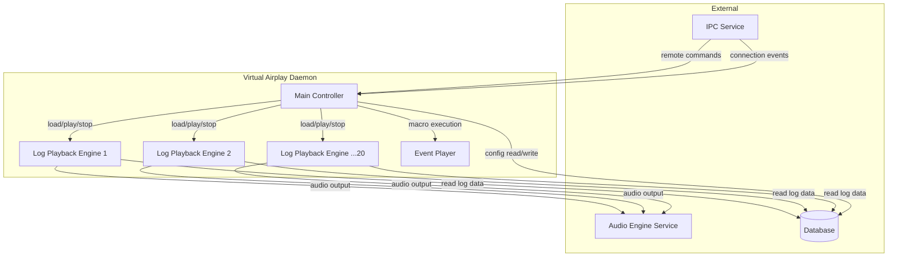
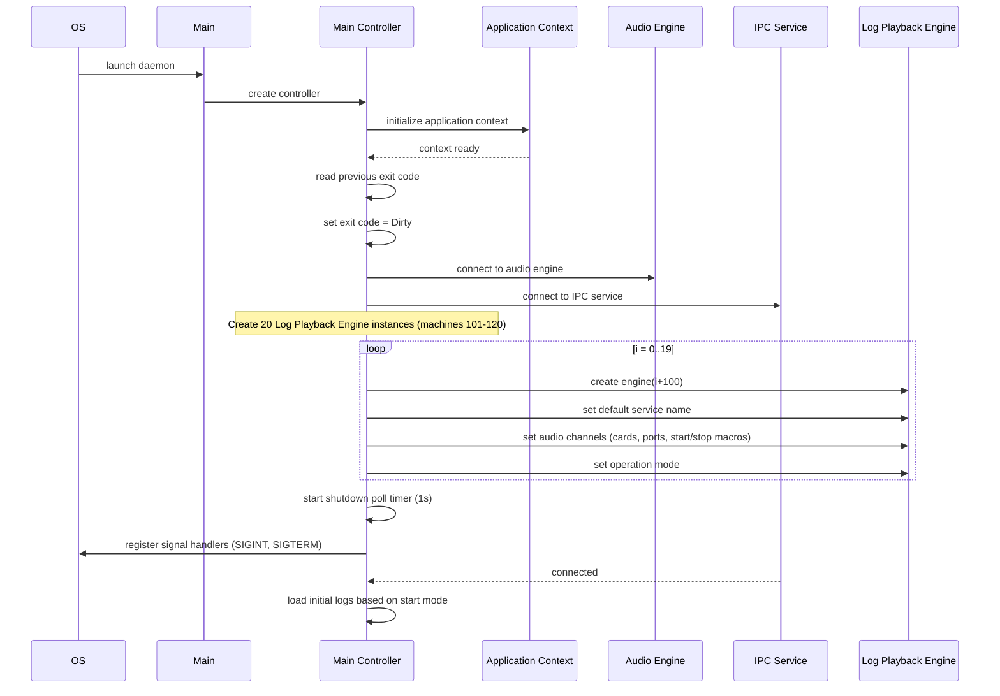
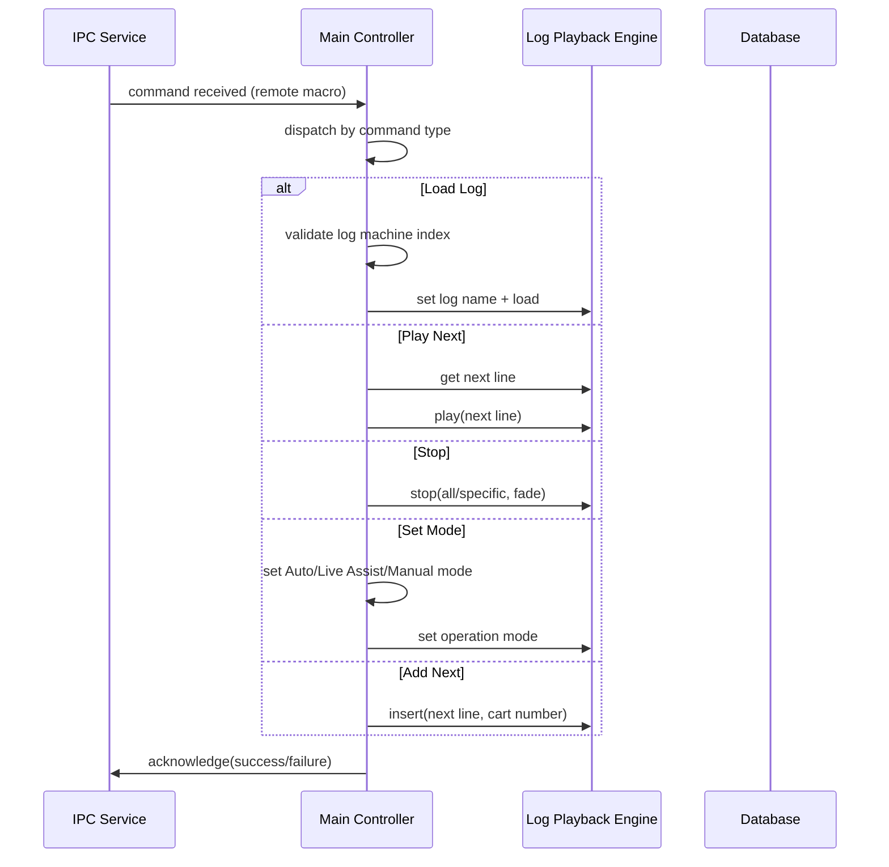
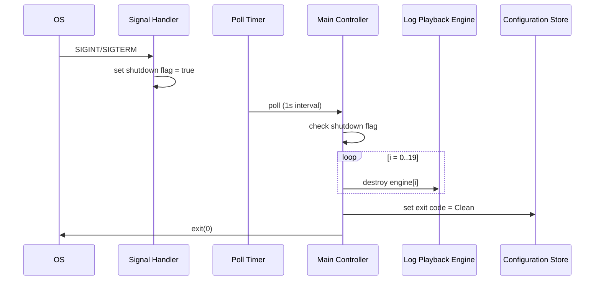
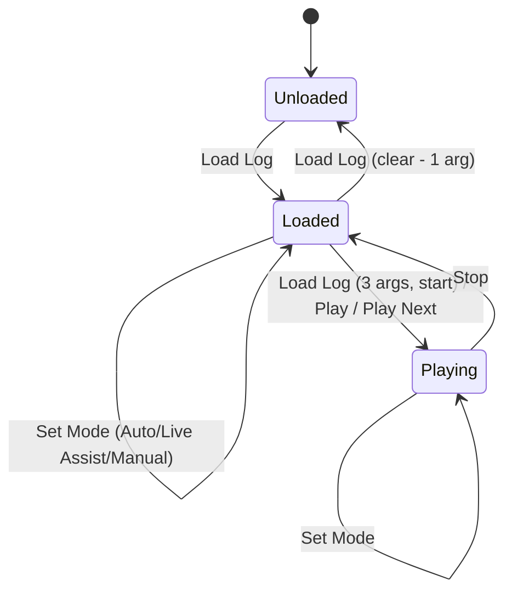
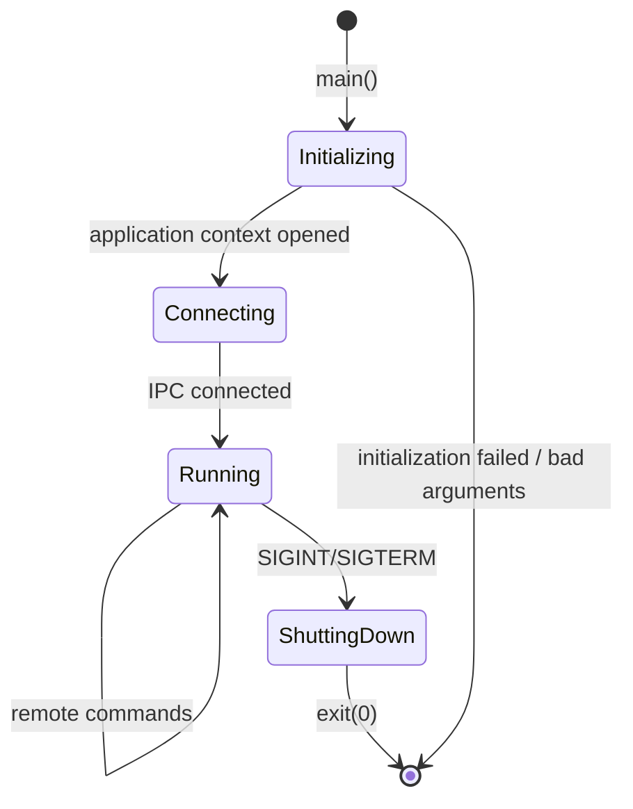
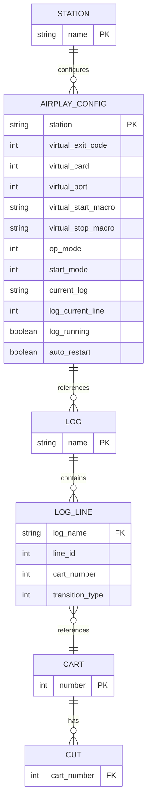

# Design Document: Virtual Airplay Daemon (VAD)

## Overview

The Virtual Airplay Daemon is a headless background service that manages 20 virtual log playback machines (numbered 101-120) within the Rivendell radio automation system. It receives remote macro commands over an IPC connection and delegates playback operations to log playback engine instances, enabling automated, unattended broadcast playout across multiple virtual channels.

**Purpose**: This service delivers automated log playback management to broadcast environments where multiple simultaneous playlists must be controlled remotely without a graphical interface.

**Users**: Broadcast automation systems (via remote macro commands), system administrators (lifecycle management), and broadcast engineers (configuration and monitoring).

**Impact**: Provides the "virtual airplay" capability complementing the interactive airplay application, enabling server-side automated playout that survives operator absence and recovers from crashes.

### Goals

- Manage 20 independent virtual log playback machines via remote commands
- Support crash recovery by resuming playback from last known state after unclean shutdown
- Accept and process the full set of remote macro commands for log management, playback control, mode setting, volume ducking, and cart insertion
- Validate audio hardware configuration at startup to prevent assignment to non-existent devices

### Non-Goals

- Graphical user interface (this is a headless daemon)
- Direct user interaction (all control is via remote macro commands)
- Audio encoding/decoding (delegated to the audio engine service)
- Log editing (logs are managed by other applications; this daemon only plays them)
- Platform-specific audio driver management (delegated to library layer)

## Architecture

### Architecture Pattern & Boundary Map

The daemon follows a single-process, event-driven architecture. A single controller object receives events from the IPC connection and dispatches operations to an array of log playback engine instances. The daemon has no UI layer.



**Architecture Integration**:
- Selected pattern: Single-controller event-driven daemon
- Domain boundaries: The daemon is purely an orchestrator; all log playback logic resides in the Log Playback Engine library component; all audio I/O resides in the Audio Engine service
- Existing patterns preserved: Event-driven command dispatch, IPC-based remote control
- New components rationale: None; this is a translation of existing architecture
- Steering compliance: N/A (steering is for a different target project)

### Technology Stack

| Layer | Choice | Role | Notes |
|-------|--------|------|-------|
| Runtime | TBD | Daemon process | Headless, no UI framework required |
| IPC | TBD | Receive remote macro commands | Must support the remote macro command protocol |
| Database | Relational (compatible with existing schema) | Configuration and log storage | Read-heavy; minimal direct writes |
| Audio | TBD | Audio output via audio engine service | Connection to audio engine service for playout |
| Process Management | OS service manager | Daemon lifecycle | Signal handling for graceful shutdown |

## System Flows

### Startup Sequence



### Remote Command Processing



### Graceful Shutdown



### State Machines

#### Log Machine State (per machine)



#### Daemon Lifecycle



## Requirements Traceability

| Requirement | Summary | Components | Interfaces | Flows |
|-------------|---------|------------|------------|-------|
| 1 | Daemon Lifecycle Management | Main Controller, Signal Handler | IPC connection, OS signals | Startup Sequence, Graceful Shutdown |
| 2 | Startup Log Loading and Crash Recovery | Main Controller, Configuration Store | IPC connection event, database queries | Startup Sequence |
| 3 | Log Machine Index Validation | Main Controller (index validator) | Remote command interface | Remote Command Processing |
| 4 | Log Loading and Unloading | Main Controller, Log Playback Engine | Remote command interface, database | Remote Command Processing |
| 5 | Playback Control | Main Controller, Log Playback Engine | Remote command interface | Remote Command Processing |
| 6 | Cart Insertion | Main Controller, Log Playback Engine | Remote command interface | Remote Command Processing |
| 7 | Operation Mode Control | Main Controller, Log Playback Engine | Remote command interface | Remote Command Processing |
| 8 | Volume Control (Ducking) | Main Controller, Log Playback Engine | Remote command interface | Remote Command Processing |
| 9 | Now/Next Notification Cart | Main Controller, Log Playback Engine | Remote command interface | Remote Command Processing |
| 10 | Audio Hardware Validation | Main Controller, Station Configuration | Configuration store | Startup Sequence |

## Components and Interfaces

| Component | Domain/Layer | Intent | Req Coverage | Key Dependencies | Contracts |
|-----------|-------------|--------|--------------|------------------|-----------|
| Main Controller | Core/Orchestration | Receives remote commands and dispatches to playback engines | 1-10 | Log Playback Engine, IPC Service, Configuration Store | Service, Event, State |
| Log Playback Engine | Core/Playback | Manages playback state and operations for a single log machine | 4, 5, 6, 8 | Audio Engine, Database | Service |
| Event Player | Core/Macro | Executes remote macro events | 4, 5 | Main Controller | Service |
| Configuration Store | Data/Config | Reads and writes daemon configuration (exit codes, start modes, audio assignments) | 1, 2, 10 | Database | Service |
| Signal Handler | Infrastructure/OS | Catches OS termination signals and sets shutdown flag | 1 | Main Controller | Event |

### Core / Orchestration

#### Main Controller

| Field | Detail |
|-------|--------|
| Intent | Central orchestrator that receives IPC events and remote macro commands, validates inputs, and dispatches operations to the appropriate log playback engine instances |
| Requirements | 1, 2, 3, 4, 5, 6, 7, 8, 9, 10 |

**Responsibilities & Constraints**
- Manages the lifecycle of 20 log playback engine instances
- Validates log machine index on every incoming command (must be 101-120 or special "all" address)
- Dispatches remote macro commands to the correct playback engine(s)
- Handles startup log loading based on configured start mode and previous exit state
- Manages dirty/clean exit code for crash recovery

**Dependencies**
- Inbound: IPC Service -- receives connection events, user change events, and remote macro commands (P0)
- Outbound: Log Playback Engine -- delegates all playback operations (P0)
- Outbound: Configuration Store -- reads/writes exit codes, start modes, audio configuration (P0)
- Outbound: Event Player -- delegates macro event execution (P1)
- External: Database -- direct query for log existence verification (P1)

**Contracts**: Service [x] / Event [x] / State [x]

##### Service Interface

```
interface MainControllerService {
  initialize(): Result<void, InitializationError>
  shutdown(): Result<void, ShutdownError>
  processCommand(command: RemoteMacroCommand): Result<Acknowledgment, CommandError>
  loadInitialLogs(): Result<void, LogLoadError>
}
```

- Preconditions: IPC connection established before command processing
- Postconditions: Each command results in an acknowledgment (positive or negative)
- Invariants: Exactly 20 log playback engines exist throughout daemon lifetime

##### Event Contract

- Subscribed events:
  - `ipc.connected(state: boolean)` -- triggers initial log loading
  - `ipc.commandReceived(command: RemoteMacroCommand)` -- triggers command dispatch
  - `ipc.userChanged()` -- currently no action (stub)
  - `engine[i].reloaded()` -- triggers post-reload setup (set next line, optionally start)
  - `timer.tick()` -- polls shutdown flag
- Published events: None (daemon does not publish events)

##### State Management

- State model: Each of the 20 log machines has independent state (Unloaded / Loaded / Playing)
- Persistence: Exit code, current log name, current line, and running state are persisted to the configuration store for crash recovery
- Concurrency: Single-threaded event loop; no concurrent access to log machine state

### Core / Playback

#### Log Playback Engine

| Field | Detail |
|-------|--------|
| Intent | Manages the playback lifecycle for a single virtual log machine, including loading, playing, stopping, appending, and refreshing logs |
| Requirements | 4, 5, 6, 8 |

**Responsibilities & Constraints**
- Loads and plays broadcast logs from the database
- Manages playback position (current line, next line)
- Supports cart insertion at next-play position
- Supports volume ducking with level and duration parameters
- One instance per virtual log machine (20 total)

**Dependencies**
- Inbound: Main Controller -- receives playback commands (P0)
- Outbound: Audio Engine Service -- sends audio output (P0)
- Outbound: Database -- reads log lines, cart data, cut data (P0)

**Contracts**: Service [x] / Event [x]

##### Service Interface

```
interface LogPlaybackEngineService {
  load(logName: string): Result<void, LogError>
  play(line: number, source: StartSource): Result<void, PlaybackError>
  stop(fadeDuration?: number): Result<void, StopError>
  append(logName: string): Result<void, LogError>
  refresh(): Result<void, LogError>
  insert(line: number, cartNumber: number, transitionType: TransitionType): Result<void, InsertError>
  makeNext(line: number): Result<void, LineError>
  setOpMode(mode: OperationMode): void
  setChannels(card: number, port: number, startMacro: string, stopMacro: string): void
  duck(level: number, duration: number, line?: number): void
  setNowCart(cartNumber: number): void
  setNextCart(cartNumber: number): void
  nextLine(): number
  setLogName(name: string): void
  setDefaultServiceName(name: string): void
}
```

##### Event Contract

- Published events:
  - `reloaded()` -- emitted when a log reload completes
  - `renamed()` -- emitted when a log is renamed
- Subscribed events: None

### Data / Configuration

#### Configuration Store

| Field | Detail |
|-------|--------|
| Intent | Provides read/write access to daemon configuration including exit codes, start modes, audio assignments, and per-machine state |
| Requirements | 1, 2, 10 |

**Responsibilities & Constraints**
- Reads startup configuration: start mode, current log, line position, running state, auto-restart flag
- Reads audio configuration: card, port, start/stop macros, operation mode per machine
- Writes exit code (dirty on startup, clean on shutdown)
- Reads station hardware configuration: card driver types, output counts

**Dependencies**
- Outbound: Database -- reads/writes RDAIRPLAY table, reads STATIONS table (P0)

**Contracts**: Service [x]

##### Service Interface

```
interface ConfigurationStoreService {
  getExitCode(): ExitCode
  setExitCode(code: ExitCode): void
  getStartMode(machine: number): StartMode
  getCurrentLog(machine: number): string
  getLogCurrentLine(machine: number): number
  isLogRunning(machine: number): boolean
  isAutoRestart(machine: number): boolean
  getLogName(machine: number): string
  getVirtualCard(machine: number): number
  getVirtualPort(machine: number): number
  getVirtualStartMacro(machine: number): string
  getVirtualStopMacro(machine: number): string
  getOpMode(machine: number): OperationMode
  getDefaultService(): string
  getCardDriverType(card: number): DriverType
  getCardOutputCount(card: number): number
}
```

## Data Models

### Domain Model

**Entities:**
- **Log Machine** (value object): Represents one of 20 virtual playback slots. Identified by machine number (101-120). Has state (Unloaded/Loaded/Playing), operation mode, and audio channel assignment.
- **Log**: A named playlist of log lines representing a broadcast schedule. Referenced by name.
- **Log Line**: A single entry in a log, referencing a cart with a transition type.
- **Cart**: An audio item that can be played. Referenced by cart number (up to 999999).

**Enumerations:**
- **Operation Mode**: Automatic, Live Assist, Manual
- **Start Mode**: Start Empty, Start Previous, Start Specified
- **Exit Code**: Clean, Dirty
- **Transition Type**: Play, Segue, Stop, No Transition

### Logical Data Model



### Physical Data Model

The daemon primarily accesses the following tables from the existing Rivendell schema. Only one direct SQL query is performed by the daemon itself (log existence check on the LOGS table). All other database access is delegated to library components.

**Direct access:**
- `LOGS` table: `SELECT NAME FROM LOGS WHERE NAME="{logname}"` (existence check only)

**Indirect access (via library):**
- `RDAIRPLAY`: Configuration read/write for virtual airplay settings
- `LOG_LINES`: Log content read by playback engine
- `CART`: Cart metadata read by playback engine
- `CUTS`: Cut data read by playback engine
- `STATIONS`: Station hardware configuration

## Error Handling

### Error Categories

**System Errors:**
- IPC connection failure: Daemon cannot start without IPC connectivity (fatal during initialization)
- Audio engine connection failure: Daemon proceeds but audio output is unavailable
- Database connectivity loss: Delegated to library error handling

**Business Logic Errors:**
- Invalid log machine number (outside 101-120): Command rejected with negative acknowledgment
- Non-existent log referenced: Command rejected with negative acknowledgment (for remote commands) or warning logged and skipped (for startup loading)
- Invalid cart number (greater than 999999): Command rejected with negative acknowledgment
- Line number exceeds log size after reload: Warning logged, position adjusted
- Log machine fails to start: Warning logged

### Logging

| Level | Condition | Message Pattern |
|-------|-----------|-----------------|
| WARNING | Log does not exist at startup | "vlog N: log X does not exist" |
| WARNING | Line exceeds log size after reload | "vlog N: line N does not exist in log X" |
| WARNING | Log machine fails to start | "log machine N failed to start" |
| INFO | Log loaded | "loaded log X into log machine N" |
| INFO | Log unloaded | "unloaded log machine N" |
| INFO | Playback started | "started log machine N at line N" |
| INFO | Playback stopped | "stopped log machine N" / "stopped all logs" |
| INFO | Mode changed | "log machine N mode set to Automatic/Live Assist/Manual" |
| INFO | Log appended | "appended log X into log machine N" |
| INFO | Next line set | "made line N next in log machine N" |
| INFO | Cart inserted | "inserted cart NNNNNN at line N on log machine N" |
| INFO | Log refreshed | "refreshed log machine N" |
| INFO | Now/Next cart set | "set default now/next cart to NNNNNN on log machine N" |
| INFO | Volume adjusted | "set volume of log machine N to N dBFS" |
| INFO | Clean exit | "exiting" |

## Testing Strategy

### E2E Tests

1. **Startup with Start Previous after dirty exit**: Verify the daemon loads the previous log and resumes at the saved position when the previous exit was dirty.
2. **Startup with Start Previous after clean exit**: Verify the daemon loads the previous log at line 0 without auto-starting.
3. **Startup with Start Specified**: Verify the daemon loads the configured log name.
4. **Startup with non-existent log**: Verify a warning is logged and the log is skipped.
5. **Full command cycle**: Load a log, start playback, insert a cart, stop with fade, unload.

### Integration Tests

1. **IPC connection and command dispatch**: Verify remote macro commands are received and dispatched to the correct log machine.
2. **Log existence verification**: Verify the daemon correctly queries the database for log existence before loading.
3. **Crash recovery flow**: Simulate a dirty exit code in the configuration store and verify the daemon resumes correctly.
4. **Audio hardware validation**: Verify machines with invalid card/port configurations are disabled.
5. **All-logs addressing**: Verify commands targeting "all logs" are applied to all 20 machines.

### Unit Tests

1. **Log machine index validation**: Valid range (101-120) returns correct index; out-of-range returns error; "all" address returns all flag.
2. **Load Log command parsing**: 1-arg clears, 2-arg loads, 3-arg with -2 conditionally starts based on transition type.
3. **Stop command with all-logs flag**: Verify stop is dispatched to all 20 engines.
4. **Set Mode command**: With machine specified sets one; without machine sets all.
5. **Add Next with empty log**: Verify cart is appended and made next.
6. **Card number validation**: Cart numbers above 999999 are rejected.
7. **Exit code management**: Dirty on startup, clean on shutdown.
8. **Conditional start based on transition type**: Play and Segue cause start; Stop and No Transition do not.
